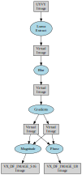

// Copyright (c) 2016-2018 Khronos Group. This work is licensed under a
// Creative Commons Attribution 4.0 International License; see
// http://creativecommons.org/licenses/by/4.0/

= The OpenVX^(TM)^ Specification
:regtitle: pass:q,r[^®^]
Editor: Radhakrishna Giduthuri, Intel; The Khronos{regtitle} OpenVX Working Group
:title-logo-image: images/Khronos_RGB.svg
:data-uri:
:icons: font
:toc2:
:toclevels: 4
:max-width: 100
:numbered:
:imagewidth: 800
:fullimagewidth: width="800"
:halfimagewidth: width="400"
:source-highlighter: coderay
// Various special / math symbols. This is easier to edit with than Unicode.
include::config/attribs.txt[]

// Paths to code examples and headers
:examples: examples
:headers: examples

image::images/OpenVX_RGB.svg[align="center",{halfimagewidth}]
include::copyright-spec.txt[]

<<<<

// Table of contents is inserted here
toc::[]

:leveloffset: 1

= Introduction

// To test simple markup things, set {test} = 1 and add them to the ifeval
// block below
:test: 0

ifeval::["{test}"=="1"]

endif::[]

ifeval::["{test}"!="1"]

[[sec_abstract]]
== Abstract

OpenVX is a low-level programming framework domain to enable software
developers to efficiently access computer vision hardware acceleration with
both functional and performance portability.
OpenVX has been designed to support modern hardware architectures, such as
mobile and embedded SoCs as well as desktop systems.
Many of these systems are parallel and heterogeneous: containing multiple
processor types including multi-core CPUs, DSP subsystems, GPUs, dedicated
vision computing fabrics as well as hardwired functionality.
Additionally, vision system memory hierarchies can often be complex,
distributed, and not fully coherent.
OpenVX is designed to maximize functional and performance portability across
these diverse hardware platforms, providing a computer vision framework that
efficiently addresses current and future hardware architectures with minimal
impact on applications.

OpenVX contains:

  * a library of predefined and customizable vision functions,
  * a graph-based execution model to combine function enabling both task and
    data-independent execution, and;
  * a set of memory objects that abstract the physical memory.

OpenVX defines a C Application Programming Interface (API) for building,
verifying, and coordinating graph execution, as well as for accessing memory
objects.
The graph abstraction enables OpenVX implementers to optimize the execution
of the graph for the underlying acceleration architecture.

OpenVX also defines the `vxu` utility library, which exposes each OpenVX
predefined function as a directly callable C function, without the need for
first creating a graph.
Applications built using the `vxu` library do not benefit from the
optimizations enabled by graphs; however, the vxu library can be useful as
the simplest way to use OpenVX and as first step in porting existing vision
applications.

As the computer vision domain is still rapidly evolving, OpenVX provides an
extensibility mechanism to enable developer-defined functions to be added to
the application graph.

[[sec_purpose]]
== Purpose

The purpose of this document is to detail the Application Programming
Interface (API) for OpenVX.

[[sec_scope]]
== Scope of Specification

The document contains the definition of the OpenVX API.
The conformance tests that are used to determine whether an implementation
is consistent to this specification are defined separately.

[[sec_normative]]
== Normative References

The section "`Module Documentation`" forms the normative part of the
specification.
Each API definition provided in that chapter has certain preconditions and
post conditions specified that are normative.
If these normative conditions are not met, the behavior of the function is
implementation-defined.

[[sec_versions]]
== Version/Change History

  * OpenVX 1.0 Provisional - November, 2013
  * OpenVX 1.0 Provisional V2 - June, 2014
  * OpenVX 1.0 - September 2014
  * OpenVX 1.0.1 - April 2015
  * OpenVX 1.1 - May 2016
  * OpenVX 1.2 - May 2017
  * OpenVX 1.2.1 - May 2018
  * OpenVX 1.3 - June 2019

[[sec_deprecation]]
== Deprecation

Certain items that are deprecated through the evolution of this
specification document are removed from it.
However, to provide a backward compatibility for such items for a certain
time period these items are made available via a compatibility header file
available with the release of this specification document
(VX/vx_compatibility.h).
The items listed in this compatibility header file are temporary only and
are removed permanently when the backward compatibility is no longer
supported for those items.

[[sec_requirements]]
== Normative Requirements

In this specification, the words _shall_ or _must_ express a requirement
that is binding, _should_ expresses design goals or recommended actions, and
_may_ expresses an allowed behavior.

All the implementation requirements imposed by the OpenVX API are tagged using
unique identifiers of the form `[*REQ-#*]`. These can be used to help maintain
requirement traceability throughout the implementation development process to assure
that they are documented and verified. The requirements which persist across specification
versions will retain the same requirement identifier.
New specification versions may add or remove requirements, therefore the tags in
this specification may not be in numerical order.

The requirement identifiers of any feature can be gathered by listing
requirements tags of the specific feature and its dependencies.

There is interest in creating implementations that target a particular set of features rather than
covering the entire OpenVX API. In order to offer this option while still managing the API to prevent
excessive fragmentation regarding which implementations offer which features,
the companion feature set document ("`vx_khr_feature_sets`") defines a collection of "`feature sets`"
that form coherent and useful subsets of the OpenVX API. Refer to the Khronos OpenVX registry for
for this document.

[[sec_typo]]
== Typographical Conventions

The following typographical conventions are used in this specification.

  * *Bold* words indicate warnings or strongly communicated concepts that
    are intended to draw attention to the text.
  * `Monospace` words signify an API element (i.e., class, function,
    structure) or a filename.
  * _Italics_ denote an emphasis on a particular concept, an abstraction of
    a concept, or signify an argument, parameter, or member.
  * Throughout this specification, code examples given to highlight a
    particular issue use the format as shown below:
+
--
[source,c]
--------------------------------------
/* Example Code Section */
int main(int argc, char *argv[])
{
   return 0;
}
--------------------------------------
--
  * Some "`mscgen`" message diagrams are included in this specification.
    The graphical conventions for this tool can be found on
    http://www.mcternan.me.uk/mscgen/[its website].

[[sec_naming_conventions]]
=== Naming Conventions

The following naming conventions are used in this specification.

  * Opaque objects and atomics are named as `vx___object__`, e.g.,
    `<<vx_image>>` or `<<vx_uint8>>`, with an underscore separating the
    object name from the "`vx`" prefix.
  * Defined Structures are named as `vx___struct___t`, e.g.,
    `<<vx_imagepatch_addressing_t>>`, with underscores separating the
    structure from the "`vx`" prefix and a "`t`" to denote that it is a
    structure.
  * Defined Enumerations are named as `vx___enum___e`, e.g.,
    `<<vx_type_e>>`, with underscores separating the enumeration from the
    "`vx`" prefix and an "`e`" to denote that it is an enumerated value.
  * Application Programming Interfaces are named `vx__someFunction__`()
    using camel case, starting with lowercase, and no underscores, e.g.,
    `<<vxCreateContext>>()`.
  * Vision functions also have a naming convention that follows a
    lower-case, inverse dotted hierarchy similar to Java Packages, e.g.,
+
--
[source,c]
--------------------------------------
"org.khronos.openvx.color_convert"
--------------------------------------
--

This minimizes the possibility of name collisions and promotes sorting and
readability when querying the namespace of available vision functions.
Each vision function should have a unique dotted name of the style:
_tld.vendor.library.function_.
The hierarchy of such vision function namespaces is implementation-defined outside the
subdomain "`org.khronos`", but they do follow existing international
standards.
For OpenVX-specified vision functions, the "`function`" section of the
unique name does not use camel case and uses underscores to separate words.

[[sec_vendor_naming_conventions]]
=== Vendor Naming Conventions

The following naming conventions are to be used for vendor specific
extensions.

  * Opaque objects and atomics are named as `vx___object_vendor__`, e.g.,
    `vx_ref_array_acme`, with an underscore separating the vendor name from
    the object name.
  * Defined Structures are named as `vx___struct_vendor___t`, e.g.,
    `vx_mdview_acme_t`, with an underscore separating the vendor from the
    structure name and a "`t`" to denote that it is a structure.
  * Defined Enumerations are named as `vx___enum_vendor___e`, e.g.,
    `vx_convolution_name_acme_e`, with an underscores separating the vendor
    from the enumeration name and an "`e`" to denote that it is an
    enumerated value.
  * Defined Enumeration values are named as `VX___ENUMVALUE_VENDOR__`, e.g.,
    `VX_PARAM_STRUCT_ATTRIBUTE_SIZE_ACME` using only capital letters staring
    with the "`VX`" prefix, and underscores separating the words.
  * Application Programming Interfaces are named
    `vx__SomeFunctionVendor__`() using camel case, starting with lowercase,
    and no underscores, e.g., `vxCreateRefArrayAcme()`.

[[sec_glossary]]
== Glossary and Acronyms

Atomic::
    The specification mentions _atomics_, which means a C primitive data
    type.
    Usages that have additional wording, such as _atomic operations_ do not
    carry this meaning.
API::
    Application Programming Interface that specifies how a software
    component interacts with another.
Engine::
    A purpose-specific software abstraction that is tunable by users.
Framework::
    A generic software abstraction in which users can override behaviors to
    produce application-specific functionality.
Kernel::
    OpenVX uses the term _kernel_ to mean an abstract _computer vision
    function_, not an Operating System kernel.
    Kernel may also refer to a set of convolution coefficients in some
    computer vision literature (e.g., the Sobel "`kernel`").
    OpenVX does not use this meaning.
    OpenCL uses kernel (specifically `cl_kernel`) to qualify a function
    written in "`CL`" which the OpenCL may invoke directly.
    This is close to the meaning OpenVX uses; however, OpenVX does not
    define a language.
Run-time::
    The execution phase of a program.
"implementation-defined"::
    The behavior of the implementation under the conditions described is not specified by the OpenVX API.
    In such cases, the implementation developer is free to determine the behavior.
"forbidden"::
    Applications should make sure that the condition described is not used.

[[sec_acknowledgements]]
== Acknowledgements

This specification would not be possible without the contributions from this
partial list of the following individuals from the Khronos Working Group and
the companies that they represented at the time:

  * Erik Rainey - Amazon
  * Radhakrishna Giduthuri - Intel
  * Mikael Bourges-Sevenier - Aptina Imaging Corporation
  * Dave Schreiner - ARM Limited
  * Renato Grottesi - ARM Limited
  * Hans-Peter Nilsson - Axis Communications
  * Amit Shoham - BDTi
  * Frank Brill - Cadence Design Systems
  * Thierry Lepley - Cadence Design Systems
  * Shorin Kyo - Huawei
  * Paul Buxton - Imagination Technologies
  * Steve Ramm - Imagination Technologies
  * Ben Ashbaugh - Intel
  * Mostafa Hagog - Intel
  * Andrey Kamaev - Intel
  * Yaniv klein - Intel
  * Andy Kuzma - Intel
  * Tomer Schwartz - Intel
  * Alexander Alekhin - Itseez
  * Roman Donchenko - Itseez
  * Victor Erukhimov - Itseez
  * Vadim Pisarevsky - Itseez
  * Vlad Vinogradov - Itseez
  * Cormac Brick - Movidius Ltd
  * Anshu Arya - MulticoreWare
  * Shervin Emami - NVIDIA
  * Kari Pulli - NVIDIA
  * Neil Trevett - NVIDIA
  * Daniel Laroche - NXP Semiconductors
  * Susheel Gautam - QUALCOMM
  * Doug Knisely - QUALCOMM
  * Tao Zhang - QUALCOMM
  * Yuki Kobayashi - Renesas Electronics
  * Andrew Garrard - Samsung Electronics
  * Erez Natan - Samsung Electronics
  * Tomer Yanir - Samsung Electronics
  * Chang-Hyo Yu - Samsung Electronics
  * Olivier Pothier - STMicroelectronics International NV
  * Chris Tseng - Texas Instruments, Inc.
  * Jesse Villareal - Texas Instruments, Inc.
  * Jiechao Nie - Verisilicon.Inc.
  * Shehrzad Qureshi - Verisilicon.Inc.
  * Xin Wang - Verisilicon.Inc.
  * Stephen Neuendorffer - Xilinx, Inc.

// file: 01_design_overview.txt

[[page_design]]
= Design Overview

[[sec_overview]]
== Software Landscape

OpenVX is intended to be used either directly by applications or as the
acceleration layer for higher-level vision frameworks, engines or platform
APIs.

.OpenVX Usage Overview

[[sec_design_objective]]
== Design Objectives

OpenVX is designed as a framework of standardized computer vision functions
able to run on a wide variety of platforms and potentially to be accelerated
by a vendor's implementation on that platform.
OpenVX can improve the performance and efficiency of vision applications by
providing an abstraction for commonly-used vision functions and an
abstraction for aggregations of functions (a "`graph`"), thereby providing
the implementer the opportunity to minimize the run-time overhead.

The functions in OpenVX are intended to cover common functionality required
by many vision applications.

[[sec_sub_optimizations]]
=== Hardware Optimizations

This specification makes no statements as to which acceleration methodology
or techniques may be used in its implementation.
Vendors may choose any number of implementation methods such as parallelism
and/or specialized hardware offload techniques.

This specification also makes no statement or requirements on a "`level of
performance`" as this may vary significantly across platforms and use cases.

[[sec_design_hw_limitations]]
=== Hardware Limitations

The OpenVX focuses on vision functions that can be significantly accelerated
by diverse hardware.
Future versions of this specification may adopt additional vision functions
into the core standard when hardware acceleration for those functions
becomes practical.

[[sec_assumptions]]
== Assumptions

[[sec_portability]]
=== Portability

OpenVX has been designed to maximize functional and performance portability
wherever possible, while recognizing that the API is intended to be used on
a wide diversity of devices with specific constraints and properties.
Tradeoffs are made for portability where possible: for example, portable
Graphs constructed using this API should work on any OpenVX implementation
and return similar results within the precision bounds defined by the OpenVX
conformance tests.

The portability may be compromised in situations that are identified as
"implementation-defined" in this specification.

[[sec_opaque]]
=== Opaqueness

OpenVX is intended to address a very broad range of devices and platforms,
from deeply embedded systems to desktop machines and distributed computing
architectures.
The OpenVX API addresses this range of possible implementations without
forcing hardware-specific requirements onto any particular implementation
via the use of _opaque_ objects for most program data.

All data, except client-facing structures, are opaque and hidden behind a
reference that may be as thin or thick as an implementation needs.
Each implementation provides the standardized interfaces for accessing data
that takes care of specialized hardware, platform, or allocation
requirements.
Memory that is _imported_ or _shared_ from other APIs is not subsumed by
OpenVX and is still maintained and accessible by the originator.

OpenVX does not dictate any requirements on memory allocation methods or the
layout of opaque memory objects and it does not dictate byte packing or
alignment for structures on architectures.

[[sec_framework]]
== Object-Oriented Behaviors

OpenVX objects are both strongly typed at compile-time for safety-critical
applications and are strongly typed at run-time for dynamic applications.
Each object has its typedef'd type and its associated enumerated value in
the `<<vx_type_e>>` list.
Any object may be down-cast to a `<<vx_reference>>` safely to be used in
functions that require this, specifically `<<vxQueryReference>>`, which can
be used to get the `<<vx_type_e>>` value using an `<<vx_enum>>`.

[[sec_framework_objects]]
== OpenVX Framework Objects

This specification defines the following OpenVX framework objects.

  * <<group_context>> - The OpenVX context is the object domain for all
    OpenVX objects.
    All data objects _live_ in the context as well as all framework objects.
    The OpenVX context keeps reference counts on all objects and must do
    garbage collection during its deconstruction to free lost references.
    While multiple clients may connect to the OpenVX context, all data are
    private in that the references that refer to data objects are given only
    to the creating party.
    The results of calling an OpenVX function on data objects created in
    different contexts are implementation-defined.
  * <<group_kernel>> - A Kernel in OpenVX is the abstract representation of
    a computer vision function, such as a "`Sobel Gradient`" or "`Lucas
    Kanade Feature Tracking`".
    A vision function may implement many similar or identical features from
    other functions, but it is still considered a single, unique kernel as
    long as it is named by the same string and enumeration and conforms to
    the results specified by OpenVX.
    Kernels are similar to function signatures in this regard.
  * <<group_parameter>> - An abstract input or output data
    object passed to a computer vision function.
    This object contains the signature of that parameter's usage from the
    kernel description.
    This information includes:
  ** _Signature Index_ - The numbered index of the parameter in the
     signature.
  ** _Object Type_ - e.g. `<<VX_TYPE_IMAGE,VX_TYPE_IMAGE>>`, or `<<VX_TYPE_ARRAY,VX_TYPE_ARRAY>>`, or
     some other object type from `<<vx_type_e>>`.
  ** _Usage Model_ - e.g. `<<VX_INPUT,VX_INPUT>>` or `<<VX_OUTPUT,VX_OUTPUT>>`.
  ** _Presence State_ - e.g. `<<VX_PARAMETER_STATE_REQUIRED,VX_PARAMETER_STATE_REQUIRED>>`, or
     `<<VX_PARAMETER_STATE_OPTIONAL,VX_PARAMETER_STATE_OPTIONAL>>`.
  * <<group_node>> - A node is an instance of a kernel that will be paired
    with a specific set of references (the parameters).
    Nodes are created from and associated with a single graph only.
    When a `<<vx_parameter>>` is extracted from a Node, an additional
    attribute can be accessed:
  ** _Reference_ - The `<<vx_reference>>` assigned to this parameter index
    from the Node creation function (e.g., `<<vxSobel3x3Node>>`).
  * <<group_graph>> - A set of nodes connected in a directed (only goes
    one-way) acyclic (does not loop back) fashion.
    A Graph may have sets of Nodes that are unconnected to other sets of
    Nodes within the same Graph.
    See <<sub_graphs_rules>>.

[[sec_data_objects]]
== OpenVX Data Objects

Data objects are object that are processed by graphs in nodes.

  * <<group_array>> An opaque array object that could be an array of
    primitive data types or an array of structures.
  * <<group_convolution>> An opaque object that contains an [eq]#M {times}
    N# matrix of `<<vx_int16>>` values.
    Also contains a scaling factor for normalization.
    Used specifically with `<<vxuConvolve>>` and `<<vxConvolveNode>>`.
  * <<group_delay>> An opaque object that contains a manually controlled,
    temporally-delayed list of objects.
  * <<group_distribution>> An opaque object that contains a frequency
    distribution (e.g., a histogram).
  * <<group_image>> An opaque image object that may be some format in
    `<<vx_df_image_e>>`.
  * <<group_lut>> An opaque lookup table object used with
    `<<vxTableLookupNode>>` and `<<vxuTableLookup>>`.
  * <<group_matrix>> An opaque object that contains an [eq]#M {times} N#
    matrix of some scalar values.
  * <<group_pyramid>> An opaque object that contains multiple levels of
    scaled `<<vx_image>>` objects.
  * <<group_remap>> An opaque object that contains the map of source points
    to destination points used to transform images.
  * <<group_scalar>> An opaque object that contains a single primitive data
    type.
  * <<group_threshold>> An opaque object that contains the thresholding
    configuration.
  * <<group_object_array>> An opaque array object that could be an array of
    any data-object (not data-type) of OpenVX except Delay and ObjectArray
    objects.
  * <<group_object_tensor>> An opaque multidimensional data object.
    Used in functions like `<<vxHOGFeaturesNode>>`, `<<vxHOGCellsNode>>` and
    the Neural Networks extension.

[[sec_errors]]
== Error Objects

Error objects are specialized objects that may be returned from other object
creator functions when serious platform issue occur (i.e., out of memory or
out of handles).
These can be checked at the time of creation of these objects, but checking
also may be put-off until usage in other APIs or verification time, in which
case, the implementation must return appropriate errors to indicate that an
invalid object type was used.

[source,c]
--------------------------------------
vx_<object> obj = vxCreate<Object>(context, ...);
vx_status status = vxGetStatus((vx_reference)obj);
if (status == VX_SUCCESS) {
    // object is good
}
--------------------------------------

[[sub_graphs]]
== Graphs Concepts

The _graph_ is the central computation concept of OpenVX.
The purpose of using graphs to express the Computer Vision problem is to
allow for the possibility of any implementation to maximize its optimization
potential because all the operations of the graph and its dependencies are
known ahead of time, before the graph is processed.

Graphs are composed of one or more _nodes_ that are added to the graph
through node creation functions.
Graphs in OpenVX must be created ahead of processing time and verified by
the implementation, after which they can be processed as many times as
needed.

[[sub_graph_linking]]
=== Linking Nodes

Graph Nodes are linked together via data dependencies with _no
explicitly-stated ordering_.
The same reference may be linked to other nodes.
Linking has a limitation, however, in that only one node in a graph may
output to any specific data object reference.
That is, only a single writer of an object may exist in a given graph.
This prevents indeterminate ordering from data dependencies.
All writers in a graph shall produce output data before any reader of that
data accesses it.

[[sec_data_virtual]]
=== Virtual Data Objects

Graphs in OpenVX depend on data objects to link together nodes.
When clients of OpenVX know that they do not need access to these
_intermediate_ data objects, they may be created as `virtual`.
Virtual data objects can be used in the same manner as non-virtual data
objects to link nodes of a graph together; however, virtual data objects are
different in the following respects.

  * Inaccessible - No calls to an Map/Unmap or Copy APIs shall succeed given
    a reference to an object created through a virtual create function from
    a Graph external perspective.
    Calls to Map/Unmap or Copy APIs from within client-defined node that
    belongs to the same graph as the virtual object will succeed as they are
    Graph internal.
  * Scoped - Virtual data objects are scoped within the Graph in which they
    are created; they cannot be shared outside their scope.
    The live range of the data content of a virtual data object is limited
    to a single graph execution.
    In other word, data content of a virtual object is implementation-defined before
    graph execution and no data of a virtual object should be expected to be
    preserved across successive graph executions by the application.
  * Intermediates - Virtual data objects should be used only for
    intermediate operations within Graphs, because they are fundamentally
    inaccessible to clients of the API.
  * Dimensionless or Formatless - Virtual data objects may have dimensions
    and formats partially or fully undefined at creation time.
    For instance, a virtual image can be created with undefined or partially
    defined dimensions (0x0, Nx0 or 0xN where N is not null) and/or without
    defined format (`<<VX_DF_IMAGE_VIRT,VX_DF_IMAGE_VIRT>>`).
    The undefined property of the virtual object at creation time is
    implementation-defined with regard to the graph and mutable at graph verification
    time; it will be automatically adjusted at each graph verification,
    deduced from the node that outputs the virtual object.
    Dimensions and format properties that are well defined at virtual object
    creation time are immutable and can't be adjusted automatically at graph
    verification time.
  * Attributes - Even if a given Virtual data object does not have its
    dimensionality or format completely defined, these attributes may still
    be queried.
    If queried before the object participates in a graph verification, the
    attribute value returned is what the user provided (e.g., "`0`" for the
    dimension).
    If queried after graph verification (or re-verification), the attribute
    value returned will be the value determined by the graph verification
    rules.
  * The Dimensionless or Formatless aspect of virtual data is a commodity
    that allows creating graphs generic with regard to dimensions or format,
    but there are restrictions:
  .. Nodes may require the dimensions and/or the format to be defined for a
     virtual output object when it can't be deduced from its other
     parameters.
     For example, a Scale node requires well defined dimensions for the
     output image, while ColorConvert and ChannelCombine nodes require a
     well defined format for the output image.
  .. An image created from ROI must always be well defined (`vx_rectangle_t`
     parameter) and can't be created from a dimensionless virtual image.
  .. A ROI of a formatless virtual image shouldn't be a node output.
  .. A tensor created from View must always be well defined and can't be
     created from a dimensionless virtual tensor.
  .. A view of a formatless virtual tensor shouldn't be a node output.
  .. Levels of a dimensionless or formatless virtual pyramid shouldn't be a
     node output.
  * Inheritance - A sub-object inherits from the virtual property of its
    parent.
    A sub-object also inherits from the Dimensionless or Formatless property
    of its parent with restrictions:
  .. it is adjusted automatically at graph verification when the parent
     properties are adjusted (the parent is the output of a node)
  .. it can't be adjusted at graph verification when the sub-object is
     itself the output of a node.
  * Optimizations - Virtual data objects do not have to be created during
    Graph validation and execution and therefore may be of zero _size_.

These restrictions enable vendors the ability to optimize some aspects of
the data object or its usage.
Some vendors may not allocate such objects, some may create intermediate
sub-objects of the object, and some may allocate the object on remote,
inaccessible memories.
OpenVX does not proscribe _which_ optimization the vendor does, merely that
it _may_ happen.

[[sub_node_parameters]]
=== Node Parameters

Parameters to node creation functions are defined as either atomic types,
such as `<<vx_int32>>`, `<<vx_enum>>`, or as objects, such as
`<<vx_scalar>>`, `<<vx_image>>`.
The atomic variables of the Node creation functions shall be converted by
the framework into `<<vx_scalar>>` references for use by the Nodes.
A node parameter of type `<<vx_scalar>>` can be changed during the graph
execution; whereas, a node parameter of an atomic type (`<<vx_int32>>` etc.)
require at least a graph revalidation if changed.
All node parameter objects may be modified by retrieving the reference to
the `<<vx_parameter>>` via `<<vxGetParameterByIndex>>`, and then passing
that to `<<vxQueryParameter>>` to retrieve the reference to the object.

[source,c,indent=0]
----
include::{examples}/vx_parameters.c[tag=getting_ref]
----

If the type of the parameter is unknown, it may be retrieved with the same
function.

[source,c,indent=0]
----
include::{examples}/vx_parameters.c[tag=getting_type]
----

[[sub_graph_parameters]]
=== Graph Parameters

Parameters may exist on Graphs, as well.
These parameters are defined by the author of the Graph and each Graph
parameter is defined as a specific parameter from a Node within the Graph
using `<<vxAddParameterToGraph>>`.
Graph parameters communicate to the implementation that there are specific
Node parameters that may be modified by the client between Graph executions.
Additionally, they are parameters that the client may set without the
reference to the Node but with the reference to the Graph using
`<<vxSetGraphParameterByIndex>>`.
This allows for the Graph authors to construct _Graph Factories_.
How these factories work falls outside the scope of this document.

See <<group_graph_parameters>>.

[[sub_graphs_execution]]
=== Execution Model

Graphs must execute in both:

  * _Synchronous blocking mode_ (in that `<<vxProcessGraph>>` will block
    until the graph has completed), and in
  * _Asynchronous single-issue-per-reference mode_ (via
    `<<vxScheduleGraph>>` and `<<vxWaitGraph>>`).

[[sub_graphs_execution_asynch]]
==== Asynchronous Mode

In asynchronous mode, Graphs must be single-issue-per-reference.
This means that given a constructed graph reference [eq]#G#, it may be
scheduled multiple times but only executes sequentially with respect to
itself.
Multiple graphs references given to the asynchronous graph interface do not
have a defined behavior and may execute in parallel or in series based on
the behavior or the vendor's implementation.

[[sub_graphs_rules]]
=== Graph Formalisms

To use graphs several rules must be put in place to allow deterministic
execution of Graphs.
The behavior of a [eq]#`processGraph`(G)# call is determined by the
structure of the Processing Graph [eq]#G#.
The Processing Graph is a bipartite graph consisting of a set of Nodes
[eq]#N~1~ {ldots} N~n~# and a set of data objects [eq]#d~1~ {ldots} d~i~#.
Each edge [eq]#(N~x~,D~y~)# in the graph represents a data object [eq]#D~y~#
that is written by Node [eq]#N~x~# and each edge [eq]#(D~x~,N~y~)#
represents a data object [eq]#D~x~# that is read by Node [eq]#N~y~#.
Each edge [eq]#e# has a name [eq]#`Name`(e)#, which gives the parameter name
of the node that references the corresponding data object.
Each Node Parameter also has a type `Type(node, name)` in `{INPUT, OUTPUT}`.
Some data objects are _Virtual_, and some data objects are _Delay_.
Delay data objects are just collections of data objects with indexing (like
an image list) and known linking points in a graph.
A node may be classified as a _head node_, which has no backward dependency.
Alternatively, a node may be a _dependent node_, which has a backward
dependency to the head node.
In addition, the Processing Graph has several restrictions:

  . _Output typing_ - Every output edge [eq]#(N~x~,D~y~)# requires
    [eq]#`Type`(N~x~, `Name`(N~x~,D~y~))# in `{OUTPUT}`
  . _Input typing_ - Every input edge [eq]#(D~x~,N~y~)# requires
    [eq]#`Type`(N~y~, `Name`(D~x~,N~y~))# in `{INPUT}`
  . _Single Writer_ - Every data object is the target of at most one output
    edge.
  . _Broken Cycles_ - Every cycle in [eq]#G# must contain at least input
    edge [eq]#(D~x~,N~y~)# where [eq]#D~x~# is Delay.
  . _Virtual images must have a source_ - If [eq]#D~y~# is Virtual, then
    there is at least one output edge that writes [eq]#D~y~(N~x~,D~y~)#
  . _Delay data objects shall not be virtual_ - If [eq]#D~x~# is Delay then
    it shall not be Virtual.
  . _A uniform image cannot be output_.

The execution of each node in a graph consists of an atomic operation
(sometimes referred to as _firing_) that consumes data representing each
input data object, processes it, and produces data representing each output
data object.
A node may execute when all of its input edges are marked _present_.
Before the graph executes, the following initial marking is used:

  * All input edges [eq]#(D~x~,N~y~)# from non-Virtual objects [eq]#D~x~#
    are marked (parameters must be set).
  * All input edges [eq]#(D~x~,N~y~)# with an output edge [eq]#(N~z~,D~x~)#
    are unmarked.
  * All input edges [eq]#(D~x~,N~y~)# where [eq]#D~x~# is a Delay data
    object are marked.

Processing a node results in unmarking all the corresponding input edges and
marking all its output edges; marking an output edge [eq]#(N~x~,D~y~)# where
[eq]#D~y~# is not a Delay results in marking all of the input edges
[eq]#(D~y~,N~z~)#.
Following these rules, it is possible to statically schedule the nodes in a
graph as follows: Construct a precedence graph [eq]#P#, including all the
nodes [eq]#N~1~ {ldots} N~x~#, and an edge [eq]#(N~x~,N~z~)# for every pair
of edges [eq]#(N~x~,D~y~)# and [eq]#(D~y~,N~z~)# where [eq]#D~y~# is not a
Delay.
Then unconditionally fire each node according to any topological sort of
[eq]#P#.

The following assertions should be verified:

  * [eq]#P# is a Directed Acyclic Graph (DAG), implied by 4 and the way it
    is constructed.
  * Every data object has a value when it is executed, implied by 5, 6, 7,
    and the marking.
  * Execution is deterministic if the nodes are deterministic, implied by 3,
    4, and the marking.
  * Every node completes its execution exactly once.

The execution model described here just acts as a formalism.
For example, independent processing is allowed across multiple depended and
depending nodes and edges, provided that the result is invariant with the
execution model described here.

[[sub_graphs_rules_data_obj]]
==== Contained & Overlapping Data Objects

There are cases in which two different data objects referenced by an output
parameter of node [eq]#N~1~# and input parameter of node [eq]#N~2~# in a
graph induce a dependency between these two nodes: For example, a pyramid
and its level images, image and the sub-images created from it by
`<<vxCreateImageFromROI>>` or `<<vxCreateImageFromChannel>>`, or overlapping
sub-images of the same image
or objects created from externally allocated buffers with overlap.
If a graph uses objects created from externally allocated buffers with overlap,
the behavior of graph verification and/or graph execution is implementation-defined.
Following figure show examples of this dependency.
To simplify subsequent definitions and requirements a limitation is imposed
that if a sub-image [eq]#I^'^# has been created from image [eq]#I# and
sub-image [eq]#I^''^# has been created from [eq]#I^'^#, then [eq]#I^''^# is
still considered a sub-image of [eq]#I# and not of [eq]#I^'^#.
In these cases it is expected that although the two nodes reference two
different data objects, any change to one data object might be reflected in
the other one.
Therefore it implies that [eq]#N~1~# comes before [eq]#N~2~# in the graph's
topological order.
To ensure that, following definitions are introduced.

// @width 6cm
.Pyramid Example

.Image Example

  . _Containment Set_ - _C(d)_, the set of recursively contained data
    objects of _d_, named _Containment Set_, is defined as follows:
  ** [eq]#C~0~(_d_) = {_d_}#
  ** [eq]#C~1~(_d_)# is the set of all data objects that are _directly
     contained_ by _d_:
  *** If _d_ is an image, all images created from an ROI or channel of _d_
      are directly contained by _d_.
  *** If _d_ is a pyramid, all pyramid levels of _d_ are directly contained
      by _d_.
  *** If _d_ is an object array, all elements of _d_ are directly contained
      by _d_.
  *** If _d_ is a delay object, all slots of _d_ are directly contained by
      _d_.
  ** For [eq]#i > 1#, [eq]#C~i~(d)# is the set of all data objects that are
     contained by _d_ at the _i^th^_ order
+
--
  :: latexmath:[C_i(d)=\bigcup_{d'\in{C_{i-1}(d)}}C_1(d')]
--
  ** C(_d_) is the set that contains _d_ itself, the data objects
     _contained_ by _d_, the data objects that are contained by the data
     objects contained by _d_ and so on.
     Formally:
+
--
  :: latexmath:[C(d)=\bigcup_{i=0}^{\infty}C_i(d)]
--
  . _I(d)_ is a predicate that equals true if and only if _d_ is an image.
  . _Overlapping Relationship_ - The overlapping relation [eq]#R~ov~# is a
    relation defined for images, such that if [eq]#i~1~# and [eq]#i~2~# in
    _C(i)_, _i_ being an image, then [eq]#i~1~ R~ov~ i~2~# is true if and
    only if [eq]#i~1~# and [eq]#i~2~# overlap, i.e there exists a point
    (x,y) of _i_ that is contained in both [eq]#i~1~# and [eq]#i~2~#.
    Note that this relation is reflexive and symmetric, but not transitive:
    [eq]#i~1~# overlaps [eq]#i~2~# and [eq]#i~2~# overlaps [eq]#i~3~# does
    not necessarily imply that [eq]#i~1~# overlaps [eq]#i~3~#, as
    illustrated in the following figure:
+
--
// @width 7cm
.Overlap Example

--
  . _Dependency Relationship_ - The dependency relationship [eq]#N~1~
    {rightarrow} N~2~#, is a relation defined for nodes.
    [eq]#N~1~ {rightarrow} N~2~# means that [eq]#N~2~# depends on [eq]#N~1~#
    and then implies that [eq]#N~2~# must be executed after the completion
    of [eq]#N~1~#.
  . [eq]#N~1~ {rightarrow} N~2~# if [eq]#N~1~# writes to a data object
    [eq]#d~1~# and [eq]#N~2~# reads from a data object [eq]#d~2~# and:
+
--
// Without escaped spaces, space before \\in macros, \text around conjunctions: +
// latexmath:[d_1 \in{C(d_2)} \text{ or } d_2 \in{C(d_1)} \text{ or } (I(d_1)
// \text{ and } I(d_2) \text{ and } d_1 R_{ov} d_2)]
//
// In asciidoc markup: +
// _#d~1~ {elem} C(d~2~) or d~2~ {elem} C(d~1~) or (I(d~1~) and I(d~2~) and
// d~1~ R~ov~ d~2~#_

  :: [eq]#d~1~ {elem} C(d~2~) or d~2~ {elem} C(d~1~) or (I(d~1~) and I(d~2~)
          and d~1~ R~ov~ d~2~)#
--

If data object [eq]#D~y~# of an output edge [eq]#(N~x~,D~y~)# overlaps with
a data object [eq]#D~z~# then the result is implementation-defined.

[[sec_graph_indep]]
=== Node Execution Independence

In the following example a client computes the gradient magnitude and
gradient phase from a blurred input image.
The `<<vxMagnitudeNode>>` and `<<vxPhaseNode>>` are _independently_
computed, in that each does not depend on the output of the other.
OpenVX does not mandate that they are run simultaneously or in parallel, but
it could be implemented this way by the OpenVX vendor.

.A simple graph with some independent nodes.

The code to construct such a graph can be seen below.

[source,c,indent=0]
----
include::{examples}/vx_independent.c[tag=independent]
----

[[sec_graph_verification]]
=== Verification

Graphs within OpenVX must go through a rigorous validation process before
execution to satisfy the design concept of eliminating run-time overhead
(parameter checking) that guarantees safe execution of the graph.
OpenVX must check for (but is not limited to) these conditions:

Parameters To Nodes:

  * Each required parameter is given to the node (<<vx_parameter_state_e>>).
    Optional parameters may not be present and therefore are not checked
    when absent.
    If present, they are checked.
  * Each parameter given to a node must be of the right _direction_ (a value
    from `<<vx_direction_e>>`).
  * Each parameter given to a node must be of the right _object type_ (from
    the object range of `<<vx_type_e>>`).
  * Each parameter attribute or value must be verified.
    In the case of a scalar value, it may need to be range checked (e.g.,
    [eq]#0.5 {leq} k {leq} 1.0#).
    The implementation is not required to do run-time range checking of
    scalar values.
    If the value of the scalar changes at run time to go outside the range,
    the results are implementation-defined.
    The rationale is that the potential performance hit for run-time range
    checking is too large to be enforced.
    It will still be checked at graph verification time as a time-zero
    sanity check.
    If the scalar is an output parameter of another node, it must be
    initialized to a legal value.
    In the case of `<<vxScaleImageNode>>`, the relation of the input image
    dimensions to the output image dimensions determines the scaling factor.
    These values or attributes of data objects must be checked for
    compatibility on each platform.
  * Graph Connectivity - the `<<vx_graph>>` must be a Directed Acyclic Graph
    (DAG).
    No cycles or feedback is allowed.
    The `<<vx_delay>>` object has been designed to explicitly address
    feedback between Graph executions.
  * Resolution of Virtual Data Objects - Any changes to _Virtual_ data
    objects from unspecified to specific format or dimensions, as well as
    the related creation of objects of specific type that are observable at
    processing time, takes place at Verification time.

The implementation must check that all node parameters are the correct type
at node creation time, unless the parameter value is set to `NULL`.
Additional checks may also be made on non-`NULL` parameters.
The user must be allowed to set parameters to `NULL` at node creation time,
even if they are required parameters, in order to create "`exemplar`" nodes
that are not used in graph execution, or to create nodes incrementally.
Therefore the implementation must not generate an error at node creation
time for parameters that are explicitly set to `NULL`.
However, the implementation must check that all required parameters are
non-`NULL` and the correct type during `<<vxVerifyGraph>>`.
Other more complex checks may also be done during `<<vxVerifyGraph>>`.
The implementation should provide specific error reporting of `NULL`
parameters during `<<vxVerifyGraph>>`, e.g., "`Parameter<parameter> of
Node<node> is `NULL`.`"

[[sec_callback]]
== Callbacks

Callbacks are a method to control graph flow and to make decisions based on
completed work.
The `<<vxAssignNodeCallback>>` call takes as a parameter a callback
function.
This function will be called after the execution of the particular node, but
prior to the completion of the graph.
If nodes are arranged into independent sets, the order of the callbacks is
unspecified.
Nodes that are arranged in a serial fashion due to data dependencies perform
callbacks in order.
The callback function may use the node reference first to extract parameters
from the node, and then extract the data references.
Data outputs of Nodes with callbacks shall be available (via Map/Unmap/Copy
methods) when the callback is called.

[[sec_user_kernels]]
== User Kernels

OpenVX supports the concept of _client-defined functions_ that shall be
executed as _Nodes_ from inside the Graph or are Graph _internal_.
The purpose of this paradigm is to:

  * Further exploit independent operation of nodes within the OpenVX
    platform.
  * Allow componentized functions to be reused elsewhere in OpenVX.
  * Formalize strict verification requirements (i.e., Contract Programming).

.A graph with User Kernel nodes which are independent of the "`base`" graph with some independent nodes.

In this example, to execute client-supplied functions, the graph does not
have to be halted and then resumed.
These nodes shall be executed in an independent fashion with respect to
independent base nodes within OpenVX.
This allows implementations to further minimize execution time if hardware
to exploit this property exists.

[[sec_user_node_validation]]
=== Parameter Validation

User Kernels must aid in the Graph Verification effort by providing an
explicit validation function for each vision function they implement.
Each parameter passed to the instanced Node of a User Kernel is validated
using the client-supplied validation function.
The client must check these attributes and/or values of each parameter:

  * Each attribute or value of the parameter must be checked.
    For example, the size of array, or the value of a scalar to be within a
    range, or a dimensionality constraint of an image such as width
    divisibility.
    (Some implementations may have restrictions, such as an image width be
    evenly divisible by some fixed number).
  * If the output parameters depend on attributes or values from input
    parameters, those relationships must be checked.

[[subsec_meta_format]]
==== The Meta Format Object

The Meta Format Object is an opaque object used to collect requirements
about the output parameter, which then the OpenVX implementation will check.
The Client must manually set relevant object attributes to be checked
against output parameters, such as dimensionality, format, scaling, etc.

[[sec_functionnaming]]
=== User Kernels Naming Conventions

User Kernels must be exported with a unique name (see
<<sec_naming_conventions>> for information on OpenVX conventions) and a
unique enumeration.
Clients of OpenVX may use either the name or enumeration to retrieve a
kernel, so collisions due to non-unique names will cause problems.
The kernel enumerations may be extended by following this example:

[source,c,indent=0]
----
include::{headers}/vx_lib_xyz.h[tag=KERNEL_ENUM]
----

Each vendor of a vision function or an implementation must apply to Khronos
to get a unique identifier (up to a limit of [eq]#2^12^ - 1# vendors).
Until they obtain a unique ID vendors must use `<<VX_ID_DEFAULT,VX_ID_DEFAULT>>`.

To construct a kernel enumeration, a vendor must have both their ID and a
_library_ ID.
The library ID's are completely _vendor_ defined (however when using the
`<<VX_ID_DEFAULT,VX_ID_DEFAULT>>` ID, many libraries may collide in namespace).

Once both are defined, a kernel enumeration may be constructed using the
`<<VX_KERNEL_BASE,VX_KERNEL_BASE>>` macro and an offset.
(The offset is optional, but very helpful for long enumerations.)

[[sec_immediate_mode]]
== Immediate Mode Functions

OpenVX also contains an interface defined within `<VX/vxu.h>` that allows
for immediate execution of vision functions.
These interfaces are prefixed with `vxu` to distinguish them from the Node
interfaces, which are of the form `vx<Name>Node`.
Each of these interfaces replicates a Node interface with some exceptions.
Immediate mode functions are defined to _behave_ as _Single Node Graphs_,
which have no leaking side-effects (e.g., no Log entries) within the Graph
Framework after the function returns.
The following tables refer to both the Immediate Mode and Graph Mode vision
functions.
The Module documentation for each vision function draws a distinction on
each API by noting that it is either an immediate mode function with the tag
`[Immediate]` or it is a Graph mode function by the tag `[Graph]`.

[[sec_target]]
== Targets

A 'Target' specifies a physical or logical devices where a node or an
immediate mode function is executed.
This allows the use of different implementations of vision functions on
different targets.
The existence of allowed Targets is exposed to the applications by the use
of defined APIs.
The choice of a Target allows for different levels of control on where the
nodes can be executed.
An OpenVX implementation must support at least one target.
Additional supported targets are specified using the appropriate
enumerations.
See `<<vxSetNodeTarget>>`, `<<vxSetImmediateModeTarget>>`, and
`<<vx_target_e>>`.
An OpenVX implementation must support at least one target
`<<VX_TARGET_ANY,VX_TARGET_ANY>>` as well as `<<VX_TARGET_STRING,VX_TARGET_STRING>>` enumerates.
An OpenVX implementation may also support more than these two to indicate
the use of specific devices.
For example, an implementation may add `<<VX_TARGET_CPU,VX_TARGET_CPU>>` and
`<<VX_TARGET_GPU,VX_TARGET_GPU>>` enumerates to indicate the support of two possible
targets to assign a nodes to (or to excute an immediate mode function).
Another way an implementation can indicate the existence of multiple
targets, for example CPU and GPU, is by specifying the target as
`<<VX_TARGET_STRING,VX_TARGET_STRING>>` and using strings 'CPU' and 'GPU'.
Thus defining targets using names rather than enumerates.
The specific naming of string or enumerates is not enforced by the
specification and it is up to the vendors to document and communicate the
Target naming.
Once available in a given implementation Applications can assign a Target to
a node to specify the target that must execute that node by using the API
`<<vxSetNodeTarget>>`.
For immediate mode functions the target specifies the physical or logical
device where the future execution of that function will be attempted.
When an immediate mode function is not supported on the selected target the
execution falls back to `<<VX_TARGET_ANY,VX_TARGET_ANY>>`.

[[sec_vision_functions]]
== Base Vision Functions

OpenVX comes with a standard or _base_ set of vision functions.
The following table lists the supported set of vision functions, their input
types (first table) and output types (second table), and the version of
OpenVX in which they are supported.

[[sec_vision_function_inputs]]
=== Inputs

[options="header"]
|====
| Vision Function      |  U1 |  S8 |  U8 | U16 | S16 | U32 | F32 |color|other
| AbsDiff              |     |     | 1.0 |     |1.0.1|     |     |     |
| Add                  |     |     | 1.0 |     | 1.0 |     |     |     |
| And                  | 1.3 |     | 1.0 |     |     |     |     |     |
| BilateralFilter      |     |     | 1.2 |     | 1.2 |     |     |     |
| Box3x3               |     |     | 1.0 |     |     |     |     |     |
| CannyEdgeDetector    |     |     | 1.0 |     |     |     |     |     |
| ChannelCombine       |     |     | 1.0 |     |     |     |     |     |
| ChannelExtract       |     |     |     |     |     |     |     | 1.0 |
| ColorConvert         |     |     |     |     |     |     |     | 1.0 |
| ConvertDepth         | 1.3 |     | 1.0 |     | 1.0 |     |     |     |
| Convolve             |     |     | 1.0 |     |     |     |     |     |
| Data Object Copy     |     |     |     |     |     |     |     |     | 1.2
| Dilate3x3            | 1.3 |     | 1.0 |     |     |     |     |     |
| EqualizeHist         |     |     | 1.0 |     |     |     |     |     |
| Erode3x3             | 1.3 |     | 1.0 |     |     |     |     |     |
| FastCorners          |     |     | 1.0 |     |     |     |     |     |
| Gaussian3x3          |     |     | 1.0 |     |     |     |     |     |
| GaussianPyramid      |     |     | 1.1 |     |     |     |     |     |
| HarrisCorners        |     |     | 1.0 |     |     |     |     |     |
| HalfScaleGaussian    |     |     | 1.0 |     |     |     |     |     |
| Histogram            |     |     | 1.0 |     |     |     |     |     |
| HOGCells             |     |     | 1.2 |     |     |     |     |     |
| HOGFeatures          |     |     | 1.2 |     |     |     |     |     |
| HoughLinesP          | 1.3 |     | 1.2 |     |     |     |     |     |
| IntegralImage        |     |     | 1.0 |     |     |     |     |     |
| LaplacianPyramid     |     |     | 1.1 |     |     |     |     |     |
| LaplacianReconstruct |     |     |     |     | 1.1 |     |     |     |
| LBP                  |     |     | 1.2 |     |     |     |     |     |
| Magnitude            |     |     |     |     | 1.0 |     |     |     |
| MatchTemplate        |     |     | 1.2 |     |     |     |     |     |
| MeanStdDev           | 1.3 |     | 1.0 |     |     |     |     |     |
| Median3x3            | 1.3 |     | 1.0 |     |     |     |     |     |
| Max                  |     |     | 1.2 |     | 1.2 |     |     |     |
| Min                  |     |     | 1.2 |     | 1.2 |     |     |     |
| MinMaxLoc            |     |     | 1.0 |     | 1.0 |     |     |     |
| Multiply             |     |     | 1.0 |     | 1.0 |     |     |     |
| NonLinearFilter      | 1.3 |     | 1.1 |     |     |     |     |     |
| NonMaxSuppression    | 1.3 |     | 1.2 |     | 1.2 |     |     |     |
| Not                  | 1.3 |     | 1.0 |     |     |     |     |     |
| OpticalFlowPyrLK     |     |     | 1.0 |     |     |     |     |     |
| Or                   | 1.3 |     | 1.0 |     |     |     |     |     |
| Phase                |     |     |     |     | 1.0 |     |     |     |
| GaussianPyramid      |     |     | 1.0 |     |     |     |     |     |
| Remap                |     |     | 1.0 |     |     |     |     |     |
| ScaleImage           | 1.3 |     | 1.0 |     |     |     |     |     |
| Sobel3x3             |     |     | 1.0 |     |     |     |     |     |
| Subtract             |     |     | 1.0 |     | 1.0 |     |     |     |
| TableLookup          |     |     | 1.0 |     | 1.1 |     |     |     |
| TensorMultiply       |     | 1.2 | 1.2 |     | 1.2 |     |     |     |
| TensorAdd            |     | 1.2 | 1.2 |     | 1.2 |     |     |     |
| TensorSubtract       |     | 1.2 | 1.2 |     | 1.2 |     |     |     |
| TensorMatrixMultiply |     | 1.2 | 1.2 |     | 1.2 |     |     |     |
| TensorTableLookup    |     | 1.2 | 1.2 |     | 1.2 |     |     |     |
| TensorTranspose      |     | 1.2 | 1.2 |     | 1.2 |     |     |     |
| Threshold            |     |     | 1.0 |     | 1.1 |     |     |     |
| WarpAffine           | 1.3 |     | 1.0 |     |     |     |     |     |
| WarpPerspective      |     |     | 1.0 |     |     |     |     |     |
| WeightedAverage      |     |     | 1.3 |     |     |     |     |     |
| Xor                  | 1.3 |     | 1.0 |     |     |     |     |     |
|====

[[sec_vision_function_outputs]]
=== Outputs

[options="header"]
|====
| Vision Function      |  U1 |  S8 |  U8 | U16 | S16 | U32 | F32 |color|other
| AbsDiff              |     |     | 1.0 |     |1.0.1|     |     |     |
| Add                  |     |     | 1.0 |     | 1.0 |     |     |     |
| And                  | 1.3 |     | 1.0 |     |     |     |     |     |
| BilateralFilter      |     |     | 1.2 |     | 1.2 |     |     |     |
| Box3x3               |     |     | 1.0 |     |     |     |     |     |
| CannyEdgeDetector    | 1.3 |     | 1.0 |     |     |     |     |     |
| ChannelCombine       |     |     |     |     |     |     |     | 1.0 |
| ChannelExtract       |     |     | 1.0 |     |     |     |     |     |
| ColorConvert         |     |     |     |     |     |     |     | 1.0 |
| ConvertDepth         | 1.3 |     | 1.0 |     | 1.0 |     |     |     |
| Convolve             |     |     | 1.0 |     | 1.0 |     |     |     |
| Data Object Copy     |     |     |     |     |     |     |     |     | 1.2
| Dilate3x3            | 1.3 |     | 1.0 |     |     |     |     |     |
| EqualizeHist         |     |     | 1.0 |     |     |     |     |     |
| Erode3x3             | 1.3 |     | 1.0 |     |     |     |     |     |
| FastCorners          |     |     | 1.0 |     |     |     |     |     |
| Gaussian3x3          |     |     | 1.0 |     |     |     |     |     |
| GaussianPyramid      |     |     | 1.1 |     |     |     |     |     |
| HarrisCorners        |     |     | 1.0 |     |     |     |     |     |
| HalfScaleGaussian    |     |     | 1.0 |     |     |     |     |     |
| Histogram            |     |     |     |     |     | 1.0 |     |     |
| HOGCells             |     | 1.2 |     |     |     |     | 1.2 |     |
| HOGFeatures          |     | 1.2 |     |     |     |     | 1.2 |     |
| HoughLinesP          |     |     |     |     |     |     |     |     | 1.2
| IntegralImage        |     |     |     |     |     | 1.0 |     |     |
| LaplacianPyramid     |     |     |     |     | 1.1 |     |     |     |
| LaplacianReconstruct |     |     | 1.1 |     |     |     |     |     |
| LBP                  |     |     | 1.2 |     |     |     |     |     |
| Magnitude            |     |     |     |     | 1.0 |     |     |     |
| MatchTemplate        |     |     | 1.2 |     |     |     |     |     |
| MeanStdDev           |     |     |     |     |     |     | 1.0 |     |
| Median3x3            | 1.3 |     | 1.0 |     |     |     |     |     |
| Max                  |     |     | 1.2 |     | 1.2 |     |     |     |
| Min                  |     |     | 1.2 |     | 1.2 |     |     |     |
| MinMaxLoc            |     |     | 1.0 |     | 1.0 | 1.0 |     |     |
| Multiply             |     |     | 1.0 |     | 1.0 |     |     |     |
| NonLinearFilter      | 1.3 |     | 1.1 |     |     |     |     |     |
| NonMaxSuppression    |     |     | 1.2 |     | 1.2 |     |     |     |
| Not                  | 1.3 |     | 1.0 |     |     |     |     |     |
| OpticalFlowPyrLK     |     |     |     |     |     |     |     |     |
| Or                   | 1.3 |     | 1.0 |     |     |     |     |     |
| Phase                |     |     | 1.0 |     |     |     |     |     |
| GaussianPyramid      |     |     | 1.0 |     |     |     |     |     |
| Remap                |     |     | 1.0 |     |     |     |     |     |
| ScaleImage           | 1.3 |     | 1.0 |     |     |     |     |     |
| Sobel3x3             |     |     |     |     | 1.0 |     |     |     |
| Subtract             |     |     | 1.0 |     | 1.0 |     |     |     |
| TableLookup          |     |     | 1.0 |     | 1.1 |     |     |     |
| TensorMultiply       |     | 1.2 | 1.2 |     | 1.2 |     |     |     |
| TensorAdd            |     | 1.2 | 1.2 |     | 1.2 |     |     |     |
| TensorSubtract       |     | 1.2 | 1.2 |     | 1.2 |     |     |     |
| TensorMatrixMultiply |     | 1.2 | 1.2 |     | 1.2 |     |     |     |
| TensorTableLookup    |     | 1.2 | 1.2 |     | 1.2 |     |     |     |
| TensorTranspose      |     | 1.2 | 1.2 |     | 1.2 |     |     |     |
| Threshold            | 1.3 |     | 1.0 |     |     |     |     |     |
| WarpAffine           | 1.3 |     | 1.0 |     |     |     |     |     |
| WarpPerspective      |     |     | 1.0 |     |     |     |     |     |
| WeightedAverage      |     |     | 1.3 |     |     |     |     |     |
| Xor                  | 1.3 |     | 1.0 |     |     |     |     |     |
|====

[[sec_vision_function_ordering]]
=== Parameter ordering convention

For vision functions, the input and output parameter ordering convention is:

  . Mandatory inputs
  . Optional inputs
  . Mandatory in/outs
  . Optional in/outs
  . Mandatory outputs
  . Optional outputs

The known exceptions are:

  * `<<vxConvertDepthNode>>`,
  * `<<vxuConvertDepth>>`,
  * `<<vxOpticalFlowPyrLKNode>>`,
  * `<<vxuOpticalFlowPyrLK>>`,
  * `<<vxScaleImageNode>>`,
  * `<<vxuScaleImage>>`.

[[sec_lifecycle]]
== Lifecycles

[[sec_lc_context]]
=== OpenVX Context Lifecycle

The lifecycle of the context is very simple.

.The lifecycle model for an OpenVX Context

[[sub_lc_graph]]
=== Graph Lifecycle

OpenVX has four main phases of graph lifecycle:

  * Construction - Graphs are created via `<<vxCreateGraph>>`, and Nodes are
    connected together by data objects.
  * Verification - The graphs are checked for consistency, correctness, and
    other conditions.
    Memory allocation may occur.
  * Execution - The graphs are executed via `<<vxProcessGraph>>` or
    `<<vxScheduleGraph>>`.
    Between executions data may be updated by the client or some other
    external mechanism.
    The client of OpenVX may change reference of input data to a graph, but
    this may require the graph to be validated again by checking
    `<<vxIsGraphVerified>>`.
  * Deconstruction - Graphs are released via `<<vxReleaseGraph>>`.
    All Nodes in the Graph are released.

.Graph Lifecycle

[[sec_data_object_lifecycle]]
=== Data Object Lifecycle

All objects in OpenVX follow a similar lifecycle model.
All objects are

  * Created via `vxCreate<Object><Method>` or retrieved via
    `vxGet<Object><Method>` from the parent object if they are internally
    created.
  * Used within Graphs or immediate functions as needed.
  * Then objects must be released via `vxRelease<Object>` or via
    `<<vxReleaseContext>>` when all objects are released.

[[sec_lc_image]]
==== OpenVX Image Lifecycle

This is an example of the Image Lifecycle using the OpenVX Framework API.
This would also apply to other data types with changes to the types and
function names.

.Image Object Lifecycle

[[sec_host_memory]]
== Host Memory Data Object Access Patterns

For objects retrieved from OpenVX that are 2D in nature, such as
`<<vx_image>>`, `<<vx_matrix>>`, and `<<vx_convolution>>`, the manner in
which the host-side has access to these memory regions is well-defined.
OpenVX uses a row-major storage (that is each unit in a column is
memory-adjacent to its row adjacent unit).
Two-dimensional objects are always created (using `<<vxCreateImage>>` or
`<<vxCreateMatrix>>`) in width (columns) by height (rows) notation, with the
arguments in that order.
When accessing these structures in "`C`" with two-dimensional arrays of
declared size, the user must therefore provide the array dimensions in the
reverse of the order of the arguments to the Create function.
This layout ensures _row-wise_ storage in C on the host.
A pointer could also be allocated for the matrix data and would have to be
indexed in this row-major method.

[[sub_matrix_access]]
=== Matrix Access Example

[source,c,indent=0]
----
include::{examples}/vx_matrix_access.c[tag=matrix]
----

[[sub_image_access]]
=== Image Access Example

Images and Array differ slightly in how they are accessed due to more
complex memory layout requirements.

[source,c,indent=0]
----
include::{examples}/vx_imagepatch.c[tag=imagepatch]
----

For `<<VX_DF_IMAGE_U1,VX_DF_IMAGE_U1>>` images the pixel access is a bit special.

[source,c,indent=0]
----
include::{examples}/vx_imagepatch_u1.c[tag=imagepatch_u1]
----

[[sub_array_access]]
=== Array Access Example

Arrays only require a single value, the stride, instead of the entire
addressing structure that images need.

[source,c,indent=0]
----
include::{examples}/vx_arrayrange.c[tag=array_range]
----

Map/Unmap pairs can also be called on individual elements of array using a
method similar to this:

[source,c,indent=0]
----
include::{examples}/vx_arrayrange.c[tag=array_subaccess]
----

[[sec_concurrent_access]]
== Concurrent Data Object Access

Accessing OpenVX data-objects using the functions Map, Copy, Read
concurrently to an execution of a graph that is accessing the same data
objects is permitted only if all accesses are read-only.
That is, for Map, Copy to have a read-only access mode and for nodes in the
graph to have that data-object as an input parameter only.
In all other cases, including write or read-write modes and Write access
function, as well as a graph nodes having the data-object as output,
the application must guarantee that the access is not
performed concurrently with the graph execution.
That can be achieved by calling un-map following a map before calling
`<<vxScheduleGraph>>` or `<<vxProcessGraph>>`.
In addition, the application must call `<<vxWaitGraph>>` after
`<<vxScheduleGraph>>` before calling Map, Read, Write or Copy to avoid
restricted concurrent access.
An application that fails to follow the above might encounter an implementation-defined
behavior and/or data loss without being notified by the OpenVX framework.
Accessing images created from ROI (`<<vxCreateImageFromROI>>`) or created
from a channel (`<<vxCreateImageFromChannel>>`) must be treated as if the
entire image is being accessed.

  * Setting an attribute is considered as writing to a data object in this
    respect.
  * For concurrent execution of several graphs please see
    <<sub_graphs_execution>>
  * Also see the graph formalism section for guidance on accessing ROIs of
    the same image within a graph.

[[sec_valid_region]]
== Valid Image Region

The valid region mechanism informs the application as to which pixels of the
output images of a graph's execution have valid values (see valid pixel
definition below).
The mechanism also applies to immediate mode (VXU) calls, and supports the
communication of the valid region between different graph executions.
Some vision functions, mainly those providing statistics and summarization
of image information, use the valid region to ignore pixels that are not
valid on their inputs (potentially bad or unstable pixel values).
A good example of such a function is Min/Max Location.
Formalization of the valid region mechanism is given below.

  * Valid Pixels - All output pixels of an OpenVX function are considered
    valid by default, unless their calculation depends on input pixels that
    are not valid.
    An input pixel is not valid in one of two situations:
  .. The pixel is outside of the image border and the border mode in use is
     `<<VX_BORDER_UNDEFINED,VX_BORDER_UNDEFINED>>`
  .. The pixel is outside the valid region of the input image.
  * Valid Region - The region in the image that contains all the valid
    pixels.
    Theoretically this can be of any shape.
    OpenVX currently only supports rectangular valid regions.
    In subsequent text the term 'valid rectangle' denotes a valid region
    that is rectangular in shape.
  * Valid Rectangle Reset - In some cases it is not possible to calculate a
    valid rectangle for the output image of a vision function (for example,
    warps and remap).
    In such cases, the vision function is said to reset the valid Region to
    the entire image.
    The attribute `<<VX_NODE_VALID_RECT_RESET,VX_NODE_VALID_RECT_RESET>>` is a read only attribute
    and is used to communicate valid rectangle reset behavior to the
    application.
    When it is set to `<<vx_true_e,vx_true_e>>` for a given node the valid rectangle
    of the output images will reset to the full image upon execution of the
    node, when it is set to `<<vx_false_e,vx_false_e>>` the valid rectangle will be
    calculated.
    All standard OpenVX functions will have this attribute set to
    `<<vx_false_e,vx_false_e>>` by default, except for Warp and Remap where it will be
    set to `<<vx_true_e,vx_true_e>>`.
  * Valid Rectangle Initialization - Upon the creation of an image, its
    valid rectangle is the entire image.
    One exception to this is when creating an image via
    `<<vxCreateImageFromROI>>`; in that case, the valid region of the ROI
    image is the subset of the valid region of the parent image that is
    within the ROI.
    In other words, the valid region of an image created using an ROI is the
    largest rectangle that contains valid pixels in the parent image.
  * Valid Rectangle Calculation - The valid rectangle of an image changes as
    part of the graph execution, the correct value is guaranteed only when
    the execution finishes.
    The valid rectangle of an image remains unchanged between graph
    executions and persists between graph executions as long as the
    application doesn't explicitly change the valid region via
    `<<vxSetImageValidRectangle>>`.
    Notice that using `<<vxMapImagePatch>>`, `<<vxUnmapImagePatch>>` or
    `<<vxSwapImageHandle>>` does not change the valid region of an image.
    If a non-UNDEFINED border mode is used on an image where the valid
    region is not the full image, the results at the border and resulting
    size of the valid region are implementation-defined.
    This case can occur when mixing UNDEFINED and other border mode, which
    is not recommended.
  * Valid Rectangle for Immediate mode (VXU) - VXU is considered a single
    node graph execution, thus the valid rectangle of an output of VXU will
    be propagated for an input to a consequent VXU call (when using the same
    output image from one call as input to the consecutive call).
  * Valid Region Usage - For all standard OpenVX functions, the framework
    must guarantee that all pixel values inside the valid rectangle of the
    output images are valid.
    The framework does not guarantee that input pixels outside of the valid
    rectangle are processed.
    For the following vision functions, the framework guarantees that pixels
    outside of the valid rectangle do not participate in calculating the
    vision function result: Equalize Histogram, Integral Image, Fast
    Corners, Histogram, Mean and Standard Deviation, Min Max Location,
    Optical Flow Pyramid (LK) and Canny Edge Detector.
    An application can get the valid rectangle of an image by using
    `<<vxGetValidRegionImage>>`.
  * User kernels - User kernels may change the valid rectangles of their
    output images.
    To change the valid rectangle, the programmer of the user kernel must
    provide a call-back function that sets the valid rectangle.
    The output validator of the user kernel must provide this callback by
    setting the value of the `<<vx_meta_format>>` attribute
    `<<VX_VALID_RECT_CALLBACK,VX_VALID_RECT_CALLBACK>>` during the output validator.
    The callback function must be callable by the OpenVX framework during
    graph validation and execution.
    Assumptions must not be made regarding the order and the frequency by
    which the valid rectangle callback is called.
    The framework will recalculate the valid region when a change in the
    input valid regions is detected.
    For user nodes, the default value of `<<VX_NODE_VALID_RECT_RESET,VX_NODE_VALID_RECT_RESET>>` is
    `<<vx_true_e,vx_true_e>>`.
    Setting `<<VX_VALID_RECT_CALLBACK,VX_VALID_RECT_CALLBACK>>` during parameter validation to a
    value other than `NULL` will result in setting
    `<<VX_NODE_VALID_RECT_RESET,VX_NODE_VALID_RECT_RESET>>` to `<<vx_false_e,vx_false_e>>`.
    Note: the above means that when `<<VX_VALID_RECT_CALLBACK,VX_VALID_RECT_CALLBACK>>` is not set
    or set to `NULL` the user-node will reset the valid rectangle to the
    entire image.
  * In addition, valid rectangle reset occurs in the following scenarios:
  .. A reset of the valid rectangle of a parent image when a node writes to
     one of its ROIs.
     The only case where the reset does not occur is when the child ROI
     image is identical to the parent image.
  .. For nodes that have the `<<VX_NODE_VALID_RECT_RESET,VX_NODE_VALID_RECT_RESET>>` set to
     `<<vx_true_e,vx_true_e>>`

[[sec_extending]]
== Extending OpenVX

Beyond <<sec_user_kernels>> there are other mechanisms for vendors to extend
features in OpenVX.
These mechanisms are not available to User Kernels.
Each OpenVX official extension has a unique identifier, comprised of capital
letters, numbers and the underscore character, prefixed with "`KHR_`", for
example "`KHR_NEW_FEATURE`".

[[sub_attribute_extensions]]
=== Extending Attributes

When extending attributes, vendors _must_ use their assigned ID from
`<<vx_vendor_id_e>>` in conjunction with the appropriate macros for creating
new attributes with `<<VX_ATTRIBUTE_BASE,VX_ATTRIBUTE_BASE>>`.
The typical mechanism to extend a new attribute for some object type (for
example a `<<vx_node>>` attribute from `<<VX_ID_TI,VX_ID_TI>>`) would look like this:

[source,c]
--------------------------------------
enum {
   VX_NODE_TI_NEWTHING = VX_ATTRIBUTE_BASE(VX_ID_TI, VX_TYPE_NODE) + 0x0,
};
--------------------------------------

[[sub_kernel_extensions]]
=== Vendor Custom Kernels

Vendors wanting to add more kernels to the base set supplied to OpenVX
should provide a header of the form

[source,c]
--------------------------------------
#include <VX/vx_ext_<vendor>.h>
--------------------------------------

that contains definitions of each of the following.

  * New Node Creation Function Prototype per function.
+
--
[source,c,indent=0]
----
include::{headers}/vx_lib_xyz.h[tag=node]
----
--
  * A new Kernel Enumeration(s) and Kernel String per function.
+
--
[source,c,indent=0]
----
include::{headers}/vx_lib_xyz.h[tag=KERNEL_ENUM]
----
--
  * [Optional] A new VXU Function per function.
+
--
[source,c,indent=0]
----
include::{headers}/vx_lib_xyz.h[tag=vxu]
----

This should come with good documentation for each new part of the extension.
Ideally, these sorts of extensions should not require linking to new objects
to facilitate usage.
--

[[sub_framework_extensions]]
=== Vendor Custom Extensions

Some extensions affect _base_ vision functions and thus may be invisible to
most users.
In these circumstances, the vendor must report the supported extensions to
the base nodes through the `<<VX_CONTEXT_EXTENSIONS,VX_CONTEXT_EXTENSIONS>>` attribute on the
context.

[source,c,indent=0]
----
include::{examples}/vx_extensions.c[tag=extensions]
----

Extensions in this list are dependent on the extension itself; they may or
may not have a header and new kernels or framework feature or data objects.
The common feature is that they are implemented and supported by the
implementation vendor.

[[sub_hints]]
=== Hinting

The specification defines a Hinting API that allows Clients to feed
information to the implementation for _optional_ behavior changes.
See <<group_hint>>.
Check with the OpenVX implementation vendor for information on
vendor-specific extensions.

[[sub_directives]]
=== Directives

The specification defines a Directive API to control implementation
behavior.
See <<group_directive>>.
This _may_ allow things like disabling parallelism for debugging, enabling
cache writing-through for some buffers, or any vendor-specific
optimization.

[[group_vision_functions]]
= Vision Functions

// @brief
These are the base vision functions supported.

// @details
These functions were chosen as a subset of a larger pool of possible
functions that fall under the following criteria:

  * Applicable to Acceleration Hardware
  * Very Common Usage
  * Encumbrance Free

// tag::group_vision_functions:summary[]
*Modules*

|===
| <<group_vision_function_absdiff,Absolute Difference>>
| <<group_vision_function_add,Arithmetic Addition>> | <<group_vision_function_sub,Arithmetic Subtraction>>
| <<group_vision_function_bilateral_filter,Bilateral Filter>> | <<group_vision_function_and,Bitwise AND>> | <<group_vision_function_xor,Bitwise EXCLUSIVE OR>>
| <<group_vision_function_or,Bitwise INCLUSIVE OR>> | <<group_vision_function_not,Bitwise NOT>> | <<group_vision_function_box_image,Box Filter>>
| <<group_vision_function_canny,Canny Edge Detector>> | <<group_vision_function_channelcombine,Channel Combine>> | <<group_vision_function_channelextract,Channel Extract>>
| <<group_vision_function_colorconvert,Color Convert>> | <<group_control_flow,Control Flow>> | <<group_vision_function_convertdepth,Convert Bit Depth>>
| <<group_vision_function_custom_convolution,Custom Convolution>> | <<group_vision_function_copy,Data Object Copy>> | <<group_vision_function_dilate_image,Dilate Image>>
| <<group_vision_function_equalize_hist,Equalize Histogram>> | <<group_vision_function_erode_image,Erode Image>> | <<group_vision_function_fast,Fast Corners>>
| <<group_vision_function_gaussian_image,Gaussian Filter>> | <<group_vision_function_gaussian_pyramid,Gaussian Image Pyramid>> | <<group_vision_function_hog,HOG>>
| <<group_vision_function_harris,Harris Corners>> | <<group_vision_function_histogram,Histogram>> | <<group_vision_function_hough_lines_p,HoughLinesP>>
| <<group_vision_function_integral_image,Integral Image>> | <<group_vision_function_lbp,LBP>> | <<group_vision_function_laplacian_pyramid,Laplacian Image Pyramid>>
| <<group_vision_function_magnitude,Magnitude>> | <<group_vision_function_match_template,MatchTemplate>> | <<group_vision_function_max,Max>>
| <<group_vision_function_meanstddev,Mean and Standard Deviation>> | <<group_vision_function_median_image,Median Filter>> | <<group_vision_function_min,Min>>
| <<group_vision_function_minmaxloc,Min, Max Location>> | <<group_vision_function_nonlinear_filter,Non Linear Filter>> | <<group_vision_function_nms,Non-Maxima Suppression>>
| <<group_vision_function_opticalflowpyrlk,Optical Flow Pyramid (LK)>> | <<group_vision_function_phase,Phase>> | <<group_vision_function_mult,Pixel-wise Multiplication>>
| <<group_vision_function_laplacian_reconstruct,Reconstruction from a Laplacian Image Pyramid>> | <<group_vision_function_remap,Remap>> | <<group_vision_function_scale_image,Scale Image>>
| <<group_vision_function_sobel3x3,Sobel 3x3>> | <<group_vision_function_lut,TableLookup>> | <<group_vision_function_tensor_add,Tensor Add>>
| <<group_vision_function_tensor_convert_depth,Tensor Convert Bit-Depth>> | <<group_vision_function_tensor_matrix_multiply,Tensor Matrix Multiply>> | <<group_vision_function_tensor_multiply,Tensor Multiply>>
| <<group_vision_function_tensor_subtract,Tensor Subtract>> | <<group_vision_function_tensor_tablelookup,Tensor TableLookUp>> | <<group_vision_function_tensor_transpose,Tensor Transpose>>
| <<group_vision_function_threshold,Thresholding>> | <<group_vision_function_warp_affine,Warp Affine>> | <<group_vision_function_warp_perspective,Warp Perspective>>
| <<group_vision_function_weighted_average,Weighted Average>>
|===

// end::group_vision_functions:summary[]

// tag::group_vision_functions:details[]
// end::group_vision_functions:details[]

[[group_vision_function_absdiff]]
== Absolute Difference

// @ingroup group_vision_functions

// @brief
Computes the absolute difference between two images.
The output image dimensions should be the same as the dimensions of the
input images.

// @details
Absolute Difference is computed by `[*REQ-0001*]`[[REQ-0001]]:

  :: [eq]#out(x,y) = {vert} in~1~(x,y) - in~2~(x,y) {vert}#

If one of the input images is of type `<<VX_DF_IMAGE_S16,VX_DF_IMAGE_S16>>`, all values are
converted to `<<vx_int32>>` and the overflow policy
`<<VX_CONVERT_POLICY_SATURATE,VX_CONVERT_POLICY_SATURATE>>` is used `[*REQ-0002*]`[[REQ-0002]].

  :: [eq]#out(x,y) = saturate~int16~ ( {vert} (int32)in~1~(x,y) -
     (int32)in~2~(x,y) {vert} )#

The output image can be `<<VX_DF_IMAGE_U8,VX_DF_IMAGE_U8>>` only if both source images are
`<<VX_DF_IMAGE_U8,VX_DF_IMAGE_U8>>` and the output image is explicitly set to
`<<VX_DF_IMAGE_U8,VX_DF_IMAGE_U8>>` `[*REQ-0003*]`[[REQ-0003]].
It is otherwise `<<VX_DF_IMAGE_S16,VX_DF_IMAGE_S16>>` `[*REQ-0004*]`[[REQ-0004]].

// tag::group_vision_function_absdiff:summary[]
*Functions*

  * `<<vxAbsDiffNode>>`
  * `<<vxuAbsDiff>>`

// end::group_vision_function_absdiff:summary[]

// tag::group_vision_function_absdiff:details[]
=== Functions

// tag::refpage:vxAbsDiffNode[]
// [desc='',type='protos']
==== vxAbsDiffNode

// Brief text:
[Graph] Creates an AbsDiff node.

include::api/protos/vxAbsDiffNode.txt[]

// Detailed text:
*Parameters*

  * `[in]` _graph_ - The reference to the graph `[*REQ-0005*]`[[REQ-0005]].
  * `[in]` _in1_ - An input image in `<<VX_DF_IMAGE_U8,VX_DF_IMAGE_U8>>` or
    `<<VX_DF_IMAGE_S16,VX_DF_IMAGE_S16>>` format `[*REQ-0006*]`[[REQ-0006]].
  * `[in]` _in2_ - An input image in `<<VX_DF_IMAGE_U8,VX_DF_IMAGE_U8>>` or
    `<<VX_DF_IMAGE_S16,VX_DF_IMAGE_S16>>` format `[*REQ-0007*]`[[REQ-0007]].
  * `[out]` _out_ - The output image in `<<VX_DF_IMAGE_U8,VX_DF_IMAGE_U8>>` or
    `<<VX_DF_IMAGE_S16,VX_DF_IMAGE_S16>>` format `[*REQ-0008*]`[[REQ-0008]], which must have the same dimensions as the
    input image.

*Return Values*

  * `<<vx_node>>` - A node reference `[*REQ-0009*]`[[REQ-0009]].
    Any possible errors preventing a successful creation should be checked
    using `<<vxGetStatus>>`
// end::refpage:vxAbsDiffNode[]

// tag::refpage:vxuAbsDiff[]
// [desc='',type='protos']
==== vxuAbsDiff

// Brief text:
[Immediate] Computes the absolute difference between two images.

include::api/protos/vxuAbsDiff.txt[]

// Detailed text:
*Parameters*

  * `[in]` _context_ - The reference to the overall context.
  * `[in]` _in1_ - An input image in `<<VX_DF_IMAGE_U8,VX_DF_IMAGE_U8>>` or
    `<<VX_DF_IMAGE_S16,VX_DF_IMAGE_S16>>` format.
  * `[in]` _in2_ - An input image in `<<VX_DF_IMAGE_U8,VX_DF_IMAGE_U8>>` or
    `<<VX_DF_IMAGE_S16,VX_DF_IMAGE_S16>>` format.
  * `[out]` _out_ - The output image in `<<VX_DF_IMAGE_U8,VX_DF_IMAGE_U8>>` or
    `<<VX_DF_IMAGE_S16,VX_DF_IMAGE_S16>>` format.

*Returns:* A `<<vx_status_e>>` enumeration.

*Return Values*

  * `<<VX_SUCCESS,VX_SUCCESS>>` - Success
  * * - An error occurred.
    See `<<vx_status_e>>`.
// end::refpage:vxuAbsDiff[]

// end::group_vision_function_absdiff:details[]

[[group_vision_function_add]]
== Arithmetic Addition

// @ingroup group_vision_functions

// @brief
Performs addition between two images.
The output image dimensions should be the same as the dimensions of the
input images.

// @details
Arithmetic addition is performed between the pixel values in two
`<<VX_DF_IMAGE_U8,VX_DF_IMAGE_U8>>` or `<<VX_DF_IMAGE_S16,VX_DF_IMAGE_S16>>` images `[*REQ-0010*]`[[REQ-0010]].
The output image can be `<<VX_DF_IMAGE_U8,VX_DF_IMAGE_U8>>` only if both source images are
`<<VX_DF_IMAGE_U8,VX_DF_IMAGE_U8>>` and the output image is explicitly set to
`<<VX_DF_IMAGE_U8,VX_DF_IMAGE_U8>>` `[*REQ-0011*]`[[REQ-0011]].
It is otherwise `<<VX_DF_IMAGE_S16,VX_DF_IMAGE_S16>>` `[*REQ-0012*]`[[REQ-0012]].
If one of the input images is of type `<<VX_DF_IMAGE_S16,VX_DF_IMAGE_S16>>`, all values are
converted to `<<VX_DF_IMAGE_S16,VX_DF_IMAGE_S16>>` `[*REQ-0013*]`[[REQ-0013]].
The overflow handling is controlled by an overflow-policy parameter `[*REQ-0014*]`[[REQ-0014]].
For each pixel value in the two input images `[*REQ-0015*]`[[REQ-0015]]:

  :: [eq]#out(x,y) = in~1~(x,y) + in~2~(x,y)#

// tag::group_vision_function_add:summary[]
*Functions*

  * `<<vxAddNode>>`
  * `<<vxuAdd>>`

// end::group_vision_function_add:summary[]

// tag::group_vision_function_add:details[]
=== Functions

// tag::refpage:vxAddNode[]
// [desc='',type='protos']
==== vxAddNode

// Brief text:
[Graph] Creates an arithmetic addition node.

include::api/protos/vxAddNode.txt[]

// Detailed text:
*Parameters*

  * `[in]` _graph_ - The reference to the graph `[*REQ-0016*]`[[REQ-0016]].
  * `[in]` _in1_ - An input image, `<<VX_DF_IMAGE_U8,VX_DF_IMAGE_U8>>` or
    `<<VX_DF_IMAGE_S16,VX_DF_IMAGE_S16>>` `[*REQ-0017*]`[[REQ-0017]].
  * `[in]` _in2_ - An input image, `<<VX_DF_IMAGE_U8,VX_DF_IMAGE_U8>>` or
    `<<VX_DF_IMAGE_S16,VX_DF_IMAGE_S16>>` `[*REQ-0018*]`[[REQ-0018]].
  * `[in]` _policy_ - A `<<VX_TYPE_ENUM,VX_TYPE_ENUM>>` of the `<<vx_convert_policy_e>>`
    enumeration `[*REQ-0019*]`[[REQ-0019]].
  * `[out]` _out_ - The output image, a `<<VX_DF_IMAGE_U8,VX_DF_IMAGE_U8>>` or
    `<<VX_DF_IMAGE_S16,VX_DF_IMAGE_S16>>` image `[*REQ-0020*]`[[REQ-0020]], which must have the same dimensions as the
    input images.

*Returns:* `<<vx_node>>`.

*Return Values*

  * `<<vx_node>>` - A node reference `[*REQ-0021*]`[[REQ-0021]].
    Any possible errors preventing a successful creation should be checked
    using `<<vxGetStatus>>`
// end::refpage:vxAddNode[]

// tag::refpage:vxuAdd[]
// [desc='',type='protos']
==== vxuAdd

// Brief text:
[Immediate] Performs arithmetic addition on pixel values in the input
images.

include::api/protos/vxuAdd.txt[]

// Detailed text:
*Parameters*

  * `[in]` _context_ - The reference to the overall context.
  * `[in]` _in1_ - A `<<VX_DF_IMAGE_U8,VX_DF_IMAGE_U8>>` or `<<VX_DF_IMAGE_S16,VX_DF_IMAGE_S16>>` input
    image.
  * `[in]` _in2_ - A `<<VX_DF_IMAGE_U8,VX_DF_IMAGE_U8>>` or `<<VX_DF_IMAGE_S16,VX_DF_IMAGE_S16>>` input
    image.
  * `[in]` _policy_ - A `<<vx_convert_policy_e>>` enumeration.
  * `[out]` _out_ - The output image in `<<VX_DF_IMAGE_U8,VX_DF_IMAGE_U8>>` or
    `<<VX_DF_IMAGE_S16,VX_DF_IMAGE_S16>>` format.

*Returns:* A `<<vx_status_e>>` enumeration.

*Return Values*

  * `<<VX_SUCCESS,VX_SUCCESS>>` - Success
  * * - An error occurred.
    See `<<vx_status_e>>`.
// end::refpage:vxuAdd[]

// end::group_vision_function_add:details[]

[[group_vision_function_sub]]
== Arithmetic Subtraction

// @ingroup group_vision_functions

// @brief
Performs subtraction between two images.
The output image dimensions should be the same as the dimensions of the
input images.

// @details
Arithmetic subtraction is performed between the pixel values in two
`<<VX_DF_IMAGE_U8,VX_DF_IMAGE_U8>>` or two `<<VX_DF_IMAGE_S16,VX_DF_IMAGE_S16>>` images `[*REQ-0022*]`[[REQ-0022]].
The output image can be `<<VX_DF_IMAGE_U8,VX_DF_IMAGE_U8>>` only if both source images are
`<<VX_DF_IMAGE_U8,VX_DF_IMAGE_U8>>` and the output image is explicitly set to
`<<VX_DF_IMAGE_U8,VX_DF_IMAGE_U8>>` `[*REQ-0023*]`[[REQ-0023]].
It is otherwise `<<VX_DF_IMAGE_S16,VX_DF_IMAGE_S16>>` `[*REQ-0024*]`[[REQ-0024]].
If one of the input images is of type `<<VX_DF_IMAGE_S16,VX_DF_IMAGE_S16>>`, all values are
converted to `<<VX_DF_IMAGE_S16,VX_DF_IMAGE_S16>>` `[*REQ-0025*]`[[REQ-0025]].
The overflow handling is controlled by an overflow-policy parameter `[*REQ-0026*]`[[REQ-0026]].
For each pixel value in the two input images `[*REQ-0027*]`[[REQ-0027]]:

  :: [eq]#out(x,y) = in~1~(x,y) - in~2~(x,y)#

// tag::group_vision_function_sub:summary[]
*Functions*

  * `<<vxSubtractNode>>`
  * `<<vxuSubtract>>`

// end::group_vision_function_sub:summary[]

// tag::group_vision_function_sub:details[]
=== Functions

// tag::refpage:vxSubtractNode[]
// [desc='',type='protos']
==== vxSubtractNode

// Brief text:
[Graph] Creates an arithmetic subtraction node.

include::api/protos/vxSubtractNode.txt[]

// Detailed text:
*Parameters*

  * `[in]` _graph_ - The reference to the graph `[*REQ-0028*]`[[REQ-0028]].
  * `[in]` _in1_ - An input image, `<<VX_DF_IMAGE_U8,VX_DF_IMAGE_U8>>` or
    `<<VX_DF_IMAGE_S16,VX_DF_IMAGE_S16>>` `[*REQ-0029*]`[[REQ-0029]], the minuend.
  * `[in]` _in2_ - An input image, `<<VX_DF_IMAGE_U8,VX_DF_IMAGE_U8>>` or
    `<<VX_DF_IMAGE_S16,VX_DF_IMAGE_S16>>` `[*REQ-0030*]`[[REQ-0030]], the subtrahend.
  * `[in]` _policy_ - A `<<VX_TYPE_ENUM,VX_TYPE_ENUM>>` of the `<<vx_convert_policy_e>>`
    enumeration `[*REQ-0031*]`[[REQ-0031]].
  * `[out]` _out_ - The output image, a `<<VX_DF_IMAGE_U8,VX_DF_IMAGE_U8>>` or
    `<<VX_DF_IMAGE_S16,VX_DF_IMAGE_S16>>` image `[*REQ-0032*]`[[REQ-0032]], which must have the same dimensions as the
    input images.

*Returns:* `<<vx_node>>`.

*Return Values*

  * `<<vx_node>>` - A node reference `[*REQ-0033*]`[[REQ-0033]].
    Any possible errors preventing a successful creation should be checked
    using `<<vxGetStatus>>`
// end::refpage:vxSubtractNode[]

// tag::refpage:vxuSubtract[]
// [desc='',type='protos']
==== vxuSubtract

// Brief text:
[Immediate] Performs arithmetic subtraction on pixel values in the input
images.

include::api/protos/vxuSubtract.txt[]

// Detailed text:
*Parameters*

  * `[in]` _context_ - The reference to the overall context.
  * `[in]` _in1_ - A `<<VX_DF_IMAGE_U8,VX_DF_IMAGE_U8>>` or `<<VX_DF_IMAGE_S16,VX_DF_IMAGE_S16>>` input
    image, the minuend.
  * `[in]` _in2_ - A `<<VX_DF_IMAGE_U8,VX_DF_IMAGE_U8>>` or `<<VX_DF_IMAGE_S16,VX_DF_IMAGE_S16>>` input
    image, the subtrahend.
  * `[in]` _policy_ - A `<<vx_convert_policy_e>>` enumeration.
  * `[out]` _out_ - The output image in `<<VX_DF_IMAGE_U8,VX_DF_IMAGE_U8>>` or
    `<<VX_DF_IMAGE_S16,VX_DF_IMAGE_S16>>` format.

*Returns:* A `<<vx_status_e>>` enumeration.

*Return Values*

  * `<<VX_SUCCESS,VX_SUCCESS>>` - Success
  * * - An error occurred.
    See `<<vx_status_e>>`.
// end::refpage:vxuSubtract[]

// end::group_vision_function_sub:details[]

[[group_vision_function_bilateral_filter]]
== Bilateral Filter

// @ingroup group_vision_functions

// @brief
The function applies bilateral filtering to the input tensor.

// @details
A bilateral filter is a non-linear, edge-preserving and noise-reducing
smoothing filter.
The input and output are tensors with the same dimensions and data type.
The tensor dimensions are divided to spatial and non spatial dimensions.
The spatial dimensions are isometric distance which is Cartesian.
And they are the last 2.
The non spatial dimension is the first, and we call it radiometric.
The radiometric value at each spatial position is replaced by a weighted
average of radiometric values from nearby pixels.
This weight can be based on a Gaussian distribution.
Crucially, the weights depend not only on Euclidean distance of spatial
dimensions, but also on the radiometric differences (e.g. range differences,
such as color intensity, depth distance, etc.).
This preserves sharp edges by systematically looping through each pixel and
adjusting weights to the adjacent pixels accordingly The equations are as
follows `[*REQ-0034*]`[[REQ-0034]]:

  :: latexmath:[h(x,\tau)=\frac{1}{W_{p}}\sum f(y,t)g_{1}(y-x)g_{2}(t-\tau)dydt]

  :: latexmath:[g_{1}(y)=\frac{1}{\sqrt{2\pi\sigma_{y}}}\exp\left(-\frac{1}{2}\left(\frac{y^{2}}{\sigma_{y}^{2}}\right)\right)]

  :: latexmath:[g_{2}(t)=\frac{1}{\sqrt{2\pi\sigma_{t}}}\exp\left(-\frac{1}{2}\left(\frac{t^{2}}{\sigma_{t}^{2}}\right)\right)]

  :: latexmath:[W_{p}=\sum g_{1}(y-x)g_{2}(t-\tau)dydt]

where [eq]#x, y# are in the spatial euclidean space.
[eq]#t, {tau}# are vectors in radiometric space.
Can be color, depth or movement.
Wp is the normalization factor.
In case of 3 dimensions the 1st dimension of the `<<vx_tensor>>`.
Which can be of size 1 or 2.
Or the value in the tensor in the case of tensor with 2 dimensions.

// tag::group_vision_function_bilateral_filter:summary[]
*Functions*

  * `<<vxBilateralFilterNode>>`
  * `<<vxuBilateralFilter>>`

// end::group_vision_function_bilateral_filter:summary[]

// tag::group_vision_function_bilateral_filter:details[]
=== Functions

// tag::refpage:vxBilateralFilterNode[]
// [desc='',type='protos']
==== vxBilateralFilterNode

// Brief text:
[Graph] The function applies bilateral filtering to the input tensor.

include::api/protos/vxBilateralFilterNode.txt[]

// Detailed text:
*Parameters*

  * `[in]` _graph_ - The reference to the graph `[*REQ-0035*]`[[REQ-0035]].
  * `[in]` _src_ - The input data, a `<<vx_tensor>>` `[*REQ-0036*]`[[REQ-0036]].
    maximum 3 dimension and minimum 2.
    The tensor is of type `<<VX_TYPE_UINT8,VX_TYPE_UINT8>>` or `<<VX_TYPE_INT16,VX_TYPE_INT16>>` `[*REQ-0037*]`[[REQ-0037]].
    Dimensions are [radiometric,width,height] or [width,height] `[*REQ-0038*]`[[REQ-0038]].See
    `<<vxCreateTensor>>` and `<<vxCreateVirtualTensor>>`.
  * `[in]` _diameter_ - of each pixel neighbourhood that is used during
    filtering `[*REQ-0039*]`[[REQ-0039]].
    Values of _diameter_ must be odd.
    Bigger then 3 and smaller then 10 `[*REQ-0040*]`[[REQ-0040]].
  * `[in]` _sigmaValues_ - Filter sigma in the radiometric space.
    Supported values are bigger then 0 and smaller or equal 20 `[*REQ-0041*]`[[REQ-0041]].
  * `[in]` _sigmaSpace_ - Filter sigma in the spatial space.
    Supported values are bigger then 0 and smaller or equal 20 `[*REQ-0042*]`[[REQ-0042]].
  * `[out]` _dst_ - The output data, a `<<vx_tensor>>` of type
    `<<VX_TYPE_UINT8,VX_TYPE_UINT8>>` or `<<VX_TYPE_INT16,VX_TYPE_INT16>>`.
    Must be the same type and size of the input `[*REQ-0043*]`[[REQ-0043]].

[NOTE]
.Note
====
The border modes `<<VX_NODE_BORDER,VX_NODE_BORDER>>` value `<<VX_BORDER_REPLICATE,VX_BORDER_REPLICATE>>` and
`<<VX_BORDER_CONSTANT,VX_BORDER_CONSTANT>>` are supported.
====

*Returns:* `<<vx_node>>`.

*Return Values*

  * `<<vx_node>>` - A node reference `[*REQ-0044*]`[[REQ-0044]].
    Any possible errors preventing a successful creation should be checked
    using `<<vxGetStatus>>`
// end::refpage:vxBilateralFilterNode[]

// tag::refpage:vxuBilateralFilter[]
// [desc='',type='protos']
==== vxuBilateralFilter

// Brief text:
[Immediate] The function applies bilateral filtering to the input tensor.

include::api/protos/vxuBilateralFilter.txt[]

// Detailed text:
*Parameters*

  * `[in]` _context_ - The reference to the overall context.
  * `[in]` _src_ - The input data, a `<<vx_tensor>>`.
    maximum 3 dimension and minimum 2.
    The tensor is of type `<<VX_TYPE_UINT8,VX_TYPE_UINT8>>` or `<<VX_TYPE_INT16,VX_TYPE_INT16>>`.
    dimensions are [radiometric,width,height] or [width,height]
  * `[in]` _diameter_ - of each pixel neighbourhood that is used during
    filtering.
    Values of _diameter_ must be odd.
    Bigger then 3 and smaller then 10.
  * `[in]` _sigmaValues_ - Filter sigma in the radiometric space.
    Supported values are bigger then 0 and smaller or equal 20.
  * `[in]` _sigmaSpace_ - Filter sigma in the spatial space.
    Supported values are bigger then 0 and smaller or equal 20.
  * `[out]` _dst_ - The output data, a `<<vx_tensor>>` of type
    `<<VX_TYPE_UINT8,VX_TYPE_UINT8>>` or `<<VX_TYPE_INT16,VX_TYPE_INT16>>`.
    Must be the same type and size of the input.

[NOTE]
.Note
====
The border modes `<<VX_NODE_BORDER,VX_NODE_BORDER>>` value `<<VX_BORDER_REPLICATE,VX_BORDER_REPLICATE>>` and
`<<VX_BORDER_CONSTANT,VX_BORDER_CONSTANT>>` are supported.
====

*Returns:* A `<<vx_status_e>>` enumeration.

*Return Values*

  * `<<VX_SUCCESS,VX_SUCCESS>>` - Success
  * * - An error occurred.
    See `<<vx_status_e>>`.
// end::refpage:vxuBilateralFilter[]

// end::group_vision_function_bilateral_filter:details[]

[[group_vision_function_and]]
== Bitwise AND

// @ingroup group_vision_functions

// @brief
Performs a _bitwise AND_ operation between two `<<VX_DF_IMAGE_U8,VX_DF_IMAGE_U8>>` or `<<VX_DF_IMAGE_U1,VX_DF_IMAGE_U1>>` images.
The output image dimensions should be the same as the dimensions of the
input images.

// @details
Bitwise AND is computed by the following, for each bit in each pixel in the
input images `[*REQ-0045*]`[[REQ-0045]]:

  :: [eq]#out(x,y) = in~1~(x,y) {land} in~2~(x,y)#

Or expressed as C code:

[source,c]
--------------------------------------
out(x,y) = in_1(x,y) & in_2(x,y)
--------------------------------------

// tag::group_vision_function_and:summary[]
*Functions*

  * `<<vxAndNode>>`
  * `<<vxuAnd>>`

// end::group_vision_function_and:summary[]

// tag::group_vision_function_and:details[]
=== Functions

// tag::refpage:vxAndNode[]
// [desc='',type='protos']
==== vxAndNode

// Brief text:
[Graph] Creates a bitwise AND node.

include::api/protos/vxAndNode.txt[]

// Detailed text:
*Parameters*

  * `[in]` _graph_ - The reference to the graph `[*REQ-0046*]`[[REQ-0046]].
  * `[in]` _in1_ - A `<<VX_DF_IMAGE_U8,VX_DF_IMAGE_U8>>` or `<<VX_DF_IMAGE_U1,VX_DF_IMAGE_U1>>` input image `[*REQ-0047*]`[[REQ-0047]].
  * `[in]` _in2_ - A `<<VX_DF_IMAGE_U8,VX_DF_IMAGE_U8>>` or `<<VX_DF_IMAGE_U1,VX_DF_IMAGE_U1>>` input image `[*REQ-0048*]`[[REQ-0048]].
  * `[out]` _out_ - The `<<VX_DF_IMAGE_U8,VX_DF_IMAGE_U8>>` or `<<VX_DF_IMAGE_U1,VX_DF_IMAGE_U1>>` output image,
    which must have the same dimensions and format as the input images `[*REQ-0049*]`[[REQ-0049]].

*Returns:* `<<vx_node>>`.

*Return Values*

  * `<<vx_node>>` - A node reference `[*REQ-0050*]`[[REQ-0050]].
    Any possible errors preventing a successful creation should be checked
    using `<<vxGetStatus>>`
// end::refpage:vxAndNode[]

// tag::refpage:vxuAnd[]
// [desc='',type='protos']
==== vxuAnd

// Brief text:
[Immediate] Computes the bitwise and between two images.

include::api/protos/vxuAnd.txt[]

// Detailed text:
*Parameters*

  * `[in]` _context_ - The reference to the overall context.
  * `[in]` _in1_ - A `<<VX_DF_IMAGE_U8,VX_DF_IMAGE_U8>>` or `<<VX_DF_IMAGE_U1,VX_DF_IMAGE_U1>>` input image
  * `[in]` _in2_ - A `<<VX_DF_IMAGE_U8,VX_DF_IMAGE_U8>>` or `<<VX_DF_IMAGE_U1,VX_DF_IMAGE_U1>>` input image
  * `[out]` _out_ - The `<<VX_DF_IMAGE_U8,VX_DF_IMAGE_U8>>` or `<<VX_DF_IMAGE_U1,VX_DF_IMAGE_U1>>` output image,
    which must have the same dimensions and format as the input images.

*Returns:* A `<<vx_status_e>>` enumeration.

*Return Values*

  * `<<VX_SUCCESS,VX_SUCCESS>>` - Success
  * * - An error occurred.
    See `<<vx_status_e>>`.
// end::refpage:vxuAnd[]

// end::group_vision_function_and:details[]

[[group_vision_function_xor]]
== Bitwise EXCLUSIVE OR

// @ingroup group_vision_functions

// @brief
Performs a _bitwise EXCLUSIVE OR_ (XOR) operation between two
`<<VX_DF_IMAGE_U8,VX_DF_IMAGE_U8>>` or `<<VX_DF_IMAGE_U1,VX_DF_IMAGE_U1>>` images.
The output image dimensions should be the same as the dimensions of the
input images.

// @details
Bitwise XOR is computed by the following, for each bit in each pixel in the
input images `[*REQ-0051*]`[[REQ-0051]]:

  :: [eq]#out(x,y) = in~1~(x,y) {oplus} in~2~(x,y)#

Or expressed as C code:

[source,c]
--------------------------------------
out(x,y) = in_1(x,y) ^ in_2(x,y)
--------------------------------------

// tag::group_vision_function_xor:summary[]
*Functions*

  * `<<vxXorNode>>`
  * `<<vxuXor>>`

// end::group_vision_function_xor:summary[]

// tag::group_vision_function_xor:details[]
=== Functions

// tag::refpage:vxXorNode[]
// [desc='',type='protos']
==== vxXorNode

// Brief text:
[Graph] Creates a bitwise EXCLUSIVE OR node.

include::api/protos/vxXorNode.txt[]

// Detailed text:
*Parameters*

  * `[in]` _graph_ - The reference to the graph `[*REQ-0052*]`[[REQ-0052]].
  * `[in]` _in1_ - A `<<VX_DF_IMAGE_U8,VX_DF_IMAGE_U8>>` or `<<VX_DF_IMAGE_U1,VX_DF_IMAGE_U1>>` input image `[*REQ-0053*]`[[REQ-0053]].
  * `[in]` _in2_ - A `<<VX_DF_IMAGE_U8,VX_DF_IMAGE_U8>>` or `<<VX_DF_IMAGE_U1,VX_DF_IMAGE_U1>>` input image `[*REQ-0054*]`[[REQ-0054]].
  * `[out]` _out_ - The `<<VX_DF_IMAGE_U8,VX_DF_IMAGE_U8>>` or `<<VX_DF_IMAGE_U1,VX_DF_IMAGE_U1>>` output image,
    which must have the same dimensions and format as the input images `[*REQ-0055*]`[[REQ-0055]].

*Returns:* `<<vx_node>>`.

*Return Values*

  * `<<vx_node>>` - A node reference `[*REQ-0056*]`[[REQ-0056]].
    Any possible errors preventing a successful creation should be checked
    using `<<vxGetStatus>>`
// end::refpage:vxXorNode[]

// tag::refpage:vxuXor[]
// [desc='',type='protos']
==== vxuXor

// Brief text:
[Immediate] Computes the bitwise exclusive-or between two images.

include::api/protos/vxuXor.txt[]

// Detailed text:
*Parameters*

  * `[in]` _context_ - The reference to the overall context.
  * `[in]` _in1_ - A `<<VX_DF_IMAGE_U8,VX_DF_IMAGE_U8>>` or `<<VX_DF_IMAGE_U1,VX_DF_IMAGE_U1>>` input image
  * `[in]` _in2_ - A `<<VX_DF_IMAGE_U8,VX_DF_IMAGE_U8>>` or `<<VX_DF_IMAGE_U1,VX_DF_IMAGE_U1>>` input image
  * `[out]` _out_ - The `<<VX_DF_IMAGE_U8,VX_DF_IMAGE_U8>>` or `<<VX_DF_IMAGE_U1,VX_DF_IMAGE_U1>>` output image,
    which must have the same dimensions and format as the input images.

*Returns:* A `<<vx_status_e>>` enumeration.

*Return Values*

  * `<<VX_SUCCESS,VX_SUCCESS>>` - Success
  * * - An error occurred.
    See `<<vx_status_e>>`.
// end::refpage:vxuXor[]

// end::group_vision_function_xor:details[]

[[group_vision_function_or]]
== Bitwise INCLUSIVE OR

// @ingroup group_vision_functions

// @brief
Performs a _bitwise INCLUSIVE OR_ operation between two `<<VX_DF_IMAGE_U8,VX_DF_IMAGE_U8>>` or `<<VX_DF_IMAGE_U1,VX_DF_IMAGE_U1>>`
images.
The output image dimensions should be the same as the dimensions of the
input images.

// @details
Bitwise INCLUSIVE OR is computed by the following, for each bit in each
pixel in the input images `[*REQ-0057*]`[[REQ-0057]]:

  :: [eq]#out(x,y) = in~1~(x,y) {lor} in~2~(x,y)#

Or expressed as C code:

[source,c]
--------------------------------------
out(x,y) = in_1(x,y) | in_2(x,y)
--------------------------------------

// tag::group_vision_function_or:summary[]
*Functions*

  * `<<vxOrNode>>`
  * `<<vxuOr>>`

// end::group_vision_function_or:summary[]

// tag::group_vision_function_or:details[]
=== Functions

// tag::refpage:vxOrNode[]
// [desc='',type='protos']
==== vxOrNode

// Brief text:
[Graph] Creates a bitwise INCLUSIVE OR node.

include::api/protos/vxOrNode.txt[]

// Detailed text:
*Parameters*

  * `[in]` _graph_ - The reference to the graph `[*REQ-0058*]`[[REQ-0058]].
  * `[in]` _in1_ - A `<<VX_DF_IMAGE_U8,VX_DF_IMAGE_U8>>` or `<<VX_DF_IMAGE_U1,VX_DF_IMAGE_U1>>` input image `[*REQ-0059*]`[[REQ-0059]].
  * `[in]` _in2_ - A `<<VX_DF_IMAGE_U8,VX_DF_IMAGE_U8>>` or `<<VX_DF_IMAGE_U1,VX_DF_IMAGE_U1>>` input image `[*REQ-0060*]`[[REQ-0060]].
  * `[out]` _out_ - The `<<VX_DF_IMAGE_U8,VX_DF_IMAGE_U8>>` or `<<VX_DF_IMAGE_U1,VX_DF_IMAGE_U1>>` output image,
    which must have the same dimensions and format as the input images `[*REQ-0061*]`[[REQ-0061]].

*Returns:* `<<vx_node>>`.

*Return Values*

  * `<<vx_node>>` - A node reference `[*REQ-0062*]`[[REQ-0062]].
    Any possible errors preventing a successful creation should be checked
    using `<<vxGetStatus>>`
// end::refpage:vxOrNode[]

// tag::refpage:vxuOr[]
// [desc='',type='protos']
==== vxuOr

// Brief text:
[Immediate] Computes the bitwise inclusive-or between two images.

include::api/protos/vxuOr.txt[]

// Detailed text:
*Parameters*

  * `[in]` _context_ - The reference to the overall context.
  * `[in]` _in1_ - A `<<VX_DF_IMAGE_U8,VX_DF_IMAGE_U8>>` or `<<VX_DF_IMAGE_U1,VX_DF_IMAGE_U1>>` input image
  * `[in]` _in2_ - A `<<VX_DF_IMAGE_U8,VX_DF_IMAGE_U8>>` or `<<VX_DF_IMAGE_U1,VX_DF_IMAGE_U1>>` input image
  * `[out]` _out_ - The `<<VX_DF_IMAGE_U8,VX_DF_IMAGE_U8>>` or `<<VX_DF_IMAGE_U1,VX_DF_IMAGE_U1>>` output image,
    which must have the same dimensions and format as the input images.

*Returns:* A `<<vx_status_e>>` enumeration.

*Return Values*

  * `<<VX_SUCCESS,VX_SUCCESS>>` - Success
  * * - An error occurred.
    See `<<vx_status_e>>`.
// end::refpage:vxuOr[]

// end::group_vision_function_or:details[]

[[group_vision_function_not]]
== Bitwise NOT

// @ingroup group_vision_functions

// @brief
Performs a _bitwise NOT_ operation on a `<<VX_DF_IMAGE_U8,VX_DF_IMAGE_U8>>` or `<<VX_DF_IMAGE_U1,VX_DF_IMAGE_U1>>` input image.
The output image dimensions should be the same as the dimensions of the
input image.

// @details
Bitwise NOT is computed by the following, for each bit in each pixel in the
input image `[*REQ-0063*]`[[REQ-0063]]:

  :: latexmath:[out(x,y) = \overline{in(x,y)}]

Or expressed as C code:

[source,c]
--------------------------------------
out(x,y) = ~in_1(x,y)
--------------------------------------

// tag::group_vision_function_not:summary[]
*Functions*

  * `<<vxNotNode>>`
  * `<<vxuNot>>`

// end::group_vision_function_not:summary[]

// tag::group_vision_function_not:details[]
=== Functions

// tag::refpage:vxNotNode[]
// [desc='',type='protos']
==== vxNotNode

// Brief text:
[Graph] Creates a bitwise NOT node.

include::api/protos/vxNotNode.txt[]

// Detailed text:
*Parameters*

  * `[in]` _graph_ - The reference to the graph `[*REQ-0064*]`[[REQ-0064]].
  * `[in]` _input_ - A `<<VX_DF_IMAGE_U8,VX_DF_IMAGE_U8>>` or `<<VX_DF_IMAGE_U1,VX_DF_IMAGE_U1>>` input image `[*REQ-0065*]`[[REQ-0065]].
  * `[out]` _output_ - The `<<VX_DF_IMAGE_U8,VX_DF_IMAGE_U8>>` or `<<VX_DF_IMAGE_U1,VX_DF_IMAGE_U1>>` output image,
    which must have the same dimensions and format as the input image `[*REQ-0066*]`[[REQ-0066]].

*Returns:* `<<vx_node>>`.

*Return Values*

  * `<<vx_node>>` - A node reference `[*REQ-0067*]`[[REQ-0067]].
    Any possible errors preventing a successful creation should be checked
    using `<<vxGetStatus>>`
// end::refpage:vxNotNode[]

// tag::refpage:vxuNot[]
// [desc='',type='protos']
==== vxuNot

// Brief text:
[Immediate] Computes the bitwise not of an image.

include::api/protos/vxuNot.txt[]

// Detailed text:
*Parameters*

  * `[in]` _context_ - The reference to the overall context.
  * `[in]` _input_ - The `<<VX_DF_IMAGE_U8,VX_DF_IMAGE_U8>>` or `<<VX_DF_IMAGE_U1,VX_DF_IMAGE_U1>>` input image
  * `[out]` _output_ - The `<<VX_DF_IMAGE_U8,VX_DF_IMAGE_U8>>` or `<<VX_DF_IMAGE_U1,VX_DF_IMAGE_U1>>` output image,
    which must have the same dimensions and format as the input image.

*Returns:* A `<<vx_status_e>>` enumeration.

*Return Values*

  * `<<VX_SUCCESS,VX_SUCCESS>>` - Success
  * * - An error occurred.
    See `<<vx_status_e>>`.
// end::refpage:vxuNot[]

// end::group_vision_function_not:details[]

[[group_vision_function_box_image]]
== Box Filter

// @ingroup group_vision_functions

// @brief
Computes a Box filter over a window of the input image.
The output image dimensions should be the same as the dimensions of the
input image.

// @details
This filter uses the following convolution matrix `[*REQ-0068*]`[[REQ-0068]]:

[latexmath]
++++++++++++++++++++++++++++++++++++++++++++++++++++++++++++++++++++++++
\mathbf{K}_{box} = \frac{1}{9} \times
\begin{bmatrix}
    1 & 1 & 1 \\
    1 & 1 & 1 \\
    1 & 1 & 1
\end{bmatrix}
++++++++++++++++++++++++++++++++++++++++++++++++++++++++++++++++++++++++

// tag::group_vision_function_box_image:summary[]
*Functions*

  * `<<vxBox3x3Node>>`
  * `<<vxuBox3x3>>`

// end::group_vision_function_box_image:summary[]

// tag::group_vision_function_box_image:details[]
=== Functions

// tag::refpage:vxBox3x3Node[]
// [desc='',type='protos']
==== vxBox3x3Node

// Brief text:
[Graph] Creates a Box Filter Node.

include::api/protos/vxBox3x3Node.txt[]

// Detailed text:
*Parameters*

  * `[in]` _graph_ - The reference to the graph `[*REQ-0069*]`[[REQ-0069]].
  * `[in]` _input_ - The input image in `<<VX_DF_IMAGE_U8,VX_DF_IMAGE_U8>>` format `[*REQ-0070*]`[[REQ-0070]].
  * `[out]` _output_ - The output image in `<<VX_DF_IMAGE_U8,VX_DF_IMAGE_U8>>` format,
    which must have the same dimensions as the input image `[*REQ-0071*]`[[REQ-0071]].

*Returns:* `<<vx_node>>`.

*Return Values*

  * `<<vx_node>>` - A node reference `[*REQ-0072*]`[[REQ-0072]].
    Any possible errors preventing a successful creation should be checked
    using `<<vxGetStatus>>`
// end::refpage:vxBox3x3Node[]

// tag::refpage:vxuBox3x3[]
// [desc='',type='protos']
==== vxuBox3x3

// Brief text:
[Immediate] Computes a box filter on the image by a 3x3 window.

include::api/protos/vxuBox3x3.txt[]

// Detailed text:
*Parameters*

  * `[in]` _context_ - The reference to the overall context.
  * `[in]` _input_ - The input image in `<<VX_DF_IMAGE_U8,VX_DF_IMAGE_U8>>` format.
  * `[out]` _output_ - The output image in `<<VX_DF_IMAGE_U8,VX_DF_IMAGE_U8>>` format.

*Returns:* A `<<vx_status_e>>` enumeration.

*Return Values*

  * `<<VX_SUCCESS,VX_SUCCESS>>` - Success
  * * - An error occurred.
    See `<<vx_status_e>>`.
// end::refpage:vxuBox3x3[]

// end::group_vision_function_box_image:details[]

[[group_vision_function_canny]]
== Canny Edge Detector

// @ingroup group_vision_functions

// @brief
Provides a Canny edge detector kernel.
The output image dimensions should be the same as the dimensions of the
input image.

// @details
This function implements an edge detection algorithm similar to that
described in <<Canny1986>>.
The main components of the algorithm are:

  * Gradient magnitude and orientation computation using a noise resistant
    operator (Sobel).
  * Non-maximum suppression of the gradient magnitude, using the gradient
    orientation information.
  * Tracing edges in the modified gradient image using hysteresis
    thresholding to produce a binary result.

The details of each of these steps are described below.

*Gradient Computation:* Conceptually, the input image is convolved with
vertical and horizontal Sobel kernels of the size indicated by the
_gradient_size_ parameter.
The Sobel kernels used for the gradient computation shall be as shown below.
The two resulting directional gradient images ([eq]#dx# and [eq]#dy#) are
then used to compute a gradient magnitude image and a gradient orientation
image.
The norm used to compute the gradient magnitude is indicated by the
_norm_type_ parameter, so the magnitude may be [eq]#{vert}dx{vert} {plus}
{vert}dy{vert}# for `<<VX_NORM_L1,VX_NORM_L1>>` or latexmath:[\sqrt{dx^{2} + dy^{2}}]
for `<<VX_NORM_L2,VX_NORM_L2>>`.
The gradient orientation image is quantized into 4 values: 0, 45, 90, and
135 degrees.

  * For gradient size 3:
+
--
[latexmath]
++++++++++++++++++++++++++++++++++++++++++++++++++++++++++++++++++++++++
\mathbf{sobel}_x =
\begin{bmatrix}
  -1 & 0 & 1 \\
  -2 & 0 & 2 \\
  -1 & 0 & 1
\end{bmatrix}
++++++++++++++++++++++++++++++++++++++++++++++++++++++++++++++++++++++++

[latexmath]
++++++++++++++++++++++++++++++++++++++++++++++++++++++++++++++++++++++++
\mathbf{sobel}_y = transpose({sobel}_x) =
\begin{bmatrix}
  -1 & -2 & -1 \\
   0 &  0 &  0 \\
   1 &  2 &  1
\end{bmatrix}
++++++++++++++++++++++++++++++++++++++++++++++++++++++++++++++++++++++++
--

  * For gradient size 5:
+
--
[latexmath]
++++++++++++++++++++++++++++++++++++++++++++++++++++++++++++++++++++++++
\mathbf{sobel}_x =
\begin{bmatrix}
  -1 & -2  & 0 & 2  & 1 \\
  -4 & -8  & 0 & 8  & 4 \\
  -6 & -12 & 0 & 12 & 6 \\
  -4 & -8  & 0 & 8  & 4 \\
  -1 & -2  & 0 & 2  & 1 \\
\end{bmatrix}
++++++++++++++++++++++++++++++++++++++++++++++++++++++++++++++++++++++++

// Unfortunately, it's not possible to center pure asciidoc markup
  :: [eq]#*sobel*~y~ = transpose(*sobel*~x~)#
--

  * For gradient size 7:
+
--
[latexmath]
++++++++++++++++++++++++++++++++++++++++++++++++++++++++++++++++++++++++
\mathbf{sobel}_x =
\begin{bmatrix}
  -1  &  -4 & -5 &   0 &   5 &  4 &  1 \\
  -6  & -24 & -30 &  0 &  30 & 24 &  6 \\
  -15 & -60 & -75 &  0 &  75 & 60 & 15 \\
  -20 & -80 & -100 & 0 & 100 & 80 & 20 \\
  -15 & -60 & -75 &  0 &  75 & 60 & 15 \\
  -6  & -24 & -30 &  0 &  30 & 24 &  6 \\
  -1  &  -4 & -5 &   0 &   5 &  4 &  1 \\
\end{bmatrix}
++++++++++++++++++++++++++++++++++++++++++++++++++++++++++++++++++++++++

// Unfortunately, it's not possible to center pure asciidoc markup
  :: [eq]#*sobel*~y~ = transpose(*sobel*~x~)#
--

*Non-Maximum Suppression:* This is then applied such that a pixel is
retained as a potential edge pixel if and only if its magnitude is greater
than or equal to the pixels in the direction perpendicular to its edge
orientation.
For example, if the pixel's orientation is 0 degrees, it is only retained if
its gradient magnitude is larger than that of the pixels at 90 and 270
degrees to it.
If a pixel is suppressed via this condition, it must not appear as an edge
pixel in the final output, i.e., its value must be 0 in the final output.

*Edge Tracing:* The final edge pixels in the output are identified via a
double thresholded hysteresis procedure.
All retained pixels with magnitude above the _high_ threshold are marked as
known edge pixels (valued non-zero) in the final output image.
All pixels with magnitudes less than or equal to the _low_ threshold must
not be marked as edge pixels in the final output.
For the pixels in between the thresholds, edges are traced and marked as
edges (non-zero) in the output.
This can be done by starting at the known edge pixels and moving in all
eight directions recursively until the gradient magnitude is less than or
equal to the low threshold.

*Caveats:* The intermediate results described above are conceptual only; so
for example, the implementation may not actually construct the gradient
images and non-maximum-suppressed images.
Only the final binary output image must be computed so that it matches the
result of a final image constructed as described above `[*REQ-0073*]`[[REQ-0073]].

// tag::group_vision_function_canny:summary[]
*Enumerations*

  * `<<vx_norm_type_e>>`

*Functions*

  * `<<vxCannyEdgeDetectorNode>>`
  * `<<vxuCannyEdgeDetector>>`

// end::group_vision_function_canny:summary[]

// tag::group_vision_function_canny:details[]
=== Enumerations

// tag::refpage:vx_norm_type_e[]
// [desc='',type='enums']
==== vx_norm_type_e

// Brief text:
A normalization type.

include::api/enums/vx_norm_type_e.txt[]

// Detailed text:
*See also:* <<group_vision_function_canny, Canny Edge Detector>>

*Enumerator*

  * [[VX_NORM_L1]] `VX_NORM_L1` - The L1 normalization.
  * [[VX_NORM_L2]] `VX_NORM_L2` - The L2 normalization.
// end::refpage:vx_norm_type_e[]

=== Functions

// tag::refpage:vxCannyEdgeDetectorNode[]
// [desc='',type='protos']
==== vxCannyEdgeDetectorNode

// Brief text:
[Graph] Creates a Canny Edge Detection Node.

include::api/protos/vxCannyEdgeDetectorNode.txt[]

// Detailed text:
*Parameters*

  * `[in]` _graph_ - The reference to the graph `[*REQ-0074*]`[[REQ-0074]]
  * `[in]` _input_ - The input `<<VX_DF_IMAGE_U8,VX_DF_IMAGE_U8>>` image `[*REQ-0075*]`[[REQ-0075]]
  * `[in]` _hyst_ - The double threshold for hysteresis `[*REQ-0076*]`[[REQ-0076]]
    The `<<VX_THRESHOLD_INPUT_FORMAT,VX_THRESHOLD_INPUT_FORMAT>>` shall be either `<<VX_DF_IMAGE_U8,VX_DF_IMAGE_U8>>`
    or `<<VX_DF_IMAGE_S16,VX_DF_IMAGE_S16>>`.
    The `<<VX_THRESHOLD_OUTPUT_FORMAT,VX_THRESHOLD_OUTPUT_FORMAT>>` is ignored.
  * `[in]` _gradient_size_ - The size of the Sobel filter window, must
    support at least 3, 5, and 7 `[*REQ-0077*]`[[REQ-0077]].
  * `[in]` _norm_type_ - A flag indicating the norm used to compute the
    gradient, `<<VX_NORM_L1,VX_NORM_L1>>` or `<<VX_NORM_L2,VX_NORM_L2>>` `[*REQ-0078*]`[[REQ-0078]]
  * `[out]` _output_ - The output image in `<<VX_DF_IMAGE_U8,VX_DF_IMAGE_U8>>` or `<<VX_DF_IMAGE_U1,VX_DF_IMAGE_U1>>`
    format with values either 0 and 1 (`VX_DF_IMAGE_U1`), or 0 and 255 (`VX_DF_IMAGE_U8`) `[*REQ-0079*]`[[REQ-0079]].

*Returns:* `<<vx_node>>`.

*Return Values*

  * `<<vx_node>>` - A node reference `[*REQ-0080*]`[[REQ-0080]].
    Any possible errors preventing a successful creation should be checked
    using `<<vxGetStatus>>`
// end::refpage:vxCannyEdgeDetectorNode[]

// tag::refpage:vxuCannyEdgeDetector[]
// [desc='',type='protos']
==== vxuCannyEdgeDetector

// Brief text:
[Immediate] Computes Canny Edges on the input image into the output image.

include::api/protos/vxuCannyEdgeDetector.txt[]

// Detailed text:
*Parameters*

  * `[in]` _context_ - The reference to the overall context.
  * `[in]` _input_ - The input `<<VX_DF_IMAGE_U8,VX_DF_IMAGE_U8>>` image.
  * `[in]` _hyst_ - The double threshold for hysteresis.
    The `<<VX_THRESHOLD_INPUT_FORMAT,VX_THRESHOLD_INPUT_FORMAT>>` shall be either `<<VX_DF_IMAGE_U8,VX_DF_IMAGE_U8>>`
    or `<<VX_DF_IMAGE_S16,VX_DF_IMAGE_S16>>`.
    The `<<VX_THRESHOLD_OUTPUT_FORMAT,VX_THRESHOLD_OUTPUT_FORMAT>>` is ignored.
  * `[in]` _gradient_size_ - The size of the Sobel filter window, must
    support at least 3, 5 and 7.
  * `[in]` _norm_type_ - A flag indicating the norm used to compute the
    gradient, `<<VX_NORM_L1,VX_NORM_L1>>` or `<<VX_NORM_L2,VX_NORM_L2>>`.
  * `[out]` _output_ - The output image in `<<VX_DF_IMAGE_U8,VX_DF_IMAGE_U8>>` or `<<VX_DF_IMAGE_U1,VX_DF_IMAGE_U1>>`
    format with values either 0 and 1 (`VX_DF_IMAGE_U1`), or 0 and 255 (`VX_DF_IMAGE_U8`).

*Returns:* A `<<vx_status_e>>` enumeration.

*Return Values*

  * `<<VX_SUCCESS,VX_SUCCESS>>` - Success
  * * - An error occurred.
    See `<<vx_status_e>>`.
// end::refpage:vxuCannyEdgeDetector[]

// end::group_vision_function_canny:details[]

[[group_vision_function_channelcombine]]
== Channel Combine

// @ingroup group_vision_functions

// @brief
Implements the Channel Combine Kernel.

// @details
This kernel takes multiple `<<VX_DF_IMAGE_U8,VX_DF_IMAGE_U8>>` planes to recombine them
into a multi-planar or interleaved format from `<<vx_df_image_e>>`.
The user must specify only the number of channels that are appropriate for
the combining operation.
If a user specifies more channels than necessary, the operation results in
an error.
For the case where the destination image is a format with subsampling, the
input channels are expected to have been subsampled before combining (by
stretching and resizing).

// tag::group_vision_function_channelcombine:summary[]
*Functions*

  * `<<vxChannelCombineNode>>`
  * `<<vxuChannelCombine>>`

// end::group_vision_function_channelcombine:summary[]

// tag::group_vision_function_channelcombine:details[]
=== Functions

// tag::refpage:vxChannelCombineNode[]
// [desc='',type='protos']
==== vxChannelCombineNode

// Brief text:
[Graph] Creates a channel combine node.

include::api/protos/vxChannelCombineNode.txt[]

// Detailed text:
*Parameters*

  * `[in]` _graph_ - The graph reference `[*REQ-0081*]`[[REQ-0081]].
  * `[in]` _plane0_ - The plane that forms channel 0.
    Must be `<<VX_DF_IMAGE_U8,VX_DF_IMAGE_U8>>` `[*REQ-0082*]`[[REQ-0082]].
  * `[in]` _plane1_ - The plane that forms channel 1.
    Must be `<<VX_DF_IMAGE_U8,VX_DF_IMAGE_U8>>` `[*REQ-0083*]`[[REQ-0083]].
  * `[in]` _plane2_ - [optional] The plane that forms channel 2.
    Must be `<<VX_DF_IMAGE_U8,VX_DF_IMAGE_U8>>` `[*REQ-0084*]`[[REQ-0084]].
  * `[in]` _plane3_ - [optional] The plane that forms channel 3.
    Must be `<<VX_DF_IMAGE_U8,VX_DF_IMAGE_U8>>` `[*REQ-0085*]`[[REQ-0085]].
  * `[out]` _output_ - The output image `[*REQ-0086*]`[[REQ-0086]].
    The format of the image must be defined, even if the image is virtual.
    Must have the same dimensions as the input images

*See also:* `<<VX_KERNEL_CHANNEL_COMBINE,VX_KERNEL_CHANNEL_COMBINE>>`

*Returns:* `<<vx_node>>`.

*Return Values*

  * `<<vx_node>>` - A node reference `[*REQ-0087*]`[[REQ-0087]].
    Any possible errors preventing a successful creation should be checked
    using `<<vxGetStatus>>`
// end::refpage:vxChannelCombineNode[]

// tag::refpage:vxuChannelCombine[]
// [desc='',type='protos']
==== vxuChannelCombine

// Brief text:
[Immediate] Invokes an immediate Channel Combine.

include::api/protos/vxuChannelCombine.txt[]

// Detailed text:
*Parameters*

  * `[in]` _context_ - The reference to the overall context.
  * `[in]` _plane0_ - The plane that forms channel 0.
    Must be `<<VX_DF_IMAGE_U8,VX_DF_IMAGE_U8>>`.
  * `[in]` _plane1_ - The plane that forms channel 1.
    Must be `<<VX_DF_IMAGE_U8,VX_DF_IMAGE_U8>>`.
  * `[in]` _plane2_ - [optional] The plane that forms channel 2.
    Must be `<<VX_DF_IMAGE_U8,VX_DF_IMAGE_U8>>`.
  * `[in]` _plane3_ - [optional] The plane that forms channel 3.
    Must be `<<VX_DF_IMAGE_U8,VX_DF_IMAGE_U8>>`.
  * `[out]` _output_ - The output image.

*Returns:* A `<<vx_status_e>>` enumeration.

*Return Values*

  * `<<VX_SUCCESS,VX_SUCCESS>>` - Success
  * * - An error occurred.
    See `<<vx_status_e>>`.
// end::refpage:vxuChannelCombine[]

// end::group_vision_function_channelcombine:details[]

[[group_vision_function_channelextract]]
== Channel Extract

// @ingroup group_vision_functions

// @brief
Implements the Channel Extraction Kernel.

// @details
This kernel removes a single `<<VX_DF_IMAGE_U8,VX_DF_IMAGE_U8>>` channel (plane) from a
multi-planar or interleaved image format from `<<vx_df_image_e>>`.

// tag::group_vision_function_channelextract:summary[]
*Functions*

  * `<<vxChannelExtractNode>>`
  * `<<vxuChannelExtract>>`

// end::group_vision_function_channelextract:summary[]

// tag::group_vision_function_channelextract:details[]
=== Functions

// tag::refpage:vxChannelExtractNode[]
// [desc='',type='protos']
==== vxChannelExtractNode

// Brief text:
[Graph] Creates a channel extract node.

include::api/protos/vxChannelExtractNode.txt[]

// Detailed text:
*Parameters*

  * `[in]` _graph_ - The reference to the graph `[*REQ-0088*]`[[REQ-0088]].
  * `[in]` _input_ - The input image `[*REQ-0089*]`[[REQ-0089]].
    Must be one of the defined `<<vx_df_image_e>>` multi-channel formats.
  * `[in]` _channel_ - The `<<vx_channel_e>>` channel to extract `[*REQ-0090*]`[[REQ-0090]].
  * `[out]` _output_ - The output image.
    Must be `<<VX_DF_IMAGE_U8,VX_DF_IMAGE_U8>>` `[*REQ-0091*]`[[REQ-0091]], and must have the same dimensions as the
    input image.

*See also:* `<<VX_KERNEL_CHANNEL_EXTRACT,VX_KERNEL_CHANNEL_EXTRACT>>`

*Returns:* `<<vx_node>>`.

*Return Values*

  * `<<vx_node>>` - A node reference `[*REQ-0092*]`[[REQ-0092]].
    Any possible errors preventing a successful creation should be checked
    using `<<vxGetStatus>>`
// end::refpage:vxChannelExtractNode[]

// tag::refpage:vxuChannelExtract[]
// [desc='',type='protos']
==== vxuChannelExtract

// Brief text:
[Immediate] Invokes an immediate Channel Extract.

include::api/protos/vxuChannelExtract.txt[]

// Detailed text:
*Parameters*

  * `[in]` _context_ - The reference to the overall context.
  * `[in]` _input_ - The input image.
    Must be one of the defined `<<vx_df_image_e>>` multi-channel formats.
  * `[in]` _channel_ - The `<<vx_channel_e>>` enumeration to extract.
  * `[out]` _output_ - The output image.
    Must be `<<VX_DF_IMAGE_U8,VX_DF_IMAGE_U8>>`.

*Returns:* A `<<vx_status_e>>` enumeration.

*Return Values*

  * `<<VX_SUCCESS,VX_SUCCESS>>` - Success
  * * - An error occurred.
    See `<<vx_status_e>>`.
// end::refpage:vxuChannelExtract[]

// end::group_vision_function_channelextract:details[]

[[group_vision_function_colorconvert]]
== Color Convert

// @ingroup group_vision_functions

// @brief
Implements the Color Conversion Kernel.
The output image dimensions should be the same as the dimensions of the
input image.

// @details
This kernel converts an image of a designated `<<vx_df_image_e>>` format to
another `<<vx_df_image_e>>` format for those combinations listed in the
below table `[*REQ-0093*]`[[REQ-0093]], where the columns are output types and the rows are input
types.
The API version first supporting the conversion is also listed.

[options="header"]
|====
| I/O  | RGB  | RGBX | NV12 | NV21 | UYVY | YUYV | IYUV | YUV4
| RGB  |      | 1.0  | 1.0  |      |      |      | 1.0  | 1.0
| RGBX | 1.0  |      | 1.0  |      |      |      | 1.0  | 1.0
| NV12 | 1.0  | 1.0  |      |      |      |      | 1.0  | 1.0
| NV21 | 1.0  | 1.0  |      |      |      |      | 1.0  | 1.0
| UYVY | 1.0  | 1.0  | 1.0  |      |      |      | 1.0  |
| YUYV | 1.0  | 1.0  | 1.0  |      |      |      | 1.0  |
| IYUV | 1.0  | 1.0  | 1.0  |      |      |      |      | 1.0
| YUV4 |      |      |      |      |      |      |      |
|====

The `<<vx_df_image_e>>` encoding, held in the `<<VX_IMAGE_FORMAT,VX_IMAGE_FORMAT>>`
attribute, describes the data layout.
The interpretation of the colors is determined by the `<<VX_IMAGE_SPACE,VX_IMAGE_SPACE>>`
(see `<<vx_color_space_e>>`) and `<<VX_IMAGE_RANGE,VX_IMAGE_RANGE>>` (see
`<<vx_channel_range_e>>`) attributes of the image `[*REQ-0094*]`[[REQ-0094]].
Implementations are required only to support images of
`<<VX_COLOR_SPACE_BT709,VX_COLOR_SPACE_BT709>>` and `<<VX_CHANNEL_RANGE_FULL,VX_CHANNEL_RANGE_FULL>>` `[*REQ-0095*]`[[REQ-0095]].

If the channel range is defined as `<<VX_CHANNEL_RANGE_FULL,VX_CHANNEL_RANGE_FULL>>`, the
conversion between the real number and integer quantizations of color
channels is defined for red, green, blue, and Y as:

  :: [eq]#value~real~ = value~integer~ / 256.0#
  :: [eq]#value~integer~ = max(0, min(255, floor(value~real~ {times}
     256.0)))#

For the U and V channels, the conversion between real number and integer
quantizations is:

  :: [eq]#value~real~ = (value~integer~ - 128.0) / 256.0#
  :: [eq]#value~integer~ = max(0, min(255, floor(value~real~ {times} 256.0
     {plus} 128)))#

If the channel range is defined as `<<VX_CHANNEL_RANGE_RESTRICTED,VX_CHANNEL_RANGE_RESTRICTED>>`, the
conversion between the integer quantizations of color channels and the
continuous representations is defined for red, green, blue, and Y as:

  :: [eq]#value~real~ = (value~integer~ - 16.0) / 219.0#
  :: [eq]#value~integer~ = max(0, min(255, floor(value~real~ {times} 219.0
     {plus} 16.5)))#

For the U and V channels, the conversion between real number and integer
quantizations is:

  :: [eq]#value~real~ = (value~integer~ - 128.0) / 224.0#
  :: [eq]#value~integer~ = max(0, min(255, floor(value~real~ {times} 224.0
     {plus} 128.5)))#

The conversions between nonlinear-intensity Y^'^P~b~P~r~ and R^'^G^'^B^'^
real numbers are:

  :: [eq]#R^'^ = Y^'^ + 2 (1 - K~r~) P~r~#
  :: [eq]#B^'^ = Y^'^ + 2 (1 - K~b~) P~b~#
  :: [eq]#G^'^ = Y^'^ - ( 2(K~r~ (1 - K~r~) P~r~ + K~b~ (1 - K~b~) P~b~) ) /
     (1 - K~r~ - K~b~)#
  :: [eq]#Y^'^ = (K~r~ R^'^) + (K~b~ B^'^) + (1 - K~r~ - K~b~)G^'^#
  :: [eq]#P~b~ = B^'^ / 2 - ( (R^'^ K~r~) + G^'^(1 - K~r~ - K~b~) ) / (2 (1
     -K~b~))#
  :: [eq]#P~r~ = R^'^ / 2 - ( (B^'^ K~b~) + G^'^(1 - K~r~ - K~b~) ) / (2 (1
     -K~r~))#

The means of reconstructing P~b~ and P~r~ values from chroma-downsampled
formats is implementation-defined.

In `<<VX_COLOR_SPACE_BT601_525,VX_COLOR_SPACE_BT601_525>>` or `<<VX_COLOR_SPACE_BT601_625,VX_COLOR_SPACE_BT601_625>>`:

  :: [eq]#K~r~ = 0.299#
  :: [eq]#K~b~ = 0.114#

In `<<VX_COLOR_SPACE_BT709,VX_COLOR_SPACE_BT709>>`:

  :: [eq]#K~r~ = 0.2126#
  :: [eq]#K~b~ = 0.0722#

In all cases, for the purposes of conversion, these colour representations
are interpreted as nonlinear in intensity, as defined by the BT.601, BT.709,
and sRGB specifications.
That is, the encoded colour channels are nonlinear R^'^, G^'^ and B^'^,
Y^'^, P~b~, and P~r~.

Each channel of the R^'^G^'^B^'^ representation can be converted to and from
a linear-intensity RGB channel by these formulae:

[latexmath]
++++++++++++++++++++++++++++++++++++++++++++++++++++++++++++++++++++++++
value_{nonlinear} =
    \begin{cases}
        1.099 {value_{linear}}^{0.45} - 0.099 & 1 \geq value_{linear} \geq 0.018 \\
        4.500 value_{linear}                  & 0.018 > value_{linear} \geq 0
    \end{cases}
++++++++++++++++++++++++++++++++++++++++++++++++++++++++++++++++++++++++

[latexmath]
++++++++++++++++++++++++++++++++++++++++++++++++++++++++++++++++++++++++
value_{linear} =
    \begin{cases}
        {\left(\frac{value_{nonlinear} + 0.099}{1.099}\right)}^\frac{1}{0.45} & 1 \geq value_{nonlinear} > 0.081 \\
        \frac{value_{nonlinear}}{4.5}                                         & 0.081 \geq value_{nonlinear} \geq 0
    \end{cases}
++++++++++++++++++++++++++++++++++++++++++++++++++++++++++++++++++++++++

As the different color spaces have different RGB primaries, a conversion
between them must transform the color coordinates into the new RGB space.
Working with linear RGB values, the conversion formulae are:

  :: [eq]#R~BT601_525~ = R~BT601_625~ {times} 1.112302 + G~BT601_625~
     {times} -0.102441 + B~BT601_625~ {times} -0.009860#
  :: [eq]#G~BT601_525~ = R~BT601_625~ {times} -0.020497 + G~BT601_625~
     {times} 1.037030 + B~BT601_625~ {times} -0.016533#
  :: [eq]#B~BT601_525~ = R~BT601_625~ {times} 0.001704 + G~BT601_625~
     {times} 0.016063 + B~BT601_625~ {times} 0.982233#

  :: [eq]#R~BT601_525~ = R~BT709~ {times} 1.065379 + G~BT709~ {times}
     -0.055401 + B~BT709~ {times} -0.009978#
  :: [eq]#G~BT601_525~ = R~BT709~ {times} -0.019633 + G~BT709~ {times}
     1.036363 + B~BT709~ {times} -0.016731#
  :: [eq]#B~BT601_525~ = R~BT709~ {times} 0.001632 + G~BT709~ {times}
     0.004412 + B~BT709~ {times} 0.993956#

  :: [eq]#R~BT601_625~ = R~BT601_525~ {times} 0.900657 + G~BT601_525~
     {times} 0.088807 + B~BT601_525~ {times} 0.010536#
  :: [eq]#G~BT601_625~ = R~BT601_525~ {times} 0.017772 + G~BT601_525~
     {times} 0.965793 + B~BT601_525~ {times} 0.016435#
  :: [eq]#B~BT601_625~ = R~BT601_525~ {times} -0.001853 + G~BT601_525~
     {times} -0.015948 + B~BT601_525~ {times} 1.017801#

  :: [eq]#R~BT601_625~ = R~BT709~ {times} 0.957815 + G~BT709~ {times}
     0.042185#
  :: [eq]#G~BT601_625~ = G~BT709~#
  :: [eq]#B~BT601_625~ = G~BT709~ {times} -0.011934 + B~BT709~ {times}
     1.011934#

  :: [eq]#R~BT709~ = R~BT601_525~ {times} 0.939542 + G~BT601_525~ {times}
     0.050181 + B~BT601_525~ {times} 0.010277#
  :: [eq]#G~BT709~ = R~BT601_525~ {times} 0.017772 + G~BT601_525~ {times}
     0.965793 + B~BT601_525~ {times} 0.016435#
  :: [eq]#B~BT709~ = R~BT601_525~ {times} -0.001622 + G~BT601_525~ {times}
     -0.004370 + B~BT601_525~ {times} 1.005991#

  :: [eq]#R~BT709~ = R~BT601_625~ {times} 1.044043 + G~BT601_625~ {times}
     -0.044043#
  :: [eq]#G~BT709~ = G~BT601_625~#
  :: [eq]#B~BT709~ = G~BT601_625~ {times} 0.011793 + B~BT601_625~ {times}
     0.988207#

A conversion between one YUV color space and another may therefore consist
of the following transformations:

  . Convert quantized Y^'^C~b~C~r~ ("`YUV`") to continuous, nonlinear
    Y^'^P~b~P~r~.
  . Convert continuous Y^'^P~b~P~r~ to continuous, nonlinear R^'^G^'^B^'^.
  . Convert nonlinear R^'^G^'^B^'^ to linear-intensity RGB
    (gamma-correction).
  . Convert linear RGB from the first color space to linear RGB in the
    second color space.
  . Convert linear RGB to nonlinear R^'^G^'^B^'^ (gamma-conversion).
  . Convert nonlinear R^'^G^'^B^'^ to Y^'^P~b~P~r~.
  . Convert continuous Y^'^P~b~P~r~ to quantized Y^'^C~b~C~r~ ("`YUV`").

The above formulae and constants are defined in the ITU
https://www.itu.int/rec/R-REC-BT.601/[BT.601] and
http://www.itu.int/rec/R-REC-BT.709/[BT.709] specifications.
The formulae for converting between RGB primaries can be derived from the
specified primary chromaticity values and the specified white point by
solving for the relative intensity of the primaries.

// tag::group_vision_function_colorconvert:summary[]
*Functions*

  * `<<vxColorConvertNode>>`
  * `<<vxuColorConvert>>`

// end::group_vision_function_colorconvert:summary[]

// tag::group_vision_function_colorconvert:details[]
=== Functions

// tag::refpage:vxColorConvertNode[]
// [desc='',type='protos']
==== vxColorConvertNode

// Brief text:
[Graph] Creates a color conversion node.

include::api/protos/vxColorConvertNode.txt[]

// Detailed text:
*Parameters*

  * `[in]` _graph_ - The reference to the graph `[*REQ-0096*]`[[REQ-0096]].
  * `[in]` _input_ - The input image from which to convert `[*REQ-0097*]`[[REQ-0097]].
  * `[out]` _output_ - The output image to which to convert, which must have
    the same dimensions as the input image `[*REQ-0098*]`[[REQ-0098]].

*See also:* `<<VX_KERNEL_COLOR_CONVERT,VX_KERNEL_COLOR_CONVERT>>`

*Returns:* `<<vx_node>>`.

*Return Values*

  * `<<vx_node>>` - A node reference `[*REQ-0099*]`[[REQ-0099]].
    Any possible errors preventing a successful creation should be checked
    using `<<vxGetStatus>>`
// end::refpage:vxColorConvertNode[]

// tag::refpage:vxuColorConvert[]
// [desc='',type='protos']
==== vxuColorConvert

// Brief text:
[Immediate] Invokes an immediate Color Conversion.

include::api/protos/vxuColorConvert.txt[]

// Detailed text:
*Parameters*

  * `[in]` _context_ - The reference to the overall context.
  * `[in]` _input_ - The input image.
  * `[out]` _output_ - The output image.

*Returns:* A `<<vx_status_e>>` enumeration.

*Return Values*

  * `<<VX_SUCCESS,VX_SUCCESS>>` - Success
  * * - An error occurred.
    See `<<vx_status_e>>`.
// end::refpage:vxuColorConvert[]

// end::group_vision_function_colorconvert:details[]

[[group_control_flow]]
== Control Flow

// @brief
Defines the predicated execution model of OpenVX.

// @details
These features allow for conditional graph flow in OpenVX, via support for a
variety of operations between two scalars.
The supported scalar data types `<<VX_TYPE_BOOL,VX_TYPE_BOOL>>`, `<<VX_TYPE_INT8,VX_TYPE_INT8>>`,
`<<VX_TYPE_UINT8,VX_TYPE_UINT8>>`, `<<VX_TYPE_INT16,VX_TYPE_INT16>>`, `<<VX_TYPE_UINT16,VX_TYPE_UINT16>>`,
`<<VX_TYPE_INT32,VX_TYPE_INT32>>`, `<<VX_TYPE_UINT32,VX_TYPE_UINT32>>`, `<<VX_TYPE_SIZE,VX_TYPE_SIZE>>`,
`<<VX_TYPE_FLOAT32,VX_TYPE_FLOAT32>>` are supported `[*REQ-0100*]`[[REQ-0100]].

.Summary of logical operations `[*REQ-0101*]`[[REQ-0101]]
[options="header"]
|====
| Scalar Operation             |  Equation        | Data Types
| `<<VX_SCALAR_OP_AND,VX_SCALAR_OP_AND>>`       | output =  (a&b)  | bool = bool op bool
| `<<VX_SCALAR_OP_OR,VX_SCALAR_OP_OR>>`        | output =  (a\|b) | bool = bool op bool
| `<<VX_SCALAR_OP_XOR,VX_SCALAR_OP_XOR>>`       | output =  (a^b)  | bool = bool op bool
| `<<VX_SCALAR_OP_NAND,VX_SCALAR_OP_NAND>>`      | output = !(a&b)  | bool = bool op bool
|====

.Summary of comparison operations `[*REQ-0102*]`[[REQ-0102]]
[options="header"]
|====
| Scalar Operation             |  Equation         | Data Types
| `<<VX_SCALAR_OP_EQUAL,VX_SCALAR_OP_EQUAL>>`     | output = (a == b) | bool = num op num
| `<<VX_SCALAR_OP_NOTEQUAL,VX_SCALAR_OP_NOTEQUAL>>`  | output = (a != b) | bool = num op num
| `<<VX_SCALAR_OP_LESS,VX_SCALAR_OP_LESS>>`      | output = (a <  b) | bool = num op num
| `<<VX_SCALAR_OP_LESSEQ,VX_SCALAR_OP_LESSEQ>>`    | output = (a {leq} b)| bool = num op num
| `<<VX_SCALAR_OP_GREATER,VX_SCALAR_OP_GREATER>>`   | output = (a >  b) | bool = num op num
| `<<VX_SCALAR_OP_GREATEREQ,VX_SCALAR_OP_GREATEREQ>>` | output = (a {geq} b) | bool = num op num
|====

.Summary of arithmetic operations `[*REQ-0103*]`[[REQ-0103]]
[options="header"]
|====
| Scalar Operation             |  Equation         | Data Types
| `<<VX_SCALAR_OP_ADD,VX_SCALAR_OP_ADD>>`       | output =  (a+b)   | num = num op num
| `<<VX_SCALAR_OP_SUBTRACT,VX_SCALAR_OP_SUBTRACT>>`  | output =  (a-b)   | num = num op num
| `<<VX_SCALAR_OP_MULTIPLY,VX_SCALAR_OP_MULTIPLY>>`  | output =  (a*b)   | num = num op num
| `<<VX_SCALAR_OP_DIVIDE,VX_SCALAR_OP_DIVIDE>>`    | output =  (a/b)   | num = num op num
| `<<VX_SCALAR_OP_MODULUS,VX_SCALAR_OP_MODULUS>>`   | output =  (a%b)   | num = num op num
| `<<VX_SCALAR_OP_MIN,VX_SCALAR_OP_MIN>>`       | output = min(a,b) | num = num op num
| `<<VX_SCALAR_OP_MAX,VX_SCALAR_OP_MAX>>`       | output = max(a,b) | num = num op num
|====

Please note that in the above tables:

  * bool denotes a scalar of data type `<<VX_TYPE_BOOL,VX_TYPE_BOOL>>`
  * num denotes supported scalar data types are `<<VX_TYPE_INT8,VX_TYPE_INT8>>`,
    `<<VX_TYPE_UINT8,VX_TYPE_UINT8>>`, `<<VX_TYPE_INT16,VX_TYPE_INT16>>`, `<<VX_TYPE_UINT16,VX_TYPE_UINT16>>`,
    `<<VX_TYPE_INT32,VX_TYPE_INT32>>`, `<<VX_TYPE_UINT32,VX_TYPE_UINT32>>`, `<<VX_SIZE,VX_SIZE>>`, and
    `<<VX_FLOAT32,VX_FLOAT32>>`.
  * The `<<VX_SCALAR_OP_MODULUS,VX_SCALAR_OP_MODULUS>>` operation supports integer operands `[*REQ-0104*]`[[REQ-0104]].
  * The results of `<<VX_SCALAR_OP_DIVIDE,VX_SCALAR_OP_DIVIDE>>` and `<<VX_SCALAR_OP_MODULUS,VX_SCALAR_OP_MODULUS>>`
    operations with the second argument as zero, must be defined by the
    implementation.
  * For arithmetic and comparison operations with mixed input data types,
    the results will be mathematically accurate without the side effects of
    internal data representations `[*REQ-0105*]`[[REQ-0105]].
  * If the operation result can not be stored in output data type without
    data and/or precision loss, the following rules shall be applied:
  .. If the operation result is integer and output is floating-point, the
     operation result is promoted to floating-point `[*REQ-0106*]`[[REQ-0106]].
  .. If the operation result is floating-point and output is an integer, the
     operation result is converted to integer with rounding policy
     `<<VX_ROUND_POLICY_TO_ZERO,VX_ROUND_POLICY_TO_ZERO>>` and conversion policy
     `<<VX_CONVERT_POLICY_SATURATE,VX_CONVERT_POLICY_SATURATE>>` `[*REQ-0107*]`[[REQ-0107]].
  .. If both operation result and output are integers, the result is
     converted to output data type with `<<VX_CONVERT_POLICY_WRAP,VX_CONVERT_POLICY_WRAP>>`
     conversion policy `[*REQ-0108*]`[[REQ-0108]].

// tag::group_control_flow:summary[]
*Functions*

  * `<<vxScalarOperationNode>>`
  * `<<vxSelectNode>>`

// end::group_control_flow:summary[]

// tag::group_control_flow:details[]
=== Functions

// tag::refpage:vxScalarOperationNode[]
// [desc='',type='protos']
==== vxScalarOperationNode

// Brief text:
[Graph] Creates a scalar operation node.

include::api/protos/vxScalarOperationNode.txt[]

// Detailed text:
*Parameters*

  * `[in]` _graph_ - The reference to the graph `[*REQ-0109*]`[[REQ-0109]].
  * `[in]` _scalar_operation_ - A `<<VX_TYPE_ENUM,VX_TYPE_ENUM>>` of the
    `<<vx_scalar_operation_e>>` enumeration `[*REQ-0110*]`[[REQ-0110]].
  * `[in]` _a_ - First scalar operand `[*REQ-0111*]`[[REQ-0111]].
  * `[in]` _b_ - Second scalar operand `[*REQ-0112*]`[[REQ-0112]].
  * `[out]` _output_ - Result of the scalar operation `[*REQ-0113*]`[[REQ-0113]].

*Returns:* `<<vx_node>>`.

*Return Values*

  * `<<vx_node>>` - A node reference `[*REQ-0114*]`[[REQ-0114]].
    Any possible errors preventing a successful creation should be checked
    using `<<vxGetStatus>>`
// end::refpage:vxScalarOperationNode[]

// tag::refpage:vxSelectNode[]
// [desc='',type='protos']
==== vxSelectNode

// Brief text:
[Graph] Selects one of two data objects depending on the the value of a
condition (boolean scalar), and copies its data into another data object `[*REQ-0115*]`[[REQ-0115]].

include::api/protos/vxSelectNode.txt[]

// Detailed text:
This node supports predicated execution flow within a graph.
All the data objects passed to this kernel shall have the same object type
and meta data.
It is important to note that an implementation may optimize away the select
and copy when virtual data objects are used.

If there is a kernel node that contribute only into virtual data objects
during the graph execution due to certain data path being eliminated by not
taken argument of select node, then the OpenVX implementation guarantees
that there will not be any side effects to graph execution and node state `[*REQ-0116*]`[[REQ-0116]].

If the path to a select node contains non-virtual objects, user nodes, or
nodes with completion callbacks, then that path may not be "`optimized out`"
because the callback must be executed and the non-virtual objects must be
modified.

*Parameters*

  * `[in]` _graph_ - The reference to the graph `[*REQ-0117*]`[[REQ-0117]].
  * `[in]` _condition_ - `<<VX_TYPE_BOOL,VX_TYPE_BOOL>>` predicate variable `[*REQ-0118*]`[[REQ-0118]].
  * `[in]` _true_value_ - Data object for true `[*REQ-0119*]`[[REQ-0119]].
  * `[in]` _false_value_ - Data object for false `[*REQ-0120*]`[[REQ-0120]].
  * `[out]` _output_ - Output data object `[*REQ-0121*]`[[REQ-0121]].

*Returns:* `<<vx_node>>`.

*Return Values*

  * `<<vx_node>>` - A node reference `[*REQ-0122*]`[[REQ-0122]].
    Any possible errors preventing a successful creation should be checked
    using `<<vxGetStatus>>`
// end::refpage:vxSelectNode[]

// end::group_control_flow:details[]

[[group_basic_features]]

[[group_vision_function_convertdepth]]
== Convert Bit Depth

// @ingroup group_vision_functions

// @brief
Converts image bit depth.
The output image dimensions should be the same as the dimensions of the
input image.

// @details
This kernel converts an image from some source bit-depth to another
bit-depth as described by the table below `[*REQ-0123*]`[[REQ-0123]].
If the input value is unsigned the shift must be in zeros `[*REQ-0124*]`[[REQ-0124]].
If the input value is signed, the shift used must be an arithmetic shift `[*REQ-0125*]`[[REQ-0125]].
The columns in the table below are the output types and the rows are the
input types.
The API version on which conversion is supported is also listed.
(An _X_ denotes an invalid operation.)

[options="header"]
|====
| I/O |  U1 |  U8 | U16 | S16 | U32 | S32
| U1  |  X  | 1.3 |     | 1.3 |     |
| U8  | 1.3 |  X  |     | 1.0 |     |
| U16 |     |     |  X  |  X  |     |
| S16 | 1.3 | 1.0 |  X  |  X  |     |
| U32 |     |     |     |     |  X  |  X
| S32 |     |     |     |     |  X  |  X
|====

*Conversion Type:* The table below identifies the conversion types for the
allowed bith depth conversions.

[options="header"]
|====
| From| To  | Conversion Type
| U8  | S16 | Up-conversion
| S16 | U8  | Down-conversion
| U1  | U8  | Up-conversion
| U8  | U1  | Down-conversion
| U1  | S16 | Up-conversion
| S16 | U1  | Down-conversion
|====

*Convert Policy:* Down-conversions with `<<VX_CONVERT_POLICY_WRAP,VX_CONVERT_POLICY_WRAP>>` follow
this equation `[*REQ-0126*]`[[REQ-0126]]:

[source,c]
--------------------------------------
output(x,y) = ((uint8)(input(x,y) >> shift));
--------------------------------------

Down-conversions with `<<VX_CONVERT_POLICY_SATURATE,VX_CONVERT_POLICY_SATURATE>>` follow this equation `[*REQ-0127*]`[[REQ-0127]]:

[source,c]
--------------------------------------
int16 value = input(x,y) >> shift;
value = value < 0 ? 0 : value;
value = value > 255 ? 255 : value;
output(x,y) = (uint8)value;
--------------------------------------

Up-conversions ignore the policy and perform this operation `[*REQ-0128*]`[[REQ-0128]]:

[source,c]
--------------------------------------
output(x,y) = ((int16)input(x,y)) << shift;
--------------------------------------

The valid values for 'shift' are as specified below `[*REQ-0129*]`[[REQ-0129]], all other values
produce implementation-defined behavior.

[source,c]
--------------------------------------
0 <= shift < 8;
--------------------------------------

=== Conversions with U1
Conversions between U1 formats and other formats do not take convert policy and shift parameters into
account. Instead the fixed rules are as follows:
For down-conversion (to U1) `[*REQ-0130*]`[[REQ-0130]]:
[source,c]
--------------------------------------
output(x,y) = input(x,y) != 0 ? 1 : 0
--------------------------------------

For up-conversion to U8 `[*REQ-0131*]`[[REQ-0131]]:
[source,c]
--------------------------------------
output(x,y) = input(x,y) != 0 ? 255 : 0
--------------------------------------

For up-conversion to S16 `[*REQ-0132*]`[[REQ-0132]]:
[source,c]
--------------------------------------
output(x,y) = input(x,y) != 0 ? -1 : 0
--------------------------------------

// tag::group_vision_function_convertdepth:summary[]
*Functions*

  * `<<vxConvertDepthNode>>`
  * `<<vxuConvertDepth>>`

// end::group_vision_function_convertdepth:summary[]

// tag::group_vision_function_convertdepth:details[]
=== Functions

// tag::refpage:vxConvertDepthNode[]
// [desc='',type='protos']
==== vxConvertDepthNode

// Brief text:
[Graph] Creates a bit-depth conversion node.

include::api/protos/vxConvertDepthNode.txt[]

// Detailed text:
*Parameters*

  * `[in]` _graph_ - The reference to the graph `[*REQ-0133*]`[[REQ-0133]].
  * `[in]` _input_ - The input image `[*REQ-0134*]`[[REQ-0134]].
  * `[out]` _output_ - The output image with the same dimensions of the
    input image `[*REQ-0135*]`[[REQ-0135]].
  * `[in]` _policy_ - A `<<VX_TYPE_ENUM,VX_TYPE_ENUM>>` of the `<<vx_convert_policy_e>>`
    enumeration `[*REQ-0136*]`[[REQ-0136]].
  * `[in]` _shift_ - A scalar containing a `<<VX_TYPE_INT32,VX_TYPE_INT32>>` of the shift
    value `[*REQ-0137*]`[[REQ-0137]].

*Returns:* `<<vx_node>>`.

*Return Values*

  * `<<vx_node>>` - A node reference `[*REQ-0138*]`[[REQ-0138]].
    Any possible errors preventing a successful creation should be checked
    using `<<vxGetStatus>>`
// end::refpage:vxConvertDepthNode[]

// tag::refpage:vxuConvertDepth[]
// [desc='',type='protos']
==== vxuConvertDepth

// Brief text:
[Immediate] Converts the input images bit-depth into the output image.

include::api/protos/vxuConvertDepth.txt[]

// Detailed text:
*Parameters*

  * `[in]` _context_ - The reference to the overall context.
  * `[in]` _input_ - The input image.
  * `[out]` _output_ - The output image.
  * `[in]` _policy_ - A `<<VX_TYPE_ENUM,VX_TYPE_ENUM>>` of the `<<vx_convert_policy_e>>`
    enumeration.
  * `[in]` _shift_ - A scalar containing a `<<VX_TYPE_INT32,VX_TYPE_INT32>>` of the shift
    value.

*Returns:* A `<<vx_status_e>>` enumeration.

*Return Values*

  * `<<VX_SUCCESS,VX_SUCCESS>>` - Success
  * * - An error occurred.
    See `<<vx_status_e>>`..
// end::refpage:vxuConvertDepth[]

// end::group_vision_function_convertdepth:details[]

[[group_vision_function_custom_convolution]]
== Custom Convolution

// @ingroup group_vision_functions

// @brief
Convolves the input with the client supplied convolution matrix `[*REQ-0139*]`[[REQ-0139]].
The output image dimensions should be the same as the dimensions of the
input image.

// @details
The client can supply a `vx_int16` typed convolution matrix [eq]#C~m,n~#.
Outputs will be in the `<<VX_DF_IMAGE_S16,VX_DF_IMAGE_S16>>` format unless a
`<<VX_DF_IMAGE_U8,VX_DF_IMAGE_U8>>` image is explicitly provided `[*REQ-0140*]`[[REQ-0140]].
If values would have been out of range of U8 for `<<VX_DF_IMAGE_U8,VX_DF_IMAGE_U8>>`, the
values are clamped to 0 or 255 `[*REQ-0141*]`[[REQ-0141]].

[latexmath]
++++++++++++++++++++++++++++++++++++++++++++++++++++++++++++++++++++++++
\begin{aligned}
k_0 & = \frac{m}{2} \\[1em]
l_0 & = \frac{n}{2} \\[1em]
sum & = \sum_{k=0,l=0}^{k=m-1,l=n-1} input(x+k_0-k, y+l_0-l) C_{k,l}
\end{aligned}
++++++++++++++++++++++++++++++++++++++++++++++++++++++++++++++++++++++++

[NOTE]
.Note
====
The above equation for this function is different than an equivalent
operation suggested by the OpenCV Filter2D function.
====

This translates into the C declaration:

[source,c,indent=0]
----
include::{examples}/vx_convolution.c[tag=assign]
----

For `<<VX_DF_IMAGE_U8,VX_DF_IMAGE_U8>>` output, an additional step is taken `[*REQ-0142*]`[[REQ-0142]]:

[latexmath]
++++++++++++++++++++++++++++++++++++++++++++++++++++++++++++++++++++++++
output(x,y) =
    \begin{cases}
        0           & sum < 0 \\
        255         & sum / scale > 255 \\
        sum / scale & \text{otherwise}
    \end{cases}
++++++++++++++++++++++++++++++++++++++++++++++++++++++++++++++++++++++++

For `<<VX_DF_IMAGE_S16,VX_DF_IMAGE_S16>>` output, the summation is simply set to the output

  :: [eq]#output(x,y) = sum / scale#

The overflow policy used is `<<VX_CONVERT_POLICY_SATURATE,VX_CONVERT_POLICY_SATURATE>>` `[*REQ-0143*]`[[REQ-0143]].

// tag::group_vision_function_custom_convolution:summary[]
*Functions*

  * `<<vxConvolveNode>>`
  * `<<vxuConvolve>>`

// end::group_vision_function_custom_convolution:summary[]

// tag::group_vision_function_custom_convolution:details[]
=== Functions

// tag::refpage:vxConvolveNode[]
// [desc='',type='protos']
==== vxConvolveNode

// Brief text:
[Graph] Creates a custom convolution node.

include::api/protos/vxConvolveNode.txt[]

// Detailed text:
*Parameters*

  * `[in]` _graph_ - The reference to the graph `[*REQ-0144*]`[[REQ-0144]]
  * `[in]` _input_ - The input image in `<<VX_DF_IMAGE_U8,VX_DF_IMAGE_U8>>` format `[*REQ-0145*]`[[REQ-0145]].
  * `[in]` _conv_ - The `<<vx_int16>>` convolution matrix `[*REQ-0146*]`[[REQ-0146]]
  * `[out]` _output_ - The output image in `<<VX_DF_IMAGE_U8,VX_DF_IMAGE_U8>>` or
    `<<VX_DF_IMAGE_S16,VX_DF_IMAGE_S16>>` format `[*REQ-0147*]`[[REQ-0147]], which must have the same dimensions as the
    input image `[*REQ-0148*]`[[REQ-0148]].

*Returns:* `<<vx_node>>`.

*Return Values*

  * `<<vx_node>>` - A node reference `[*REQ-0149*]`[[REQ-0149]]
    Any possible errors preventing a successful creation should be checked
    using `<<vxGetStatus>>`
// end::refpage:vxConvolveNode[]

// tag::refpage:vxuConvolve[]
// [desc='',type='protos']
==== vxuConvolve

// Brief text:
[Immediate] Computes a convolution on the input image with the supplied
matrix.

include::api/protos/vxuConvolve.txt[]

// Detailed text:
*Parameters*

  * `[in]` _context_ - The reference to the overall context.
  * `[in]` _input_ - The input image in `<<VX_DF_IMAGE_U8,VX_DF_IMAGE_U8>>` format.
  * `[in]` _conv_ - The `<<vx_int16>>` convolution matrix.
  * `[out]` _output_ - The output image in `<<VX_DF_IMAGE_U8,VX_DF_IMAGE_U8>>` or
    `<<VX_DF_IMAGE_S16,VX_DF_IMAGE_S16>>` format.

*Returns:* A `<<vx_status_e>>` enumeration.

*Return Values*

  * `<<VX_SUCCESS,VX_SUCCESS>>` - Success
  * * - An error occurred.
    See `<<vx_status_e>>`.
// end::refpage:vxuConvolve[]

// end::group_vision_function_custom_convolution:details[]

[[group_vision_function_copy]]
== Data Object Copy

// @ingroup group_vision_functions

// @brief
Copy a data object to another.

// @details
Copy data from an input data object into another data object `[*REQ-0150*]`[[REQ-0150]].
The input and output object must have the same object type and meta data.
If these objects are object arrays, or pyramids then a deep copy shall be
performed `[*REQ-0151*]`[[REQ-0151]].

// tag::group_vision_function_copy:summary[]
*Functions*

  * `<<vxCopyNode>>`
  * `<<vxuCopy>>`

// end::group_vision_function_copy:summary[]

// tag::group_vision_function_copy:details[]
=== Functions

// tag::refpage:vxCopyNode[]
// [desc='',type='protos']
==== vxCopyNode

// Brief text:
Copy data from one object to another.

include::api/protos/vxCopyNode.txt[]

// Detailed text:
[NOTE]
.Note
====
An implementation may optimize away the copy when virtual data objects are
used.
====

*Parameters*

  * `[in]` _graph_ - The reference to the graph `[*REQ-0152*]`[[REQ-0152]].
  * `[in]` _input_ - The input data object `[*REQ-0153*]`[[REQ-0153]].
  * `[out]` _output_ - The output data object with meta-data identical to
    the input data object `[*REQ-0154*]`[[REQ-0154]].

*Returns:* `<<vx_node>>`.

*Return Values*

  * `<<vx_node>>` - A node reference `[*REQ-0155*]`[[REQ-0155]].
    Any possible errors preventing a successful creation should be checked
    using `<<vxGetStatus>>`
// end::refpage:vxCopyNode[]

// tag::refpage:vxuCopy[]
// [desc='',type='protos']
==== vxuCopy

// Brief text:
[Immediate] Copy data from one object to another.

include::api/protos/vxuCopy.txt[]

// Detailed text:
*Parameters*

  * `[in]` _context_ - The reference to the overall context.
  * `[in]` _input_ - The input data object.
  * `[out]` _output_ - The output data object.

*Returns:* A `<<vx_status_e>>` enumeration.

*Return Values*

  * `<<VX_SUCCESS,VX_SUCCESS>>` - Success
  * * - An error occurred.
    See `<<vx_status_e>>`.
// end::refpage:vxuCopy[]

// end::group_vision_function_copy:details[]

[[group_vision_function_dilate_image]]
== Dilate Image

// @ingroup group_vision_functions

// @brief
Implements Dilation, which _grows_ the white space in a `<<VX_DF_IMAGE_U8,VX_DF_IMAGE_U8>>`
or `<<VX_DF_IMAGE_U1,VX_DF_IMAGE_U1>>` Boolean image.
The output image dimensions should be the same as the dimensions of the
input image.

// @details
This kernel uses a 3x3 box around the output pixel used to determine value `[*REQ-0156*]`[[REQ-0156]].

[latexmath]
++++++++++++++++++++++++++++++++++++++++++++++++++++++++++++++++++++++++
dst(x,y) = \max_{
\begin{array}{c}
    x-1 \le x' \le x+1 \\
    y-1 \le y' \le y+1
\end{array}
} src(x',y')
++++++++++++++++++++++++++++++++++++++++++++++++++++++++++++++++++++++++

[NOTE]
.Note
====
For kernels that use other structuring patterns than 3x3 see
`<<vxNonLinearFilterNode>>` or `<<vxuNonLinearFilter>>`.
====

// tag::group_vision_function_dilate_image:summary[]
*Functions*

  * `<<vxDilate3x3Node>>`
  * `<<vxuDilate3x3>>`

// end::group_vision_function_dilate_image:summary[]

// tag::group_vision_function_dilate_image:details[]
=== Functions

// tag::refpage:vxDilate3x3Node[]
// [desc='',type='protos']
==== vxDilate3x3Node

// Brief text:
[Graph] Creates a Dilation Image Node.

include::api/protos/vxDilate3x3Node.txt[]

// Detailed text:
*Parameters*

  * `[in]` _graph_ - The reference to the graph `[*REQ-0157*]`[[REQ-0157]].
  * `[in]` _input_ - The input image in `<<VX_DF_IMAGE_U8,VX_DF_IMAGE_U8>>` or `<<VX_DF_IMAGE_U1,VX_DF_IMAGE_U1>>` format `[*REQ-0158*]`[[REQ-0158]].
  * `[out]` _output_ - The output image in `<<VX_DF_IMAGE_U8,VX_DF_IMAGE_U8>>` or `<<VX_DF_IMAGE_U1,VX_DF_IMAGE_U1>>` format,
    which must have the same dimensions and same format as the input image `[*REQ-0159*]`[[REQ-0159]].

*Returns:* `<<vx_node>>`.

*Return Values*

  * `<<vx_node>>` - A node reference `[*REQ-0160*]`[[REQ-0160]].
    Any possible errors preventing a successful creation should be checked
    using `<<vxGetStatus>>`
// end::refpage:vxDilate3x3Node[]

// tag::refpage:vxuDilate3x3[]
// [desc='',type='protos']
==== vxuDilate3x3

// Brief text:
[Immediate] Dilates an image by a 3x3 window.

include::api/protos/vxuDilate3x3.txt[]

// Detailed text:
*Parameters*

  * `[in]` _context_ - The reference to the overall context.
  * `[in]` _input_ - The input image in `<<VX_DF_IMAGE_U8,VX_DF_IMAGE_U8>>` or `<<VX_DF_IMAGE_U1,VX_DF_IMAGE_U1>>` format.
  * `[out]` _output_ - The output image in `<<VX_DF_IMAGE_U8,VX_DF_IMAGE_U8>>` or `<<VX_DF_IMAGE_U1,VX_DF_IMAGE_U1>>` format,
    which must have the same dimensions and same format as the input image.

*Returns:* A `<<vx_status_e>>` enumeration.

*Return Values*

  * `<<VX_SUCCESS,VX_SUCCESS>>` - Success
  * * - An error occurred.
    See `<<vx_status_e>>`.
// end::refpage:vxuDilate3x3[]

// end::group_vision_function_dilate_image:details[]

[[group_vision_function_equalize_hist]]
== Equalize Histogram

// @ingroup group_vision_functions

// @brief
Equalizes the histogram of a grayscale image.
The output image dimensions should be the same as the dimensions of the
input image.

// @details
This kernel uses Histogram Equalization to modify the values of a grayscale
image so that it will automatically have a standardized brightness and
contrast `[*REQ-0161*]`[[REQ-0161]].

// tag::group_vision_function_equalize_hist:summary[]
*Functions*

  * `<<vxEqualizeHistNode>>`
  * `<<vxuEqualizeHist>>`

// end::group_vision_function_equalize_hist:summary[]

// tag::group_vision_function_equalize_hist:details[]
=== Functions

// tag::refpage:vxEqualizeHistNode[]
// [desc='',type='protos']
==== vxEqualizeHistNode

// Brief text:
[Graph] Creates a Histogram Equalization node.

include::api/protos/vxEqualizeHistNode.txt[]

// Detailed text:
*Parameters*

  * `[in]` _graph_ - The reference to the graph `[*REQ-0162*]`[[REQ-0162]].
  * `[in]` _input_ - The grayscale input image in `<<VX_DF_IMAGE_U8,VX_DF_IMAGE_U8>>` `[*REQ-0163*]`[[REQ-0163]].
  * `[out]` _output_ - The grayscale output image of type
    `<<VX_DF_IMAGE_U8,VX_DF_IMAGE_U8>>` with equalized brightness and contrast `[*REQ-0164*]`[[REQ-0164]] and same
    size as the input image `[*REQ-0165*]`[[REQ-0165]].

*Returns:* `<<vx_node>>`.

*Return Values*

  * `<<vx_node>>` - A node reference `[*REQ-0166*]`[[REQ-0166]].
    Any possible errors preventing a successful creation should be checked
    using `<<vxGetStatus>>`
// end::refpage:vxEqualizeHistNode[]

// tag::refpage:vxuEqualizeHist[]
// [desc='',type='protos']
==== vxuEqualizeHist

// Brief text:
[Immediate] Equalizes the Histogram of a grayscale image.

include::api/protos/vxuEqualizeHist.txt[]

// Detailed text:
*Parameters*

  * `[in]` _context_ - The reference to the overall context.
  * `[in]` _input_ - The grayscale input image in `<<VX_DF_IMAGE_U8,VX_DF_IMAGE_U8>>`
  * `[out]` _output_ - The grayscale output image of type
    `<<VX_DF_IMAGE_U8,VX_DF_IMAGE_U8>>` with equalized brightness and contrast.

*Returns:* A `<<vx_status_e>>` enumeration.

*Return Values*

  * `<<VX_SUCCESS,VX_SUCCESS>>` - Success
  * * - An error occurred.
    See `<<vx_status_e>>`.
// end::refpage:vxuEqualizeHist[]

// end::group_vision_function_equalize_hist:details[]

[[group_vision_function_erode_image]]
== Erode Image

// @ingroup group_vision_functions

// @brief
Implements Erosion, which _shrinks_ the white space in a
`<<VX_DF_IMAGE_U8,VX_DF_IMAGE_U8>>` or `<<VX_DF_IMAGE_U1,VX_DF_IMAGE_U1>>` Boolean image.
The output image dimensions should be the same as the dimensions of the
input image.

// @details
This kernel uses a 3x3 box around the output pixel used to determine value `[*REQ-0167*]`[[REQ-0167]].

[latexmath]
++++++++++++++++++++++++++++++++++++++++++++++++++++++++++++++++++++++++
dst(x,y) = \min_{
\begin{array}{c}
 x-1 \le x' \le x+1 \\
 y-1 \le y' \le y+1
\end{array}
} src(x',y')
++++++++++++++++++++++++++++++++++++++++++++++++++++++++++++++++++++++++

[NOTE]
.Note
====
For kernels that use other structuring patterns than 3x3 see
`<<vxNonLinearFilterNode>>` or `<<vxuNonLinearFilter>>`.
====

// tag::group_vision_function_erode_image:summary[]
*Functions*

  * `<<vxErode3x3Node>>`
  * `<<vxuErode3x3>>`

// end::group_vision_function_erode_image:summary[]

// tag::group_vision_function_erode_image:details[]
=== Functions

// tag::refpage:vxErode3x3Node[]
// [desc='',type='protos']
==== vxErode3x3Node

// Brief text:
[Graph] Creates an Erosion Image Node.

include::api/protos/vxErode3x3Node.txt[]

// Detailed text:
*Parameters*

  * `[in]` _graph_ - The reference to the graph `[*REQ-0168*]`[[REQ-0168]].
  * `[in]` _input_ - The input image in `<<VX_DF_IMAGE_U8,VX_DF_IMAGE_U8>>` or `<<VX_DF_IMAGE_U1,VX_DF_IMAGE_U1>>` format `[*REQ-0169*]`[[REQ-0169]].
  * `[out]` _output_ - The output image in `<<VX_DF_IMAGE_U8,VX_DF_IMAGE_U8>>` or `<<VX_DF_IMAGE_U1,VX_DF_IMAGE_U1>>` format,
    which must have the same dimensions and same format as the input image `[*REQ-0170*]`[[REQ-0170]].

*Returns:* `<<vx_node>>`.

*Return Values*

  * `<<vx_node>>` - A node reference `[*REQ-0171*]`[[REQ-0171]].
    Any possible errors preventing a successful creation should be checked
    using `<<vxGetStatus>>`
// end::refpage:vxErode3x3Node[]

// tag::refpage:vxuErode3x3[]
// [desc='',type='protos']
==== vxuErode3x3

// Brief text:
[Immediate] Erodes an image by a 3x3 window.

include::api/protos/vxuErode3x3.txt[]

// Detailed text:
*Parameters*

  * `[in]` _context_ - The reference to the overall context.
  * `[in]` _input_ - The input image in `<<VX_DF_IMAGE_U8,VX_DF_IMAGE_U8>>` or `<<VX_DF_IMAGE_U1,VX_DF_IMAGE_U1>>` format.
  * `[out]` _output_ - The output image in `<<VX_DF_IMAGE_U8,VX_DF_IMAGE_U8>>` or `<<VX_DF_IMAGE_U1,VX_DF_IMAGE_U1>>` format,
    which must have the same dimensions and same format as the input image.

*Returns:* A `<<vx_status_e>>` enumeration.

*Return Values*

  * `<<VX_SUCCESS,VX_SUCCESS>>` - Success
  * * - An error occurred.
    See `<<vx_status_e>>`.
// end::refpage:vxuErode3x3[]

// end::group_vision_function_erode_image:details[]

[[group_vision_function_fast]]
== Fast Corners

// @ingroup group_vision_functions

// @brief
Computes the corners in an image using a method based upon FAST9 algorithm
suggested in <<Rosten2006>> and with some updates from <<Rosten2008>> with
modifications described below `[*REQ-0172*]`[[REQ-0172]].

// @details
It extracts corners by evaluating pixels on the Bresenham circle around a
candidate point.
If [eq]#N# contiguous pixels are brighter than the candidate point by at
least a threshold value [eq]#t# or darker by at least [eq]#t#, then the
candidate point is considered to be a corner.
For each detected corner, its strength is computed.
Optionally, a non-maxima suppression step is applied on all detected corners
to remove multiple or spurious responses.

[[sec_fast_detector]]
=== Segment Test Detector

The FAST corner detector uses the pixels on a Bresenham circle of radius 3
(16 pixels) to classify whether a candidate point [eq]#p# is actually a
corner, given the following variables.

[latexmath]
++++++++++++++++++++++++++++++++++++++++++++++++++++++++++++++++++++++++
\begin{aligned}
I   & = & \text{input image }                                                                  \\
p   & = & \text{candidate point position for a corner }                                        \\
I_p & = & \text{image intensity of the candidate point in image } I                            \\
x   & = & \text{pixel on the Bresenham circle around the candidate point } p                   \\
I_x & = & \text{image intensity of the candidate point }                                       \\
t   & = & \text{intensity difference threshold for a corner }                                  \\
N   & = & \text{minimum number of contiguous pixel to detect a corner }                        \\
S   & = & \text{set of contiguous pixel on the Bresenham circle around the candidate point  }  \\
C_p & = & \text{corner response at corner location } p
\end{aligned}
++++++++++++++++++++++++++++++++++++++++++++++++++++++++++++++++++++++++

The two conditions for FAST corner detection can be expressed as:

  * C1: A set of [eq]#N# contiguous pixels [eq]#S#, [eq]#{forall} x in S,
    I~x~ > I~p~ + t#
  * C2: A set of [eq]#N# contiguous pixels [eq]#S#, [eq]#{forall} x in S,
    I~x~ < I~p~ - t#

So when either of these two conditions is met, the candidate [eq]#p# is
classified as a corner.

In this version of the FAST algorithm, the minimum number of contiguous
pixels [eq]#N# is 9 (FAST9).

The value of the intensity difference threshold _strength_thresh_.
of type `<<VX_TYPE_FLOAT32,VX_TYPE_FLOAT32>>` must be within:

  :: [eq]#`UINT8_MIN` < t < `UINT8_MAX`#

These limits are established due to the input data type
`<<VX_DF_IMAGE_U8,VX_DF_IMAGE_U8>>`.

*Corner Strength Computation:*

Once a corner has been detected, its strength (response, saliency, or score)
shall be computed if _nonmax_suppression_ is set to true, otherwise the
value of strength is implementation-defined.
The corner response [eq]#C~p~# function is defined as the largest threshold
[eq]#t# for which the pixel [eq]#p# remains a corner.

*Non-maximum suppression:*

If the _nonmax_suppression_ flag is true, a non-maxima suppression step is
applied on the detected corners.
The corner with coordinates [eq]#(x,y)# is kept if and only if

[latexmath]
++++++++++++++++++++++++++++++++++++++++++++++++++++++++++++++++++++++++
\begin{aligned}
C_p(x,y) \geq C_p(x-1,y-1) \; and \; C_p(x,y) \geq C_p(x,y-1) \; and \\ C_p(x,y) \geq C_p(x+1,y-1) \; and \; C_p(x,y) \geq C_p(x-1,y) \; and \\
C_p(x,y) > C_p(x+1,y) \; and \; C_p(x,y) >C_p(x-1,y+1) \; and \\
C_p(x,y) >C_p(x,y+1) \; and \; C_p(x,y) >C_p(x+1,y+1)
\end{aligned}
++++++++++++++++++++++++++++++++++++++++++++++++++++++++++++++++++++++++

See http://www.edwardrosten.com/work/fast.html and
http://en.wikipedia.org/wiki/Features_from_accelerated_segment_test

// tag::group_vision_function_fast:summary[]
*Functions*

  * `<<vxFastCornersNode>>`
  * `<<vxuFastCorners>>`

// end::group_vision_function_fast:summary[]

// tag::group_vision_function_fast:details[]
=== Functions

// tag::refpage:vxFastCornersNode[]
// [desc='',type='protos']
==== vxFastCornersNode

// Brief text:
[Graph] Creates a FAST Corners Node.

include::api/protos/vxFastCornersNode.txt[]

// Detailed text:
*Parameters*

  * `[in]` _graph_ - The reference to the graph `[*REQ-0173*]`[[REQ-0173]].
  * `[in]` _input_ - The input `<<VX_DF_IMAGE_U8,VX_DF_IMAGE_U8>>` image `[*REQ-0174*]`[[REQ-0174]].
  * `[in]` _strength_thresh_ - Threshold on difference between intensity of
    the central pixel and pixels on Bresenham's circle of radius 3
    (`<<VX_TYPE_FLOAT32,VX_TYPE_FLOAT32>>` scalar), with a value in the range of [eq]#0.0
    {leq} strength_thresh < 256.0# `[*REQ-0175*]`[[REQ-0175]].
    Any fractional value will be truncated to an integer `[*REQ-0176*]`[[REQ-0176]].
  * `[in]` _nonmax_suppression_ - If true, non-maximum suppression is
    applied to detected corners before being placed in the `<<vx_array>>` of
    `<<VX_TYPE_KEYPOINT,VX_TYPE_KEYPOINT>>` objects `[*REQ-0177*]`[[REQ-0177]].
  * `[out]` _corners_ - Output corner `<<vx_array>>` of
    `<<VX_TYPE_KEYPOINT,VX_TYPE_KEYPOINT>>` `[*REQ-0178*]`[[REQ-0178]].
    The order of the keypoints in this array is implementation-defined.
  * `[out]` _num_corners_ - [optional] The total number of detected corners
    in image `[*REQ-0179*]`[[REQ-0179]].
    Use a `<<VX_TYPE_SIZE,VX_TYPE_SIZE>>` scalar.

*Returns:* `<<vx_node>>`.

*Return Values*

  * `<<vx_node>>` - A node reference `[*REQ-0180*]`[[REQ-0180]]
    Any possible errors preventing a successful creation should be checked
    using `<<vxGetStatus>>`
// end::refpage:vxFastCornersNode[]

// tag::refpage:vxuFastCorners[]
// [desc='',type='protos']
==== vxuFastCorners

// Brief text:
[Immediate] Computes corners on an image using FAST algorithm and produces
the array of feature points.

include::api/protos/vxuFastCorners.txt[]

// Detailed text:
*Parameters*

  * `[in]` _context_ - The reference to the overall context.
  * `[in]` _input_ - The input `<<VX_DF_IMAGE_U8,VX_DF_IMAGE_U8>>` image.
  * `[in]` _strength_thresh_ - Threshold on difference between intensity of
    the central pixel and pixels on Bresenham's circle of radius 3
    (`<<VX_TYPE_FLOAT32,VX_TYPE_FLOAT32>>` scalar), with a value in the range of [eq]#0.0
    {leq} strength_thresh < 256.0#.
    Any fractional value will be truncated to an integer.
  * `[in]` _nonmax_suppression_ - If true, non-maximum suppression is
    applied to detected corners before being places in the `<<vx_array>>` of
    `<<VX_TYPE_KEYPOINT,VX_TYPE_KEYPOINT>>` structs.
  * `[out]` _corners_ - Output corner `<<vx_array>>` of
    `<<VX_TYPE_KEYPOINT,VX_TYPE_KEYPOINT>>`.
    The order of the keypoints in this array is implementation-defined.
  * `[out]` _num_corners_ - [optional] The total number of detected corners
    in image.
    Use a `<<VX_TYPE_SIZE,VX_TYPE_SIZE>>` scalar.

*Returns:* A `<<vx_status_e>>` enumeration.

*Return Values*

  * `<<VX_SUCCESS,VX_SUCCESS>>` - Success
  * * - An error occurred.
    See `<<vx_status_e>>`.
// end::refpage:vxuFastCorners[]

// end::group_vision_function_fast:details[]

[[group_vision_function_gaussian_image]]
== Gaussian Filter

// @ingroup group_vision_functions

// @brief
Computes a Gaussian filter over a window of the input image.
The output image dimensions should be the same as the dimensions of the
input image.

// @details
This filter uses the following convolution matrix `[*REQ-0181*]`[[REQ-0181]]:

[latexmath]
++++++++++++++++++++++++++++++++++++++++++++++++++++++++++++++++++++++++
\mathbf{K}_{gaussian} = \frac{1}{16} \times
\begin{bmatrix}
    1 & 2 & 1 \\
    2 & 4 & 2 \\
    1 & 2 & 1
\end{bmatrix}
++++++++++++++++++++++++++++++++++++++++++++++++++++++++++++++++++++++++

// tag::group_vision_function_gaussian_image:summary[]
*Functions*

  * `<<vxGaussian3x3Node>>`
  * `<<vxuGaussian3x3>>`

// end::group_vision_function_gaussian_image:summary[]

// tag::group_vision_function_gaussian_image:details[]
=== Functions

// tag::refpage:vxGaussian3x3Node[]
// [desc='',type='protos']
==== vxGaussian3x3Node

// Brief text:
[Graph] Creates a Gaussian Filter Node.

include::api/protos/vxGaussian3x3Node.txt[]

// Detailed text:
*Parameters*

  * `[in]` _graph_ - The reference to the graph `[*REQ-0182*]`[[REQ-0182]]
  * `[in]` _input_ - The input image in `<<VX_DF_IMAGE_U8,VX_DF_IMAGE_U8>>` format `[*REQ-0183*]`[[REQ-0183]].
  * `[out]` _output_ - The output image in `<<VX_DF_IMAGE_U8,VX_DF_IMAGE_U8>>` format `[*REQ-0184*]`[[REQ-0184]],
    which must have the same dimensions as the input image `[*REQ-0185*]`[[REQ-0185]].

*Returns:* `<<vx_node>>`.

*Return Values*

  * `<<vx_node>>` - A node reference `[*REQ-0186*]`[[REQ-0186]].
    Any possible errors preventing a successful creation should be checked
    using `<<vxGetStatus>>`
// end::refpage:vxGaussian3x3Node[]

// tag::refpage:vxuGaussian3x3[]
// [desc='',type='protos']
==== vxuGaussian3x3

// Brief text:
[Immediate] Computes a gaussian filter on the image by a 3x3 window.

include::api/protos/vxuGaussian3x3.txt[]

// Detailed text:
*Parameters*

  * `[in]` _context_ - The reference to the overall context.
  * `[in]` _input_ - The input image in `<<VX_DF_IMAGE_U8,VX_DF_IMAGE_U8>>` format.
  * `[out]` _output_ - The output image in `<<VX_DF_IMAGE_U8,VX_DF_IMAGE_U8>>` format.

*Returns:* A `<<vx_status_e>>` enumeration.

*Return Values*

  * `<<VX_SUCCESS,VX_SUCCESS>>` - Success
  * * - An error occurred.
    See `<<vx_status_e>>`.
// end::refpage:vxuGaussian3x3[]

// end::group_vision_function_gaussian_image:details[]

[[group_vision_function_gaussian_pyramid]]
== Gaussian Image Pyramid

// @ingroup group_vision_functions

// @brief
Computes a Gaussian Image Pyramid from an input image.

// @details
This vision function creates the Gaussian image pyramid from the input image
using the particular 5x5 Gaussian Kernel `[*REQ-0187*]`[[REQ-0187]]:

[latexmath]
++++++++++++++++++++++++++++++++++++++++++++++++++++++++++++++++++++++++
\mathbf{G} = \frac{1}{256} \times
\begin{bmatrix}
    1 & 4  & 6  & 4  & 1 \\
    4 & 16 & 24 & 16 & 4 \\
    6 & 24 & 36 & 24 & 6 \\
    4 & 16 & 24 & 16 & 4 \\
    1 & 4  & 6  & 4  & 1 \\
\end{bmatrix}
++++++++++++++++++++++++++++++++++++++++++++++++++++++++++++++++++++++++

image to the next level using `<<VX_INTERPOLATION_NEAREST_NEIGHBOR,VX_INTERPOLATION_NEAREST_NEIGHBOR>>` `[*REQ-0188*]`[[REQ-0188]].
For the Gaussian pyramid, level 0 shall always have the same resolution and
contents as the input image.
Pyramids configured with one of the following level scaling must be
supported `[*REQ-0189*]`[[REQ-0189]]:

  * `<<VX_SCALE_PYRAMID_HALF,VX_SCALE_PYRAMID_HALF>>`
  * `<<VX_SCALE_PYRAMID_ORB,VX_SCALE_PYRAMID_ORB>>`

// tag::group_vision_function_gaussian_pyramid:summary[]
*Functions*

  * `<<vxGaussianPyramidNode>>`
  * `<<vxuGaussianPyramid>>`

// end::group_vision_function_gaussian_pyramid:summary[]

// tag::group_vision_function_gaussian_pyramid:details[]
=== Functions

// tag::refpage:vxGaussianPyramidNode[]
// [desc='',type='protos']
==== vxGaussianPyramidNode

// Brief text:
[Graph] Creates a node for a Gaussian Image Pyramid.

include::api/protos/vxGaussianPyramidNode.txt[]

// Detailed text:
*Parameters*

  * `[in]` _graph_ - The reference to the graph `[*REQ-0190*]`[[REQ-0190]].
  * `[in]` _input_ - The input image in `<<VX_DF_IMAGE_U8,VX_DF_IMAGE_U8>>` format `[*REQ-0191*]`[[REQ-0191]].
  * `[out]` _gaussian_ - The Gaussian pyramid with `<<VX_DF_IMAGE_U8,VX_DF_IMAGE_U8>>` to
    construct `[*REQ-0192*]`[[REQ-0192]].

*See also:* <<group_pyramid, Object: Pyramid>>

*Returns:* `<<vx_node>>`.

*Return Values*

  * `<<vx_node>>` - A node reference `[*REQ-0193*]`[[REQ-0193]].
    Any possible errors preventing a successful creation should be checked
    using `<<vxGetStatus>>`
// end::refpage:vxGaussianPyramidNode[]

// tag::refpage:vxuGaussianPyramid[]
// [desc='',type='protos']
==== vxuGaussianPyramid

// Brief text:
[Immediate] Computes a Gaussian pyramid from an input image.

include::api/protos/vxuGaussianPyramid.txt[]

// Detailed text:
*Parameters*

  * `[in]` _context_ - The reference to the overall context.
  * `[in]` _input_ - The input image in `<<VX_DF_IMAGE_U8,VX_DF_IMAGE_U8>>`
  * `[out]` _gaussian_ - The Gaussian pyramid with `<<VX_DF_IMAGE_U8,VX_DF_IMAGE_U8>>` to
    construct.

*Returns:* A `<<vx_status_e>>` enumeration.

*Return Values*

  * `<<VX_SUCCESS,VX_SUCCESS>>` - Success
  * * - An error occurred.
    See `<<vx_status_e>>`.
// end::refpage:vxuGaussianPyramid[]

// end::group_vision_function_gaussian_pyramid:details[]

[[group_vision_function_hog]]
== HOG

// @ingroup group_vision_functions

// @brief
Extracts Histogram of Oriented Gradients features from the input grayscale
image.

// @details
The Histogram of Oriented Gradients (HOG) vision function is split into two
nodes `<<vxHOGCellsNode>>` and `<<vxHOGFeaturesNode>>`.
The specification of these nodes cover a subset of possible HOG
implementations.
The `<<vxHOGCellsNode>>` calculates the gradient orientation histograms and
average gradient magnitudes for each of the cells `[*REQ-0194*]`[[REQ-0194]].
The `<<vxHOGFeaturesNode>>` uses the cell histograms and optionally the
average gradient magnitude of the cells to produce a HOG feature vector `[*REQ-0195*]`[[REQ-0195]].
This involves grouping up the cell histograms into blocks which are then
normalized.
A moving window is applied to the input image and for each location the
block data associated with the window is concatenated to the HOG feature
vector `[*REQ-0196*]`[[REQ-0196]].

// tag::group_vision_function_hog:summary[]
*Data Structures*

  * `<<vx_hog_t>>`

*Functions*

  * `<<vxHOGCellsNode>>`
  * `<<vxHOGFeaturesNode>>`
  * `<<vxuHOGCells>>`
  * `<<vxuHOGFeatures>>`

// end::group_vision_function_hog:summary[]

// tag::group_vision_function_hog:details[]
=== Data Structures

// tag::refpage:vx_hog_t[]
// [desc='',type='structs']
==== vx_hog_t

// Brief text:
The HOG descriptor structure.

include::api/structs/vx_hog_t.txt[]

// end::refpage:vx_hog_t[]

=== Functions

// tag::refpage:vxHOGCellsNode[]
// [desc='',type='protos']
==== vxHOGCellsNode

// Brief text:
[Graph] Performs cell calculations for the average gradient magnitude and
gradient orientation histograms.

include::api/protos/vxHOGCellsNode.txt[]

// Detailed text:
Firstly, the gradient magnitude and gradient orientation are computed for
each pixel in the input image `[*REQ-0197*]`[[REQ-0197]].
Two 1-D centred, point discrete derivative masks are applied to the input
image in the horizontal and vertical directions.
[eq]#M~h~ = [-1, 0, 1]# and [eq]#M~v~ = [-1, 0, 1]^T^# [eq]#G~v~# is the
result of applying mask [eq]#M~v~# to the input image, and [eq]#G~h~# is the
result of applying mask [eq]#M~h~# to the input image.
The border mode used for the gradient calculation is implementation-defined.
Its behavior should be similar to `<<VX_BORDER_UNDEFINED,VX_BORDER_UNDEFINED>>`.
The gradient magnitudes and gradient orientations for each pixel are then
calculated in the following manner.

  :: [eq]#G(x,y) = sqrt(G~v~(x,y)^2^ + G~h~(x,y)^2^)#

  :: [eq]#{theta}(x,y) = arctan(G~v~(x,y), G~h~(x,y))#

where

[latexmath]
++++++++++++++++++++++++++++++++++++++++++++++++++++++++++++++++++++++++
arctan(v, h) =
    \begin{cases}
        tan^{-1}(v/h)  & h \neq 0     \\
        -\frac{\pi}{2} & v < 0, h = 0 \\
        \frac{\pi}{2}  & v > 0, h = 0 \\
        0              & v = 0, h = 0
    \end{cases}
++++++++++++++++++++++++++++++++++++++++++++++++++++++++++++++++++++++++

Secondly, the gradient magnitudes and orientations are used to compute the
bins output tensor and optional magnitudes output tensor `[*REQ-0198*]`[[REQ-0198]].
These tensors are computed on a cell level where the cells are rectangular
in shape.
The magnitudes tensor contains the average gradient magnitude for each cell.

  :: latexmath:[magnitudes(c) = \frac{1}{(cell\_width \times cell\_height)}
           \sum_{w=0}^{cell\_width} \sum_{h=0}^{cell\_height} G_c(w,h)]

where [eq]#G~c~# is the gradient magnitudes related to cell [eq]#c#.
The bins tensor contains histograms of gradient orientations for each cell.
The gradient orientations at each pixel range from 0 to 360 degrees.
These are quantised into a set of histogram bins based on the num_bins
parameter.
Each pixel votes for a specific cell histogram bin based on its gradient
orientation.
The vote itself is the pixel's gradient magnitude.

  :: latexmath:[bins(c, n) = \sum_{w=0}^{cell\_width}
        \sum_{h=0}^{cell\_height} G_c(w,h) \times 1[B_c(w,h,num\_bins) ==
        n\]]

where [eq]#B~c~# produces the histogram bin number based on the gradient
orientation of the pixel at location [eq]#(w,h)# in cell [eq]#c# based on
the [eq]#num_bins# and

  :: [eq]#1[B~c~(w,h,num_bins) == n]#

is a delta-function with value 1 when [eq]#B~c~(w,h,num_bins) == n# or 0
otherwise.

*Parameters*

  * `[in]` _graph_ - The reference to the graph `[*REQ-0199*]`[[REQ-0199]].
  * `[in]` _input_ - The input image of type `<<VX_DF_IMAGE_U8,VX_DF_IMAGE_U8>>` `[*REQ-0200*]`[[REQ-0200]].
  * `[in]` _cell_width_ - The histogram cell width of type
    `<<VX_TYPE_INT32,VX_TYPE_INT32>>` `[*REQ-0201*]`[[REQ-0201]].
  * `[in]` _cell_height_ - The histogram cell height of type
    `<<VX_TYPE_INT32,VX_TYPE_INT32>>` `[*REQ-0202*]`[[REQ-0202]].
  * `[in]` _num_bins_ - The histogram size of type `<<VX_TYPE_INT32,VX_TYPE_INT32>>` `[*REQ-0203*]`[[REQ-0203]].
  * `[out]` _magnitudes_ - (Optional) The output average gradient magnitudes
    per cell of `<<vx_tensor>>` of type `<<VX_TYPE_INT16,VX_TYPE_INT16>>` of size
    [eq]#[floor(image~width~ / cell~width~), floor(image~height~ /
    cell~height~)]# `[*REQ-0204*]`[[REQ-0204]].
  * `[out]` _bins_ - The output gradient orientation histograms per cell of
    `<<vx_tensor>>` of type `<<VX_TYPE_INT16,VX_TYPE_INT16>>` of size
    [eq]#[floor(image~width~ / cell~width~), floor(image~height~ /
    cell~height~ ), num~bins~]# `[*REQ-0205*]`[[REQ-0205]].

*Returns:* `<<vx_node>>`.

*Return Values*

  * `<<vx_node>>` - A node reference `[*REQ-0206*]`[[REQ-0206]].
    Any possible errors preventing a successful creation should be checked
    using `<<vxGetStatus>>`
// end::refpage:vxHOGCellsNode[]

// tag::refpage:vxHOGFeaturesNode[]
// [desc='',type='protos']
==== vxHOGFeaturesNode

// Brief text:
[Graph] The node produces HOG features for the W1xW2 window in a sliding
window fashion over the whole input image.
Each position produces a HOG feature vector `[*REQ-0207*]`[[REQ-0207]].

include::api/protos/vxHOGFeaturesNode.txt[]

// Detailed text:
Firstly if a magnitudes tensor is provided the cell histograms in the bins
tensor are normalised by the average cell gradient magnitudes.

  :: latexmath:[bins(c,n) = \frac{bins(c,n)}{magnitudes(c)}]

To account for changes in illumination and contrast the cell histograms must
be locally normalized which requires grouping the cell histograms together
into larger spatially connected blocks.
Blocks are rectangular grids represented by three parameters: the number of
cells per block, the number of pixels per cell, and the number of bins per
cell histogram ([eq]#num~bins~#).
These blocks typically overlap, meaning that each cell histogram contributes
more than once to the final descriptor.
To normalize a block its cell histograms [eq]#h# are grouped together to
form a vector [eq]#v = [h~1~, h~2~, h~3~, {ldots}, h~n~]#.
This vector is normalised using L2-Hys which means performing L2-norm on
this vector; clipping the result (by limiting the maximum values of v to be
threshold) and renormalizing again.
If the threshold is equal to zero then L2-Hys normalization is not
performed.

  :: latexmath:[L2norm(v) = \frac{v}{\sqrt{\|v\|_2^2 + \epsilon^2}}]

where [eq]#{vert}{vert} v {vert}{vert}~k~# be its k-norm for [eq]#k=1, 2#,
and [eq]#{epsilon}# be a small constant.
For a specific window its HOG descriptor is then the concatenated vector of
the components of the normalized cell histograms from all of the block
regions contained in the window.
The W1xW2 window starting position is at coordinates 0x0.
If the input image has dimensions that are not an integer multiple of W1xW2
blocks with the specified stride, then the last positions that contain only
a partial W1xW2 window will be calculated with the remaining part of the
W1xW2 window padded with zeroes.
The Window W1xW2 must also have a size so that it contains an integer number
of cells, otherwise the node is not well-defined.
The final output tensor will contain HOG descriptors equal to the number of
windows in the input image.
The output features tensor has 3 dimensions, given by `[*REQ-0208*]`[[REQ-0208]]:

// Jon - equations took up way too much space, thus rewriting like this.
// Also, asciidoctor really makes it hard to write double-parenthesis '(('
// without turning them into glossary macros, so don't do that.

  :: [eq]#({lfloor} (I~w~ - W~w~) / W~s~ {rfloor} + 1#,
  :: [eq]#{lfloor} (I~h~ - W~h~) / W~s~ {rfloor} + 1#,
  :: [eq]#{lfloor} (W~w~ - B~w~) / B~s~ + 1 {rfloor} {times}
          {lfloor} (W~h~ - B~h~) / B~s~ + 1 {rfloor} {times}
          ( (B~w~ {times} B~h~) / (C~w~ {times} C~h~) ) {times} num~bins~)#

where _I_, _W_, _B_, and _C_ refer to the image, window, block, and cell
respectively, and the subscripts _w_, _h_, and _s_ select the width, height,
and stride properties respectively.

See `<<vxCreateTensor>>` and `<<vxCreateVirtualTensor>>`.
We recommend the output tensors always be _virtual_ objects, with this node
connected directly to the classifier.
The output tensor will be very large, and using non-virtual tensors will
result in a poorly optimized implementation.
Merging of this node with a classifier node such as that described in the
classifier extension will result in better performance.
Notice that this node creation function has more parameters than the
corresponding kernel.
Numbering of kernel parameters (required if you create this node using the
generic interface) is explicitly specified here.

*Parameters*

  * `[in]` _graph_ - The reference to the graph `[*REQ-0209*]`[[REQ-0209]].
  * `[in]` _input_ - The input image of type `<<VX_DF_IMAGE_U8,VX_DF_IMAGE_U8>>` `[*REQ-0210*]`[[REQ-0210]].
    (Kernel parameter #0)
  * `[in]` _magnitudes_ - (Optional) The gradient magnitudes per cell of
    `<<vx_tensor>>` of type `<<VX_TYPE_INT16,VX_TYPE_INT16>>` `[*REQ-0211*]`[[REQ-0211]].
    It is the output of `<<vxHOGCellsNode>>`.
    (Kernel parameter #1)
  * `[in]` _bins_ - The gradient orientation histograms per cell of
    `<<vx_tensor>>` of type `<<VX_TYPE_INT16,VX_TYPE_INT16>>` `[*REQ-0212*]`[[REQ-0212]].
    It is the output of `<<vxHOGCellsNode>>`.
    (Kernel parameter #2)
  * `[in]` _params_ - The parameters of type `<<vx_hog_t>>` `[*REQ-0213*]`[[REQ-0213]].
    (Kernel parameter #3)
  * `[in]` _hog_param_size_ - Size of `<<vx_hog_t>>` in bytes `[*REQ-0214*]`[[REQ-0214]].
    Note that this parameter is not counted as one of the kernel parameters.
  * `[out]` _features_ - The output HOG features of `<<vx_tensor>>` of type
    `<<VX_TYPE_INT16,VX_TYPE_INT16>>` `[*REQ-0215*]`[[REQ-0215]].
    (Kernel parameter #4)

*Returns:* `<<vx_node>>`.

*Return Values*

  * `<<vx_node>>` - A node reference `[*REQ-0216*]`[[REQ-0216]].
    Any possible errors preventing a successful creation should be checked
    using `<<vxGetStatus>>`
// end::refpage:vxHOGFeaturesNode[]

// tag::refpage:vxuHOGCells[]
// [desc='',type='protos']
==== vxuHOGCells

// Brief text:
[Immediate] Performs cell calculations for the average gradient magnitude
and gradient orientation histograms.

include::api/protos/vxuHOGCells.txt[]

// Detailed text:
Firstly, the gradient magnitude and gradient orientation are computed for
each pixel in the input image.
Two 1-D centred, point discrete derivative masks are applied to the input
image in the horizontal and vertical directions.
[eq]#M~h~ = [-1, 0, 1]# and [eq]#M~v~ = [-1, 0, 1]^T^# [eq]#G~v~# is the
result of applying mask [eq]#M~v~# to the input image, and [eq]#G~h~# is the
result of applying mask [eq]#M~h~# to the input image.
The border mode used for the gradient calculation is implementation-defined.
Its behavior should be similar to `<<VX_BORDER_UNDEFINED,VX_BORDER_UNDEFINED>>`.
The gradient magnitudes and gradient orientations for each pixel are then
calculated in the following manner.

  :: [eq]#G(x,y) = sqrt(G~v~(x,y)^2^ + G~h~(x,y)^2^)#

  :: [eq]#{theta}(x,y) = arctan(G~v~(x,y), G~h~(x,y))#

where

[latexmath]
++++++++++++++++++++++++++++++++++++++++++++++++++++++++++++++++++++++++
arctan(v, h) =
    \begin{cases}
        tan^{-1}(v/h)  & h \neq 0     \\
        -\frac{\pi}{2} & v < 0, h = 0 \\
        \frac{\pi}{2}  & v > 0, h = 0 \\
        0              & v = 0, h = 0
    \end{cases}
++++++++++++++++++++++++++++++++++++++++++++++++++++++++++++++++++++++++

Secondly, the gradient magnitudes and orientations are used to compute the
bins output tensor and optional magnitudes output tensor.
These tensors are computed on a cell level where the cells are rectangular
in shape.
The magnitudes tensor contains the average gradient magnitude for each cell.

  :: latexmath:[magnitudes(c) = \frac{1}{(cell\_width \times cell\_height)}
           \sum_{w=0}^{cell\_width} \sum_{h=0}^{cell\_height} G_c(w,h)]

where [eq]#G~c~# is the gradient magnitudes related to cell [eq]#c#.
The bins tensor contains histograms of gradient orientations for each cell.
The gradient orientations at each pixel range from 0 to 360 degrees.
These are quantised into a set of histogram bins based on the num_bins
parameter.
Each pixel votes for a specific cell histogram bin based on its gradient
orientation.
The vote itself is the pixel's gradient magnitude.

  :: latexmath:[bins(c, n) = \sum_{w=0}^{cell\_width}
        \sum_{h=0}^{cell\_height} G_c(w,h) \times 1[B_c(w,h,num\_bins) ==
        n\]]

where [eq]#B~c~# produces the histogram bin number based on the gradient
orientation of the pixel at location [eq]#(w,h)# in cell [eq]#c# based on
the [eq]#num_bins# and

  :: [eq]#1[B~c~(w,h,num_bins) == n]#

is a delta-function with value 1 when [eq]#B~c~(w,h,num_bins) == n# or 0
otherwise.

*Parameters*

  * `[in]` _context_ - The reference to the overall context.
  * `[in]` _input_ - The input image of type `<<VX_DF_IMAGE_U8,VX_DF_IMAGE_U8>>`.
  * `[in]` _cell_width_ - The histogram cell width of type
    `<<VX_TYPE_INT32,VX_TYPE_INT32>>`.
  * `[in]` _cell_height_ - The histogram cell height of type
    `<<VX_TYPE_INT32,VX_TYPE_INT32>>`.
  * `[in]` _num_bins_ - The histogram size of type `<<VX_TYPE_INT32,VX_TYPE_INT32>>`.
  * `[out]` _magnitudes_ - The output average gradient magnitudes per cell
    of `<<vx_tensor>>` of type `<<VX_TYPE_INT16,VX_TYPE_INT16>>` of size
    [eq]#[floor(image~width~ / cell~width~), floor(image~height~ /
    cell~height~)]#.
  * `[out]` _bins_ - The output gradient orientation histograms per cell of
    `<<vx_tensor>>` of type `<<VX_TYPE_INT16,VX_TYPE_INT16>>` of size
    [eq]#[floor(image~width~ / cell~width~), floor(image~height~ /
    cell~height~), num~bins~]#.

*Returns:* A `<<vx_status_e>>` enumeration.

*Return Values*

  * `<<VX_SUCCESS,VX_SUCCESS>>` - Success
  * * - An error occurred.
    See `<<vx_status_e>>`.
// end::refpage:vxuHOGCells[]

// tag::refpage:vxuHOGFeatures[]
// [desc='',type='protos']
==== vxuHOGFeatures

// Brief text:
[Immediate] Computes Histogram of Oriented Gradients features for the W1xW2
window in a sliding window fashion over the whole input image.

include::api/protos/vxuHOGFeatures.txt[]

// Detailed text:
Firstly if a magnitudes tensor is provided the cell histograms in the bins
tensor are normalised by the average cell gradient magnitudes.

  :: latexmath:[bins(c,n) = \frac{bins(c,n)}{magnitudes(c)}]

To account for changes in illumination and contrast the cell histograms must
be locally normalized which requires grouping the cell histograms together
into larger spatially connected blocks.
Blocks are rectangular grids represented by three parameters: the number of
cells per block, the number of pixels per cell, and the number of bins per
cell histogram ([eq]#num~bins~#).
These blocks typically overlap, meaning that each cell histogram contributes
more than once to the final descriptor.
To normalize a block its cell histograms [eq]#h# are grouped together to
form a vector [eq]#v = [h~1~, h~2~, h~3~, {ldots}, h~n~]#.
This vector is normalised using L2-Hys which means performing L2-norm on
this vector; clipping the result (by limiting the maximum values of v to be
threshold) and renormalizing again.
If the threshold is equal to zero then L2-Hys normalization is not
performed.

  :: latexmath:[L2norm(v) = \frac{v}{\sqrt{\|v\|_2^2 + \epsilon^2}}]

where [eq]#{vert}{vert} v {vert}{vert}~k~# be its k-norm for [eq]#k=1, 2#,
and [eq]#{epsilon}# be a small constant.
For a specific window its HOG descriptor is then the concatenated vector of
the components of the normalized cell histograms from all of the block
regions contained in the window.
The W1xW2 window starting position is at coordinates 0x0.
If the input image has dimensions that are not an integer multiple of W1xW2
blocks with the specified stride, then the last positions that contain only
a partial W1xW2 window will be calculated with the remaining part of the
W1xW2 window padded with zeroes.
The Window W1xW2 must also have a size so that it contains an integer number
of cells, otherwise the node is not well-defined.
The final output tensor will contain HOG descriptors equal to the number of
windows in the input image.
The output features tensor has 3 dimensions, given by:

// Jon - equations took up way too much space, thus rewriting like this.
// Also, asciidoctor really makes it hard to write double-parenthesis '(('
// without turning them into glossary macros, so don't do that.

  :: [eq]#({lfloor} (I~w~ - W~w~) / W~s~ {rfloor} + 1#,
  :: [eq]#{lfloor} (I~h~ - W~h~) / W~s~ {rfloor} + 1#,
  :: [eq]#{lfloor} (W~w~ - B~w~) / B~s~ + 1 {rfloor} {times}
          {lfloor} (W~h~ - B~h~) / B~s~ + 1 {rfloor} {times}
          ( (B~w~ {times} B~h~) / (C~w~ {times} C~h~) ) {times} num~bins~)#

where _I_, _W_, _B_, and _C_ refer to the image, window, block, and cell
respectively, and the subscripts _w_, _h_, and _s_ select the width, height,
and stride properties respectively.

See `<<vxCreateTensor>>` and `<<vxCreateVirtualTensor>>`.
The output tensor from this function may be very large.
For this reason, is it not recommended that this "`immediate mode`" version
of the function be used.
The preferred method to perform this function is as graph node with a
virtual tensor as the output.

*Parameters*

  * `[in]` _context_ - The reference to the overall context.
  * `[in]` _input_ - The input image of type `<<VX_DF_IMAGE_U8,VX_DF_IMAGE_U8>>`.
  * `[in]` _magnitudes_ - The averge gradient magnitudes per cell of
    `<<vx_tensor>>` of type `<<VX_TYPE_INT16,VX_TYPE_INT16>>`.
    It is the output of `<<vxuHOGCells>>`.
  * `[in]` _bins_ - The gradient orientation histogram per cell of
    `<<vx_tensor>>` of type `<<VX_TYPE_INT16,VX_TYPE_INT16>>`.
    It is the output of `<<vxuHOGCells>>`.
  * `[in]` _params_ - The parameters of type `<<vx_hog_t>>`.
  * `[in]` _hog_param_size_ - Size of `<<vx_hog_t>>` in bytes.
  * `[out]` _features_ - The output HOG features of `<<vx_tensor>>` of type
    `<<VX_TYPE_INT16,VX_TYPE_INT16>>`.

*Returns:* A `<<vx_status_e>>` enumeration.

*Return Values*

  * `<<VX_SUCCESS,VX_SUCCESS>>` - Success
  * * - An error occurred.
    See `<<vx_status_e>>`.
// end::refpage:vxuHOGFeatures[]

// end::group_vision_function_hog:details[]

[[group_vision_function_harris]]
== Harris Corners

// @ingroup group_vision_functions

// @brief
Computes the Harris Corners of an image.

// @details
The Harris Corners are computed with several parameters

[latexmath]
++++++++++++++++++++++++++++++++++++++++++++++++++++++++++++++++++++++++
\begin{aligned}
I   & = & \text{input image} \\
T_c & = & \text{corner strength threshold} \\
r   & = & \text{euclidean radius} \\
k   & = & \text{sensitivity threshold} \\
w   & = & \text{window size} \\
b   & = & \text{block size}
\end{aligned}
++++++++++++++++++++++++++++++++++++++++++++++++++++++++++++++++++++++++

The computation to find the corner values or scores can be summarized as `[*REQ-0217*]`[[REQ-0217]]:

[latexmath]
++++++++++++++++++++++++++++++++++++++++++++++++++++++++++++++++++++++++
\begin{aligned}
G_x      & = & Sobel_x(w, I) \\
G_y      & = & Sobel_y(w, I) \\
A        & = & window_{G_{x,y}}(x-b/2,y-b/2,x+b/2,y+b/2) \\
trace(A) & = & \sum^{A}{G_x^{2}} + \sum^{A}{G_y^{2}} \\
det(A)   & = & \sum^{A}{G_x^{2}} \sum^{A}{G_y^{2}} - {\left(\sum^{A}{(G_x G_y)}\right)}^{2} \\
M_c(x,y) & = & det(A) - k*trace(A)^{2} \\
V_c(x,y) & = & \begin{cases}
                M_c(x,y) & M_c(x,y) > T_c \\[1em]
                0        & \text{otherwise}
               \end{cases}
\end{aligned}
++++++++++++++++++++++++++++++++++++++++++++++++++++++++++++++++++++++++

  :: where [eq]#V~c~# is the thresholded corner value.

The normalized Sobel kernels used for the gradient computation shall be as
shown below `[*REQ-0218*]`[[REQ-0218]]:

  * For gradient size 3:
+
--
[latexmath]
++++++++++++++++++++++++++++++++++++++++++++++++++++++++++++++++++++++++
\mathbf{Sobel}_x(Normalized)=
\frac{1}{4 \times 255 \times b} \times
\begin{bmatrix}
  -1 & 0 & 1 \\
  -2 & 0 & 2 \\
  -1 & 0 & 1
\end{bmatrix}
++++++++++++++++++++++++++++++++++++++++++++++++++++++++++++++++++++++++

[latexmath]
++++++++++++++++++++++++++++++++++++++++++++++++++++++++++++++++++++++++
\mathbf{Sobel}_y(Normalized) =
\frac{1}{4 \times 255 \times b} \times transpose({sobel}_x) =
\frac{1}{4 \times 255 \times b} \times
\begin{bmatrix}
  -1 & -2 & -1 \\
   0 & 0  &  0 \\
   1 & 2  &  1
\end{bmatrix}
++++++++++++++++++++++++++++++++++++++++++++++++++++++++++++++++++++++++
--

  * For gradient size 5:
+
--
[latexmath]
++++++++++++++++++++++++++++++++++++++++++++++++++++++++++++++++++++++++
\mathbf{Sobel}_x(Normalized) =
\frac{1}{16 \times 255 \times b} \times
\begin{bmatrix}
  -1 & -2  & 0 & 2  & 1 \\
  -4 & -8  & 0 & 8  & 4 \\
  -6 & -12 & 0 & 12 & 6 \\
  -4 & -8  & 0 & 8  & 4 \\
  -1 & -2  & 0 & 2  & 1 \\
\end{bmatrix}
++++++++++++++++++++++++++++++++++++++++++++++++++++++++++++++++++++++++

[latexmath]
++++++++++++++++++++++++++++++++++++++++++++++++++++++++++++++++++++++++
\mathbf{Sobel}_y(Normalized)=
\frac{1}{16 \times 255 \times b} \times transpose({sobel}_x)
++++++++++++++++++++++++++++++++++++++++++++++++++++++++++++++++++++++++
--

   * For gradient size 7:
+
--
[latexmath]
++++++++++++++++++++++++++++++++++++++++++++++++++++++++++++++++++++++++
\mathbf{Sobel}_x(Normalized)=
\frac{1}{64 \times 255 \times b} \times
\begin{bmatrix}
  -1  &  -4 & -5 &   0 &   5 &  4 &  1 \\
  -6  & -24 & -30 &  0 &  30 & 24 &  6 \\
  -15 & -60 & -75 &  0 &  75 & 60 & 15 \\
  -20 & -80 & -100 & 0 & 100 & 80 & 20 \\
  -15 & -60 & -75 &  0 &  75 & 60 & 15 \\
  -6  & -24 & -30 &  0 &  30 & 24 &  6 \\
  -1  &  -4 & -5 &   0 &   5 &  4 &  1 \\
\end{bmatrix}
++++++++++++++++++++++++++++++++++++++++++++++++++++++++++++++++++++++++

[latexmath]
++++++++++++++++++++++++++++++++++++++++++++++++++++++++++++++++++++++++
\mathbf{Sobel}_y(Normalized)=
\frac{1}{64*255*b} \times transpose({sobel}_x)
++++++++++++++++++++++++++++++++++++++++++++++++++++++++++++++++++++++++
--

[eq]#V~c~# is then non-maximally suppressed, returning the same results as
using the following algorithm:

  * Filter the features using the non-maximum suppression algorithm defined
    for `<<vxFastCornersNode>>`.
  * Create an array of features sorted by [eq]#V~c~# in descending order:
    [eq]#V~c~(j) > V~c~(j+1)#.
  * Initialize an empty feature set [eq]#F = {}#
  * For each feature [eq]#j# in the sorted array, while [eq]#V~c~(j) >
    T~c~#:
  ** If there is no feature i in [eq]#F# such that the Euclidean distance
     between pixels i and j is less than [eq]#r#, add the feature [eq]#j# to
     the feature set [eq]#F#.

An implementation shall support all values of Euclidean distance [eq]#r#
that satisfy `[*REQ-0219*]`[[REQ-0219]]: [eq]#0 {leq} max_dist {leq} 30# The feature set [eq]#F# is
returned as a `<<vx_array>>` of `<<vx_keypoint_t>>` structs.

// tag::group_vision_function_harris:summary[]
*Functions*

  * `<<vxHarrisCornersNode>>`
  * `<<vxuHarrisCorners>>`

// end::group_vision_function_harris:summary[]

// tag::group_vision_function_harris:details[]
=== Functions

// tag::refpage:vxHarrisCornersNode[]
// [desc='',type='protos']
==== vxHarrisCornersNode

// Brief text:
[Graph] Creates a Harris Corners Node.

include::api/protos/vxHarrisCornersNode.txt[]

// Detailed text:
*Parameters*

  * `[in]` _graph_ - The reference to the graph `[*REQ-0220*]`[[REQ-0220]].
  * `[in]` _input_ - The input `<<VX_DF_IMAGE_U8,VX_DF_IMAGE_U8>>` image `[*REQ-0221*]`[[REQ-0221]].
  * `[in]` _strength_thresh_ - The `<<VX_TYPE_FLOAT32,VX_TYPE_FLOAT32>>` minimum threshold
    with which to eliminate Harris Corner scores (computed using the
    normalized Sobel kernel) `[*REQ-0222*]`[[REQ-0222]].
  * `[in]` _min_distance_ - The `<<VX_TYPE_FLOAT32,VX_TYPE_FLOAT32>>` radial Euclidean
    distance for non-maximum suppression `[*REQ-0223*]`[[REQ-0223]].
  * `[in]` _sensitivity_ - The `<<VX_TYPE_FLOAT32,VX_TYPE_FLOAT32>>` scalar sensitivity
    threshold [eq]#k# from the Harris-Stephens equation `[*REQ-0224*]`[[REQ-0224]].
  * `[in]` _gradient_size_ - The gradient window size to use on the input `[*REQ-0225*]`[[REQ-0225]].
    The implementation must support at least 3, 5, and 7.
  * `[in]` _block_size_ - The block window size used to compute the Harris
    Corner score `[*REQ-0226*]`[[REQ-0226]].
    The implementation must support at least 3, 5, and 7.
  * `[out]` _corners_ - The array of `<<VX_TYPE_KEYPOINT,VX_TYPE_KEYPOINT>>` objects `[*REQ-0227*]`[[REQ-0227]].
    The order of the keypoints in this array is implementation-defined.
  * `[out]` _num_corners_ - [optional] The total number of detected corners
    in image `[*REQ-0228*]`[[REQ-0228]].
    Use a `<<VX_TYPE_SIZE,VX_TYPE_SIZE>>` scalar.

*Returns:* `<<vx_node>>`.

*Return Values*

  * `<<vx_node>>` - A node reference `[*REQ-0229*]`[[REQ-0229]].
    Any possible errors preventing a successful creation should be checked
    using `<<vxGetStatus>>`
// end::refpage:vxHarrisCornersNode[]

// tag::refpage:vxuHarrisCorners[]
// [desc='',type='protos']
==== vxuHarrisCorners

// Brief text:
[Immediate] Computes the Harris Corners over an image and produces the array
of scored points.

include::api/protos/vxuHarrisCorners.txt[]

// Detailed text:
*Parameters*

  * `[in]` _context_ - The reference to the overall context.
  * `[in]` _input_ - The input `<<VX_DF_IMAGE_U8,VX_DF_IMAGE_U8>>` image.
  * `[in]` _strength_thresh_ - The `<<VX_TYPE_FLOAT32,VX_TYPE_FLOAT32>>` minimum threshold
    which to eliminate Harris Corner scores (computed using the normalized
    Sobel kernel).
  * `[in]` _min_distance_ - The `<<VX_TYPE_FLOAT32,VX_TYPE_FLOAT32>>` radial Euclidean
    distance for non-maximum suppression.
  * `[in]` _sensitivity_ - The `<<VX_TYPE_FLOAT32,VX_TYPE_FLOAT32>>` scalar sensitivity
    threshold [eq]#k# from the Harris-Stephens equation.
  * `[in]` _gradient_size_ - The gradient window size to use on the input.
    The implementation must support at least 3, 5, and 7.
  * `[in]` _block_size_ - The block window size used to compute the harris
    corner score.
    The implementation must support at least 3, 5, and 7.
  * `[out]` _corners_ - The array of `<<VX_TYPE_KEYPOINT,VX_TYPE_KEYPOINT>>` structs.
    The order of the keypoints in this array is implementation-defined.
  * `[out]` _num_corners_ - [optional] The total number of detected corners
    in image.
    Use a `<<VX_TYPE_SIZE,VX_TYPE_SIZE>>` scalar

*Returns:* A `<<vx_status_e>>` enumeration.

*Return Values*

  * `<<VX_SUCCESS,VX_SUCCESS>>` - Success
  * * - An error occurred.
    See `<<vx_status_e>>`.
// end::refpage:vxuHarrisCorners[]

// end::group_vision_function_harris:details[]

[[group_vision_function_histogram]]
== Histogram

// @ingroup group_vision_functions

// @brief
Generates a distribution from an image.

// @details
This kernel counts the number of occurrences of each pixel value within the
window size of a pre-calculated number of bins `[*REQ-0230*]`[[REQ-0230]].
A pixel with intensity [eq]#I# will result in incrementing histogram bin
[eq]#i# where `[*REQ-0231*]`[[REQ-0231]]

  :: [eq]#i = (I - offset) {times} (numBins / range), I {geq} offset, I <
     offset + range#

Pixels with intensities that don't meet these conditions will have no effect
on the histogram.
Here offset, range and numBins are values of histogram attributes (see
`<<VX_DISTRIBUTION_OFFSET,VX_DISTRIBUTION_OFFSET>>`, `<<VX_DISTRIBUTION_RANGE,VX_DISTRIBUTION_RANGE>>`,
`<<VX_DISTRIBUTION_BINS,VX_DISTRIBUTION_BINS>>`).

// tag::group_vision_function_histogram:summary[]
*Functions*

  * `<<vxHistogramNode>>`
  * `<<vxuHistogram>>`

// end::group_vision_function_histogram:summary[]

// tag::group_vision_function_histogram:details[]
=== Functions

// tag::refpage:vxHistogramNode[]
// [desc='',type='protos']
==== vxHistogramNode

// Brief text:
[Graph] Creates a Histogram node.

include::api/protos/vxHistogramNode.txt[]

// Detailed text:
*Parameters*

  * `[in]` _graph_ - The reference to the graph `[*REQ-0232*]`[[REQ-0232]].
  * `[in]` _input_ - The input image in `<<VX_DF_IMAGE_U8,VX_DF_IMAGE_U8>>` `[*REQ-0233*]`[[REQ-0233]].
  * `[out]` _distribution_ - The output distribution `[*REQ-0234*]`[[REQ-0234]].

*Returns:* `<<vx_node>>`.

*Return Values*

  * `<<vx_node>>` - A node reference `[*REQ-0235*]`[[REQ-0235]].
    Any possible errors preventing a successful creation should be checked
    using `<<vxGetStatus>>`
// end::refpage:vxHistogramNode[]

// tag::refpage:vxuHistogram[]
// [desc='',type='protos']
==== vxuHistogram

// Brief text:
[Immediate] Generates a distribution from an image.

include::api/protos/vxuHistogram.txt[]

// Detailed text:
*Parameters*

  * `[in]` _context_ - The reference to the overall context.
  * `[in]` _input_ - The input image in `<<VX_DF_IMAGE_U8,VX_DF_IMAGE_U8>>`
  * `[out]` _distribution_ - The output distribution.

*Returns:* A `<<vx_status_e>>` enumeration.

*Return Values*

  * `<<VX_SUCCESS,VX_SUCCESS>>` - Success
  * * - An error occurred.
    See `<<vx_status_e>>`.
// end::refpage:vxuHistogram[]

// end::group_vision_function_histogram:details[]

[[group_vision_function_hough_lines_p]]
== HoughLinesP

// @ingroup group_vision_functions

// @brief
Finds the Probabilistic Hough Lines detected in the input binary image.

// @details
The node implement the Progressive Probabilistic Hough Transform described
in Matas, J. and Galambos, C. and Kittler, J.V., Robust Detection of Lines
Using the Progressive Probabilistic Hough Transform `[*REQ-0236*]`[[REQ-0236]].
CVIU 78 1, pp 119-137 (2000).
The linear Hough transform algorithm uses a two-dimensional array, called an
accumulator, to detect the existence of a line described by [eq]#r = x cos
{theta} + y sin {theta}#.
The dimension of the accumulator equals the number of unknown parameters,
i.e., two, considering quantized values of [eq]#r# and [eq]#{theta}# in the
pair [eq]#(r,{theta})#.
For each pixel at (x,y) and its neighbourhood, the Hough transform algorithm
determines if there is enough evidence of a straight line at that pixel.
If so, it will calculate the parameters [eq]#(r,{theta})# of that line, and
then look for the accumulator's bin that the parameters fall into, and
increment the value of that bin.

Algorithm Outline:

  . Check the input image; if it is empty then finish.
  . Update the accumulator with a single pixel randomly selected from the
    input image.
  . Remove the selected pixel from input image.
  . Check if the highest peak in the accumulator that was modified by the
    new pixel is higher than threshold.
    If not then goto 1.
  . Look along a corridor specified by the peak in the accumulator, and find
    the longest segment that either is continuous or exhibits a gap not
    exceeding a given threshold.
  . Remove the pixels in the segment from input image.
  . "`Unvote`" from the accumulator all the pixels from the line that have
    previously voted.
  . If the line segment is longer than the minimum length add it into the
    output list.
  . Goto 1

each line is stored in `<<vx_line2d_t>>` struct such that _start_x_ {leq}
_end_x_.

// tag::group_vision_function_hough_lines_p:summary[]
*Data Structures*

  * `<<vx_hough_lines_p_t>>`

*Functions*

  * `<<vxHoughLinesPNode>>`
  * `<<vxuHoughLinesP>>`

// end::group_vision_function_hough_lines_p:summary[]

// tag::group_vision_function_hough_lines_p:details[]
=== Data Structures

// tag::refpage:vx_hough_lines_p_t[]
// [desc='',type='structs']
==== vx_hough_lines_p_t

// Brief text:
Hough lines probability parameters.

include::api/structs/vx_hough_lines_p_t.txt[]

// end::refpage:vx_hough_lines_p_t[]

=== Functions

// tag::refpage:vxHoughLinesPNode[]
// [desc='',type='protos']
==== vxHoughLinesPNode

// Brief text:
[Graph] Finds the Probabilistic Hough Lines detected in the input binary
image, each line is stored in the output array as a set of points (x1, y1,
x2, y2) `[*REQ-0237*]`[[REQ-0237]].

include::api/protos/vxHoughLinesPNode.txt[]

// Detailed text:
Some implementations of the algorithm may have a random or non-deterministic
element.
If the target application is in a safety-critical environment this should be
borne in mind and steps taken in the implementation, the application or both
to achieve the level of determinism required by the system design.

*Parameters*

  * `[in]` _graph_ - graph handle `[*REQ-0238*]`[[REQ-0238]]
  * `[in]` _input_ - single channel binary source image of type
    `<<VX_DF_IMAGE_U8,VX_DF_IMAGE_U8>>` or
    `<<VX_DF_IMAGE_U1,VX_DF_IMAGE_U1>>` `[*REQ-0239*]`[[REQ-0239]].
  * `[in]` _params_ - parameters of the struct `<<vx_hough_lines_p_t>>` `[*REQ-0240*]`[[REQ-0240]]
  * `[out]` _lines_array_ - lines_array contains array of lines `[*REQ-0241*]`[[REQ-0241]], see
    `<<vx_line2d_t>>` The order of lines in implementation-defined.
  * `[out]` _num_lines_ - [optional] The total number of detected lines in
    image `[*REQ-0242*]`[[REQ-0242]].
    Use a `<<VX_TYPE_SIZE,VX_TYPE_SIZE>>` scalar.

*Returns:* `<<vx_node>>`.

*Return Values*

  * `<<vx_node>>` - A node reference `[*REQ-0243*]`[[REQ-0243]].
    Any possible errors preventing a successful creation should be checked
    using `<<vxGetStatus>>`
// end::refpage:vxHoughLinesPNode[]

// tag::refpage:vxuHoughLinesP[]
// [desc='',type='protos']
==== vxuHoughLinesP

// Brief text:
[Immediate] Finds the Probabilistic Hough Lines detected in the input binary
image, each line is stored in the output array as a set of points (x1, y1,
x2, y2) .

include::api/protos/vxuHoughLinesP.txt[]

// Detailed text:
Some implementations of the algorithm may have a random or non-deterministic
element.
If the target application is in a safety-critical environment this should be
borne in mind and steps taken in the implementation, the application or both
to achieve the level of determinism required by the system design.

*Parameters*

  * `[in]` _context_ - The reference to the overall context.
  * `[in]` _input_ - single channel binary source image of type
    `<<VX_DF_IMAGE_U8,VX_DF_IMAGE_U8>>` or
    `<<VX_DF_IMAGE_U1,VX_DF_IMAGE_U1>>`
  * `[in]` _params_ - parameters of the struct `<<vx_hough_lines_p_t>>`
  * `[out]` _lines_array_ - lines_array contains array of lines, see
    `<<vx_line2d_t>>` The order of lines in implementation-defined.
  * `[out]` _num_lines_ - [optional] The total number of detected lines in
    image.
    Use a `<<VX_TYPE_SIZE,VX_TYPE_SIZE>>` scalar.

*Returns:* A `<<vx_status_e>>` enumeration.

*Return Values*

  * `<<VX_SUCCESS,VX_SUCCESS>>` - Success
  * * - An error occurred.
    See `<<vx_status_e>>`.
// end::refpage:vxuHoughLinesP[]

// end::group_vision_function_hough_lines_p:details[]

[[group_vision_function_integral_image]]
== Integral Image

// @ingroup group_vision_functions

// @brief
Computes the integral image of the input.
The output image dimensions should be the same as the dimensions of the
input image.

// @details
Each output pixel is the sum of the corresponding input pixel and all other
pixels above and to the left of it `[*REQ-0244*]`[[REQ-0244]].

  :: [eq]#dst(x,y) = sum(x,y)#

where, for [eq]#x {geq} 0# and [eq]#y {geq} 0#

  :: [eq]#sum(x,y) = src(x,y) + sum(x-1,y) + sum(x,y-1) - sum(x-1,y-1)#

otherwise,

  :: [eq]#sum(x,y) = 0#

The overflow policy used is `<<VX_CONVERT_POLICY_WRAP,VX_CONVERT_POLICY_WRAP>>` `[*REQ-0245*]`[[REQ-0245]].

// tag::group_vision_function_integral_image:summary[]
*Functions*

  * `<<vxIntegralImageNode>>`
  * `<<vxuIntegralImage>>`

// end::group_vision_function_integral_image:summary[]

// tag::group_vision_function_integral_image:details[]
=== Functions

// tag::refpage:vxIntegralImageNode[]
// [desc='',type='protos']
==== vxIntegralImageNode

// Brief text:
[Graph] Creates an Integral Image Node.

include::api/protos/vxIntegralImageNode.txt[]

// Detailed text:
*Parameters*

  * `[in]` _graph_ - The reference to the graph `[*REQ-0246*]`[[REQ-0246]].
  * `[in]` _input_ - The input image in `<<VX_DF_IMAGE_U8,VX_DF_IMAGE_U8>>` format `[*REQ-0247*]`[[REQ-0247]].
  * `[out]` _output_ - The output image in `<<VX_DF_IMAGE_U32,VX_DF_IMAGE_U32>>` format `[*REQ-0248*]`[[REQ-0248]],
    which must have the same dimensions as the input image `[*REQ-0249*]`[[REQ-0249]].

*Returns:* `<<vx_node>>`.

*Return Values*

  * `<<vx_node>>` - A node reference `[*REQ-0250*]`[[REQ-0250]].
    Any possible errors preventing a successful creation should be checked
    using `<<vxGetStatus>>`
// end::refpage:vxIntegralImageNode[]

// tag::refpage:vxuIntegralImage[]
// [desc='',type='protos']
==== vxuIntegralImage

// Brief text:
[Immediate] Computes the integral image of the input.

include::api/protos/vxuIntegralImage.txt[]

// Detailed text:
*Parameters*

  * `[in]` _context_ - The reference to the overall context.
  * `[in]` _input_ - The input image in `<<VX_DF_IMAGE_U8,VX_DF_IMAGE_U8>>` format.
  * `[out]` _output_ - The output image in `<<VX_DF_IMAGE_U32,VX_DF_IMAGE_U32>>` format.

*Returns:* A `<<vx_status_e>>` enumeration.

*Return Values*

  * `<<VX_SUCCESS,VX_SUCCESS>>` - Success
  * * - An error occurred.
    See `<<vx_status_e>>`.
// end::refpage:vxuIntegralImage[]

// end::group_vision_function_integral_image:details[]

[[group_vision_function_lbp]]
== LBP

// @ingroup group_vision_functions

// @brief
Extracts LBP image from an input image.
The output image dimensions should be the same as the dimensions of the
input image.

// @details
The function calculates one of the following LBP descriptors: Local Binary
Pattern, Modified Local Binary Pattern, or Uniform Local Binary Pattern `[*REQ-0251*]`[[REQ-0251]].

Local binary pattern is defined as: Each pixel (y,x) generate an 8 bit value
describing the local binary pattern around the pixel, by comparing the pixel
value with its 8 neighbours (selected neighbours of the 3x3 or 5x5 window).

We will define the pixels for the 3x3 neighbourhood as:

[latexmath]
++++++++++++++++++++++++++++++++++++++++++++++++++++++++++++++++++++++++
\begin{aligned}
g_0 & = & SrcImg[y-1,x-1] \\
g_1 & = & SrcImg[y-1,x  ] \\
g_2 & = & SrcImg[y-1,x+1] \\
g_3 & = & SrcImg[y  ,x+1] \\
g_4 & = & SrcImg[y+1,x+1] \\
g_5 & = & SrcImg[y+1,x  ] \\
g_6 & = & SrcImg[y+1,x-1] \\
g_7 & = & SrcImg[y  ,x-1] \\
g_c & = & SrcImg[y  ,x  ] \\
\end{aligned}
++++++++++++++++++++++++++++++++++++++++++++++++++++++++++++++++++++++++

and the pixels in a 5x5 neighbourhood as:

[latexmath]
++++++++++++++++++++++++++++++++++++++++++++++++++++++++++++++++++++++++
\begin{aligned}
g_0 & = & SrcImg[y-1,x-1] \\
g_1 & = & SrcImg[y-2,x  ] \\
g_2 & = & SrcImg[y-1,x+1] \\
g_3 & = & SrcImg[y  ,x+2] \\
g_4 & = & SrcImg[y+1,x+1] \\
g_5 & = & SrcImg[y+2,x  ] \\
g_6 & = & SrcImg[y+1,x-1] \\
g_7 & = & SrcImg[y  ,x-2] \\
g_c & = & SrcImg[y  ,x  ] \\
\end{aligned}
++++++++++++++++++++++++++++++++++++++++++++++++++++++++++++++++++++++++

We also define the sign difference function:

[latexmath]
++++++++++++++++++++++++++++++++++++++++++++++++++++++++++++++++++++++++
\begin{aligned}
s(x) & = &
    \begin{cases}
        1 & x \geq 0 \\
        0 & x < 0
    \end{cases}
\end{aligned}
++++++++++++++++++++++++++++++++++++++++++++++++++++++++++++++++++++++++

Using the above definitions.
The LBP image is defined in the following equation `[*REQ-0252*]`[[REQ-0252]]:

  :: latexmath:[DstImg[y,x\] = \sum_{p=0}^{7} s(g_p - g_c)2^p]

For modified local binary pattern.
Each pixel (y,x) generate an 8 bit value describing the modified local
binary pattern around the pixel, by comparing the average of 8 neighbour
pixels with its 8 neighbours (5x5 window) `[*REQ-0253*]`[[REQ-0253]].

[latexmath]
++++++++++++++++++++++++++++++++++++++++++++++++++++++++++++++++++++++++
\begin{aligned}
Avg[y,x] & = & ((SrcImg[y-2,x-2]) \\
         & + &  (SrcImg[y-2,x  ]) \\
         & + &  (SrcImg[y-2,x+2]) \\
         & + &  (SrcImg[y  ,x+2]) \\
         & + &  (SrcImg[y+2,x+2]) \\
         & + &  (SrcImg[y+2,x  ]) \\
         & + &  (SrcImg[y+2,x-2]) \\
         & + &  (SrcImg[y  ,x-2])+1) / 8
\end{aligned}
++++++++++++++++++++++++++++++++++++++++++++++++++++++++++++++++++++++++

[latexmath]
++++++++++++++++++++++++++++++++++++++++++++++++++++++++++++++++++++++++
\begin{aligned}
DstImg[y,x] & = & ((SrcImg[y-2,x-2] > Avg[y,x]))      \\
            & | & ((SrcImg[y-2,x  ] > Avg[y,x]) << 1) \\
            & | & ((SrcImg[y-2,x+2] > Avg[y,x]) << 2) \\
            & | & ((SrcImg[y  ,x+2] > Avg[y,x]) << 3) \\
            & | & ((SrcImg[y+2,x+2] > Avg[y,x]) << 4) \\
            & | & ((SrcImg[y+2,x  ] > Avg[y,x]) << 5) \\
            & | & ((SrcImg[y+2,x-2] > Avg[y,x]) << 6) \\
            & | & ((SrcImg[y  ,x-2] > Avg[y,x]) << 7)
\end{aligned}
++++++++++++++++++++++++++++++++++++++++++++++++++++++++++++++++++++++++

The uniform LBP patterns refer to the patterns which have limited transition
or discontinuities (smaller then 2 or equal) in the circular binary
presentation.

For each pixel (y,x) a value is generated, describing the transition around
the pixel (If there are up to 2 transitions between 0 to 1 or 1 to 0).
And an additional value for all other local binary pattern values.
We can define the function that measure transition as:

  :: latexmath:[U = |s(g_7 - g_c) - s(g_0 - g_c)| + \sum_{p=1}^{7} |s(g_p -
     g_c) - s(g_{p-1} - g_c)|]

With the above definitions, the unified LBP equation is defined as `[*REQ-0254*]`[[REQ-0254]].

[latexmath]
++++++++++++++++++++++++++++++++++++++++++++++++++++++++++++++++++++++++
DstImg[y,x] =
    \begin{cases}
        \sum_{p=0}^{7} s(g_p - g_c)2^p & U \leq 2 \\
        9                              & otherwise
    \end{cases}
++++++++++++++++++++++++++++++++++++++++++++++++++++++++++++++++++++++++

// tag::group_vision_function_lbp:summary[]
*Enumerations*

  * `<<vx_lbp_format_e>>`

*Functions*

  * `<<vxLBPNode>>`
  * `<<vxuLBP>>`

// end::group_vision_function_lbp:summary[]

// tag::group_vision_function_lbp:details[]
=== Enumerations

// tag::refpage:vx_lbp_format_e[]
// [desc='',type='enums']
==== vx_lbp_format_e

// Brief text:
Local binary pattern supported.

include::api/enums/vx_lbp_format_e.txt[]

*Enumerator*

  * [[VX_LBP]] `VX_LBP` - local binary pattern
  * [[VX_MLBP]] `VX_MLBP` - Modified Local Binary Patterns.
  * [[VX_ULBP]] `VX_ULBP` - Uniform local binary pattern.
// end::refpage:vx_lbp_format_e[]

=== Functions

// tag::refpage:vxLBPNode[]
// [desc='',type='protos']
==== vxLBPNode

// Brief text:
[Graph] Creates a node that extracts LBP image from an input image

include::api/protos/vxLBPNode.txt[]

// Detailed text:
*Parameters*

  * `[in]` _graph_ - The reference to the graph `[*REQ-0255*]`[[REQ-0255]].
  * `[in]` _in_ - An input image in `<<vx_image>>` `[*REQ-0256*]`[[REQ-0256]].
    Or [eq]#SrcImg# in the equations.
    The image is of type `<<VX_DF_IMAGE_U8,VX_DF_IMAGE_U8>>`
  * `[in]` _format_ - A variation of LBP like original LBP and mLBP `[*REQ-0257*]`[[REQ-0257]].
    See `<<vx_lbp_format_e>>`
  * `[in]` _kernel_size_ - Kernel size `[*REQ-0258*]`[[REQ-0258]].
    Only size of 3 and 5 are supported
  * `[out]` _out_ - An output image in `<<vx_image>>` `[*REQ-0259*]`[[REQ-0259]].
    Or [eq]#DstImg# in the equations.
    The image is of type `<<VX_DF_IMAGE_U8,VX_DF_IMAGE_U8>>` with the same dimensions as
    the input image `[*REQ-0260*]`[[REQ-0260]].

*Returns:* `<<vx_node>>`.

*Return Values*

  * `<<vx_node>>` - A node reference `[*REQ-0261*]`[[REQ-0261]].
    Any possible errors preventing a successful creation should be checked
    using `<<vxGetStatus>>`
// end::refpage:vxLBPNode[]

// tag::refpage:vxuLBP[]
// [desc='',type='protos']
==== vxuLBP

// Brief text:
[Immediate] The function extracts LBP image from an input image

include::api/protos/vxuLBP.txt[]

// Detailed text:
*Parameters*

  * `[in]` _context_ - The reference to the overall context.
  * `[in]` _in_ - An input image in `<<vx_image>>`.
    Or [eq]#SrcImg# in the equations.
    the image is of type `<<VX_DF_IMAGE_U8,VX_DF_IMAGE_U8>>`
  * `[in]` _format_ - A variation of LBP like original LBP and mLBP.
    see `<<vx_lbp_format_e>>`
  * `[in]` _kernel_size_ - Kernel size.
    Only size of 3 and 5 are supported
  * `[out]` _out_ - An output image in `<<vx_image>>`.
    Or [eq]#DstImg# in the equations.
    The image is of type `<<VX_DF_IMAGE_U8,VX_DF_IMAGE_U8>>`

*Returns:* A `<<vx_status_e>>` enumeration.

*Return Values*

  * `<<VX_SUCCESS,VX_SUCCESS>>` - Success
  * * - An error occurred.
    See `<<vx_status_e>>`.
// end::refpage:vxuLBP[]

// end::group_vision_function_lbp:details[]

[[group_vision_function_laplacian_pyramid]]
== Laplacian Image Pyramid

// @ingroup group_vision_functions

// @brief
Computes a Laplacian Image Pyramid from an input image.

// @details
This vision function creates the Laplacian image pyramid from the input
image `[*REQ-0262*]`[[REQ-0262]].
First, a Gaussian pyramid is created with the scale attribute
`<<VX_SCALE_PYRAMID_HALF,VX_SCALE_PYRAMID_HALF>>` and the number of levels equal to [eq]#N+1#,
where [eq]#N# is the number of levels in the laplacian pyramid.
The border mode for the Gaussian pyramid calculation should be
`<<VX_BORDER_REPLICATE,VX_BORDER_REPLICATE>>`.
Then, for each [eq]#i = 0 {ldots} N-1#, the Laplacian level [eq]#L~i~# is
computed as:

  :: [eq]#L~i~ = G~i~ - UpSample(G~i+1~)#.

Here [eq]#G~i~# is the [eq]#i#-th level of the Gaussian pyramid.

[eq]#UpSample(I)# is computed by injecting even zero rows and columns and
then convolves the result with the Gaussian 5x5 filter multiplied by 4.

  :: latexmath:[UpSample(I)_{x,y} = 4 \sum_{k=-2}^{2} \sum_{l=-2}^{2}
     I_{x-k,y-l}^{'} W_{k+2,l+2}]

[latexmath]
++++++++++++++++++++++++++++++++++++++++++++++++++++++++++++++++++++++++
I_{x,y}^{'} =
    \begin{cases}
        I_{\frac{x}{2},\frac{y}{2}} & \text{if x and y are even} \\
        0                           & \text{otherwise}
    \end{cases}
++++++++++++++++++++++++++++++++++++++++++++++++++++++++++++++++++++++++

[latexmath]
++++++++++++++++++++++++++++++++++++++++++++++++++++++++++++++++++++++++
\mathbf{W} = \frac{1}{256} \times
\begin{bmatrix}
   1 & 4  & 6  & 4  & 1 \\
   4 & 16 & 24 & 16 & 4 \\
   6 & 24 & 36 & 24 & 6 \\
   4 & 16 & 24 & 16 & 4 \\
   1 & 4  & 6  & 4  & 1
\end{bmatrix}
++++++++++++++++++++++++++++++++++++++++++++++++++++++++++++++++++++++++

[eq]#L~0~# shall always have the same resolution as the input image `[*REQ-0263*]`[[REQ-0263]].
The output image is equal to [eq]#G~N~#.

The border mode for the UpSample calculation should be
`<<VX_BORDER_REPLICATE,VX_BORDER_REPLICATE>>`.

// tag::group_vision_function_laplacian_pyramid:summary[]
*Functions*

  * `<<vxLaplacianPyramidNode>>`
  * `<<vxuLaplacianPyramid>>`

// end::group_vision_function_laplacian_pyramid:summary[]

// tag::group_vision_function_laplacian_pyramid:details[]
=== Functions

// tag::refpage:vxLaplacianPyramidNode[]
// [desc='',type='protos']
==== vxLaplacianPyramidNode

// Brief text:
[Graph] Creates a node for a Laplacian Image Pyramid.

include::api/protos/vxLaplacianPyramidNode.txt[]

// Detailed text:
*Parameters*

  * `[in]` _graph_ - The reference to the graph `[*REQ-0264*]`[[REQ-0264]].
  * `[in]` _input_ - The input image in `<<VX_DF_IMAGE_U8,VX_DF_IMAGE_U8>>` or
    `<<VX_DF_IMAGE_S16,VX_DF_IMAGE_S16>>` format `[*REQ-0265*]`[[REQ-0265]].
  * `[out]` _laplacian_ - The Laplacian pyramid with `<<VX_DF_IMAGE_S16,VX_DF_IMAGE_S16>>`
    to construct `[*REQ-0266*]`[[REQ-0266]].
  * `[out]` _output_ - The lowest resolution image in `<<VX_DF_IMAGE_U8,VX_DF_IMAGE_U8>>`
    or `<<VX_DF_IMAGE_S16,VX_DF_IMAGE_S16>>` format necessary to reconstruct the input image
    from the pyramid `[*REQ-0267*]`[[REQ-0267]].
    The output image format should be same as input image format `[*REQ-0268*]`[[REQ-0268]].

*See also:* <<group_pyramid, Object: Pyramid>>

*Returns:* `<<vx_node>>`.

*Return Values*

  * `<<vx_node>>` - A node reference `[*REQ-0269*]`[[REQ-0269]].
    Any possible errors preventing a successful creation should be checked
    using `<<vxGetStatus>>`
// end::refpage:vxLaplacianPyramidNode[]

// tag::refpage:vxuLaplacianPyramid[]
// [desc='',type='protos']
==== vxuLaplacianPyramid

// Brief text:
[Immediate] Computes a Laplacian pyramid from an input image.

include::api/protos/vxuLaplacianPyramid.txt[]

// Detailed text:
*Parameters*

  * `[in]` _context_ - The reference to the overall context.
  * `[in]` _input_ - The input image in `<<VX_DF_IMAGE_U8,VX_DF_IMAGE_U8>>` or
    `<<VX_DF_IMAGE_S16,VX_DF_IMAGE_S16>>` format.
  * `[out]` _laplacian_ - The Laplacian pyramid with `<<VX_DF_IMAGE_S16,VX_DF_IMAGE_S16>>`
    to construct.
  * `[out]` _output_ - The lowest resolution image in `<<VX_DF_IMAGE_U8,VX_DF_IMAGE_U8>>`
    or `<<VX_DF_IMAGE_S16,VX_DF_IMAGE_S16>>` format necessary to reconstruct the input image
    from the pyramid.
    The output image format should be same as input image format.

*See also:* <<group_pyramid, Object: Pyramid>>

*Returns:* A `<<vx_status>>` enumeration.

*Return Values*

  * `<<VX_SUCCESS,VX_SUCCESS>>` - Success.
  * * - An error occured.
    See `<<vx_status_e>>`
// end::refpage:vxuLaplacianPyramid[]

// end::group_vision_function_laplacian_pyramid:details[]

[[group_vision_function_magnitude]]
== Magnitude

// @ingroup group_vision_functions

// @brief
Implements the Gradient Magnitude Computation Kernel.
The output image dimensions should be the same as the dimensions of the
input images.

// @details
This kernel takes two gradients in `<<VX_DF_IMAGE_S16,VX_DF_IMAGE_S16>>` format and computes
the `<<VX_DF_IMAGE_S16,VX_DF_IMAGE_S16>>` normalized magnitude.
Magnitude is computed as:

  :: latexmath:[mag(x,y) = \sqrt{grad_x(x,y)^2 + grad_y(x,y)^2}]

The conceptual definition describing the overflow is given as `[*REQ-0270*]`[[REQ-0270]]:

[source,c]
--------------------------------------
uint16 z = uint16( sqrt( double( uint32( int32(x) * int32(x) ) + uint32( int32(y) * int32(y) ) ) ) + 0.5);

int16 mag = z > 32767 ? 32767 : z;
--------------------------------------

// tag::group_vision_function_magnitude:summary[]
*Functions*

  * `<<vxMagnitudeNode>>`
  * `<<vxuMagnitude>>`

// end::group_vision_function_magnitude:summary[]

// tag::group_vision_function_magnitude:details[]
=== Functions

// tag::refpage:vxMagnitudeNode[]
// [desc='',type='protos']
==== vxMagnitudeNode

// Brief text:
[Graph] Create a Magnitude node.

include::api/protos/vxMagnitudeNode.txt[]

// Detailed text:
*Parameters*

  * `[in]` _graph_ - The reference to the graph `[*REQ-0271*]`[[REQ-0271]].
  * `[in]` _grad_x_ - The input x image.
    This must be in `<<VX_DF_IMAGE_S16,VX_DF_IMAGE_S16>>` format `[*REQ-0272*]`[[REQ-0272]].
  * `[in]` _grad_y_ - The input y image.
    This must be in `<<VX_DF_IMAGE_S16,VX_DF_IMAGE_S16>>` format `[*REQ-0273*]`[[REQ-0273]].
  * `[out]` _mag_ - The magnitude image.
    This is in `<<VX_DF_IMAGE_S16,VX_DF_IMAGE_S16>>` format `[*REQ-0274*]`[[REQ-0274]].
    Must have the same dimensions as the input image `[*REQ-0275*]`[[REQ-0275]].

*See also:* `<<VX_KERNEL_MAGNITUDE,VX_KERNEL_MAGNITUDE>>`

*Returns:* `<<vx_node>>`.

*Return Values*

  * `<<vx_node>>` - A node reference `[*REQ-0276*]`[[REQ-0276]].
    Any possible errors preventing a successful creation should be checked
    using `<<vxGetStatus>>`
// end::refpage:vxMagnitudeNode[]

// tag::refpage:vxuMagnitude[]
// [desc='',type='protos']
==== vxuMagnitude

// Brief text:
[Immediate] Invokes an immediate Magnitude.

include::api/protos/vxuMagnitude.txt[]

// Detailed text:
*Parameters*

  * `[in]` _context_ - The reference to the overall context.
  * `[in]` _grad_x_ - The input x image.
    This must be in `<<VX_DF_IMAGE_S16,VX_DF_IMAGE_S16>>` format.
  * `[in]` _grad_y_ - The input y image.
    This must be in `<<VX_DF_IMAGE_S16,VX_DF_IMAGE_S16>>` format.
  * `[out]` _mag_ - The magnitude image.
    This will be in `<<VX_DF_IMAGE_S16,VX_DF_IMAGE_S16>>` format.

*Returns:* A `<<vx_status_e>>` enumeration.

*Return Values*

  * `<<VX_SUCCESS,VX_SUCCESS>>` - Success
  * * - An error occurred.
    See `<<vx_status_e>>`.
// end::refpage:vxuMagnitude[]

// end::group_vision_function_magnitude:details[]

[[group_vision_function_match_template]]
== MatchTemplate

// @ingroup group_vision_functions

// @brief
Compares an image template against overlapped image regions `[*REQ-0277*]`[[REQ-0277]].

// @details
The detailed equation to the matching can be found in
`<<vx_comp_metric_e>>`.
The output of the template matching node is a comparison map.
The template image size (_template_image_width_*_template_image_height_) shall not be larger than 65535.
If the valid region of the template image is smaller than the entire
template image, the result in the destination image is
implementation-defined.

// tag::group_vision_function_match_template:summary[]
*Enumerations*

  * `<<vx_comp_metric_e>>`

*Functions*

  * `<<vxMatchTemplateNode>>`
  * `<<vxuMatchTemplate>>`

// end::group_vision_function_match_template:summary[]

// tag::group_vision_function_match_template:details[]
=== Enumerations

// tag::refpage:vx_comp_metric_e[]
// [desc='',type='enums']
==== vx_comp_metric_e

// Brief text:
comparing metrics.

include::api/enums/vx_comp_metric_e.txt[]

// Detailed text:
In all the equations below w and h are width and height of the template
image respectively.
[eq]#R# is the compare map.
[eq]#T# is the template image.
[eq]#I# is the image on which the template is searched.

*Enumerator*

  * [[VX_COMPARE_HAMMING]] `VX_COMPARE_HAMMING` - hamming distance +
    latexmath:[R(x,y) = \frac{1}{w*h}\sum_{\grave{x},\grave{y}}^{w,h}
    XOR(T(\grave{x},\grave{y}),I(x+\grave{x},y+\grave{y}))]
  * [[VX_COMPARE_L1]] `VX_COMPARE_L1` - L1 distance +
    latexmath:[R(x,y) = \frac{1}{w*h}\sum_{\grave{x},\grave{y}}^{w,h}
    ABS(T(\grave{x},\grave{y}) - I(x+\grave{x},y+\grave{y}))].
  * [[VX_COMPARE_L2]] `VX_COMPARE_L2` - L2 distance, normalized by image
    size +
    latexmath:[R(x,y) = \frac{1}{w*h}\sum_{\grave{x},\grave{y}}^{w,h}
    (T(\grave{x},\grave{y}) - I(x+\grave{x},y+\grave{y}))^2].
  * [[VX_COMPARE_CCORR]] `VX_COMPARE_CCORR` - cross correlation distance +
    latexmath:[R(x,y) = \frac{1}{w*h}\sum_{\grave{x},\grave{y}}^{w,h}
    (T(\grave{x},\grave{y})*I(x+\grave{x},y+\grave{y}))]
  * [[VX_COMPARE_L2_NORM]] `VX_COMPARE_L2_NORM` - L2 normalized distance +
    latexmath:[R(x,y) = \frac{\sum_{\grave{x},\grave{y}}^{w,h}
    (T(\grave{x},\grave{y}) - I(x+\grave{x},y+\grave{y}))^2}
    {\sqrt{\sum_{\grave{x},\grave{y}}^{w,h} T(\grave{x},\grave{y})^2 *
    I(x+\grave{x},y+\grave{y})^2}}].
  * [[VX_COMPARE_CCORR_NORM]] `VX_COMPARE_CCORR_NORM` - cross correlation
    normalized distance +
    latexmath:[R(x,y) = \frac{\sum_{\grave{x},\grave{y}}^{w,h}
    T(\grave{x},\grave{y}) * I(x+\grave{x},y+\grave{y})*2^{15}}
    {\sqrt{\sum_{\grave{x},\grave{y}}^{w,h} T(\grave{x},\grave{y})^2 *
    I(x+\grave{x},y+\grave{y})^2}}]

// end::refpage:vx_comp_metric_e[]

=== Functions

// tag::refpage:vxMatchTemplateNode[]
// [desc='',type='protos']
==== vxMatchTemplateNode

// Brief text:
[Graph] The Node Compares an image template against overlapped image
regions.

include::api/protos/vxMatchTemplateNode.txt[]

// Detailed text:
The detailed equation to the matching can be found in
`<<vx_comp_metric_e>>`.
The output of the template matching node is a comparison map as described in
`<<vx_comp_metric_e>>`.

*Parameters*

  * `[in]` _graph_ - The reference to the graph `[*REQ-0278*]`[[REQ-0278]].
  * `[in]` _src_ - The input image of type `<<VX_DF_IMAGE_U8,VX_DF_IMAGE_U8>>` `[*REQ-0279*]`[[REQ-0279]].
  * `[in]` _templateImage_ - Searched template of type `<<VX_DF_IMAGE_U8,VX_DF_IMAGE_U8>>` `[*REQ-0280*]`[[REQ-0280]].
  * `[in]` _matchingMethod_ - attribute specifying the comparison method
    `<<vx_comp_metric_e>>` `[*REQ-0281*]`[[REQ-0281]].
    This function support only `<<VX_COMPARE_CCORR_NORM,VX_COMPARE_CCORR_NORM>>` and
    `<<VX_COMPARE_L2,VX_COMPARE_L2>>`.
  * `[out]` _output_ - Map of comparison results `[*REQ-0282*]`[[REQ-0282]].
    The output is an image of type `<<VX_DF_IMAGE_S16,VX_DF_IMAGE_S16>>` `[*REQ-0283*]`[[REQ-0283]].
    The output image dimensions should be (_input_image_width - template_image_width + 1_,
    _input_image_height - template_image_height + 1_) `[*REQ-0284*]`[[REQ-0284]].

*Returns:* `<<vx_node>>`.

*Return Values*

  * `<<vx_node>>` - A node reference `[*REQ-0285*]`[[REQ-0285]].
    Any possible errors preventing a successful creation should be checked
    using `<<vxGetStatus>>`
// end::refpage:vxMatchTemplateNode[]

// tag::refpage:vxuMatchTemplate[]
// [desc='',type='protos']
==== vxuMatchTemplate

// Brief text:
[Immediate] The function compares an image template against overlapped image
regions.

include::api/protos/vxuMatchTemplate.txt[]

// Detailed text:
The detailed equation to the matching can be found in
`<<vx_comp_metric_e>>`.
The output of the template matching node is a comparison map as described in
`<<vx_comp_metric_e>>`.

*Parameters*

  * `[in]` _context_ - The reference to the overall context.
  * `[in]` _src_ - The input image of type `<<VX_DF_IMAGE_U8,VX_DF_IMAGE_U8>>`.
  * `[in]` _templateImage_ - Searched template of type `<<VX_DF_IMAGE_U8,VX_DF_IMAGE_U8>>`.
  * `[in]` _matchingMethod_ - attribute specifying the comparison method
    `<<vx_comp_metric_e>>`.
    This function support only `<<VX_COMPARE_CCORR_NORM,VX_COMPARE_CCORR_NORM>>` and
    `<<VX_COMPARE_L2,VX_COMPARE_L2>>`.
  * `[out]` _output_ - Map of comparison results.
    The output is an image of type `<<VX_DF_IMAGE_S16,VX_DF_IMAGE_S16>>`
    The output image dimensions should be (_input_image_width - template_image_width + 1_,
    _input_image_height - template_image_height + 1_) `[*REQ-0286*]`[[REQ-0286]].

*Returns:* A `<<vx_status_e>>` enumeration.

*Return Values*

  * `<<VX_SUCCESS,VX_SUCCESS>>` - Success
  * * - An error occurred.
    See `<<vx_status_e>>`.
// end::refpage:vxuMatchTemplate[]

// end::group_vision_function_match_template:details[]

[[group_vision_function_max]]
== Max

// @ingroup group_vision_functions

// @brief
Implements a pixel-wise maximum kernel.
The output image dimensions should be the same as the dimensions of the
input image.

// @details
Performing a pixel-wise maximum on a `<<VX_DF_IMAGE_U8,VX_DF_IMAGE_U8>>` images or
`<<VX_DF_IMAGE_S16,VX_DF_IMAGE_S16>>`.
All data types of the input and output images must match `[*REQ-0287*]`[[REQ-0287]].

  :: [eq]#out[i,j] = (in1[i,j] > in2[i,j] ? in1[i,j] : in2[i,j])#

// tag::group_vision_function_max:summary[]
*Functions*

  * `<<vxMaxNode>>`
  * `<<vxuMax>>`

// end::group_vision_function_max:summary[]

// tag::group_vision_function_max:details[]
=== Functions

// tag::refpage:vxMaxNode[]
// [desc='',type='protos']
==== vxMaxNode

// Brief text:
[Graph] Creates a pixel-wise maximum kernel.

include::api/protos/vxMaxNode.txt[]

// Detailed text:
*Parameters*

  * `[in]` _graph_ - The reference to the graph where to create the node `[*REQ-0288*]`[[REQ-0288]].
  * `[in]` _in1_ - The first input image `[*REQ-0289*]`[[REQ-0289]].
    Must be of type `<<VX_DF_IMAGE_U8,VX_DF_IMAGE_U8>>` or `<<VX_DF_IMAGE_S16,VX_DF_IMAGE_S16>>`.
  * `[in]` _in2_ - The second input image `[*REQ-0290*]`[[REQ-0290]].
    Must be of type `<<VX_DF_IMAGE_U8,VX_DF_IMAGE_U8>>` or `<<VX_DF_IMAGE_S16,VX_DF_IMAGE_S16>>`.
  * `[out]` _out_ - The output image which will hold the result of max and
    will have the same type and dimensions of the input images `[*REQ-0291*]`[[REQ-0291]].

*Returns:* `<<vx_node>>`.

*Return Values*

  * `<<vx_node>>` - A node reference `[*REQ-0292*]`[[REQ-0292]].
    Any possible errors preventing a successful creation should be checked
    using `<<vxGetStatus>>`
// end::refpage:vxMaxNode[]

// tag::refpage:vxuMax[]
// [desc='',type='protos']
==== vxuMax

// Brief text:
[Immediate] Computes pixel-wise maximum values between two images.

include::api/protos/vxuMax.txt[]

// Detailed text:
*Parameters*

  * `[in]` _context_ - The reference to the overall context.
  * `[in]` _in1_ - The first input image.
    Must be of type `<<VX_DF_IMAGE_U8,VX_DF_IMAGE_U8>>` or `<<VX_DF_IMAGE_S16,VX_DF_IMAGE_S16>>`.
  * `[in]` _in2_ - The second input image.
    Must be of type `<<VX_DF_IMAGE_U8,VX_DF_IMAGE_U8>>` or `<<VX_DF_IMAGE_S16,VX_DF_IMAGE_S16>>`.
  * `[out]` _out_ - The output image which will hold the result of max.

*Returns:* A `<<vx_status_e>>` enumeration.

*Return Values*

  * `<<VX_SUCCESS,VX_SUCCESS>>` - Success
  * * - An error occurred.
    See `<<vx_status_e>>`.
// end::refpage:vxuMax[]

// end::group_vision_function_max:details[]

[[group_vision_function_meanstddev]]
== Mean and Standard Deviation

// @ingroup group_vision_functions

// @brief
Computes the mean pixel value and the standard deviation of the pixels in
the input image (which has a dimension width and height).

// @details
The mean value is computed as `[*REQ-0293*]`[[REQ-0293]]:

  :: latexmath:[\mu = \frac{\left(\sum_{y=0}^h \sum_{x=0}^w src(x,y)
           \right)} {(width \times height)}]

The standard deviation is computed as `[*REQ-0294*]`[[REQ-0294]]:

  :: latexmath:[\sigma = \sqrt{\frac{\left(\sum_{y=0}^h \sum_{x=0}^w (\mu -
           src(x,y))^2 \right)} {(width \times height)}}]

// tag::group_vision_function_meanstddev:summary[]
*Functions*

  * `<<vxMeanStdDevNode>>`
  * `<<vxuMeanStdDev>>`

// end::group_vision_function_meanstddev:summary[]

// tag::group_vision_function_meanstddev:details[]
=== Functions

// tag::refpage:vxMeanStdDevNode[]
// [desc='',type='protos']
==== vxMeanStdDevNode

// Brief text:
[Graph] Creates a mean value and optionally, a standard deviation node.

include::api/protos/vxMeanStdDevNode.txt[]

// Detailed text:
*Parameters*

  * `[in]` _graph_ - The reference to the graph `[*REQ-0295*]`[[REQ-0295]].
  * `[in]` _input_ - The input image `[*REQ-0296*]`[[REQ-0296]].
    `<<VX_DF_IMAGE_U8,VX_DF_IMAGE_U8>>` and `<<VX_DF_IMAGE_U1,VX_DF_IMAGE_U1>>` are supported.
  * `[out]` _mean_ - The `<<VX_TYPE_FLOAT32,VX_TYPE_FLOAT32>>` average pixel value `[*REQ-0297*]`[[REQ-0297]].
  * `[out]` _stddev_ - [optional] The `<<VX_TYPE_FLOAT32,VX_TYPE_FLOAT32>>` standard
    deviation of the pixel values `[*REQ-0298*]`[[REQ-0298]].

*Returns:* `<<vx_node>>`.

*Return Values*

  * `<<vx_node>>` - A node reference `[*REQ-0299*]`[[REQ-0299]].
    Any possible errors preventing a successful creation should be checked
    using `<<vxGetStatus>>`
// end::refpage:vxMeanStdDevNode[]

// tag::refpage:vxuMeanStdDev[]
// [desc='',type='protos']
==== vxuMeanStdDev

// Brief text:
[Immediate] Computes the mean value and optionally the standard deviation.

include::api/protos/vxuMeanStdDev.txt[]

// Detailed text:
*Parameters*

  * `[in]` _context_ - The reference to the overall context.
  * `[in]` _input_ - The input image.
    `<<VX_DF_IMAGE_U8,VX_DF_IMAGE_U8>>` and `<<VX_DF_IMAGE_U1,VX_DF_IMAGE_U1>>` are supported.
  * `[out]` _mean_ - The `<<VX_TYPE_FLOAT32,VX_TYPE_FLOAT32>>` average pixel value.
  * `[out]` _stddev_ - [optional] The `<<VX_TYPE_FLOAT32,VX_TYPE_FLOAT32>>` standard
    deviation of the pixel values.

*Returns:* A `<<vx_status_e>>` enumeration.

*Return Values*

  * `<<VX_SUCCESS,VX_SUCCESS>>` - Success
  * * - An error occurred.
    See `<<vx_status_e>>`.
// end::refpage:vxuMeanStdDev[]

// end::group_vision_function_meanstddev:details[]

[[group_vision_function_median_image]]
== Median Filter

// @ingroup group_vision_functions

// @brief
Computes a median pixel value over a window of the input image `[*REQ-0300*]`[[REQ-0300]].
The output image dimensions should be the same as the dimensions of the
input image.

// @details
The median is the middle value over an odd-numbered, sorted range of values.

[NOTE]
.Note
====
For kernels that use other structuring patterns than 3x3 see
`<<vxNonLinearFilterNode>>` or `<<vxuNonLinearFilter>>`.
====

// tag::group_vision_function_median_image:summary[]
*Functions*

  * `<<vxMedian3x3Node>>`
  * `<<vxuMedian3x3>>`

// end::group_vision_function_median_image:summary[]

// tag::group_vision_function_median_image:details[]
=== Functions

// tag::refpage:vxMedian3x3Node[]
// [desc='',type='protos']
==== vxMedian3x3Node

// Brief text:
[Graph] Creates a Median Image Node.

include::api/protos/vxMedian3x3Node.txt[]

// Detailed text:
*Parameters*

  * `[in]` _graph_ - The reference to the graph `[*REQ-0301*]`[[REQ-0301]].
  * `[in]` _input_ - The input image in `<<VX_DF_IMAGE_U8,VX_DF_IMAGE_U8>>` or `<<VX_DF_IMAGE_U1,VX_DF_IMAGE_U1>>` format `[*REQ-0302*]`[[REQ-0302]].
  * `[out]` _output_ - The output image in `<<VX_DF_IMAGE_U8,VX_DF_IMAGE_U8>>` or `<<VX_DF_IMAGE_U1,VX_DF_IMAGE_U1>>` format `[*REQ-0303*]`[[REQ-0303]],
    which must have the same dimensions and same format as the input image `[*REQ-0304*]`[[REQ-0304]].

*Returns:* `<<vx_node>>`.

*Return Values*

  * `<<vx_node>>` - A node reference `[*REQ-0305*]`[[REQ-0305]].
    Any possible errors preventing a successful creation should be checked
    using `<<vxGetStatus>>`
// end::refpage:vxMedian3x3Node[]

// tag::refpage:vxuMedian3x3[]
// [desc='',type='protos']
==== vxuMedian3x3

// Brief text:
[Immediate] Computes a median filter on the image by a 3x3 window.

include::api/protos/vxuMedian3x3.txt[]

// Detailed text:
*Parameters*

  * `[in]` _context_ - The reference to the overall context.
  * `[in]` _input_ - The input image in `<<VX_DF_IMAGE_U8,VX_DF_IMAGE_U8>>` or `<<VX_DF_IMAGE_U1,VX_DF_IMAGE_U1>>` format.
  * `[out]` _output_ - The output image in `<<VX_DF_IMAGE_U8,VX_DF_IMAGE_U8>>` or `<<VX_DF_IMAGE_U1,VX_DF_IMAGE_U1>>` format,
    which must have the same dimensions and same format as the input image.

*Returns:* A `<<vx_status_e>>` enumeration.

*Return Values*

  * `<<VX_SUCCESS,VX_SUCCESS>>` - Success
  * * - An error occurred.
    See `<<vx_status_e>>`.
// end::refpage:vxuMedian3x3[]

// end::group_vision_function_median_image:details[]

[[group_vision_function_min]]
== Min

// @ingroup group_vision_functions

// @brief
Implements a pixel-wise minimum kernel.
The output image dimensions should be the same as the dimensions of the
input image.

// @details
Performing a pixel-wise minimum on a `<<VX_DF_IMAGE_U8,VX_DF_IMAGE_U8>>` or
`<<VX_DF_IMAGE_S16,VX_DF_IMAGE_S16>>` images.
All data types of the input and output images must match `[*REQ-0306*]`[[REQ-0306]].

  :: [eq]#out[i,j] = (in1[i,j] < in2[i,j] ? in1[i,j] : in2[i,j])#

// tag::group_vision_function_min:summary[]
*Functions*

  * `<<vxMinNode>>`
  * `<<vxuMin>>`

// end::group_vision_function_min:summary[]

// tag::group_vision_function_min:details[]
=== Functions

// tag::refpage:vxMinNode[]
// [desc='',type='protos']
==== vxMinNode

// Brief text:
[Graph] Creates a pixel-wise minimum kernel.

include::api/protos/vxMinNode.txt[]

// Detailed text:
*Parameters*

  * `[in]` _graph_ - The reference to the graph where to create the node `[*REQ-0307*]`[[REQ-0307]].
  * `[in]` _in1_ - The first input image `[*REQ-0308*]`[[REQ-0308]].
    Must be of type `<<VX_DF_IMAGE_U8,VX_DF_IMAGE_U8>>` or `<<VX_DF_IMAGE_S16,VX_DF_IMAGE_S16>>`.
  * `[in]` _in2_ - The second input image `[*REQ-0309*]`[[REQ-0309]].
    Must be of type `<<VX_DF_IMAGE_U8,VX_DF_IMAGE_U8>>` or `<<VX_DF_IMAGE_S16,VX_DF_IMAGE_S16>>`.
  * `[out]` _out_ - The output image which will hold the result of min and
    will have the same type and dimensions of the imput images `[*REQ-0310*]`[[REQ-0310]].

*Returns:* `<<vx_node>>`.

*Return Values*

  * `<<vx_node>>` - A node reference `[*REQ-0311*]`[[REQ-0311]].
    Any possible errors preventing a successful creation should be checked
    using `<<vxGetStatus>>`
// end::refpage:vxMinNode[]

// tag::refpage:vxuMin[]
// [desc='',type='protos']
==== vxuMin

// Brief text:
[Immediate] Computes pixel-wise minimum values between two images.

include::api/protos/vxuMin.txt[]

// Detailed text:
*Parameters*

  * `[in]` _context_ - The reference to the overall context.
  * `[in]` _in1_ - The first input image.
    Must be of type `<<VX_DF_IMAGE_U8,VX_DF_IMAGE_U8>>` or `<<VX_DF_IMAGE_S16,VX_DF_IMAGE_S16>>`.
  * `[in]` _in2_ - The second input image.
    Must be of type `<<VX_DF_IMAGE_U8,VX_DF_IMAGE_U8>>` or `<<VX_DF_IMAGE_S16,VX_DF_IMAGE_S16>>`.
  * `[out]` _out_ - The output image which will hold the result of min.

*Returns:* A `<<vx_status_e>>` enumeration.

*Return Values*

  * `<<VX_SUCCESS,VX_SUCCESS>>` - Success
  * * - An error occurred.
    See `<<vx_status_e>>`.
// end::refpage:vxuMin[]

// end::group_vision_function_min:details[]

[[group_vision_function_minmaxloc]]
== Min, Max Location

// @ingroup group_vision_functions

// @brief
Finds the minimum and maximum values in an image and a location for each `[*REQ-0312*]`[[REQ-0312]].

// @details
If the input image has several minimums/maximums, the kernel returns all of
them `[*REQ-0313*]`[[REQ-0313]].

[latexmath]
++++++++++++++++++++++++++++++++++++++++++++++++++++++++++++++++++++++++
minVal = \min_{
    \begin{array}{c}
        0 \le x' \le width \\
        0 \le y' \le height
    \end{array}
} src(x',y')
++++++++++++++++++++++++++++++++++++++++++++++++++++++++++++++++++++++++

[latexmath]
++++++++++++++++++++++++++++++++++++++++++++++++++++++++++++++++++++++++
maxVal = \max_{
    \begin{array}{c}
        0 \le x' \le width \\
        0 \le y' \le height
    \end{array}
} src(x',y')
++++++++++++++++++++++++++++++++++++++++++++++++++++++++++++++++++++++++

// tag::group_vision_function_minmaxloc:summary[]
*Functions*

  * `<<vxMinMaxLocNode>>`
  * `<<vxuMinMaxLoc>>`

// end::group_vision_function_minmaxloc:summary[]

// tag::group_vision_function_minmaxloc:details[]
=== Functions

// tag::refpage:vxMinMaxLocNode[]
// [desc='',type='protos']
==== vxMinMaxLocNode

// Brief text:
[Graph] Creates a min,max,loc node.

include::api/protos/vxMinMaxLocNode.txt[]

// Detailed text:
*Parameters*

  * `[in]` _graph_ - The reference to create the graph `[*REQ-0314*]`[[REQ-0314]].
  * `[in]` _input_ - The input image in `<<VX_DF_IMAGE_U8,VX_DF_IMAGE_U8>>` or
    `<<VX_DF_IMAGE_S16,VX_DF_IMAGE_S16>>` format `[*REQ-0315*]`[[REQ-0315]].
  * `[out]` _minVal_ - The minimum value in the image, which corresponds to
    the type of the input `[*REQ-0316*]`[[REQ-0316]].
  * `[out]` _maxVal_ - The maximum value in the image, which corresponds to
    the type of the input `[*REQ-0317*]`[[REQ-0317]].
  * `[out]` _minLoc_ - [optional] The minimum `<<VX_TYPE_COORDINATES2D,VX_TYPE_COORDINATES2D>>`
    locations `[*REQ-0318*]`[[REQ-0318]].
    If the input image has several minimums, the kernel will return up to
    the capacity of the array `[*REQ-0319*]`[[REQ-0319]].
  * `[out]` _maxLoc_ - [optional] The maximum `<<VX_TYPE_COORDINATES2D,VX_TYPE_COORDINATES2D>>`
    locations `[*REQ-0320*]`[[REQ-0320]].
    If the input image has several maximums, the kernel will return up to
    the capacity of the array `[*REQ-0321*]`[[REQ-0321]].
  * `[out]` _minCount_ - [optional] The total number of detected minimums in
    image `[*REQ-0322*]`[[REQ-0322]].
    Use a `<<VX_TYPE_SIZE,VX_TYPE_SIZE>>` scalar.
  * `[out]` _maxCount_ - [optional] The total number of detected maximums in
    image `[*REQ-0323*]`[[REQ-0323]].
    Use a `<<VX_TYPE_SIZE,VX_TYPE_SIZE>>` scalar.

*Returns:* `<<vx_node>>`.

*Return Values*

  * `<<vx_node>>` - A node reference `[*REQ-0324*]`[[REQ-0324]].
    Any possible errors preventing a successful creation should be checked
    using `<<vxGetStatus>>`
// end::refpage:vxMinMaxLocNode[]

// tag::refpage:vxuMinMaxLoc[]
// [desc='',type='protos']
==== vxuMinMaxLoc

// Brief text:
[Immediate] Computes the minimum and maximum values of the image.

include::api/protos/vxuMinMaxLoc.txt[]

// Detailed text:
*Parameters*

  * `[in]` _context_ - The reference to the overall context.
  * `[in]` _input_ - The input image in `<<VX_DF_IMAGE_U8,VX_DF_IMAGE_U8>>` or
    `<<VX_DF_IMAGE_S16,VX_DF_IMAGE_S16>>` format.
  * `[out]` _minVal_ - The minimum value in the image, which corresponds to
    the type of the input.
  * `[out]` _maxVal_ - The maximum value in the image, which corresponds to
    the type of the input.
  * `[out]` _minLoc_ - [optional] The minimum `<<VX_TYPE_COORDINATES2D,VX_TYPE_COORDINATES2D>>`
    locations.
    If the input image has several minimums, the kernel will return up to
    the capacity of the array.
  * `[out]` _maxLoc_ - [optional] The maximum `<<VX_TYPE_COORDINATES2D,VX_TYPE_COORDINATES2D>>`
    locations.
    If the input image has several maximums, the kernel will return up to
    the capacity of the array.
  * `[out]` _minCount_ - [optional] The total number of detected minimums in
    image.
    Use a `<<VX_TYPE_SIZE,VX_TYPE_SIZE>>` scalar.
  * `[out]` _maxCount_ - [optional] The total number of detected maximums in
    image.
    Use a `<<VX_TYPE_SIZE,VX_TYPE_SIZE>>` scalar.

*Returns:* A `<<vx_status_e>>` enumeration.

*Return Values*

  * `<<VX_SUCCESS,VX_SUCCESS>>` - Success
  * * - An error occurred.
    See `<<vx_status_e>>`.
// end::refpage:vxuMinMaxLoc[]

// end::group_vision_function_minmaxloc:details[]

[[group_vision_function_nonlinear_filter]]
== Non Linear Filter

// @ingroup group_vision_functions

// @brief
Computes a non-linear filter over a window of the input image `[*REQ-0325*]`[[REQ-0325]].
The output image dimensions should be the same as the dimensions of the
input image.

// @details
The attribute `<<VX_CONTEXT_NONLINEAR_MAX_DIMENSION,VX_CONTEXT_NONLINEAR_MAX_DIMENSION>>` enables the user to
query the largest nonlinear filter supported by the implementation of
vxNonLinearFilterNode.
The implementation must support all dimensions (height or width, not
necessarily the same) up to the value of this attribute `[*REQ-0326*]`[[REQ-0326]].
The lowest value that must be supported for this attribute is 9 `[*REQ-0327*]`[[REQ-0327]].

// tag::group_vision_function_nonlinear_filter:summary[]
*Functions*

  * `<<vxNonLinearFilterNode>>`
  * `<<vxuNonLinearFilter>>`

// end::group_vision_function_nonlinear_filter:summary[]

// tag::group_vision_function_nonlinear_filter:details[]
=== Functions

// tag::refpage:vxNonLinearFilterNode[]
// [desc='',type='protos']
==== vxNonLinearFilterNode

// Brief text:
[Graph] Creates a Non-linear Filter Node.

include::api/protos/vxNonLinearFilterNode.txt[]

// Detailed text:
*Parameters*

  * `[in]` _graph_ - The reference to the graph `[*REQ-0328*]`[[REQ-0328]].
  * `[in]` _function_ - The non-linear filter function `[*REQ-0329*]`[[REQ-0329]].
    See `<<vx_non_linear_filter_e>>`.
  * `[in]` _input_ - The input image in `<<VX_DF_IMAGE_U8,VX_DF_IMAGE_U8>>` or `<<VX_DF_IMAGE_U1,VX_DF_IMAGE_U1>>` format.
  * `[in]` _mask_ - The mask to be applied to the Non-linear function `[*REQ-0330*]`[[REQ-0330]].
    `<<VX_MATRIX_ORIGIN,VX_MATRIX_ORIGIN>>` attribute is used to place the mask appropriately
    when computing the resulting image.
    See `<<vxCreateMatrixFromPattern>>`.
  * `[out]` _output_ - The output image in `<<VX_DF_IMAGE_U8,VX_DF_IMAGE_U8>>` or `<<VX_DF_IMAGE_U1,VX_DF_IMAGE_U1>>` format `[*REQ-0331*]`[[REQ-0331]],
    which must have the same dimensions and format as the input image `[*REQ-0332*]`[[REQ-0332]].

*Returns:* `<<vx_node>>`.

*Return Values*

  * `<<vx_node>>` - A node reference `[*REQ-0333*]`[[REQ-0333]].
    Any possible errors preventing a successful creation should be checked
    using `<<vxGetStatus>>`
// end::refpage:vxNonLinearFilterNode[]

// tag::refpage:vxuNonLinearFilter[]
// [desc='',type='protos']
==== vxuNonLinearFilter

// Brief text:
[Immediate] Performs Non-linear Filtering.

include::api/protos/vxuNonLinearFilter.txt[]

// Detailed text:
*Parameters*

  * `[in]` _context_ - The reference to the overall context.
  * `[in]` _function_ - The non-linear filter function.
    See `<<vx_non_linear_filter_e>>`.
  * `[in]` _input_ - The input image in `<<VX_DF_IMAGE_U8,VX_DF_IMAGE_U8>>` or `<<VX_DF_IMAGE_U1,VX_DF_IMAGE_U1>>` format.
  * `[in]` _mask_ - The mask to be applied to the non-linear function.
    `<<VX_MATRIX_ORIGIN,VX_MATRIX_ORIGIN>>` attribute is used to place the mask appropriately
    when computing the resulting image.
    See `<<vxCreateMatrixFromPattern>>` and
    `<<vxCreateMatrixFromPatternAndOrigin>>`.
  * `[out]` _output_ - The output image in `<<VX_DF_IMAGE_U8,VX_DF_IMAGE_U8>>` or `<<VX_DF_IMAGE_U1,VX_DF_IMAGE_U1>>` format,
    which must have the same dimensions and format as the input image.

*Returns:* A `<<vx_status_e>>` enumeration.

*Return Values*

  * `<<VX_SUCCESS,VX_SUCCESS>>` - Success
  * * - An error occurred.
    See `<<vx_status_e>>`.
// end::refpage:vxuNonLinearFilter[]

// end::group_vision_function_nonlinear_filter:details[]

[[group_vision_function_nms]]
== Non-Maxima Suppression

// @ingroup group_vision_functions

// @brief
Find local maxima in an image, or otherwise suppress pixels that are not
local maxima `[*REQ-0334*]`[[REQ-0334]].

// @details

The input to the Non-Maxima Suppressor is either a `<<VX_DF_IMAGE_U8,VX_DF_IMAGE_U8>>` or
`<<VX_DF_IMAGE_S16,VX_DF_IMAGE_S16>>` image.
In the case of a `<<VX_DF_IMAGE_S16,VX_DF_IMAGE_S16>>` image, suppressed pixels shall take
the value of `INT16_MIN` `[*REQ-0335*]`[[REQ-0335]].

An optional mask image may be used to restrict the suppression to a
region-of-interest.
If a mask pixel is non-zero, then the associated pixel in the input is
completely ignored and not considered during suppression; that is, it is not
suppressed and not considered as part of any suppression window `[*REQ-0336*]`[[REQ-0336]].

A pixel with coordinates [eq]#(x,y)# is kept if and only if it is greater
than or equal to its top left neighbours; and greater than its bottom right
neighbours `[*REQ-0337*]`[[REQ-0337]].
For example, for a window size of 3, [eq]#P(x,y)# is retained if the
following condition holds:

[latexmath]
++++++++++++++++++++++++++++++++++++++++++++++++++++++++++++++++++++++++
\begin{array}{c}
P(x,y) \geq P(x-1,y-1) \; and \; P(x,y) \geq P(x,y-1) \; and \\ P(x,y) \geq P(x+1,y-1) \; and \; P(x,y) \geq P(x-1,y) \; and \\
P(x,y) > P(x+1,y) \; and \; P(x,y) >P(x-1,y+1) \; and \\
P(x,y) >P(x,y+1) \; and \; P(x,y) >P(x+1,y+1)
\end{array}
++++++++++++++++++++++++++++++++++++++++++++++++++++++++++++++++++++++++

// tag::group_vision_function_nms:summary[]
*Functions*

  * `<<vxNonMaxSuppressionNode>>`
  * `<<vxuNonMaxSuppression>>`

// end::group_vision_function_nms:summary[]

// tag::group_vision_function_nms:details[]
=== Functions

// tag::refpage:vxNonMaxSuppressionNode[]
// [desc='',type='protos']
==== vxNonMaxSuppressionNode

// Brief text:
[Graph] Creates a Non-Maxima Suppression node.

include::api/protos/vxNonMaxSuppressionNode.txt[]

// Detailed text:
*Parameters*

  * `[in]` _graph_ - The reference to the graph `[*REQ-0338*]`[[REQ-0338]].
  * `[in]` _input_ - The input image in `<<VX_DF_IMAGE_U8,VX_DF_IMAGE_U8>>` or
    `<<VX_DF_IMAGE_S16,VX_DF_IMAGE_S16>>` format `[*REQ-0339*]`[[REQ-0339]].
  * `[in]` _mask_ - [optional] Constrict suppression to a ROI.
    The mask image is of type `<<VX_DF_IMAGE_U8,VX_DF_IMAGE_U8>>` or
    `<<VX_DF_IMAGE_U1,VX_DF_IMAGE_U1>>` and must have the same dimensions as
    the input image `[*REQ-0340*]`[[REQ-0340]].
  * `[in]` _win_size_ - The size of window over which to perform the
    localized non-maxima suppression `[*REQ-0341*]`[[REQ-0341]].
    Must be odd, and less than or equal to the smallest dimension of the
    input image.
  * `[out]` _output_ - The output image, of the same type and size as the
    input, that has been non-maxima suppressed `[*REQ-0342*]`[[REQ-0342]].

*Returns:* `<<vx_node>>`.

*Return Values*

  * `<<vx_node>>` - A node reference `[*REQ-0343*]`[[REQ-0343]].
    Any possible errors preventing a successful creation should be checked
    using `<<vxGetStatus>>`
// end::refpage:vxNonMaxSuppressionNode[]

// tag::refpage:vxuNonMaxSuppression[]
// [desc='',type='protos']
==== vxuNonMaxSuppression

// Brief text:
[Immediate] Performs Non-Maxima Suppression on an image, producing an image
of the same type.

include::api/protos/vxuNonMaxSuppression.txt[]

// Detailed text:
*Parameters*

  * `[in]` _context_ - The reference to the overall context.
  * `[in]` _input_ - The input image in `<<VX_DF_IMAGE_U8,VX_DF_IMAGE_U8>>` or
    `<<VX_DF_IMAGE_S16,VX_DF_IMAGE_S16>>` format.
  * `[in]` _mask_ - [optional] Constrict suppression to a ROI.
    The mask image is of type `<<VX_DF_IMAGE_U8,VX_DF_IMAGE_U8>>` or
    `<<VX_DF_IMAGE_U1,VX_DF_IMAGE_U1>>` and must have the same dimensions as
    the input image.
  * `[in]` _win_size_ - The size of window over which to perform the
    localized non-maxima suppression.
    Must be odd, and less than or equal to the smallest dimension of the
    input image.
  * `[out]` _output_ - The output image, of the same type as the input, that
    has been non-maxima suppressed.

*Returns:* A `<<vx_status_e>>` enumeration.

*Return Values*

  * `<<VX_SUCCESS,VX_SUCCESS>>` - Success
  * * - An error occurred.
    See `<<vx_status_e>>`.
// end::refpage:vxuNonMaxSuppression[]

// end::group_vision_function_nms:details[]

[[group_vision_function_opticalflowpyrlk]]
== Optical Flow Pyramid (LK)

// @ingroup group_vision_functions

// @brief
Computes the optical flow using the Lucas-Kanade method between two pyramid
images.

// @details
The function is an implementation of the algorithm described in
<<Bouguet2000>> `[*REQ-0344*]`[[REQ-0344]].
The function inputs are two `<<vx_pyramid>>` objects, old and new, along
with a `<<vx_array>>` of `<<vx_keypoint_t>>` structs to track from the old
`<<vx_pyramid>>`.
Both pyramids old and new pyramids must have the same dimensionality `[*REQ-0345*]`[[REQ-0345]].
`<<VX_SCALE_PYRAMID_HALF,VX_SCALE_PYRAMID_HALF>>` pyramidal scaling must be supported `[*REQ-0346*]`[[REQ-0346]].

The function outputs a `<<vx_array>>` of `<<vx_keypoint_t>>` structs that
were tracked from the old `<<vx_pyramid>>` to the new `<<vx_pyramid>>` `[*REQ-0347*]`[[REQ-0347]].
Each element in the `<<vx_array>>` of `<<vx_keypoint_t>>` structs in the new
array may be valid or not.
The implementation shall return the same number of `<<vx_keypoint_t>>`
structs in the new `<<vx_array>>` that were in the older `<<vx_array>>` `[*REQ-0348*]`[[REQ-0348]].

In more detail: The Lucas-Kanade method finds the affine motion vector
[eq]#V# for each point in the old image tracking points array, using the
following equation:

[latexmath]
++++++++++++++++++++++++++++++++++++++++++++++++++++++++++++++++++++++++
\begin{bmatrix}
    V_x \\
    V_y
\end{bmatrix} =
\begin{bmatrix}
    \sum_{i}{I_x}^2          & \sum_{i}{I_x \times I_y} \\
    \sum_{i}{I_x \times I_y} & \sum_{i}{I_y}^2
\end{bmatrix}^{-1}
\begin{bmatrix}
    -\sum_{i}{I_x \times I_t} \\
    -\sum_{i}{I_y \times I_t}
\end{bmatrix}
++++++++++++++++++++++++++++++++++++++++++++++++++++++++++++++++++++++++

Where [eq]#I~x~# and [eq]#I~y~# are obtained using the Scharr gradients on
the input image:

[latexmath]
++++++++++++++++++++++++++++++++++++++++++++++++++++++++++++++++++++++++
G_x = \begin{bmatrix}
 +3 & 0 & -3 \\
+10 & 0 & -10 \\
 +3 & 0 & -3
\end{bmatrix}
++++++++++++++++++++++++++++++++++++++++++++++++++++++++++++++++++++++++

[latexmath]
++++++++++++++++++++++++++++++++++++++++++++++++++++++++++++++++++++++++
G_y = \begin{bmatrix}
+3 & +10 & +3 \\
 0 &   0 &  0 \\
-3 & -10 & -3
\end{bmatrix}
++++++++++++++++++++++++++++++++++++++++++++++++++++++++++++++++++++++++

[eq]#I~t~# is obtained by a simple difference between the same pixel in both
images.
[eq]#I# is defined as the adjacent pixels to the point [eq]#p(x,y)# under
consideration.
With a given window size of [eq]#M#, [eq]#I# is [eq]#M^2^# points.
The pixel [eq]#p(x,y)# is centered in the window.
In practice, to get an accurate solution, it is necessary to iterate
multiple times on this scheme (in a Newton-Raphson fashion) until:

  * the residual of the affine motion vector is smaller than a threshold
  * And/or maximum number of iteration achieved.

Each iteration, the estimation of the previous iteration is used by changing
[eq]#I~t~# to be the difference between the old image and the pixel with the
estimated coordinates in the new image.
Each iteration the function checks if the pixel to track was lost.
The criteria for lost tracking is that the matrix above is invertible.
(The determinant of the matrix is less than a threshold : [eq]#10^-7^#.) Or
the minimum eigenvalue of the matrix is smaller then a threshold
([eq]#10^-4^#).
Also lost tracking happens when the point tracked coordinate is outside the
image coordinates.
When `<<vx_true_e,vx_true_e>>` is given as the input to _use_initial_estimates_, the
algorithm starts by calculating [eq]#I~t~# as the difference between the old
image and the pixel with the initial estimated coordinates in the new image `[*REQ-0349*]`[[REQ-0349]].
The input `<<vx_array>>` of `<<vx_keypoint_t>>` structs with
_tracking_status_ set to zero (lost) are copied to the new `<<vx_array>>` `[*REQ-0350*]`[[REQ-0350]].

Clients are responsible for editing the output `<<vx_array>>` of
`<<vx_keypoint_t>>` structs array before applying it as the input
`<<vx_array>>` of `<<vx_keypoint_t>>` structs for the next frame.
For example, `<<vx_keypoint_t>>` structs with _tracking_status_ set to zero
may be removed by a client for efficiency.

This function changes just the _x_, _y_, and _tracking_status_ members of
the `<<vx_keypoint_t>>` structure and behaves as if it copied the rest from
the old tracking `<<vx_keypoint_t>>` to new image `<<vx_keypoint_t>>` `[*REQ-0351*]`[[REQ-0351]].

// tag::group_vision_function_opticalflowpyrlk:summary[]
*Functions*

  * `<<vxOpticalFlowPyrLKNode>>`
  * `<<vxuOpticalFlowPyrLK>>`

// end::group_vision_function_opticalflowpyrlk:summary[]

// tag::group_vision_function_opticalflowpyrlk:details[]
=== Functions

// tag::refpage:vxOpticalFlowPyrLKNode[]
// [desc='',type='protos']
==== vxOpticalFlowPyrLKNode

// Brief text:
[Graph] Creates a Lucas Kanade Tracking Node.

include::api/protos/vxOpticalFlowPyrLKNode.txt[]

// Detailed text:
*Parameters*

  * `[in]` _graph_ - The reference to the graph `[*REQ-0352*]`[[REQ-0352]].
  * `[in]` _old_images_ - Input of first (old) image pyramid in
    `<<VX_DF_IMAGE_U8,VX_DF_IMAGE_U8>>` `[*REQ-0353*]`[[REQ-0353]].
  * `[in]` _new_images_ - Input of destination (new) image pyramid
    `<<VX_DF_IMAGE_U8,VX_DF_IMAGE_U8>>` `[*REQ-0354*]`[[REQ-0354]].
  * `[in]` _old_points_ - An array of key points in a `<<vx_array>>` of
    `<<VX_TYPE_KEYPOINT,VX_TYPE_KEYPOINT>>` `[*REQ-0355*]`[[REQ-0355]]; those key points are defined at the _old_images_
    high resolution pyramid.
  * `[in]` _new_points_estimates_ - An array of estimation on what is the
    output key points in a `<<vx_array>>` of `<<VX_TYPE_KEYPOINT,VX_TYPE_KEYPOINT>>` `[*REQ-0356*]`[[REQ-0356]]; those
    keypoints are defined at the _new_images_ high resolution pyramid.
  * `[out]` _new_points_ - An output array of key points in a `<<vx_array>>`
    of `<<VX_TYPE_KEYPOINT,VX_TYPE_KEYPOINT>>` `[*REQ-0357*]`[[REQ-0357]]; those key points are defined at the
    _new_images_ high resolution pyramid.
  * `[in]` _termination_ - The termination can be
    `<<VX_TERM_CRITERIA_ITERATIONS,VX_TERM_CRITERIA_ITERATIONS>>` or `<<VX_TERM_CRITERIA_EPSILON,VX_TERM_CRITERIA_EPSILON>>` or
    `<<VX_TERM_CRITERIA_BOTH,VX_TERM_CRITERIA_BOTH>>` `[*REQ-0358*]`[[REQ-0358]].
  * `[in]` _epsilon_ - The `<<vx_float32>>` error for terminating the
    algorithm `[*REQ-0359*]`[[REQ-0359]].
  * `[in]` _num_iterations_ - The number of iterations.
    Use a `<<VX_TYPE_UINT32,VX_TYPE_UINT32>>` scalar `[*REQ-0360*]`[[REQ-0360]].
  * `[in]` _use_initial_estimate_ - Use a `<<VX_TYPE_BOOL,VX_TYPE_BOOL>>` scalar `[*REQ-0361*]`[[REQ-0361]].
  * `[in]` _window_dimension_ - The size of the window on which to perform
    the algorithm `[*REQ-0362*]`[[REQ-0362]].
    See `<<VX_CONTEXT_OPTICAL_FLOW_MAX_WINDOW_DIMENSION,VX_CONTEXT_OPTICAL_FLOW_MAX_WINDOW_DIMENSION>>`

*Returns:* `<<vx_node>>`.

*Return Values*

  * `<<vx_node>>` - A node reference `[*REQ-0363*]`[[REQ-0363]].
    Any possible errors preventing a successful creation should be checked
    using `<<vxGetStatus>>`
// end::refpage:vxOpticalFlowPyrLKNode[]

// tag::refpage:vxuOpticalFlowPyrLK[]
// [desc='',type='protos']
==== vxuOpticalFlowPyrLK

// Brief text:
[Immediate] Computes an optical flow on two images.

include::api/protos/vxuOpticalFlowPyrLK.txt[]

// Detailed text:
*Parameters*

  * `[in]` _context_ - The reference to the overall context.
  * `[in]` _old_images_ - Input of first (old) image pyramid in
    `<<VX_DF_IMAGE_U8,VX_DF_IMAGE_U8>>`.
  * `[in]` _new_images_ - Input of destination (new) image pyramid in
    `<<VX_DF_IMAGE_U8,VX_DF_IMAGE_U8>>`
  * `[in]` _old_points_ - an array of key points in a vx_array of
    `<<VX_TYPE_KEYPOINT,VX_TYPE_KEYPOINT>>` those key points are defined at the old_images
    high resolution pyramid
  * `[in]` _new_points_estimates_ - an array of estimation on what is the
    output key points in a `<<vx_array>>` of `<<VX_TYPE_KEYPOINT,VX_TYPE_KEYPOINT>>` those
    keypoints are defined at the new_images high resolution pyramid
  * `[out]` _new_points_ - an output array of key points in a `<<vx_array>>`
    of `<<VX_TYPE_KEYPOINT,VX_TYPE_KEYPOINT>>` those key points are defined at the new_images
    high resolution pyramid
  * `[in]` _termination_ - termination can be
    `<<VX_TERM_CRITERIA_ITERATIONS,VX_TERM_CRITERIA_ITERATIONS>>` or `<<VX_TERM_CRITERIA_EPSILON,VX_TERM_CRITERIA_EPSILON>>` or
    `<<VX_TERM_CRITERIA_BOTH,VX_TERM_CRITERIA_BOTH>>`
  * `[in]` _epsilon_ - is the `<<vx_float32>>` error for terminating the
    algorithm
  * `[in]` _num_iterations_ - is the number of iterations.
    Use a `<<VX_TYPE_UINT32,VX_TYPE_UINT32>>` scalar.
  * `[in]` _use_initial_estimate_ - Can be set to either `<<vx_false_e,vx_false_e>>` or
    `<<vx_true_e,vx_true_e>>`.
  * `[in]` _window_dimension_ - The size of the window on which to perform
    the algorithm.
    See `<<VX_CONTEXT_OPTICAL_FLOW_MAX_WINDOW_DIMENSION,VX_CONTEXT_OPTICAL_FLOW_MAX_WINDOW_DIMENSION>>`

*Returns:* A `<<vx_status_e>>` enumeration.

*Return Values*

  * `<<VX_SUCCESS,VX_SUCCESS>>` - Success
  * * - An error occurred.
    See `<<vx_status_e>>`.
// end::refpage:vxuOpticalFlowPyrLK[]

// end::group_vision_function_opticalflowpyrlk:details[]

[[group_vision_function_phase]]
== Phase

// @ingroup group_vision_functions

// @brief
Implements the Gradient Phase Computation Kernel.
The output image dimensions should be the same as the dimensions of the
input images.

// @details
This kernel takes two gradients in `<<VX_DF_IMAGE_S16,VX_DF_IMAGE_S16>>` format and computes
the angles for each pixel and stores this in a `<<VX_DF_IMAGE_U8,VX_DF_IMAGE_U8>>` image.

[eq]#{phi} = tan^-1^ (grad_y(x,y) / grad_x(x,y))#

Where [eq]#{phi}# is then translated to [eq]#0 {leq} {phi} < 2 {pi}#.
Each [eq]#{phi}# value is then mapped to the range 0 to 255 inclusive `[*REQ-0364*]`[[REQ-0364]].

// tag::group_vision_function_phase:summary[]
*Functions*

  * `<<vxPhaseNode>>`
  * `<<vxuPhase>>`

// end::group_vision_function_phase:summary[]

// tag::group_vision_function_phase:details[]
=== Functions

// tag::refpage:vxPhaseNode[]
// [desc='',type='protos']
==== vxPhaseNode

// Brief text:
[Graph] Creates a Phase node.

include::api/protos/vxPhaseNode.txt[]

// Detailed text:
*Parameters*

  * `[in]` _graph_ - The reference to the graph `[*REQ-0365*]`[[REQ-0365]].
  * `[in]` _grad_x_ - The input x image.
    This must be in `<<VX_DF_IMAGE_S16,VX_DF_IMAGE_S16>>` format `[*REQ-0366*]`[[REQ-0366]].
  * `[in]` _grad_y_ - The input y image.
    This must be in `<<VX_DF_IMAGE_S16,VX_DF_IMAGE_S16>>` format `[*REQ-0367*]`[[REQ-0367]].
  * `[out]` _orientation_ - The phase image.
    This is in `<<VX_DF_IMAGE_U8,VX_DF_IMAGE_U8>>` format `[*REQ-0368*]`[[REQ-0368]], and must have the same
    dimensions as the input images `[*REQ-0369*]`[[REQ-0369]].

*See also:* `<<VX_KERNEL_PHASE,VX_KERNEL_PHASE>>`

*Returns:* `<<vx_node>>`.

*Return Values*

  * `<<vx_node>>` - A node reference `[*REQ-0370*]`[[REQ-0370]].
    Any possible errors preventing a successful creation should be checked
    using `<<vxGetStatus>>`
// end::refpage:vxPhaseNode[]

// tag::refpage:vxuPhase[]
// [desc='',type='protos']
==== vxuPhase

// Brief text:
[Immediate] Invokes an immediate Phase.

include::api/protos/vxuPhase.txt[]

// Detailed text:
*Parameters*

  * `[in]` _context_ - The reference to the overall context.
  * `[in]` _grad_x_ - The input x image.
    This must be in `<<VX_DF_IMAGE_S16,VX_DF_IMAGE_S16>>` format.
  * `[in]` _grad_y_ - The input y image.
    This must be in `<<VX_DF_IMAGE_S16,VX_DF_IMAGE_S16>>` format.
  * `[out]` _orientation_ - The phase image.
    This will be in `<<VX_DF_IMAGE_U8,VX_DF_IMAGE_U8>>` format.

*Returns:* A `<<vx_status_e>>` enumeration.

*Return Values*

  * `<<VX_SUCCESS,VX_SUCCESS>>` - Success
  * * - An error occurred.
    See `<<vx_status_e>>`.
// end::refpage:vxuPhase[]

// end::group_vision_function_phase:details[]

[[group_vision_function_mult]]
== Pixel-wise Multiplication

// @ingroup group_vision_functions

// @brief
Performs element-wise multiplication between two images and a scalar value.
The output image dimensions should be the same as the dimensions of the
input images.

// @details
Pixel-wise multiplication is performed between the pixel values in two
`<<VX_DF_IMAGE_U8,VX_DF_IMAGE_U8>>` or `<<VX_DF_IMAGE_S16,VX_DF_IMAGE_S16>>` images and a scalar
floating-point number _scale_.
The output image can be `<<VX_DF_IMAGE_U8,VX_DF_IMAGE_U8>>` only if both source images are
`<<VX_DF_IMAGE_U8,VX_DF_IMAGE_U8>>` and the output image is explicitly set to
`<<VX_DF_IMAGE_U8,VX_DF_IMAGE_U8>>`.
It is otherwise `<<VX_DF_IMAGE_S16,VX_DF_IMAGE_S16>>`.
If one of the input images is of type `<<VX_DF_IMAGE_S16,VX_DF_IMAGE_S16>>`, all values are
converted to `<<VX_DF_IMAGE_S16,VX_DF_IMAGE_S16>>`.

The scale with a value of [eq]#1 / 2^n^#, where [eq]#n# is an integer and
[eq]#0 {leq} n {leq} 15#, and 1/255 (0x1.010102p-8 C99 float hex) must be
supported.
The support for other values of scale is not prohibited.
Furthermore, for scale with a value of 1/255 the rounding policy of
`<<VX_ROUND_POLICY_TO_NEAREST_EVEN,VX_ROUND_POLICY_TO_NEAREST_EVEN>>` must be supported `[*REQ-0371*]`[[REQ-0371]] whereas for the
scale with value of latexmath:[\frac{1}{2^n}] the rounding policy of
`<<VX_ROUND_POLICY_TO_ZERO,VX_ROUND_POLICY_TO_ZERO>>` must be supported `[*REQ-0372*]`[[REQ-0372]].
The support of other rounding modes for any values of scale is not
prohibited.

The rounding policy `<<VX_ROUND_POLICY_TO_ZERO,VX_ROUND_POLICY_TO_ZERO>>` for this function is
defined as:

  :: [eq]#reference(x,y,scale) = truncate( ( (int32_t)in~1~(x,y)) {times}
     ( (int32_t)in~2~(x,y)) {times} (double)scale)#

The rounding policy `<<VX_ROUND_POLICY_TO_NEAREST_EVEN,VX_ROUND_POLICY_TO_NEAREST_EVEN>>` for this function
is defined as:

  :: [eq]#reference(x,y,scale) = round_to_nearest_even( (
     (int32_t)in~1~(x,y)) {times} ( (int32_t)in~2~(x,y)) {times}
     (double)scale)#

The overflow handling is controlled by an overflow-policy parameter `[*REQ-0373*]`[[REQ-0373]].
For each pixel value in the two input images `[*REQ-0374*]`[[REQ-0374]]:

  :: [eq]#out(x,y) = in~1~(x,y) {times} in~2~(x,y) {times} scale#

// tag::group_vision_function_mult:summary[]
*Functions*

  * `<<vxMultiplyNode>>`
  * `<<vxuMultiply>>`

// end::group_vision_function_mult:summary[]

// tag::group_vision_function_mult:details[]
=== Functions

// tag::refpage:vxMultiplyNode[]
// [desc='',type='protos']
==== vxMultiplyNode

// Brief text:
[Graph] Creates an pixelwise-multiplication node.

include::api/protos/vxMultiplyNode.txt[]

// Detailed text:
*Parameters*

  * `[in]` _graph_ - The reference to the graph `[*REQ-0375*]`[[REQ-0375]].
  * `[in]` _in1_ - An input image, `<<VX_DF_IMAGE_U8,VX_DF_IMAGE_U8>>` or
    `<<VX_DF_IMAGE_S16,VX_DF_IMAGE_S16>>` `[*REQ-0376*]`[[REQ-0376]].
  * `[in]` _in2_ - An input image, `<<VX_DF_IMAGE_U8,VX_DF_IMAGE_U8>>` or
    `<<VX_DF_IMAGE_S16,VX_DF_IMAGE_S16>>` `[*REQ-0377*]`[[REQ-0377]].
  * `[in]` _scale_ - A non-negative `<<VX_TYPE_FLOAT32,VX_TYPE_FLOAT32>>` multiplied to each
    product before overflow handling `[*REQ-0378*]`[[REQ-0378]].
  * `[in]` _overflow_policy_ - A `<<VX_TYPE_ENUM,VX_TYPE_ENUM>>` of the
    `<<vx_convert_policy_e>>` enumeration `[*REQ-0379*]`[[REQ-0379]].
  * `[in]` _rounding_policy_ - A `<<VX_TYPE_ENUM,VX_TYPE_ENUM>>` of the
    `<<vx_round_policy_e>>` enumeration `[*REQ-0380*]`[[REQ-0380]].
  * `[out]` _out_ - The output image, a `<<VX_DF_IMAGE_U8,VX_DF_IMAGE_U8>>` or
    `<<VX_DF_IMAGE_S16,VX_DF_IMAGE_S16>>` image `[*REQ-0381*]`[[REQ-0381]].
    Must have the same type and dimensions of the input images `[*REQ-0382*]`[[REQ-0382]].

*Returns:* `<<vx_node>>`.

*Return Values*

  * `<<vx_node>>` - A node reference `[*REQ-0383*]`[[REQ-0383]].
    Any possible errors preventing a successful creation should be checked
    using `<<vxGetStatus>>`
// end::refpage:vxMultiplyNode[]

// tag::refpage:vxuMultiply[]
// [desc='',type='protos']
==== vxuMultiply

// Brief text:
[Immediate] Performs elementwise multiplications on pixel values in the
input images and a scale.

include::api/protos/vxuMultiply.txt[]

// Detailed text:
*Parameters*

  * `[in]` _context_ - The reference to the overall context.
  * `[in]` _in1_ - A `<<VX_DF_IMAGE_U8,VX_DF_IMAGE_U8>>` or `<<VX_DF_IMAGE_S16,VX_DF_IMAGE_S16>>` input
    image.
  * `[in]` _in2_ - A `<<VX_DF_IMAGE_U8,VX_DF_IMAGE_U8>>` or `<<VX_DF_IMAGE_S16,VX_DF_IMAGE_S16>>` input
    image.
  * `[in]` _scale_ - A non-negative `<<VX_TYPE_FLOAT32,VX_TYPE_FLOAT32>>` multiplied to each
    product before overflow handling.
  * `[in]` _overflow_policy_ - A `<<vx_convert_policy_e>>` enumeration.
  * `[in]` _rounding_policy_ - A `<<vx_round_policy_e>>` enumeration.
  * `[out]` _out_ - The output image in `<<VX_DF_IMAGE_U8,VX_DF_IMAGE_U8>>` or
    `<<VX_DF_IMAGE_S16,VX_DF_IMAGE_S16>>` format.

*Returns:* A `<<vx_status_e>>` enumeration.

*Return Values*

  * `<<VX_SUCCESS,VX_SUCCESS>>` - Success
  * * - An error occurred.
    See `<<vx_status_e>>`.
// end::refpage:vxuMultiply[]

// end::group_vision_function_mult:details[]

[[group_vision_function_laplacian_reconstruct]]
== Reconstruction from a Laplacian Image Pyramid

// @ingroup group_vision_functions

// @brief
Reconstructs the original image from a Laplacian Image Pyramid.

// @details
This vision function reconstructs the image of the highest possible
resolution from a Laplacian pyramid `[*REQ-0384*]`[[REQ-0384]].
The upscaled input image is added to the last level of the Laplacian pyramid
[eq]#L~N-1~#:

  :: [eq]#I~N-1~ = UpSample(input) + L~N-1~#

For the definition of the [eq]#UpSample# function please see
`<<vxLaplacianPyramidNode>>`.
Correspondingly, for each pyramid level [eq]#i = 0 {ldots} N-2#:

  :: [eq]#I~i~ = UpSample(I~i+1~) + L~i~#

Finally, the output image is:

  :: [eq]#output = I~0~#

// tag::group_vision_function_laplacian_reconstruct:summary[]
*Functions*

  * `<<vxLaplacianReconstructNode>>`
  * `<<vxuLaplacianReconstruct>>`

// end::group_vision_function_laplacian_reconstruct:summary[]

// tag::group_vision_function_laplacian_reconstruct:details[]
=== Functions

// tag::refpage:vxLaplacianReconstructNode[]
// [desc='',type='protos']
==== vxLaplacianReconstructNode

// Brief text:
[Graph] Reconstructs an image from a Laplacian Image pyramid.

include::api/protos/vxLaplacianReconstructNode.txt[]

// Detailed text:
*Parameters*

  * `[in]` _graph_ - The reference to the graph `[*REQ-0385*]`[[REQ-0385]].
  * `[in]` _laplacian_ - The Laplacian pyramid with `<<VX_DF_IMAGE_S16,VX_DF_IMAGE_S16>>`
    format `[*REQ-0386*]`[[REQ-0386]].
  * `[in]` _input_ - The lowest resolution image in `<<VX_DF_IMAGE_U8,VX_DF_IMAGE_U8>>` or
    `<<VX_DF_IMAGE_S16,VX_DF_IMAGE_S16>>` format for the Laplacian pyramid `[*REQ-0387*]`[[REQ-0387]].
  * `[out]` _output_ - The output image in `<<VX_DF_IMAGE_U8,VX_DF_IMAGE_U8>>` or
    `<<VX_DF_IMAGE_S16,VX_DF_IMAGE_S16>>` format `[*REQ-0388*]`[[REQ-0388]] with the highest possible resolution
    reconstructed from the Laplacian pyramid `[*REQ-0389*]`[[REQ-0389]].
    The output image format should be same as input image format `[*REQ-0390*]`[[REQ-0390]].

*See also:* <<group_pyramid, Object: Pyramid>>

*Returns:* `<<vx_node>>`.

*Return Values*

  * `<<vx_node>>` - A node reference `[*REQ-0391*]`[[REQ-0391]].
    Any possible errors preventing a successful creation should be checked
    using `<<vxGetStatus>>`
// end::refpage:vxLaplacianReconstructNode[]

// tag::refpage:vxuLaplacianReconstruct[]
// [desc='',type='protos']
==== vxuLaplacianReconstruct

// Brief text:
[Immediate] Reconstructs an image from a Laplacian Image pyramid.

include::api/protos/vxuLaplacianReconstruct.txt[]

// Detailed text:
*Parameters*

  * `[in]` _context_ - The reference to the overall context.
  * `[in]` _laplacian_ - The Laplacian pyramid with `<<VX_DF_IMAGE_S16,VX_DF_IMAGE_S16>>`
    format.
  * `[in]` _input_ - The lowest resolution image in `<<VX_DF_IMAGE_U8,VX_DF_IMAGE_U8>>` or
    `<<VX_DF_IMAGE_S16,VX_DF_IMAGE_S16>>` format for the Laplacian pyramid.
  * `[out]` _output_ - The output image in `<<VX_DF_IMAGE_U8,VX_DF_IMAGE_U8>>` or
    `<<VX_DF_IMAGE_S16,VX_DF_IMAGE_S16>>` format with the highest possible resolution
    reconstructed from the Laplacian pyramid.
    The output image format should be same as input image format.

*See also:* <<group_pyramid, Object: Pyramid>>

*Returns:* A `<<vx_status>>` enumeration.

*Return Values*

  * `<<VX_SUCCESS,VX_SUCCESS>>` - Success.
  * * - An error occured.
    See `<<vx_status_e>>`
// end::refpage:vxuLaplacianReconstruct[]

// end::group_vision_function_laplacian_reconstruct:details[]

[[group_vision_function_remap]]
== Remap

// @ingroup group_vision_functions

// @brief
Maps output pixels in an image from input pixels in an image.

// @details
Remap takes a remap table object `<<vx_remap>>` to map a set of output
pixels back to source input pixels `[*REQ-0392*]`[[REQ-0392]].
A remap is typically defined as:

  :: [eq]#output(x,y) = input(mapx(x,y),mapy(x,y))#

for every [eq]#(x,y)# in the destination image

However, the mapping functions are contained in the `<<vx_remap>>` object.

// tag::group_vision_function_remap:summary[]
*Functions*

  * `<<vxRemapNode>>`
  * `<<vxuRemap>>`

// end::group_vision_function_remap:summary[]

// tag::group_vision_function_remap:details[]
=== Functions

// tag::refpage:vxRemapNode[]
// [desc='',type='protos']
==== vxRemapNode

// Brief text:
[Graph] Creates a Remap Node.

include::api/protos/vxRemapNode.txt[]

// Detailed text:
*Parameters*

  * `[in]` _graph_ - The reference to the graph that will contain the node `[*REQ-0393*]`[[REQ-0393]].
  * `[in]` _input_ - The input `<<VX_DF_IMAGE_U8,VX_DF_IMAGE_U8>>` image `[*REQ-0394*]`[[REQ-0394]].
  * `[in]` _table_ - The remap table object `[*REQ-0395*]`[[REQ-0395]].
  * `[in]` _policy_ - An interpolation type from
    `<<vx_interpolation_type_e>>` `[*REQ-0396*]`[[REQ-0396]].
    `<<VX_INTERPOLATION_AREA,VX_INTERPOLATION_AREA>>` is not supported.
  * `[out]` _output_ - The output `<<VX_DF_IMAGE_U8,VX_DF_IMAGE_U8>>` image `[*REQ-0397*]`[[REQ-0397]] with the same
    dimensions as the input image `[*REQ-0398*]`[[REQ-0398]].

[NOTE]
.Note
====
The border modes `<<VX_NODE_BORDER,VX_NODE_BORDER>>` value `<<VX_BORDER_UNDEFINED,VX_BORDER_UNDEFINED>>` and
`<<VX_BORDER_CONSTANT,VX_BORDER_CONSTANT>>` are supported.
====

*Returns:* A `<<vx_node>>`.

*Return Values*

  * `<<vx_node>>` - A node reference `[*REQ-0399*]`[[REQ-0399]].
    Any possible errors preventing a successful creation should be checked
    using `<<vxGetStatus>>`
// end::refpage:vxRemapNode[]

// tag::refpage:vxuRemap[]
// [desc='',type='protos']
==== vxuRemap

// Brief text:
[Immediate] Remaps an output image from an input image.

include::api/protos/vxuRemap.txt[]

// Detailed text:
*Parameters*

  * `[in]` _context_ - The reference to the overall context.
  * `[in]` _input_ - The input `<<VX_DF_IMAGE_U8,VX_DF_IMAGE_U8>>` image.
  * `[in]` _table_ - The remap table object.
  * `[in]` _policy_ - The interpolation policy from
    `<<vx_interpolation_type_e>>`.
    `<<VX_INTERPOLATION_AREA,VX_INTERPOLATION_AREA>>` is not supported.
  * `[out]` _output_ - The output `<<VX_DF_IMAGE_U8,VX_DF_IMAGE_U8>>` image.

*Returns:* A `<<vx_status_e>>` enumeration.
// end::refpage:vxuRemap[]

// end::group_vision_function_remap:details[]

[[group_vision_function_scale_image]]
== Scale Image

// @ingroup group_vision_functions

// @brief
Implements the Image Resizing Kernel.

// @details
This kernel resizes an image from the source to the destination dimensions.
The supported interpolation types are currently:

  * `<<VX_INTERPOLATION_NEAREST_NEIGHBOR,VX_INTERPOLATION_NEAREST_NEIGHBOR>>` `[*REQ-0400*]`[[REQ-0400]]
  * `<<VX_INTERPOLATION_AREA,VX_INTERPOLATION_AREA>>` `[*REQ-0401*]`[[REQ-0401]]
  * `<<VX_INTERPOLATION_BILINEAR,VX_INTERPOLATION_BILINEAR>>` `[*REQ-0402*]`[[REQ-0402]]

The sample positions used to determine output pixel values are generated by
scaling the outside edges of the source image pixels to the outside edges of
the destination image pixels.
As described in the documentation for `<<vx_interpolation_type_e>>`, samples
are taken at pixel centers.
This means that, unless the scale is 1:1, the sample position for the top
left destination pixel typically does not fall exactly on the top left
source pixel but will be generated by interpolation.

That is, the sample positions corresponding in source and destination are
defined by the following equations:

  :: [eq]#x~input~ = ( (x~output~ + 0.5) {times} (width~input~ /
     width~output~)) - 0.5#
  :: [eq]#y~input~ = ( (y~output~ + 0.5) {times} (height~input~ /
     height~output~)) - 0.5#
  :: [eq]#x~output~ = ( (x~input~ + 0.5) {times} (width~output~ /
     width~input~)) - 0.5#
  :: [eq]#y~output~ = ( (y~input~ + 0.5) {times} (height~output~ /
     height~input~)) - 0.5#

  * For `<<VX_INTERPOLATION_NEAREST_NEIGHBOR,VX_INTERPOLATION_NEAREST_NEIGHBOR>>`, the output value is that of
    the pixel whose centre is closest to the sample point `[*REQ-0403*]`[[REQ-0403]].
  * For `<<VX_INTERPOLATION_BILINEAR,VX_INTERPOLATION_BILINEAR>>`, the output value is formed by a
    weighted average of the nearest source pixels to the sample point `[*REQ-0404*]`[[REQ-0404]].
    That is:
+
--
  :: [eq]#x~lower~ = floor(x~input~)#
  :: [eq]#y~lower~ = floor(y~input~)#
  :: [eq]#s = x~input~ - x~lower~#
  :: [eq]#t = y~input~ - y~lower~#
  :: [eq]#output(x~input~,y~input~) = (1-s)(1-t) {times}
        input(x~lower~,y~lower~)
        + s(1-t) {times} input(x~lower~+1,y~lower~)
        + (1-s)t {times} input(x~lower~,y~lower~+1)
        + s {times} t {times} input(x~lower~+1,y~lower~+1)#
--
  * For `<<VX_INTERPOLATION_AREA,VX_INTERPOLATION_AREA>>`, the implementation is expected to
    generate each output pixel by sampling all the source pixels that are at
    least partly covered by the area bounded by `[*REQ-0405*]`[[REQ-0405]]:

[latexmath]
++++++++++++++++++++++++++++++++++++++++++++++++++++++++++++++++++++++++
\left(x_{output} \times \frac{width_{input}}{width_{output}}\right)-0.5,
\left(y_{output} \times \frac{height_{input}}{height_{output}}\right)-0.5
++++++++++++++++++++++++++++++++++++++++++++++++++++++++++++++++++++++++

and

[latexmath]
++++++++++++++++++++++++++++++++++++++++++++++++++++++++++++++++++++++++
\left((x_{output} + 1) \times \frac{width_{input}}{width_{output}}\right)-0.5,
\left((y_{output} + 1) \times \frac{height_{input}}{height_{output}}\right)-0.5
++++++++++++++++++++++++++++++++++++++++++++++++++++++++++++++++++++++++

The details of this sampling method are implementation-defined.
The implementation should perform enough sampling to avoid aliasing, but
there is no requirement that the sample areas for adjacent output pixels be
disjoint, nor that the pixels be weighted evenly.

The above diagram shows three sampling methods used to shrink a 7x3 image to
3x1.

The topmost image pair shows nearest-neighbor sampling, with crosses on the
left image marking the sample positions in the source that are used to
generate the output image on the right.
As the pixel centre closest to the sample position is white in all cases,
the resulting 3x1 image is white.

The middle image pair shows bilinear sampling, with black squares on the
left image showing the region in the source being sampled to generate each
pixel on the destination image on the right.
This sample area is always the size of an input pixel.
The outer destination pixels partly sample from the outermost green pixels,
so their resulting value is a weighted average of white and green.

The bottom image pair shows area sampling.
The black rectangles in the source image on the left show the bounds of the
projection of the destination pixels onto the source.
The destination pixels on the right are formed by averaging at least those
source pixels whose areas are wholly or partly contained within those
rectangles.
The manner of this averaging is implementation-defined; the example shown
here weights the contribution of each source pixel by the amount of that
pixel's area contained within the black rectangle.

// tag::group_vision_function_scale_image:summary[]
*Functions*

  * `<<vxHalfScaleGaussianNode>>`
  * `<<vxScaleImageNode>>`
  * `<<vxuHalfScaleGaussian>>`
  * `<<vxuScaleImage>>`

// end::group_vision_function_scale_image:summary[]

// tag::group_vision_function_scale_image:details[]
=== Functions

// tag::refpage:vxHalfScaleGaussianNode[]
// [desc='',type='protos']
==== vxHalfScaleGaussianNode

// Brief text:
[Graph] Performs a Gaussian Blur on an image then half-scales it.
The interpolation mode used is nearest-neighbor.

include::api/protos/vxHalfScaleGaussianNode.txt[]

// Detailed text:
The output image size is determined by:

  :: [eq]#W~output~ = (W~input~ + 1) / 2#
  :: [eq]#H~output~ = (H~input~ + 1) / 2#

*Parameters*

  * `[in]` _graph_ - The reference to the graph `[*REQ-0406*]`[[REQ-0406]].
  * `[in]` _input_ - The input `<<VX_DF_IMAGE_U8,VX_DF_IMAGE_U8>>` or `<<VX_DF_IMAGE_U1,VX_DF_IMAGE_U1>>` image `[*REQ-0407*]`[[REQ-0407]].
  * `[out]` _output_ - The output `<<VX_DF_IMAGE_U8,VX_DF_IMAGE_U8>>` or `<<VX_DF_IMAGE_U1,VX_DF_IMAGE_U1>>` image `[*REQ-0408*]`[[REQ-0408]].
     Must be of the same type as the input image.
  * `[in]` _kernel_size_ - The input size of the Gaussian filter `[*REQ-0409*]`[[REQ-0409]].
    Supported values are 1, 3 and 5 `[*REQ-0410*]`[[REQ-0410]].

*Returns:* `<<vx_node>>`.

*Return Values*

  * `<<vx_node>>` - A node reference `[*REQ-0411*]`[[REQ-0411]].
    Any possible errors preventing a successful creation should be checked
    using `<<vxGetStatus>>`
// end::refpage:vxHalfScaleGaussianNode[]

// tag::refpage:vxScaleImageNode[]
// [desc='',type='protos']
==== vxScaleImageNode

// Brief text:
[Graph] Creates a Scale Image Node.

include::api/protos/vxScaleImageNode.txt[]

// Detailed text:
*Parameters*

  * `[in]` _graph_ - The reference to the graph.
  * `[in]` _src_ - The source image of type `<<VX_DF_IMAGE_U8,VX_DF_IMAGE_U8>>` or `<<VX_DF_IMAGE_U1,VX_DF_IMAGE_U1>>`.
  * `[out]` _dst_ - The destination image of type `<<VX_DF_IMAGE_U8,VX_DF_IMAGE_U8>>` or `<<VX_DF_IMAGE_U1,VX_DF_IMAGE_U1>>`,
     which must be of the same type as the input image.
  * `[in]` _type_ - The interpolation type to use.

*See also:* `<<vx_interpolation_type_e>>`.

[NOTE]
.Note
====
The destination image must have a defined size and format `[*REQ-0412*]`[[REQ-0412]].
The border modes `<<VX_NODE_BORDER,VX_NODE_BORDER>>` value `<<VX_BORDER_UNDEFINED,VX_BORDER_UNDEFINED>>`,
`<<VX_BORDER_REPLICATE,VX_BORDER_REPLICATE>>` and `<<VX_BORDER_CONSTANT,VX_BORDER_CONSTANT>>` are supported `[*REQ-0413*]`[[REQ-0413]].
====

*Returns:* `<<vx_node>>`.

*Return Values*

  * `<<vx_node>>` - A node reference `[*REQ-0414*]`[[REQ-0414]].
    Any possible errors preventing a successful creation should be checked
    using `<<vxGetStatus>>`
// end::refpage:vxScaleImageNode[]

// tag::refpage:vxuHalfScaleGaussian[]
// [desc='',type='protos']
==== vxuHalfScaleGaussian

// Brief text:
[Immediate] Performs a Gaussian Blur on an image then half-scales it.
The interpolation mode used is nearest-neighbor.

include::api/protos/vxuHalfScaleGaussian.txt[]

// Detailed text:
*Parameters*

  * `[in]` _context_ - The reference to the overall context.
  * `[in]` _input_ - The input `<<VX_DF_IMAGE_U8,VX_DF_IMAGE_U8>>` or `<<VX_DF_IMAGE_U1,VX_DF_IMAGE_U1>>` image.
  * `[out]` _output_ - The output `<<VX_DF_IMAGE_U8,VX_DF_IMAGE_U8>>` or `<<VX_DF_IMAGE_U1,VX_DF_IMAGE_U1>>` image,
    which must be if the same type as the input image.
  * `[in]` _kernel_size_ - The input size of the Gaussian filter.
    Supported values are 1, 3 and 5.

*Returns:* A `<<vx_status_e>>` enumeration.

*Return Values*

  * `<<VX_SUCCESS,VX_SUCCESS>>` - Success
  * * - An error occurred.
    See `<<vx_status_e>>`.
// end::refpage:vxuHalfScaleGaussian[]

// tag::refpage:vxuScaleImage[]
// [desc='',type='protos']
==== vxuScaleImage

// Brief text:
[Immediate] Scales an input image to an output image.

include::api/protos/vxuScaleImage.txt[]

// Detailed text:
*Parameters*

  * `[in]` _context_ - The reference to the overall context.
  * `[in]` _src_ - The source image of type `<<VX_DF_IMAGE_U8,VX_DF_IMAGE_U8>>` or `<<VX_DF_IMAGE_U1,VX_DF_IMAGE_U1>>`.
  * `[out]` _dst_ - The destination image of type `<<VX_DF_IMAGE_U8,VX_DF_IMAGE_U8>>` or `<<VX_DF_IMAGE_U1,VX_DF_IMAGE_U1>>`,
    must be of the same type as the input image.
  * `[in]` _type_ - The interpolation type.

*See also:* `<<vx_interpolation_type_e>>`.

*Returns:* A `<<vx_status_e>>` enumeration.

*Return Values*

  * `<<VX_SUCCESS,VX_SUCCESS>>` - Success
  * * - An error occurred.
    See `<<vx_status_e>>`.
// end::refpage:vxuScaleImage[]

// end::group_vision_function_scale_image:details[]

[[group_vision_function_sobel3x3]]
== Sobel 3x3

// @ingroup group_vision_functions

// @brief
Implements the Sobel Image Filter Kernel.
The output images dimensions should be the same as the dimensions of the
input image.

// @details
This kernel produces two output planes (one can be omitted) in the x and y
plane.
The Sobel Operators [eq]#G~x~, G~y~# are defined as `[*REQ-0415*]`[[REQ-0415]]:

[latexmath]
++++++++++++++++++++++++++++++++++++++++++++++++++++++++++++++++++++++++
\mathbf{G}_x =
\begin{bmatrix}
    -1 & 0 & +1 \\
    -2 & 0 & +2 \\
    -1 & 0 & +1
\end{bmatrix}
,
\mathbf{G}_y =
\begin{bmatrix}
    -1 & -2 & -1 \\
     0 &  0 &  0 \\
    +1 & +2 & +1
\end{bmatrix}
++++++++++++++++++++++++++++++++++++++++++++++++++++++++++++++++++++++++

// tag::group_vision_function_sobel3x3:summary[]
*Functions*

  * `<<vxSobel3x3Node>>`
  * `<<vxuSobel3x3>>`

// end::group_vision_function_sobel3x3:summary[]

// tag::group_vision_function_sobel3x3:details[]
=== Functions

// tag::refpage:vxSobel3x3Node[]
// [desc='',type='protos']
==== vxSobel3x3Node

// Brief text:
[Graph] Creates a Sobel3x3 node.

include::api/protos/vxSobel3x3Node.txt[]

// Detailed text:
*Parameters*

  * `[in]` _graph_ - The reference to the graph `[*REQ-0416*]`[[REQ-0416]].
  * `[in]` _input_ - The input image in `<<VX_DF_IMAGE_U8,VX_DF_IMAGE_U8>>` format `[*REQ-0417*]`[[REQ-0417]].
  * `[out]` _output_x_ - [optional] The output gradient in the x direction
    in `<<VX_DF_IMAGE_S16,VX_DF_IMAGE_S16>>` `[*REQ-0418*]`[[REQ-0418]].
    Must have the same dimensions as the input image.
  * `[out]` _output_y_ - [optional] The output gradient in the y direction
    in `<<VX_DF_IMAGE_S16,VX_DF_IMAGE_S16>>` `[*REQ-0419*]`[[REQ-0419]].
    Must have the same dimensions as the input image.

*See also:* `<<VX_KERNEL_SOBEL_3x3,VX_KERNEL_SOBEL_3x3>>`

*Returns:* `<<vx_node>>`.

*Return Values*

  * `<<vx_node>>` - A node reference `[*REQ-0420*]`[[REQ-0420]].
    Any possible errors preventing a successful creation should be checked
    using `<<vxGetStatus>>`
// end::refpage:vxSobel3x3Node[]

// tag::refpage:vxuSobel3x3[]
// [desc='',type='protos']
==== vxuSobel3x3

// Brief text:
[Immediate] Invokes an immediate Sobel 3x3.

include::api/protos/vxuSobel3x3.txt[]

// Detailed text:
*Parameters*

  * `[in]` _context_ - The reference to the overall context.
  * `[in]` _input_ - The input image in `<<VX_DF_IMAGE_U8,VX_DF_IMAGE_U8>>` format.
  * `[out]` _output_x_ - [optional] The output gradient in the x direction
    in `<<VX_DF_IMAGE_S16,VX_DF_IMAGE_S16>>`.
  * `[out]` _output_y_ - [optional] The output gradient in the y direction
    in `<<VX_DF_IMAGE_S16,VX_DF_IMAGE_S16>>`.

*Returns:* A `<<vx_status_e>>` enumeration.

*Return Values*

  * `<<VX_SUCCESS,VX_SUCCESS>>` - Success
  * * - An error occurred.
    See `<<vx_status_e>>`.
// end::refpage:vxuSobel3x3[]

// end::group_vision_function_sobel3x3:details[]

[[group_vision_function_lut]]
== TableLookup

// @ingroup group_vision_functions

// @brief
Implements the Table Lookup Image Kernel.
The output image dimensions should be the same as the dimensions of the
input image.

// @details
This kernel uses each pixel in an image to index into a LUT and put the
indexed LUT value into the output image `[*REQ-0421*]`[[REQ-0421]].
The formats supported are `<<VX_DF_IMAGE_U8,VX_DF_IMAGE_U8>>` and `<<VX_DF_IMAGE_S16,VX_DF_IMAGE_S16>>` `[*REQ-0422*]`[[REQ-0422]].

// tag::group_vision_function_lut:summary[]
*Functions*

  * `<<vxTableLookupNode>>`
  * `<<vxuTableLookup>>`

// end::group_vision_function_lut:summary[]

// tag::group_vision_function_lut:details[]
=== Functions

// tag::refpage:vxTableLookupNode[]
// [desc='',type='protos']
==== vxTableLookupNode

// Brief text:
[Graph] Creates a Table Lookup node.
If a value from the input image is not present in the lookup table, the
result is implementation-defined.

include::api/protos/vxTableLookupNode.txt[]

// Detailed text:
*Parameters*

  * `[in]` _graph_ - The reference to the graph `[*REQ-0423*]`[[REQ-0423]].
  * `[in]` _input_ - The input image in `<<VX_DF_IMAGE_U8,VX_DF_IMAGE_U8>>` or
    `<<VX_DF_IMAGE_S16,VX_DF_IMAGE_S16>>` `[*REQ-0424*]`[[REQ-0424]].
  * `[in]` _lut_ - The LUT which is of type `<<VX_TYPE_UINT8,VX_TYPE_UINT8>>` if input
    image is `<<VX_DF_IMAGE_U8,VX_DF_IMAGE_U8>>` or `<<VX_TYPE_INT16,VX_TYPE_INT16>>` if input image is
    `<<VX_DF_IMAGE_S16,VX_DF_IMAGE_S16>>` `[*REQ-0425*]`[[REQ-0425]].
  * `[out]` _output_ - The output image of the same type and size as the
    input image `[*REQ-0426*]`[[REQ-0426]].

*Returns:* `<<vx_node>>`.

*Return Values*

  * `<<vx_node>>` - A node reference `[*REQ-0427*]`[[REQ-0427]].
    Any possible errors preventing a successful creation should be checked
    using `<<vxGetStatus>>`.
// end::refpage:vxTableLookupNode[]

// tag::refpage:vxuTableLookup[]
// [desc='',type='protos']
==== vxuTableLookup

// Brief text:
[Immediate] Processes the image through the LUT.

include::api/protos/vxuTableLookup.txt[]

// Detailed text:
*Parameters*

  * `[in]` _context_ - The reference to the overall context.
  * `[in]` _input_ - The input image in `<<VX_DF_IMAGE_U8,VX_DF_IMAGE_U8>>` or
    `<<VX_DF_IMAGE_S16,VX_DF_IMAGE_S16>>`.
  * `[in]` _lut_ - The LUT which is of type `<<VX_TYPE_UINT8,VX_TYPE_UINT8>>` if input
    image is `<<VX_DF_IMAGE_U8,VX_DF_IMAGE_U8>>` or `<<VX_TYPE_INT16,VX_TYPE_INT16>>` if input image is
    `<<VX_DF_IMAGE_S16,VX_DF_IMAGE_S16>>`.
  * `[out]` _output_ - The output image of the same type as the input image.

*Returns:* A `<<vx_status_e>>` enumeration.

*Return Values*

  * `<<VX_SUCCESS,VX_SUCCESS>>` - Success
  * * - An error occurred.
    See `<<vx_status_e>>`.
// end::refpage:vxuTableLookup[]

// end::group_vision_function_lut:details[]

[[group_vision_function_tensor_add]]
== Tensor Add

// @ingroup group_vision_functions

// @brief
Performs arithmetic addition on element values in the input tensor data `[*REQ-0428*]`[[REQ-0428]].

// @details

// tag::group_vision_function_tensor_add:summary[]
*Functions*

  * `<<vxTensorAddNode>>`
  * `<<vxuTensorAdd>>`

// end::group_vision_function_tensor_add:summary[]

// tag::group_vision_function_tensor_add:details[]
=== Functions

// tag::refpage:vxTensorAddNode[]
// [desc='',type='protos']
==== vxTensorAddNode

// Brief text:
[Graph] Performs arithmetic addition on element values in the input tensor
data.

include::api/protos/vxTensorAddNode.txt[]

// Detailed text:
*Parameters*

  * `[in]` _graph_ - The handle to the graph `[*REQ-0429*]`[[REQ-0429]].
  * `[in]` _input1_ - Input tensor data `[*REQ-0430*]`[[REQ-0430]].
    Implementations must support input tensor data type `<<VX_TYPE_INT16,VX_TYPE_INT16>>`
    with fixed_point_position 8, and tensor data types `<<VX_TYPE_UINT8,VX_TYPE_UINT8>>`
    and `<<VX_TYPE_INT8,VX_TYPE_INT8>>`, with fixed_point_position 0.
  * `[in]` _input2_ - Input tensor data `[*REQ-0431*]`[[REQ-0431]].
    The dimensions and sizes of _input2_ match those of _input1_, unless the
    `<<vx_tensor>>` of one or more dimensions in _input2_ is 1.
    In this case, those dimensions are treated as if this tensor was
    expanded to match the size of the corresponding dimension of _input1_, and
    data was duplicated on all terms in that dimension.
    After this expansion, the dimensions will be equal.
    The data type must match the data type of _input1_.
  * `[in]` _policy_ - A `<<vx_convert_policy_e>>` enumeration `[*REQ-0432*]`[[REQ-0432]].
  * `[out]` _output_ - The output tensor data with the same dimensions as
    the input tensor data `[*REQ-0433*]`[[REQ-0433]].

*Returns:* `<<vx_node>>`.

*Returns:* A node reference `<<vx_node>>` `[*REQ-0434*]`[[REQ-0434]].
Any possible errors preventing a successful creation should be checked using
`<<vxGetStatus>>`.
// end::refpage:vxTensorAddNode[]

// tag::refpage:vxuTensorAdd[]
// [desc='',type='protos']
==== vxuTensorAdd

// Brief text:
[Immediate] Performs arithmetic addition on element values in the input
tensor data.

include::api/protos/vxuTensorAdd.txt[]

// Detailed text:
*Parameters*

  * `[in]` _context_ - The reference to the overall context.
  * `[in]` _input1_ - Input tensor data.
    Implementations must support input tensor data type `<<VX_TYPE_INT16,VX_TYPE_INT16>>`
    with fixed_point_position 8, and tensor data types `<<VX_TYPE_UINT8,VX_TYPE_UINT8>>`
    and `<<VX_TYPE_INT8,VX_TYPE_INT8>>`, with fixed_point_position 0.
  * `[in]` _input2_ - Input tensor data.
    The dimensions and sizes of _input2_ match those of _input1_, unless the
    `<<vx_tensor>>` of one or more dimensions in _input2_ is 1.
    In this case, those dimensions are treated as if this tensor was
    expanded to match the size of the corresponding dimension of _input1_, and
    data was duplicated on all terms in that dimension.
    After this expansion, the dimensions will be equal.
    The data type must match the data type of _input1_.
  * `[in]` _policy_ - A `<<vx_convert_policy_e>>` enumeration.
  * `[out]` _output_ - The output tensor data with the same dimensions as
    the input tensor data.

*Returns:* A `<<vx_status_e>>` enumeration.

*Return Values*

  * `<<VX_SUCCESS,VX_SUCCESS>>` - Success
  * * - An error occurred.
    See `<<vx_status_e>>`.
// end::refpage:vxuTensorAdd[]

// end::group_vision_function_tensor_add:details[]

[[group_vision_function_tensor_convert_depth]]
== Tensor Convert Bit-Depth

// @ingroup group_vision_functions

// @brief
Creates a bit-depth conversion node.

// @details
Convert tensor from a specific data type and fixed point position to another
data type and fixed point position.
The equation for the conversion is as follows `[*REQ-0435*]`[[REQ-0435]]:

  :: latexmath:[output =
     \frac{\left(\frac{input}{2^{input\_fixed\_point\_position}}-offset\right)}{norm}
     \times 2^{output\_fixed\_point\_position}]

Where offset and norm are the input parameters in `<<vx_float32>>`.
input_fixed_point_position and output_fixed_point_position are the fixed
point positions of the input and output respectivly.
Is case input or output tensors are of `<<VX_TYPE_FLOAT32,VX_TYPE_FLOAT32>>` fixed point
position 0 is used.

// tag::group_vision_function_tensor_convert_depth:summary[]
*Functions*

  * `<<vxTensorConvertDepthNode>>`
  * `<<vxuTensorConvertDepth>>`

// end::group_vision_function_tensor_convert_depth:summary[]

// tag::group_vision_function_tensor_convert_depth:details[]
=== Functions

// tag::refpage:vxTensorConvertDepthNode[]
// [desc='',type='protos']
==== vxTensorConvertDepthNode

// Brief text:
[Graph] Creates a bit-depth conversion node.

include::api/protos/vxTensorConvertDepthNode.txt[]

// Detailed text:
*Parameters*

  * `[in]` _graph_ - The reference to the graph `[*REQ-0436*]`[[REQ-0436]].
  * `[in]` _input_ - The input tensor `[*REQ-0437*]`[[REQ-0437]].
    Implementations must support input tensor data type `<<VX_TYPE_INT16,VX_TYPE_INT16>>`
    with fixed_point_position 8, and tensor data types `<<VX_TYPE_UINT8,VX_TYPE_UINT8>>`
    and `<<VX_TYPE_INT8,VX_TYPE_INT8>>`, with fixed_point_position 0.
  * `[in]` _policy_ - A `<<VX_TYPE_ENUM,VX_TYPE_ENUM>>` of the `<<vx_convert_policy_e>>`
    enumeration `[*REQ-0438*]`[[REQ-0438]].
  * `[in]` _norm_ - A scalar containing a `<<VX_TYPE_FLOAT32,VX_TYPE_FLOAT32>>` of the
    normalization value `[*REQ-0439*]`[[REQ-0439]].
  * `[in]` _offset_ - A scalar containing a `<<VX_TYPE_FLOAT32,VX_TYPE_FLOAT32>>` of the
    offset value subtracted before normalization `[*REQ-0440*]`[[REQ-0440]].
  * `[out]` _output_ - The output tensor `[*REQ-0441*]`[[REQ-0441]].
    Implementations must support input tensor data type `<<VX_TYPE_INT16,VX_TYPE_INT16>>`.
    with fixed_point_position 8.
    And `<<VX_TYPE_UINT8,VX_TYPE_UINT8>>` with fixed_point_position 0.

*Returns:* `<<vx_node>>`.

*Return Values*

  * `<<vx_node>>` - A node reference `[*REQ-0442*]`[[REQ-0442]].
    Any possible errors preventing a successful creation should be checked
    using `<<vxGetStatus>>`
// end::refpage:vxTensorConvertDepthNode[]

// tag::refpage:vxuTensorConvertDepth[]
// [desc='',type='protos']
==== vxuTensorConvertDepth

// Brief text:
[Immediate] Performs a bit-depth conversion.

include::api/protos/vxuTensorConvertDepth.txt[]

// Detailed text:
*Parameters*

  * `[in]` _context_ - The reference to the overall context.
  * `[in]` _input_ - The input tensor.
    Implementations must support input tensor data type `<<VX_TYPE_INT16,VX_TYPE_INT16>>`
    with fixed_point_position 8, and tensor data types `<<VX_TYPE_UINT8,VX_TYPE_UINT8>>`
    and `<<VX_TYPE_INT8,VX_TYPE_INT8>>`, with fixed_point_position 0.
  * `[in]` _policy_ - A `<<VX_TYPE_ENUM,VX_TYPE_ENUM>>` of the `<<vx_convert_policy_e>>`
    enumeration.
  * `[in]` _norm_ - A scalar containing a `<<VX_TYPE_FLOAT32,VX_TYPE_FLOAT32>>` of the
    normalization value.
  * `[in]` _offset_ - A scalar containing a `<<VX_TYPE_FLOAT32,VX_TYPE_FLOAT32>>` of the
    offset value subtracted before normalization.
  * `[out]` _output_ - The output tensor.
    Implementations must support input tensor data type `VX_TYPE_INT16`.
    with fixed_point_position 8.
    And `VX_TYPE_UINT8` with fixed_point_position 0.

*Returns:* A `<<vx_status_e>>` enumeration.

*Return Values*

  * `<<VX_SUCCESS,VX_SUCCESS>>` - Success
  * * - An error occurred.
    See `<<vx_status_e>>`.
// end::refpage:vxuTensorConvertDepth[]

// end::group_vision_function_tensor_convert_depth:details[]

[[group_vision_function_tensor_matrix_multiply]]
== Tensor Matrix Multiply

// @ingroup group_vision_functions

// @brief
Creates a generalized matrix multiplication node.

// @details
Performs `[*REQ-0443*]`[[REQ-0443]]:

  :: [eq]#output = T1(input1) T2(input2)) + T3(input3)#

Where matrix multiplication is defined as:

[latexmath]
++++++++++++++++++++++++++++++++++++++++++++++++++++++++++++++++++++++++
C[i*L+j] = saturate(truncate(round(
                    C[i*L+j] + \sum_{k=1}^{M} (
                    ((int)A[i*M+k])*((int)B[k*L+j])))))
++++++++++++++++++++++++++++++++++++++++++++++++++++++++++++++++++++++++

where i,j are indexes from 1 to N,L respectively.
C matrix is of size NxL.
A matrix is of size NxM and B matrix is of size MxL.
For signed integers, a fixed point calculation is performed with round,
truncate and saturate according to the number of accumulator bits.
round: rounding to nearest on the fractional part.
truncate: at every multiplication result of 32bit is truncated after
rounding.
saturate: a saturation if performed on the accumulation and after the
truncation, meaning no saturation is performed on the multiplication result.

// tag::group_vision_function_tensor_matrix_multiply:summary[]
*Data Structures*

  * `<<vx_tensor_matrix_multiply_params_t>>`

*Functions*

  * `<<vxTensorMatrixMultiplyNode>>`
  * `<<vxuTensorMatrixMultiply>>`

// end::group_vision_function_tensor_matrix_multiply:summary[]

// tag::group_vision_function_tensor_matrix_multiply:details[]
=== Data Structures

// tag::refpage:vx_tensor_matrix_multiply_params_t[]
// [desc='',type='structs']
==== vx_tensor_matrix_multiply_params_t

// Brief text:
Matrix Multiply Parameters.

include::api/structs/vx_tensor_matrix_multiply_params_t.txt[]

// Detailed text:
  * _transpose_input1_, _transpose_input2_, _transpose_input3_ - if True,
    the corresponding matrix is transposed before the operation, otherwise
    the matrix is used as is `[*REQ-0444*]`[[REQ-0444]].

// end::refpage:vx_tensor_matrix_multiply_params_t[]

=== Functions

// tag::refpage:vxTensorMatrixMultiplyNode[]
// [desc='',type='protos']
==== vxTensorMatrixMultiplyNode

// Brief text:
[Graph] Creates a generalized matrix multiplication node.

include::api/protos/vxTensorMatrixMultiplyNode.txt[]

// Detailed text:
*Parameters*

  * `[in]` _graph_ - The reference to the graph `[*REQ-0445*]`[[REQ-0445]].
  * `[in]` _input1_ - The first input 2D tensor of type `<<VX_TYPE_INT16,VX_TYPE_INT16>>`
    with fixed_point_pos 8, or tensor data types `<<VX_TYPE_UINT8,VX_TYPE_UINT8>>` or
    `<<VX_TYPE_INT8,VX_TYPE_INT8>>`, with fixed_point_pos 0 `[*REQ-0446*]`[[REQ-0446]].
  * `[in]` _input2_ - The second 2D tensor `[*REQ-0447*]`[[REQ-0447]].
    Must be in the same data type as _input1_.
  * `[in]` _input3_ - The third 2D tensor `[*REQ-0448*]`[[REQ-0448]].
    Must be in the same data type as _input1_.
    [optional].
  * `[in]` _matrix_multiply_params_ - Matrix multiply parameters, see
    `<<vx_tensor_matrix_multiply_params_t>>` `[*REQ-0449*]`[[REQ-0449]].
  * `[out]` _output_ - The output 2D tensor `[*REQ-0450*]`[[REQ-0450]].
    Must be in the same data type as _input1_.
    Output dimension must agree the formula in the description.

*Returns:* `<<vx_node>>`.

*Returns:* A node reference `<<vx_node>>` `[*REQ-0451*]`[[REQ-0451]].
Any possible errors preventing a successful creation should be checked using
`<<vxGetStatus>>`
// end::refpage:vxTensorMatrixMultiplyNode[]

// tag::refpage:vxuTensorMatrixMultiply[]
// [desc='',type='protos']
==== vxuTensorMatrixMultiply

// Brief text:
[Immediate] Performs a generalized matrix multiplication.

include::api/protos/vxuTensorMatrixMultiply.txt[]

// Detailed text:
*Parameters*

  * `[in]` _context_ - The reference to the overall context.
  * `[in]` _input1_ - The first input 2D tensor of type `<<VX_TYPE_INT16,VX_TYPE_INT16>>`
    with fixed_point_pos 8, or tensor data types `<<VX_TYPE_UINT8,VX_TYPE_UINT8>>` or
    `<<VX_TYPE_INT8,VX_TYPE_INT8>>`, with fixed_point_pos 0.
  * `[in]` _input2_ - The second 2D tensor.
    Must be in the same data type as _input1_.
  * `[in]` _input3_ - The third 2D tensor.
    Must be in the same data type as _input1_.
    [optional].
  * `[in]` _matrix_multiply_params_ - Matrix multiply parameters, see
    `<<vx_tensor_matrix_multiply_params_t>>`.
  * `[out]` _output_ - The output 2D tensor.
    Must be in the same data type as _input1_.
    Output dimension must agree the formula in the description.

*Returns:* A `<<vx_status_e>>` enumeration.

*Return Values*

  * `<<VX_SUCCESS,VX_SUCCESS>>` - Success
  * * - An error occurred.
    See `<<vx_status_e>>`.
// end::refpage:vxuTensorMatrixMultiply[]

// end::group_vision_function_tensor_matrix_multiply:details[]

[[group_vision_function_tensor_multiply]]
== Tensor Multiply

// @ingroup group_vision_functions

// @brief
Performs element wise multiplications on element values in the input tensor
data with a scale.

// @details
Pixel-wise multiplication is performed between the pixel values in two
tensors and a scalar floating-point number _scale_ `[*REQ-0452*]`[[REQ-0452]].
The scale with a value of [eq]#1 / 2^n^#, where n is an integer and [eq]#0
{leq} n {leq} 15#, and 1/255 (0x1.010102p-8 C99 float hex) must be
supported.
The support for other values of scale is not prohibited.
Furthermore, for scale with a value of 1/255 the rounding policy of
`<<VX_ROUND_POLICY_TO_NEAREST_EVEN,VX_ROUND_POLICY_TO_NEAREST_EVEN>>` must be supported `[*REQ-0453*]`[[REQ-0453]] whereas for the
scale with value of [eq]#1 / 2^n^# the rounding policy of
`<<VX_ROUND_POLICY_TO_ZERO,VX_ROUND_POLICY_TO_ZERO>>` must be supported `[*REQ-0454*]`[[REQ-0454]].
The support of other rounding modes for any values of scale is not
prohibited.

// tag::group_vision_function_tensor_multiply:summary[]
*Functions*

  * `<<vxTensorMultiplyNode>>`
  * `<<vxuTensorMultiply>>`

// end::group_vision_function_tensor_multiply:summary[]

// tag::group_vision_function_tensor_multiply:details[]
=== Functions

// tag::refpage:vxTensorMultiplyNode[]
// [desc='',type='protos']
==== vxTensorMultiplyNode

// Brief text:
[Graph] Performs element wise multiplications on element values in the input
tensor data with a scale.

include::api/protos/vxTensorMultiplyNode.txt[]

// Detailed text:
*Parameters*

  * `[in]` _graph_ - The handle to the graph `[*REQ-0455*]`[[REQ-0455]].
  * `[in]` _input1_ - Input tensor data `[*REQ-0456*]`[[REQ-0456]].
    Implementations must support input tensor data type `<<VX_TYPE_INT16,VX_TYPE_INT16>>`
    with fixed_point_position 8, and tensor data types `<<VX_TYPE_UINT8,VX_TYPE_UINT8>>`
    and `<<VX_TYPE_INT8,VX_TYPE_INT8>>`, with fixed_point_position 0 `[*REQ-0457*]`[[REQ-0457]].
  * `[in]` _input2_ - Input tensor data `[*REQ-0458*]`[[REQ-0458]].
    The dimensions and sizes of _input2_ match those of _input1_, unless the
    `<<vx_tensor>>` of one or more dimensions in _input2_ is 1.
    In this case, those dimensions are treated as if this tensor was
    expanded to match the size of the corresponding dimension of _input1_,
    and data was duplicated on all terms in that dimension.
    After this expansion, the dimensions will be equal.
    The data type must match the data type of _input1_.
  * `[in]` _scale_ - A non-negative `<<VX_TYPE_FLOAT32,VX_TYPE_FLOAT32>>` multiplied to each
    product before overflow handling `[*REQ-0459*]`[[REQ-0459]].
  * `[in]` _overflow_policy_ - A `<<vx_convert_policy_e>>` enumeration `[*REQ-0460*]`[[REQ-0460]].
  * `[in]` _rounding_policy_ - A `<<vx_round_policy_e>>` enumeration `[*REQ-0461*]`[[REQ-0461]].
  * `[out]` _output_ - The output tensor data with the same dimensions as
    the input tensor data `[*REQ-0462*]`[[REQ-0462]].

*Returns:* `<<vx_node>>`.

*Returns:* A node reference `<<vx_node>>` `[*REQ-0463*]`[[REQ-0463]].
Any possible errors preventing a successful creation should be checked using
`<<vxGetStatus>>`.
// end::refpage:vxTensorMultiplyNode[]

// tag::refpage:vxuTensorMultiply[]
// [desc='',type='protos']
==== vxuTensorMultiply

// Brief text:
[Immediate] Performs element wise multiplications on element values in the
input tensor data with a scale.

include::api/protos/vxuTensorMultiply.txt[]

// Detailed text:
*Parameters*

  * `[in]` _context_ - The reference to the overall context.
  * `[in]` _input1_ - Input tensor data.
    Implementations must support input tensor data type `<<VX_TYPE_INT16,VX_TYPE_INT16>>`
    with fixed_point_position 8, and tensor data types `<<VX_TYPE_UINT8,VX_TYPE_UINT8>>`
    and `<<VX_TYPE_INT8,VX_TYPE_INT8>>`, with fixed_point_position 0.
  * `[in]` _input2_ - Input tensor data.
    The dimensions and sizes of _input2_ match those of _input1_, unless the
    `<<vx_tensor>>` of one or more dimensions in _input2_ is 1.
    In this case, those dimensions are treated as if this tensor was
    expanded to match the size of the corresponding dimension of _input1_, and
    data was duplicated on all terms in that dimension.
    After this expansion, the dimensions will be equal.
    The data type must match the data type of _input1_.
  * `[in]` _scale_ - A non-negative `<<VX_TYPE_FLOAT32,VX_TYPE_FLOAT32>>` multiplied to each
    product before overflow handling.
  * `[in]` _overflow_policy_ - A `<<vx_convert_policy_e>>` enumeration.
  * `[in]` _rounding_policy_ - A `<<vx_round_policy_e>>` enumeration.
  * `[out]` _output_ - The output tensor data with the same dimensions as
    the input tensor data.

*Returns:* A `<<vx_status_e>>` enumeration.

*Return Values*

  * `<<VX_SUCCESS,VX_SUCCESS>>` - Success
  * * - An error occurred.
    See `<<vx_status_e>>`.
// end::refpage:vxuTensorMultiply[]

// end::group_vision_function_tensor_multiply:details[]

[[group_vision_function_tensor_subtract]]
== Tensor Subtract

// @ingroup group_vision_functions

// @brief
Performs arithmetic subtraction on element values in the input tensor data `[*REQ-0464*]`[[REQ-0464]].

// @details

// tag::group_vision_function_tensor_subtract:summary[]
*Functions*

  * `<<vxTensorSubtractNode>>`
  * `<<vxuTensorSubtract>>`

// end::group_vision_function_tensor_subtract:summary[]

// tag::group_vision_function_tensor_subtract:details[]
=== Functions

// tag::refpage:vxTensorSubtractNode[]
// [desc='',type='protos']
==== vxTensorSubtractNode

// Brief text:
[Graph] Performs arithmetic subtraction on element values in the input
tensor data.

include::api/protos/vxTensorSubtractNode.txt[]

// Detailed text:
*Parameters*

  * `[in]` _graph_ - The handle to the graph `[*REQ-0465*]`[[REQ-0465]].
  * `[in]` _input1_ - Input tensor data `[*REQ-0466*]`[[REQ-0466]].
    Implementations must support input tensor data type `<<VX_TYPE_INT16,VX_TYPE_INT16>>`
    with fixed_point_position 8, and tensor data types `<<VX_TYPE_UINT8,VX_TYPE_UINT8>>`
    and `<<VX_TYPE_INT8,VX_TYPE_INT8>>`, with fixed_point_position 0.
  * `[in]` _input2_ - Input tensor data `[*REQ-0467*]`[[REQ-0467]].
    The dimensions and sizes of _input2_ match those of _input1_, unless the
    `<<vx_tensor>>` of one or more dimensions in _input2_ is 1.
    In this case, those dimensions are treated as if this tensor was
    expanded to match the size of the corresponding dimension of _input1_,
    and data was duplicated on all terms in that dimension.
    After this expansion, the dimensions will be equal.
    The data type must match the data type of _input1_.
  * `[in]` _policy_ - A `<<vx_convert_policy_e>>` enumeration `[*REQ-0468*]`[[REQ-0468]].
  * `[out]` _output_ - The output tensor data with the same dimensions as
    the input tensor data `[*REQ-0469*]`[[REQ-0469]].

*Returns:* `<<vx_node>>`.

*Returns:* A node reference `<<vx_node>>` `[*REQ-0470*]`[[REQ-0470]].
Any possible errors preventing a successful creation should be checked using
`<<vxGetStatus>>`.
// end::refpage:vxTensorSubtractNode[]

// tag::refpage:vxuTensorSubtract[]
// [desc='',type='protos']
==== vxuTensorSubtract

// Brief text:
[Immediate] Performs arithmetic subtraction on element values in the input
tensor data.

include::api/protos/vxuTensorSubtract.txt[]

// Detailed text:
*Parameters*

  * `[in]` _context_ - The reference to the overall context.
  * `[in]` _input1_ - Input tensor data.
    Implementations must support input tensor data type `<<VX_TYPE_INT16,VX_TYPE_INT16>>`
    with fixed_point_position 8, and tensor data types `<<VX_TYPE_UINT8,VX_TYPE_UINT8>>`
    and `<<VX_TYPE_INT8,VX_TYPE_INT8>>`, with fixed_point_position 0.
  * `[in]` _input2_ - Input tensor data.
    The dimensions and sizes of _input2_ match those of _input1_, unless the
    `<<vx_tensor>>` of one or more dimensions in _input2_ is 1.
    In this case, those dimensions are treated as if this tensor was
    expanded to match the size of the corresponding dimension of _input1_,
    and data was duplicated on all terms in that dimension.
    After this expansion, the dimensions will be equal.
    The data type must match the data type of _input1_.
  * `[in]` _policy_ - A `<<vx_convert_policy_e>>` enumeration.
  * `[out]` _output_ - The output tensor data with the same dimensions as
    the input tensor data.

*Returns:* A `<<vx_status_e>>` enumeration.

*Return Values*

  * `<<VX_SUCCESS,VX_SUCCESS>>` - Success
  * * - An error occurred.
    See `<<vx_status_e>>`.
// end::refpage:vxuTensorSubtract[]

// end::group_vision_function_tensor_subtract:details[]

[[group_vision_function_tensor_tablelookup]]
== Tensor TableLookUp

// @ingroup group_vision_functions

// @brief
Performs LUT on element values in the input tensor data.

// @details
This kernel uses each element in a tensor to index into a LUT and put the
indexed LUT value into the output tensor `[*REQ-0471*]`[[REQ-0471]].
The tensor types supported are `<<VX_TYPE_UINT8,VX_TYPE_UINT8>>` and `<<VX_TYPE_INT16,VX_TYPE_INT16>>` `[*REQ-0472*]`[[REQ-0472]].
Signed inputs are cast to unsigned before used as input indexes to the LUT `[*REQ-0473*]`[[REQ-0473]].

// tag::group_vision_function_tensor_tablelookup:summary[]
*Functions*

  * `<<vxTensorTableLookupNode>>`
  * `<<vxuTensorTableLookup>>`

// end::group_vision_function_tensor_tablelookup:summary[]

// tag::group_vision_function_tensor_tablelookup:details[]
=== Functions

// tag::refpage:vxTensorTableLookupNode[]
// [desc='',type='protos']
==== vxTensorTableLookupNode

// Brief text:
[Graph] Performs LUT on element values in the input tensor data.

include::api/protos/vxTensorTableLookupNode.txt[]

// Detailed text:
*Parameters*

  * `[in]` _graph_ - The handle to the graph `[*REQ-0474*]`[[REQ-0474]].
  * `[in]` _input1_ - Input tensor data `[*REQ-0475*]`[[REQ-0475]].
    Implementations must support input tensor data type `<<VX_TYPE_INT16,VX_TYPE_INT16>>`
    with fixed_point_position 8 `[*REQ-0476*]`[[REQ-0476]], and tensor data types `<<VX_TYPE_UINT8,VX_TYPE_UINT8>>`,
    with fixed_point_position 0 `[*REQ-0477*]`[[REQ-0477]].
  * `[in]` _lut_ - The look-up table to use, of type `<<vx_lut>>` `[*REQ-0478*]`[[REQ-0478]].
    The elements of _input1_ are treated as unsigned integers to determine an
    index into the look-up table.
    The data type of the items in the look-up table must match that of the
    output tensor.
  * `[out]` _output_ - The output tensor data with the same dimensions as
    the input tensor data `[*REQ-0479*]`[[REQ-0479]].

*Returns:* `<<vx_node>>`.

*Returns:* A node reference `<<vx_node>>` `[*REQ-0480*]`[[REQ-0480]].
Any possible errors preventing a successful creation should be checked using
`<<vxGetStatus>>`.
// end::refpage:vxTensorTableLookupNode[]

// tag::refpage:vxuTensorTableLookup[]
// [desc='',type='protos']
==== vxuTensorTableLookup

// Brief text:
[Immediate] Performs LUT on element values in the input tensor data.

include::api/protos/vxuTensorTableLookup.txt[]

// Detailed text:
*Parameters*

  * `[in]` _context_ - The reference to the overall context.
  * `[in]` _input1_ - Input tensor data.
    Implementations must support input tensor data type `<<VX_TYPE_INT16,VX_TYPE_INT16>>`
    with fixed_point_position 8, and tensor data types `<<VX_TYPE_UINT8,VX_TYPE_UINT8>>`,
    with fixed_point_position 0.
  * `[in]` _lut_ - The look-up table to use, of type `<<vx_lut>>`.
    The elements of _input1_ are treated as unsigned integers to determine an
    index into the look-up table.
    The data type of the items in the look-up table must match that of the
    output tensor.
  * `[out]` _output_ - The output tensor data with the same dimensions as
    the input tensor data.

*Returns:* A `<<vx_status_e>>` enumeration.

*Return Values*

  * `<<VX_SUCCESS,VX_SUCCESS>>` - Success
  * * - An error occurred.
    See `<<vx_status_e>>`.
// end::refpage:vxuTensorTableLookup[]

// end::group_vision_function_tensor_tablelookup:details[]

[[group_vision_function_tensor_transpose]]
== Tensor Transpose

// @ingroup group_vision_functions

// @brief
Performs transpose on the input tensor `[*REQ-0481*]`[[REQ-0481]].

// @details

// tag::group_vision_function_tensor_transpose:summary[]
*Functions*

  * `<<vxTensorTransposeNode>>`
  * `<<vxuTensorTranspose>>`

// end::group_vision_function_tensor_transpose:summary[]

// tag::group_vision_function_tensor_transpose:details[]
=== Functions

// tag::refpage:vxTensorTransposeNode[]
// [desc='',type='protos']
==== vxTensorTransposeNode

// Brief text:
[Graph] Performs transpose on the input tensor.
The node transpose the tensor according to a specified 2 indexes in the
tensor (0-based indexing).

include::api/protos/vxTensorTransposeNode.txt[]

// Detailed text:
*Parameters*

  * `[in]` _graph_ - The handle to the graph `[*REQ-0482*]`[[REQ-0482]].
  * `[in]` _input_ - Input tensor data `[*REQ-0483*]`[[REQ-0483]], Implementations must support input
    tensor data type `<<VX_TYPE_INT16,VX_TYPE_INT16>>` with fixed_point_position 8 `[*REQ-0484*]`[[REQ-0484]], and
    tensor data types `<<VX_TYPE_UINT8,VX_TYPE_UINT8>>` and `<<VX_TYPE_INT8,VX_TYPE_INT8>>`, with
    fixed_point_position 0 `[*REQ-0485*]`[[REQ-0485]].
  * `[out]` _output_ - output tensor data `[*REQ-0486*]`[[REQ-0486]],
  * `[in]` _dimension1_ - Dimension index that is transposed with dim 2 `[*REQ-0487*]`[[REQ-0487]].
  * `[in]` _dimension2_ - Dimension index that is transposed with dim 1 `[*REQ-0488*]`[[REQ-0488]].

*Returns:* `<<vx_node>>`.

*Returns:* A node reference `<<vx_node>>` `[*REQ-0489*]`[[REQ-0489]].
Any possible errors preventing a successful creation should be checked using
`<<vxGetStatus>>`.
// end::refpage:vxTensorTransposeNode[]

// tag::refpage:vxuTensorTranspose[]
// [desc='',type='protos']
==== vxuTensorTranspose

// Brief text:
[Immediate] Performs transpose on the input tensor.
The tensor is transposed according to a specified 2 indexes in the tensor
(0-based indexing)

include::api/protos/vxuTensorTranspose.txt[]

// Detailed text:
*Parameters*

  * `[in]` _context_ - The reference to the overall context.
  * `[in]` _input_ - Input tensor data, Implementations must support input
    tensor data type `<<VX_TYPE_INT16,VX_TYPE_INT16>>` with fixed_point_position 8, and
    tensor data types `<<VX_TYPE_UINT8,VX_TYPE_UINT8>>` and `<<VX_TYPE_INT8,VX_TYPE_INT8>>`, with
    fixed_point_position 0.
  * `[out]` _output_ - output tensor data,
  * `[in]` _dimension1_ - Dimension index that is transposed with dim 2.
  * `[in]` _dimension2_ - Dimension index that is transposed with dim 1.

*Returns:* A `<<vx_status_e>>` enumeration.

*Return Values*

  * `<<VX_SUCCESS,VX_SUCCESS>>` - Success
  * * - An error occurred.
    See `<<vx_status_e>>`.
// end::refpage:vxuTensorTranspose[]

// end::group_vision_function_tensor_transpose:details[]

[[group_vision_function_threshold]]
== Thresholding

// @ingroup group_vision_functions

// @brief
Thresholds an input image and produces an output Boolean image.
The output image dimensions should be the same as the dimensions of the
input image.

// @details
In `<<VX_THRESHOLD_TYPE_BINARY,VX_THRESHOLD_TYPE_BINARY>>`, the output is determined by `[*REQ-0490*]`[[REQ-0490]]:

[latexmath]
++++++++++++++++++++++++++++++++++++++++++++++++++++++++++++++++++++++++
dst(x,y) =
    \begin{cases}
        true\ value  & \text{if } src(x,y) > threshold \\
        false\ value & \text{otherwise }
    \end{cases}
++++++++++++++++++++++++++++++++++++++++++++++++++++++++++++++++++++++++

In `<<VX_THRESHOLD_TYPE_RANGE,VX_THRESHOLD_TYPE_RANGE>>`, the output is determined by `[*REQ-0491*]`[[REQ-0491]]:

[latexmath]
++++++++++++++++++++++++++++++++++++++++++++++++++++++++++++++++++++++++
dst(x,y) =
    \begin{cases}
        false\ value & \text{if } src(x,y) > upper \\
        false\ value & \text{if } src(x,y) < lower \\
        true\ value  & \text{otherwise }
    \end{cases}
++++++++++++++++++++++++++++++++++++++++++++++++++++++++++++++++++++++++

Where 'false value' and 'true value' are defined by the of the _thresh_
parameter dependent upon the threshold output format with default values as
discussed in the description of `<<vxCreateThresholdForImage>>` or as set by
a call to `<<vxCopyThresholdOutput>>` with the _thresh_ parameter as the
first argument.

// tag::group_vision_function_threshold:summary[]
*Functions*

  * `<<vxThresholdNode>>`
  * `<<vxuThreshold>>`

// end::group_vision_function_threshold:summary[]

// tag::group_vision_function_threshold:details[]
=== Functions

// tag::refpage:vxThresholdNode[]
// [desc='',type='protos']
==== vxThresholdNode

// Brief text:
[Graph] Creates a Threshold node and returns a reference to it.

include::api/protos/vxThresholdNode.txt[]

// Detailed text:
*Parameters*

  * `[in]` _graph_ - The reference to the graph in which the node is
    created `[*REQ-0492*]`[[REQ-0492]].
  * `[in]` _input_ - The input image `[*REQ-0493*]`[[REQ-0493]].
    Only images with format `<<VX_DF_IMAGE_U8,VX_DF_IMAGE_U8>>` and `<<VX_DF_IMAGE_S16,VX_DF_IMAGE_S16>>`
    are supported.
  * `[in]` _thresh_ - The thresholding object that defines the parameters of
    the operation `[*REQ-0494*]`[[REQ-0494]].
    The `<<VX_THRESHOLD_INPUT_FORMAT,VX_THRESHOLD_INPUT_FORMAT>>` must be the same as the input image
    format and the `<<VX_THRESHOLD_OUTPUT_FORMAT,VX_THRESHOLD_OUTPUT_FORMAT>>` must be the same as the
    output image format.
  * `[out]` _output_ - The output image, that will contain as pixel values
    true and false values defined by _thresh_ `[*REQ-0495*]`[[REQ-0495]].
    Only images with format `<<VX_DF_IMAGE_U8,VX_DF_IMAGE_U8>>` or `<<VX_DF_IMAGE_U1,VX_DF_IMAGE_U1>>` are supported.
    The dimensions must be the same as the input image `[*REQ-0496*]`[[REQ-0496]].

*Returns:* `<<vx_node>>`.

*Return Values*

  * `<<vx_node>>` - A node reference `[*REQ-0497*]`[[REQ-0497]].
    Any possible errors preventing a successful creation should be checked
    using `<<vxGetStatus>>`
// end::refpage:vxThresholdNode[]

// tag::refpage:vxuThreshold[]
// [desc='',type='protos']
==== vxuThreshold

// Brief text:
[Immediate] Threshold's an input image and produces a `<<VX_DF_IMAGE_U8,VX_DF_IMAGE_U8>>`
boolean image.

include::api/protos/vxuThreshold.txt[]

// Detailed text:
*Parameters*

  * `[in]` _context_ - The reference to the overall context.
  * `[in]` _input_ - The input image.
    Only images with format `<<VX_DF_IMAGE_U8,VX_DF_IMAGE_U8>>` and `<<VX_DF_IMAGE_S16,VX_DF_IMAGE_S16>>`
    are supported.
  * `[in]` _thresh_ - The thresholding object that defines the parameters of
    the operation.
    The `<<VX_THRESHOLD_INPUT_FORMAT,VX_THRESHOLD_INPUT_FORMAT>>` must be the same as the input image
    format and the `<<VX_THRESHOLD_OUTPUT_FORMAT,VX_THRESHOLD_OUTPUT_FORMAT>>` must be the same as the
    output image format.
  * `[out]` _output_ - The output image, that will contain as pixel value
    true and false values defined by _thresh_.
    Only images with format `<<VX_DF_IMAGE_U8,VX_DF_IMAGE_U8>>` or `<<VX_DF_IMAGE_U1,VX_DF_IMAGE_U1>>` are supported.
    The dimensions must be the same as the input image.

*Returns:* A `<<vx_status_e>>` enumeration.

*Return Values*

  * `<<VX_SUCCESS,VX_SUCCESS>>` - Success
  * * - An error occurred.
    See `<<vx_status_e>>`.
// end::refpage:vxuThreshold[]

// end::group_vision_function_threshold:details[]

[[group_vision_function_warp_affine]]
== Warp Affine

// @ingroup group_vision_functions

// @brief
Performs an affine transform on an image.

// @details
This kernel performs an affine transform with a 2x3 Matrix [eq]#M# with this
method of pixel coordinate translation `[*REQ-0498*]`[[REQ-0498]]:

[latexmath]
++++++++++++++++++++++++++++++++++++++++++++++++++++++++++++++++++++++++
\begin{aligned}
x0 & = & M_{1,1}*x + M_{1,2}*y + M_{1,3} \\
y0 & = & M_{2,1}*x + M_{2,2}*y + M_{2,3} \\
output(x,y) & = & input(x0,y0)
\end{aligned}
++++++++++++++++++++++++++++++++++++++++++++++++++++++++++++++++++++++++

This translates into the C declaration:

[source,c,indent=0]
----
include::{examples}/vx_warps.c[tag=warp_affine]
----

// tag::group_vision_function_warp_affine:summary[]
*Functions*

  * `<<vxWarpAffineNode>>`
  * `<<vxuWarpAffine>>`

// end::group_vision_function_warp_affine:summary[]

// tag::group_vision_function_warp_affine:details[]
=== Functions

// tag::refpage:vxWarpAffineNode[]
// [desc='',type='protos']
==== vxWarpAffineNode

// Brief text:
[Graph] Creates an Affine Warp Node.

include::api/protos/vxWarpAffineNode.txt[]

// Detailed text:
*Parameters*

  * `[in]` _graph_ - The reference to the graph `[*REQ-0499*]`[[REQ-0499]].
  * `[in]` _input_ - The input `<<VX_DF_IMAGE_U8,VX_DF_IMAGE_U8>>` or `<<VX_DF_IMAGE_U1,VX_DF_IMAGE_U1>>` image `[*REQ-0500*]`[[REQ-0500]].
  * `[in]` _matrix_ - The affine matrix `[*REQ-0501*]`[[REQ-0501]].
    Must be 2x3 of type `<<VX_TYPE_FLOAT32,VX_TYPE_FLOAT32>>`.
  * `[in]` _type_ - The interpolation type from
    `<<vx_interpolation_type_e>>` `[*REQ-0502*]`[[REQ-0502]]. `<<VX_INTERPOLATION_AREA,VX_INTERPOLATION_AREA>>` is not
    supported `[*REQ-0503*]`[[REQ-0503]].
  * `[out]` _output_ - The output `<<VX_DF_IMAGE_U8,VX_DF_IMAGE_U8>>` or `<<VX_DF_IMAGE_U1,VX_DF_IMAGE_U1>>` image `[*REQ-0504*]`[[REQ-0504]]
    with the same dimensions and same format as the input image `[*REQ-0505*]`[[REQ-0505]].

[NOTE]
.Note
====
The border modes `<<VX_NODE_BORDER,VX_NODE_BORDER>>` value `<<VX_BORDER_UNDEFINED,VX_BORDER_UNDEFINED>>` and
`<<VX_BORDER_CONSTANT,VX_BORDER_CONSTANT>>` are supported `[*REQ-0506*]`[[REQ-0506]].
====

*Returns:* `<<vx_node>>`.

*Return Values*

  * `<<vx_node>>` - A node reference `[*REQ-0507*]`[[REQ-0507]].
    Any possible errors preventing a successful creation should be checked
    using `<<vxGetStatus>>`
// end::refpage:vxWarpAffineNode[]

// tag::refpage:vxuWarpAffine[]
// [desc='',type='protos']
==== vxuWarpAffine

// Brief text:
[Immediate] Performs an Affine warp on an image.

include::api/protos/vxuWarpAffine.txt[]

// Detailed text:
*Parameters*

  * `[in]` _context_ - The reference to the overall context.
  * `[in]` _input_ - The input `<<VX_DF_IMAGE_U8,VX_DF_IMAGE_U8>>` or `<<VX_DF_IMAGE_U1,VX_DF_IMAGE_U1>>` image.
  * `[in]` _matrix_ - The affine matrix.
    Must be 2x3 of type `<<VX_TYPE_FLOAT32,VX_TYPE_FLOAT32>>`.
  * `[in]` _type_ - The interpolation type from
    `<<vx_interpolation_type_e>>`.
    `<<VX_INTERPOLATION_AREA,VX_INTERPOLATION_AREA>>` is not supported.
  * `[out]` _output_ - The output `<<VX_DF_IMAGE_U8,VX_DF_IMAGE_U8>>` or `<<VX_DF_IMAGE_U1,VX_DF_IMAGE_U1>>` image
    with the same dimensions and same format as the input image.

*Returns:* A `<<vx_status_e>>` enumeration.

*Return Values*

  * `<<VX_SUCCESS,VX_SUCCESS>>` - Success
  * * - An error occurred.
    See `<<vx_status_e>>`.
// end::refpage:vxuWarpAffine[]

// end::group_vision_function_warp_affine:details[]

[[group_vision_function_warp_perspective]]
== Warp Perspective

// @ingroup group_vision_functions

// @brief
Performs a perspective transform on an image.

// @details
This kernel performs an perspective transform with a 3x3 Matrix [eq]#M# with
this method of pixel coordinate translation `[*REQ-0508*]`[[REQ-0508]]:

[latexmath]
++++++++++++++++++++++++++++++++++++++++++++++++++++++++++++++++++++++++
\begin{aligned}
    x0          & = & M_{1,1} x + M_{1,2} y + M_{1,3} \\
    y0          & = & M_{2,1} x + M_{2,2} y + M_{2,3} \\
    z0          & = & M_{3,1} x + M_{3,2} y + M_{3,3} \\
    output(x,y) & = & input(\frac{x0}{z0},\frac{y0}{z0})
\end{aligned}
++++++++++++++++++++++++++++++++++++++++++++++++++++++++++++++++++++++++

This translates into the C declaration:

[source,c,indent=0]
----
include::{examples}/vx_warps.c[tag=warp_perspective]
----

// tag::group_vision_function_warp_perspective:summary[]
*Functions*

  * `<<vxWarpPerspectiveNode>>`
  * `<<vxuWarpPerspective>>`

// end::group_vision_function_warp_perspective:summary[]

// tag::group_vision_function_warp_perspective:details[]
=== Functions

// tag::refpage:vxWarpPerspectiveNode[]
// [desc='',type='protos']
==== vxWarpPerspectiveNode

// Brief text:
[Graph] Creates a Perspective Warp Node.

include::api/protos/vxWarpPerspectiveNode.txt[]

// Detailed text:
*Parameters*

  * `[in]` _graph_ - The reference to the graph `[*REQ-0509*]`[[REQ-0509]].
  * `[in]` _input_ - The input `<<VX_DF_IMAGE_U8,VX_DF_IMAGE_U8>>` image `[*REQ-0510*]`[[REQ-0510]].
  * `[in]` _matrix_ - The perspective matrix `[*REQ-0511*]`[[REQ-0511]].
    Must be 3x3 of type `<<VX_TYPE_FLOAT32,VX_TYPE_FLOAT32>>` `[*REQ-0512*]`[[REQ-0512]].
  * `[in]` _type_ - The interpolation type from
    `<<vx_interpolation_type_e>>` `[*REQ-0513*]`[[REQ-0513]].
    `<<VX_INTERPOLATION_AREA,VX_INTERPOLATION_AREA>>` is not supported `[*REQ-0514*]`[[REQ-0514]].
  * `[out]` _output_ - The output `<<VX_DF_IMAGE_U8,VX_DF_IMAGE_U8>>` image with the same
    dimensions as the input image `[*REQ-0515*]`[[REQ-0515]].

[NOTE]
.Note
====
The border modes `<<VX_NODE_BORDER,VX_NODE_BORDER>>` value `<<VX_BORDER_UNDEFINED,VX_BORDER_UNDEFINED>>` and
`<<VX_BORDER_CONSTANT,VX_BORDER_CONSTANT>>` are supported `[*REQ-0516*]`[[REQ-0516]].
====

*Returns:* `<<vx_node>>`.

*Return Values*

  * `<<vx_node>>` - A node reference `[*REQ-0517*]`[[REQ-0517]].
    Any possible errors preventing a successful creation should be checked
    using `<<vxGetStatus>>`
// end::refpage:vxWarpPerspectiveNode[]

// tag::refpage:vxuWarpPerspective[]
// [desc='',type='protos']
==== vxuWarpPerspective

// Brief text:
[Immediate] Performs an Perspective warp on an image.

include::api/protos/vxuWarpPerspective.txt[]

// Detailed text:
*Parameters*

  * `[in]` _context_ - The reference to the overall context.
  * `[in]` _input_ - The input `<<VX_DF_IMAGE_U8,VX_DF_IMAGE_U8>>` image.
  * `[in]` _matrix_ - The perspective matrix.
    Must be 3x3 of type `<<VX_TYPE_FLOAT32,VX_TYPE_FLOAT32>>`.
  * `[in]` _type_ - The interpolation type from
    `<<vx_interpolation_type_e>>`.
    `<<VX_INTERPOLATION_AREA,VX_INTERPOLATION_AREA>>` is not supported.
  * `[out]` _output_ - The output `<<VX_DF_IMAGE_U8,VX_DF_IMAGE_U8>>` image.

*Returns:* A `<<vx_status_e>>` enumeration.

*Return Values*

  * `<<VX_SUCCESS,VX_SUCCESS>>` - Success
  * * - An error occurred.
    See `<<vx_status_e>>`.
// end::refpage:vxuWarpPerspective[]

// end::group_vision_function_warp_perspective:details[]

[[group_vision_function_weighted_average]]
== Weighted Average

// @ingroup group_vision_functions

// @brief
Weighted average value from two input images to an output image.
All the image dimensions should be the same as the dimensions of
the first input image.

// @details
Weighted average is computed by `[*REQ-0518*]`[[REQ-0518]]:

  :: [eq]#output(x,y) = (1 - {alpha}) img2(x,y) + {alpha} img1(x,y)#

Where [eq]#0 {leq} {alpha} {leq} 1#.
Conceptually, the rounding for this is defined as `[*REQ-0519*]`[[REQ-0519]]:

  :: [eq]#output(x,y)= uint8( (1 - {alpha}) float32( int32( img2(x,y) ) )
     + {alpha} float32( int32( img1(x,y) ) ) )#

// tag::group_vision_function_weighted_average:summary[]
*Functions*

  * `<<vxWeightedAverageNode>>`
  * `<<vxuWeightedAverage>>`

// end::group_vision_function_weighted_average:summary[]

// tag::group_vision_function_weighted_average:details[]
=== Functions

// tag::refpage:vxWeightedAverageNode[]
// [desc='',type='protos']
==== vxWeightedAverageNode

// Brief text:
[Graph] Creates a weighted average node.

include::api/protos/vxWeightedAverageNode.txt[]

// Detailed text:
*Parameters*

  * `[in]` _graph_ - The reference to the graph `[*REQ-0520*]`[[REQ-0520]].
  * `[in]` _img1_ - The first `<<VX_DF_IMAGE_U8,VX_DF_IMAGE_U8>>` image `[*REQ-0521*]`[[REQ-0521]].
  * `[in]` _alpha_ - The input `<<VX_TYPE_FLOAT32,VX_TYPE_FLOAT32>>` scalar value with a
    value in the range of [eq]#0.0 {leq} {alpha} {leq} 1.0# `[*REQ-0522*]`[[REQ-0522]].
  * `[in]` _img2_ - The second `<<VX_DF_IMAGE_U8,VX_DF_IMAGE_U8>>` image `[*REQ-0523*]`[[REQ-0523]].
  * `[out]` _output_ - The output `<<VX_DF_IMAGE_U8,VX_DF_IMAGE_U8>>` image `[*REQ-0524*]`[[REQ-0524]], which
    must have the same dimensions as the input images `[*REQ-0525*]`[[REQ-0525]].

*Returns:* `<<vx_node>>`.

*Return Values*

  * `<<vx_node>>` - A node reference `[*REQ-0526*]`[[REQ-0526]].
    Any possible errors preventing a successful creation should be checked
    using `<<vxGetStatus>>`
// end::refpage:vxWeightedAverageNode[]

// tag::refpage:vxuWeightedAverage[]
// [desc='',type='protos']
==== vxuWeightedAverage

// Brief text:
[Immediate] Computes a weighted average.

include::api/protos/vxuWeightedAverage.txt[]

// Detailed text:
*Parameters*

  * `[in]` _context_ - The reference to the overall context.
  * `[in]` _img2_ - The first `<<VX_DF_IMAGE_U8,VX_DF_IMAGE_U8>>` image.
  * `[in]` _alpha_ - A `<<VX_TYPE_FLOAT32,VX_TYPE_FLOAT32>>` type, the input value with the
    range [eq]#0.0 {leq} {alpha} {leq} 1.0#.
  * `[in]` _img2_ - The second `<<VX_DF_IMAGE_U8,VX_DF_IMAGE_U8>>` image.
  * `[out]` _output_ - The output `<<VX_DF_IMAGE_U8,VX_DF_IMAGE_U8>>` image.

*Returns:* A `<<vx_status_e>>` enumeration.

*Return Values*

  * `<<VX_SUCCESS,VX_SUCCESS>>` - Success
  * * - An error occurred.
    See `<<vx_status_e>>`.
// end::refpage:vxuWeightedAverage[]

// end::group_vision_function_weighted_average:details[]

[[group_basic_features]]
= Basic Features

// @brief
The basic parts of OpenVX needed for computation.

// @details
Types in OpenVX intended to be derived from the C99 Section 7.18 standard
definition of fixed width types.

// tag::group_basic_features:summary[]
*Modules*

  * <<group_basic_objects,Objects>>

*Data Structures*

  * `<<vx_coordinates2d_t>>`
  * `<<vx_coordinates2df_t>>`
  * `<<vx_coordinates3d_t>>`
  * `<<vx_keypoint_t>>`
  * `<<vx_line2d_t>>`
  * `<<vx_rectangle_t>>`

*Macros*

  * `<<VX_ATTRIBUTE_BASE,VX_ATTRIBUTE_BASE>>`
  * `<<VX_ATTRIBUTE_ID_MASK,VX_ATTRIBUTE_ID_MASK>>`
  * `<<VX_DF_IMAGE,VX_DF_IMAGE>>`
  * `<<VX_ENUM_BASE,VX_ENUM_BASE>>`
  * `<<VX_ENUM_MASK,VX_ENUM_MASK>>`
  * `<<VX_ENUM_TYPE,VX_ENUM_TYPE>>`
  * `<<VX_ENUM_TYPE_MASK,VX_ENUM_TYPE_MASK>>`
  * `<<VX_FMT_REF,VX_FMT_REF>>`
  * `<<VX_FMT_SIZE,VX_FMT_SIZE>>`
  * `<<VX_KERNEL_BASE,VX_KERNEL_BASE>>`
  * `<<VX_KERNEL_MASK,VX_KERNEL_MASK>>`
  * `<<VX_LIBRARY,VX_LIBRARY>>`
  * `<<VX_LIBRARY_MASK,VX_LIBRARY_MASK>>`
  * `<<VX_MAX_LOG_MESSAGE_LEN,VX_MAX_LOG_MESSAGE_LEN>>`
  * `<<VX_SCALE_UNITY,VX_SCALE_UNITY>>`
  * `<<VX_TYPE,VX_TYPE>>`
  * `<<VX_TYPE_MASK,VX_TYPE_MASK>>`
  * `<<VX_VENDOR,VX_VENDOR>>`
  * `<<VX_VENDOR_MASK,VX_VENDOR_MASK>>`
  * `<<VX_VERSION,VX_VERSION>>`
  * `<<VX_VERSION_1_0,VX_VERSION_1_0>>`
  * `<<VX_VERSION_1_1,VX_VERSION_1_1>>`
  * `<<VX_VERSION_1_2,VX_VERSION_1_2>>`
  * `<<VX_VERSION_MAJOR,VX_VERSION_MAJOR>>`
  * `<<VX_VERSION_MINOR,VX_VERSION_MINOR>>`

*Typedefs*

  * `<<vx_bool>>`
  * `<<vx_char>>`
  * `<<vx_df_image>>`
  * `<<vx_enum>>`
  * `<<vx_float32>>`
  * `<<vx_float64>>`
  * `<<vx_int16>>`
  * `<<vx_int32>>`
  * `<<vx_int64>>`
  * `<<vx_int8>>`
  * `<<vx_size>>`
  * `<<vx_status>>`
  * `<<vx_uint16>>`
  * `<<vx_uint32>>`
  * `<<vx_uint64>>`
  * `<<vx_uint8>>`

*Enumerations*

  * `<<vx_bool_e>>`
  * `<<vx_channel_e>>`
  * `<<vx_convert_policy_e>>`
  * `<<vx_df_image_e>>`
  * `<<vx_enum_e>>`
  * `<<vx_interpolation_type_e>>`
  * `<<vx_non_linear_filter_e>>`
  * `<<vx_pattern_e>>`
  * `<<vx_status_e>>`
  * `<<vx_target_e>>`
  * `<<vx_type_e>>`
  * `<<vx_vendor_id_e>>`

*Functions*

  * `<<vxGetStatus>>`

// end::group_basic_features:summary[]

// tag::group_basic_features:details[]
== Data Structures

// tag::refpage:vx_coordinates2d_t[]
// [desc='',type='structs']
=== vx_coordinates2d_t

// Brief text:
The 2D Coordinates structure.

include::api/structs/vx_coordinates2d_t.txt[]

// Detailed text:
  * x - the X coordinate.
  * y - the Y coordinate.

// end::refpage:vx_coordinates2d_t[]

// tag::refpage:vx_coordinates2df_t[]
// [desc='',type='structs']
=== vx_coordinates2df_t

// Brief text:
The floating-point 2D Coordinates structure.

include::api/structs/vx_coordinates2df_t.txt[]

// Detailed text:
  * x - the X coordinate.
  * y - the Y coordinate.

// end::refpage:vx_coordinates2df_t[]

// tag::refpage:vx_coordinates3d_t[]
// [desc='',type='structs']
=== vx_coordinates3d_t

// Brief text:
The 3D Coordinates structure.

include::api/structs/vx_coordinates3d_t.txt[]

// Detailed text:
  * x - the X coordinate.
  * y - the Y coordinate.
  * z - the Z coordinate

// end::refpage:vx_coordinates3d_t[]

// tag::refpage:vx_keypoint_t[]
// [desc='',type='structs']
=== vx_keypoint_t

// Brief text:
The keypoint data structure.

include::api/structs/vx_keypoint_t.txt[]

// Detailed text:
  * x - The x coordinate.
  * y - The y coordinate.
  * strength - The strength of the keypoint. Its definition is specific to
    the corner detector.
  * scale - Initialized to 0 by corner detectors.
  * orientation - Initialized to 0 by corner detectors.
  * tracking_status - A zero indicates a lost point. Initialized to 1 by
    corner detectors.
  * error - A tracking method specific error. Initialized to 0 by corner
    detectors.

// end::refpage:vx_keypoint_t[]

// tag::refpage:vx_line2d_t[]
// [desc='',type='structs']
=== vx_line2d_t

// Brief text:
line struct

include::api/structs/vx_line2d_t.txt[]

// Detailed text:
  * start_x - x index of line start
  * start_y - y index of line start
  * end_x - x index of line end
  * end_y - y index of line end

// end::refpage:vx_line2d_t[]

// tag::refpage:vx_rectangle_t[]
// [desc='',type='structs']
=== vx_rectangle_t

// Brief text:
The rectangle data structure that is shared with the users.
The area of the rectangle can be computed as
(_end_x_ - _start_x_) * (_end_y_ - _start_y_).

include::api/structs/vx_rectangle_t.txt[]

// Detailed text:
  * start_x - The Start X coordinate.
  * start_y - The Start Y coordinate.
  * end_x - The End X coordinate.
  * end_y - The End Y coordinate.

// end::refpage:vx_rectangle_t[]

== Macros

// tag::refpage:VX_ATTRIBUTE_BASE[]
// [desc='',type='defines']
=== VX_ATTRIBUTE_BASE

// Brief text:
Defines the manner in which to combine the Vendor and Object IDs to get the
base value of the enumeration.

include::api/defines/VX_ATTRIBUTE_BASE.txt[]

// end::refpage:VX_ATTRIBUTE_BASE[]

// tag::refpage:VX_ATTRIBUTE_ID_MASK[]
// [desc='',type='defines']
=== VX_ATTRIBUTE_ID_MASK

// Brief text:
An object's attribute ID is within the range of [eq]#[0,2^8^ - 1]#
(inclusive).

include::api/defines/VX_ATTRIBUTE_ID_MASK.txt[]

// end::refpage:VX_ATTRIBUTE_ID_MASK[]

// tag::refpage:VX_DF_IMAGE[]
// [desc='',type='defines']
=== VX_DF_IMAGE

// Brief text:
Converts a set of four chars into a `uint32_t` container of a
`<<VX_DF_IMAGE,VX_DF_IMAGE>>` code.

include::api/defines/VX_DF_IMAGE.txt[]

// Detailed text:
[NOTE]
.Note
====
Use a `<<vx_df_image>>` variable to hold the value.
====
// end::refpage:VX_DF_IMAGE[]

// tag::refpage:VX_ENUM_BASE[]
// [desc='',type='defines']
=== VX_ENUM_BASE

// Brief text:
Defines the manner in which to combine the Vendor and Object IDs to get the
base value of the enumeration.

include::api/defines/VX_ENUM_BASE.txt[]

// Detailed text:
From any enumerated value (with exceptions), the vendor, and enumeration
type should be extractable.
Those types that are exceptions are `<<vx_vendor_id_e>>`, `<<vx_type_e>>`,
`<<vx_enum_e>>`, `<<vx_df_image_e>>`, and `<<vx_bool>>`.
// end::refpage:VX_ENUM_BASE[]

// tag::refpage:VX_ENUM_MASK[]
// [desc='',type='defines']
=== VX_ENUM_MASK

// Brief text:
A generic enumeration list can have values between [eq]#[0,2^12^ - 1]#
(inclusive).

include::api/defines/VX_ENUM_MASK.txt[]

// end::refpage:VX_ENUM_MASK[]

// tag::refpage:VX_ENUM_TYPE[]
// [desc='',type='defines']
=== VX_ENUM_TYPE

// Brief text:
A macro to extract the enum type from an enumerated value.

include::api/defines/VX_ENUM_TYPE.txt[]

// end::refpage:VX_ENUM_TYPE[]

// tag::refpage:VX_ENUM_TYPE_MASK[]
// [desc='',type='defines']
=== VX_ENUM_TYPE_MASK

// Brief text:
A type of enumeration.
The valid range is between [eq]#[0,2^8^ - 1]# (inclusive).

include::api/defines/VX_ENUM_TYPE_MASK.txt[]

// end::refpage:VX_ENUM_TYPE_MASK[]

// tag::refpage:VX_FMT_REF[]
// [desc='',type='defines']
=== VX_FMT_REF

// Brief text:
Use to aid in debugging values in OpenVX.

include::api/defines/VX_FMT_REF.txt[]

// end::refpage:VX_FMT_REF[]

// tag::refpage:VX_FMT_SIZE[]
// [desc='',type='defines']
=== VX_FMT_SIZE

// Brief text:
Use to aid in debugging values in OpenVX.

include::api/defines/VX_FMT_SIZE.txt[]

// end::refpage:VX_FMT_SIZE[]

// tag::refpage:VX_KERNEL_BASE[]
// [desc='',type='defines']
=== VX_KERNEL_BASE

// Brief text:
Defines the manner in which to combine the Vendor and Library IDs to get the
base value of the enumeration.

include::api/defines/VX_KERNEL_BASE.txt[]

// end::refpage:VX_KERNEL_BASE[]

// tag::refpage:VX_KERNEL_MASK[]
// [desc='',type='defines']
=== VX_KERNEL_MASK

// Brief text:
An individual kernel in a library has its own unique ID within [eq]#[0,2^12^
- 1]# (inclusive).

include::api/defines/VX_KERNEL_MASK.txt[]

// end::refpage:VX_KERNEL_MASK[]

// tag::refpage:VX_LIBRARY[]
// [desc='',type='defines']
=== VX_LIBRARY

// Brief text:
A macro to extract the kernel library enumeration from a enumerated kernel
value.

include::api/defines/VX_LIBRARY.txt[]

// end::refpage:VX_LIBRARY[]

// tag::refpage:VX_LIBRARY_MASK[]
// [desc='',type='defines']
=== VX_LIBRARY_MASK

// Brief text:
A library is a set of vision kernels with its own ID supplied by a vendor.
The vendor defines the library ID.
The range is [eq]#[0,2^8^ - 1]# inclusive.

include::api/defines/VX_LIBRARY_MASK.txt[]

// end::refpage:VX_LIBRARY_MASK[]

// tag::refpage:VX_MAX_LOG_MESSAGE_LEN[]
// [desc='',type='defines']
=== VX_MAX_LOG_MESSAGE_LEN

// Brief text:
Defines the length of a message buffer to copy from the log, including the
trailing zero `[*REQ-0527*]`[[REQ-0527]].

include::api/defines/VX_MAX_LOG_MESSAGE_LEN.txt[]

// end::refpage:VX_MAX_LOG_MESSAGE_LEN[]

// tag::refpage:VX_SCALE_UNITY[]
// [desc='',type='defines']
=== VX_SCALE_UNITY

// Brief text:
Use to indicate the 1:1 ratio in Q22.10 format.

include::api/defines/VX_SCALE_UNITY.txt[]

// end::refpage:VX_SCALE_UNITY[]

// tag::refpage:VX_TYPE[]
// [desc='',type='defines']
=== VX_TYPE

// Brief text:
A macro to extract the type from an enumerated attribute value.

include::api/defines/VX_TYPE.txt[]

// end::refpage:VX_TYPE[]

// tag::refpage:VX_TYPE_MASK[]
// [desc='',type='defines']
=== VX_TYPE_MASK

// Brief text:
A type mask removes the scalar/object type from the attribute.
It is 3 nibbles in size and is contained between the third and second byte.

include::api/defines/VX_TYPE_MASK.txt[]

// Detailed text:
*See also:* `<<vx_type_e>>`
// end::refpage:VX_TYPE_MASK[]

// tag::refpage:VX_VENDOR[]
// [desc='',type='defines']
=== VX_VENDOR

// Brief text:
A macro to extract the vendor ID from the enumerated value.

include::api/defines/VX_VENDOR.txt[]

// end::refpage:VX_VENDOR[]

// tag::refpage:VX_VENDOR_MASK[]
// [desc='',type='defines']
=== VX_VENDOR_MASK

// Brief text:
Vendor IDs are 2 nibbles in size and are located in the upper byte of the 4
bytes of an enumeration.

include::api/defines/VX_VENDOR_MASK.txt[]

// end::refpage:VX_VENDOR_MASK[]

// tag::refpage:VX_VERSION[]
// [desc='',type='defines']
=== VX_VERSION

// Brief text:
Defines the OpenVX Version Number `[*REQ-0528*]`[[REQ-0528]].

include::api/defines/VX_VERSION.txt[]

// end::refpage:VX_VERSION[]

// tag::refpage:VX_VERSION_1_0[]
// [desc='',type='defines']
=== VX_VERSION_1_0

// Brief text:
Defines the predefined version number for 1.0.

include::api/defines/VX_VERSION_1_0.txt[]

// end::refpage:VX_VERSION_1_0[]

// tag::refpage:VX_VERSION_1_1[]
// [desc='',type='defines']
=== VX_VERSION_1_1

// Brief text:
Defines the predefined version number for 1.1.

include::api/defines/VX_VERSION_1_1.txt[]

// end::refpage:VX_VERSION_1_1[]

// tag::refpage:VX_VERSION_1_2[]
// [desc='',type='defines']
=== VX_VERSION_1_2

// Brief text:
Defines the predefined version number for 1.2.

include::api/defines/VX_VERSION_1_2.txt[]

// end::refpage:VX_VERSION_1_2[]

// tag::refpage:VX_VERSION_MAJOR[]
// [desc='',type='defines']
=== VX_VERSION_MAJOR

// Brief text:
Defines the major version number macro.

include::api/defines/VX_VERSION_MAJOR.txt[]

// end::refpage:VX_VERSION_MAJOR[]

// tag::refpage:VX_VERSION_MINOR[]
// [desc='',type='defines']
=== VX_VERSION_MINOR

// Brief text:
Defines the minor version number macro.

include::api/defines/VX_VERSION_MINOR.txt[]

// end::refpage:VX_VERSION_MINOR[]

== Typedefs

// tag::refpage:vx_bool[]
// [desc='',type='basetypes']
=== vx_bool

// Brief text:
A formal boolean type with known fixed size.

include::api/basetypes/vx_bool.txt[]

// Detailed text:
*See also:* `<<vx_bool_e>>`
// end::refpage:vx_bool[]

// tag::refpage:vx_char[]
// [desc='',type='basetypes']
=== vx_char

// Brief text:
An 8 bit ASCII character.

include::api/basetypes/vx_char.txt[]

// end::refpage:vx_char[]

// tag::refpage:vx_df_image[]
// [desc='',type='basetypes']
=== vx_df_image

// Brief text:
Used to hold a `<<VX_DF_IMAGE,VX_DF_IMAGE>>` code to describe the pixel format and color
space.

include::api/basetypes/vx_df_image.txt[]

// end::refpage:vx_df_image[]

// tag::refpage:vx_enum[]
// [desc='',type='basetypes']
=== vx_enum

// Brief text:
Sets the standard enumeration type size to be a fixed quantity.

include::api/basetypes/vx_enum.txt[]

// Detailed text:
All enumerable fields must use this type as the container to enforce
enumeration ranges and sizeof() operations.
// end::refpage:vx_enum[]

// tag::refpage:vx_float32[]
// [desc='',type='basetypes']
=== vx_float32

// Brief text:
A 32-bit float value.

include::api/basetypes/vx_float32.txt[]

// end::refpage:vx_float32[]

// tag::refpage:vx_float64[]
// [desc='',type='basetypes']
=== vx_float64

// Brief text:
A 64-bit float value (aka double).

include::api/basetypes/vx_float64.txt[]

// end::refpage:vx_float64[]

// tag::refpage:vx_int16[]
// [desc='',type='basetypes']
=== vx_int16

// Brief text:
A 16-bit signed value.

include::api/basetypes/vx_int16.txt[]

// end::refpage:vx_int16[]

// tag::refpage:vx_int32[]
// [desc='',type='basetypes']
=== vx_int32

// Brief text:
A 32-bit signed value.

include::api/basetypes/vx_int32.txt[]

// end::refpage:vx_int32[]

// tag::refpage:vx_int64[]
// [desc='',type='basetypes']
=== vx_int64

// Brief text:
A 64-bit signed value.

include::api/basetypes/vx_int64.txt[]

// end::refpage:vx_int64[]

// tag::refpage:vx_int8[]
// [desc='',type='basetypes']
=== vx_int8

// Brief text:
An 8-bit signed value.

include::api/basetypes/vx_int8.txt[]

// end::refpage:vx_int8[]

// tag::refpage:vx_size[]
// [desc='',type='basetypes']
=== vx_size

// Brief text:
A wrapper of `size_t` to keep the naming convention uniform.

include::api/basetypes/vx_size.txt[]

// end::refpage:vx_size[]

// tag::refpage:vx_status[]
// [desc='',type='basetypes']
=== vx_status

// Brief text:
A formal status type with known fixed size.

include::api/basetypes/vx_status.txt[]

// Detailed text:
*See also:* `<<vx_status_e>>`
// end::refpage:vx_status[]

// tag::refpage:vx_uint16[]
// [desc='',type='basetypes']
=== vx_uint16

// Brief text:
A 16-bit unsigned value.

include::api/basetypes/vx_uint16.txt[]

// end::refpage:vx_uint16[]

// tag::refpage:vx_uint32[]
// [desc='',type='basetypes']
=== vx_uint32

// Brief text:
A 32-bit unsigned value.

include::api/basetypes/vx_uint32.txt[]

// end::refpage:vx_uint32[]

// tag::refpage:vx_uint64[]
// [desc='',type='basetypes']
=== vx_uint64

// Brief text:
A 64-bit unsigned value.

include::api/basetypes/vx_uint64.txt[]

// end::refpage:vx_uint64[]

// tag::refpage:vx_uint8[]
// [desc='',type='basetypes']
=== vx_uint8

// Brief text:
An 8-bit unsigned value.

include::api/basetypes/vx_uint8.txt[]

// end::refpage:vx_uint8[]

== Enumerations

// tag::refpage:vx_bool_e[]
// [desc='',type='enums']
=== vx_bool_e

// Brief text:
A Boolean value.
This allows 0 to be FALSE, as it is in C, and any non-zero to be TRUE.

include::api/enums/vx_bool_e.txt[]

// Detailed text:
[source,c]
--------------------------------------
vx_bool ret = vx_true_e;
if (ret) printf("true!\n");
ret = vx_false_e;
if (!ret) printf("false!\n");
--------------------------------------

This would print both strings.

*See also:* `<<vx_bool>>`

*Enumerator*

  * [[vx_false_e]] `vx_false_e` - The "`false`" value.
  * [[vx_true_e]] `vx_true_e` - The "`true`" value.
// end::refpage:vx_bool_e[]

// tag::refpage:vx_channel_e[]
// [desc='',type='enums']
=== vx_channel_e

// Brief text:
The channel enumerations for channel extractions.

include::api/enums/vx_channel_e.txt[]

// Detailed text:
*See also:* `<<vxChannelExtractNode>>`, `<<vxuChannelExtract>>`,
`<<VX_KERNEL_CHANNEL_EXTRACT,VX_KERNEL_CHANNEL_EXTRACT>>`

*Enumerator*

  * [[VX_CHANNEL_0]] `VX_CHANNEL_0` - Used by formats with unknown channel
    types.
  * [[VX_CHANNEL_1]] `VX_CHANNEL_1` - Used by formats with unknown channel
    types.
  * [[VX_CHANNEL_2]] `VX_CHANNEL_2` - Used by formats with unknown channel
    types.
  * [[VX_CHANNEL_3]] `VX_CHANNEL_3` - Used by formats with unknown channel
    types.
  * [[VX_CHANNEL_R]] `VX_CHANNEL_R` - Use to extract the RED channel, no
    matter the byte or packing order.
  * [[VX_CHANNEL_G]] `VX_CHANNEL_G` - Use to extract the GREEN channel, no
    matter the byte or packing order.
  * [[VX_CHANNEL_B]] `VX_CHANNEL_B` - Use to extract the BLUE channel, no
    matter the byte or packing order.
  * [[VX_CHANNEL_A]] `VX_CHANNEL_A` - Use to extract the ALPHA channel, no
    matter the byte or packing order.
  * [[VX_CHANNEL_Y]] `VX_CHANNEL_Y` - Use to extract the LUMA channel, no
    matter the byte or packing order.
  * [[VX_CHANNEL_U]] `VX_CHANNEL_U` - Use to extract the Cb/U channel, no
    matter the byte or packing order.
  * [[VX_CHANNEL_V]] `VX_CHANNEL_V` - Use to extract the Cr/V/Value channel,
    no matter the byte or packing order.
// end::refpage:vx_channel_e[]

// tag::refpage:vx_convert_policy_e[]
// [desc='',type='enums']
=== vx_convert_policy_e

// Brief text:
The Conversion Policy Enumeration.

include::api/enums/vx_convert_policy_e.txt[]

*Enumerator*

  * [[VX_CONVERT_POLICY_WRAP]] `VX_CONVERT_POLICY_WRAP` - Results are the
    least significant bits of the output operand, as if stored in two's
    complement binary format in the size of its bit-depth.
  * [[VX_CONVERT_POLICY_SATURATE]] `VX_CONVERT_POLICY_SATURATE` - Results
    are saturated to the bit depth of the output operand.
// end::refpage:vx_convert_policy_e[]

// tag::refpage:vx_df_image_e[]
// [desc='',type='enums']
=== vx_df_image_e

// Brief text:
Based on the VX_DF_IMAGE definition.

include::api/enums/vx_df_image_e.txt[]

// Detailed text:
[NOTE]
.Note
====
Use `<<vx_df_image>>` to contain these values.
====

*Enumerator*

  * [[VX_DF_IMAGE_VIRT]] `VX_DF_IMAGE_VIRT` - A virtual image of no defined
    type.
  * [[VX_DF_IMAGE_RGB]] `VX_DF_IMAGE_RGB` - A single plane of 24-bit pixel
    as 3 interleaved 8-bit units of R then G then B data.
    This uses the BT709 full range by default.
  * [[VX_DF_IMAGE_RGBX]] `VX_DF_IMAGE_RGBX` - A single plane of 32-bit pixel
    as 4 interleaved 8-bit units of R then G then B data, then a _don't
    care_ byte.
    This uses the BT709 full range by default.
  * [[VX_DF_IMAGE_NV12]] `VX_DF_IMAGE_NV12` - A 2-plane YUV format of Luma
    (Y) and interleaved UV data at 4:2:0 sampling.
    This uses the BT709 full range by default.
  * [[VX_DF_IMAGE_NV21]] `VX_DF_IMAGE_NV21` - A 2-plane YUV format of Luma
    (Y) and interleaved VU data at 4:2:0 sampling.
    This uses the BT709 full range by default.
  * [[VX_DF_IMAGE_UYVY]] `VX_DF_IMAGE_UYVY` - A single plane of 32-bit macro
    pixel of U0, Y0, V0, Y1 bytes.
    This uses the BT709 full range by default.
  * [[VX_DF_IMAGE_YUYV]] `VX_DF_IMAGE_YUYV` - A single plane of 32-bit macro
    pixel of Y0, U0, Y1, V0 bytes.
    This uses the BT709 full range by default.
  * [[VX_DF_IMAGE_IYUV]] `VX_DF_IMAGE_IYUV` - A 3 plane of 8-bit 4:2:0
    sampled Y, U, V planes.
    This uses the BT709 full range by default.
  * [[VX_DF_IMAGE_YUV4]] `VX_DF_IMAGE_YUV4` - A 3 plane of 8 bit 4:4:4
    sampled Y, U, V planes.
    This uses the BT709 full range by default.
  * [[VX_DF_IMAGE_U1]] `VX_DF_IMAGE_U1` - A single plane of unsigned 1-bit
    data packed eight pixels per byte. The least significant bit is the first
    pixel in each byte and planes always start on a byte boundary.
    The range of data is not specified, as it may be extracted from a YUV or
    generated.
  * [[VX_DF_IMAGE_U8]] `VX_DF_IMAGE_U8` - A single plane of unsigned 8-bit
    data.
    The range of data is not specified, as it may be extracted from a YUV or
    generated.
  * [[VX_DF_IMAGE_U16]] `VX_DF_IMAGE_U16` - A single plane of unsigned
    16-bit data.
    The range of data is not specified, as it may be extracted from a YUV or
    generated.
  * [[VX_DF_IMAGE_S16]] `VX_DF_IMAGE_S16` - A single plane of signed 16-bit
    data.
    The range of data is not specified, as it may be extracted from a YUV or
    generated.
  * [[VX_DF_IMAGE_U32]] `VX_DF_IMAGE_U32` - A single plane of unsigned
    32-bit data.
    The range of data is not specified, as it may be extracted from a YUV or
    generated.
  * [[VX_DF_IMAGE_S32]] `VX_DF_IMAGE_S32` - A single plane of unsigned
    32-bit data.
    The range of data is not specified, as it may be extracted from a YUV or
    generated.
// end::refpage:vx_df_image_e[]

// tag::refpage:vx_enum_e[]
// [desc='',type='enums']
=== vx_enum_e

// Brief text:
The set of supported enumerations in OpenVX.

include::api/enums/vx_enum_e.txt[]

// Detailed text:
These can be extracted from enumerated values using `<<VX_ENUM_TYPE,VX_ENUM_TYPE>>`.

*Enumerator*

  * [[VX_ENUM_DIRECTION]] `VX_ENUM_DIRECTION` - Parameter Direction.
  * [[VX_ENUM_ACTION]] `VX_ENUM_ACTION` - Action Codes.
  * [[VX_ENUM_HINT]] `VX_ENUM_HINT` - Hint Values.
  * [[VX_ENUM_DIRECTIVE]] `VX_ENUM_DIRECTIVE` - Directive Values.
  * [[VX_ENUM_INTERPOLATION]] `VX_ENUM_INTERPOLATION` - Interpolation Types.
  * [[VX_ENUM_OVERFLOW]] `VX_ENUM_OVERFLOW` - Overflow Policies.
  * [[VX_ENUM_COLOR_SPACE]] `VX_ENUM_COLOR_SPACE` - Color Space.
  * [[VX_ENUM_COLOR_RANGE]] `VX_ENUM_COLOR_RANGE` - Color Space Range.
  * [[VX_ENUM_PARAMETER_STATE]] `VX_ENUM_PARAMETER_STATE` - Parameter State.
  * [[VX_ENUM_CHANNEL]] `VX_ENUM_CHANNEL` - Channel Name.
  * [[VX_ENUM_CONVERT_POLICY]] `VX_ENUM_CONVERT_POLICY` - Convert Policy.
  * [[VX_ENUM_THRESHOLD_TYPE]] `VX_ENUM_THRESHOLD_TYPE` - Threshold Type
    List.
  * [[VX_ENUM_BORDER]] `VX_ENUM_BORDER` - Border Mode List.
  * [[VX_ENUM_COMPARISON]] `VX_ENUM_COMPARISON` - Comparison Values.
  * [[VX_ENUM_MEMORY_TYPE]] `VX_ENUM_MEMORY_TYPE` - The memory type
    enumeration.
  * [[VX_ENUM_TERM_CRITERIA]] `VX_ENUM_TERM_CRITERIA` - A termination
    criteria.
  * [[VX_ENUM_NORM_TYPE]] `VX_ENUM_NORM_TYPE` - A norm type.
  * [[VX_ENUM_ACCESSOR]] `VX_ENUM_ACCESSOR` - An accessor flag type.
  * [[VX_ENUM_ROUND_POLICY]] `VX_ENUM_ROUND_POLICY` - Rounding Policy.
  * [[VX_ENUM_TARGET]] `VX_ENUM_TARGET` - Target.
  * [[VX_ENUM_BORDER_POLICY]] `VX_ENUM_BORDER_POLICY` - Unsupported Border
    Mode Policy List.
  * [[VX_ENUM_GRAPH_STATE]] `VX_ENUM_GRAPH_STATE` - Graph attribute states.
  * [[VX_ENUM_NONLINEAR]] `VX_ENUM_NONLINEAR` - Non-linear function list.
  * [[VX_ENUM_PATTERN]] `VX_ENUM_PATTERN` - Matrix pattern enumeration.
  * [[VX_ENUM_LBP_FORMAT]] `VX_ENUM_LBP_FORMAT` - Lbp format.
  * [[VX_ENUM_COMP_METRIC]] `VX_ENUM_COMP_METRIC` - Compare metric.
  * [[VX_ENUM_SCALAR_OPERATION]] `VX_ENUM_SCALAR_OPERATION` - Scalar
    operation list.
// end::refpage:vx_enum_e[]

// tag::refpage:vx_interpolation_type_e[]
// [desc='',type='enums']
=== vx_interpolation_type_e

// Brief text:
The image reconstruction filters supported by image resampling operations.

include::api/enums/vx_interpolation_type_e.txt[]

// Detailed text:
The edge of a pixel is interpreted as being aligned to the edge of the
image.
The value for an output pixel is evaluated at the center of that pixel.

This means, for example, that an even enlargement of a factor of two in
nearest-neighbor interpolation will replicate every source pixel into a 2x2
quad in the destination, and that an even shrink by a factor of two in
bilinear interpolation will create each destination pixel by average a 2x2
quad of source pixels.

Samples that cross the boundary of the source image have values determined
by the border mode - see `<<vx_border_e>>` and `<<VX_NODE_BORDER,VX_NODE_BORDER>>`.

*See also:* `<<vxuScaleImage>>`, `<<vxScaleImageNode>>`,
`<<VX_KERNEL_SCALE_IMAGE,VX_KERNEL_SCALE_IMAGE>>`, `<<vxuWarpAffine>>`, `<<vxWarpAffineNode>>`,
`<<VX_KERNEL_WARP_AFFINE,VX_KERNEL_WARP_AFFINE>>`, `<<vxuWarpPerspective>>`,
`<<vxWarpPerspectiveNode>>`, `<<VX_KERNEL_WARP_PERSPECTIVE,VX_KERNEL_WARP_PERSPECTIVE>>`

*Enumerator*

  * [[VX_INTERPOLATION_NEAREST_NEIGHBOR]]
    `VX_INTERPOLATION_NEAREST_NEIGHBOR` - Output values are defined to match
    the source pixel whose center is nearest to the sample position.
  * [[VX_INTERPOLATION_BILINEAR]] `VX_INTERPOLATION_BILINEAR` - Output
    values are defined by bilinear interpolation between the pixels whose
    centers are closest to the sample position, weighted linearly by the
    distance of the sample from the pixel centers.
  * [[VX_INTERPOLATION_AREA]] `VX_INTERPOLATION_AREA` - Output values are
    determined by averaging the source pixels whose areas fall under the
    area of the destination pixel, projected onto the source image.
// end::refpage:vx_interpolation_type_e[]

// tag::refpage:vx_non_linear_filter_e[]
// [desc='',type='enums']
=== vx_non_linear_filter_e

// Brief text:
An enumeration of non-linear filter functions.

include::api/enums/vx_non_linear_filter_e.txt[]

*Enumerator*

  * [[VX_NONLINEAR_FILTER_MEDIAN]] `VX_NONLINEAR_FILTER_MEDIAN` - Nonlinear
    median filter.
  * [[VX_NONLINEAR_FILTER_MIN]] `VX_NONLINEAR_FILTER_MIN` - Nonlinear Erode.
  * [[VX_NONLINEAR_FILTER_MAX]] `VX_NONLINEAR_FILTER_MAX` - Nonlinear
    Dilate.
// end::refpage:vx_non_linear_filter_e[]

// tag::refpage:vx_pattern_e[]
// [desc='',type='enums']
=== vx_pattern_e

// Brief text:
An enumeration of matrix patterns.
See `<<vxCreateMatrixFromPattern>>` and
`<<vxCreateMatrixFromPatternAndOrigin>>`

include::api/enums/vx_pattern_e.txt[]

*Enumerator*

  * [[VX_PATTERN_BOX]] `VX_PATTERN_BOX` - Box pattern matrix.
  * [[VX_PATTERN_CROSS]] `VX_PATTERN_CROSS` - Cross pattern matrix.
  * [[VX_PATTERN_DISK]] `VX_PATTERN_DISK` - A square matrix (rows = columns
    = size)
  * [[VX_PATTERN_OTHER]] `VX_PATTERN_OTHER` - Matrix with any pattern other
    than above.
// end::refpage:vx_pattern_e[]

// tag::refpage:vx_status_e[]
// [desc='',type='enums']
=== vx_status_e

// Brief text:
The enumeration of all status codes.

include::api/enums/vx_status_e.txt[]

// Detailed text:
*See also:* `<<vx_status>>`.

*Enumerator*

  * [[VX_STATUS_MIN]] `VX_STATUS_MIN` - Indicates the lower bound of status
    codes in VX.
    Used for bounds checks only.
  * [[VX_ERROR_REFERENCE_NONZERO]] `VX_ERROR_REFERENCE_NONZERO` - Indicates
    that an operation did not complete due to a reference count being
    non-zero.
  * [[VX_ERROR_MULTIPLE_WRITERS]] `VX_ERROR_MULTIPLE_WRITERS` - Indicates
    that the graph has more than one node outputting to the same data
    object.
    This is an invalid graph structure.
  * [[VX_ERROR_GRAPH_ABANDONED]] `VX_ERROR_GRAPH_ABANDONED` - Indicates that
    the graph is stopped due to an error or a callback that abandoned
    execution.
  * [[VX_ERROR_GRAPH_SCHEDULED]] `VX_ERROR_GRAPH_SCHEDULED` - Indicates that
    the supplied graph already has been scheduled and may be currently
    executing.
  * [[VX_ERROR_INVALID_SCOPE]] `VX_ERROR_INVALID_SCOPE` - Indicates that the
    supplied parameter is from another scope and cannot be used in the
    current scope.
  * [[VX_ERROR_INVALID_NODE]] `VX_ERROR_INVALID_NODE` - Indicates that the
    supplied node could not be created.
  * [[VX_ERROR_INVALID_GRAPH]] `VX_ERROR_INVALID_GRAPH` - Indicates that the
    supplied graph has invalid connections (cycles).
  * [[VX_ERROR_INVALID_TYPE]] `VX_ERROR_INVALID_TYPE` - Indicates that the
    supplied type parameter is incorrect.
  * [[VX_ERROR_INVALID_VALUE]] `VX_ERROR_INVALID_VALUE` - Indicates that the
    supplied parameter has an incorrect value.
  * [[VX_ERROR_INVALID_DIMENSION]] `VX_ERROR_INVALID_DIMENSION` - Indicates
    that the supplied parameter is too big or too small in dimension.
  * [[VX_ERROR_INVALID_FORMAT]] `VX_ERROR_INVALID_FORMAT` - Indicates that
    the supplied parameter is in an invalid format.
  * [[VX_ERROR_INVALID_LINK]] `VX_ERROR_INVALID_LINK` - Indicates that the
    link is not possible as specified. The parameters are incompatible.
  * [[VX_ERROR_INVALID_REFERENCE]] `VX_ERROR_INVALID_REFERENCE` - Indicates
    that the reference provided is not valid.
  * [[VX_ERROR_INVALID_MODULE]] `VX_ERROR_INVALID_MODULE` - This is returned
    from `<<vxLoadKernels>>` when the module does not contain the entry
    point.
  * [[VX_ERROR_INVALID_PARAMETERS]] `VX_ERROR_INVALID_PARAMETERS` -
    Indicates that the supplied parameter information does not match the
    kernel contract.
  * [[VX_ERROR_OPTIMIZED_AWAY]] `VX_ERROR_OPTIMIZED_AWAY` - Indicates that
    the object refered to has been optimized out of existence.
  * [[VX_ERROR_NO_MEMORY]] `VX_ERROR_NO_MEMORY` - Indicates that an internal
    or implicit allocation failed.
    Typically catastrophic.
    After detection, deconstruct the context.
+
--
// Detailed text
*See also:* `<<vxVerifyGraph>>`.
--
  * [[VX_ERROR_NO_RESOURCES]] `VX_ERROR_NO_RESOURCES` - Indicates that an
    internal or implicit resource can not be acquired (not memory).
    This is typically catastrophic.
    After detection, deconstruct the context.
+
--
// Detailed text
*See also:* `<<vxVerifyGraph>>`.
--
  * [[VX_ERROR_NOT_COMPATIBLE]] `VX_ERROR_NOT_COMPATIBLE` - Indicates that
    the attempt to link two parameters together failed due to type
    incompatibilty.
  * [[VX_ERROR_NOT_ALLOCATED]] `VX_ERROR_NOT_ALLOCATED` - Indicates to the
    system that the parameter must be allocated by the system.
  * [[VX_ERROR_NOT_SUFFICIENT]] `VX_ERROR_NOT_SUFFICIENT` - Indicates that
    the given graph has failed verification due to an insufficient number of
    required parameters, which cannot be automatically created.
    Typically this indicates required atomic parameters.
+
--
// Detailed text
*See also:* `<<vxVerifyGraph>>`.
--
  * [[VX_ERROR_NOT_SUPPORTED]] `VX_ERROR_NOT_SUPPORTED` - Indicates that the
    requested set of parameters produce a configuration that cannot be
    supported.
    Refer to the supplied documentation on the configured kernels.
+
--
// Detailed text
*See also:* `<<vx_kernel_e>>`.
This is also returned if a function to set an attribute is called on a
Read-only attribute.
--
  * [[VX_ERROR_NOT_IMPLEMENTED]] `VX_ERROR_NOT_IMPLEMENTED` - Indicates that
    the requested kernel is missing.
+
--
// Detailed text
*See also:* `<<vx_kernel_e>>` `<<vxGetKernelByName>>`.
--
  * [[VX_FAILURE]] `VX_FAILURE` - Indicates a generic error code, used when
    no other describes the error.
  * [[VX_SUCCESS]] `VX_SUCCESS` - No error.
// end::refpage:vx_status_e[]

// tag::refpage:vx_target_e[]
// [desc='',type='enums']
=== vx_target_e

// Brief text:
The Target Enumeration.

include::api/enums/vx_target_e.txt[]

*Enumerator*

  * [[VX_TARGET_ANY]] `VX_TARGET_ANY` - Any available target.
    An OpenVX implementation must support at least one target associated
    with this value.
  * [[VX_TARGET_STRING]] `VX_TARGET_STRING` - Target, explicitly specified
    by its (case-insensitive) name string.
  * [[VX_TARGET_VENDOR_BEGIN]] `VX_TARGET_VENDOR_BEGIN` - Start of Vendor
    specific target enumerates.
// end::refpage:vx_target_e[]

// tag::refpage:vx_type_e[]
// [desc='',type='enums']
=== vx_type_e

// Brief text:
The type enumeration lists all the known types in OpenVX.

include::api/enums/vx_type_e.txt[]

*Enumerator*

  * [[VX_TYPE_INVALID]] `VX_TYPE_INVALID` - An invalid type value.
    When passed an error must be returned.
  * [[VX_TYPE_CHAR]] `VX_TYPE_CHAR` - A `<<vx_char>>`.
  * [[VX_TYPE_INT8]] `VX_TYPE_INT8` - A `<<vx_int8>>`.
  * [[VX_TYPE_UINT8]] `VX_TYPE_UINT8` - A `<<vx_uint8>>`.
  * [[VX_TYPE_INT16]] `VX_TYPE_INT16` - A `<<vx_int16>>`.
  * [[VX_TYPE_UINT16]] `VX_TYPE_UINT16` - A `<<vx_uint16>>`.
  * [[VX_TYPE_INT32]] `VX_TYPE_INT32` - A `<<vx_int32>>`.
  * [[VX_TYPE_UINT32]] `VX_TYPE_UINT32` - A `<<vx_uint32>>`.
  * [[VX_TYPE_INT64]] `VX_TYPE_INT64` - A `<<vx_int64>>`.
  * [[VX_TYPE_UINT64]] `VX_TYPE_UINT64` - A `<<vx_uint64>>`.
  * [[VX_TYPE_FLOAT32]] `VX_TYPE_FLOAT32` - A `<<vx_float32>>`.
  * [[VX_TYPE_FLOAT64]] `VX_TYPE_FLOAT64` - A `<<vx_float64>>`.
  * [[VX_TYPE_ENUM]] `VX_TYPE_ENUM` - A `<<vx_enum>>`.
    Equivalent in size to a `<<vx_int32>>`.
  * [[VX_TYPE_SIZE]] `VX_TYPE_SIZE` - A `<<vx_size>>`.
  * [[VX_TYPE_DF_IMAGE]] `VX_TYPE_DF_IMAGE` - A `<<vx_df_image>>`.
  * [[VX_TYPE_BOOL]] `VX_TYPE_BOOL` - A `<<vx_bool>>`.
  * [[VX_TYPE_RECTANGLE]] `VX_TYPE_RECTANGLE` - A `<<vx_rectangle_t>>`.
  * [[VX_TYPE_KEYPOINT]] `VX_TYPE_KEYPOINT` - A `<<vx_keypoint_t>>`.
  * [[VX_TYPE_COORDINATES2D]] `VX_TYPE_COORDINATES2D` - A
    `<<vx_coordinates2d_t>>`.
  * [[VX_TYPE_COORDINATES3D]] `VX_TYPE_COORDINATES3D` - A
    `<<vx_coordinates3d_t>>`.
  * [[VX_TYPE_COORDINATES2DF]] `VX_TYPE_COORDINATES2DF` - A
    `<<vx_coordinates2df_t>>`.
  * [[VX_TYPE_HOG_PARAMS]] `VX_TYPE_HOG_PARAMS` - A `<<vx_hog_t>>`.
  * [[VX_TYPE_HOUGH_LINES_PARAMS]] `VX_TYPE_HOUGH_LINES_PARAMS` - A
    `<<vx_hough_lines_p_t>>`.
  * [[VX_TYPE_LINE_2D]] `VX_TYPE_LINE_2D` - A `<<vx_line2d_t>>`.
  * [[VX_TYPE_TENSOR_MATRIX_MULTIPLY_PARAMS]]
    `VX_TYPE_TENSOR_MATRIX_MULTIPLY_PARAMS` - A
    `<<vx_tensor_matrix_multiply_params_t>>`.
  * [[VX_TYPE_USER_STRUCT_START]] `VX_TYPE_USER_STRUCT_START` - A
    user-defined struct base index.
  * [[VX_TYPE_VENDOR_STRUCT_START]] `VX_TYPE_VENDOR_STRUCT_START` - A
    vendor-defined struct base index.
  * [[VX_TYPE_KHRONOS_OBJECT_START]] `VX_TYPE_KHRONOS_OBJECT_START` - A
    Khronos defined object base index.
  * [[VX_TYPE_VENDOR_OBJECT_START]] `VX_TYPE_VENDOR_OBJECT_START` - A vendor
    defined object base index.
  * [[VX_TYPE_KHRONOS_STRUCT_MAX]] `VX_TYPE_KHRONOS_STRUCT_MAX` - A value
    for comparison between Khronos defined structs and user structs.
  * [[VX_TYPE_USER_STRUCT_END]] `VX_TYPE_USER_STRUCT_END` - A value for
    comparison between user structs and vendor structs.
  * [[VX_TYPE_VENDOR_STRUCT_END]] `VX_TYPE_VENDOR_STRUCT_END` - A value for
    comparison between vendor structs and Khronos defined objects.
  * [[VX_TYPE_KHRONOS_OBJECT_END]] `VX_TYPE_KHRONOS_OBJECT_END` - A value
    for comparison between Khronos defined objects and vendor structs.
  * [[VX_TYPE_VENDOR_OBJECT_END]] `VX_TYPE_VENDOR_OBJECT_END` - A value used
    for bound checking of vendor objects.
  * [[VX_TYPE_REFERENCE]] `VX_TYPE_REFERENCE` - A `<<vx_reference>>`.
  * [[VX_TYPE_CONTEXT]] `VX_TYPE_CONTEXT` - A `<<vx_context>>`.
  * [[VX_TYPE_GRAPH]] `VX_TYPE_GRAPH` - A `<<vx_graph>>`.
  * [[VX_TYPE_NODE]] `VX_TYPE_NODE` - A `<<vx_node>>`.
  * [[VX_TYPE_KERNEL]] `VX_TYPE_KERNEL` - A `<<vx_kernel>>`.
  * [[VX_TYPE_PARAMETER]] `VX_TYPE_PARAMETER` - A `<<vx_parameter>>`.
  * [[VX_TYPE_DELAY]] `VX_TYPE_DELAY` - A `<<vx_delay>>`.
  * [[VX_TYPE_LUT]] `VX_TYPE_LUT` - A `<<vx_lut>>`.
  * [[VX_TYPE_DISTRIBUTION]] `VX_TYPE_DISTRIBUTION` - A
    `<<vx_distribution>>`.
  * [[VX_TYPE_PYRAMID]] `VX_TYPE_PYRAMID` - A `<<vx_pyramid>>`.
  * [[VX_TYPE_THRESHOLD]] `VX_TYPE_THRESHOLD` - A `<<vx_threshold>>`.
  * [[VX_TYPE_MATRIX]] `VX_TYPE_MATRIX` - A `<<vx_matrix>>`.
  * [[VX_TYPE_CONVOLUTION]] `VX_TYPE_CONVOLUTION` - A `<<vx_convolution>>`.
  * [[VX_TYPE_SCALAR]] `VX_TYPE_SCALAR` - A `<<vx_scalar>>`.
    when needed to be completely generic for kernel validation.
  * [[VX_TYPE_ARRAY]] `VX_TYPE_ARRAY` - A `<<vx_array>>`.
  * [[VX_TYPE_IMAGE]] `VX_TYPE_IMAGE` - A `<<vx_image>>`.
  * [[VX_TYPE_REMAP]] `VX_TYPE_REMAP` - A `<<vx_remap>>`.
  * [[VX_TYPE_ERROR]] `VX_TYPE_ERROR` - An error object which has no type.
  * [[VX_TYPE_META_FORMAT]] `VX_TYPE_META_FORMAT` - A `<<vx_meta_format>>`.
  * [[VX_TYPE_OBJECT_ARRAY]] `VX_TYPE_OBJECT_ARRAY` - A
    `<<vx_object_array>>`.
  * [[VX_TYPE_TENSOR]] `VX_TYPE_TENSOR` - A `<<vx_tensor>>`.
// end::refpage:vx_type_e[]

// tag::refpage:vx_vendor_id_e[]
// [desc='',type='enums']
=== vx_vendor_id_e

// Brief text:
The Vendor ID of the Implementation.
As new vendors submit their implementations, this enumeration will grow.

include::api/enums/vx_vendor_id_e.txt[]

*Enumerator*

  * [[VX_ID_KHRONOS]] `VX_ID_KHRONOS` - The Khronos Group.
  * [[VX_ID_TI]] `VX_ID_TI` - Texas Instruments, Inc.
  * [[VX_ID_QUALCOMM]] `VX_ID_QUALCOMM` - Qualcomm, Inc.
  * [[VX_ID_NVIDIA]] `VX_ID_NVIDIA` - NVIDIA Corporation.
  * [[VX_ID_ARM]] `VX_ID_ARM` - ARM Ltd.
  * [[VX_ID_BDTI]] `VX_ID_BDTI` - Berkley Design Technology, Inc.
  * [[VX_ID_RENESAS]] `VX_ID_RENESAS` - Renasas Electronics.
  * [[VX_ID_VIVANTE]] `VX_ID_VIVANTE` - Vivante Corporation.
  * [[VX_ID_XILINX]] `VX_ID_XILINX` - Xilinx Inc.
  * [[VX_ID_AXIS]] `VX_ID_AXIS` - Axis Communications.
  * [[VX_ID_MOVIDIUS]] `VX_ID_MOVIDIUS` - Movidius Ltd.
  * [[VX_ID_SAMSUNG]] `VX_ID_SAMSUNG` - Samsung Electronics.
  * [[VX_ID_FREESCALE]] `VX_ID_FREESCALE` - Freescale Semiconductor.
  * [[VX_ID_AMD]] `VX_ID_AMD` - Advanced Micro Devices.
  * [[VX_ID_BROADCOM]] `VX_ID_BROADCOM` - Broadcom Corporation.
  * [[VX_ID_INTEL]] `VX_ID_INTEL` - Intel Corporation.
  * [[VX_ID_MARVELL]] `VX_ID_MARVELL` - Marvell Technology Group Ltd.
  * [[VX_ID_MEDIATEK]] `VX_ID_MEDIATEK` - MediaTek, Inc.
  * [[VX_ID_ST]] `VX_ID_ST` - STMicroelectronics.
  * [[VX_ID_CEVA]] `VX_ID_CEVA` - CEVA DSP.
  * [[VX_ID_ITSEEZ]] `VX_ID_ITSEEZ` - Itseez, Inc.
  * [[VX_ID_IMAGINATION]] `VX_ID_IMAGINATION` - Imagination Technologies.
  * [[VX_ID_NXP]] `VX_ID_NXP` - NXP Semiconductors.
  * [[VX_ID_VIDEANTIS]] `VX_ID_VIDEANTIS` - Videantis.
  * [[VX_ID_SYNOPSYS]] `VX_ID_SYNOPSYS` - Synopsys.
  * [[VX_ID_CADENCE]] `VX_ID_CADENCE` - Cadence Design Systems.
  * [[VX_ID_HUAWEI]] `VX_ID_HUAWEI` - Huawei.
  * [[VX_ID_SOCIONEXT]] `VX_ID_SOCIONEXT` - Socionext.
  * [[VX_ID_USER]] `VX_ID_USER` - For use by vxAllocateUserKernelId and
    vxAllocateUserKernelLibraryId.
  * [[VX_ID_MAX]] `VX_ID_MAX`

  * [[VX_ID_DEFAULT]] `VX_ID_DEFAULT` - For use by all Kernel authors until
    they can obtain an assigned ID.
// end::refpage:vx_vendor_id_e[]

[[group_basic_objects]]
= Objects

// @ingroup group_basic_features

// @brief
Defines the basic objects within OpenVX.

// @details
All objects in OpenVX derive from a `<<vx_reference>>` and contain a
reference to the `<<vx_context>>` from which they were made, except the
`<<vx_context>>` itself.

// tag::group_basic_objects:summary[]
*Modules*

  * <<group_array,Object: Array>>
  * <<group_context,Object: Context>>
  * <<group_convolution,Object: Convolution>>
  * <<group_distribution,Object: Distribution>>
  * <<group_graph,Object: Graph>>
  * <<group_image,Object: Image>>
  * <<group_lut,Object: LUT>>
  * <<group_matrix,Object: Matrix>>
  * <<group_node,Object: Node>>
  * <<group_object_array,Object: ObjectArray>>
  * <<group_object_tensor,Object: Tensor>>
  * <<group_pyramid,Object: Pyramid>>
  * <<group_reference,Object: Reference>>
  * <<group_remap,Object: Remap>>
  * <<group_scalar,Object: Scalar>>
  * <<group_threshold,Object: Threshold>>

// end::group_basic_objects:summary[]

// tag::group_basic_objects:details[]
// end::group_basic_objects:details[]

[[group_reference]]
== Object: Reference

// @ingroup group_basic_objects

// @brief
Defines the Reference Object interface.

// @details
All objects in OpenVX are derived (in the object-oriented sense) from
`<<vx_reference>>`.
All objects shall be able to be cast back to this type safely `[*REQ-0529*]`[[REQ-0529]].

// tag::group_reference:summary[]
*Macros*

  * `<<VX_MAX_REFERENCE_NAME,VX_MAX_REFERENCE_NAME>>`

*Typedefs*

  * `<<vx_reference>>`

*Enumerations*

  * `<<vx_reference_attribute_e>>`

*Functions*

  * `<<vxGetStatus>>`
  * `<<vxGetContext>>`
  * `<<vxQueryReference>>`
  * `<<vxReleaseReference>>`
  * `<<vxRetainReference>>`
  * `<<vxSetReferenceName>>`

// end::group_reference:summary[]

// tag::group_reference:details[]
=== Macros

// tag::refpage:VX_MAX_REFERENCE_NAME[]
// [desc='',type='defines']
==== VX_MAX_REFERENCE_NAME

// Brief text:
Defines the length of the reference name string, including the trailing
zero `[*REQ-0530*]`[[REQ-0530]].

include::api/defines/VX_MAX_REFERENCE_NAME.txt[]

// Detailed text:
*See also:* `<<vxSetReferenceName>>`
// end::refpage:VX_MAX_REFERENCE_NAME[]

=== Typedefs

// tag::refpage:vx_reference[]
// [desc='',type='basetypes']
==== vx_reference

// Brief text:
A generic opaque reference to any object within OpenVX `[*REQ-0531*]`[[REQ-0531]].

include::api/basetypes/vx_reference.txt[]

// Detailed text:
A user of OpenVX should not assume that this can be cast directly to
anything; however, any object in OpenVX can be cast back to this for the
purposes of querying attributes of the object or for passing the object as a
parameter to functions that take a `<<vx_reference>>` type.
If the API does not take that specific type but may take others, an error
may be returned from the API.
// end::refpage:vx_reference[]

=== Enumerations

// tag::refpage:vx_reference_attribute_e[]
// [desc='',type='enums']
==== vx_reference_attribute_e

// Brief text:
The reference attributes list.

include::api/enums/vx_reference_attribute_e.txt[]

*Enumerator*

  * [[VX_REFERENCE_COUNT]] `VX_REFERENCE_COUNT` - Returns the reference
    count of the object `[*REQ-0532*]`[[REQ-0532]].
    Read-only.
    Use a `<<vx_uint32>>` parameter.
  * [[VX_REFERENCE_TYPE]] `VX_REFERENCE_TYPE` - Returns the `<<vx_type_e>>`
    of the reference `[*REQ-0533*]`[[REQ-0533]].
    Read-only.
    Use a `<<vx_enum>>` parameter.
  * [[VX_REFERENCE_NAME]] `VX_REFERENCE_NAME` - Used to query the reference
    for its name `[*REQ-0534*]`[[REQ-0534]].
    This attribute can be set via the `<<vxSetReferenceName>>` function.
    Read-write.
    Use a *`<<vx_char>>` parameter.
// end::refpage:vx_reference_attribute_e[]

=== Functions

// tag::refpage:vxGetStatus[]
// [desc='',type='protos']
==== vxGetStatus

// Brief text:
Provides a generic API to return status values from Object constructors if
they fail.

include::api/protos/vxGetStatus.txt[]

// Detailed text:
[NOTE]
.Note
====
Users do not need to strictly check every object creator as the errors
should properly propagate and be detected during verification time or
run-time `[*REQ-0535*]`[[REQ-0535]].

[source,c]
--------------------------------------
vx_image img = vxCreateImage(context, 639, 480, VX_DF_IMAGE_UYVY);
vx_status status = vxGetStatus((vx_reference)img);
// status == VX_ERROR_INVALID_DIMENSIONS
vxReleaseImage(&img);
--------------------------------------
====

*Precondition:* Appropriate Object Creator function.

*Postcondition:* Appropriate Object Release function.

*Parameters*

  * `[in]` _reference_ - The reference to check for construction errors `[*REQ-0536*]`[[REQ-0536]].

*Returns:* A `<<vx_status_e>>` enumeration.

*Return Values*

  * `<<VX_SUCCESS,VX_SUCCESS>>` - No errors; any other value indicates failure `[*REQ-0537*]`[[REQ-0537]].
  * * - Some error occurred, please check enumeration list and constructor.
// end::refpage:vxGetStatus[]

// tag::refpage:vxGetContext[]
// [desc='',type='protos']
==== vxGetContext

// Brief text:
Retrieves the context from any reference from within a context.

include::api/protos/vxGetContext.txt[]

// Detailed text:
*Parameters*

  * `[in]` _reference_ - The reference from which to extract the context.

*Returns:* The overall context that created the particular reference.
Any possible errors preventing a successful completion of this function
should be checked using `<<vxGetStatus>>`.
// end::refpage:vxGetContext[]

// end::group_basic_features:details[]

// tag::refpage:vxQueryReference[]
// [desc='',type='protos']
==== vxQueryReference

// Brief text:
Queries any reference type for some basic information like count or type.

include::api/protos/vxQueryReference.txt[]

// Detailed text:
*Parameters*

  * `[in]` _ref_ - The reference to query.
  * `[in]` _attribute_ - The value for which to query.
    Use `<<vx_reference_attribute_e>>`.
  * `[out]` _ptr_ - The location at which to store the resulting value.
  * `[in]` _size_ - The size in bytes of the container to which ptr points.

*Returns:* A `<<vx_status_e>>` enumeration.

*Return Values*

  * `<<VX_SUCCESS,VX_SUCCESS>>` - No errors; any other value indicates failure.
  * `<<VX_ERROR_INVALID_REFERENCE,VX_ERROR_INVALID_REFERENCE>>` - ref is not a valid `<<vx_reference>>`
    reference.
// end::refpage:vxQueryReference[]

// tag::refpage:vxReleaseReference[]
// [desc='',type='protos']
==== vxReleaseReference

// Brief text:
Releases a reference.
The reference may potentially refer to multiple OpenVX objects of different
types.
This function can be used instead of calling a specific release function for
each individual object type (e.g. vxRelease<object>).
The object will not be destroyed until its total reference count is zero.

include::api/protos/vxReleaseReference.txt[]

// Detailed text:
[NOTE]
.Note
====
After returning from this function the reference is zeroed.
====

*Parameters*

  * `[in]` _ref_ptr_ - The pointer to the reference of the object to
    release.

*Returns:* A `<<vx_status_e>>` enumeration.

*Return Values*

  * `<<VX_SUCCESS,VX_SUCCESS>>` - No errors; any other value indicates failure.
  * `<<VX_ERROR_INVALID_REFERENCE,VX_ERROR_INVALID_REFERENCE>>` - ref_ptr is not a valid
    `<<vx_reference>>` reference.
// end::refpage:vxReleaseReference[]

// tag::refpage:vxRetainReference[]
// [desc='',type='protos']
==== vxRetainReference

// Brief text:
Increments the reference counter of an object This function is used to
express the fact that the OpenVX object is referenced multiple times by an
application.
Each time this function is called for an object, the application will need
to release the object one additional time before it can be destructed.

include::api/protos/vxRetainReference.txt[]

// Detailed text:
*Parameters*

  * `[in]` _ref_ - The reference to retain.

*Returns:* A `<<vx_status_e>>` enumeration.

*Return Values*

  * `<<VX_SUCCESS,VX_SUCCESS>>` - No errors; any other value indicates failure.
  * `<<VX_ERROR_INVALID_REFERENCE,VX_ERROR_INVALID_REFERENCE>>` - ref is not a valid `<<vx_reference>>`
    reference.
// end::refpage:vxRetainReference[]

// tag::refpage:vxSetReferenceName[]
// [desc='',type='protos']
==== vxSetReferenceName

// Brief text:
Name a reference

This function is used to associate a name to a referenced object.
This name can be used by the OpenVX implementation in log messages and any
other reporting mechanisms.

include::api/protos/vxSetReferenceName.txt[]

// Detailed text:
The OpenVX implementation will not check if the name is unique in the
reference scope (context or graph).
Several references can then have the same name.

*Parameters*

  * `[in]` _ref_ - The reference to the object to be named.
  * `[in]` _name_ - Pointer to the '\0' terminated string that identifies
    the referenced object.
    The string is copied by the function so that it stays the property of
    the caller.
    `NULL` means that the reference is not named.
    The length of the string shall be lower than `<<VX_MAX_REFERENCE_NAME,VX_MAX_REFERENCE_NAME>>`
    bytes.

*Returns:* A `<<vx_status_e>>` enumeration.

*Return Values*

  * `<<VX_SUCCESS,VX_SUCCESS>>` - No errors; any other value indicates failure.
  * `<<VX_ERROR_INVALID_REFERENCE,VX_ERROR_INVALID_REFERENCE>>` - ref is not a valid `<<vx_reference>>`
    reference.
// end::refpage:vxSetReferenceName[]

// end::group_reference:details[]

[[group_context]]
== Object: Context

// @ingroup group_basic_objects

// @brief
Defines the Context Object Interface.

// @details
The OpenVX context is the object domain for all OpenVX objects.
All data objects _live_ in the context as well as all framework objects.
The OpenVX context keeps reference counts on all objects and must do garbage
collection during its deconstruction to free lost references.
While multiple clients may connect to the OpenVX context, all data are
private in that the references referring to data objects are given only to
the creating party.

// tag::group_context:summary[]
*Macros*

  * `<<VX_MAX_IMPLEMENTATION_NAME,VX_MAX_IMPLEMENTATION_NAME>>`

*Typedefs*

  * `<<vx_context>>`

*Enumerations*

  * `<<vx_accessor_e>>`
  * `<<vx_context_attribute_e>>`
  * `<<vx_memory_type_e>>`
  * `<<vx_round_policy_e>>`
  * `<<vx_termination_criteria_e>>`

*Functions*

  * `<<vxCreateContext>>`
  * `<<vxQueryContext>>`
  * `<<vxReleaseContext>>`
  * `<<vxSetContextAttribute>>`
  * `<<vxSetImmediateModeTarget>>`

// end::group_context:summary[]

// tag::group_context:details[]
=== Macros

// tag::refpage:VX_MAX_IMPLEMENTATION_NAME[]
// [desc='',type='defines']
==== VX_MAX_IMPLEMENTATION_NAME

// Brief text:
Defines the length of the implementation name string, including the trailing
zero `[*REQ-0538*]`[[REQ-0538]].

include::api/defines/VX_MAX_IMPLEMENTATION_NAME.txt[]

// end::refpage:VX_MAX_IMPLEMENTATION_NAME[]

=== Typedefs

// tag::refpage:vx_context[]
// [desc='',type='basetypes']
==== vx_context

// Brief text:
An opaque reference to the implementation context `[*REQ-0539*]`[[REQ-0539]].

include::api/basetypes/vx_context.txt[]

// Detailed text:
*See also:* `<<vxCreateContext>>`
// end::refpage:vx_context[]

=== Enumerations

// tag::refpage:vx_accessor_e[]
// [desc='',type='enums']
==== vx_accessor_e

// Brief text:
The memory accessor hint flags.
These enumeration values are used to indicate desired _system_ behavior, not
the *User* intent.
For example: these can be interpretted as hints to the system about cache
operations or marshalling operations.

include::api/enums/vx_accessor_e.txt[]

*Enumerator*

  * [[VX_READ_ONLY]] `VX_READ_ONLY` - The memory shall be treated by the
    system as if it were read-only.
    If the User writes to this memory, the results are implementation-defined.
  * [[VX_WRITE_ONLY]] `VX_WRITE_ONLY` - The memory shall be treated by the
    system as if it were write-only.
    If the User reads from this memory, the results are implementation-defined.
  * [[VX_READ_AND_WRITE]] `VX_READ_AND_WRITE` - The memory shall be treated
    by the system as if it were readable and writeable.
// end::refpage:vx_accessor_e[]

// tag::refpage:vx_context_attribute_e[]
// [desc='',type='enums']
==== vx_context_attribute_e

// Brief text:
A list of context attributes.

include::api/enums/vx_context_attribute_e.txt[]

*Enumerator*

  * [[VX_CONTEXT_VENDOR_ID]] `VX_CONTEXT_VENDOR_ID` - Queries the unique
    vendor ID `[*REQ-0540*]`[[REQ-0540]].
    Read-only `[*REQ-0541*]`[[REQ-0541]].
    Use a `<<vx_uint16>>`.
  * [[VX_CONTEXT_VERSION]] `VX_CONTEXT_VERSION` - Queries the OpenVX Version
    Number `[*REQ-0542*]`[[REQ-0542]].
    Read-only `[*REQ-0543*]`[[REQ-0543]].
    Use a `<<vx_uint16>>`
  * [[VX_CONTEXT_UNIQUE_KERNELS]] `VX_CONTEXT_UNIQUE_KERNELS` - Queries the
    context for the number of _unique_ kernels `[*REQ-0544*]`[[REQ-0544]].
    Read-only `[*REQ-0545*]`[[REQ-0545]].
    Use a `<<vx_uint32>>` parameter.
  * [[VX_CONTEXT_MODULES]] `VX_CONTEXT_MODULES` - Queries the context for
    the number of active modules `[*REQ-0546*]`[[REQ-0546]].
    Read-only `[*REQ-0547*]`[[REQ-0547]].
    Use a `<<vx_uint32>>` parameter.
  * [[VX_CONTEXT_REFERENCES]] `VX_CONTEXT_REFERENCES` - Queries the context
    for the number of active references `[*REQ-0548*]`[[REQ-0548]].
    Read-only `[*REQ-0549*]`[[REQ-0549]].
    Use a `<<vx_uint32>>` parameter.
  * [[VX_CONTEXT_IMPLEMENTATION]] `VX_CONTEXT_IMPLEMENTATION` - Queries the
    context for it's implementation name `[*REQ-0550*]`[[REQ-0550]].
    Read-only `[*REQ-0551*]`[[REQ-0551]].
    Use a `<<vx_char>>`[`<<VX_MAX_IMPLEMENTATION_NAME,VX_MAX_IMPLEMENTATION_NAME>>`] array.
  * [[VX_CONTEXT_EXTENSIONS_SIZE]] `VX_CONTEXT_EXTENSIONS_SIZE` - Queries
    the number of bytes in the extensions string `[*REQ-0552*]`[[REQ-0552]].
    Read-only `[*REQ-0553*]`[[REQ-0553]].
    Use a `<<vx_size>>` parameter.
  * [[VX_CONTEXT_EXTENSIONS]] `VX_CONTEXT_EXTENSIONS` - Retrieves the
    extensions string `[*REQ-0554*]`[[REQ-0554]].
    Read-only `[*REQ-0555*]`[[REQ-0555]].
    This is a space-separated string of extension names `[*REQ-0556*]`[[REQ-0556]].
    Each OpenVX official extension has a unique identifier, comprised of
    capital letters, numbers and the underscore character, prefixed with
    "KHR_", for example "KHR_NEW_FEATURE" `[*REQ-0557*]`[[REQ-0557]].
    Use a `<<vx_char>>` pointer allocated to the size returned from
    `<<VX_CONTEXT_EXTENSIONS_SIZE,VX_CONTEXT_EXTENSIONS_SIZE>>`.
  * [[VX_CONTEXT_CONVOLUTION_MAX_DIMENSION]]
    `VX_CONTEXT_CONVOLUTION_MAX_DIMENSION` - The maximum width or height of
    a convolution matrix `[*REQ-0558*]`[[REQ-0558]].
    Read-only `[*REQ-0559*]`[[REQ-0559]].
    Use a `<<vx_size>>` parameter.
    Each vendor must support centered kernels of size _w_ X _h_, where both
    _w_ and _h_ are odd numbers, 3 {leq} _w_ {leq} _n_ and 3 {leq} _h_ {leq}
    _n_, where _n_ is the value of the
    `<<VX_CONTEXT_CONVOLUTION_MAX_DIMENSION,VX_CONTEXT_CONVOLUTION_MAX_DIMENSION>>` attribute.
    _n_ is an odd number that should not be smaller than 9.
    _w_ and _h_ may or may not be equal to each other.
    All combinations of _w_ and _h_ meeting the conditions above must be
    supported `[*REQ-0560*]`[[REQ-0560]].
    The behavior of `<<vxCreateConvolution>>` is implementation-defined for values larger
    than the value returned by this attribute.
  * [[VX_CONTEXT_OPTICAL_FLOW_MAX_WINDOW_DIMENSION]]
    `VX_CONTEXT_OPTICAL_FLOW_MAX_WINDOW_DIMENSION` - The maximum window
    dimension of the <<OpticalFlowPyrLK>> kernel `[*REQ-0561*]`[[REQ-0561]].
    The value of this attribute shall be equal to or greater than '9' `[*REQ-0562*]`[[REQ-0562]].
+
--
// Detailed text
*See also:* `<<VX_KERNEL_OPTICAL_FLOW_PYR_LK,VX_KERNEL_OPTICAL_FLOW_PYR_LK>>`.
Read-only.
Use a `<<vx_size>>` parameter.
--
  * [[VX_CONTEXT_IMMEDIATE_BORDER]] `VX_CONTEXT_IMMEDIATE_BORDER` - The
    border mode for immediate mode functions.
+
--
// Detailed text
Graph mode functions are unaffected by this attribute.
Read-write.
Use a pointer to a `<<vx_border_t>>` structure as parameter.

[NOTE]
.Note
====
The assumed default value for immediate mode functions is
`<<VX_BORDER_UNDEFINED,VX_BORDER_UNDEFINED>>`.
====
--
  * [[VX_CONTEXT_UNIQUE_KERNEL_TABLE]] `VX_CONTEXT_UNIQUE_KERNEL_TABLE` -
    Returns the table of all unique the kernels that exist in the context `[*REQ-0563*]`[[REQ-0563]].
    Read-only `[*REQ-0564*]`[[REQ-0564]].
    Use a `<<vx_kernel_info_t>>` array.
+
--
// Detailed text
*Precondition:* You must call `<<vxQueryContext>>` with
`<<VX_CONTEXT_UNIQUE_KERNELS,VX_CONTEXT_UNIQUE_KERNELS>>` to compute the necessary size of the array.
--
  * [[VX_CONTEXT_IMMEDIATE_BORDER_POLICY]]
    `VX_CONTEXT_IMMEDIATE_BORDER_POLICY` - The unsupported border mode
    policy for immediate mode functions.
    Read-Write.
+
--
// Detailed text
Graph mode functions are unaffected by this attribute.
Use a `<<vx_enum>>` as parameter.
Will contain a `<<vx_border_policy_e>>`.

[NOTE]
.Note
====
The assumed default value for immediate mode functions is
`<<VX_BORDER_POLICY_DEFAULT_TO_UNDEFINED,VX_BORDER_POLICY_DEFAULT_TO_UNDEFINED>>`.
Users should refer to the documentation of their implementation to determine
what border modes are supported by each kernel.
====
--
  * [[VX_CONTEXT_NONLINEAR_MAX_DIMENSION]]
    `VX_CONTEXT_NONLINEAR_MAX_DIMENSION` - The dimension of the largest
    nonlinear filter supported `[*REQ-0565*]`[[REQ-0565]].
    See `<<vxNonLinearFilterNode>>`.
+
--
// Detailed text
The implementation must support all dimensions (height or width, not
necessarily the same) up to the value of this attribute.
The lowest value that must be supported for this attribute is 9.
Read-only.
Use a `<<vx_size>>` parameter.
--
  * [[VX_CONTEXT_MAX_TENSOR_DIMS]] `VX_CONTEXT_MAX_TENSOR_DIMS` - tensor
    Data maximal number of dimensions supported by the implementation `[*REQ-0566*]`[[REQ-0566]].
// end::refpage:vx_context_attribute_e[]

// tag::refpage:vx_memory_type_e[]
// [desc='',type='enums']
==== vx_memory_type_e

// Brief text:
An enumeration of memory import types.

include::api/enums/vx_memory_type_e.txt[]

*Enumerator*

  * [[VX_MEMORY_TYPE_NONE]] `VX_MEMORY_TYPE_NONE` - For memory allocated
    through OpenVX, this is the import type `[*REQ-0567*]`[[REQ-0567]].
  * [[VX_MEMORY_TYPE_HOST]] `VX_MEMORY_TYPE_HOST` - The default memory type
    to import from the Host `[*REQ-0568*]`[[REQ-0568]].
// end::refpage:vx_memory_type_e[]

// tag::refpage:vx_round_policy_e[]
// [desc='',type='enums']
==== vx_round_policy_e

// Brief text:
The Round Policy Enumeration.

include::api/enums/vx_round_policy_e.txt[]

*Enumerator*

  * [[VX_ROUND_POLICY_TO_ZERO]] `VX_ROUND_POLICY_TO_ZERO` - When scaling,
    this truncates the least significant values that are lost in operations `[*REQ-0569*]`[[REQ-0569]].
  * [[VX_ROUND_POLICY_TO_NEAREST_EVEN]] `VX_ROUND_POLICY_TO_NEAREST_EVEN` -
    When scaling, this rounds to nearest even output value `[*REQ-0570*]`[[REQ-0570]].
// end::refpage:vx_round_policy_e[]

// tag::refpage:vx_termination_criteria_e[]
// [desc='',type='enums']
==== vx_termination_criteria_e

// Brief text:
The termination criteria list.

include::api/enums/vx_termination_criteria_e.txt[]

// Detailed text:
*See also:* <<group_vision_function_opticalflowpyrlk, Optical Flow Pyramid
(LK)>>

*Enumerator*

  * [[VX_TERM_CRITERIA_ITERATIONS]] `VX_TERM_CRITERIA_ITERATIONS` -
    Indicates a termination after a set number of iterations `[*REQ-0571*]`[[REQ-0571]].
  * [[VX_TERM_CRITERIA_EPSILON]] `VX_TERM_CRITERIA_EPSILON` - Indicates a
    termination after matching against the value of eplison provided to the
    function `[*REQ-0572*]`[[REQ-0572]].
  * [[VX_TERM_CRITERIA_BOTH]] `VX_TERM_CRITERIA_BOTH` - Indicates that both
    an iterations and eplison method are employed `[*REQ-0573*]`[[REQ-0573]].
    Whichever one matches first causes the termination `[*REQ-0574*]`[[REQ-0574]].
// end::refpage:vx_termination_criteria_e[]

=== Functions

// tag::refpage:vxCreateContext[]
// [desc='',type='protos']
==== vxCreateContext

// Brief text:
Creates a `<<vx_context>>`.

include::api/protos/vxCreateContext.txt[]

// Detailed text:
This creates a top-level object context for OpenVX `[*REQ-0575*]`[[REQ-0575]].

[NOTE]
.Note
====
This is required to do anything else.
====

*Returns:* The reference to the implementation context `<<vx_context>>` `[*REQ-0576*]`[[REQ-0576]].
Any possible errors preventing a successful creation should be checked using
`<<vxGetStatus>>`.

*Postcondition:* `<<vxReleaseContext>>`
// end::refpage:vxCreateContext[]

// tag::refpage:vxQueryContext[]
// [desc='',type='protos']
==== vxQueryContext

// Brief text:
Queries the context for some specific information `[*REQ-0577*]`[[REQ-0577]].

include::api/protos/vxQueryContext.txt[]

// Detailed text:
*Parameters*

  * `[in]` _context_ - The reference to the context `[*REQ-0578*]`[[REQ-0578]].
  * `[in]` _attribute_ - The attribute to query `[*REQ-0579*]`[[REQ-0579]].
    Use a `<<vx_context_attribute_e>>`.
  * `[out]` _ptr_ - The location at which to store the resulting value `[*REQ-0580*]`[[REQ-0580]].
  * `[in]` _size_ - The size in bytes of the container to which _ptr_
    points `[*REQ-0581*]`[[REQ-0581]].

*Returns:* A `<<vx_status_e>>` enumeration `[*REQ-0582*]`[[REQ-0582]].

*Return Values*

  * `<<VX_SUCCESS,VX_SUCCESS>>` - No errors; any other value indicates failure `[*REQ-0583*]`[[REQ-0583]].
  * `<<VX_ERROR_INVALID_REFERENCE,VX_ERROR_INVALID_REFERENCE>>` - context is not a valid
    `<<vx_context>>` reference.
  * `<<VX_ERROR_INVALID_PARAMETERS,VX_ERROR_INVALID_PARAMETERS>>` - If any of the other parameters are
    incorrect.
  * `<<VX_ERROR_NOT_SUPPORTED,VX_ERROR_NOT_SUPPORTED>>` - If the attribute is not supported on this
    implementation.
// end::refpage:vxQueryContext[]

// tag::refpage:vxReleaseContext[]
// [desc='',type='protos']
==== vxReleaseContext

// Brief text:
Releases the OpenVX object context `[*REQ-0584*]`[[REQ-0584]].

include::api/protos/vxReleaseContext.txt[]

// Detailed text:
All reference counted objects are garbage-collected by the return of this
call.
No calls are possible using the parameter context after the context has been
released until a new reference from `<<vxCreateContext>>` is returned.
All outstanding references to OpenVX objects from this context are invalid
after this call.

*Parameters*

  * `[in]` _context_ - The pointer to the reference to the context `[*REQ-0585*]`[[REQ-0585]].

*Postcondition:* After returning from this function the reference is zeroed.

*Returns:* A `<<vx_status_e>>` enumeration `[*REQ-0586*]`[[REQ-0586]].

*Return Values*

  * `<<VX_SUCCESS,VX_SUCCESS>>` - No errors; any other value indicates failure `[*REQ-0587*]`[[REQ-0587]].
  * `<<VX_ERROR_INVALID_REFERENCE,VX_ERROR_INVALID_REFERENCE>>` - context is not a valid
    `<<vx_context>>` reference.

*Precondition:* `<<vxCreateContext>>`
// end::refpage:vxReleaseContext[]

// tag::refpage:vxSetContextAttribute[]
// [desc='',type='protos']
==== vxSetContextAttribute

// Brief text:
Sets an attribute on the context `[*REQ-0588*]`[[REQ-0588]].

include::api/protos/vxSetContextAttribute.txt[]

// Detailed text:
*Parameters*

  * `[in]` _context_ - The handle to the overall context `[*REQ-0589*]`[[REQ-0589]].
  * `[in]` _attribute_ - The attribute to set from
    `<<vx_context_attribute_e>>` `[*REQ-0590*]`[[REQ-0590]].
  * `[in]` _ptr_ - The pointer to the data to which to set the attribute `[*REQ-0591*]`[[REQ-0591]].
  * `[in]` _size_ - The size in bytes of the data to which _ptr_ points `[*REQ-0592*]`[[REQ-0592]].

*Returns:* A `<<vx_status_e>>` enumeration `[*REQ-0593*]`[[REQ-0593]].

*Return Values*

  * `<<VX_SUCCESS,VX_SUCCESS>>` - No errors; any other value indicates failure `[*REQ-0594*]`[[REQ-0594]].
  * `<<VX_ERROR_INVALID_REFERENCE,VX_ERROR_INVALID_REFERENCE>>` - context is not a valid
    `<<vx_context>>` reference.
  * `<<VX_ERROR_INVALID_PARAMETERS,VX_ERROR_INVALID_PARAMETERS>>` - If any of the other parameters are
    incorrect.
  * `<<VX_ERROR_NOT_SUPPORTED,VX_ERROR_NOT_SUPPORTED>>` - If the attribute is not settable.
// end::refpage:vxSetContextAttribute[]

// tag::refpage:vxSetImmediateModeTarget[]
// [desc='',type='protos']
==== vxSetImmediateModeTarget

// Brief text:
Sets the default target of the immediate mode.
Upon successful execution of this function any future execution of immediate
mode function is attempted on the new default target of the context.

include::api/protos/vxSetImmediateModeTarget.txt[]

// Detailed text:
*Parameters*

  * `[in]` _context_ - The reference to the implementation context.
  * `[in]` _target_enum_ - The default immediate mode target enum to be set
    to the `<<vx_context>>` object.
    Use a `<<vx_target_e>>`.
  * `[in]` _target_string_ - The target name ASCII string.
    This contains a valid value when target_enum is set to
    `<<VX_TARGET_STRING,VX_TARGET_STRING>>`, otherwise it is ignored.

*Returns:* A `<<vx_status_e>>` enumeration.

*Return Values*

  * `<<VX_SUCCESS,VX_SUCCESS>>` - Default target set; any other value indicates
    failure.
  * `<<VX_ERROR_INVALID_REFERENCE,VX_ERROR_INVALID_REFERENCE>>` - If the context is not a valid
    `<<vx_context>>` reference.
  * `<<VX_ERROR_NOT_SUPPORTED,VX_ERROR_NOT_SUPPORTED>>` - If the specified target is not supported
    in this context.
// end::refpage:vxSetImmediateModeTarget[]

// end::group_context:details[]

[[group_graph]]
== Object: Graph

// @ingroup group_basic_objects

// @brief
Defines the Graph Object interface.

// @details
A set of nodes connected in a directed (only goes one-way) acyclic (does not
loop back) fashion.
A Graph may have sets of Nodes that are unconnected to other sets of Nodes
within the same Graph.
See <<sub_graphs_rules>>.
Figure below shows the Graph state transition diagram.
Also see `<<vx_graph_state_e>>`.

// @width 8cm
.Graph State Transition

// tag::group_graph:summary[]
*Typedefs*

  * `<<vx_graph>>`

*Enumerations*

  * `<<vx_graph_attribute_e>>`
  * `<<vx_graph_state_e>>`

*Functions*

  * `<<vxCreateGraph>>`
  * `<<vxIsGraphVerified>>`
  * `<<vxProcessGraph>>`
  * `<<vxQueryGraph>>`
  * `<<vxRegisterAutoAging>>`
  * `<<vxReleaseGraph>>`
  * `<<vxScheduleGraph>>`
  * `<<vxSetGraphAttribute>>`
  * `<<vxVerifyGraph>>`
  * `<<vxWaitGraph>>`

// end::group_graph:summary[]

// tag::group_graph:details[]
=== Typedefs

// tag::refpage:vx_graph[]
// [desc='',type='basetypes']
==== vx_graph

// Brief text:
An opaque reference to a graph `[*REQ-0595*]`[[REQ-0595]].

include::api/basetypes/vx_graph.txt[]

// Detailed text:
*See also:* `<<vxCreateGraph>>`
// end::refpage:vx_graph[]

=== Enumerations

// tag::refpage:vx_graph_attribute_e[]
// [desc='',type='enums']
==== vx_graph_attribute_e

// Brief text:
The graph attributes list.

include::api/enums/vx_graph_attribute_e.txt[]

*Enumerator*

  * [[VX_GRAPH_NUMNODES]] `VX_GRAPH_NUMNODES` - Returns the number of nodes
    in a graph.
    Read-only.
    Use a `<<vx_uint32>>` parameter.
  * [[VX_GRAPH_PERFORMANCE]] `VX_GRAPH_PERFORMANCE` - Returns the overall
    performance of the graph.
    Read-only.
    Use a `<<vx_perf_t>>` parameter.
    The accuracy of timing information is platform dependent.
+
--
// Detailed text
[NOTE]
.Note
====
Performance tracking must have been enabled.
See `<<vx_directive_e>>`
====
--
  * [[VX_GRAPH_NUMPARAMETERS]] `VX_GRAPH_NUMPARAMETERS` - Returns the number
    of explicitly declared parameters on the graph.
    Read-only.
    Use a `<<vx_uint32>>` parameter.
  * [[VX_GRAPH_STATE]] `VX_GRAPH_STATE` - Returns the state of the graph.
    See `<<vx_graph_state_e>>` enum.
// end::refpage:vx_graph_attribute_e[]

// tag::refpage:vx_graph_state_e[]
// [desc='',type='enums']
==== vx_graph_state_e

// Brief text:
The Graph State Enumeration.

include::api/enums/vx_graph_state_e.txt[]

*Enumerator*

  * [[VX_GRAPH_STATE_UNVERIFIED]] `VX_GRAPH_STATE_UNVERIFIED` - The graph
    should be verified before execution.
  * [[VX_GRAPH_STATE_VERIFIED]] `VX_GRAPH_STATE_VERIFIED` - The graph has
    been verified and has not been executed or scheduled for execution yet.
  * [[VX_GRAPH_STATE_RUNNING]] `VX_GRAPH_STATE_RUNNING` - The graph either
    has been scheduled and not completed, or is being executed.
  * [[VX_GRAPH_STATE_ABANDONED]] `VX_GRAPH_STATE_ABANDONED` - The graph
    execution was abandoned.
  * [[VX_GRAPH_STATE_COMPLETED]] `VX_GRAPH_STATE_COMPLETED` - The graph
    execution is completed and the graph is not scheduled for execution.
// end::refpage:vx_graph_state_e[]

=== Functions

// tag::refpage:vxCreateGraph[]
// [desc='',type='protos']
==== vxCreateGraph

// Brief text:
Creates an empty graph `[*REQ-0596*]`[[REQ-0596]].

include::api/protos/vxCreateGraph.txt[]

// Detailed text:
*Parameters*

  * `[in]` _context_ - The reference to the implementation context `[*REQ-0597*]`[[REQ-0597]].

*Returns:* A graph reference `<<vx_graph>>` `[*REQ-0598*]`[[REQ-0598]].
Any possible errors preventing a successful creation should be checked using
`<<vxGetStatus>>`.
// end::refpage:vxCreateGraph[]

// tag::refpage:vxIsGraphVerified[]
// [desc='',type='protos']
==== vxIsGraphVerified

// Brief text:
Returns a Boolean to indicate the state of graph verification `[*REQ-0599*]`[[REQ-0599]].

include::api/protos/vxIsGraphVerified.txt[]

// Detailed text:
*Parameters*

  * `[in]` _graph_ - The reference to the graph to check `[*REQ-0600*]`[[REQ-0600]].

*Returns:* A `<<vx_bool>>` value `[*REQ-0601*]`[[REQ-0601]].

*Return Values*

  * `<<vx_true_e,vx_true_e>>` - The graph is verified `[*REQ-0602*]`[[REQ-0602]].
  * `<<vx_false_e,vx_false_e>>` - The graph is not verified `[*REQ-0603*]`[[REQ-0603]].
    It must be verified before execution either through `<<vxVerifyGraph>>`
    or automatically through `<<vxProcessGraph>>` or `<<vxScheduleGraph>>`.
// end::refpage:vxIsGraphVerified[]

// tag::refpage:vxProcessGraph[]
// [desc='',type='protos']
==== vxProcessGraph

// Brief text:
This function causes the synchronous processing of a graph.
If the graph has not been verified, then the implementation verifies the
graph immediately `[*REQ-0604*]`[[REQ-0604]].
If verification fails this function returns a status identical to what
`<<vxVerifyGraph>>` would return `[*REQ-0605*]`[[REQ-0605]].
After the graph verfies successfully then processing occurs `[*REQ-0606*]`[[REQ-0606]].
If the graph was previously verified via `<<vxVerifyGraph>>` or
`<<vxProcessGraph>>` then the graph is processed `[*REQ-0607*]`[[REQ-0607]].
This function blocks until the graph is completed `[*REQ-0608*]`[[REQ-0608]].

include::api/protos/vxProcessGraph.txt[]

// Detailed text:
*Parameters*

  * `[in]` _graph_ - The graph to execute `[*REQ-0609*]`[[REQ-0609]].

*Returns:* A `<<vx_status_e>>` enumeration `[*REQ-0610*]`[[REQ-0610]].

*Return Values*

  * `<<VX_SUCCESS,VX_SUCCESS>>` - Graph has been processed; any other value indicates
    failure `[*REQ-0611*]`[[REQ-0611]].
  * `<<VX_ERROR_INVALID_REFERENCE,VX_ERROR_INVALID_REFERENCE>>` - graph is not a valid `<<vx_graph>>`
    reference.
  * `<<VX_FAILURE,VX_FAILURE>>` - A catastrophic error occurred during processing.
// end::refpage:vxProcessGraph[]

// tag::refpage:vxQueryGraph[]
// [desc='',type='protos']
==== vxQueryGraph

// Brief text:
Allows the user to query attributes of the Graph `[*REQ-0612*]`[[REQ-0612]].

include::api/protos/vxQueryGraph.txt[]

// Detailed text:
*Parameters*

  * `[in]` _graph_ - The reference to the created graph `[*REQ-0613*]`[[REQ-0613]].
  * `[in]` _attribute_ - The `<<vx_graph_attribute_e>>` type needed `[*REQ-0614*]`[[REQ-0614]].
  * `[out]` _ptr_ - The location at which to store the resulting value `[*REQ-0615*]`[[REQ-0615]].
  * `[in]` _size_ - The size in bytes of the container to which _ptr_
    points `[*REQ-0616*]`[[REQ-0616]].

*Returns:* A `<<vx_status_e>>` enumeration `[*REQ-0617*]`[[REQ-0617]].

*Return Values*

  * `<<VX_SUCCESS,VX_SUCCESS>>` - No errors; any other value indicates failure `[*REQ-0618*]`[[REQ-0618]].
  * `<<VX_ERROR_INVALID_REFERENCE,VX_ERROR_INVALID_REFERENCE>>` - graph is not a valid `<<vx_graph>>`
    reference.
// end::refpage:vxQueryGraph[]

// tag::refpage:vxRegisterAutoAging[]
// [desc='',type='protos']
==== vxRegisterAutoAging

// Brief text:
Register a delay for auto-aging.

include::api/protos/vxRegisterAutoAging.txt[]

// Detailed text:
This function registers a delay object to be auto-aged by the graph `[*REQ-0619*]`[[REQ-0619]].
This delay object will be automatically aged after each successful
completion of this graph `[*REQ-0620*]`[[REQ-0620]].
Aging of a delay object cannot be called during graph execution.
A graph abandoned due to a node callback will trigger an auto-aging `[*REQ-0621*]`[[REQ-0621]].

If a delay is registered for auto-aging multiple times in a same graph, the
delay will be only aged a single time at each graph completion `[*REQ-0622*]`[[REQ-0622]].
If a delay is registered for auto-aging in multiple graphs, this delay will
aged automatically after each successful completion of any of these graphs `[*REQ-0623*]`[[REQ-0623]].

*Parameters*

  * `[in]` _graph_ - The graph to which the delay is registered for
    auto-aging `[*REQ-0624*]`[[REQ-0624]].
  * `[in]` _delay_ - The delay to automatically age `[*REQ-0625*]`[[REQ-0625]].

*Returns:* A `<<vx_status_e>>` enumeration `[*REQ-0626*]`[[REQ-0626]].

*Return Values*

  * `<<VX_SUCCESS,VX_SUCCESS>>` - No errors; any other value indicates failure `[*REQ-0627*]`[[REQ-0627]].
  * `<<VX_ERROR_INVALID_REFERENCE,VX_ERROR_INVALID_REFERENCE>>` - graph is not a valid `<<vx_graph>>`
    reference, or delay is not a valid `<<vx_delay>>` reference.
// end::refpage:vxRegisterAutoAging[]

// tag::refpage:vxReleaseGraph[]
// [desc='',type='protos']
==== vxReleaseGraph

// Brief text:
Releases a reference to a graph `[*REQ-0628*]`[[REQ-0628]].
The object may not be garbage collected until its total reference count is
zero.
Once the reference count is zero, all node references in the graph are
automatically released as well.
Releasing the graph will only release the nodes if the nodes were not
previously released by the application.
Data referenced by those nodes may not be released as the user may still
have references to the data.

include::api/protos/vxReleaseGraph.txt[]

// Detailed text:
*Parameters*

  * `[in]` _graph_ - The pointer to the graph to release `[*REQ-0629*]`[[REQ-0629]].

*Postcondition:* After returning from this function the reference is zeroed.

*Returns:* A `<<vx_status_e>>` enumeration `[*REQ-0630*]`[[REQ-0630]].

*Return Values*

  * `<<VX_SUCCESS,VX_SUCCESS>>` - No errors; any other value indicates failure `[*REQ-0631*]`[[REQ-0631]].
  * `<<VX_ERROR_INVALID_REFERENCE,VX_ERROR_INVALID_REFERENCE>>` - graph is not a valid `<<vx_graph>>`
    reference.
// end::refpage:vxReleaseGraph[]

// tag::refpage:vxScheduleGraph[]
// [desc='',type='protos']
==== vxScheduleGraph

// Brief text:
Schedules a graph for future execution `[*REQ-0632*]`[[REQ-0632]].
If the graph has not been verified, then the implementation verifies the
graph immediately `[*REQ-0633*]`[[REQ-0633]].
If verification fails this function returns a status identical to what
`<<vxVerifyGraph>>` would return `[*REQ-0634*]`[[REQ-0634]].
After the graph verfies successfully then processing occurs `[*REQ-0635*]`[[REQ-0635]].
If the graph was previously verified via `<<vxVerifyGraph>>` or
`<<vxProcessGraph>>` then the graph is processed `[*REQ-0636*]`[[REQ-0636]].

include::api/protos/vxScheduleGraph.txt[]

// Detailed text:
*Parameters*

  * `[in]` _graph_ - The graph to schedule `[*REQ-0637*]`[[REQ-0637]].

*Returns:* A `<<vx_status_e>>` enumeration `[*REQ-0638*]`[[REQ-0638]].

*Return Values*

  * `<<VX_SUCCESS,VX_SUCCESS>>` - The graph has been scheduled; any other value
    indicates failure `[*REQ-0639*]`[[REQ-0639]].
  * `<<VX_ERROR_INVALID_REFERENCE,VX_ERROR_INVALID_REFERENCE>>` - graph is not a valid `<<vx_graph>>`
    reference.
  * `<<VX_ERROR_NO_RESOURCES,VX_ERROR_NO_RESOURCES>>` - The graph cannot be scheduled now.
  * `<<VX_ERROR_NOT_SUFFICIENT,VX_ERROR_NOT_SUFFICIENT>>` - The graph is not verified and has failed
    forced verification.
// end::refpage:vxScheduleGraph[]

// tag::refpage:vxSetGraphAttribute[]
// [desc='',type='protos']
==== vxSetGraphAttribute

// Brief text:
Allows the attributes of the Graph to be set to the provided value `[*REQ-0640*]`[[REQ-0640]].

include::api/protos/vxSetGraphAttribute.txt[]

// Detailed text:
*Parameters*

  * `[in]` _graph_ - The reference to the graph `[*REQ-0641*]`[[REQ-0641]].
  * `[in]` _attribute_ - The `<<vx_graph_attribute_e>>` type needed `[*REQ-0642*]`[[REQ-0642]].
  * `[in]` _ptr_ - The location from which to read the value `[*REQ-0643*]`[[REQ-0643]].
  * `[in]` _size_ - The size in bytes of the container to which _ptr_
    points `[*REQ-0644*]`[[REQ-0644]].

*Returns:* A `<<vx_status_e>>` enumeration `[*REQ-0645*]`[[REQ-0645]].

*Return Values*

  * `<<VX_SUCCESS,VX_SUCCESS>>` - No errors; any other value indicates failure `[*REQ-0646*]`[[REQ-0646]].
  * `<<VX_ERROR_INVALID_REFERENCE,VX_ERROR_INVALID_REFERENCE>>` - graph is not a valid `<<vx_graph>>`
    reference.
// end::refpage:vxSetGraphAttribute[]

// tag::refpage:vxVerifyGraph[]
// [desc='',type='protos']
==== vxVerifyGraph

// Brief text:
Verifies the state of the graph before it is executed `[*REQ-0647*]`[[REQ-0647]].
This is useful to catch programmer errors and contract errors.
If not verified, the graph verifies before being processed `[*REQ-0648*]`[[REQ-0648]].

include::api/protos/vxVerifyGraph.txt[]

// Detailed text:
*Precondition:* Memory for data objects is not guarenteed to exist before
this call.

*Postcondition:* After this call data objects exist unless the
implementation optimized them out.

*Parameters*

  * `[in]` _graph_ - The reference to the graph to verify `[*REQ-0649*]`[[REQ-0649]].

*Returns:* A `<<vx_status_e>>` enumeration `[*REQ-0650*]`[[REQ-0650]].
In case of multiple errors, the returned error is implementation-defined.
Register a log callback using `<<vxRegisterLogCallback>>` to receive each
specific error in the graph.

*Return Values*

  * `<<VX_SUCCESS,VX_SUCCESS>>` - No errors; any other value indicates failure `[*REQ-0651*]`[[REQ-0651]].
  * `<<VX_ERROR_INVALID_REFERENCE,VX_ERROR_INVALID_REFERENCE>>` - graph is not a valid `<<vx_graph>>`
    reference.
  * `<<VX_ERROR_MULTIPLE_WRITERS,VX_ERROR_MULTIPLE_WRITERS>>` - If the graph contains more than one
    writer to any data object.
  * `<<VX_ERROR_INVALID_NODE,VX_ERROR_INVALID_NODE>>` - If a node in the graph is invalid or
    failed be created.
  * `<<VX_ERROR_INVALID_GRAPH,VX_ERROR_INVALID_GRAPH>>` - If the graph contains cycles or some
    other invalid topology.
  * `<<VX_ERROR_INVALID_TYPE,VX_ERROR_INVALID_TYPE>>` - If any parameter on a node is given the
    wrong type.
  * `<<VX_ERROR_INVALID_VALUE,VX_ERROR_INVALID_VALUE>>` - If any value of any parameter is out of
    bounds of specification.
  * `<<VX_ERROR_INVALID_FORMAT,VX_ERROR_INVALID_FORMAT>>` - If the image format is not compatible.

*See also:* `<<vxProcessGraph>>`
// end::refpage:vxVerifyGraph[]

// tag::refpage:vxWaitGraph[]
// [desc='',type='protos']
==== vxWaitGraph

// Brief text:
Waits for a specific graph to complete `[*REQ-0652*]`[[REQ-0652]].
If the graph has been scheduled multiple times since the last call to
vxWaitGraph, then vxWaitGraph returns only when the last scheduled execution
completes `[*REQ-0653*]`[[REQ-0653]].

include::api/protos/vxWaitGraph.txt[]

// Detailed text:
*Parameters*

  * `[in]` _graph_ - The graph to wait on `[*REQ-0654*]`[[REQ-0654]].

*Returns:* A `<<vx_status_e>>` enumeration `[*REQ-0655*]`[[REQ-0655]].

*Return Values*

  * `<<VX_SUCCESS,VX_SUCCESS>>` - The graph has successfully completed execution and
    its outputs are the valid results of the most recent execution `[*REQ-0656*]`[[REQ-0656]]; any
    other value indicates failure.
  * `<<VX_ERROR_INVALID_REFERENCE,VX_ERROR_INVALID_REFERENCE>>` - graph is not a valid `<<vx_graph>>`
    reference.
  * `<<VX_FAILURE,VX_FAILURE>>` - An error occurred or the graph was never scheduled.
    Output data of the graph is implementation-defined.

*Precondition:* `<<vxScheduleGraph>>`
// end::refpage:vxWaitGraph[]

// end::group_graph:details[]

[[group_node]]
== Object: Node

// @ingroup group_basic_objects

// @brief
Defines the Node Object interface.

// @details
A node is an instance of a kernel that will be paired with a specific set of
references (the parameters).
Nodes are created from and associated with a single graph only.
When a `<<vx_parameter>>` is extracted from a Node, an additional attribute
can be accessed:

  * _Reference_ - The `<<vx_reference>>` assigned to this parameter index
    from the Node creation function (e.g., `<<vxSobel3x3Node>>`).

// tag::group_node:summary[]
*Typedefs*

  * `<<vx_node>>`

*Enumerations*

  * `<<vx_node_attribute_e>>`

*Functions*

  * `<<vxQueryNode>>`
  * `<<vxReleaseNode>>`
  * `<<vxRemoveNode>>`
  * `<<vxReplicateNode>>`
  * `<<vxSetNodeAttribute>>`
  * `<<vxSetNodeTarget>>`

// end::group_node:summary[]

// tag::group_node:details[]
=== Typedefs

// tag::refpage:vx_node[]
// [desc='',type='basetypes']
==== vx_node

// Brief text:
An opaque reference to a kernel node `[*REQ-0657*]`[[REQ-0657]].

include::api/basetypes/vx_node.txt[]

// Detailed text:
*See also:* `<<vxCreateGenericNode>>`
// end::refpage:vx_node[]

=== Enumerations

// tag::refpage:vx_node_attribute_e[]
// [desc='',type='enums']
==== vx_node_attribute_e

// Brief text:
The node attributes list.

include::api/enums/vx_node_attribute_e.txt[]

*Enumerator*

  * [[VX_NODE_STATUS]] `VX_NODE_STATUS` - Queries the status of node
    execution `[*REQ-0658*]`[[REQ-0658]].
    Read-only `[*REQ-0659*]`[[REQ-0659]].
    Use a `<<vx_status>>` parameter.
  * [[VX_NODE_PERFORMANCE]] `VX_NODE_PERFORMANCE` - Queries the performance
    of the node execution `[*REQ-0660*]`[[REQ-0660]].
    The accuracy of timing information is platform dependent and also
    depends on the graph optimizations.
    Read-only `[*REQ-0661*]`[[REQ-0661]].
+
--
// Detailed text
[NOTE]
.Note
====
Performance tracking must have been enabled.
See `<<vx_directive_e>>`.
====
--
  * [[VX_NODE_BORDER]] `VX_NODE_BORDER` - Gets or sets the border mode of
    the node `[*REQ-0662*]`[[REQ-0662]].
    Read-write `[*REQ-0663*]`[[REQ-0663]].
    Use a `<<vx_border_t>>` structure with a default value of
    `<<VX_BORDER_UNDEFINED,VX_BORDER_UNDEFINED>>`.
  * [[VX_NODE_LOCAL_DATA_SIZE]] `VX_NODE_LOCAL_DATA_SIZE` - Indicates the
    size of the kernel local memory area `[*REQ-0664*]`[[REQ-0664]].
    Read-only `[*REQ-0665*]`[[REQ-0665]].
    Can be written only at user-node (de)initialization if
    `<<VX_KERNEL_LOCAL_DATA_SIZE,VX_KERNEL_LOCAL_DATA_SIZE>>` == 0.
    Use a `<<vx_size>>` parameter.
  * [[VX_NODE_LOCAL_DATA_PTR]] `VX_NODE_LOCAL_DATA_PTR` - Indicates the
    pointer kernel local memory area `[*REQ-0666*]`[[REQ-0666]].
    Read-Write `[*REQ-0667*]`[[REQ-0667]].
    Can be written only at user-node (de)initialization if
    `<<VX_KERNEL_LOCAL_DATA_SIZE,VX_KERNEL_LOCAL_DATA_SIZE>>` == 0.
    Use a void * parameter.
  * [[VX_NODE_PARAMETERS]] `VX_NODE_PARAMETERS` - Indicates the number of
    node parameters, including optional parameters that are not passed `[*REQ-0668*]`[[REQ-0668]].
    Read-only `[*REQ-0669*]`[[REQ-0669]].
    Use a `<<vx_uint32>>` parameter.
  * [[VX_NODE_IS_REPLICATED]] `VX_NODE_IS_REPLICATED` - Indicates whether
    the node is replicated `[*REQ-0670*]`[[REQ-0670]].
    Read-only `[*REQ-0671*]`[[REQ-0671]].
    Use a `<<vx_bool>>` parameter.
  * [[VX_NODE_REPLICATE_FLAGS]] `VX_NODE_REPLICATE_FLAGS` - Indicates the
    replicated parameters `[*REQ-0672*]`[[REQ-0672]].
    Read-only `[*REQ-0673*]`[[REQ-0673]].
    Use a `<<vx_bool>>`* parameter.
  * [[VX_NODE_VALID_RECT_RESET]] `VX_NODE_VALID_RECT_RESET` - Indicates the
    behavior with respect to the valid rectangle `[*REQ-0674*]`[[REQ-0674]].
    Read-only `[*REQ-0675*]`[[REQ-0675]].
    Use a `<<vx_bool>>` parameter.
// end::refpage:vx_node_attribute_e[]

=== Functions

// tag::refpage:vxQueryNode[]
// [desc='',type='protos']
==== vxQueryNode

// Brief text:
Allows a user to query information out of a node `[*REQ-0676*]`[[REQ-0676]].

include::api/protos/vxQueryNode.txt[]

// Detailed text:
*Parameters*

  * `[in]` _node_ - The reference to the node to query `[*REQ-0677*]`[[REQ-0677]].
  * `[in]` _attribute_ - Use `<<vx_node_attribute_e>>` value to query for
    information `[*REQ-0678*]`[[REQ-0678]].
  * `[out]` _ptr_ - The location at which to store the resulting value `[*REQ-0679*]`[[REQ-0679]].
  * `[in]` _size_ - The size in bytes of the container to which _ptr_
    points `[*REQ-0680*]`[[REQ-0680]].

*Returns:* A `<<vx_status_e>>` enumeration `[*REQ-0681*]`[[REQ-0681]].

*Return Values*

  * `<<VX_SUCCESS,VX_SUCCESS>>` - No errors; any other value indicates failure `[*REQ-0682*]`[[REQ-0682]].
  * `<<VX_ERROR_INVALID_REFERENCE,VX_ERROR_INVALID_REFERENCE>>` - node is not a valid `<<vx_node>>`
    reference.
  * `<<VX_ERROR_INVALID_PARAMETERS,VX_ERROR_INVALID_PARAMETERS>>` - The type or size is incorrect.
// end::refpage:vxQueryNode[]

// tag::refpage:vxReleaseNode[]
// [desc='',type='protos']
==== vxReleaseNode

// Brief text:
Releases a reference to a Node object `[*REQ-0683*]`[[REQ-0683]].
The object may not be garbage collected until its total reference count is
zero.

include::api/protos/vxReleaseNode.txt[]

// Detailed text:
*Parameters*

  * `[in]` _node_ - The pointer to the reference of the node to release `[*REQ-0684*]`[[REQ-0684]].

*Postcondition:* After returning from this function the reference is zeroed.

*Returns:* A `<<vx_status_e>>` enumeration `[*REQ-0685*]`[[REQ-0685]].

*Return Values*

  * `<<VX_SUCCESS,VX_SUCCESS>>` - No errors; any other value indicates failure `[*REQ-0686*]`[[REQ-0686]].
  * `<<VX_ERROR_INVALID_REFERENCE,VX_ERROR_INVALID_REFERENCE>>` - _node_ is not a valid `<<vx_node>>`
    reference.
// end::refpage:vxReleaseNode[]

// tag::refpage:vxRemoveNode[]
// [desc='',type='protos']
==== vxRemoveNode

// Brief text:
Removes a Node from its parent Graph and releases it `[*REQ-0687*]`[[REQ-0687]].

include::api/protos/vxRemoveNode.txt[]

// Detailed text:
*Parameters*

  * `[in]` _node_ - The pointer to the node to remove and release `[*REQ-0688*]`[[REQ-0688]].

*Postcondition:* After returning from this function the reference is zeroed.

*Returns:* A `<<vx_status_e>>` enumeration `[*REQ-0689*]`[[REQ-0689]].

*Return Values*

  * `<<VX_SUCCESS,VX_SUCCESS>>` - No errors; any other value indicates failure `[*REQ-0690*]`[[REQ-0690]].
  * `<<VX_ERROR_INVALID_REFERENCE,VX_ERROR_INVALID_REFERENCE>>` - _node_ is not a valid `<<vx_node>>`
    reference.
// end::refpage:vxRemoveNode[]

// tag::refpage:vxReplicateNode[]
// [desc='',type='protos']
==== vxReplicateNode

// Brief text:
Creates replicas of the same node first_node to process a set of objects
stored in `<<vx_pyramid>>` or `<<vx_object_array>>` `[*REQ-0691*]`[[REQ-0691]].
first_node needs to have as parameter levels 0 of a `<<vx_pyramid>>` or the
index 0 of a `<<vx_object_array>>`.
Replica nodes are not accessible by the application through any means.
An application request for removal of first_node from the graph will result
in removal of all replicas `[*REQ-0692*]`[[REQ-0692]].
Any change of parameter or attribute of first_node will be propagated to the
replicas `[*REQ-0693*]`[[REQ-0693]].
`<<vxVerifyGraph>>` shall enforce consistency of parameters and attributes
in the replicas `[*REQ-0694*]`[[REQ-0694]].

include::api/protos/vxReplicateNode.txt[]

// Detailed text:
*Parameters*

  * `[in]` _graph_ - The reference to the graph `[*REQ-0695*]`[[REQ-0695]].
  * `[in]` _first_node_ - The reference to the node in the graph that will
    be replicated `[*REQ-0696*]`[[REQ-0696]].
  * `[in]` _replicate_ - an array of size equal to the number of node
    parameters `[*REQ-0697*]`[[REQ-0697]], `<<vx_true_e,vx_true_e>>` for the parameters that should be iterated
    over (should be a reference to a `<<vx_pyramid>>` or a
    `<<vx_object_array>>`), `<<vx_false_e,vx_false_e>>` for the parameters that should
    be the same across replicated nodes and for optional parameters that are
    not used.
    Should be `<<vx_true_e,vx_true_e>>` for all output parameters.
  * `[in]` _number_of_parameters_ - number of elements in the replicate
    array `[*REQ-0698*]`[[REQ-0698]].

*Returns:* A `<<vx_status_e>>` enumeration `[*REQ-0699*]`[[REQ-0699]].

*Return Values*

  * `<<VX_SUCCESS,VX_SUCCESS>>` - No errors; any other value indicates failure `[*REQ-0700*]`[[REQ-0700]].
  * `<<VX_ERROR_INVALID_REFERENCE,VX_ERROR_INVALID_REFERENCE>>` - _graph_ is not a valid `<<vx_graph>>`
    reference, or first_node is not a valid `<<vx_node>>` reference.
  * `<<VX_ERROR_NOT_COMPATIBLE,VX_ERROR_NOT_COMPATIBLE>>` - At least one of replicated parameters is
    not of level 0 of a pyramid or at index 0 of an object array.
  * `<<VX_FAILURE,VX_FAILURE>>` - If the node does not belong to the graph, or the
    number of objects in the parent objects of inputs and output are not the
    same.
// end::refpage:vxReplicateNode[]

// tag::refpage:vxSetNodeAttribute[]
// [desc='',type='protos']
==== vxSetNodeAttribute

// Brief text:
Allows a user to set attribute of a node before Graph Validation `[*REQ-0701*]`[[REQ-0701]].

include::api/protos/vxSetNodeAttribute.txt[]

// Detailed text:
*Parameters*

  * `[in]` _node_ - The reference to the node to set `[*REQ-0702*]`[[REQ-0702]].
  * `[in]` _attribute_ - Use `<<vx_node_attribute_e>>` value to set the
    desired attribute `[*REQ-0703*]`[[REQ-0703]].
  * `[in]` _ptr_ - The pointer to the desired value of the attribute `[*REQ-0704*]`[[REQ-0704]].
  * `[in]` _size_ - The size in bytes of the objects to which _ptr_ points `[*REQ-0705*]`[[REQ-0705]].

[NOTE]
.Note
====
Some attributes are inherited from the `<<vx_kernel>>`, which was used to
create the node.
Some of these can be overridden using this API, notably
`<<VX_NODE_LOCAL_DATA_SIZE,VX_NODE_LOCAL_DATA_SIZE>>` and `<<VX_NODE_LOCAL_DATA_PTR,VX_NODE_LOCAL_DATA_PTR>>`.
====

*Returns:* A `<<vx_status_e>>` enumeration `[*REQ-0706*]`[[REQ-0706]].

*Return Values*

  * `<<VX_SUCCESS,VX_SUCCESS>>` - The attribute was set; any other value indicates
    failure `[*REQ-0707*]`[[REQ-0707]].
  * `<<VX_ERROR_INVALID_REFERENCE,VX_ERROR_INVALID_REFERENCE>>` - node is not a valid `<<vx_node>>`
    reference.
  * `<<VX_ERROR_INVALID_PARAMETERS,VX_ERROR_INVALID_PARAMETERS>>` - size is not correct for the type
    needed.
// end::refpage:vxSetNodeAttribute[]

// tag::refpage:vxSetNodeTarget[]
// [desc='',type='protos']
==== vxSetNodeTarget

// Brief text:
Sets the node target to the provided value `[*REQ-0708*]`[[REQ-0708]].
A success invalidates the graph that the node belongs to
(`<<vxVerifyGraph>>` must be called before the next execution)

include::api/protos/vxSetNodeTarget.txt[]

// Detailed text:
*Parameters*

  * `[in]` _node_ - The reference to the `<<vx_node>>` object `[*REQ-0709*]`[[REQ-0709]].
  * `[in]` _target_enum_ - The target enum to be set to the `<<vx_node>>`
    object `[*REQ-0710*]`[[REQ-0710]].
    Use a `<<vx_target_e>>`.
  * `[in]` _target_string_ - The target name ASCII string.
    This contains a valid value when _target_enum_ is set to
    `<<VX_TARGET_STRING,VX_TARGET_STRING>>`, otherwise it is ignored `[*REQ-0711*]`[[REQ-0711]].

*Returns:* A `<<vx_status_e>>` enumeration `[*REQ-0712*]`[[REQ-0712]].

*Return Values*

  * `<<VX_SUCCESS,VX_SUCCESS>>` - Node target set; any other value indicates failure `[*REQ-0713*]`[[REQ-0713]].
  * `<<VX_ERROR_INVALID_REFERENCE,VX_ERROR_INVALID_REFERENCE>>` - node is not a valid `<<vx_node>>`
    reference.
  * `<<VX_ERROR_NOT_SUPPORTED,VX_ERROR_NOT_SUPPORTED>>` - If the node kernel is not supported by
    the specified target.
// end::refpage:vxSetNodeTarget[]

// end::group_node:details[]

[[group_array]]
== Object: Array

// @ingroup group_basic_objects

// @brief
Defines the Array Object Interface.

// @details
Array is a strongly-typed container, which provides random access by index
to its elements in constant time.
It uses value semantics for its own elements and holds copies of data.
This is an example `for` loop over an Array:

[source,c,indent=0]
----
include::{examples}/vx_arrayrange.c[tag=array_range]
----

// tag::group_array:summary[]
*Macros*

  * `<<vxArrayItem>>`
  * `<<vxFormatArrayPointer>>`

*Typedefs*

  * `<<vx_array>>`

*Enumerations*

  * `<<vx_array_attribute_e>>`

*Functions*

  * `<<vxAddArrayItems>>`
  * `<<vxCopyArrayRange>>`
  * `<<vxCreateArray>>`
  * `<<vxCreateVirtualArray>>`
  * `<<vxMapArrayRange>>`
  * `<<vxQueryArray>>`
  * `<<vxReleaseArray>>`
  * `<<vxTruncateArray>>`
  * `<<vxUnmapArrayRange>>`

// end::group_array:summary[]

// tag::group_array:details[]
=== Macros

// tag::refpage:vxArrayItem[]
// [desc='',type='defines']
==== vxArrayItem

// Brief text:
Allows access to an array item as a typecast pointer deference.

include::api/defines/vxArrayItem.txt[]

// Detailed text:
*Parameters*

  * `[in]` _type_ - The type of the item to access.
  * `[in]` _ptr_ - The base pointer for the array range.
  * `[in]` _index_ - The index of the element, not byte, to access.
  * `[in]` _stride_ - The 'number of bytes' between the beginning of two
    consecutive elements.
// end::refpage:vxArrayItem[]

// tag::refpage:vxFormatArrayPointer[]
// [desc='',type='defines']
==== vxFormatArrayPointer

// Brief text:
Accesses a specific indexed element in an array.

include::api/defines/vxFormatArrayPointer.txt[]

// Detailed text:
*Parameters*

  * `[in]` _ptr_ - The base pointer for the array range.
  * `[in]` _index_ - The index of the element, not byte, to access.
  * `[in]` _stride_ - The 'number of bytes' between the beginning of two
    consecutive elements.
// end::refpage:vxFormatArrayPointer[]

=== Typedefs

// tag::refpage:vx_array[]
// [desc='',type='basetypes']
==== vx_array

// Brief text:
The Array Object.
Array is a strongly-typed container for other data structures `[*REQ-0714*]`[[REQ-0714]].

include::api/basetypes/vx_array.txt[]

// end::refpage:vx_array[]

=== Enumerations

// tag::refpage:vx_array_attribute_e[]
// [desc='',type='enums']
==== vx_array_attribute_e

// Brief text:
The array object attributes.

include::api/enums/vx_array_attribute_e.txt[]

*Enumerator*

  * [[VX_ARRAY_ITEMTYPE]] `VX_ARRAY_ITEMTYPE` - The type of the Array items `[*REQ-0715*]`[[REQ-0715]].
    Read-only `[*REQ-0716*]`[[REQ-0716]].
    Use a `<<vx_enum>>` parameter.
  * [[VX_ARRAY_NUMITEMS]] `VX_ARRAY_NUMITEMS` - The number of items in the
    Array `[*REQ-0717*]`[[REQ-0717]].
    Read-only `[*REQ-0718*]`[[REQ-0718]].
    Use a `<<vx_size>>` parameter.
  * [[VX_ARRAY_CAPACITY]] `VX_ARRAY_CAPACITY` - The maximal number of items
    that the Array can hold `[*REQ-0719*]`[[REQ-0719]].
    Read-only `[*REQ-0720*]`[[REQ-0720]].
    Use a `<<vx_size>>` parameter.
  * [[VX_ARRAY_ITEMSIZE]] `VX_ARRAY_ITEMSIZE` - Queries an array item size `[*REQ-0721*]`[[REQ-0721]].
    Read-only `[*REQ-0722*]`[[REQ-0722]].
    Use a `<<vx_size>>` parameter.
// end::refpage:vx_array_attribute_e[]

=== Functions

// tag::refpage:vxAddArrayItems[]
// [desc='',type='protos']
==== vxAddArrayItems

// Brief text:
Adds items to the Array `[*REQ-0723*]`[[REQ-0723]].

include::api/protos/vxAddArrayItems.txt[]

// Detailed text:
This function increases the container size.

By default, the function does not reallocate memory, so if the container is
already full (number of elements is equal to capacity) or it doesn't have
enough space, the function returns `<<VX_FAILURE,VX_FAILURE>>` error code.

*Parameters*

  * `[in]` _arr_ - The reference to the Array `[*REQ-0724*]`[[REQ-0724]].
  * `[in]` _count_ - The total number of elements to insert `[*REQ-0725*]`[[REQ-0725]].
  * `[in]` _ptr_ - The location from which to read the input values `[*REQ-0726*]`[[REQ-0726]].
  * `[in]` _stride_ - The number of bytes between the beginning of two
    consecutive elements `[*REQ-0727*]`[[REQ-0727]].

*Returns:* A `<<vx_status_e>>` enumeration `[*REQ-0728*]`[[REQ-0728]].

*Return Values*

  * `<<VX_SUCCESS,VX_SUCCESS>>` - No errors; any other value indicates failure `[*REQ-0729*]`[[REQ-0729]].
  * `<<VX_ERROR_INVALID_REFERENCE,VX_ERROR_INVALID_REFERENCE>>` - arr is not a valid `<<vx_array>>`
    reference.
  * `<<VX_FAILURE,VX_FAILURE>>` - If the Array is full.
  * `<<VX_ERROR_INVALID_PARAMETERS,VX_ERROR_INVALID_PARAMETERS>>` - If any of the other parameters are
    incorrect.
// end::refpage:vxAddArrayItems[]

// tag::refpage:vxCopyArrayRange[]
// [desc='',type='protos']
==== vxCopyArrayRange

// Brief text:
Allows the application to copy a range from/into an array object `[*REQ-0730*]`[[REQ-0730]].

include::api/protos/vxCopyArrayRange.txt[]

// Detailed text:
*Parameters*

  * `[in]` _array_ - The reference to the array object that is the source or
    the destination of the copy `[*REQ-0731*]`[[REQ-0731]].
  * `[in]` _range_start_ - The index of the first item of the array object
    to copy `[*REQ-0732*]`[[REQ-0732]].
  * `[in]` _range_end_ - The index of the item following the last item of
    the array object to copy `[*REQ-0733*]`[[REQ-0733]].
    (_range_end_ - _range_start_) items are copied from index _range_start_
    included.
    The range must be within the bounds of the array: 0 {leq} _range_start_
    < _range_end_ {leq} number of items in the array.
  * `[in]` _user_stride_ - The number of bytes between the beginning of two
    consecutive items in the user memory pointed by user_ptr `[*REQ-0734*]`[[REQ-0734]].
    The layout of the user memory must follow an item major order:
    _user_stride_ {geq} element size in bytes.
  * `[in]` _user_ptr_ - The address of the memory location where to store
    the requested data if the copy was requested in read mode, or from where
    to get the data to store into the array object if the copy was requested
    in write mode `[*REQ-0735*]`[[REQ-0735]].
    The accessible memory must be large enough to contain the specified
    range with the specified stride: accessible memory in bytes {geq}
    (_range_end_ - _range_start_) * _user_stride_.
  * `[in]` _usage_ - This declares the effect of the copy with regard to the
    array object using the `<<vx_accessor_e>>` enumeration `[*REQ-0736*]`[[REQ-0736]].
    Only `<<VX_READ_ONLY,VX_READ_ONLY>>` and `<<VX_WRITE_ONLY,VX_WRITE_ONLY>>` are supported:
  ** `<<VX_READ_ONLY,VX_READ_ONLY>>` means that data are copied from the array object
     into the user memory `[*REQ-0737*]`[[REQ-0737]].
  ** `<<VX_WRITE_ONLY,VX_WRITE_ONLY>>` means that data are copied into the array object
     from the user memory `[*REQ-0738*]`[[REQ-0738]].
  * `[in]` _user_mem_type_ - A `<<vx_memory_type_e>>` enumeration that
    specifies the memory type of the memory referenced by the user_addr `[*REQ-0739*]`[[REQ-0739]].

*Returns:* A `<<vx_status_e>>` enumeration `[*REQ-0740*]`[[REQ-0740]].

*Return Values*

  * `<<VX_SUCCESS,VX_SUCCESS>>` - No errors; any other value indicates failure `[*REQ-0741*]`[[REQ-0741]].
  * `<<VX_ERROR_OPTIMIZED_AWAY,VX_ERROR_OPTIMIZED_AWAY>>` - This is a reference to a virtual array
    that cannot be accessed by the application.
  * `<<VX_ERROR_INVALID_REFERENCE,VX_ERROR_INVALID_REFERENCE>>` - array is not a valid `<<vx_array>>`
    reference.
  * `<<VX_ERROR_INVALID_PARAMETERS,VX_ERROR_INVALID_PARAMETERS>>` - An other parameter is incorrect.
  * `<<VX_ERROR_NO_MEMORY,VX_ERROR_NO_MEMORY>>` - Internal memory allocation failed.
// end::refpage:vxCopyArrayRange[]

// tag::refpage:vxCreateArray[]
// [desc='',type='protos']
==== vxCreateArray

// Brief text:
Creates a reference to an Array object `[*REQ-0742*]`[[REQ-0742]].

include::api/protos/vxCreateArray.txt[]

// Detailed text:
User must specify the Array capacity (i.e., the maximal number of items that
the array can hold).

*Parameters*

  * `[in]` _context_ - The reference to the overall Context `[*REQ-0743*]`[[REQ-0743]].
  * `[in]` _item_type_ - The type of data to hold `[*REQ-0744*]`[[REQ-0744]].
    Must be greater than `<<VX_TYPE_INVALID,VX_TYPE_INVALID>>` and less than or equal to
    `<<VX_TYPE_VENDOR_STRUCT_END,VX_TYPE_VENDOR_STRUCT_END>>`.
    Or must be a `<<vx_enum>>` returned from `<<vxRegisterUserStruct>>`.
  * `[in]` _capacity_ - The maximal number of items that the array can hold.
    This value must be greater than zero `[*REQ-0745*]`[[REQ-0745]].

*Returns:* An array reference `<<vx_array>>` `[*REQ-0746*]`[[REQ-0746]].
Any possible errors preventing a successful creation should be checked using
`<<vxGetStatus>>`.
// end::refpage:vxCreateArray[]

// tag::refpage:vxCreateVirtualArray[]
// [desc='',type='protos']
==== vxCreateVirtualArray

// Brief text:
Creates an opaque reference to a virtual Array with no direct user access `[*REQ-0747*]`[[REQ-0747]].

include::api/protos/vxCreateVirtualArray.txt[]

// Detailed text:
Virtual Arrays are useful when item type or capacity are unknown ahead of
time and the Array is used as internal graph edge.
Virtual arrays are scoped within the parent graph only.

All of the following constructions are allowed.

[source,c]
--------------------------------------
vx_context context = vxCreateContext();
vx_graph graph = vxCreateGraph(context);
vx_array virt[] = {
vxCreateVirtualArray(graph, 0, 0), // totally unspecified
vxCreateVirtualArray(graph, VX_TYPE_KEYPOINT, 0), // unspecified capacity
vxCreateVirtualArray(graph, VX_TYPE_KEYPOINT, 1000), // no access
};
--------------------------------------

*Parameters*

  * `[in]` _graph_ - The reference to the parent graph `[*REQ-0748*]`[[REQ-0748]].
  * `[in]` _item_type_ - The type of data to hold `[*REQ-0749*]`[[REQ-0749]].
    Must be greater than `<<VX_TYPE_INVALID,VX_TYPE_INVALID>>` and less than or equal to
    `<<VX_TYPE_VENDOR_STRUCT_END,VX_TYPE_VENDOR_STRUCT_END>>`.
    Or must be a `<<vx_enum>>` returned from `<<vxRegisterUserStruct>>`.
    This may to set to zero to indicate an unspecified item type.
  * `[in]` _capacity_ - The maximal number of items that the array can hold `[*REQ-0750*]`[[REQ-0750]].
    This may be to set to zero to indicate an unspecified capacity.

*See also:* `<<vxCreateArray>>` for a type list.

*Returns:* A array reference `<<vx_array>>` `[*REQ-0751*]`[[REQ-0751]].
Any possible errors preventing a successful creation should be checked using
`<<vxGetStatus>>`.
// end::refpage:vxCreateVirtualArray[]

// tag::refpage:vxMapArrayRange[]
// [desc='',type='protos']
==== vxMapArrayRange

// Brief text:
Allows the application to get direct access to a range of an array object `[*REQ-0752*]`[[REQ-0752]].

include::api/protos/vxMapArrayRange.txt[]

// Detailed text:
*Parameters*

  * `[in]` _array_ - The reference to the array object that contains the
    range to map `[*REQ-0753*]`[[REQ-0753]].
  * `[in]` _range_start_ - The index of the first item of the array object
    to map `[*REQ-0754*]`[[REQ-0754]].
  * `[in]` _range_end_ - The index of the item following the last item of
    the array object to map `[*REQ-0755*]`[[REQ-0755]].
    (_range_end_ - _range_start_) items are mapped, starting from index
    _range_start_ included.
    The range must be within the bounds of the array: must be 0 {leq}
    _range_start_ < _range_end_ {leq} number of items.
  * `[out]` _map_id_ - The address of a `<<vx_map_id>>` variable where the
    function returns a map identifier `[*REQ-0756*]`[[REQ-0756]].
  ** (*map_id) must eventually be provided as the map_id parameter of a call
     to `<<vxUnmapArrayRange>>`.
  * `[out]` _stride_ - The address of a `<<vx_size>>` variable where the
    function returns the memory layout of the mapped array range `[*REQ-0757*]`[[REQ-0757]].
    The function sets (*_stride_) to the number of bytes between the
    beginning of two consecutive items.
    The application must consult (*_stride_) to access the array items
    starting from address (*_ptr_).
    The layout of the mapped array follows an item major order: (*_stride_)
    {geq} item size in bytes.
  * `[out]` _ptr_ - The address of a pointer that the function sets to the
    address where the requested data can be accessed `[*REQ-0758*]`[[REQ-0758]].
    Accessing the memory out of the bound of this array is forbidden and its
    behavior is implementation-defined.
    The returned (*_ptr_) address is only valid between the call to the
    function and the corresponding call to `<<vxUnmapArrayRange>>`.
  * `[in]` _usage_ - This declares the access mode for the array range,
    using the `<<vx_accessor_e>>` enumeration `[*REQ-0759*]`[[REQ-0759]].
  ** `<<VX_READ_ONLY,VX_READ_ONLY>>`: after the function call, the content of the memory
     location pointed by (*_ptr_) contains the array range data.
     Writing into this memory location is forbidden and its behavior is
     implementation-defined.
  ** `<<VX_READ_AND_WRITE,VX_READ_AND_WRITE>>`: after the function call, the content of the
     memory location pointed by (*_ptr_) contains the array range data;
     writing into this memory is allowed only for the location of items and
     will result in a modification of the affected items in the array object
     once the range is unmapped.
  ** `<<VX_WRITE_ONLY,VX_WRITE_ONLY>>`: after the function call, data at the memory location
     pointed by (*_ptr_) is implementation-defined; writing each item of the
     range is required prior to unmapping.
     After the unmap, the values of items not written by the application are implementation-defined,
     even if they were well defined before map.
  * `[in]` _mem_type_ - A `<<vx_memory_type_e>>` enumeration that specifies
    the type of the memory where the array range is requested to be mapped `[*REQ-0760*]`[[REQ-0760]].
  * `[in]` _flags_ - An integer that allows passing options to the map
    operation `[*REQ-0761*]`[[REQ-0761]].
    Use the `<<vx_map_flag_e>>` enumeration.

*Returns:* A `<<vx_status_e>>` enumeration `[*REQ-0762*]`[[REQ-0762]].

*Return Values*

  * `<<VX_SUCCESS,VX_SUCCESS>>` - No errors; any other value indicates failure `[*REQ-0763*]`[[REQ-0763]].
  * `<<VX_ERROR_OPTIMIZED_AWAY,VX_ERROR_OPTIMIZED_AWAY>>` - This is a reference to a virtual array
    that cannot be accessed by the application.
  * `<<VX_ERROR_INVALID_REFERENCE,VX_ERROR_INVALID_REFERENCE>>` - array is not a valid `<<vx_array>>`
    reference.
  * `<<VX_ERROR_INVALID_PARAMETERS,VX_ERROR_INVALID_PARAMETERS>>` - An other parameter is incorrect.
  * `<<VX_ERROR_NO_MEMORY,VX_ERROR_NO_MEMORY>>` - Internal memory allocation failed.

*Postcondition:* `<<vxUnmapArrayRange>>` with same (*map_id) value.
// end::refpage:vxMapArrayRange[]

// tag::refpage:vxQueryArray[]
// [desc='',type='protos']
==== vxQueryArray

// Brief text:
Queries the Array for some specific information `[*REQ-0764*]`[[REQ-0764]].

include::api/protos/vxQueryArray.txt[]

// Detailed text:
*Parameters*

  * `[in]` _arr_ - The reference to the Array `[*REQ-0765*]`[[REQ-0765]].
  * `[in]` _attribute_ - The attribute to query `[*REQ-0766*]`[[REQ-0766]].
    Use a `<<vx_array_attribute_e>>`.
  * `[out]` _ptr_ - The location at which to store the resulting value `[*REQ-0767*]`[[REQ-0767]].
  * `[in]` _size_ - The size in bytes of the container to which _ptr_
    points `[*REQ-0768*]`[[REQ-0768]].

*Returns:* A `<<vx_status_e>>` enumeration `[*REQ-0769*]`[[REQ-0769]].

*Return Values*

  * `<<VX_SUCCESS,VX_SUCCESS>>` - No errors; any other value indicates failure `[*REQ-0770*]`[[REQ-0770]].
  * `<<VX_ERROR_INVALID_REFERENCE,VX_ERROR_INVALID_REFERENCE>>` - arr is not a valid `<<vx_array>>`
    reference.
  * `<<VX_ERROR_NOT_SUPPORTED,VX_ERROR_NOT_SUPPORTED>>` - If the _attribute_ is not a value
    supported on this implementation.
  * `<<VX_ERROR_INVALID_PARAMETERS,VX_ERROR_INVALID_PARAMETERS>>` - If any of the other parameters are
    incorrect.
// end::refpage:vxQueryArray[]

// tag::refpage:vxReleaseArray[]
// [desc='',type='protos']
==== vxReleaseArray

// Brief text:
Releases a reference of an Array object `[*REQ-0771*]`[[REQ-0771]].
The object may not be garbage collected until its total reference count is
zero.
After returning from this function the reference is zeroed.

include::api/protos/vxReleaseArray.txt[]

// Detailed text:
*Parameters*

  * `[in]` _arr_ - The pointer to the Array to release `[*REQ-0772*]`[[REQ-0772]].

*Returns:* A `<<vx_status_e>>` enumeration `[*REQ-0773*]`[[REQ-0773]].

*Return Values*

  * `<<VX_SUCCESS,VX_SUCCESS>>` - No errors; any other value indicates failure `[*REQ-0774*]`[[REQ-0774]].
  * `<<VX_ERROR_INVALID_REFERENCE,VX_ERROR_INVALID_REFERENCE>>` - arr is not a valid `<<vx_array>>`
    reference.
// end::refpage:vxReleaseArray[]

// tag::refpage:vxTruncateArray[]
// [desc='',type='protos']
==== vxTruncateArray

// Brief text:
Truncates an Array (remove items from the end) `[*REQ-0775*]`[[REQ-0775]].

include::api/protos/vxTruncateArray.txt[]

// Detailed text:
*Parameters*

  * `[inout]` _arr_ - The reference to the Array `[*REQ-0776*]`[[REQ-0776]].
  * `[in]` _new_num_items_ - The new number of items for the Array `[*REQ-0777*]`[[REQ-0777]].

*Returns:* A `<<vx_status_e>>` enumeration `[*REQ-0778*]`[[REQ-0778]].

*Return Values*

  * `<<VX_SUCCESS,VX_SUCCESS>>` - No errors; any other value indicates failure `[*REQ-0779*]`[[REQ-0779]].
  * `<<VX_ERROR_INVALID_REFERENCE,VX_ERROR_INVALID_REFERENCE>>` - arr is not a valid `<<vx_array>>`
    reference.
  * `<<VX_ERROR_INVALID_PARAMETERS,VX_ERROR_INVALID_PARAMETERS>>` - The _new_size_ is greater than the
    current size.
// end::refpage:vxTruncateArray[]

// tag::refpage:vxUnmapArrayRange[]
// [desc='',type='protos']
==== vxUnmapArrayRange

// Brief text:
Unmap and commit potential changes to an array object range that was
previously mapped `[*REQ-0780*]`[[REQ-0780]].
Unmapping an array range invalidates the memory location from which the
range could be accessed by the application.
Accessing this memory location after the unmap function completes has an
implementation-defined behavior.

include::api/protos/vxUnmapArrayRange.txt[]

// Detailed text:
*Parameters*

  * `[in]` _array_ - The reference to the array object to unmap `[*REQ-0781*]`[[REQ-0781]].
  * `[out]` _map_id_ - The unique map identifier that was returned when
    calling `<<vxMapArrayRange>>` `[*REQ-0782*]`[[REQ-0782]].

*Returns:* A `<<vx_status_e>>` enumeration `[*REQ-0783*]`[[REQ-0783]].

*Return Values*

  * `<<VX_SUCCESS,VX_SUCCESS>>` - No errors; any other value indicates failure `[*REQ-0784*]`[[REQ-0784]].
  * `<<VX_ERROR_INVALID_REFERENCE,VX_ERROR_INVALID_REFERENCE>>` - array is not a valid `<<vx_array>>`
    reference.
  * `<<VX_ERROR_INVALID_PARAMETERS,VX_ERROR_INVALID_PARAMETERS>>` - An other parameter is incorrect.

*Precondition:* `<<vxMapArrayRange>>` returning the same map_id value
// end::refpage:vxUnmapArrayRange[]

// end::group_array:details[]

[[group_convolution]]
== Object: Convolution

// @ingroup group_basic_objects

// @brief
Defines the Image Convolution Object interface.

// @details

// tag::group_convolution:summary[]
*Typedefs*

  * `<<vx_convolution>>`

*Enumerations*

  * `<<vx_convolution_attribute_e>>`

*Functions*

  * `<<vxCopyConvolutionCoefficients>>`
  * `<<vxCreateConvolution>>`
  * `<<vxCreateVirtualConvolution>>`
  * `<<vxQueryConvolution>>`
  * `<<vxReleaseConvolution>>`
  * `<<vxSetConvolutionAttribute>>`

// end::group_convolution:summary[]

// tag::group_convolution:details[]
=== Typedefs

// tag::refpage:vx_convolution[]
// [desc='',type='basetypes']
==== vx_convolution

// Brief text:
The Convolution Object.
A user-defined convolution kernel of MxM elements `[*REQ-0785*]`[[REQ-0785]].

include::api/basetypes/vx_convolution.txt[]

// end::refpage:vx_convolution[]

=== Enumerations

// tag::refpage:vx_convolution_attribute_e[]
// [desc='',type='enums']
==== vx_convolution_attribute_e

// Brief text:
The convolution attributes.

include::api/enums/vx_convolution_attribute_e.txt[]

*Enumerator*

  * [[VX_CONVOLUTION_ROWS]] `VX_CONVOLUTION_ROWS` - The number of rows of
    the convolution matrix `[*REQ-0786*]`[[REQ-0786]].
    Read-only `[*REQ-0787*]`[[REQ-0787]].
    Use a `<<vx_size>>` parameter.
  * [[VX_CONVOLUTION_COLUMNS]] `VX_CONVOLUTION_COLUMNS` - The number of
    columns of the convolution matrix `[*REQ-0788*]`[[REQ-0788]].
    Read-only `[*REQ-0789*]`[[REQ-0789]].
    Use a `<<vx_size>>` parameter.
  * [[VX_CONVOLUTION_SCALE]] `VX_CONVOLUTION_SCALE` - The scale of the
    convolution matrix `[*REQ-0790*]`[[REQ-0790]].
    Read-write `[*REQ-0791*]`[[REQ-0791]].
    Use a `<<vx_uint32>>` parameter.
+
--
// Detailed text
[NOTE]
.Note
====
For 1.0, only powers of 2 are supported up to [eq]#2^31^#.
====
--
  * [[VX_CONVOLUTION_SIZE]] `VX_CONVOLUTION_SIZE` - The total size of the
    convolution matrix in bytes.
    Read-only.
    Use a `<<vx_size>>` parameter.
// end::refpage:vx_convolution_attribute_e[]

=== Functions

// tag::refpage:vxCopyConvolutionCoefficients[]
// [desc='',type='protos']
==== vxCopyConvolutionCoefficients

// Brief text:
Allows the application to copy coefficients from/into a convolution object `[*REQ-0792*]`[[REQ-0792]].

include::api/protos/vxCopyConvolutionCoefficients.txt[]

// Detailed text:
*Parameters*

  * `[in]` _conv_ - The reference to the convolution object that is the
    source or the destination of the copy `[*REQ-0793*]`[[REQ-0793]].
  * `[in]` _user_ptr_ - The address of the memory location where to store
    the requested coefficient data if the copy was requested in read mode `[*REQ-0794*]`[[REQ-0794]],
    or from where to get the coefficient data to store into the convolution
    object if the copy was requested in write mode `[*REQ-0795*]`[[REQ-0795]].
    In the user memory, the convolution coefficient data is structured as a
    row-major 2D array with elements of the type corresponding to
    `<<VX_TYPE_CONVOLUTION,VX_TYPE_CONVOLUTION>>`, with a number of rows corresponding to
    `<<VX_CONVOLUTION_ROWS,VX_CONVOLUTION_ROWS>>` and a number of columns corresponding to
    `<<VX_CONVOLUTION_COLUMNS,VX_CONVOLUTION_COLUMNS>>` `[*REQ-0796*]`[[REQ-0796]].
    The accessible memory must be large enough to contain this 2D array:
    accessible memory in bytes >= sizeof(data_element) * rows * columns.
  * `[in]` _usage_ - This declares the effect of the copy with regard to the
    convolution object using the `<<vx_accessor_e>>` enumeration `[*REQ-0797*]`[[REQ-0797]].
    Only `<<VX_READ_ONLY,VX_READ_ONLY>>` and `<<VX_WRITE_ONLY,VX_WRITE_ONLY>>` are supported:
  ** `<<VX_READ_ONLY,VX_READ_ONLY>>` means that data are copied from the convolution
     object into the user memory `[*REQ-0798*]`[[REQ-0798]].
  ** `<<VX_WRITE_ONLY,VX_WRITE_ONLY>>` means that data are copied into the convolution
     object from the user memory `[*REQ-0799*]`[[REQ-0799]].
  * `[in]` _user_mem_type_ - A `<<vx_memory_type_e>>` enumeration that
    specifies the memory type of the memory referenced by the user_addr `[*REQ-0800*]`[[REQ-0800]].

*Returns:* A `<<vx_status_e>>` enumeration `[*REQ-0801*]`[[REQ-0801]].

*Return Values*

  * `<<VX_SUCCESS,VX_SUCCESS>>` - No errors; any other value indicates failure `[*REQ-0802*]`[[REQ-0802]].
  * `<<VX_ERROR_INVALID_REFERENCE,VX_ERROR_INVALID_REFERENCE>>` - conv is not a valid
    `<<vx_convolution>>` reference.
  * `<<VX_ERROR_INVALID_PARAMETERS,VX_ERROR_INVALID_PARAMETERS>>` - An other parameter is incorrect.
  * `<<VX_ERROR_NO_MEMORY,VX_ERROR_NO_MEMORY>>` - Internal memory allocation failed.
// end::refpage:vxCopyConvolutionCoefficients[]

// tag::refpage:vxCreateConvolution[]
// [desc='',type='protos']
==== vxCreateConvolution

// Brief text:
Creates a reference to a convolution matrix object `[*REQ-0803*]`[[REQ-0803]].

include::api/protos/vxCreateConvolution.txt[]

// Detailed text:
*Parameters*

  * `[in]` _context_ - The reference to the overall context `[*REQ-0804*]`[[REQ-0804]].
  * `[in]` _columns_ - The columns dimension of the convolution `[*REQ-0805*]`[[REQ-0805]].
    Must be odd and greater than or equal to 3 and less than the value
    returned from `<<VX_CONTEXT_CONVOLUTION_MAX_DIMENSION,VX_CONTEXT_CONVOLUTION_MAX_DIMENSION>>` `[*REQ-0806*]`[[REQ-0806]].
  * `[in]` _rows_ - The rows dimension of the convolution `[*REQ-0807*]`[[REQ-0807]].
    Must be odd and greater than or equal to 3 and less than the value
    returned from `<<VX_CONTEXT_CONVOLUTION_MAX_DIMENSION,VX_CONTEXT_CONVOLUTION_MAX_DIMENSION>>` `[*REQ-0808*]`[[REQ-0808]].

*Returns:* A convolution reference `<<vx_convolution>>` `[*REQ-0809*]`[[REQ-0809]].
Any possible errors preventing a successful creation should be checked using
`<<vxGetStatus>>`.
// end::refpage:vxCreateConvolution[]

// tag::refpage:vxCreateVirtualConvolution[]
// [desc='',type='protos']
==== vxCreateVirtualConvolution

// Brief text:
Creates an opaque reference to a convolution matrix object without direct
user access `[*REQ-0810*]`[[REQ-0810]].

include::api/protos/vxCreateVirtualConvolution.txt[]

// Detailed text:
*Parameters*

  * `[in]` _graph_ - The reference to the parent graph `[*REQ-0811*]`[[REQ-0811]].
  * `[in]` _columns_ - The columns dimension of the convolution `[*REQ-0812*]`[[REQ-0812]].
    Must be odd and greater than or equal to 3 and less than the value
    returned from `<<VX_CONTEXT_CONVOLUTION_MAX_DIMENSION,VX_CONTEXT_CONVOLUTION_MAX_DIMENSION>>` `[*REQ-0813*]`[[REQ-0813]].
  * `[in]` _rows_ - The rows dimension of the convolution `[*REQ-0814*]`[[REQ-0814]].
    Must be odd and greater than or equal to 3 and less than the value
    returned from `<<VX_CONTEXT_CONVOLUTION_MAX_DIMENSION,VX_CONTEXT_CONVOLUTION_MAX_DIMENSION>>` `[*REQ-0815*]`[[REQ-0815]].

*See also:* `<<vxCreateConvolution>>`

*Returns:* A convolution reference `<<vx_convolution>>` `[*REQ-0816*]`[[REQ-0816]].
Any possible errors preventing a successful creation should be checked using
`<<vxGetStatus>>`.
// end::refpage:vxCreateVirtualConvolution[]

// tag::refpage:vxQueryConvolution[]
// [desc='',type='protos']
==== vxQueryConvolution

// Brief text:
Queries an attribute on the convolution matrix object `[*REQ-0817*]`[[REQ-0817]].

include::api/protos/vxQueryConvolution.txt[]

// Detailed text:
*Parameters*

  * `[in]` _conv_ - The convolution matrix object to set `[*REQ-0818*]`[[REQ-0818]].
  * `[in]` _attribute_ - The attribute to query `[*REQ-0819*]`[[REQ-0819]].
    Use a `<<vx_convolution_attribute_e>>` enumeration.
  * `[out]` _ptr_ - The location at which to store the resulting value `[*REQ-0820*]`[[REQ-0820]].
  * `[in]` _size_ - The size in bytes of the container to which _ptr_
    points `[*REQ-0821*]`[[REQ-0821]].

*Returns:* A `<<vx_status_e>>` enumeration `[*REQ-0822*]`[[REQ-0822]].

*Return Values*

  * `<<VX_SUCCESS,VX_SUCCESS>>` - No errors; any other value indicates failure `[*REQ-0823*]`[[REQ-0823]].
  * `<<VX_ERROR_INVALID_REFERENCE,VX_ERROR_INVALID_REFERENCE>>` - conv is not a valid
    `<<vx_convolution>>` reference.
// end::refpage:vxQueryConvolution[]

// tag::refpage:vxReleaseConvolution[]
// [desc='',type='protos']
==== vxReleaseConvolution

// Brief text:
Releases the reference to a convolution matrix `[*REQ-0824*]`[[REQ-0824]].
The object may not be garbage collected until its total reference count is
zero.

include::api/protos/vxReleaseConvolution.txt[]

// Detailed text:
*Parameters*

  * `[in]` _conv_ - The pointer to the convolution matrix to release `[*REQ-0825*]`[[REQ-0825]].

*Postcondition:* After returning from this function the reference is zeroed.

*Returns:* A `<<vx_status_e>>` enumeration `[*REQ-0826*]`[[REQ-0826]].

*Return Values*

  * `<<VX_SUCCESS,VX_SUCCESS>>` - No errors; any other value indicates failure `[*REQ-0827*]`[[REQ-0827]].
  * `<<VX_ERROR_INVALID_REFERENCE,VX_ERROR_INVALID_REFERENCE>>` - conv is not a valid
    `<<vx_convolution>>` reference.
// end::refpage:vxReleaseConvolution[]

// tag::refpage:vxSetConvolutionAttribute[]
// [desc='',type='protos']
==== vxSetConvolutionAttribute

// Brief text:
Sets attributes on the convolution object `[*REQ-0828*]`[[REQ-0828]].

include::api/protos/vxSetConvolutionAttribute.txt[]

// Detailed text:
*Parameters*

  * `[in]` _conv_ - The coordinates object to set `[*REQ-0829*]`[[REQ-0829]].
  * `[in]` _attribute_ - The attribute to modify `[*REQ-0830*]`[[REQ-0830]].
    Use a `<<vx_convolution_attribute_e>>` enumeration.
  * `[in]` _ptr_ - The pointer to the value to which to set the attribute `[*REQ-0831*]`[[REQ-0831]].
  * `[in]` _size_ - The size in bytes of the data pointed to by _ptr_ `[*REQ-0832*]`[[REQ-0832]].

*Returns:* A `<<vx_status_e>>` enumeration `[*REQ-0833*]`[[REQ-0833]].

*Return Values*

  * `<<VX_SUCCESS,VX_SUCCESS>>` - No errors; any other value indicates failure `[*REQ-0834*]`[[REQ-0834]].
  * `<<VX_ERROR_INVALID_REFERENCE,VX_ERROR_INVALID_REFERENCE>>` - conv is not a valid
    `<<vx_convolution>>` reference.
// end::refpage:vxSetConvolutionAttribute[]

// end::group_convolution:details[]

[[group_distribution]]
== Object: Distribution

// @ingroup group_basic_objects

// @brief
Defines the Distribution Object Interface.

// @details

// tag::group_distribution:summary[]
*Typedefs*

  * `<<vx_distribution>>`

*Enumerations*

  * `<<vx_distribution_attribute_e>>`

*Functions*

  * `<<vxCopyDistribution>>`
  * `<<vxCreateDistribution>>`
  * `<<vxCreateVirtualDistribution>>`
  * `<<vxMapDistribution>>`
  * `<<vxQueryDistribution>>`
  * `<<vxReleaseDistribution>>`
  * `<<vxUnmapDistribution>>`

// end::group_distribution:summary[]

// tag::group_distribution:details[]
=== Typedefs

// tag::refpage:vx_distribution[]
// [desc='',type='basetypes']
==== vx_distribution

// Brief text:
The Distribution object.
This has a user-defined number of bins over a user-defined range (within a
uint32_t range) `[*REQ-0835*]`[[REQ-0835]].

include::api/basetypes/vx_distribution.txt[]

// end::refpage:vx_distribution[]

=== Enumerations

// tag::refpage:vx_distribution_attribute_e[]
// [desc='',type='enums']
==== vx_distribution_attribute_e

// Brief text:
The distribution attribute list.

include::api/enums/vx_distribution_attribute_e.txt[]

*Enumerator*

  * [[VX_DISTRIBUTION_DIMENSIONS]] `VX_DISTRIBUTION_DIMENSIONS` - Indicates
    the number of dimensions in the distribution `[*REQ-0836*]`[[REQ-0836]].
    Read-only `[*REQ-0837*]`[[REQ-0837]].
    Use a `<<vx_size>>` parameter.
  * [[VX_DISTRIBUTION_OFFSET]] `VX_DISTRIBUTION_OFFSET` - Indicates the
    start of the values to use (inclusive) `[*REQ-0838*]`[[REQ-0838]].
    Read-only `[*REQ-0839*]`[[REQ-0839]].
    Use a `<<vx_int32>>` parameter.
  * [[VX_DISTRIBUTION_RANGE]] `VX_DISTRIBUTION_RANGE` - Indicates the total
    number of the consecutive values of the distribution interval `[*REQ-0840*]`[[REQ-0840]].
    Read-only `[*REQ-0841*]`[[REQ-0841]].
    Use a `<<vx_uint32>>` parameter.
  * [[VX_DISTRIBUTION_BINS]] `VX_DISTRIBUTION_BINS` - Indicates the number
    of bins `[*REQ-0842*]`[[REQ-0842]].
    Read-only `[*REQ-0843*]`[[REQ-0843]].
    Use a `<<vx_size>>` parameter.
  * [[VX_DISTRIBUTION_WINDOW]] `VX_DISTRIBUTION_WINDOW` - Indicates the
    width of a bin `[*REQ-0844*]`[[REQ-0844]].
    Equal to the range divided by the number of bins.
    If the range is not a multiple of the number of bins, it is not valid.
    Read-only `[*REQ-0845*]`[[REQ-0845]].
    Use a `<<vx_uint32>>` parameter.
  * [[VX_DISTRIBUTION_SIZE]] `VX_DISTRIBUTION_SIZE` - Indicates the total
    size of the distribution in bytes `[*REQ-0846*]`[[REQ-0846]].
    Read-only `[*REQ-0847*]`[[REQ-0847]].
    Use a `<<vx_size>>` parameter.
// end::refpage:vx_distribution_attribute_e[]

=== Functions

// tag::refpage:vxCopyDistribution[]
// [desc='',type='protos']
==== vxCopyDistribution

// Brief text:
Allows the application to copy from/into a distribution object `[*REQ-0848*]`[[REQ-0848]].

include::api/protos/vxCopyDistribution.txt[]

// Detailed text:
*Parameters*

  * `[in]` _distribution_ - The reference to the distribution object that is
    the source or the destination of the copy `[*REQ-0849*]`[[REQ-0849]].
  * `[in]` _user_ptr_ - The address of the memory location where to store
    the requested data if the copy was requested in read mode `[*REQ-0850*]`[[REQ-0850]], or from where
    to get the data to store into the distribution object if the copy was
    requested in write mode `[*REQ-0851*]`[[REQ-0851]].
    In the user memory, the distribution is represented as a `<<vx_uint32>>`
    array with a number of elements equal to the value returned via
    `<<VX_DISTRIBUTION_BINS,VX_DISTRIBUTION_BINS>>` `[*REQ-0852*]`[[REQ-0852]].
    The accessible memory must be large enough to contain this vx_uint32
    array: accessible memory in bytes {geq} sizeof(vx_uint32) * num_bins.
  * `[in]` _usage_ - This declares the effect of the copy with regard to the
    distribution object using the `<<vx_accessor_e>>` enumeration `[*REQ-0853*]`[[REQ-0853]].
    Only `<<VX_READ_ONLY,VX_READ_ONLY>>` and `<<VX_WRITE_ONLY,VX_WRITE_ONLY>>` are supported:
  ** `<<VX_READ_ONLY,VX_READ_ONLY>>` means that data are copied from the distribution
     object into the user memory `[*REQ-0854*]`[[REQ-0854]].
  ** `<<VX_WRITE_ONLY,VX_WRITE_ONLY>>` means that data are copied into the distribution
     object from the user memory `[*REQ-0855*]`[[REQ-0855]].
  * `[in]` _user_mem_type_ - A `<<vx_memory_type_e>>` enumeration that
    specifies the memory type of the memory referenced by the user_addr `[*REQ-0856*]`[[REQ-0856]].

*Returns:* A `<<vx_status_e>>` enumeration `[*REQ-0857*]`[[REQ-0857]].

*Return Values*

  * `<<VX_SUCCESS,VX_SUCCESS>>` - No errors; any other value indicates failure `[*REQ-0858*]`[[REQ-0858]].
  * `<<VX_ERROR_INVALID_REFERENCE,VX_ERROR_INVALID_REFERENCE>>` - distribution is not a valid
    `<<vx_distribution>>` reference.
  * `<<VX_ERROR_INVALID_PARAMETERS,VX_ERROR_INVALID_PARAMETERS>>` - An other parameter is incorrect.
  * `<<VX_ERROR_NO_MEMORY,VX_ERROR_NO_MEMORY>>` - Internal memory allocation failed.
// end::refpage:vxCopyDistribution[]

// tag::refpage:vxCreateDistribution[]
// [desc='',type='protos']
==== vxCreateDistribution

// Brief text:
Creates a reference to a 1D Distribution of a consecutive interval
[eq]#[offset,offset+range-1]# defined by a start _offset_ and valid _range_,
divided equally into _numBins_ parts `[*REQ-0859*]`[[REQ-0859]].

include::api/protos/vxCreateDistribution.txt[]

// Detailed text:
*Parameters*

  * `[in]` _context_ - The reference to the overall context `[*REQ-0860*]`[[REQ-0860]].
  * `[in]` _numBins_ - The number of bins in the distribution `[*REQ-0861*]`[[REQ-0861]].
  * `[in]` _offset_ - The start offset into the range value that marks the
    begining of the 1D Distribution `[*REQ-0862*]`[[REQ-0862]].
  * `[in]` _range_ - The total number of the consecutive values of the
    distribution interval `[*REQ-0863*]`[[REQ-0863]].

*Returns:* A distribution reference `<<vx_distribution>>` `[*REQ-0864*]`[[REQ-0864]].
Any possible errors preventing a successful creation should be checked using
`<<vxGetStatus>>`.
// end::refpage:vxCreateDistribution[]

// tag::refpage:vxCreateVirtualDistribution[]
// [desc='',type='protos']
==== vxCreateVirtualDistribution

// Brief text:
Creates an opaque reference to a 1D Distribution object without direct user
access `[*REQ-0865*]`[[REQ-0865]].

include::api/protos/vxCreateVirtualDistribution.txt[]

// Detailed text:
*Parameters*

  * `[in]` _graph_ - The reference to the parent graph `[*REQ-0866*]`[[REQ-0866]].
  * `[in]` _numBins_ - The number of bins in the distribution `[*REQ-0867*]`[[REQ-0867]].
  * `[in]` _offset_ - The start offset into the range value that marks the
    begining of the 1D Distribution `[*REQ-0868*]`[[REQ-0868]].
  * `[in]` _range_ - The total number of the consecutive values of the
    distribution interval `[*REQ-0869*]`[[REQ-0869]].

*See also:* `<<vxCreateDistribution>>`

*Returns:* A distribution reference `<<vx_distribution>>` `[*REQ-0870*]`[[REQ-0870]].
Any possible errors preventing a successful creation should be checked using
`<<vxGetStatus>>`.
// end::refpage:vxCreateVirtualDistribution[]

// tag::refpage:vxMapDistribution[]
// [desc='',type='protos']
==== vxMapDistribution

// Brief text:
Allows the application to get direct access to distribution object `[*REQ-0871*]`[[REQ-0871]].

include::api/protos/vxMapDistribution.txt[]

// Detailed text:
*Parameters*

  * `[in]` _distribution_ - The reference to the distribution object to map `[*REQ-0872*]`[[REQ-0872]].
  * `[out]` _map_id_ - The address of a `<<vx_map_id>>` variable where the
    function returns a map identifier `[*REQ-0873*]`[[REQ-0873]].
  ** (*_map_id_) must eventually be provided as the _map_id_ parameter of a
     call to `<<vxUnmapDistribution>>`.
  * `[out]` _ptr_ - The address of a pointer that the function sets to the
    address where the requested data can be accessed `[*REQ-0874*]`[[REQ-0874]].
    In the mapped memory area, data are structured as a vx_uint32 array with
    a number of elements equal to the value returned via
    `<<VX_DISTRIBUTION_BINS,VX_DISTRIBUTION_BINS>>` `[*REQ-0875*]`[[REQ-0875]].
    Each element of this array corresponds to a bin of the distribution,
    with a range-major ordering `[*REQ-0876*]`[[REQ-0876]].
    Accessing the memory out of the bound of this array is forbidden and its
    behavior is implementation-defined.
    The returned (*_ptr_) address is only valid between the call to the
    function and the corresponding call to `<<vxUnmapDistribution>>`.
  * `[in]` _usage_ - This declares the access mode for the distribution `[*REQ-0877*]`[[REQ-0877]],
    using the `<<vx_accessor_e>>` enumeration.
  ** `<<VX_READ_ONLY,VX_READ_ONLY>>`: after the function call, the content of the memory
     location pointed by (*_ptr_) contains the distribution data `[*REQ-0878*]`[[REQ-0878]].
     Writing into this memory location is forbidden and its behavior is
     implementation-defined.
  ** `<<VX_READ_AND_WRITE,VX_READ_AND_WRITE>>`: after the function call, the content of the
     memory location pointed by (*_ptr_) contains the distribution data `[*REQ-0879*]`[[REQ-0879]];
     writing into this memory is allowed only for the location of bins and
     will result in a modification of the affected bins in the distribution
     object once the distribution is unmapped.
  ** `<<VX_WRITE_ONLY,VX_WRITE_ONLY>>`: after the function call, data at the memory location
     pointed by (*_ptr_) is implementation-defined; writing each bin of
     distribution is required prior to unmapping.
     After unmap, values of bins not written by the application before unmap are implementation-defined,
     even if they were well defined before map.
  * `[in]` _mem_type_ - A `<<vx_memory_type_e>>` enumeration that specifies
    the type of the memory where the distribution is requested to be mapped `[*REQ-0880*]`[[REQ-0880]].
  * `[in]` _flags_ - An integer that allows passing options to the map
    operation `[*REQ-0881*]`[[REQ-0881]].
    Use 0 for this option.

*Returns:* A `<<vx_status_e>>` enumeration `[*REQ-0882*]`[[REQ-0882]].

*Return Values*

  * `<<VX_SUCCESS,VX_SUCCESS>>` - No errors; any other value indicates failure `[*REQ-0883*]`[[REQ-0883]].
  * `<<VX_ERROR_INVALID_REFERENCE,VX_ERROR_INVALID_REFERENCE>>` - distribution is not a valid
    `<<vx_distribution>>` reference.
    reference.
  * `<<VX_ERROR_INVALID_PARAMETERS,VX_ERROR_INVALID_PARAMETERS>>` - An other parameter is incorrect.
  * `<<VX_ERROR_NO_MEMORY,VX_ERROR_NO_MEMORY>>` - Internal memory allocation failed.

*Postcondition:* `<<vxUnmapDistribution>>` with same (*map_id) value.
// end::refpage:vxMapDistribution[]

// tag::refpage:vxQueryDistribution[]
// [desc='',type='protos']
==== vxQueryDistribution

// Brief text:
Queries a Distribution object `[*REQ-0884*]`[[REQ-0884]].

include::api/protos/vxQueryDistribution.txt[]

// Detailed text:
*Parameters*

  * `[in]` _distribution_ - The reference to the distribution to query `[*REQ-0885*]`[[REQ-0885]].
  * `[in]` _attribute_ - The attribute to query `[*REQ-0886*]`[[REQ-0886]].
    Use a `<<vx_distribution_attribute_e>>` enumeration.
  * `[out]` _ptr_ - The location at which to store the resulting value `[*REQ-0887*]`[[REQ-0887]].
  * `[in]` _size_ - The size in bytes of the container to which _ptr_
    points `[*REQ-0888*]`[[REQ-0888]].

*Returns:* A `<<vx_status_e>>` enumeration `[*REQ-0889*]`[[REQ-0889]].

*Return Values*

  * `<<VX_SUCCESS,VX_SUCCESS>>` - No errors; any other value indicates failure `[*REQ-0890*]`[[REQ-0890]].
  * `<<VX_ERROR_INVALID_REFERENCE,VX_ERROR_INVALID_REFERENCE>>` - distribution is not a valid
    `<<vx_distribution>>` reference.
// end::refpage:vxQueryDistribution[]

// tag::refpage:vxReleaseDistribution[]
// [desc='',type='protos']
==== vxReleaseDistribution

// Brief text:
Releases a reference to a distribution object `[*REQ-0891*]`[[REQ-0891]].
The object may not be garbage collected until its total reference count is
zero.

include::api/protos/vxReleaseDistribution.txt[]

// Detailed text:
*Parameters*

  * `[in]` _distribution_ - The reference to the distribution to release `[*REQ-0892*]`[[REQ-0892]].

*Postcondition:* After returning from this function the reference is zeroed.

*Returns:* A `<<vx_status_e>>` enumeration `[*REQ-0893*]`[[REQ-0893]].

*Return Values*

  * `<<VX_SUCCESS,VX_SUCCESS>>` - No errors; any other value indicates failure `[*REQ-0894*]`[[REQ-0894]].
  * `<<VX_ERROR_INVALID_REFERENCE,VX_ERROR_INVALID_REFERENCE>>` - distribution is not a valid
    `<<vx_distribution>>` reference.
// end::refpage:vxReleaseDistribution[]

// tag::refpage:vxUnmapDistribution[]
// [desc='',type='protos']
==== vxUnmapDistribution

// Brief text:
Unmap and commit potential changes to distribution object that was
previously mapped `[*REQ-0895*]`[[REQ-0895]].
Unmapping a distribution invalidates the memory location from which the
distribution data could be accessed by the application.
Accessing this memory location after the unmap function completes has an
implementation-defined behavior.

include::api/protos/vxUnmapDistribution.txt[]

// Detailed text:
*Parameters*

  * `[in]` _distribution_ - The reference to the distribution object to
    unmap `[*REQ-0896*]`[[REQ-0896]].
  * `[out]` _map_id_ - The unique map identifier that was returned when
    calling `<<vxMapDistribution>>` `[*REQ-0897*]`[[REQ-0897]].

*Returns:* A `<<vx_status_e>>` enumeration `[*REQ-0898*]`[[REQ-0898]].

*Return Values*

  * `<<VX_SUCCESS,VX_SUCCESS>>` - No errors; any other value indicates failure `[*REQ-0899*]`[[REQ-0899]].
  * `<<VX_ERROR_INVALID_REFERENCE,VX_ERROR_INVALID_REFERENCE>>` - distribution is not a valid
    `<<vx_distribution>>` reference.
  * `<<VX_ERROR_INVALID_PARAMETERS,VX_ERROR_INVALID_PARAMETERS>>` - An other parameter is incorrect.

*Precondition:* `<<vxMapDistribution>>` returning the same map_id value
// end::refpage:vxUnmapDistribution[]

// end::group_distribution:details[]

[[group_image]]
== Object: Image

// @ingroup group_basic_objects

// @brief
Defines the Image Object interface.

// @details

// tag::group_image:summary[]
*Data Structures*

  * `<<vx_imagepatch_addressing_t>>`
  * `<<vx_pixel_value_t>>`

*Macros*

  * `<<VX_IMAGEPATCH_ADDR_INIT,VX_IMAGEPATCH_ADDR_INIT>>`

*Typedefs*

  * `<<vx_image>>`
  * `<<vx_map_id>>`

*Enumerations*

  * `<<vx_channel_range_e>>`
  * `<<vx_color_space_e>>`
  * `<<vx_image_attribute_e>>`
  * `<<vx_map_flag_e>>`

*Functions*

  * `<<vxCopyImagePatch>>`
  * `<<vxCreateImage>>`
  * `<<vxCreateImageFromChannel>>`
  * `<<vxCreateImageFromHandle>>`
  * `<<vxCreateImageFromROI>>`
  * `<<vxCreateUniformImage>>`
  * `<<vxCreateVirtualImage>>`
  * `<<vxFormatImagePatchAddress1d>>`
  * `<<vxFormatImagePatchAddress2d>>`
  * `<<vxGetValidRegionImage>>`
  * `<<vxMapImagePatch>>`
  * `<<vxQueryImage>>`
  * `<<vxReleaseImage>>`
  * `<<vxSetImageAttribute>>`
  * `<<vxSetImagePixelValues>>`
  * `<<vxSetImageValidRectangle>>`
  * `<<vxSwapImageHandle>>`
  * `<<vxUnmapImagePatch>>`

// end::group_image:summary[]

// tag::group_image:details[]
=== Data Structures

// tag::refpage:vx_imagepatch_addressing_t[]
// [desc='',type='structs']
==== vx_imagepatch_addressing_t

// Brief text:
The addressing image patch structure is used by the Host only to address
pixels in an image patch.
The fields of the structure are defined as:

include::api/structs/vx_imagepatch_addressing_t.txt[]

// Detailed text:
  * dim_x, dim_y - The dimensions of the image in logical pixel units in the
    x & y direction.
  * stride_x, stride_y - The physical byte distance from a logical pixel to
    the next logically adjacent pixel in the positive x or y direction.

[NOTE]
.Note
====
If data type is contained in a whole number of bytes, then _stride_x_ *MUST* be equal to the number of bytes
represented by that data type (e.g. For `<<VX_DF_IMAGE_U16,VX_DF_IMAGE_U16>>`, _stride_x_ must be *2* only).
====

  * scale_x, scale_y - The relationship of scaling from the primary plane
    (typically the zero indexed plane) to this plane.
    An integer down-scaling factor of [eq]#f# shall be set to a value equal
    to [eq]#scale = unity / f# and an integer up-scaling factor of [eq]#f#
    shall be set to a value of [eq]#scale = unity {times} f#.
    [eq]#unity# is defined as `<<VX_SCALE_UNITY,VX_SCALE_UNITY>>`.
  * step_x, step_y - The step is the number of logical pixel units to skip
    to arrive at the next physically unique pixel.
    For example, on a plane that is half-scaled in a dimension, the step in
    that dimension is 2 to indicate that every other pixel in that dimension
    is an alias.
    This is useful in situations where iteration over unique pixels is
    required, such as in serializing or de-serializing the image patch
    information.
  * stride_x_bits - The physical bit distance from a logical pixel to the next
    logically adjacent pixel in the positive x-direction. This field is only
    used when the stride in the x-direction is not an integer number of bytes
    (e.g. for `<<VX_DF_IMAGE_U1,VX_DF_IMAGE_U1>>` images).

[NOTE]
.Note
====
For `<<VX_DF_IMAGE_U1,VX_DF_IMAGE_U1>>` images it is defined that _stride_x_ == 0 since it is less than one byte.
The least significant bit (bit number 0) in the first byte in the image, is the left-most pixel in the upper left
corner, i.e. origo. A `<<VX_DF_IMAGE_U1,VX_DF_IMAGE_U1>>` image always starts on a byte boundary and each row has a
_stride_y_ that is a multiple of whole bytes, which means padding bits of undefined value may be present at the end of
each row. Image patches can only be accessed at a multiple of eight pixels: pointers to the image data always points
to a group of 8 pixels. Individual pixel access is also different because of this: each byte (group of 8 pixels) can
be masked with the bit-mask `1 << (x % 8)` to get individual pixel values (shifted `x` times).
See `<<sub_image_access>>` for an example of pixel addressing on a `<<VX_DF_IMAGE_U1,VX_DF_IMAGE_U1>>` image.
====

*See also:* `<<vxMapImagePatch>>`
// end::refpage:vx_imagepatch_addressing_t[]

// tag::refpage:vx_pixel_value_t[]
// [desc='',type='structs']
==== vx_pixel_value_t

// Brief text:
Union that describes the value of a pixel for any image format.
Use the field corresponding to the image format.

include::api/structs/vx_pixel_value_t.txt[]

// Detailed text:
  * RGB - `<<VX_DF_IMAGE_RGB,VX_DF_IMAGE_RGB>>` format in the R,G,B order
  * RGBX - `<<VX_DF_IMAGE_RGBX,VX_DF_IMAGE_RGBX>>` format in the R,G,B,X order
  * YUV - All YUV formats in the Y,U,V order
  * U1 - `<<VX_DF_IMAGE_U1,VX_DF_IMAGE_U1>>`
  * U8 - `<<VX_DF_IMAGE_U8,VX_DF_IMAGE_U8>>`
  * U16 - `<<VX_DF_IMAGE_U16,VX_DF_IMAGE_U16>>`
  * S16 - `<<VX_DF_IMAGE_S16,VX_DF_IMAGE_S16>>`
  * U32 - `<<VX_DF_IMAGE_U32,VX_DF_IMAGE_U32>>`
  * S32 - `<<VX_DF_IMAGE_S32,VX_DF_IMAGE_S32>>`
  * reserved - unused

// end::refpage:vx_pixel_value_t[]

=== Macros

// tag::refpage:VX_IMAGEPATCH_ADDR_INIT[]
// [desc='',type='defines']
==== VX_IMAGEPATCH_ADDR_INIT

// Brief text:
Use to initialize a `<<vx_imagepatch_addressing_t>>` structure on the stack.

include::api/defines/VX_IMAGEPATCH_ADDR_INIT.txt[]

// end::refpage:VX_IMAGEPATCH_ADDR_INIT[]

=== Typedefs

// tag::refpage:vx_image[]
// [desc='',type='basetypes']
==== vx_image

// Brief text:
An opaque reference to an image `[*REQ-0900*]`[[REQ-0900]].

include::api/basetypes/vx_image.txt[]

// Detailed text:
*See also:* `<<vxCreateImage>>`
// end::refpage:vx_image[]

// tag::refpage:vx_map_id[]
// [desc='',type='basetypes']
==== vx_map_id

// Brief text:
Holds the address of a variable where the map/unmap functions return a map
identifier `[*REQ-0901*]`[[REQ-0901]].

include::api/basetypes/vx_map_id.txt[]

// end::refpage:vx_map_id[]

=== Enumerations

// tag::refpage:vx_channel_range_e[]
// [desc='',type='enums']
==== vx_channel_range_e

// Brief text:
The image channel range list used by the `<<VX_IMAGE_RANGE,VX_IMAGE_RANGE>>` attribute of a
`<<vx_image>>`.

include::api/enums/vx_channel_range_e.txt[]

*Enumerator*

  * [[VX_CHANNEL_RANGE_FULL]] `VX_CHANNEL_RANGE_FULL` - Full range of the
    unit of the channel.
  * [[VX_CHANNEL_RANGE_RESTRICTED]] `VX_CHANNEL_RANGE_RESTRICTED` -
    Restricted range of the unit of the channel based on the space given.
// end::refpage:vx_channel_range_e[]

// tag::refpage:vx_color_space_e[]
// [desc='',type='enums']
==== vx_color_space_e

// Brief text:
The image color space list used by the `<<VX_IMAGE_SPACE,VX_IMAGE_SPACE>>` attribute of a
`<<vx_image>>`.

include::api/enums/vx_color_space_e.txt[]

*Enumerator*

  * [[VX_COLOR_SPACE_NONE]] `VX_COLOR_SPACE_NONE` - Use to indicate that no
    color space is used.
  * [[VX_COLOR_SPACE_BT601_525]] `VX_COLOR_SPACE_BT601_525` - Use to
    indicate that the BT.601 coefficients and SMPTE C primaries are used for
    conversions.
  * [[VX_COLOR_SPACE_BT601_625]] `VX_COLOR_SPACE_BT601_625` - Use to
    indicate that the BT.601 coefficients and BTU primaries are used for
    conversions.
  * [[VX_COLOR_SPACE_BT709]] `VX_COLOR_SPACE_BT709` - Use to indicate that
    the BT.709 coefficients are used for conversions.
  * [[VX_COLOR_SPACE_DEFAULT]] `VX_COLOR_SPACE_DEFAULT` - All images in VX
    are by default BT.709.
// end::refpage:vx_color_space_e[]

// tag::refpage:vx_image_attribute_e[]
// [desc='',type='enums']
==== vx_image_attribute_e

// Brief text:
The image attributes list.

include::api/enums/vx_image_attribute_e.txt[]

*Enumerator*

  * [[VX_IMAGE_WIDTH]] `VX_IMAGE_WIDTH` - Queries an image for its width `[*REQ-0902*]`[[REQ-0902]].
    Read-only `[*REQ-0903*]`[[REQ-0903]].
    Use a `<<vx_uint32>>` parameter.
  * [[VX_IMAGE_HEIGHT]] `VX_IMAGE_HEIGHT` - Queries an image for its height `[*REQ-0904*]`[[REQ-0904]].
    Read-only `[*REQ-0905*]`[[REQ-0905]].
    Use a `<<vx_uint32>>` parameter.
  * [[VX_IMAGE_FORMAT]] `VX_IMAGE_FORMAT` - Queries an image for its format `[*REQ-0906*]`[[REQ-0906]].
    Read-only `[*REQ-0907*]`[[REQ-0907]].
    Use a `<<vx_df_image>>` parameter.
  * [[VX_IMAGE_PLANES]] `VX_IMAGE_PLANES` - Queries an image for its number
    of planes `[*REQ-0908*]`[[REQ-0908]].
    Read-only `[*REQ-0909*]`[[REQ-0909]].
    Use a `<<vx_size>>` parameter.
  * [[VX_IMAGE_SPACE]] `VX_IMAGE_SPACE` - Queries an image for its color
    space (see `<<vx_color_space_e>>`) `[*REQ-0910*]`[[REQ-0910]].
    Read-write `[*REQ-0911*]`[[REQ-0911]].
    Use a `<<vx_enum>>` parameter.
  * [[VX_IMAGE_RANGE]] `VX_IMAGE_RANGE` - Queries an image for its channel
    range (see `<<vx_channel_range_e>>`) `[*REQ-0912*]`[[REQ-0912]].
    Read-only `[*REQ-0913*]`[[REQ-0913]].
    Use a `<<vx_enum>>` parameter.
  * [[VX_IMAGE_MEMORY_TYPE]] `VX_IMAGE_MEMORY_TYPE` - Queries memory type if
    created using vxCreateImageFromHandle `[*REQ-0914*]`[[REQ-0914]].
    If `<<vx_image>>` was not created using vxCreateImageFromHandle,
    `<<VX_MEMORY_TYPE_NONE,VX_MEMORY_TYPE_NONE>>` is returned `[*REQ-0915*]`[[REQ-0915]].
    Use a `<<vx_memory_type_e>>` parameter.
  * [[VX_IMAGE_IS_UNIFORM]] `VX_IMAGE_IS_UNIFORM` - Queries if an image is
    uniform `[*REQ-0916*]`[[REQ-0916]].
    Read-only `[*REQ-0917*]`[[REQ-0917]].
    Use a `<<vx_bool>>` parameter.
  * [[VX_IMAGE_UNIFORM_VALUE]] `VX_IMAGE_UNIFORM_VALUE` - Queries the image
    uniform value if any `[*REQ-0918*]`[[REQ-0918]].
    Read-only `[*REQ-0919*]`[[REQ-0919]].
    Use a `<<vx_pixel_value_t>>` parameter.
// end::refpage:vx_image_attribute_e[]

// tag::refpage:vx_map_flag_e[]
// [desc='',type='enums']
==== vx_map_flag_e

// Brief text:
The Map/Unmap operation enumeration.

include::api/enums/vx_map_flag_e.txt[]

*Enumerator*

  * [[VX_NOGAP_X]] `VX_NOGAP_X` - No Gap `[*REQ-0920*]`[[REQ-0920]].
// end::refpage:vx_map_flag_e[]

=== Functions

// tag::refpage:vxCopyImagePatch[]
// [desc='',type='protos']
==== vxCopyImagePatch

// Brief text:
Allows the application to copy a rectangular patch from/into an image object
plane `[*REQ-0921*]`[[REQ-0921]].

include::api/protos/vxCopyImagePatch.txt[]

// Detailed text:
*Parameters*

  * `[in]` _image_ - The reference to the image object that is the source or
    the destination of the copy `[*REQ-0922*]`[[REQ-0922]].
  * `[in]` _image_rect_ - The coordinates of the image patch `[*REQ-0923*]`[[REQ-0923]].
    The patch must be within the bounds of the image.
    (_start_x_, _start_y_) gives the coordinates of the topleft pixel inside
    the patch, while (_end_x_, _end_y_) gives the coordinates of the
    bottomright element out of the patch.
    Must be 0 {leq} start < end {leq} number of pixels in the image
    dimension `[*REQ-0924*]`[[REQ-0924]].
  * `[in]` _image_plane_index_ - The plane index of the image object that is
    the source or the destination of the patch copy `[*REQ-0925*]`[[REQ-0925]].
  * `[in]` _user_addr_ - The address of a structure describing the layout of
    the user memory location pointed by user_ptr `[*REQ-0926*]`[[REQ-0926]].
    In the structure, only _dim_x_, _dim_y_, _stride_x_ and _stride_y_
    fields must be provided, other fields are ignored by the function `[*REQ-0927*]`[[REQ-0927]].
    The layout of the user memory must follow a row major order: _stride_x_
    = pixel size in bytes, and _stride_y_ {geq} _stride_x_ * _dim_x_ `[*REQ-0928*]`[[REQ-0928]].
  * `[in]` _user_ptr_ - The address of the memory location where to store
    the requested data if the copy was requested in read mode `[*REQ-0929*]`[[REQ-0929]], or from where
    to get the data to store into the image object if the copy was requested
    in write mode `[*REQ-0930*]`[[REQ-0930]].
    The accessible memory must be large enough to contain the specified
    patch with the specified layout: accessible memory in bytes {geq}
    (_end_y_ - _start_y_) * _stride_y_.
  * `[in]` _usage_ - This declares the effect of the copy with regard to the
    image object using the `<<vx_accessor_e>>` enumeration `[*REQ-0931*]`[[REQ-0931]].
    For uniform images, only `<<VX_READ_ONLY,VX_READ_ONLY>>` is supported.
    For other images, only `<<VX_READ_ONLY,VX_READ_ONLY>>` and `<<VX_WRITE_ONLY,VX_WRITE_ONLY>>` are
    supported:
  ** `<<VX_READ_ONLY,VX_READ_ONLY>>` means that data is copied from the image object into
     the application memory `[*REQ-0932*]`[[REQ-0932]].
  ** `<<VX_WRITE_ONLY,VX_WRITE_ONLY>>` means that data is copied into the image object
     from the application memory `[*REQ-0933*]`[[REQ-0933]].
  * `[in]` _user_mem_type_ - A `<<vx_memory_type_e>>` enumeration that
    specifies the memory type of the memory referenced by the user_addr `[*REQ-0934*]`[[REQ-0934]].

*Returns:* A `<<vx_status_e>>` enumeration `[*REQ-0935*]`[[REQ-0935]].

*Return Values*

  * `<<VX_SUCCESS,VX_SUCCESS>>` - No errors; any other value indicates failure `[*REQ-0936*]`[[REQ-0936]].
  * `<<VX_ERROR_OPTIMIZED_AWAY,VX_ERROR_OPTIMIZED_AWAY>>` - This is a reference to a virtual image
    that cannot be accessed by the application.
  * `<<VX_ERROR_INVALID_REFERENCE,VX_ERROR_INVALID_REFERENCE>>` - image is not a valid `<<vx_image>>`
    reference.
  * `<<VX_ERROR_INVALID_PARAMETERS,VX_ERROR_INVALID_PARAMETERS>>` - An other parameter is incorrect.
  * `<<VX_ERROR_NO_MEMORY,VX_ERROR_NO_MEMORY>>` - Internal memory allocation failed.

[NOTE]
.Note
====
If the application asks for data outside the valid region, the returned values
are implementation-defined.
====

[NOTE]
.Note
====
When copying data from/to `<<VX_DF_IMAGE_U1,VX_DF_IMAGE_U1>>` images the bit offsets for pixels are
preserved `[*REQ-0937*]`[[REQ-0937]]. It's not necessary for the coordinates of the image patch to start and end at byte
boundaries `[*REQ-0938*]`[[REQ-0938]]. In that case, when copying data _to_ an image only the pixels inside the specified image
patch will be written to and when copying _from_ an image the resulting padding pixels at the start
and/or end of the patch are implementation-defined.
====

// end::refpage:vxCopyImagePatch[]

// tag::refpage:vxCreateImage[]
// [desc='',type='protos']
==== vxCreateImage

// Brief text:
Creates an opaque reference to an image buffer `[*REQ-0939*]`[[REQ-0939]].

include::api/protos/vxCreateImage.txt[]

// Detailed text:
Not guaranteed to exist until the `<<vx_graph>>` containing it has been
verified.

*Parameters*

  * `[in]` _context_ - The reference to the implementation context `[*REQ-0940*]`[[REQ-0940]].
  * `[in]` _width_ - The image width in pixels `[*REQ-0941*]`[[REQ-0941]].
    The image in the formats of `<<VX_DF_IMAGE_NV12,VX_DF_IMAGE_NV12>>`,
    `<<VX_DF_IMAGE_NV21,VX_DF_IMAGE_NV21>>`, `<<VX_DF_IMAGE_IYUV,VX_DF_IMAGE_IYUV>>`, `<<VX_DF_IMAGE_UYVY,VX_DF_IMAGE_UYVY>>`,
    `<<VX_DF_IMAGE_YUYV,VX_DF_IMAGE_YUYV>>` must have even width `[*REQ-0942*]`[[REQ-0942]].
  * `[in]` _height_ - The image height in pixels `[*REQ-0943*]`[[REQ-0943]].
    The image in the formats of `<<VX_DF_IMAGE_NV12,VX_DF_IMAGE_NV12>>`,
    `<<VX_DF_IMAGE_NV21,VX_DF_IMAGE_NV21>>`, `<<VX_DF_IMAGE_IYUV,VX_DF_IMAGE_IYUV>>` must have even height `[*REQ-0944*]`[[REQ-0944]].
  * `[in]` _color_ - The `<<VX_DF_IMAGE,VX_DF_IMAGE>>` (`<<vx_df_image_e>>`) code that
    represents the format of the image and the color space `[*REQ-0945*]`[[REQ-0945]].

*Returns:* An image reference `<<vx_image>>` `[*REQ-0946*]`[[REQ-0946]].
Any possible errors preventing a successful creation should be checked using
`<<vxGetStatus>>`.

*See also:* `<<vxMapImagePatch>>` to obtain direct memory access to the
image data.
// end::refpage:vxCreateImage[]

// tag::refpage:vxCreateImageFromChannel[]
// [desc='',type='protos']
==== vxCreateImageFromChannel

// Brief text:
Create a sub-image from a single plane channel of another image `[*REQ-0947*]`[[REQ-0947]].

include::api/protos/vxCreateImageFromChannel.txt[]

// Detailed text:
The sub-image refers to the data in the original image.
Updates to this image update the parent image and reversely.

The function supports only channels that occupy an entire plane of a
multi-planar images, as listed below `[*REQ-0948*]`[[REQ-0948]].
Other cases are not supported.
`<<VX_CHANNEL_Y,VX_CHANNEL_Y>>` from YUV4, IYUV, NV12, NV21 `<<VX_CHANNEL_U,VX_CHANNEL_U>>` from YUV4,
IYUV `<<VX_CHANNEL_V,VX_CHANNEL_V>>` from YUV4, IYUV

*Parameters*

  * `[in]` _img_ - The reference to the parent image `[*REQ-0949*]`[[REQ-0949]].
  * `[in]` _channel_ - The `<<vx_channel_e>>` channel to use `[*REQ-0950*]`[[REQ-0950]].

*Returns:* An image reference `<<vx_image>>` to the sub-image `[*REQ-0951*]`[[REQ-0951]].
Any possible errors preventing a successful creation should be checked using
`<<vxGetStatus>>`.
// end::refpage:vxCreateImageFromChannel[]

// tag::refpage:vxCreateImageFromHandle[]
// [desc='',type='protos']
==== vxCreateImageFromHandle

// Brief text:
Creates a reference to an image object that was externally allocated `[*REQ-0952*]`[[REQ-0952]].

include::api/protos/vxCreateImageFromHandle.txt[]

// Detailed text:
*Parameters*

  * `[in]` _context_ - The reference to the implementation context `[*REQ-0953*]`[[REQ-0953]].
  * `[in]` _color_ - See the `<<vx_df_image_e>>` codes `[*REQ-0954*]`[[REQ-0954]].
    This mandates the number of planes needed to be valid in the _addrs_ and
    _ptrs_ arrays based on the format given.
  * `[in]` _addrs[]_ - The array of image patch addressing structures that
    define the dimension and stride of the array of pointers `[*REQ-0955*]`[[REQ-0955]].
    See note below.
  * `[in]` _ptrs[]_ - The array of platform-defined references to each
    plane `[*REQ-0956*]`[[REQ-0956]].
    See note below.
  * `[in]` _memory_type_ - `<<vx_memory_type_e>>`.
    When giving `<<VX_MEMORY_TYPE_HOST,VX_MEMORY_TYPE_HOST>>` the _ptrs_ array is assumed to be
    HOST accessible pointers to memory `[*REQ-0957*]`[[REQ-0957]].

*Returns:* An image reference `<<vx_image>>` `[*REQ-0958*]`[[REQ-0958]].
Any possible errors preventing a successful creation should be checked using
`<<vxGetStatus>>`.

[NOTE]
.Note
====
The user must call vxMapImagePatch prior to accessing the pixels of an
image, even if the image was created via `<<vxCreateImageFromHandle>>` `[*REQ-0959*]`[[REQ-0959]].
Reads or writes to memory referenced by ptrs[ ] after calling
`<<vxCreateImageFromHandle>>` without first calling `<<vxMapImagePatch>>`
will result in implementation-defined behavior.
The property of addr[] and ptrs[] arrays is kept by the caller (It means
that the implementation will make an internal copy of the provided
information.
_addr_ and _ptrs_ can then simply be application's local variables) `[*REQ-0960*]`[[REQ-0960]].
Only _dim_x_, _dim_y_, _stride_x_ and _stride_y_ fields of the
`<<vx_imagepatch_addressing_t>>` need to be provided by the application
(for `<<VX_DF_IMAGE_U1,VX_DF_IMAGE_U1>>` images the _stride_x_bits_ field is
also required) `[*REQ-0961*]`[[REQ-0961]].
Other fields (_step_x_, _step_y_, _scale_x_ & _scale_y_) are ignored by this
function `[*REQ-0962*]`[[REQ-0962]].
The layout of the imported memory must follow a row-major order.
In other words, _stride_x_ should be equal to the number of bytes represented by the
image data format, and _stride_y_ {geq} _stride_x_ * _dim_x_ `[*REQ-0963*]`[[REQ-0963]].
An exception is for `<<VX_DF_IMAGE_U1, VX_DF_IMAGE_U1>>` images where _stride_x_ == 0
and instead _stride_y_ {geq} ceil(_dim_x_ / 8 rceil) `[*REQ-0964*]`[[REQ-0964]].
====

In order to release the image back to the application we should use
`<<vxSwapImageHandle>>`.

Import type of the created image is available via the image attribute
`<<vx_image_attribute_e>>` parameter.
// end::refpage:vxCreateImageFromHandle[]

// tag::refpage:vxCreateImageFromROI[]
// [desc='',type='protos']
==== vxCreateImageFromROI

// Brief text:
Creates an image from another image given a rectangle `[*REQ-0965*]`[[REQ-0965]].
This second reference refers to the data in the original image.
Updates to this image updates the parent image.
The rectangle must be defined within the pixel space of the parent image.

include::api/protos/vxCreateImageFromROI.txt[]

// Detailed text:
*Parameters*

  * `[in]` _img_ - The reference to the parent image `[*REQ-0966*]`[[REQ-0966]].
  * `[in]` _rect_ - The region of interest rectangle `[*REQ-0967*]`[[REQ-0967]].
    Must contain points within the parent image pixel space.

*Returns:* An image reference `<<vx_image>>` to the sub-image `[*REQ-0968*]`[[REQ-0968]].
Any possible errors preventing a successful creation should be checked using
`<<vxGetStatus>>`.

[NOTE]
.Note
====
For `<<VX_DF_IMAGE_U1,VX_DF_IMAGE_U1>>`-type images there are some restrictions for the
rectangle that can be used to create an image using vxCreateImageFromROI.
Namely, the rectangle needs to have its left edge aligned to a byte boundary
in the parent image, i.e., _start_x in the `<<vx_rectangle_t>>` must be a
multiple of 8 (including 0) `[*REQ-0969*]`[[REQ-0969]]. This is because images of type VX_DF_IMAGE_U1
must start on a byte boundary and sub-images created by vxCreateImageFromROI
points to data in the original image.
====
// end::refpage:vxCreateImageFromROI[]

// tag::refpage:vxCreateUniformImage[]
// [desc='',type='protos']
==== vxCreateUniformImage

// Brief text:
Creates a reference to an image object that has a singular, uniform value in
all pixels `[*REQ-0970*]`[[REQ-0970]].
The uniform image created is read-only `[*REQ-0971*]`[[REQ-0971]].

include::api/protos/vxCreateUniformImage.txt[]

// Detailed text:
*Parameters*

  * `[in]` _context_ - The reference to the implementation context `[*REQ-0972*]`[[REQ-0972]].
  * `[in]` _width_ - The image width in pixels `[*REQ-0973*]`[[REQ-0973]].
    The image in the formats of `<<VX_DF_IMAGE_NV12,VX_DF_IMAGE_NV12>>`,
    `<<VX_DF_IMAGE_NV21,VX_DF_IMAGE_NV21>>`, `<<VX_DF_IMAGE_IYUV,VX_DF_IMAGE_IYUV>>`, `<<VX_DF_IMAGE_UYVY,VX_DF_IMAGE_UYVY>>`,
    `<<VX_DF_IMAGE_YUYV,VX_DF_IMAGE_YUYV>>` must have even width `[*REQ-0974*]`[[REQ-0974]].
  * `[in]` _height_ - The image height in pixels.
    The image in the formats of `<<VX_DF_IMAGE_NV12,VX_DF_IMAGE_NV12>>`,
    `<<VX_DF_IMAGE_NV21,VX_DF_IMAGE_NV21>>`, `<<VX_DF_IMAGE_IYUV,VX_DF_IMAGE_IYUV>>` must have even height `[*REQ-0975*]`[[REQ-0975]].
  * `[in]` _color_ - The `<<VX_DF_IMAGE,VX_DF_IMAGE>>` ( `<<vx_df_image_e>>` ) code that
    represents the format of the image and the color space `[*REQ-0976*]`[[REQ-0976]].
  * `[in]` _value_ - The pointer to the pixel value to which to set all
    pixels `[*REQ-0977*]`[[REQ-0977]].
    See `<<vx_pixel_value_t>>`.

*Returns:* An image reference `<<vx_image>>` `[*REQ-0978*]`[[REQ-0978]].
Any possible errors preventing a successful creation should be checked using
`<<vxGetStatus>>`.
``

*See also:* `<<vxMapImagePatch>>` to obtain direct memory access to the
image data.

[NOTE]
.Note
====
`<<vxMapImagePatch>>` and `<<vxUnmapImagePatch>>` may be called with a
uniform image reference.
====
// end::refpage:vxCreateUniformImage[]

// tag::refpage:vxCreateVirtualImage[]
// [desc='',type='protos']
==== vxCreateVirtualImage

// Brief text:
Creates an opaque reference to an image buffer with no direct user access `[*REQ-0979*]`[[REQ-0979]].
This function allows setting the image width, height, or format.

include::api/protos/vxCreateVirtualImage.txt[]

// Detailed text:
Virtual data objects allow users to connect various nodes within a graph via
data references without access to that data, but they also permit the
implementation to take maximum advantage of possible optimizations.
Use this API to create a data reference to link two or more nodes together
when the intermediate data are not required to be accessed by outside
entities.
This API in particular allows the user to define the image format of the
data without requiring the exact dimensions.
Virtual objects are scoped within the graph they are declared a part of, and
can't be shared outside of this scope.
All of the following constructions of virtual images are valid.

[source,c]
--------------------------------------
vx_context context = vxCreateContext();
vx_graph graph = vxCreateGraph(context);
vx_image virt[] = {
vxCreateVirtualImage(graph, 0, 0, VX_DF_IMAGE_U8), // no specified dimension
vxCreateVirtualImage(graph, 320, 240, VX_DF_IMAGE_VIRT), // no specified format
vxCreateVirtualImage(graph, 640, 480, VX_DF_IMAGE_U8), // no user access
};
--------------------------------------

*Parameters*

  * `[in]` _graph_ - The reference to the parent graph `[*REQ-0980*]`[[REQ-0980]].
  * `[in]` _width_ - The width of the image in pixels `[*REQ-0981*]`[[REQ-0981]].
    A value of zero informs the interface that the value is unspecified.
    The image in the formats of `<<VX_DF_IMAGE_NV12,VX_DF_IMAGE_NV12>>`,
    `<<VX_DF_IMAGE_NV21,VX_DF_IMAGE_NV21>>`, `<<VX_DF_IMAGE_IYUV,VX_DF_IMAGE_IYUV>>`, `<<VX_DF_IMAGE_UYVY,VX_DF_IMAGE_UYVY>>`,
    `<<VX_DF_IMAGE_YUYV,VX_DF_IMAGE_YUYV>>` must have even width `[*REQ-0982*]`[[REQ-0982]].
  * `[in]` _height_ - The height of the image in pixels `[*REQ-0983*]`[[REQ-0983]].
    A value of zero informs the interface that the value is unspecified.
    The image in the formats of `<<VX_DF_IMAGE_NV12,VX_DF_IMAGE_NV12>>`,
    `<<VX_DF_IMAGE_NV21,VX_DF_IMAGE_NV21>>`, `<<VX_DF_IMAGE_IYUV,VX_DF_IMAGE_IYUV>>` must have even height `[*REQ-0984*]`[[REQ-0984]].
  * `[in]` _color_ - The `<<VX_DF_IMAGE,VX_DF_IMAGE>>` (`<<vx_df_image_e>>`) code that
    represents the format of the image and the color space `[*REQ-0985*]`[[REQ-0985]].
    A value of `<<VX_DF_IMAGE_VIRT,VX_DF_IMAGE_VIRT>>` informs the interface that the format
    is unspecified `[*REQ-0986*]`[[REQ-0986]].

*Returns:* An image reference `<<vx_image>>` `[*REQ-0987*]`[[REQ-0987]].
Any possible errors preventing a successful creation should be checked using
`<<vxGetStatus>>`.

[NOTE]
.Note
====
Passing this reference to `<<vxMapImagePatch>>` will return an error.
====
// end::refpage:vxCreateVirtualImage[]

// tag::refpage:vxFormatImagePatchAddress1d[]
// [desc='',type='protos']
==== vxFormatImagePatchAddress1d

// Brief text:
Accesses a specific indexed pixel in an image patch `[*REQ-0988*]`[[REQ-0988]].

include::api/protos/vxFormatImagePatchAddress1d.txt[]

// Detailed text:
*Parameters*

  * `[in]` _ptr_ - The base pointer of the patch as returned from
    `<<vxMapImagePatch>>` `[*REQ-0989*]`[[REQ-0989]].
  * `[in]` _index_ - The 0 based index of the pixel count in the patch.
    Indexes increase horizontally by 1 then wrap around to the next row `[*REQ-0990*]`[[REQ-0990]].
  * `[in]` _addr_ - The pointer to the addressing mode information returned
    from `<<vxMapImagePatch>>` `[*REQ-0991*]`[[REQ-0991]].

*Returns:* void * Returns the pointer to the specified pixel `[*REQ-0992*]`[[REQ-0992]].

*Precondition:* `<<vxMapImagePatch>>`

[NOTE]
.Note
====
Some special restrictions apply to `<<VX_DF_IMAGE_U1,VX_DF_IMAGE_U1>>` images,
due to how each byte in such images represents 8 pixels. Thus, the pointer
returned when addressing `<<VX_DF_IMAGE_U1,VX_DF_IMAGE_U1>>` images points to
the byte containing the specified pixel and a bit mask is then required to
isolate the value of that pixel. See `<<sub_image_access>>` for an example of
this.
====

// end::refpage:vxFormatImagePatchAddress1d[]

// tag::refpage:vxFormatImagePatchAddress2d[]
// [desc='',type='protos']
==== vxFormatImagePatchAddress2d

// Brief text:
Accesses a specific pixel at a 2d coordinate in an image patch `[*REQ-0993*]`[[REQ-0993]].

include::api/protos/vxFormatImagePatchAddress2d.txt[]

// Detailed text:
*Parameters*

  * `[in]` _ptr_ - The base pointer of the patch as returned from
    `<<vxMapImagePatch>>` `[*REQ-0994*]`[[REQ-0994]].
  * `[in]` _x_ - The x dimension within the patch `[*REQ-0995*]`[[REQ-0995]].
  * `[in]` _y_ - The y dimension within the patch `[*REQ-0996*]`[[REQ-0996]].
  * `[in]` _addr_ - The pointer to the addressing mode information returned
    from `<<vxMapImagePatch>>` `[*REQ-0997*]`[[REQ-0997]].

*Returns:* void * Returns the pointer to the specified pixel `[*REQ-0998*]`[[REQ-0998]].

*Precondition:* `<<vxMapImagePatch>>`

[NOTE]
.Note
====
Some special restrictions apply to `<<VX_DF_IMAGE_U1,VX_DF_IMAGE_U1>>` images,
due to how each byte in such images represents 8 pixels. Thus, the pointer
returned when addressing `<<VX_DF_IMAGE_U1,VX_DF_IMAGE_U1>>` images points to
the byte containing the specified pixel and a bit mask is then required to
isolate the value of that pixel. See `<<sub_image_access>>` for an example of
this.
====

// end::refpage:vxFormatImagePatchAddress2d[]

// tag::refpage:vxGetValidRegionImage[]
// [desc='',type='protos']
==== vxGetValidRegionImage

// Brief text:
Retrieves the valid region of the image as a rectangle `[*REQ-0999*]`[[REQ-0999]].

include::api/protos/vxGetValidRegionImage.txt[]

// Detailed text:
*Parameters*

  * `[in]` _image_ - The image from which to retrieve the valid region `[*REQ-1000*]`[[REQ-1000]].
  * `[out]` _rect_ - The destination rectangle `[*REQ-1001*]`[[REQ-1001]].

*Returns:* A `<<vx_status_e>>` enumeration `[*REQ-1002*]`[[REQ-1002]].

*Return Values*

  * `<<VX_SUCCESS,VX_SUCCESS>>` - No errors; any other value indicates failure `[*REQ-1003*]`[[REQ-1003]].
  * `<<VX_ERROR_INVALID_REFERENCE,VX_ERROR_INVALID_REFERENCE>>` - image is not a valid `<<vx_image>>`
    reference.
  * `<<VX_ERROR_INVALID_PARAMETERS,VX_ERROR_INVALID_PARAMETERS>>` - Invalid rect.

[NOTE]
.Note
====
This rectangle can be passed directly to `<<vxMapImagePatch>>` to get the
full valid region of the image.
====

[NOTE]
.Note
====
Some special restrictions apply to `<<VX_DF_IMAGE_U1,VX_DF_IMAGE_U1>>` images,
due to how each byte in such images represents 8 pixels. Because of this the
left and/or right edges of the valid region may not be on a byte boundary, so
this needs to be accounted for if the pixels in the valid region are to be
addressed directly. See `<<vxMapImagePatch>>` for more info about this.
====
// end::refpage:vxGetValidRegionImage[]

// tag::refpage:vxMapImagePatch[]
// [desc='',type='protos']
==== vxMapImagePatch

// Brief text:
Allows the application to get direct access to a rectangular patch of an
image object plane `[*REQ-1004*]`[[REQ-1004]].

include::api/protos/vxMapImagePatch.txt[]

// Detailed text:
*Parameters*

  * `[in]` _image_ - The reference to the image object that contains the
    patch to map `[*REQ-1005*]`[[REQ-1005]].
  * `[in]` _rect_ - The coordinates of image patch `[*REQ-1006*]`[[REQ-1006]].
    The patch must be within the bounds of the image.
    (_start_x_, _start_y_) gives the coordinate of the topleft element
    inside the patch, while (_end_x_, _end_y_) give the coordinate of the
    bottomright element out of the patch.
    Must be 0 {leq} start < end.
  * `[in]` _plane_index_ - The plane index of the image object to be
    accessed `[*REQ-1007*]`[[REQ-1007]].
  * `[out]` _map_id_ - The address of a `<<vx_map_id>>` variable where the
    function returns a map identifier `[*REQ-1008*]`[[REQ-1008]].
  ** (*map_id) must eventually be provided as the _map_id_ parameter of a
     call to `<<vxUnmapImagePatch>>` `[*REQ-1009*]`[[REQ-1009]].
  * `[out]` _addr_ - The address of a `<<vx_imagepatch_addressing_t>>` structure
    describing the memory layout of the image patch to access `[*REQ-1010*]`[[REQ-1010]].
    The function fills the structure pointed by addr with the layout
    information that the application must consult to access the pixel data
    at address (*_ptr_) `[*REQ-1011*]`[[REQ-1011]].
    The layout of the mapped memory follows a row-major order: _stride_x_ >
    0, _stride_y_ > 0 and _stride_y_ {geq} _stride_x_ * _dim_x_ `[*REQ-1012*]`[[REQ-1012]].
    An exception is for `<<VX_DF_IMAGE_U1,VX_DF_IMAGE_U1>>` where _stride_x_ == 0,
    _stride_x_bits_ > 0 and _stride_y_ {geq} (_stride_x_bits_ * _dim_x_ + 7) / 8
    (i.e., at least the number of bytes needed to hold _dim_x_ pixels) `[*REQ-1013*]`[[REQ-1013]].
    If the image object being accessed was created via
    `<<vxCreateImageFromHandle>>`, then the returned memory layout will be
    the identical to that of the addressing structure provided when
    `<<vxCreateImageFromHandle>>` was called `[*REQ-1014*]`[[REQ-1014]].
  * `[out]` _ptr_ - The address of a pointer that the function sets to the
    address where the requested data can be accessed `[*REQ-1015*]`[[REQ-1015]].
    Accessing the memory out of the bound of this image patch data is forbidden and its
    behavior is implementation-defined.
    This returned (*_ptr_) address is only valid between the call to this
    function and the corresponding call to `<<vxUnmapImagePatch>>`.
    If image was created via `<<vxCreateImageFromHandle>>` then the returned
    address (*_ptr_) will be the address of the patch in the original pixel
    buffer provided when image was created.
  * `[in]` _usage_ - This declares the access mode for the image patch,
    using the `<<vx_accessor_e>>` enumeration `[*REQ-1016*]`[[REQ-1016]].
    For uniform images, only `<<VX_READ_ONLY,VX_READ_ONLY>>` is supported.
  ** `<<VX_READ_ONLY,VX_READ_ONLY>>`: after the function call, the content of the memory
     location pointed by (*_ptr_) contains the image patch data `[*REQ-1017*]`[[REQ-1017]].
     Writing into this memory location is forbidden and its behavior is
     implementation-defined.
  ** `<<VX_READ_AND_WRITE,VX_READ_AND_WRITE>>`: after the function call, the content of the
     memory location pointed by (*_ptr_) contains the image patch data `[*REQ-1018*]`[[REQ-1018]];
     writing into this memory is allowed only for the location of pixels
     only and will result in a modification of the written pixels in the
     image object once the patch is unmapped.
     Writing into a gap between element lines (when _addr_\->__stride_y__ > _addr_\->__stride_x__ *
     _addr_\->__dim_x__) is forbidden and its behavior is implementation-defined.
  ** `<<VX_WRITE_ONLY,VX_WRITE_ONLY>>`: after the function call, values at the memory location
     pointed by (*_ptr_) are implementation-defined; writing each pixel of the
     patch is required prior to unmapping.
     Like for `<<VX_READ_AND_WRITE,VX_READ_AND_WRITE>>`, writing into a gap between element
     lines is forbidden and its behavior is implementation-defined.
     After unmap, values of pixels not written by the application before unmap are implementation-defined,
     even if they were well defined before map.
  * `[in]` _mem_type_ - A `<<vx_memory_type_e>>` enumeration that specifies
    the type of the memory where the image patch is requested to be mapped `[*REQ-1019*]`[[REQ-1019]].
  * `[in]` _flags_ - An integer that allows passing options to the map
    operation `[*REQ-1020*]`[[REQ-1020]].
    Use the `<<vx_map_flag_e>>` enumeration.

*Returns:* A `<<vx_status_e>>` enumeration `[*REQ-1021*]`[[REQ-1021]].

*Return Values*

  * `<<VX_SUCCESS,VX_SUCCESS>>` - No errors; any other value indicates failure `[*REQ-1022*]`[[REQ-1022]].
  * `<<VX_ERROR_OPTIMIZED_AWAY,VX_ERROR_OPTIMIZED_AWAY>>` - This is a reference to a virtual image
    that cannot be accessed by the application.
  * `<<VX_ERROR_INVALID_REFERENCE,VX_ERROR_INVALID_REFERENCE>>` - image is not a valid `<<vx_image>>`
    reference.
    reference.
  * `<<VX_ERROR_INVALID_PARAMETERS,VX_ERROR_INVALID_PARAMETERS>>` - An other parameter is incorrect.
  * `<<VX_ERROR_NO_MEMORY,VX_ERROR_NO_MEMORY>>` - internal memory allocation failed.

[NOTE]
.Note
====
If the user may ask for data outside the bounds of the valid region, the returned
data is implementation-defined.
====

[NOTE]
.Note
====
When accessing data in `<<VX_DF_IMAGE_U1,VX_DF_IMAGE_U1>>` images the bit offsets for pixels in the
image are preserved in the mapped image patch. It's not necessary for image patches to start
and/or end at byte boundaries. When the image patch doesn't start at a byte boundary the output
imagepatch addressing structure, _addr_, is widened in the x-dimension (i.e. _dim_x_) as if the
imagepatch started at the nearest preceding byte boundary (cf. how `<<vxFormatImagePatchAddress1d>>`
and `<<vxFormatImagePatchAddress2d>>` also rounds down addressing to the nearest preceding byte
boundary) - it is then up to the user to use bit shifts to access the desired pixels. Furthermore,
when the image patch doesn't start/end at byte boundaries the values of pixels between the patch
boundaries and the enclosing byte boundaries are implementation-defined.
====

*Postcondition:* `<<vxUnmapImagePatch>>` with same (*map_id) value.
// end::refpage:vxMapImagePatch[]

// tag::refpage:vxQueryImage[]
// [desc='',type='protos']
==== vxQueryImage

// Brief text:
Retrieves various attributes of an image `[*REQ-1023*]`[[REQ-1023]].

include::api/protos/vxQueryImage.txt[]

// Detailed text:
*Parameters*

  * `[in]` _image_ - The reference to the image to query `[*REQ-1024*]`[[REQ-1024]].
  * `[in]` _attribute_ - The attribute to query `[*REQ-1025*]`[[REQ-1025]].
    Use a `<<vx_image_attribute_e>>`.
  * `[out]` _ptr_ - The location at which to store the resulting value `[*REQ-1026*]`[[REQ-1026]].
  * `[in]` _size_ - The size in bytes of the container to which _ptr_
    points `[*REQ-1027*]`[[REQ-1027]].

*Returns:* A `<<vx_status_e>>` enumeration `[*REQ-1028*]`[[REQ-1028]].

*Return Values*

  * `<<VX_SUCCESS,VX_SUCCESS>>` - No errors; any other value indicates failure `[*REQ-1029*]`[[REQ-1029]].
  * `<<VX_ERROR_INVALID_REFERENCE,VX_ERROR_INVALID_REFERENCE>>` - image is not a valid `<<vx_image>>`
    reference.
  * `<<VX_ERROR_INVALID_PARAMETERS,VX_ERROR_INVALID_PARAMETERS>>` - If any of the other parameters are
    incorrect.
  * `<<VX_ERROR_NOT_SUPPORTED,VX_ERROR_NOT_SUPPORTED>>` - If the attribute is not supported on this
    implementation.
// end::refpage:vxQueryImage[]

// tag::refpage:vxReleaseImage[]
// [desc='',type='protos']
==== vxReleaseImage

// Brief text:
Releases a reference to an image object `[*REQ-1030*]`[[REQ-1030]].
The object may not be garbage collected until its total reference count is
zero.

include::api/protos/vxReleaseImage.txt[]

// Detailed text:
An implementation may defer the actual object destruction after its total
reference count is zero (potentially until context destruction).
Thus, releasing an image created from handle (see
`<<vxCreateImageFromHandle>>`) and all others objects that may reference it
(nodes, ROI, or channel for instance) are not sufficient to get back the
ownership of the memory referenced by the current image handle.
The only way for this is to call `<<vxSwapImageHandle>>`) before releasing
the image.

*Parameters*

  * `[in]` _image_ - The pointer to the image to release `[*REQ-1031*]`[[REQ-1031]].

*Postcondition:* After returning from this function the reference is zeroed.

*Returns:* A `<<vx_status_e>>` enumeration `[*REQ-1032*]`[[REQ-1032]].

*Return Values*

  * `<<VX_SUCCESS,VX_SUCCESS>>` - No errors; any other value indicates failure `[*REQ-1033*]`[[REQ-1033]].
  * `<<VX_ERROR_INVALID_REFERENCE,VX_ERROR_INVALID_REFERENCE>>` - image is not a valid `<<vx_image>>`
    reference.
// end::refpage:vxReleaseImage[]

// tag::refpage:vxSetImageAttribute[]
// [desc='',type='protos']
==== vxSetImageAttribute

// Brief text:
Allows setting attributes on the image `[*REQ-1034*]`[[REQ-1034]].

include::api/protos/vxSetImageAttribute.txt[]

// Detailed text:
*Parameters*

  * `[in]` _image_ - The reference to the image on which to set the
    attribute `[*REQ-1035*]`[[REQ-1035]].
  * `[in]` _attribute_ - The attribute to set `[*REQ-1036*]`[[REQ-1036]].
    Use a `<<vx_image_attribute_e>>` enumeration.
  * `[in]` _ptr_ - The pointer to the location from which to read the value `[*REQ-1037*]`[[REQ-1037]].
  * `[in]` _size_ - The size in bytes of the object pointed to by _ptr_ `[*REQ-1038*]`[[REQ-1038]].

*Returns:* A `<<vx_status_e>>` enumeration `[*REQ-1039*]`[[REQ-1039]].

*Return Values*

  * `<<VX_SUCCESS,VX_SUCCESS>>` - No errors; any other value indicates failure `[*REQ-1040*]`[[REQ-1040]].
  * `<<VX_ERROR_INVALID_REFERENCE,VX_ERROR_INVALID_REFERENCE>>` - image is not a valid `<<vx_image>>`
    reference.
  * `<<VX_ERROR_INVALID_PARAMETERS,VX_ERROR_INVALID_PARAMETERS>>` - If any of the other parameters are
    incorrect.
// end::refpage:vxSetImageAttribute[]

// tag::refpage:vxSetImagePixelValues[]
// [desc='',type='protos']
==== vxSetImagePixelValues

// Brief text:
Initialize an image with the given pixel value `[*REQ-1041*]`[[REQ-1041]].

include::api/protos/vxSetImagePixelValues.txt[]

// Detailed text:
*Parameters*

  * `[in]` _image_ - The reference to the image to initialize `[*REQ-1042*]`[[REQ-1042]].
  * `[in]` _pixel_value_ - The pointer to the constant pixel value to
    initialize all image pixels `[*REQ-1043*]`[[REQ-1043]].
    See `<<vx_pixel_value_t>>`.

*Returns:* A `<<vx_status_e>>` enumeration `[*REQ-1044*]`[[REQ-1044]].

*Return Values*

  * `<<VX_SUCCESS,VX_SUCCESS>>` - No errors; any other value indicates failure `[*REQ-1045*]`[[REQ-1045]].
  * `<<VX_ERROR_INVALID_REFERENCE,VX_ERROR_INVALID_REFERENCE>>` - If the image is a uniform image, a
    virtual image, or not a `<<vx_image>>`.
  * `<<VX_ERROR_INVALID_PARAMETERS,VX_ERROR_INVALID_PARAMETERS>>` - If any of the other parameters are
    incorrect.

[NOTE]
.Note
====
All pixels of the entire image are initialized to the indicated pixel value,
independently from the valid region.
The valid region of the image is unaffected by this function.
The image remains mutable after the call to this function, so its pixels and
mutable attributes may be changed by subsequent functions.
====
// end::refpage:vxSetImagePixelValues[]

// tag::refpage:vxSetImageValidRectangle[]
// [desc='',type='protos']
==== vxSetImageValidRectangle

// Brief text:
Sets the valid rectangle for an image according to a supplied rectangle `[*REQ-1046*]`[[REQ-1046]].

include::api/protos/vxSetImageValidRectangle.txt[]

// Detailed text:
[NOTE]
.Note
====
Setting or changing the valid region from within a user node by means other
than the call-back, for example by calling `<<vxSetImageValidRectangle>>`,
might result in an incorrect valid region calculation by the framework.
====

*Parameters*

  * `[in]` _image_ - The reference to the image `[*REQ-1047*]`[[REQ-1047]].
  * `[in]` _rect_ - The value to be set to the image valid rectangle.
    A `NULL` indicates that the valid region is the entire image `[*REQ-1048*]`[[REQ-1048]].

*Returns:* A `<<vx_status_e>>` enumeration `[*REQ-1049*]`[[REQ-1049]].

*Return Values*

  * `<<VX_SUCCESS,VX_SUCCESS>>` - No errors; any other value indicates failure `[*REQ-1050*]`[[REQ-1050]].
  * `<<VX_ERROR_INVALID_REFERENCE,VX_ERROR_INVALID_REFERENCE>>` - image is not a valid `<<vx_image>>`
    reference.
  * `<<VX_ERROR_INVALID_PARAMETERS,VX_ERROR_INVALID_PARAMETERS>>` - The rect does not define a proper
    valid rectangle.
// end::refpage:vxSetImageValidRectangle[]

// tag::refpage:vxSwapImageHandle[]
// [desc='',type='protos']
==== vxSwapImageHandle

// Brief text:
Swaps the image handle of an image previously created from handle.

include::api/protos/vxSwapImageHandle.txt[]

// Detailed text:
This function sets the new image handle (i.e. pointer to all image planes)
and returns the previous one `[*REQ-1051*]`[[REQ-1051]].

Once this function call has completed, the application gets back the
ownership of the memory referenced by the previous handle.
This memory contains up-to-date pixel data, and the application can safely
reuse or release it.

The memory referenced by the new handle must have been allocated
consistently with the image properties since the import type, memory layout
and dimensions are unchanged (see addrs, color, and memory_type in
`<<vxCreateImageFromHandle>>`).

All images created from ROI or channel with this image as parent or ancestor
will automatically use the memory referenced by the new handle.

The behavior of `<<vxSwapImageHandle>>` when called from a user node is
implementation-defined.

*Parameters*

  * `[in]` _image_ - The reference to an image created from handle `[*REQ-1052*]`[[REQ-1052]].
  * `[in]` _new_ptrs[]_ - pointer to a caller owned array that contains the
    new image handle (image plane pointers) `[*REQ-1053*]`[[REQ-1053]].
  ** _new_ptrs_ is non-`NULL`.
     _new_ptrs_[i] must be non-`NULL` for each i such as 0 < i < nbPlanes,
     otherwise, this is an error.
     The address of the storage memory for image plane i is set to
     _new_ptrs_[i] `[*REQ-1054*]`[[REQ-1054]].
  ** _new_ptrs_ is `NULL`: the previous image storage memory is reclaimed by
     the caller, while no new handle is provided `[*REQ-1055*]`[[REQ-1055]].
  * `[out]` _prev_ptrs[]_ - pointer to a caller owned array in which the
    application returns the previous image handle `[*REQ-1056*]`[[REQ-1056]].
  ** _prev_ptrs_ is non-`NULL`.
     _prev_ptrs_ must have at least as many elements as the number of image
     planes.
     For each i such as 0 < i < nbPlanes, _prev_ptrs_[i] is set to the
     address of the previous storage memory for plane i `[*REQ-1057*]`[[REQ-1057]].
  ** _prev_ptrs_ is `NULL`: the previous handle is not returned `[*REQ-1058*]`[[REQ-1058]].
  * `[in]` _num_planes_ - Number of planes in the image `[*REQ-1059*]`[[REQ-1059]].
    This must be set equal to the number of planes of the input image.
    The number of elements in _new_ptrs_ and _prev_ptrs_ arrays must be
    equal to or greater than _num_planes_.
    If either array has more than _num_planes_ elements, the extra elements
    are ignored.
    If either array is smaller than _num_planes_, the results are implementation-defined.

*Returns:* A `<<vx_status_e>>` enumeration `[*REQ-1060*]`[[REQ-1060]].

*Return Values*

  * `<<VX_SUCCESS,VX_SUCCESS>>` - No errors; any other value indicates failure `[*REQ-1061*]`[[REQ-1061]].
  * `<<VX_ERROR_INVALID_REFERENCE,VX_ERROR_INVALID_REFERENCE>>` - image is not a valid `<<vx_image>>`
    reference.
    reference.
  * `<<VX_ERROR_INVALID_PARAMETERS,VX_ERROR_INVALID_PARAMETERS>>` - The image was not created from
    handle or the content of new_ptrs is not valid.
  * `<<VX_FAILURE,VX_FAILURE>>` - The image was already being accessed.
// end::refpage:vxSwapImageHandle[]

// tag::refpage:vxUnmapImagePatch[]
// [desc='',type='protos']
==== vxUnmapImagePatch

// Brief text:
Unmap and commit potential changes to a image object patch that were
previously mapped `[*REQ-1062*]`[[REQ-1062]].
Unmapping an image patch invalidates the memory location from which the
patch could be accessed by the application.
Accessing this memory location after the unmap function completes has an
implementation-defined behavior.

include::api/protos/vxUnmapImagePatch.txt[]

// Detailed text:
*Parameters*

  * `[in]` _image_ - The reference to the image object to unmap `[*REQ-1063*]`[[REQ-1063]].
  * `[out]` _map_id_ - The unique map identifier that was returned by
    `<<vxMapImagePatch>>` `[*REQ-1064*]`[[REQ-1064]].

*Returns:* A `<<vx_status_e>>` enumeration `[*REQ-1065*]`[[REQ-1065]].

*Return Values*

  * `<<VX_SUCCESS,VX_SUCCESS>>` - No errors; any other value indicates failure `[*REQ-1066*]`[[REQ-1066]].
  * `<<VX_ERROR_INVALID_REFERENCE,VX_ERROR_INVALID_REFERENCE>>` - image is not a valid `<<vx_image>>`
    reference.
  * `<<VX_ERROR_INVALID_PARAMETERS,VX_ERROR_INVALID_PARAMETERS>>` - An other parameter is incorrect.

*Precondition:* `<<vxMapImagePatch>>` with same map_id value
// end::refpage:vxUnmapImagePatch[]

// end::group_image:details[]

[[group_lut]]
== Object: LUT

// @ingroup group_basic_objects

// @brief
Defines the Look-Up Table Interface.

// @details
A lookup table is an array that simplifies run-time computation by replacing
computation with a simpler array indexing operation.

// tag::group_lut:summary[]
*Typedefs*

  * `<<vx_lut>>`

*Enumerations*

  * `<<vx_lut_attribute_e>>`

*Functions*

  * `<<vxCopyLUT>>`
  * `<<vxCreateLUT>>`
  * `<<vxCreateVirtualLUT>>`
  * `<<vxMapLUT>>`
  * `<<vxQueryLUT>>`
  * `<<vxReleaseLUT>>`
  * `<<vxUnmapLUT>>`

// end::group_lut:summary[]

// tag::group_lut:details[]
=== Typedefs

// tag::refpage:vx_lut[]
// [desc='',type='basetypes']
==== vx_lut

// Brief text:
The Look-Up Table (LUT) Object `[*REQ-1067*]`[[REQ-1067]].

include::api/basetypes/vx_lut.txt[]

// end::refpage:vx_lut[]

=== Enumerations

// tag::refpage:vx_lut_attribute_e[]
// [desc='',type='enums']
==== vx_lut_attribute_e

// Brief text:
The Look-Up Table (LUT) attribute list.

include::api/enums/vx_lut_attribute_e.txt[]

*Enumerator*

  * [[VX_LUT_TYPE]] `VX_LUT_TYPE` - Indicates the value type of the LUT `[*REQ-1068*]`[[REQ-1068]].
    Read-only `[*REQ-1069*]`[[REQ-1069]].
    Use a `<<vx_enum>>`.
  * [[VX_LUT_COUNT]] `VX_LUT_COUNT` - Indicates the number of elements in
    the LUT `[*REQ-1070*]`[[REQ-1070]].
    Read-only `[*REQ-1071*]`[[REQ-1071]].
    Use a `<<vx_size>>`.
  * [[VX_LUT_SIZE]] `VX_LUT_SIZE` - Indicates the total size of the LUT in
    bytes `[*REQ-1072*]`[[REQ-1072]].
    Read-only `[*REQ-1073*]`[[REQ-1073]].
    Uses a `<<vx_size>>`.
  * [[VX_LUT_OFFSET]] `VX_LUT_OFFSET` - Indicates the index of the input
    value = 0 `[*REQ-1074*]`[[REQ-1074]].
    Read-only `[*REQ-1075*]`[[REQ-1075]].
    Uses a `<<vx_uint32>>`.
// end::refpage:vx_lut_attribute_e[]

=== Functions

// tag::refpage:vxCopyLUT[]
// [desc='',type='protos']
==== vxCopyLUT

// Brief text:
Allows the application to copy from/into a LUT object `[*REQ-1076*]`[[REQ-1076]].

include::api/protos/vxCopyLUT.txt[]

// Detailed text:
*Parameters*

  * `[in]` _lut_ - The reference to the LUT object that is the source or the
    destination of the copy `[*REQ-1077*]`[[REQ-1077]].
  * `[in]` _user_ptr_ - The address of the memory location where to store
    the requested data if the copy was requested in read mode `[*REQ-1078*]`[[REQ-1078]], or from where
    to get the data to store into the LUT object if the copy was requested
    in write mode `[*REQ-1079*]`[[REQ-1079]].
    In the user memory, the LUT is represented as a array with elements of
    the type corresponding to `<<VX_LUT_TYPE,VX_LUT_TYPE>>`, and with a number of
    elements equal to the value returned via `<<VX_LUT_COUNT,VX_LUT_COUNT>>` `[*REQ-1080*]`[[REQ-1080]].
    The accessible memory must be large enough to contain this array:
    accessible memory in bytes {geq} sizeof(data_element) * count.
  * `[in]` _usage_ - This declares the effect of the copy with regard to the
    LUT object using the `<<vx_accessor_e>>` enumeration `[*REQ-1081*]`[[REQ-1081]].
    Only `<<VX_READ_ONLY,VX_READ_ONLY>>` and `<<VX_WRITE_ONLY,VX_WRITE_ONLY>>` are supported:
  ** `<<VX_READ_ONLY,VX_READ_ONLY>>` means that data are copied from the LUT object into
     the user memory `[*REQ-1082*]`[[REQ-1082]].
  ** `<<VX_WRITE_ONLY,VX_WRITE_ONLY>>` means that data are copied into the LUT object from
     the user memory `[*REQ-1083*]`[[REQ-1083]].
  * `[in]` _user_mem_type_ - A `<<vx_memory_type_e>>` enumeration that
    specifies the memory type of the memory referenced by the user_addr `[*REQ-1084*]`[[REQ-1084]].

*Returns:* A `<<vx_status_e>>` enumeration `[*REQ-1085*]`[[REQ-1085]].

*Return Values*

  * `<<VX_SUCCESS,VX_SUCCESS>>` - No errors; any other value indicates failure `[*REQ-1086*]`[[REQ-1086]].
  * `<<VX_ERROR_INVALID_REFERENCE,VX_ERROR_INVALID_REFERENCE>>` - lut is not a valid `<<vx_lut>>`
    reference.
  * `<<VX_ERROR_INVALID_PARAMETERS,VX_ERROR_INVALID_PARAMETERS>>` - An other parameter is incorrect.
  * `<<VX_ERROR_NO_MEMORY,VX_ERROR_NO_MEMORY>>` - Internal memory allocation failed.
// end::refpage:vxCopyLUT[]

// tag::refpage:vxCreateLUT[]
// [desc='',type='protos']
==== vxCreateLUT

// Brief text:
Creates LUT object of a given type `[*REQ-1087*]`[[REQ-1087]].
The value of `<<VX_LUT_OFFSET,VX_LUT_OFFSET>>` is equal to 0 for data_type =
`<<VX_TYPE_UINT8,VX_TYPE_UINT8>>`, and (vx_uint32)(count/2) for `<<VX_TYPE_INT16,VX_TYPE_INT16>>` `[*REQ-1088*]`[[REQ-1088]].

include::api/protos/vxCreateLUT.txt[]

// Detailed text:
*Parameters*

  * `[in]` _context_ - The reference to the context `[*REQ-1089*]`[[REQ-1089]].
  * `[in]` _data_type_ - The type of data stored in the LUT `[*REQ-1090*]`[[REQ-1090]].
  * `[in]` _count_ - The number of entries desired `[*REQ-1091*]`[[REQ-1091]].

[NOTE]
.Note
====
_data_type_ can only be `<<VX_TYPE_UINT8,VX_TYPE_UINT8>>` or `<<VX_TYPE_INT16,VX_TYPE_INT16>>`.
If _data_type_ is `<<VX_TYPE_UINT8,VX_TYPE_UINT8>>`, _count_ should not be greater than
256 `[*REQ-1092*]`[[REQ-1092]].
If _data_type_ is `<<VX_TYPE_INT16,VX_TYPE_INT16>>`, _count_ should not be greater than
65536 `[*REQ-1093*]`[[REQ-1093]].
====

*Returns:* An LUT reference `<<vx_lut>>` `[*REQ-1094*]`[[REQ-1094]].
Any possible errors preventing a successful creation should be checked using
`<<vxGetStatus>>`.
// end::refpage:vxCreateLUT[]

// tag::refpage:vxCreateVirtualLUT[]
// [desc='',type='protos']
==== vxCreateVirtualLUT

// Brief text:
Creates an opaque reference to a LUT object with no direct user access `[*REQ-1095*]`[[REQ-1095]].

include::api/protos/vxCreateVirtualLUT.txt[]

// Detailed text:
*Parameters*

  * `[in]` _graph_ - The reference to the parent graph `[*REQ-1096*]`[[REQ-1096]].
  * `[in]` _data_type_ - The type of data stored in the LUT `[*REQ-1097*]`[[REQ-1097]].
  * `[in]` _count_ - The number of entries desired `[*REQ-1098*]`[[REQ-1098]].

*See also:* `<<vxCreateLUT>>`

[NOTE]
.Note
====
_data_type_ can only be `<<VX_TYPE_UINT8,VX_TYPE_UINT8>>` or `<<VX_TYPE_INT16,VX_TYPE_INT16>>`.
If _data_type_ is `<<VX_TYPE_UINT8,VX_TYPE_UINT8>>`, _count_ should not be greater than
256.
If _data_type_ is `<<VX_TYPE_INT16,VX_TYPE_INT16>>`, _count_ should not be greater than
65536.
====

*Returns:* An LUT reference `<<vx_lut>>` `[*REQ-1099*]`[[REQ-1099]].
Any possible errors preventing a successful creation should be checked using
`<<vxGetStatus>>`.
// end::refpage:vxCreateVirtualLUT[]

// tag::refpage:vxMapLUT[]
// [desc='',type='protos']
==== vxMapLUT

// Brief text:
Allows the application to get direct access to LUT object `[*REQ-1100*]`[[REQ-1100]].

include::api/protos/vxMapLUT.txt[]

// Detailed text:
*Parameters*

  * `[in]` _lut_ - The reference to the LUT object to map `[*REQ-1101*]`[[REQ-1101]].
  * `[out]` _map_id_ - The address of a `<<vx_map_id>>` variable where the
    function returns a map identifier `[*REQ-1102*]`[[REQ-1102]].
  ** (*map_id) must eventually be provided as the map_id parameter of a call
     to `<<vxUnmapLUT>>`.
  * `[out]` _ptr_ - The address of a pointer that the function sets to the
    address where the requested data can be accessed `[*REQ-1103*]`[[REQ-1103]].
    In the mapped memory area, the LUT data are structured as an array with
    elements of the type corresponding to `<<VX_LUT_TYPE,VX_LUT_TYPE>>`, with a number
    of elements equal to the value returned via `<<VX_LUT_COUNT,VX_LUT_COUNT>>` `[*REQ-1104*]`[[REQ-1104]].
    Accessing the memory out of the bound of this LUT data is forbidden and its
    behavior is implementation-defined.
    The returned (*_ptr_) address is only valid between the call to the
    function and the corresponding call to `<<vxUnmapLUT>>`.
  * `[in]` _usage_ - This declares the access mode for the LUT, using the
    `<<vx_accessor_e>>` enumeration `[*REQ-1105*]`[[REQ-1105]].
  ** `<<VX_READ_ONLY,VX_READ_ONLY>>`: after the function call, the content of the memory
     location pointed by (*_ptr_) contains the LUT data `[*REQ-1106*]`[[REQ-1106]].
     Writing into this memory location is forbidden and its behavior is
     implementation-defined.
  ** `<<VX_READ_AND_WRITE,VX_READ_AND_WRITE>>`: after the function call, the content of the
     memory location pointed by (*_ptr_) contains the LUT data; writing into
     this memory is allowed only for the location of entries and will result
     in a modification of the affected entries in the LUT object once the
     LUT is unmapped `[*REQ-1107*]`[[REQ-1107]].
  ** `<<VX_WRITE_ONLY,VX_WRITE_ONLY>>`: after the function call, values at the memory location
     pointed by(*_ptr_) are implementation-defined; writing each entry of LUT
     is required prior to unmapping.
     After the unmap, values at entries not written by the application before unmap are
     implementation-defined, even if they were well defined before map.
  * `[in]` _mem_type_ - A `<<vx_memory_type_e>>` enumeration that specifies
    the type of the memory where the LUT is requested to be mapped `[*REQ-1108*]`[[REQ-1108]].
  * `[in]` _flags_ - An integer that allows passing options to the map
    operation `[*REQ-1109*]`[[REQ-1109]].
    Use 0 for this option.

*Returns:* A `<<vx_status_e>>` enumeration `[*REQ-1110*]`[[REQ-1110]].

*Return Values*

  * `<<VX_SUCCESS,VX_SUCCESS>>` - No errors; any other value indicates failure `[*REQ-1111*]`[[REQ-1111]].
  * `<<VX_ERROR_INVALID_REFERENCE,VX_ERROR_INVALID_REFERENCE>>` - lut is not a valid `<<vx_lut>>`
    reference.
  * `<<VX_ERROR_INVALID_PARAMETERS,VX_ERROR_INVALID_PARAMETERS>>` - An other parameter is incorrect.
  * `<<VX_ERROR_NO_MEMORY,VX_ERROR_NO_MEMORY>>` - Internal memory allocation failed.

*Postcondition:* `<<vxUnmapLUT>>` with same (*map_id) value.
// end::refpage:vxMapLUT[]

// tag::refpage:vxQueryLUT[]
// [desc='',type='protos']
==== vxQueryLUT

// Brief text:
Queries attributes from a LUT `[*REQ-1112*]`[[REQ-1112]].

include::api/protos/vxQueryLUT.txt[]

// Detailed text:
*Parameters*

  * `[in]` _lut_ - The LUT to query `[*REQ-1113*]`[[REQ-1113]].
  * `[in]` _attribute_ - The attribute to query `[*REQ-1114*]`[[REQ-1114]].
    Use a `<<vx_lut_attribute_e>>` enumeration.
  * `[out]` _ptr_ - The location at which to store the resulting value `[*REQ-1115*]`[[REQ-1115]].
  * `[in]` _size_ - The size in bytes of the container to which _ptr_
    points `[*REQ-1116*]`[[REQ-1116]].

*Returns:* A `<<vx_status_e>>` enumeration `[*REQ-1117*]`[[REQ-1117]].

*Return Values*

  * `<<VX_SUCCESS,VX_SUCCESS>>` - No errors; any other value indicates failure `[*REQ-1118*]`[[REQ-1118]].
  * `<<VX_ERROR_INVALID_REFERENCE,VX_ERROR_INVALID_REFERENCE>>` - lut is not a valid `<<vx_lut>>`
    reference.
// end::refpage:vxQueryLUT[]

// tag::refpage:vxReleaseLUT[]
// [desc='',type='protos']
==== vxReleaseLUT

// Brief text:
Releases a reference to a LUT object `[*REQ-1119*]`[[REQ-1119]].
The object may not be garbage collected until its total reference count is
zero.

include::api/protos/vxReleaseLUT.txt[]

// Detailed text:
*Parameters*

  * `[in]` _lut_ - The pointer to the LUT to release `[*REQ-1120*]`[[REQ-1120]].

*Postcondition:* After returning from this function the reference is zeroed.

*Returns:* A `<<vx_status_e>>` enumeration `[*REQ-1121*]`[[REQ-1121]].

*Return Values*

  * `<<VX_SUCCESS,VX_SUCCESS>>` - No errors; any other value indicates failure `[*REQ-1122*]`[[REQ-1122]].
  * `<<VX_ERROR_INVALID_REFERENCE,VX_ERROR_INVALID_REFERENCE>>` - lut is not a valid `<<vx_lut>>`
    reference.
// end::refpage:vxReleaseLUT[]

// tag::refpage:vxUnmapLUT[]
// [desc='',type='protos']
==== vxUnmapLUT

// Brief text:
Unmap and commit potential changes to LUT object that was previously mapped `[*REQ-1123*]`[[REQ-1123]].
Unmapping a LUT invalidates the memory location from which the LUT data
could be accessed by the application.
Accessing this memory location after the unmap function completes has an
implementation-defined behavior.

include::api/protos/vxUnmapLUT.txt[]

// Detailed text:
*Parameters*

  * `[in]` _lut_ - The reference to the LUT object to unmap `[*REQ-1124*]`[[REQ-1124]].
  * `[out]` _map_id_ - The unique map identifier that was returned when
    calling `<<vxMapLUT>>` `[*REQ-1125*]`[[REQ-1125]].

*Returns:* A `<<vx_status_e>>` enumeration `[*REQ-1126*]`[[REQ-1126]].

*Return Values*

  * `<<VX_SUCCESS,VX_SUCCESS>>` - No errors; any other value indicates failure `[*REQ-1127*]`[[REQ-1127]].
  * `<<VX_ERROR_INVALID_REFERENCE,VX_ERROR_INVALID_REFERENCE>>` - lut is not a valid `<<vx_lut>>`
    reference.
  * `<<VX_ERROR_INVALID_PARAMETERS,VX_ERROR_INVALID_PARAMETERS>>` - An other parameter is incorrect.

*Precondition:* `<<vxMapLUT>>` returning the same map_id value
// end::refpage:vxUnmapLUT[]

// end::group_lut:details[]

[[group_matrix]]
== Object: Matrix

// @ingroup group_basic_objects

// @brief
Defines the Matrix Object Interface.

// @details

// tag::group_matrix:summary[]
*Typedefs*

  * `<<vx_matrix>>`

*Enumerations*

  * `<<vx_matrix_attribute_e>>`

*Functions*

  * `<<vxCopyMatrix>>`
  * `<<vxCreateMatrix>>`
  * `<<vxCreateMatrixFromPattern>>`
  * `<<vxCreateMatrixFromPatternAndOrigin>>`
  * `<<vxCreateVirtualMatrix>>`
  * `<<vxQueryMatrix>>`
  * `<<vxReleaseMatrix>>`

// end::group_matrix:summary[]

// tag::group_matrix:details[]
=== Typedefs

// tag::refpage:vx_matrix[]
// [desc='',type='basetypes']
==== vx_matrix

// Brief text:
The Matrix Object.
An MxN matrix of some unit type `[*REQ-1128*]`[[REQ-1128]].

include::api/basetypes/vx_matrix.txt[]

// end::refpage:vx_matrix[]

=== Enumerations

// tag::refpage:vx_matrix_attribute_e[]
// [desc='',type='enums']
==== vx_matrix_attribute_e

// Brief text:
The matrix attributes.

include::api/enums/vx_matrix_attribute_e.txt[]

*Enumerator*

  * [[VX_MATRIX_TYPE]] `VX_MATRIX_TYPE` - The value type of the matrix `[*REQ-1129*]`[[REQ-1129]].
    Read-only `[*REQ-1130*]`[[REQ-1130]].
    Use a `<<vx_enum>>` parameter.
  * [[VX_MATRIX_ROWS]] `VX_MATRIX_ROWS` - The M dimension of the matrix `[*REQ-1131*]`[[REQ-1131]].
    Read-only `[*REQ-1132*]`[[REQ-1132]].
    Use a `<<vx_size>>` parameter.
  * [[VX_MATRIX_COLUMNS]] `VX_MATRIX_COLUMNS` - The N dimension of the
    matrix `[*REQ-1133*]`[[REQ-1133]].
    Read-only `[*REQ-1134*]`[[REQ-1134]].
    Use a `<<vx_size>>` parameter.
  * [[VX_MATRIX_SIZE]] `VX_MATRIX_SIZE` - The total size of the matrix in
    bytes `[*REQ-1135*]`[[REQ-1135]].
    Read-only `[*REQ-1136*]`[[REQ-1136]].
    Use a `<<vx_size>>` parameter.
  * [[VX_MATRIX_ORIGIN]] `VX_MATRIX_ORIGIN` - The origin of the matrix with
    a default value of
    [floor(`VX_MATRIX_COLUMNS`/2),floor(`VX_MATRIX_ROWS`/2)] `[*REQ-1137*]`[[REQ-1137]].
    Read-only `[*REQ-1138*]`[[REQ-1138]].
    Use a `<<vx_coordinates2d_t>>` parameter.
  * [[VX_MATRIX_PATTERN]] `VX_MATRIX_PATTERN` - The pattern of the matrix.
    See `<<vx_pattern_e>>`.
    Read-only.
    Use a `<<vx_enum>>` parameter.
    If the matrix was created via `<<vxCreateMatrixFromPattern>>` or
    `<<vxCreateMatrixFromPatternAndOrigin>>`, the attribute corresponds to
    the given pattern.
    Otherwise the attribute is `<<VX_PATTERN_OTHER,VX_PATTERN_OTHER>>`.
// end::refpage:vx_matrix_attribute_e[]

=== Functions

// tag::refpage:vxCopyMatrix[]
// [desc='',type='protos']
==== vxCopyMatrix

// Brief text:
Allows the application to copy from/into a matrix object `[*REQ-1139*]`[[REQ-1139]].

include::api/protos/vxCopyMatrix.txt[]

// Detailed text:
*Parameters*

  * `[in]` _matrix_ - The reference to the matrix object that is the source
    or the destination of the copy `[*REQ-1140*]`[[REQ-1140]].
  * `[in]` _user_ptr_ - The address of the memory location where to store
    the requested data if the copy was requested in read mode `[*REQ-1141*]`[[REQ-1141]], or from where
    to get the data to store into the matrix object if the copy was
    requested in write mode `[*REQ-1142*]`[[REQ-1142]].
    In the user memory, the matrix is structured as a row-major 2D array
    with elements of the type corresponding to `<<VX_MATRIX_TYPE,VX_MATRIX_TYPE>>`, with a
    number of rows corresponding to `<<VX_MATRIX_ROWS,VX_MATRIX_ROWS>>` and a number of
    columns corresponding to `<<VX_MATRIX_COLUMNS,VX_MATRIX_COLUMNS>>` `[*REQ-1143*]`[[REQ-1143]].
    The accessible memory must be large enough to contain this 2D array:
    accessible memory in bytes {geq} sizeof(data_element) * rows * columns.
  * `[in]` _usage_ - This declares the effect of the copy with regard to the
    matrix object using the `<<vx_accessor_e>>` enumeration `[*REQ-1144*]`[[REQ-1144]].
    Only `<<VX_READ_ONLY,VX_READ_ONLY>>` and `<<VX_WRITE_ONLY,VX_WRITE_ONLY>>` are supported:
  ** `<<VX_READ_ONLY,VX_READ_ONLY>>` means that data are copied from the matrix object
     into the user memory `[*REQ-1145*]`[[REQ-1145]].
  ** `<<VX_WRITE_ONLY,VX_WRITE_ONLY>>` means that data are copied into the matrix object
     from the user memory `[*REQ-1146*]`[[REQ-1146]].
  * `[in]` _user_mem_type_ - A `<<vx_memory_type_e>>` enumeration that
    specifies the memory type of the memory referenced by the user_addr `[*REQ-1147*]`[[REQ-1147]].

*Returns:* A `<<vx_status_e>>` enumeration `[*REQ-1148*]`[[REQ-1148]].

*Return Values*

  * `<<VX_SUCCESS,VX_SUCCESS>>` - No errors; any other value indicates failure `[*REQ-1149*]`[[REQ-1149]].
  * `<<VX_ERROR_INVALID_REFERENCE,VX_ERROR_INVALID_REFERENCE>>` - matrix is not a valid `<<vx_matrix>>`
    reference.
  * `<<VX_ERROR_INVALID_PARAMETERS,VX_ERROR_INVALID_PARAMETERS>>` - An other parameter is incorrect.
  * `<<VX_ERROR_NO_MEMORY,VX_ERROR_NO_MEMORY>>` - Internal memory allocation failed.
// end::refpage:vxCopyMatrix[]

// tag::refpage:vxCreateMatrix[]
// [desc='',type='protos']
==== vxCreateMatrix

// Brief text:
Creates a reference to a matrix object `[*REQ-1150*]`[[REQ-1150]].

include::api/protos/vxCreateMatrix.txt[]

// Detailed text:
*Parameters*

  * `[in]` _c_ - The reference to the overall context `[*REQ-1151*]`[[REQ-1151]].
  * `[in]` _data_type_ - The unit format of the matrix `[*REQ-1152*]`[[REQ-1152]].
    `<<VX_TYPE_UINT8,VX_TYPE_UINT8>>` or `<<VX_TYPE_INT32,VX_TYPE_INT32>>` or `<<VX_TYPE_FLOAT32,VX_TYPE_FLOAT32>>` `[*REQ-1153*]`[[REQ-1153]].
  * `[in]` _columns_ - The first dimensionality `[*REQ-1154*]`[[REQ-1154]].
  * `[in]` _rows_ - The second dimensionality `[*REQ-1155*]`[[REQ-1155]].

*Returns:* An matrix reference `<<vx_matrix>>` `[*REQ-1156*]`[[REQ-1156]].
Any possible errors preventing a successful creation should be checked using
`<<vxGetStatus>>`.
// end::refpage:vxCreateMatrix[]

// tag::refpage:vxCreateMatrixFromPattern[]
// [desc='',type='protos']
==== vxCreateMatrixFromPattern

// Brief text:
Creates a reference to a matrix object from a boolean pattern `[*REQ-1157*]`[[REQ-1157]].

include::api/protos/vxCreateMatrixFromPattern.txt[]

// Detailed text:
*See also:* `<<vxCreateMatrixFromPatternAndOrigin>>` for a description of
the matrix patterns.

*Parameters*

  * `[in]` _context_ - The reference to the overall context `[*REQ-1158*]`[[REQ-1158]].
  * `[in]` _pattern_ - The pattern of the matrix `[*REQ-1159*]`[[REQ-1159]].
    See `<<VX_MATRIX_PATTERN,VX_MATRIX_PATTERN>>`.
  * `[in]` _columns_ - The first dimensionality `[*REQ-1160*]`[[REQ-1160]].
  * `[in]` _rows_ - The second dimensionality `[*REQ-1161*]`[[REQ-1161]].

*Returns:* A matrix reference `<<vx_matrix>>` of type `<<VX_TYPE_UINT8,VX_TYPE_UINT8>>` `[*REQ-1162*]`[[REQ-1162]].
Any possible errors preventing a successful creation should be checked using
`<<vxGetStatus>>`.
// end::refpage:vxCreateMatrixFromPattern[]

// tag::refpage:vxCreateMatrixFromPatternAndOrigin[]
// [desc='',type='protos']
==== vxCreateMatrixFromPatternAndOrigin

// Brief text:
Creates a reference to a matrix object from a boolean pattern, with a
user-specified origin `[*REQ-1163*]`[[REQ-1163]].

include::api/protos/vxCreateMatrixFromPatternAndOrigin.txt[]

// Detailed text:
The matrix created by this function is of type `<<VX_TYPE_UINT8,VX_TYPE_UINT8>>`, with the
value 0 representing False, and the value 255 representing True `[*REQ-1164*]`[[REQ-1164]].
It supports the patterns as described below:

  * `<<VX_PATTERN_BOX,VX_PATTERN_BOX>>` is a matrix with dimensions equal to the given
    number of rows and columns, and all cells equal to 255 `[*REQ-1165*]`[[REQ-1165]].
    Dimensions of 3x3 and 5x5 must be supported `[*REQ-1166*]`[[REQ-1166]].
  * `<<VX_PATTERN_CROSS,VX_PATTERN_CROSS>>` is a matrix with dimensions equal to the given
    number of rows and columns, which both must be odd numbers `[*REQ-1167*]`[[REQ-1167]].
    All cells in the center row and center column are equal to 255, and the
    rest are equal to zero `[*REQ-1168*]`[[REQ-1168]].
    Dimensions of 3x3 and 5x5 must be supported `[*REQ-1169*]`[[REQ-1169]].
  * `<<VX_PATTERN_DISK,VX_PATTERN_DISK>>` is a matrix with dimensions equal to the given
    number of rows (R) and columns (C), where R and C are odd and cell (c,
    r) is 255 if `[*REQ-1170*]`[[REQ-1170]]:
+
--
[eq]#(r-R/2 + 0.5)^2^ / (R/2)^2^ + (c-C/2 + 0.5)^2^ / (C/2)^2^# is less than
or equal to 1, and 0 otherwise.
--

A matrix created from pattern is read-only.
The behavior when attempting to modify such a matrix is implementation-defined.

*Parameters*

  * `[in]` _context_ - The reference to the overall context `[*REQ-1171*]`[[REQ-1171]].
  * `[in]` _pattern_ - The pattern of the matrix `[*REQ-1172*]`[[REQ-1172]].
    See `<<VX_MATRIX_PATTERN,VX_MATRIX_PATTERN>>`.
  * `[in]` _columns_ - The first dimensionality `[*REQ-1173*]`[[REQ-1173]].
  * `[in]` _rows_ - The second dimensionality `[*REQ-1174*]`[[REQ-1174]].
  * `[in]` _origin_col_ - The origin (first dimensionality) `[*REQ-1175*]`[[REQ-1175]].
  * `[in]` _origin_row_ - The origin (second dimensionality) `[*REQ-1176*]`[[REQ-1176]].

*Returns:* A matrix reference `<<vx_matrix>>` of type `<<VX_TYPE_UINT8,VX_TYPE_UINT8>>` `[*REQ-1177*]`[[REQ-1177]].
Any possible errors preventing a successful creation should be checked using
`<<vxGetStatus>>`.
// end::refpage:vxCreateMatrixFromPatternAndOrigin[]

// tag::refpage:vxCreateVirtualMatrix[]
// [desc='',type='protos']
==== vxCreateVirtualMatrix

// Brief text:
Creates an opaque reference to a matrix object without direct user access `[*REQ-1178*]`[[REQ-1178]].

include::api/protos/vxCreateVirtualMatrix.txt[]

// Detailed text:
*Parameters*

  * `[in]` _graph_ - The reference to the parent graph `[*REQ-1179*]`[[REQ-1179]].
  * `[in]` _data_type_ - The unit format of the matrix `[*REQ-1180*]`[[REQ-1180]].
    `<<VX_TYPE_UINT8,VX_TYPE_UINT8>>` or `<<VX_TYPE_INT32,VX_TYPE_INT32>>` or `<<VX_TYPE_FLOAT32,VX_TYPE_FLOAT32>>` `[*REQ-1181*]`[[REQ-1181]].
  * `[in]` _columns_ - The first dimensionality `[*REQ-1182*]`[[REQ-1182]].
  * `[in]` _rows_ - The second dimensionality `[*REQ-1183*]`[[REQ-1183]].

*See also:* `<<vxCreateMatrix>>`

*Returns:* An matrix reference `<<vx_matrix>>` `[*REQ-1184*]`[[REQ-1184]].
Any possible errors preventing a successful creation should be checked using
`<<vxGetStatus>>`.
// end::refpage:vxCreateVirtualMatrix[]

// tag::refpage:vxQueryMatrix[]
// [desc='',type='protos']
==== vxQueryMatrix

// Brief text:
Queries an attribute on the matrix object `[*REQ-1185*]`[[REQ-1185]].

include::api/protos/vxQueryMatrix.txt[]

// Detailed text:
*Parameters*

  * `[in]` _mat_ - The matrix object to set `[*REQ-1186*]`[[REQ-1186]].
  * `[in]` _attribute_ - The attribute to query `[*REQ-1187*]`[[REQ-1187]].
    Use a `<<vx_matrix_attribute_e>>` enumeration.
  * `[out]` _ptr_ - The location at which to store the resulting value `[*REQ-1188*]`[[REQ-1188]].
  * `[in]` _size_ - The size in bytes of the container to which _ptr_
    points `[*REQ-1189*]`[[REQ-1189]].

*Returns:* A `<<vx_status_e>>` enumeration `[*REQ-1190*]`[[REQ-1190]].

*Return Values*

  * `<<VX_SUCCESS,VX_SUCCESS>>` - No errors; any other value indicates failure `[*REQ-1191*]`[[REQ-1191]].
  * `<<VX_ERROR_INVALID_REFERENCE,VX_ERROR_INVALID_REFERENCE>>` - mat is not a valid `<<vx_matrix>>`
    reference.
// end::refpage:vxQueryMatrix[]

// tag::refpage:vxReleaseMatrix[]
// [desc='',type='protos']
==== vxReleaseMatrix

// Brief text:
Releases a reference to a matrix object `[*REQ-1192*]`[[REQ-1192]].
The object may not be garbage collected until its total reference count is
zero.

include::api/protos/vxReleaseMatrix.txt[]

// Detailed text:
*Parameters*

  * `[in]` _mat_ - The matrix reference to release `[*REQ-1193*]`[[REQ-1193]].

*Postcondition:* After returning from this function the reference is zeroed.

*Returns:* A `<<vx_status_e>>` enumeration `[*REQ-1194*]`[[REQ-1194]].

*Return Values*

  * `<<VX_SUCCESS,VX_SUCCESS>>` - No errors; any other value indicates failure `[*REQ-1195*]`[[REQ-1195]].
  * `<<VX_ERROR_INVALID_REFERENCE,VX_ERROR_INVALID_REFERENCE>>` - mat is not a valid `<<vx_matrix>>`
    reference.
// end::refpage:vxReleaseMatrix[]

// end::group_matrix:details[]

[[group_pyramid]]
== Object: Pyramid

// @ingroup group_basic_objects

// @brief
Defines the Image Pyramid Object Interface.

// @details
A Pyramid object in OpenVX represents a collection of related images.
Typically, these images are created by either downscaling or upscaling a
_base_ _image_, contained in level zero of the pyramid.
Successive levels of the pyramid increase or decrease in size by a factor
given by the `<<VX_PYRAMID_SCALE,VX_PYRAMID_SCALE>>` attribute.
For instance, in a pyramid with 3 levels and `<<VX_SCALE_PYRAMID_HALF,VX_SCALE_PYRAMID_HALF>>`,
the level one image is one-half the width and one-half the height of the
level zero image, and the level two image is one-quarter the width and one
quarter the height of the level zero image.
When downscaling or upscaling results in a non-integral number of pixels at
any level, fractional pixels always get rounded up to the nearest integer.
(E.g., a 3-level image pyramid beginning with level zero having a width of 9
and a scaling of `<<VX_SCALE_PYRAMID_HALF,VX_SCALE_PYRAMID_HALF>>` results in the level one image
with a width of [eq]#5 = *ceil*(9 {times} 0.5)# and a level two image with a
width of [eq]#3 = *ceil*(5 {times} 0.5)#.
Position [eq]#(r~N~,c~N~)# at level [eq]#N# corresponds to position
[eq]#(r~N-1~ / *scale*, c~N-1~ / *scale*)#
at level [eq]#N-1#.

// tag::group_pyramid:summary[]
*Macros*

  * `<<VX_SCALE_PYRAMID_HALF,VX_SCALE_PYRAMID_HALF>>`
  * `<<VX_SCALE_PYRAMID_ORB,VX_SCALE_PYRAMID_ORB>>`

*Typedefs*

  * `<<vx_pyramid>>`

*Enumerations*

  * `<<vx_pyramid_attribute_e>>`

*Functions*

  * `<<vxCreatePyramid>>`
  * `<<vxCreateVirtualPyramid>>`
  * `<<vxGetPyramidLevel>>`
  * `<<vxQueryPyramid>>`
  * `<<vxReleasePyramid>>`

// end::group_pyramid:summary[]

// tag::group_pyramid:details[]
=== Macros

// tag::refpage:VX_SCALE_PYRAMID_HALF[]
// [desc='',type='defines']
==== VX_SCALE_PYRAMID_HALF

// Brief text:
Use to indicate a half-scale pyramid.

include::api/defines/VX_SCALE_PYRAMID_HALF.txt[]

// end::refpage:VX_SCALE_PYRAMID_HALF[]

// tag::refpage:VX_SCALE_PYRAMID_ORB[]
// [desc='',type='defines']
==== VX_SCALE_PYRAMID_ORB

// Brief text:
Use to indicate a ORB scaled pyramid whose scaling factor is
latexmath:[\frac{1}{\root 4 \of {2}}].

include::api/defines/VX_SCALE_PYRAMID_ORB.txt[]

// end::refpage:VX_SCALE_PYRAMID_ORB[]

=== Typedefs

// tag::refpage:vx_pyramid[]
// [desc='',type='basetypes']
==== vx_pyramid

// Brief text:
The Image Pyramid object.
A set of scaled images `[*REQ-1196*]`[[REQ-1196]].

include::api/basetypes/vx_pyramid.txt[]

// end::refpage:vx_pyramid[]

=== Enumerations

// tag::refpage:vx_pyramid_attribute_e[]
// [desc='',type='enums']
==== vx_pyramid_attribute_e

// Brief text:
The pyramid object attributes.

include::api/enums/vx_pyramid_attribute_e.txt[]

*Enumerator*

  * [[VX_PYRAMID_LEVELS]] `VX_PYRAMID_LEVELS` - The number of levels of the
    pyramid `[*REQ-1197*]`[[REQ-1197]].
    Read-only `[*REQ-1198*]`[[REQ-1198]].
    Use a `<<vx_size>>` parameter.
  * [[VX_PYRAMID_SCALE]] `VX_PYRAMID_SCALE` - The scale factor between each
    level of the pyramid `[*REQ-1199*]`[[REQ-1199]].
    Read-only `[*REQ-1200*]`[[REQ-1200]].
    Use a `<<vx_float32>>` parameter.
  * [[VX_PYRAMID_WIDTH]] `VX_PYRAMID_WIDTH` - The width of the 0th image in
    pixels `[*REQ-1201*]`[[REQ-1201]].
    Read-only `[*REQ-1202*]`[[REQ-1202]].
    Use a `<<vx_uint32>>` parameter.
  * [[VX_PYRAMID_HEIGHT]] `VX_PYRAMID_HEIGHT` - The height of the 0th image
    in pixels `[*REQ-1203*]`[[REQ-1203]].
    Read-only `[*REQ-1204*]`[[REQ-1204]].
    Use a `<<vx_uint32>>` parameter.
  * [[VX_PYRAMID_FORMAT]] `VX_PYRAMID_FORMAT` - The `<<vx_df_image_e>>`
    format of the image `[*REQ-1205*]`[[REQ-1205]].
    Read-only `[*REQ-1206*]`[[REQ-1206]].
    Use a `<<vx_df_image>>` parameter.
// end::refpage:vx_pyramid_attribute_e[]

=== Functions

// tag::refpage:vxCreatePyramid[]
// [desc='',type='protos']
==== vxCreatePyramid

// Brief text:
Creates a reference to a pyramid object of the supplied number of levels `[*REQ-1207*]`[[REQ-1207]].

include::api/protos/vxCreatePyramid.txt[]

// Detailed text:
*Parameters*

  * `[in]` _context_ - The reference to the overall context `[*REQ-1208*]`[[REQ-1208]].
  * `[in]` _levels_ - The number of levels desired `[*REQ-1209*]`[[REQ-1209]].
    This is required to be a non-zero value.
  * `[in]` _scale_ - Used to indicate the scale between pyramid levels `[*REQ-1210*]`[[REQ-1210]].
    This is required to be a non-zero positive value.
    `<<VX_SCALE_PYRAMID_HALF,VX_SCALE_PYRAMID_HALF>>` and `<<VX_SCALE_PYRAMID_ORB,VX_SCALE_PYRAMID_ORB>>` must be
    supported `[*REQ-1211*]`[[REQ-1211]].
  * `[in]` _width_ - The width of the 0th level image in pixels `[*REQ-1212*]`[[REQ-1212]].
  * `[in]` _height_ - The height of the 0th level image in pixels `[*REQ-1213*]`[[REQ-1213]].
  * `[in]` _format_ - The format of all images in the pyramid `[*REQ-1214*]`[[REQ-1214]].
    NV12, NV21, IYUV, UYVY and YUYV formats are not supported.

*Returns:* A pyramid reference `<<vx_pyramid>>` containing the sub-images `[*REQ-1215*]`[[REQ-1215]].
Any possible errors preventing a successful creation should be checked using
`<<vxGetStatus>>`.
// end::refpage:vxCreatePyramid[]

// tag::refpage:vxCreateVirtualPyramid[]
// [desc='',type='protos']
==== vxCreateVirtualPyramid

// Brief text:
Creates a reference to a virtual pyramid object of the supplied number of
levels `[*REQ-1216*]`[[REQ-1216]].

include::api/protos/vxCreateVirtualPyramid.txt[]

// Detailed text:
Virtual Pyramids can be used to connect Nodes together when the contents of
the pyramids will not be accessed by the user of the API.
All of the following constructions are valid:

[source,c]
--------------------------------------
vx_context context = vxCreateContext();
vx_graph graph = vxCreateGraph(context);
vx_pyramid virt[] = {
vxCreateVirtualPyramid(graph, 4, VX_SCALE_PYRAMID_HALF, 0, 0, VX_DF_IMAGE_VIRT), // no dimension and format specified for level 0
vxCreateVirtualPyramid(graph, 4, VX_SCALE_PYRAMID_HALF, 640, 480, VX_DF_IMAGE_VIRT), // no format specified.
vxCreateVirtualPyramid(graph, 4, VX_SCALE_PYRAMID_HALF, 640, 480, VX_DF_IMAGE_U8), // no access
};
--------------------------------------

*Parameters*

  * `[in]` _graph_ - The reference to the parent graph `[*REQ-1217*]`[[REQ-1217]].
  * `[in]` _levels_ - The number of levels desired `[*REQ-1218*]`[[REQ-1218]].
    This is required to be a non-zero value.
  * `[in]` _scale_ - Used to indicate the scale between pyramid levels `[*REQ-1219*]`[[REQ-1219]].
    This is required to be a non-zero positive value.
    `<<VX_SCALE_PYRAMID_HALF,VX_SCALE_PYRAMID_HALF>>` and `<<VX_SCALE_PYRAMID_ORB,VX_SCALE_PYRAMID_ORB>>` must be
    supported `[*REQ-1220*]`[[REQ-1220]].
  * `[in]` _width_ - The width of the 0th level image in pixels `[*REQ-1221*]`[[REQ-1221]].
    This may be set to zero to indicate to the interface that the value is
    unspecified.
  * `[in]` _height_ - The height of the 0th level image in pixels `[*REQ-1222*]`[[REQ-1222]].
    This may be set to zero to indicate to the interface that the value is
    unspecified.
  * `[in]` _format_ - The format of all images in the pyramid `[*REQ-1223*]`[[REQ-1223]].
    This may be set to `<<VX_DF_IMAGE_VIRT,VX_DF_IMAGE_VIRT>>` to indicate that the format is
    unspecified `[*REQ-1224*]`[[REQ-1224]].

*Returns:* A pyramid reference `<<vx_pyramid>>` `[*REQ-1225*]`[[REQ-1225]].
Any possible errors preventing a successful creation should be checked using
`<<vxGetStatus>>`.

[NOTE]
.Note
====
Images extracted with `<<vxGetPyramidLevel>>` behave as Virtual Images and
cause `<<vxMapImagePatch>>` to return errors.
====
// end::refpage:vxCreateVirtualPyramid[]

// tag::refpage:vxGetPyramidLevel[]
// [desc='',type='protos']
==== vxGetPyramidLevel

// Brief text:
Retrieves a level of the pyramid as a `<<vx_image>>`, which can be used
elsewhere in OpenVX `[*REQ-1226*]`[[REQ-1226]].
A call to vxReleaseImage is necessary to release an image for each call of
vxGetPyramidLevel `[*REQ-1227*]`[[REQ-1227]].

include::api/protos/vxGetPyramidLevel.txt[]

// Detailed text:
*Parameters*

  * `[in]` _pyr_ - The pyramid object `[*REQ-1228*]`[[REQ-1228]].
  * `[in]` _index_ - The index of the level, such that index is less than
    levels `[*REQ-1229*]`[[REQ-1229]].

*Returns:* A `<<vx_image>>` reference `[*REQ-1230*]`[[REQ-1230]].
Any possible errors preventing a successful function completion should be
checked using `<<vxGetStatus>>`.
// end::refpage:vxGetPyramidLevel[]

// tag::refpage:vxQueryPyramid[]
// [desc='',type='protos']
==== vxQueryPyramid

// Brief text:
Queries an attribute from an image pyramid `[*REQ-1231*]`[[REQ-1231]].

include::api/protos/vxQueryPyramid.txt[]

// Detailed text:
*Parameters*

  * `[in]` _pyr_ - The pyramid to query `[*REQ-1232*]`[[REQ-1232]].
  * `[in]` _attribute_ - The attribute for which to query `[*REQ-1233*]`[[REQ-1233]].
    Use a `<<vx_pyramid_attribute_e>>` enumeration.
  * `[out]` _ptr_ - The location at which to store the resulting value `[*REQ-1234*]`[[REQ-1234]].
  * `[in]` _size_ - The size in bytes of the container to which _ptr_
    points `[*REQ-1235*]`[[REQ-1235]].

*Returns:* A `<<vx_status_e>>` enumeration `[*REQ-1236*]`[[REQ-1236]].

*Return Values*

  * `<<VX_SUCCESS,VX_SUCCESS>>` - No errors; any other value indicates failure `[*REQ-1237*]`[[REQ-1237]].
  * `<<VX_ERROR_INVALID_REFERENCE,VX_ERROR_INVALID_REFERENCE>>` - pyr is not a valid `<<vx_pyramid>>`
    reference.
// end::refpage:vxQueryPyramid[]

// tag::refpage:vxReleasePyramid[]
// [desc='',type='protos']
==== vxReleasePyramid

// Brief text:
Releases a reference to a pyramid object `[*REQ-1238*]`[[REQ-1238]].
The object may not be garbage collected until its total reference count is
zero.

include::api/protos/vxReleasePyramid.txt[]

// Detailed text:
*Parameters*

  * `[in]` _pyr_ - The pointer to the pyramid to release `[*REQ-1239*]`[[REQ-1239]].

*Returns:* A `<<vx_status_e>>` enumeration `[*REQ-1240*]`[[REQ-1240]].

*Return Values*

  * `<<VX_SUCCESS,VX_SUCCESS>>` - No errors; any other value indicates failure `[*REQ-1241*]`[[REQ-1241]].
  * `<<VX_ERROR_INVALID_REFERENCE,VX_ERROR_INVALID_REFERENCE>>` - pyr is not a valid `<<vx_pyramid>>`
    reference.

*Postcondition:* After returning from this function the reference is zeroed.
// end::refpage:vxReleasePyramid[]

// end::group_pyramid:details[]

[[group_remap]]
== Object: Remap

// @ingroup group_basic_objects

// @brief
Defines the Remap Object Interface.

// @details

// tag::group_remap:summary[]
*Typedefs*

  * `<<vx_remap>>`

*Enumerations*

  * `<<vx_remap_attribute_e>>`

*Functions*

  * `<<vxCopyRemapPatch>>`
  * `<<vxCreateRemap>>`
  * `<<vxCreateVirtualRemap>>`
  * `<<vxMapRemapPatch>>`
  * `<<vxQueryRemap>>`
  * `<<vxReleaseRemap>>`
  * `<<vxUnmapRemapPatch>>`

// end::group_remap:summary[]

// tag::group_remap:details[]
=== Typedefs

// tag::refpage:vx_remap[]
// [desc='',type='basetypes']
==== vx_remap

// Brief text:
The remap table Object.
A remap table contains per-pixel mapping of output pixels to input pixels `[*REQ-1242*]`[[REQ-1242]].

include::api/basetypes/vx_remap.txt[]

// end::refpage:vx_remap[]

=== Enumerations

// tag::refpage:vx_remap_attribute_e[]
// [desc='',type='enums']
==== vx_remap_attribute_e

// Brief text:
The remap object attributes.

include::api/enums/vx_remap_attribute_e.txt[]

*Enumerator*

  * [[VX_REMAP_SOURCE_WIDTH]] `VX_REMAP_SOURCE_WIDTH` - The source width `[*REQ-1243*]`[[REQ-1243]].
    Read-only `[*REQ-1244*]`[[REQ-1244]].
    Use a `<<vx_uint32>>` parameter.
  * [[VX_REMAP_SOURCE_HEIGHT]] `VX_REMAP_SOURCE_HEIGHT` - The source height `[*REQ-1245*]`[[REQ-1245]].
    Read-only `[*REQ-1246*]`[[REQ-1246]].
    Use a `<<vx_uint32>>` parameter.
  * [[VX_REMAP_DESTINATION_WIDTH]] `VX_REMAP_DESTINATION_WIDTH` - The
    destination width `[*REQ-1247*]`[[REQ-1247]].
    Read-only `[*REQ-1248*]`[[REQ-1248]].
    Use a `<<vx_uint32>>` parameter.
  * [[VX_REMAP_DESTINATION_HEIGHT]] `VX_REMAP_DESTINATION_HEIGHT` - The
    destination height `[*REQ-1249*]`[[REQ-1249]].
    Read-only `[*REQ-1250*]`[[REQ-1250]].
    Use a `<<vx_uint32>>` parameter.
// end::refpage:vx_remap_attribute_e[]

=== Functions

// tag::refpage:vxCopyRemapPatch[]
// [desc='',type='protos']
==== vxCopyRemapPatch

// Brief text:
Allows the application to copy a rectangular patch from/into a remap object `[*REQ-1251*]`[[REQ-1251]].

include::api/protos/vxCopyRemapPatch.txt[]

// Detailed text:
The patch is specified within the destination dimensions and its data
provide the corresponding coordinate within the source dimensions.
The patch in user memory is a 2D array of elements of the type associated
with the _user_coordinate_type_ parameter (i.e., `<<vx_coordinates2df_t>>`
for `<<VX_TYPE_COORDINATES2DF,VX_TYPE_COORDINATES2DF>>`) `[*REQ-1252*]`[[REQ-1252]].
The memory layout of this array follows a row-major order where rows are
compact (without any gap between elements), and where the potential padding
after each line is determined by the _user_stride_y_ parameter `[*REQ-1253*]`[[REQ-1253]].

*Parameters*

  * `[in]` _remap_ - The reference to the remap object that is the source or
    the destination of the patch copy `[*REQ-1254*]`[[REQ-1254]].
  * `[in]` _rect_ - The coordinates of remap patch `[*REQ-1255*]`[[REQ-1255]].
    The patch must be specified within the bounds of the remap destination
    dimensions (`<<VX_REMAP_DESTINATION_WIDTH,VX_REMAP_DESTINATION_WIDTH>>` x
    `<<VX_REMAP_DESTINATION_HEIGHT,VX_REMAP_DESTINATION_HEIGHT>>`).
    (_start_x_, _start_y_) gives the coordinate of the topleft element
    inside the patch, while (_end_x_, _end_y_) gives the coordinate of the
    bottomright element out of the patch `[*REQ-1256*]`[[REQ-1256]].
  * `[in]` _user_stride_y_ - The difference between the address of the first
    element of two successive lines of the remap patch in user memory
    (pointed by _user_ptr_) `[*REQ-1257*]`[[REQ-1257]].
    The layout of the user memory must follow a row major order and
    user_stride_y must follow the following rule : _user_stride_y_ {geq}
    sizeof(<ELEMENT_TYPE>) * (_rect_\->__end_x__ - _rect_\->__start_x__) `[*REQ-1258*]`[[REQ-1258]].
  * `[in]` _user_ptr_ - The address of the user memory location where to
    store the requested remap data if the copy was requested in read mode,
    or from where to get the remap data to store into the remap object if
    the copy was requested in write mode `[*REQ-1259*]`[[REQ-1259]].
    _user_ptr_ is the address of the the top-left element of the remap
    patch `[*REQ-1260*]`[[REQ-1260]].
    The accessible user memory must be large enough to contain the specified
    patch with the specified layout: accessible memory in bytes {geq}
    (_rect_\->__end_y__ - _rect_\->__start_y__) * _user_stride_y_.
  * `[in]` _user_coordinate_type_ - This declares the type of the source
    coordinate remap data in the user memory `[*REQ-1261*]`[[REQ-1261]].
    It must be `<<VX_TYPE_COORDINATES2DF,VX_TYPE_COORDINATES2DF>>`.
  * `[in]` _usage_ - This declares the effect of the copy with regard to the
    remap object using the `<<vx_accessor_e>>` enumeration `[*REQ-1262*]`[[REQ-1262]].
    Only `<<VX_READ_ONLY,VX_READ_ONLY>>` and `<<VX_WRITE_ONLY,VX_WRITE_ONLY>>` are supported:
  ** `<<VX_READ_ONLY,VX_READ_ONLY>>` means that data is copied from the remap object into
     the user memory pointer by _user_ptr_ `[*REQ-1263*]`[[REQ-1263]].
     The potential padding after each line in user memory will stay
     unchanged.
  ** `<<VX_WRITE_ONLY,VX_WRITE_ONLY>>` means that data is copied into the remap object
     from the user memory `[*REQ-1264*]`[[REQ-1264]].
  * `[in]` _user_mem_type_ - A `<<vx_memory_type_e>>` enumeration that
    specifies the type of the memory pointer by _user_ptr_ `[*REQ-1265*]`[[REQ-1265]].

*Returns:* A `<<vx_status_e>>` enumeration `[*REQ-1266*]`[[REQ-1266]].

*Return Values*

  * `<<VX_SUCCESS,VX_SUCCESS>>` - No errors; any other value indicates failure `[*REQ-1267*]`[[REQ-1267]].
  * `<<VX_ERROR_INVALID_REFERENCE,VX_ERROR_INVALID_REFERENCE>>` - remap is not a valid `<<vx_remap>>`
    reference.
  * `<<VX_ERROR_INVALID_PARAMETERS,VX_ERROR_INVALID_PARAMETERS>>` - An other parameter is incorrect.
  * `<<VX_ERROR_NO_MEMORY,VX_ERROR_NO_MEMORY>>` - Internal memory allocation failed.
// end::refpage:vxCopyRemapPatch[]

// tag::refpage:vxCreateRemap[]
// [desc='',type='protos']
==== vxCreateRemap

// Brief text:
Creates a remap table object `[*REQ-1268*]`[[REQ-1268]].

include::api/protos/vxCreateRemap.txt[]

// Detailed text:
*Parameters*

  * `[in]` _context_ - The reference to the overall context `[*REQ-1269*]`[[REQ-1269]].
  * `[in]` _src_width_ - Width of the source image in pixel `[*REQ-1270*]`[[REQ-1270]].
  * `[in]` _src_height_ - Height of the source image in pixels `[*REQ-1271*]`[[REQ-1271]].
  * `[in]` _dst_width_ - Width of the destination image in pixels `[*REQ-1272*]`[[REQ-1272]].
  * `[in]` _dst_height_ - Height of the destination image in pixels `[*REQ-1273*]`[[REQ-1273]].

*Returns:* A remap reference `<<vx_remap>>` `[*REQ-1274*]`[[REQ-1274]].
Any possible errors preventing a successful creation should be checked using
`<<vxGetStatus>>`.
// end::refpage:vxCreateRemap[]

// tag::refpage:vxCreateVirtualRemap[]
// [desc='',type='protos']
==== vxCreateVirtualRemap

// Brief text:
Creates an opaque reference to a remap table object without direct user
access `[*REQ-1275*]`[[REQ-1275]].

include::api/protos/vxCreateVirtualRemap.txt[]

// Detailed text:
*Parameters*

  * `[in]` _graph_ - The reference to the parent graph `[*REQ-1276*]`[[REQ-1276]].
  * `[in]` _src_width_ - Width of the source image in pixel `[*REQ-1277*]`[[REQ-1277]].
  * `[in]` _src_height_ - Height of the source image in pixels `[*REQ-1278*]`[[REQ-1278]].
  * `[in]` _dst_width_ - Width of the destination image in pixels `[*REQ-1279*]`[[REQ-1279]].
  * `[in]` _dst_height_ - Height of the destination image in pixels `[*REQ-1280*]`[[REQ-1280]].

*See also:* `<<vxCreateRemap>>`

*Returns:* A remap reference `<<vx_remap>>` `[*REQ-1281*]`[[REQ-1281]].
Any possible errors preventing a successful creation should be checked using
`<<vxGetStatus>>`.
// end::refpage:vxCreateVirtualRemap[]

// tag::refpage:vxMapRemapPatch[]
// [desc='',type='protos']
==== vxMapRemapPatch

// Brief text:
Allows the application to get direct access to a rectangular patch of a
remap object `[*REQ-1282*]`[[REQ-1282]].

include::api/protos/vxMapRemapPatch.txt[]

// Detailed text:
The patch is specified within the destination dimensions and its data
provide the corresponding coordinate within the source dimensions.
The patch is mapped as a 2D array of elements of the type associated with
the _coordinate_type_ parameter (i.e., `<<vx_coordinates2df_t>>` for
`<<VX_TYPE_COORDINATES2DF,VX_TYPE_COORDINATES2DF>>`).
The memory layout of the mapped 2D array follows a row-major order where
rows are compact (without any gap between elements), and where the potential
padding after each lines is determined by (*_stride_y_).

*Parameters*

  * `[in]` _remap_ - The reference to the remap object that contains the
    patch to map `[*REQ-1283*]`[[REQ-1283]].
  * `[in]` _rect_ - The coordinates of remap patch `[*REQ-1284*]`[[REQ-1284]].
    The patch must be specified within the bounds of the remap destination
    dimensions (`<<VX_REMAP_DESTINATION_WIDTH,VX_REMAP_DESTINATION_WIDTH>>` x
    `<<VX_REMAP_DESTINATION_HEIGHT,VX_REMAP_DESTINATION_HEIGHT>>`).
    (_start_x_, _start_y_) gives the coordinate of the topleft element
    inside the patch, while (_end_x_, _end_y_) gives the coordinate of the
    bottomright element out of the patch `[*REQ-1285*]`[[REQ-1285]].
  * `[out]` _map_id_ - The address of a `<<vx_map_id>>` variable where the
    function returns a map identifier `[*REQ-1286*]`[[REQ-1286]].
  ** (*map_id) must eventually be provided as the map_id parameter of a call
     to `<<vxUnmapRemapPatch>>`.
  * `[out]` _stride_y_ - The address of a vx_size variable where the
    function returns the difference between the address of the first element
    of two successive lines in the mapped remap patch `[*REQ-1287*]`[[REQ-1287]].
    The stride value follows the following rule : (*_stride_y_) {geq}
    sizeof(<ELEMENT_TYPE>) * (_rect_\->__end_x__ - _rect_\->__start_x__)
  * `[out]` _ptr_ - The address of a pointer where the function returns
    where (*_ptr_) is the address of the the top-left element of the remap
    patch `[*REQ-1288*]`[[REQ-1288]].
    Accessing the memory out of the bound of this remap patch data is forbidden
    and its behavior is implementation-defined.
    The returned (*_ptr_) address is only valid between the call to this
    function and the corresponding call to `<<vxUnmapRemapPatch>>`.
  * `[in]` _coordinate_type_ - This declares the type of the source
    coordinate data that the application wants to access in the remap patch `[*REQ-1289*]`[[REQ-1289]].
    It must be `<<VX_TYPE_COORDINATES2DF,VX_TYPE_COORDINATES2DF>>`.
  * `[in]` _usage_ - This declares the access mode for the remap patch,
    using the `<<vx_accessor_e>>` enumeration `[*REQ-1290*]`[[REQ-1290]].
  ** `<<VX_READ_ONLY,VX_READ_ONLY>>`: after the function call, the content of the memory
     location pointed by (*_ptr_) contains the remap patch data `[*REQ-1291*]`[[REQ-1291]].
     Writing into this memory location is forbidden and its behavior is
     implementation-defined.
  ** `<<VX_READ_AND_WRITE,VX_READ_AND_WRITE>>`: after the function call, the content of the
     memory location pointed by (*_ptr_) contains the remap patch data `[*REQ-1292*]`[[REQ-1292]];
     writing into this memory is allowed for the location of elements only
     and will result in a modification of the written elements in the remap
     object once the patch is unmapped.
     Writing into a gap between element lines (when (*stride_y) >
     sizeof(<ELEMENT_TYPE>) * (_rect_\->__end_x__ - _rect_\->__start_x__))
     is forbidden and its behavior is implementation-defined.
  ** `<<VX_WRITE_ONLY,VX_WRITE_ONLY>>`: after the function call, values at the memory location
     pointed by (*_ptr_) is implementation-defined; writing each element of
     the patch is required prior to unmapping.
     After unmap, values of elements not written by the application before unmap are
     implementation-defined, even if they were well defined before map.
     Like for `<<VX_READ_AND_WRITE,VX_READ_AND_WRITE>>`, writing into a gap between element
     lines is forbidden and its behavior is implementation-defined.
  * `[in]` _mem_type_ - A `<<vx_memory_type_e>>` enumeration that specifies
    the type of the memory where the remap patch is requested to be mapped `[*REQ-1293*]`[[REQ-1293]].

*Returns:* A `<<vx_status_e>>` enumeration `[*REQ-1294*]`[[REQ-1294]].

*Return Values*

  * `<<VX_SUCCESS,VX_SUCCESS>>` - No errors; any other value indicates failure `[*REQ-1295*]`[[REQ-1295]].
  * `<<VX_ERROR_INVALID_REFERENCE,VX_ERROR_INVALID_REFERENCE>>` - remap is not a valid `<<vx_remap>>`
    reference.
  * `<<VX_ERROR_INVALID_PARAMETERS,VX_ERROR_INVALID_PARAMETERS>>` - An other parameter is incorrect.
  * `<<VX_ERROR_NO_MEMORY,VX_ERROR_NO_MEMORY>>` - Internal memory allocation failed.

*Postcondition:* `<<vxUnmapRemapPatch>>` with same (*map_id) value.
// end::refpage:vxMapRemapPatch[]

// tag::refpage:vxQueryRemap[]
// [desc='',type='protos']
==== vxQueryRemap

// Brief text:
Queries attributes from a Remap table `[*REQ-1296*]`[[REQ-1296]].

include::api/protos/vxQueryRemap.txt[]

// Detailed text:
*Parameters*

  * `[in]` _table_ - The remap to query `[*REQ-1297*]`[[REQ-1297]].
  * `[in]` _attribute_ - The attribute to query `[*REQ-1298*]`[[REQ-1298]].
    Use a `<<vx_remap_attribute_e>>` enumeration.
  * `[out]` _ptr_ - The location at which to store the resulting value `[*REQ-1299*]`[[REQ-1299]].
  * `[in]` _size_ - The size in bytes of the container to which _ptr_
    points `[*REQ-1300*]`[[REQ-1300]].

*Returns:* A `<<vx_status_e>>` enumeration `[*REQ-1301*]`[[REQ-1301]].

*Return Values*

  * `<<VX_SUCCESS,VX_SUCCESS>>` - No errors; any other value indicates failure `[*REQ-1302*]`[[REQ-1302]].
  * `<<VX_ERROR_INVALID_REFERENCE,VX_ERROR_INVALID_REFERENCE>>` - table is not a valid `<<vx_remap>>`
    reference.
// end::refpage:vxQueryRemap[]

// tag::refpage:vxReleaseRemap[]
// [desc='',type='protos']
==== vxReleaseRemap

// Brief text:
Releases a reference to a remap table object `[*REQ-1303*]`[[REQ-1303]].
The object may not be garbage collected until its total reference count is
zero.

include::api/protos/vxReleaseRemap.txt[]

// Detailed text:
*Parameters*

  * `[in]` _table_ - The pointer to the remap table to release `[*REQ-1304*]`[[REQ-1304]].

*Postcondition:* After returning from this function the reference is zeroed.

*Returns:* A `<<vx_status_e>>` enumeration `[*REQ-1305*]`[[REQ-1305]].

*Return Values*

  * `<<VX_SUCCESS,VX_SUCCESS>>` - No errors; any other value indicates failure `[*REQ-1306*]`[[REQ-1306]].
  * `<<VX_ERROR_INVALID_REFERENCE,VX_ERROR_INVALID_REFERENCE>>` - table is not a valid `<<vx_remap>>`
    reference.
// end::refpage:vxReleaseRemap[]

// tag::refpage:vxUnmapRemapPatch[]
// [desc='',type='protos']
==== vxUnmapRemapPatch

// Brief text:
Unmap and commit potential changes to a remap object patch that was
previously mapped `[*REQ-1307*]`[[REQ-1307]].

include::api/protos/vxUnmapRemapPatch.txt[]

// Detailed text:
Unmapping a remap patch invalidates the memory location from which the patch
could be accessed by the application.
Accessing this memory location after the unmap function completes has an
implementation-defined behavior.

*Parameters*

  * `[in]` _remap_ - The reference to the remap object to unmap `[*REQ-1308*]`[[REQ-1308]].
  * `[out]` _map_id_ - The unique map identifier that was returned by
    `<<vxMapRemapPatch>>` `[*REQ-1309*]`[[REQ-1309]].

*Returns:* A `<<vx_status_e>>` enumeration `[*REQ-1310*]`[[REQ-1310]].

*Return Values*

  * `<<VX_SUCCESS,VX_SUCCESS>>` - No errors; any other value indicates failure `[*REQ-1311*]`[[REQ-1311]].
  * `<<VX_ERROR_INVALID_REFERENCE,VX_ERROR_INVALID_REFERENCE>>` - remap is not a valid `<<vx_remap>>`
    reference.
  * `<<VX_ERROR_INVALID_PARAMETERS,VX_ERROR_INVALID_PARAMETERS>>` - An other parameter is incorrect.

*Precondition:* `<<vxMapRemapPatch>>` with same map_id value
// end::refpage:vxUnmapRemapPatch[]

// end::group_remap:details[]

[[group_scalar]]
== Object: Scalar

// @ingroup group_basic_objects

// @brief
Defines the Scalar Object interface.

// @details

// tag::group_scalar:summary[]
*Typedefs*

  * `<<vx_scalar>>`

*Enumerations*

  * `<<vx_scalar_attribute_e>>`
  * `<<vx_scalar_operation_e>>`

*Functions*

  * `<<vxCopyScalar>>`
  * `<<vxCopyScalarWithSize>>`
  * `<<vxCreateScalar>>`
  * `<<vxCreateScalarWithSize>>`
  * `<<vxCreateVirtualScalar>>`
  * `<<vxQueryScalar>>`
  * `<<vxReleaseScalar>>`

// end::group_scalar:summary[]

// tag::group_scalar:details[]
=== Typedefs

// tag::refpage:vx_scalar[]
// [desc='',type='basetypes']
==== vx_scalar

// Brief text:
An opaque reference to a scalar `[*REQ-1312*]`[[REQ-1312]].

include::api/basetypes/vx_scalar.txt[]

// Detailed text:
A scalar can be up to 64 bits wide `[*REQ-1313*]`[[REQ-1313]].

*See also:* `<<vxCreateScalar>>`
// end::refpage:vx_scalar[]

=== Enumerations

// tag::refpage:vx_scalar_attribute_e[]
// [desc='',type='enums']
==== vx_scalar_attribute_e

// Brief text:
The scalar attributes list.

include::api/enums/vx_scalar_attribute_e.txt[]

*Enumerator*

  * [[VX_SCALAR_TYPE]] `VX_SCALAR_TYPE` - Queries the type of atomic that is
    contained in the scalar `[*REQ-1314*]`[[REQ-1314]].
    Read-only `[*REQ-1315*]`[[REQ-1315]].
    Use a `<<vx_enum>>` parameter.
// end::refpage:vx_scalar_attribute_e[]

// tag::refpage:vx_scalar_operation_e[]
// [desc='',type='enums']
==== vx_scalar_operation_e

// Brief text:
A type of operation in which both operands are scalars.

include::api/enums/vx_scalar_operation_e.txt[]

// Detailed text:
*See also:* <<group_scalar, Object: Scalar>>

*Enumerator*

  * [[VX_SCALAR_OP_AND]] `VX_SCALAR_OP_AND` - logical and `[*REQ-1316*]`[[REQ-1316]].
  * [[VX_SCALAR_OP_OR]] `VX_SCALAR_OP_OR` - logical or `[*REQ-1317*]`[[REQ-1317]].
  * [[VX_SCALAR_OP_XOR]] `VX_SCALAR_OP_XOR` - logical exclusive or `[*REQ-1318*]`[[REQ-1318]].
  * [[VX_SCALAR_OP_NAND]] `VX_SCALAR_OP_NAND` - logical nand `[*REQ-1319*]`[[REQ-1319]].
  * [[VX_SCALAR_OP_EQUAL]] `VX_SCALAR_OP_EQUAL` - comparison (equal) `[*REQ-1320*]`[[REQ-1320]].
  * [[VX_SCALAR_OP_NOTEQUAL]] `VX_SCALAR_OP_NOTEQUAL` - comparison (not
    equal) `[*REQ-1321*]`[[REQ-1321]].
  * [[VX_SCALAR_OP_LESS]] `VX_SCALAR_OP_LESS` - comparison (less than) `[*REQ-1322*]`[[REQ-1322]].
  * [[VX_SCALAR_OP_LESSEQ]] `VX_SCALAR_OP_LESSEQ` - comparison (less than or
    equal to) `[*REQ-1323*]`[[REQ-1323]].
  * [[VX_SCALAR_OP_GREATER]] `VX_SCALAR_OP_GREATER` - comparison (greater
    than) `[*REQ-1324*]`[[REQ-1324]].
  * [[VX_SCALAR_OP_GREATEREQ]] `VX_SCALAR_OP_GREATEREQ` - comparison
    (greater than or equal to) `[*REQ-1325*]`[[REQ-1325]].
  * [[VX_SCALAR_OP_ADD]] `VX_SCALAR_OP_ADD` - arithmetic addition `[*REQ-1326*]`[[REQ-1326]].
  * [[VX_SCALAR_OP_SUBTRACT]] `VX_SCALAR_OP_SUBTRACT` - arithmetic
    subtraction `[*REQ-1327*]`[[REQ-1327]].
  * [[VX_SCALAR_OP_MULTIPLY]] `VX_SCALAR_OP_MULTIPLY` - arithmetic
    multiplication `[*REQ-1328*]`[[REQ-1328]].
  * [[VX_SCALAR_OP_DIVIDE]] `VX_SCALAR_OP_DIVIDE` - arithmetic division `[*REQ-1329*]`[[REQ-1329]].
  * [[VX_SCALAR_OP_MODULUS]] `VX_SCALAR_OP_MODULUS` - arithmetic (modulo
    operator) `[*REQ-1330*]`[[REQ-1330]].
  * [[VX_SCALAR_OP_MIN]] `VX_SCALAR_OP_MIN` - minimum of two scalars `[*REQ-1331*]`[[REQ-1331]].
  * [[VX_SCALAR_OP_MAX]] `VX_SCALAR_OP_MAX` - maximum of two scalars `[*REQ-1332*]`[[REQ-1332]].
// end::refpage:vx_scalar_operation_e[]

=== Functions

// tag::refpage:vxCopyScalar[]
// [desc='',type='protos']
==== vxCopyScalar

// Brief text:
Allows the application to copy from/into a scalar object `[*REQ-1333*]`[[REQ-1333]].

include::api/protos/vxCopyScalar.txt[]

// Detailed text:
*Parameters*

  * `[in]` _scalar_ - The reference to the scalar object that is the source
    or the destination of the copy `[*REQ-1334*]`[[REQ-1334]].
  * `[in]` _user_ptr_ - The address of the memory location where to store
    the requested data if the copy was requested in read mode `[*REQ-1335*]`[[REQ-1335]], or from where
    to get the data to store into the scalar object if the copy was
    requested in write mode `[*REQ-1336*]`[[REQ-1336]].
    In the user memory, the scalar is a variable of the type corresponding
    to `<<VX_SCALAR_TYPE,VX_SCALAR_TYPE>>` `[*REQ-1337*]`[[REQ-1337]].
    The accessible memory must be large enough to contain this variable.
  * `[in]` _usage_ - This declares the effect of the copy with regard to the
    scalar object using the `<<vx_accessor_e>>` enumeration `[*REQ-1338*]`[[REQ-1338]].
    Only `<<VX_READ_ONLY,VX_READ_ONLY>>` and `<<VX_WRITE_ONLY,VX_WRITE_ONLY>>` are supported:
  ** `<<VX_READ_ONLY,VX_READ_ONLY>>` means that data are copied from the scalar object
     into the user memory `[*REQ-1339*]`[[REQ-1339]].
  ** `<<VX_WRITE_ONLY,VX_WRITE_ONLY>>` means that data are copied into the scalar object
     from the user memory `[*REQ-1340*]`[[REQ-1340]].
  * `[in]` _user_mem_type_ - A `<<vx_memory_type_e>>` enumeration that
    specifies the memory type of the memory referenced by the user_addr `[*REQ-1341*]`[[REQ-1341]].

*Returns:* A `<<vx_status_e>>` enumeration `[*REQ-1342*]`[[REQ-1342]].

*Return Values*

  * `<<VX_SUCCESS,VX_SUCCESS>>` - No errors; any other value indicates failure `[*REQ-1343*]`[[REQ-1343]].
  * `<<VX_ERROR_INVALID_REFERENCE,VX_ERROR_INVALID_REFERENCE>>` - scalar is not a valid `<<vx_scalar>>`
    reference.
  * `<<VX_ERROR_INVALID_PARAMETERS,VX_ERROR_INVALID_PARAMETERS>>` - An other parameter is incorrect.
  * `<<VX_ERROR_NO_MEMORY,VX_ERROR_NO_MEMORY>>` - Internal memory allocation failed.
// end::refpage:vxCopyScalar[]

// tag::refpage:vxCopyScalarWithSize[]
// [desc='',type='protos']
==== vxCopyScalarWithSize

// Brief text:
Allows the application to copy from/into a scalar object with size `[*REQ-1344*]`[[REQ-1344]].

include::api/protos/vxCopyScalarWithSize.txt[]

// Detailed text:
*Parameters*

  * `[in]` _scalar_ - The reference to the scalar object that is the source
    or the destination of the copy `[*REQ-1345*]`[[REQ-1345]].
  * `[in]` _size_ - The size in bytes of the container to which _user_ptr_
    points `[*REQ-1346*]`[[REQ-1346]].
  * `[in]` _user_ptr_ - The address of the memory location where to store
    the requested data if the copy was requested in read mode `[*REQ-1347*]`[[REQ-1347]], or from where
    to get the data to store into the scalar object if the copy was
    requested in write mode `[*REQ-1348*]`[[REQ-1348]].
    In the user memory, the scalar is a variable of the type corresponding
    to `<<VX_SCALAR_TYPE,VX_SCALAR_TYPE>>` `[*REQ-1349*]`[[REQ-1349]].
    The accessible memory must be large enough to contain this variable.
  * `[in]` _usage_ - This declares the effect of the copy with regard to the
    scalar object using the `<<vx_accessor_e>>` enumeration `[*REQ-1350*]`[[REQ-1350]].
    Only `<<VX_READ_ONLY,VX_READ_ONLY>>` and `<<VX_WRITE_ONLY,VX_WRITE_ONLY>>` are supported:
  ** `<<VX_READ_ONLY,VX_READ_ONLY>>` means that data are copied from the scalar object
     into the user memory `[*REQ-1351*]`[[REQ-1351]].
  ** `<<VX_WRITE_ONLY,VX_WRITE_ONLY>>` means that data are copied into the scalar object
     from the user memory `[*REQ-1352*]`[[REQ-1352]].
  * `[in]` _user_mem_type_ - A `<<vx_memory_type_e>>` enumeration that
    specifies the memory type of the memory referenced by the user_addr `[*REQ-1353*]`[[REQ-1353]].

*Returns:* A `<<vx_status_e>>` enumeration `[*REQ-1354*]`[[REQ-1354]].

*Return Values*
  * `<<VX_SUCCESS,VX_SUCCESS>>` - No errors; any other value indicates failure `[*REQ-1355*]`[[REQ-1355]].
  * `<<VX_ERROR_INVALID_REFERENCE,VX_ERROR_INVALID_REFERENCE>>` - The scalar reference is not actually
    a scalar reference.
  * `<<VX_ERROR_INVALID_PARAMETERS,VX_ERROR_INVALID_PARAMETERS>>` - An other parameter is incorrect.
  * `<<VX_ERROR_NO_MEMORY,VX_ERROR_NO_MEMORY>>` - Internal memory allocation failed.
// end::refpage:vxCopyScalarWithSize[]

// tag::refpage:vxCreateScalar[]
// [desc='',type='protos']
==== vxCreateScalar

// Brief text:
Creates a reference to a scalar object `[*REQ-1356*]`[[REQ-1356]].
Also see <<Node Parameters>>.

include::api/protos/vxCreateScalar.txt[]

// Detailed text:
*Parameters*

  * `[in]` _context_ - The reference to the system context `[*REQ-1357*]`[[REQ-1357]].
  * `[in]` _data_type_ - The type of data to hold `[*REQ-1358*]`[[REQ-1358]].
    Must be greater than `<<VX_TYPE_INVALID,VX_TYPE_INVALID>>` and less than or equal to
    `<<VX_TYPE_VENDOR_STRUCT_END,VX_TYPE_VENDOR_STRUCT_END>>`.
    Or must be a `<<vx_enum>>` returned from `<<vxRegisterUserStruct>>`.
  * `[in]` _ptr_ - The pointer to the initial value of the scalar `[*REQ-1359*]`[[REQ-1359]].

*Returns:* A scalar reference `<<vx_scalar>>` `[*REQ-1360*]`[[REQ-1360]].
Any possible errors preventing a successful creation should be checked using
`<<vxGetStatus>>`.
// end::refpage:vxCreateScalar[]

// tag::refpage:vxCreateScalarWithSize[]
// [desc='',type='protos']
==== vxCreateScalarWithSize

// Brief text:
Creates a reference to a scalar object.
Also see <<Node Parameters>>.

include::api/protos/vxCreateScalarWithSize.txt[]

// Detailed text:
*Parameters*

  * `[in]` _context_ - The reference to the system context.
  * `[in]` _data_type_ - The type of data to hold.
    Must be greater than `<<VX_TYPE_INVALID,VX_TYPE_INVALID>>` and less than or equal to
    `<<VX_TYPE_VENDOR_STRUCT_END,VX_TYPE_VENDOR_STRUCT_END>>`.
    Or must be a `<<vx_enum>>` returned from `<<vxRegisterUserStruct>>`.
  * `[in]` _ptr_ - The pointer to the initial value of the scalar.
  * `[in]` _size_ - Size of data at ptr in bytes.

*Returns:* A scalar reference `<<vx_scalar>>`.
Any possible errors preventing a successful creation should be checked using
`<<vxGetStatus>>`.
// end::refpage:vxCreateScalarWithSize[]

// tag::refpage:vxCreateVirtualScalar[]
// [desc='',type='protos']
==== vxCreateVirtualScalar

// Brief text:
Creates an opaque reference to a scalar object with no direct user access `[*REQ-1361*]`[[REQ-1361]].

include::api/protos/vxCreateVirtualScalar.txt[]

// Detailed text:
*Parameters*

  * `[in]` _graph_ - The reference to the parent graph `[*REQ-1362*]`[[REQ-1362]].
  * `[in]` _data_type_ - The type of data to hold `[*REQ-1363*]`[[REQ-1363]].
    Must be greater than `<<VX_TYPE_INVALID,VX_TYPE_INVALID>>` and less than or equal to
    `<<VX_TYPE_VENDOR_STRUCT_END,VX_TYPE_VENDOR_STRUCT_END>>`.
    Or must be a `<<vx_enum>>` returned from `<<vxRegisterUserStruct>>`.

*See also:* `<<vxCreateScalar>>`

*Returns:* A scalar reference `<<vx_scalar>>` `[*REQ-1364*]`[[REQ-1364]].
Any possible errors preventing a successful creation should be checked using
`<<vxGetStatus>>`.
// end::refpage:vxCreateVirtualScalar[]

// tag::refpage:vxQueryScalar[]
// [desc='',type='protos']
==== vxQueryScalar

// Brief text:
Queries attributes from a scalar `[*REQ-1365*]`[[REQ-1365]].

include::api/protos/vxQueryScalar.txt[]

// Detailed text:
*Parameters*

  * `[in]` _scalar_ - The scalar object `[*REQ-1366*]`[[REQ-1366]].
  * `[in]` _attribute_ - The enumeration to query `[*REQ-1367*]`[[REQ-1367]].
    Use a `<<vx_scalar_attribute_e>>` enumeration.
  * `[out]` _ptr_ - The location at which to store the resulting value `[*REQ-1368*]`[[REQ-1368]].
  * `[in]` _size_ - The size of the container to which _ptr_ points `[*REQ-1369*]`[[REQ-1369]].

*Returns:* A `<<vx_status_e>>` enumeration `[*REQ-1370*]`[[REQ-1370]].

*Return Values*

  * `<<VX_SUCCESS,VX_SUCCESS>>` - No errors; any other value indicates failure `[*REQ-1371*]`[[REQ-1371]].
  * `<<VX_ERROR_INVALID_REFERENCE,VX_ERROR_INVALID_REFERENCE>>` - scalar is not a valid `<<vx_scalar>>`
    reference.
// end::refpage:vxQueryScalar[]

// tag::refpage:vxReleaseScalar[]
// [desc='',type='protos']
==== vxReleaseScalar

// Brief text:
Releases a reference to a scalar object `[*REQ-1372*]`[[REQ-1372]].
The object may not be garbage collected until its total reference count is
zero.

include::api/protos/vxReleaseScalar.txt[]

// Detailed text:
*Parameters*

  * `[in]` _scalar_ - The pointer to the scalar to release `[*REQ-1373*]`[[REQ-1373]].

*Postcondition:* After returning from this function the reference is zeroed.

*Returns:* A `<<vx_status_e>>` enumeration `[*REQ-1374*]`[[REQ-1374]].

*Return Values*

  * `<<VX_SUCCESS,VX_SUCCESS>>` - No errors; any other value indicates failure `[*REQ-1375*]`[[REQ-1375]].
  * `<<VX_ERROR_INVALID_REFERENCE,VX_ERROR_INVALID_REFERENCE>>` - scalar is not a valid `<<vx_scalar>>`
    reference.
// end::refpage:vxReleaseScalar[]

// end::group_scalar:details[]

[[group_threshold]]
== Object: Threshold

// @ingroup group_basic_objects

// @brief
Defines the Threshold Object Interface.

// @details

// tag::group_threshold:summary[]
*Typedefs*

  * `<<vx_threshold>>`

*Enumerations*

  * `<<vx_threshold_attribute_e>>`
  * `<<vx_threshold_type_e>>`

*Functions*

  * `<<vxCopyThresholdOutput>>`
  * `<<vxCopyThresholdRange>>`
  * `<<vxCopyThresholdValue>>`
  * `<<vxCreateThresholdForImage>>`
  * `<<vxCreateVirtualThresholdForImage>>`
  * `<<vxQueryThreshold>>`
  * `<<vxReleaseThreshold>>`
  * `<<vxSetThresholdAttribute>>`

// end::group_threshold:summary[]

// tag::group_threshold:details[]
=== Typedefs

// tag::refpage:vx_threshold[]
// [desc='',type='basetypes']
==== vx_threshold

// Brief text:
The Threshold Object.
A thresholding object contains the types and limit values of the
thresholding required `[*REQ-1376*]`[[REQ-1376]].

include::api/basetypes/vx_threshold.txt[]

// end::refpage:vx_threshold[]

=== Enumerations

// tag::refpage:vx_threshold_attribute_e[]
// [desc='',type='enums']
==== vx_threshold_attribute_e

// Brief text:
The threshold attributes.

include::api/enums/vx_threshold_attribute_e.txt[]

*Enumerator*

  * [[VX_THRESHOLD_TYPE]] `VX_THRESHOLD_TYPE` - The value type of the
    threshold `[*REQ-1377*]`[[REQ-1377]].
    Read-only `[*REQ-1378*]`[[REQ-1378]].
    Use a `<<vx_enum>>` parameter.
    Will contain a `<<vx_threshold_type_e>>`.
  * [[VX_THRESHOLD_INPUT_FORMAT]] `VX_THRESHOLD_INPUT_FORMAT` - The input
    image format the threshold was created for `[*REQ-1379*]`[[REQ-1379]].
    Read-only `[*REQ-1380*]`[[REQ-1380]].
    Use a `<<vx_enum>>` parameter.
    Will contain a `<<vx_df_image_e>>`.
  * [[VX_THRESHOLD_OUTPUT_FORMAT]] `VX_THRESHOLD_OUTPUT_FORMAT` - The output
    image format the threshold was created for `[*REQ-1381*]`[[REQ-1381]].
    Read-only `[*REQ-1382*]`[[REQ-1382]].
    Use a `<<vx_enum>>` parameter.
    Will contain a `<<vx_df_image_e>>`.
// end::refpage:vx_threshold_attribute_e[]

// tag::refpage:vx_threshold_type_e[]
// [desc='',type='enums']
==== vx_threshold_type_e

// Brief text:
The Threshold types.

include::api/enums/vx_threshold_type_e.txt[]

*Enumerator*

  * [[VX_THRESHOLD_TYPE_BINARY]] `VX_THRESHOLD_TYPE_BINARY` - A threshold
    with only 1 value.
  * [[VX_THRESHOLD_TYPE_RANGE]] `VX_THRESHOLD_TYPE_RANGE` - A threshold with
    2 values (upper/lower).
    Use with Canny Edge Detection.
// end::refpage:vx_threshold_type_e[]

=== Functions

// tag::refpage:vxCopyThresholdOutput[]
// [desc='',type='protos']
==== vxCopyThresholdOutput

// Brief text:
Allows the application to copy the true and false output values from/into a
threshold object `[*REQ-1383*]`[[REQ-1383]].

include::api/protos/vxCopyThresholdOutput.txt[]

// Detailed text:
*Parameters*

  * `[in]` _thresh_ - The reference to the threshold object that is the
    source or the destination of the copy `[*REQ-1384*]`[[REQ-1384]].
  * `[inout]` _true_value_ptr_ - The address of the memory location where to
    store the true output value if the copy was requested in read mode `[*REQ-1385*]`[[REQ-1385]], or
    from where to get the true output value to store into the threshold
    object if the copy was requested in write mode `[*REQ-1386*]`[[REQ-1386]].
  * `[inout]` _false_value_ptr_ - The address of the memory location where
    to store the false output value if the copy was requested in read mode `[*REQ-1387*]`[[REQ-1387]],
    or from where to get the false output value to store into the threshold
    object if the copy was requested in write mode `[*REQ-1388*]`[[REQ-1388]].
  * `[in]` _usage_ - This declares the effect of the copy with regard to the
    threshold object using the `<<vx_accessor_e>>` enumeration `[*REQ-1389*]`[[REQ-1389]].
    Only `<<VX_READ_ONLY,VX_READ_ONLY>>` and `<<VX_WRITE_ONLY,VX_WRITE_ONLY>>` are supported:
  ** `<<VX_READ_ONLY,VX_READ_ONLY>>` means that true and false output values are copied
     from the threshold object into the user memory `[*REQ-1390*]`[[REQ-1390]].
     After the copy, only the field of (*_true_value_ptr_) and
     (*_false_value_ptr_) unions that corresponds to the output image format
     of the threshold object is meaningful.
  ** `<<VX_WRITE_ONLY,VX_WRITE_ONLY>>` means the field of the (*_true_value_ptr_) and
     (*_false_value_ptr_) unions corresponding to the output format of the
     threshold object is copied into the threshold object `[*REQ-1391*]`[[REQ-1391]].
  * `[in]` _user_mem_type_ - A `<<vx_memory_type_e>>` enumeration that
    specifies the type of the memory referenced by _true_value_ptr_ and
    _false_value_ptr_ `[*REQ-1392*]`[[REQ-1392]].

*Returns:* A `<<vx_status_e>>` enumeration `[*REQ-1393*]`[[REQ-1393]].

*Return Values*

  * `<<VX_SUCCESS,VX_SUCCESS>>` - No errors; any other value indicates failure `[*REQ-1394*]`[[REQ-1394]].
  * `<<VX_ERROR_INVALID_REFERENCE,VX_ERROR_INVALID_REFERENCE>>` - The threshold reference is not
    actually a threshold reference.
  * `<<VX_ERROR_INVALID_PARAMETERS,VX_ERROR_INVALID_PARAMETERS>>` - An other parameter is incorrect.
  * `<<VX_ERROR_NO_MEMORY,VX_ERROR_NO_MEMORY>>` - Internal memory allocation failed.
// end::refpage:vxCopyThresholdOutput[]

// tag::refpage:vxCopyThresholdRange[]
// [desc='',type='protos']
==== vxCopyThresholdRange

// Brief text:
Allows the application to copy thresholding values from/into a threshold
object with type `<<VX_THRESHOLD_TYPE_RANGE,VX_THRESHOLD_TYPE_RANGE>>` `[*REQ-1395*]`[[REQ-1395]].

include::api/protos/vxCopyThresholdRange.txt[]

// Detailed text:
*Parameters*

  * `[in]` _thresh_ - The reference to the threshold object that is the
    source or the destination of the copy `[*REQ-1396*]`[[REQ-1396]].
  * `[inout]` _lower_value_ptr_ - The address of the memory location where
    to store the lower thresholding value if the copy was requested in read
    mode `[*REQ-1397*]`[[REQ-1397]], or from where to get the lower thresholding value to store into
    the threshold object if the copy was requested in write mode `[*REQ-1398*]`[[REQ-1398]].
  * `[inout]` _upper_value_ptr_ - The address of the memory location where
    to store the upper thresholding value if the copy was requested in read
    mode `[*REQ-1399*]`[[REQ-1399]], or from where to get the upper thresholding value to store into
    the threshold object if the copy was requested in write mode `[*REQ-1400*]`[[REQ-1400]].
  * `[in]` _usage_ - This declares the effect of the copy with regard to the
    threshold object using the `<<vx_accessor_e>>` enumeration `[*REQ-1401*]`[[REQ-1401]].
    Only `<<VX_READ_ONLY,VX_READ_ONLY>>` and `<<VX_WRITE_ONLY,VX_WRITE_ONLY>>` are supported:
  ** `<<VX_READ_ONLY,VX_READ_ONLY>>` means that thresholding values are copied from the
     threshold object into the user memory `[*REQ-1402*]`[[REQ-1402]].
     After the copy, only the field of (*_lower_value_ptr_) and
     (*upper_value_ptr) unions that corresponds to the input image format of
     the threshold object is meaningful.
  ** `<<VX_WRITE_ONLY,VX_WRITE_ONLY>>` means the field of the (*_lower_value_ptr_) and
     (*_upper_value_ptr_) unions corresponding to the input format of the
     threshold object is copied into the threshold object `[*REQ-1403*]`[[REQ-1403]].
  * `[in]` _user_mem_type_ - A `<<vx_memory_type_e>>` enumeration that
    specifies the type of the memory referenced by _lower_value_ptr_ and
    _upper_value_ptr_ `[*REQ-1404*]`[[REQ-1404]].

*Returns:* A `<<vx_status_e>>` enumeration `[*REQ-1405*]`[[REQ-1405]].

*Return Values*

  * `<<VX_SUCCESS,VX_SUCCESS>>` - No errors; any other value indicates failure `[*REQ-1406*]`[[REQ-1406]].
  * `<<VX_ERROR_INVALID_REFERENCE,VX_ERROR_INVALID_REFERENCE>>` - The threshold reference is not
    actually a threshold reference.
  * `<<VX_ERROR_NOT_COMPATIBLE,VX_ERROR_NOT_COMPATIBLE>>` - The threshold object doesn't have type
    `<<VX_THRESHOLD_TYPE_RANGE,VX_THRESHOLD_TYPE_RANGE>>`
  * `<<VX_ERROR_INVALID_PARAMETERS,VX_ERROR_INVALID_PARAMETERS>>` - An other parameter is incorrect.
  * `<<VX_ERROR_NO_MEMORY,VX_ERROR_NO_MEMORY>>` - Internal memory allocation failed.
// end::refpage:vxCopyThresholdRange[]

// tag::refpage:vxCopyThresholdValue[]
// [desc='',type='protos']
==== vxCopyThresholdValue

// Brief text:
Allows the application to copy the thresholding value from/into a threshold
object with type `<<VX_THRESHOLD_TYPE_BINARY,VX_THRESHOLD_TYPE_BINARY>>` `[*REQ-1407*]`[[REQ-1407]].

include::api/protos/vxCopyThresholdValue.txt[]

// Detailed text:
*Parameters*

  * `[in]` _thresh_ - The reference to the threshold object that is the
    source or the destination of the copy `[*REQ-1408*]`[[REQ-1408]].
  * `[inout]` _value_ptr_ - The address of the memory location where to
    store the thresholding value if the copy was requested in read mode `[*REQ-1409*]`[[REQ-1409]], or
    from where to get the thresholding value to store into the threshold
    object if the copy was requested in write mode `[*REQ-1410*]`[[REQ-1410]].
  * `[in]` _usage_ - This declares the effect of the copy with regard to the
    threshold object using the `<<vx_accessor_e>>` enumeration `[*REQ-1411*]`[[REQ-1411]].
    Only `<<VX_READ_ONLY,VX_READ_ONLY>>` and `<<VX_WRITE_ONLY,VX_WRITE_ONLY>>` are supported:
  ** `<<VX_READ_ONLY,VX_READ_ONLY>>` means that the thresholding value is copied from the
     threshold object into the user memory `[*REQ-1412*]`[[REQ-1412]].
     After the copy, only the field of the (*_value_ptr_) union that
     corresponds to the input image format of the threshold object is
     meaningful.
  ** `<<VX_WRITE_ONLY,VX_WRITE_ONLY>>` means the field of the (*_value_ptr_) union
     corresponding to the input format of the threshold object is copied
     into the threshold object `[*REQ-1413*]`[[REQ-1413]].
  * `[in]` _user_mem_type_ - A `<<vx_memory_type_e>>` enumeration that
    specifies the type of the memory referenced by _value_ptr_ `[*REQ-1414*]`[[REQ-1414]].

*Returns:* A `<<vx_status_e>>` enumeration `[*REQ-1415*]`[[REQ-1415]].

*Return Values*

  * `<<VX_SUCCESS,VX_SUCCESS>>` - No errors; any other value indicates failure `[*REQ-1416*]`[[REQ-1416]].
  * `<<VX_ERROR_INVALID_REFERENCE,VX_ERROR_INVALID_REFERENCE>>` - The threshold reference is not
    actually a threshold reference.
  * `<<VX_ERROR_NOT_COMPATIBLE,VX_ERROR_NOT_COMPATIBLE>>` - The threshold object doesn't have type
    `<<VX_THRESHOLD_TYPE_BINARY,VX_THRESHOLD_TYPE_BINARY>>`
  * `<<VX_ERROR_INVALID_PARAMETERS,VX_ERROR_INVALID_PARAMETERS>>` - An other parameter is incorrect.
  * `<<VX_ERROR_NO_MEMORY,VX_ERROR_NO_MEMORY>>` - Internal memory allocation failed.
// end::refpage:vxCopyThresholdValue[]

// tag::refpage:vxCreateThresholdForImage[]
// [desc='',type='protos']
==== vxCreateThresholdForImage

// Brief text:
Creates a threshold object and returns a reference to it `[*REQ-1417*]`[[REQ-1417]].

include::api/protos/vxCreateThresholdForImage.txt[]

// Detailed text:
The threshold object defines the parameters of a thresholding operation to
an input image, that generates an output image that can have a different
format.
The thresholding 'false' or 'true' output values are specified per pixel
channels of the output format and can be modified with
`<<vxCopyThresholdOutput>>`.
The default 'false' output value of pixels channels should be 0, and the
default 'true' value should be non-zero `[*REQ-1418*]`[[REQ-1418]].
For standard image formats, default output pixel values are defined as
following `[*REQ-1419*]`[[REQ-1419]]:

  * `<<VX_DF_IMAGE_RGB,VX_DF_IMAGE_RGB>>` : false={0, 0, 0}, true={255,255,255}
  * `<<VX_DF_IMAGE_RGBX,VX_DF_IMAGE_RGBX>>` : false={0, 0, 0, 0}, true={255,255,255,255}
  * `<<VX_DF_IMAGE_NV12,VX_DF_IMAGE_NV12>>` : false={0, 0, 0}, true={255,255,255}
  * `<<VX_DF_IMAGE_NV21,VX_DF_IMAGE_NV21>>` : false={0, 0, 0}, true={255,255,255}
  * `<<VX_DF_IMAGE_UYVY,VX_DF_IMAGE_UYVY>>` : false={0, 0, 0}, true={255,255,255}
  * `<<VX_DF_IMAGE_YUYV,VX_DF_IMAGE_YUYV>>` : false={0, 0, 0}, true={255,255,255}
  * `<<VX_DF_IMAGE_IYUV,VX_DF_IMAGE_IYUV>>` : false={0, 0, 0}, true={255,255,255}
  * `<<VX_DF_IMAGE_YUV4,VX_DF_IMAGE_YUV4>>` : false={0, 0, 0}, true={255,255,255}
  * `<<VX_DF_IMAGE_U1,VX_DF_IMAGE_U1>>` : false=0, true=1
  * `<<VX_DF_IMAGE_U8,VX_DF_IMAGE_U8>>` : false=0, true=0xFF
  * `<<VX_DF_IMAGE_S16,VX_DF_IMAGE_S16>>` : false=0, true=-1
  * `<<VX_DF_IMAGE_U16,VX_DF_IMAGE_U16>>` : false=0, true=0xFFFF
  * `<<VX_DF_IMAGE_S32,VX_DF_IMAGE_S32>>` : false=0, true=-1
  * `<<VX_DF_IMAGE_U32,VX_DF_IMAGE_U32>>` : false=0, true=0xFFFFFFFF

*Parameters*

  * `[in]` _context_ - The reference to the context in which the object is
    created `[*REQ-1420*]`[[REQ-1420]].
  * `[in]` _thresh_type_ - The type of thresholding operation `[*REQ-1421*]`[[REQ-1421]].
  * `[in]` _input_format_ - The format of images that will be used as input
    of the thresholding operation `[*REQ-1422*]`[[REQ-1422]].
    The input image formats `<<VX_DF_IMAGE_U8,VX_DF_IMAGE_U8>>` and
    `<<VX_DF_IMAGE_S16,VX_DF_IMAGE_S16>>` shall be supported.
  * `[in]` _output_format_ - The format of images that will be generated by
    the thresholding operation `[*REQ-1423*]`[[REQ-1423]].
    The output image format `<<VX_DF_IMAGE_U8,VX_DF_IMAGE_U8>>`
    shall be supported. If other output formats are supported, the
    _true_/_false_ values listed above must be used.

*Returns:* A threshold reference `<<vx_threshold>>` `[*REQ-1424*]`[[REQ-1424]].
Any possible errors preventing a successful creation should be checked using
`<<vxGetStatus>>`.
// end::refpage:vxCreateThresholdForImage[]

// tag::refpage:vxCreateVirtualThresholdForImage[]
// [desc='',type='protos']
==== vxCreateVirtualThresholdForImage

// Brief text:
Creates an opaque reference to a threshold object without direct user
access `[*REQ-1425*]`[[REQ-1425]].

include::api/protos/vxCreateVirtualThresholdForImage.txt[]

// Detailed text:
*Parameters*

  * `[in]` _graph_ - The reference to the parent graph `[*REQ-1426*]`[[REQ-1426]].
  * `[in]` _thresh_type_ - The type of thresholding operation `[*REQ-1427*]`[[REQ-1427]].
  * `[in]` _input_format_ - The format of images that will be used as input
    of the thresholding operation `[*REQ-1428*]`[[REQ-1428]].
  * `[in]` _output_format_ - The format of images that will be generated by
    the thresholding operation `[*REQ-1429*]`[[REQ-1429]].

*See also:* `<<vxCreateThresholdForImage>>`

*Returns:* A threshold reference `<<vx_threshold>>` `[*REQ-1430*]`[[REQ-1430]].
Any possible errors preventing a successful creation should be checked using
`<<vxGetStatus>>`.
// end::refpage:vxCreateVirtualThresholdForImage[]

// tag::refpage:vxQueryThreshold[]
// [desc='',type='protos']
==== vxQueryThreshold

// Brief text:
Queries an attribute on the threshold object `[*REQ-1431*]`[[REQ-1431]].

include::api/protos/vxQueryThreshold.txt[]

// Detailed text:
*Parameters*

  * `[in]` _thresh_ - The threshold object to set `[*REQ-1432*]`[[REQ-1432]].
  * `[in]` _attribute_ - The attribute to query `[*REQ-1433*]`[[REQ-1433]].
    Use a `<<vx_threshold_attribute_e>>` enumeration.
  * `[out]` _ptr_ - The location at which to store the resulting value `[*REQ-1434*]`[[REQ-1434]].
  * `[in]` _size_ - The size of the container to which _ptr_ points `[*REQ-1435*]`[[REQ-1435]].

*Returns:* A `<<vx_status_e>>` enumeration `[*REQ-1436*]`[[REQ-1436]].

*Return Values*

  * `<<VX_SUCCESS,VX_SUCCESS>>` - No errors; any other value indicates failure `[*REQ-1437*]`[[REQ-1437]].
  * `<<VX_ERROR_INVALID_REFERENCE,VX_ERROR_INVALID_REFERENCE>>` - thresh is not a valid
    `<<vx_threshold>>` reference.
// end::refpage:vxQueryThreshold[]

// tag::refpage:vxReleaseThreshold[]
// [desc='',type='protos']
==== vxReleaseThreshold

// Brief text:
Releases a reference to a threshold object `[*REQ-1438*]`[[REQ-1438]].
The object may not be garbage collected until its total reference count is
zero.

include::api/protos/vxReleaseThreshold.txt[]

// Detailed text:
*Parameters*

  * `[in]` _thresh_ - The pointer to the threshold to release `[*REQ-1439*]`[[REQ-1439]].

*Postcondition:* After returning from this function the reference is zeroed.

*Returns:* A `<<vx_status_e>>` enumeration `[*REQ-1440*]`[[REQ-1440]].

*Return Values*

  * `<<VX_SUCCESS,VX_SUCCESS>>` - No errors; any other value indicates failure `[*REQ-1441*]`[[REQ-1441]].
  * `<<VX_ERROR_INVALID_REFERENCE,VX_ERROR_INVALID_REFERENCE>>` - thresh is not a valid
    `<<vx_threshold>>` reference.
// end::refpage:vxReleaseThreshold[]

// tag::refpage:vxSetThresholdAttribute[]
// [desc='',type='protos']
==== vxSetThresholdAttribute

// Brief text:
Sets attributes on the threshold object `[*REQ-1442*]`[[REQ-1442]].

include::api/protos/vxSetThresholdAttribute.txt[]

// Detailed text:
*Parameters*

  * `[in]` _thresh_ - The threshold object to set `[*REQ-1443*]`[[REQ-1443]].
  * `[in]` _attribute_ - The attribute to modify `[*REQ-1444*]`[[REQ-1444]].
    Use a `<<vx_threshold_attribute_e>>` enumeration.
  * `[in]` _ptr_ - The pointer to the value to which to set the attribute `[*REQ-1445*]`[[REQ-1445]].
  * `[in]` _size_ - The size of the data pointed to by _ptr_ `[*REQ-1446*]`[[REQ-1446]].

*Returns:* A `<<vx_status_e>>` enumeration `[*REQ-1447*]`[[REQ-1447]].

*Return Values*

  * `<<VX_SUCCESS,VX_SUCCESS>>` - No errors; any other value indicates failure `[*REQ-1448*]`[[REQ-1448]].
  * `<<VX_ERROR_INVALID_REFERENCE,VX_ERROR_INVALID_REFERENCE>>` - thresh is not a valid
    `<<vx_threshold>>` reference.
// end::refpage:vxSetThresholdAttribute[]

// end::group_threshold:details[]

[[group_object_array]]
== Object: ObjectArray

// @ingroup group_basic_objects

// @brief
An opaque array object that could be an array of any data-object (not
data-type) of OpenVX except Delay and ObjectArray objects.

// @details
ObjectArray is a strongly-typed container of OpenVX data-objects.
ObjectArray refers to the collection of similar data-objects as a single
entity that can be created or assigned as inputs/outputs and as a single
entity.
In addition, a single object from the collection can be accessed
individually by getting its reference.
The single object remains as part of the ObjectArray through its entire life
cycle.

// tag::group_object_array:summary[]
*Typedefs*

  * `<<vx_object_array>>`

*Enumerations*

  * `<<vx_object_array_attribute_e>>`

*Functions*

  * `<<vxCreateObjectArray>>`
  * `<<vxCreateVirtualObjectArray>>`
  * `<<vxGetObjectArrayItem>>`
  * `<<vxQueryObjectArray>>`
  * `<<vxReleaseObjectArray>>`

// end::group_object_array:summary[]

// tag::group_object_array:details[]
=== Typedefs

// tag::refpage:vx_object_array[]
// [desc='',type='basetypes']
==== vx_object_array

// Brief text:
The ObjectArray Object.
ObjectArray is a strongly-typed container of OpenVX data-objects `[*REQ-1449*]`[[REQ-1449]].

include::api/basetypes/vx_object_array.txt[]

// end::refpage:vx_object_array[]

=== Enumerations

// tag::refpage:vx_object_array_attribute_e[]
// [desc='',type='enums']
==== vx_object_array_attribute_e

// Brief text:
The ObjectArray object attributes.

include::api/enums/vx_object_array_attribute_e.txt[]

*Enumerator*

  * [[VX_OBJECT_ARRAY_ITEMTYPE]] `VX_OBJECT_ARRAY_ITEMTYPE` - The type of
    the ObjectArray items `[*REQ-1450*]`[[REQ-1450]].
    Read-only `[*REQ-1451*]`[[REQ-1451]].
    Use a `<<vx_enum>>` parameter.
  * [[VX_OBJECT_ARRAY_NUMITEMS]] `VX_OBJECT_ARRAY_NUMITEMS` - The number of
    items in the ObjectArray `[*REQ-1452*]`[[REQ-1452]].
    Read-only `[*REQ-1453*]`[[REQ-1453]].
    Use a `<<vx_size>>` parameter.
// end::refpage:vx_object_array_attribute_e[]

=== Functions

// tag::refpage:vxCreateObjectArray[]
// [desc='',type='protos']
==== vxCreateObjectArray

// Brief text:
Creates a reference to an ObjectArray of count objects `[*REQ-1454*]`[[REQ-1454]].

include::api/protos/vxCreateObjectArray.txt[]

// Detailed text:
It uses the metadata of the exemplar to determine the object attributes,
ignoring the object data `[*REQ-1455*]`[[REQ-1455]].
It does not alter the exemplar or keep or release the reference to the
exemplar `[*REQ-1456*]`[[REQ-1456]].
For the definition of supported attributes see
`<<vxSetMetaFormatAttribute>>`.
In case the exemplar is a virtual object it must be of immutable metadata,
thus it is not allowed to be dimensionless or formatless `[*REQ-1457*]`[[REQ-1457]].

*Parameters*

  * `[in]` _context_ - The reference to the overall Context `[*REQ-1458*]`[[REQ-1458]].
  * `[in]` _exemplar_ - The exemplar object that defines the metadata of the
    created objects in the ObjectArray `[*REQ-1459*]`[[REQ-1459]].
  * `[in]` _count_ - Number of Objects to create in the ObjectArray `[*REQ-1460*]`[[REQ-1460]].
    This value must be greater than zero `[*REQ-1461*]`[[REQ-1461]].

*Returns:* An ObjectArray reference `<<vx_object_array>>` `[*REQ-1462*]`[[REQ-1462]].
Any possible errors preventing a successful creation should be checked using
`<<vxGetStatus>>`.
Data objects are not initialized by this function.
// end::refpage:vxCreateObjectArray[]

// tag::refpage:vxCreateVirtualObjectArray[]
// [desc='',type='protos']
==== vxCreateVirtualObjectArray

// Brief text:
Creates an opaque reference to a virtual ObjectArray with no direct user
access `[*REQ-1463*]`[[REQ-1463]].

include::api/protos/vxCreateVirtualObjectArray.txt[]

// Detailed text:
This function creates an ObjectArray of count objects with similar behavior
as `<<vxCreateObjectArray>>`.
The only difference is that the objects that are created are virtual in the
given graph.

*Parameters*

  * `[in]` _graph_ - Reference to the graph where to create the virtual
    ObjectArray `[*REQ-1464*]`[[REQ-1464]].
  * `[in]` _exemplar_ - The exemplar object that defines the type of object
    in the ObjectArray `[*REQ-1465*]`[[REQ-1465]].
    Only exemplar type of `<<vx_image>>`, `<<vx_array>>` and
    `<<vx_pyramid>>` are allowed `[*REQ-1466*]`[[REQ-1466]].
  * `[in]` _count_ - Number of Objects to create in the ObjectArray `[*REQ-1467*]`[[REQ-1467]].

*Returns:* A ObjectArray reference `<<vx_object_array>>` `[*REQ-1468*]`[[REQ-1468]].
Any possible errors preventing a successful creation should be checked using
`<<vxGetStatus>>`.
// end::refpage:vxCreateVirtualObjectArray[]

// tag::refpage:vxGetObjectArrayItem[]
// [desc='',type='protos']
==== vxGetObjectArrayItem

// Brief text:
Retrieves the reference to the OpenVX Object in location index of the
ObjectArray `[*REQ-1469*]`[[REQ-1469]].

include::api/protos/vxGetObjectArrayItem.txt[]

// Detailed text:
This is a vx_reference, which can be used elsewhere in OpenVX.
A call to vxRelease<Object> or `<<vxReleaseReference>>` is necessary to
release the Object for each call to this function `[*REQ-1470*]`[[REQ-1470]].

*Parameters*

  * `[in]` _arr_ - The ObjectArray `[*REQ-1471*]`[[REQ-1471]].
  * `[in]` _index_ - The index of the object in the ObjectArray `[*REQ-1472*]`[[REQ-1472]].

*Returns:* A reference to an OpenVX data object `[*REQ-1473*]`[[REQ-1473]].
Any possible errors preventing a successful completion of the function
should be checked using `<<vxGetStatus>>`.
// end::refpage:vxGetObjectArrayItem[]

// tag::refpage:vxQueryObjectArray[]
// [desc='',type='protos']
==== vxQueryObjectArray

// Brief text:
Queries an atribute from the ObjectArray `[*REQ-1474*]`[[REQ-1474]].

include::api/protos/vxQueryObjectArray.txt[]

// Detailed text:
*Parameters*

  * `[in]` _arr_ - The reference to the ObjectArray `[*REQ-1475*]`[[REQ-1475]].
  * `[in]` _attribute_ - The attribute to query `[*REQ-1476*]`[[REQ-1476]].
    Use a `<<vx_object_array_attribute_e>>`.
  * `[out]` _ptr_ - The location at which to store the resulting value `[*REQ-1477*]`[[REQ-1477]].
  * `[in]` _size_ - The size in bytes of the container to which _ptr_
    points `[*REQ-1478*]`[[REQ-1478]].

*Returns:* A `<<vx_status_e>>` enumeration `[*REQ-1479*]`[[REQ-1479]].

*Return Values*

  * `<<VX_SUCCESS,VX_SUCCESS>>` - No errors; any other value indicates failure `[*REQ-1480*]`[[REQ-1480]].
  * `<<VX_ERROR_INVALID_REFERENCE,VX_ERROR_INVALID_REFERENCE>>` - arr is not a valid
    `<<vx_object_array>>` reference.
  * `<<VX_ERROR_NOT_SUPPORTED,VX_ERROR_NOT_SUPPORTED>>` - If the _attribute_ is not a value
    supported on this implementation.
  * `<<VX_ERROR_INVALID_PARAMETERS,VX_ERROR_INVALID_PARAMETERS>>` - If any of the other parameters are
    incorrect.
// end::refpage:vxQueryObjectArray[]

// tag::refpage:vxReleaseObjectArray[]
// [desc='',type='protos']
==== vxReleaseObjectArray

// Brief text:
Releases a reference of an ObjectArray object `[*REQ-1481*]`[[REQ-1481]].

include::api/protos/vxReleaseObjectArray.txt[]

// Detailed text:
The object may not be garbage collected until its total reference and its
contained objects count is zero.
After returning from this function the reference is zeroed/cleared.

*Parameters*

  * `[in]` _arr_ - The pointer to the ObjectArray to release `[*REQ-1482*]`[[REQ-1482]].

*Returns:* A `<<vx_status_e>>` enumeration `[*REQ-1483*]`[[REQ-1483]].

*Return Values*

  * `<<VX_SUCCESS,VX_SUCCESS>>` - No errors; any other value indicates failure `[*REQ-1484*]`[[REQ-1484]].
  * `<<VX_ERROR_INVALID_REFERENCE,VX_ERROR_INVALID_REFERENCE>>` - arr is not a valid
    `<<vx_object_array>>` reference.
// end::refpage:vxReleaseObjectArray[]

// end::group_object_array:details[]

[[group_object_tensor]]
== Object: Tensor

// @ingroup group_basic_objects

// @brief
Defines The Tensor Object Interface.

// @details
The `<<vx_tensor>>` object represents an opaque multidimensional array.
The object is said to be opaque because the programmer has no visibility
into the internal implementation of the object, and can only manipulate them
via the defined API.
Implementations can apply many optimizations that are transparent to the
user.
OpenVX implementations must support `<<vx_tensor>>` objects of at least 4
dimensions `[*REQ-1485*]`[[REQ-1485]], although a vendor can choose to support more dimensions in his
implementation.
The maximum number of dimensions supported by a given implementation can be
queried via the context attribute `<<VX_CONTEXT_MAX_TENSOR_DIMS,VX_CONTEXT_MAX_TENSOR_DIMS>>` `[*REQ-1486*]`[[REQ-1486]].
Implementations must support tensors from one dimension (i.e., vectors)
through `<<VX_CONTEXT_MAX_TENSOR_DIMS,VX_CONTEXT_MAX_TENSOR_DIMS>>`, inclusive `[*REQ-1487*]`[[REQ-1487]].
The individual elements of the tensor object may be any numerical data type `[*REQ-1488*]`[[REQ-1488]].
For each kernel in the specification, it is specified which data types a
compliant implementations must support.
Integer elements can represent fractional values by assigning a non-zero
radix point `[*REQ-1489*]`[[REQ-1489]].
As an example: `<<VX_TYPE_INT16,VX_TYPE_INT16>>` element with radix point of 8,
corresponds to Q7.8 signed fixed-point in "`Q`" notation.
A vendor may choose to support whatever values for the radix point in his
implementation.
Since functions using tensors, need to understand the context of each
dimension.
We describe a layout of the dimensions in each function.
That layout is not mandated.
It is done specifically to explain the functions and not to mandate layout.
Different implementation may have different layout.
Therefore the layout description is logical and not physical.
It refers to the order of dimensions given in `<<vxCreateTensor>>` and
`<<vxCreateVirtualTensor>>`.

// tag::group_object_tensor:summary[]
*Typedefs*

  * `<<vx_tensor>>`

*Enumerations*

  * `<<vx_tensor_attribute_e>>`

*Functions*

  * `<<vxCopyTensorPatch>>`
  * `<<vxCreateImageObjectArrayFromTensor>>`
  * `<<vxCreateTensor>>`
  * `<<vxCreateTensorFromHandle>>`
  * `<<vxCreateTensorFromView>>`
  * `<<vxCreateVirtualTensor>>`
  * `<<vxMapTensorPatch>>`
  * `<<vxQueryTensor>>`
  * `<<vxSwapTensorHandle>>`
  * `<<vxReleaseTensor>>`
  * `<<vxUnmapTensorPatch>>`

// end::group_object_tensor:summary[]

// tag::group_object_tensor:details[]
=== Typedefs

// tag::refpage:vx_tensor[]
// [desc='',type='basetypes']
==== vx_tensor

// Brief text:
The multidimensional data object (Tensor) `[*REQ-1490*]`[[REQ-1490]].

include::api/basetypes/vx_tensor.txt[]

// Detailed text:
*See also:* `<<vxCreateTensor>>`
// end::refpage:vx_tensor[]

=== Enumerations

// tag::refpage:vx_tensor_attribute_e[]
// [desc='',type='enums']
==== vx_tensor_attribute_e

// Brief text:
Tensor Data attributes.

include::api/enums/vx_tensor_attribute_e.txt[]

*Enumerator*

  * [[VX_TENSOR_NUMBER_OF_DIMS]] `VX_TENSOR_NUMBER_OF_DIMS` - Number of
    dimensions `[*REQ-1491*]`[[REQ-1491]].
  * [[VX_TENSOR_DIMS]] `VX_TENSOR_DIMS` - Dimension sizes `[*REQ-1492*]`[[REQ-1492]].
  * [[VX_TENSOR_DATA_TYPE]] `VX_TENSOR_DATA_TYPE` - Tensor Data element data
    type `[*REQ-1493*]`[[REQ-1493]].
    `<<vx_type_e>>`
  * [[VX_TENSOR_FIXED_POINT_POSITION]] `VX_TENSOR_FIXED_POINT_POSITION` -
    fixed point position when the input element type is integer `[*REQ-1494*]`[[REQ-1494]].
// end::refpage:vx_tensor_attribute_e[]

=== Functions

// tag::refpage:vxCopyTensorPatch[]
// [desc='',type='protos']
==== vxCopyTensorPatch

// Brief text:
Allows the application to copy a view patch from/into an tensor object `[*REQ-1495*]`[[REQ-1495]].

include::api/protos/vxCopyTensorPatch.txt[]

// Detailed text:
*Parameters*

  * `[in]` _tensor_ - The reference to the tensor object that is the source
    or the destination of the copy `[*REQ-1496*]`[[REQ-1496]].
  * `[in]` _number_of_dims_ - Number of patch dimension `[*REQ-1497*]`[[REQ-1497]].
    Error return if 0 or greater than number of tensor dimensions.
    If smaller than number of tensor dimensions, the lower dimensions are
    assumed.
  * `[in]` _view_start_ - Array of patch start points in each dimension `[*REQ-1498*]`[[REQ-1498]].
  * `[in]` _view_end_ - Array of patch end points in each dimension `[*REQ-1499*]`[[REQ-1499]].
  * `[in]` _user_stride_ - Array of user memory strides in each dimension `[*REQ-1500*]`[[REQ-1500]].
     The stride value at index 0 must be size of the tensor data element type `[*REQ-1501*]`[[REQ-1501]].
  * `[in]` _user_ptr_ - The address of the memory location where to store
    the requested data if the copy was requested in read mode `[*REQ-1502*]`[[REQ-1502]], or from where
    to get the data to store into the tensor object if the copy was
    requested in write mode `[*REQ-1503*]`[[REQ-1503]].
    The accessible memory must be large enough to contain the specified
    patch with the specified layout:
    [eq]#accessible memory in bytes {geq} (end[last_dimension] -
    start[last_dimension]) * stride[last_dimension]#.
+
The layout of the user memory must follow a row major order `[*REQ-1504*]`[[REQ-1504]].
  * `[in]` _usage_ - This declares the effect of the copy with regard to the
    tensor object using the `<<vx_accessor_e>>` enumeration `[*REQ-1505*]`[[REQ-1505]].
    Only `<<VX_READ_ONLY,VX_READ_ONLY>>` and `<<VX_WRITE_ONLY,VX_WRITE_ONLY>>` are supported:
  ** `<<VX_READ_ONLY,VX_READ_ONLY>>` means that data is copied from the tensor object
     into the application memory `[*REQ-1506*]`[[REQ-1506]].
  ** `<<VX_WRITE_ONLY,VX_WRITE_ONLY>>` means that data is copied into the tensor object
     from the application memory `[*REQ-1507*]`[[REQ-1507]].
  * `[in]` _user_memory_type_ - A `<<vx_memory_type_e>>` enumeration that
    specifies the memory type of the memory referenced by the user_addr `[*REQ-1508*]`[[REQ-1508]].

*Returns:* A `<<vx_status_e>>` enumeration `[*REQ-1509*]`[[REQ-1509]].

*Return Values*

  * `<<VX_SUCCESS,VX_SUCCESS>>` - No errors; any other value indicates failure `[*REQ-1510*]`[[REQ-1510]].
  * `<<VX_ERROR_OPTIMIZED_AWAY,VX_ERROR_OPTIMIZED_AWAY>>` - This is a reference to a virtual tensor
    that cannot be accessed by the application.
  * `<<VX_ERROR_INVALID_REFERENCE,VX_ERROR_INVALID_REFERENCE>>` - The tensor reference is not actually
    an tensor reference.
  * `<<VX_ERROR_INVALID_PARAMETERS,VX_ERROR_INVALID_PARAMETERS>>` - An other parameter is incorrect.
  * `<<VX_ERROR_NO_MEMORY,VX_ERROR_NO_MEMORY>>` - Internal memory allocation failed.
// end::refpage:vxCopyTensorPatch[]

// tag::refpage:vxCreateImageObjectArrayFromTensor[]
// [desc='',type='protos']
==== vxCreateImageObjectArrayFromTensor

// Brief text:
Creates an array of images into the multi-dimension data, this can be
adjacent 2D images or not depending on the stride value `[*REQ-1511*]`[[REQ-1511]].
The stride value is representing bytes in the third dimension.
The OpenVX image object that points to a three dimension data and access it
as an array of images.
This has to be portion of the third lowest dimension, and the stride
correspond to that third dimension.
The returned Object array is an array of images.
Where the image data is pointing to a specific memory in the input tensor.

include::api/protos/vxCreateImageObjectArrayFromTensor.txt[]

// Detailed text:
*Parameters*

  * `[in]` _tensor_ - The tensor data from which to extract the images `[*REQ-1512*]`[[REQ-1512]].
    Has to be a 3d tensor.
  * `[in]` _rect_ - Image coordinates within tensor data `[*REQ-1513*]`[[REQ-1513]].
  * `[in]` _array_size_ - Number of images to extract `[*REQ-1514*]`[[REQ-1514]].
  * `[in]` _jump_ - Delta between two images in the array `[*REQ-1515*]`[[REQ-1515]].
  * `[in]` _image_format_ - The requested image format `[*REQ-1516*]`[[REQ-1516]].
    Should match the tensor data's data type.

*Returns:* An array of images pointing to the tensor data's data `[*REQ-1517*]`[[REQ-1517]].
// end::refpage:vxCreateImageObjectArrayFromTensor[]

// tag::refpage:vxCreateTensor[]
// [desc='',type='protos']
==== vxCreateTensor

// Brief text:
Creates an opaque reference to a tensor data buffer `[*REQ-1518*]`[[REQ-1518]].

include::api/protos/vxCreateTensor.txt[]

// Detailed text:
Not guaranteed to exist until the `<<vx_graph>>` containing it has been
verified.
Since functions using tensors, need to understand the context of each
dimension.
We describe a layout of the dimensions in each function using tensors.
That layout is not mandatory.
It is done specifically to explain the functions and not to mandate layout.
Different implementation may have different layout.
Therefore the layout description is logical and not physical.
It refers to the order of dimensions given in this function.

*Parameters*

  * `[in]` _context_ - The reference to the implementation context `[*REQ-1519*]`[[REQ-1519]].
  * `[in]` _number_of_dims_ - The number of dimensions `[*REQ-1520*]`[[REQ-1520]].
  * `[in]` _dims_ - Dimensions sizes in elements `[*REQ-1521*]`[[REQ-1521]].
  * `[in]` _data_type_ - The `<<vx_type_e>>` that represents the data type
    of the tensor data elements `[*REQ-1522*]`[[REQ-1522]].
  * `[in]` _fixed_point_position_ - Specifies the fixed point position when
    the input element type is integer `[*REQ-1523*]`[[REQ-1523]].
    if 0, calculations are performed in integer math.

*Returns:* A tensor data reference `[*REQ-1524*]`[[REQ-1524]].
Any possible errors preventing a successful creation should be checked using
`<<vxGetStatus>>`.
// end::refpage:vxCreateTensor[]

// tag::refpage:vxCreateTensorFromHandle[]
// [desc='',type='protos']
==== vxCreateTensorFromHandle

// Brief text:
Creates a reference to an tensor object that was externally allocated `[*REQ-1525*]`[[REQ-1525]].

include::api/protos/vxCreateTensorFromHandle.txt[]

// Detailed text:
*Parameters*

  * `[in]` _context_ - The reference to the implementation context `[*REQ-1526*]`[[REQ-1526]].
  * `[in]` _number_of_dims_ - The number of dimensions `[*REQ-1527*]`[[REQ-1527]].
  * `[in]` _dims_ - Dimensions sizes in elements `[*REQ-1528*]`[[REQ-1528]].
  * `[in]` _data_type_ - The `<<vx_type_e>>` that represents the data type
    of the tensor data elements `[*REQ-1529*]`[[REQ-1529]].
  * `[in]` _fixed_point_position_ - Specifies the fixed point position when
    the input element type is integer `[*REQ-1530*]`[[REQ-1530]].
    if 0, calculations are performed in integer math.
  * `[in]` _stride_ An array of stride in all dimensions in bytes `[*REQ-1531*]`[[REQ-1531]].
    The stride value at index 0 must be size of the tensor data element type `[*REQ-1532*]`[[REQ-1532]].
  * `[in]` _ptr_ The platform-defined reference to tensor. See note below `[*REQ-1533*]`[[REQ-1533]].
  * `[in]` _memory_type_ `<<vx_memory_type_e>>`. When giving `<<VX_MEMORY_TYPE_HOST>>`
    the _ptr_ is assumed to be HOST accessible pointer to memory `[*REQ-1534*]`[[REQ-1534]].

*Returns:* A tensor data reference `[*REQ-1535*]`[[REQ-1535]].
Any possible errors preventing a successful creation should be checked using `<<vxGetStatus>>`.

[NOTE]
.Note
====
The user must call `<<vxMapTensorPatch>>` prior to accessing the elements of a tensor, even if the
tensor was created via `<<vxCreateTensorFromHandle>>` `[*REQ-1536*]`[[REQ-1536]]. Reads or writes to memory referenced
by _ptr_ after calling `<<vxCreateTensorFromHandle>>` without first calling
`<<vxMapTensorPatch>>` will result in implementation-defined behavior.
The property of _stride_[] and _ptr_ is kept by the caller (It means that the implementation will
make an internal copy of the provided information. _stride_ and _ptr_ can then simply be application's
local variables).
In order to release the tensor back to the application we should use `<<vxSwapTensorHandle>>` `[*REQ-1537*]`[[REQ-1537]].
====

In order to release the tensor back to the application we should use
`<<vxSwapTensorHandle>>`.
// end::refpage:vxCreateTensorFromHandle[]

// tag::refpage:vxCreateTensorFromView[]
// [desc='',type='protos']
==== vxCreateTensorFromView

// Brief text:
Creates a tensor data from another tensor data given a view `[*REQ-1538*]`[[REQ-1538]].
This second reference refers to the data in the original tensor data.
Updates to this tensor data updates the parent tensor data.
The view must be defined within the dimensions of the parent tensor data.

include::api/protos/vxCreateTensorFromView.txt[]

// Detailed text:
*Parameters*

  * `[in]` _tensor_ - The reference to the parent tensor data `[*REQ-1539*]`[[REQ-1539]].
  * `[in]` _number_of_dims_ - Number of dimensions in the view `[*REQ-1540*]`[[REQ-1540]].
    Error return if 0 or greater than number of tensor dimensions.
    If smaller than number of tensor dimensions, the lower dimensions are
    assumed `[*REQ-1541*]`[[REQ-1541]].
  * `[in]` _view_start_ - View start coordinates `[*REQ-1542*]`[[REQ-1542]].
  * `[in]` _view_end_ - View end coordinates `[*REQ-1543*]`[[REQ-1543]].

*Returns:* The reference to the sub-tensor `[*REQ-1544*]`[[REQ-1544]].
Any possible errors preventing a successful creation should be checked using
`<<vxGetStatus>>`.
// end::refpage:vxCreateTensorFromView[]

// tag::refpage:vxCreateVirtualTensor[]
// [desc='',type='protos']
==== vxCreateVirtualTensor

// Brief text:
Creates an opaque reference to a tensor data buffer with no direct user
access `[*REQ-1545*]`[[REQ-1545]].
This function allows setting the tensor data dimensions or data format.

include::api/protos/vxCreateVirtualTensor.txt[]

// Detailed text:
Virtual data objects allow users to connect various nodes within a graph via
data references without access to that data, but they also permit the
implementation to take maximum advantage of possible optimizations.
Use this API to create a data reference to link two or more nodes together
when the intermediate data are not required to be accessed by outside
entities.
This API in particular allows the user to define the tensor data format of
the data without requiring the exact dimensions.
Virtual objects are scoped within the graph they are declared a part of, and
can't be shared outside of this scope.
Since functions using tensors, need to understand the context of each
dimension.
We describe a layout of the dimensions in each function.
That layout is not mandated.
It is done specifically to explain the functions and not to mandate layout.
Different implementation may have different layout.
Therfore the layout description is logical and not physical.
It refers to the order of dimensions given in `<<vxCreateTensor>>` and
`<<vxCreateVirtualTensor>>`.

*Parameters*

  * `[in]` _graph_ - The reference to the parent graph `[*REQ-1546*]`[[REQ-1546]].
  * `[in]` _number_of_dims_ - The number of dimensions `[*REQ-1547*]`[[REQ-1547]].
  * `[in]` _dims_ - Dimensions sizes in elements `[*REQ-1548*]`[[REQ-1548]].
  * `[in]` _data_type_ - The `<<vx_type_e>>` that represents the data type
    of the tensor data elements `[*REQ-1549*]`[[REQ-1549]].
  * `[in]` _fixed_point_position_ - Specifies the fixed point position when
    the input element type is integer `[*REQ-1550*]`[[REQ-1550]].
    If 0, calculations are performed in integer math.

*Returns:* A tensor data reference `[*REQ-1551*]`[[REQ-1551]]. Any possible errors preventing a
successful creation should be checked using `<<vxGetStatus>>`.

[NOTE]
.Note
====
Passing this reference to `<<vxCopyTensorPatch>>` or `<<vxMapTensorPatch>>` will return an error.
====
// end::refpage:vxCreateVirtualTensor[]

// tag::refpage:vxMapTensorPatch[]
// [desc='',type='protos']
==== vxMapTensorPatch

// Brief text:
Allows the application to get direct access to a patch of tensor object `[*REQ-1552*]`[[REQ-1552]].

include::api/protos/vxMapTensorPatch.txt[]

// Detailed text:
*Parameters*

  * `[in]` _tensor_ - The reference to the tensor object that is the source
    or the destination for the direct access `[*REQ-1553*]`[[REQ-1553]].
  * `[in]` _number_of_dims_ - The number of dimensions `[*REQ-1554*]`[[REQ-1554]]. Must be same as tensor number_of_dims.
    Error return if 0 or greater than number of tensor dimensions.
    If smaller than number of tensor dimensions, the lower dimensions are
    assumed.
  * `[in]` _view_start_ - Array of patch start points in each dimension `[*REQ-1555*]`[[REQ-1555]]. This is optional parameter and will be zero when NULL.
  * `[in]` _view_end_ - Array of patch end points in each dimension `[*REQ-1556*]`[[REQ-1556]]. This is optional parameter and will be dims[] of tensor when NULL.
  * `[out]` _map_id_ - The address of a `<<vx_map_id,vx_map_id>>` variable where the function returns a map identifier `[*REQ-1557*]`[[REQ-1557]].
                      The (*map_id) must eventually be provided as the map_id parameter of a call to `<<vxUnmapTensorPatch,vxUnmapTensorPatch>>`.
  * `[out]` _stride_ - An array of stride in all dimensions in bytes `[*REQ-1558*]`[[REQ-1558]]. The stride value at index 0 must be size of the tensor data element type `[*REQ-1559*]`[[REQ-1559]].
  * `[out]` _ptr_ - The address of a pointer that the function sets to the
                   address where the requested data can be accessed `[*REQ-1560*]`[[REQ-1560]]. The returned (*ptr) address
                   is only valid between the call to the function and the corresponding call to
                   `<<vxUnmapTensorPatch,vxUnmapTensorPatch>>`.
                    Accessing the memory out of the bound of this tensor patch data is forbidden and its
                    behavior is implementation-defined.
  * `[in]` _usage_ - This declares the access mode for the tensor patch `[*REQ-1561*]`[[REQ-1561]], using
                     the `<<vx_accessor_e,vx_accessor_e>>` enumeration.
                     ** `<<VX_READ_ONLY,VX_READ_ONLY>>`: after the function call, the content of the memory location
                        pointed by (*ptr) contains the tensor patch data `[*REQ-1562*]`[[REQ-1562]]. Writing into this memory location
                        is forbidden and its behavior is implementation-defined.
                     ** `<<VX_READ_AND_WRITE,VX_READ_AND_WRITE>>`: after the function call, the content of the memory
                        location pointed by (*ptr) contains the tensor patch data `[*REQ-1563*]`[[REQ-1563]]; writing into this memory
                        is allowed only for the location of items and will result in a modification of the
                        affected items in the tensor object once the range is unmapped. Writing into
                        a gap between items (when (*stride) > item size in bytes) is forbidden and its
                        behavior is implementation-defined.
                    ** `<<VX_WRITE_ONLY,VX_WRITE_ONLY>>`: after the function call, values at the memory location pointed by (*ptr)
                        is implementation-defined; writing each item of the range is required prior to
                        unmapping. After unmap, values at items not written by the application before unmap,
                        are implementation-defined, even if they were well defined before map. Like for
                        `<<VX_READ_AND_WRITE,VX_READ_AND_WRITE>>` writing into a gap between items is forbidden and its behavior
                        is implementation-defined.
  * `[in]` _mem_type_ - A `<<vx_memory_type_e,vx_memory_type_e>>` enumeration that
    specifies the type of the memory where the tensor patch is requested to be mapped `[*REQ-1564*]`[[REQ-1564]].

*Returns:* A `<<vx_status_e>>` enumeration `[*REQ-1565*]`[[REQ-1565]].

*Return Values*

  * `<<VX_SUCCESS,VX_SUCCESS>>` - No errors; any other value indicates failure `[*REQ-1566*]`[[REQ-1566]].
  * `<<VX_ERROR_OPTIMIZED_AWAY,VX_ERROR_OPTIMIZED_AWAY>>` - This is a reference to a virtual tensor
    that cannot be accessed by the application.
  * `<<VX_ERROR_INVALID_REFERENCE,VX_ERROR_INVALID_REFERENCE>>` - The tensor reference is not actually
    an tensor reference.
  * `<<VX_ERROR_INVALID_PARAMETERS,VX_ERROR_INVALID_PARAMETERS>>` - An other parameter is incorrect.
  * `<<VX_ERROR_NO_MEMORY,VX_ERROR_NO_MEMORY>>` - Internal memory allocation failed.
// end::refpage:vxMapTensorPatch[]

// tag::refpage:vxSwapTensorHandle[]
// [desc='',type='protos']
==== vxSwapTensorHandle

// Brief text:
Swaps the tensor handle of an tensor previously created from handle `[*REQ-1567*]`[[REQ-1567]].

include::api/protos/vxSwapTensorHandle.txt[]

// Detailed text:
This function sets the new tensor handle
and returns the previous one.

Once this function call has completed, the application gets back the
ownership of the memory referenced by the previous handle. This memory
contains up-to-date tensor data, and the application can safely reuse or
release it.

The memory referenced by the new handle must have been allocated
consistently with the tensor properties since the import type,
memory layout and dimensions are unchanged (see stride and
memory_type in `<<vxCreateTensorFromHandle>>`).

All tensors created from view with this tensor as parent or ancestor
will automatically use the memory referenced by the new handle.

The behavior of `<<vxSwapTensorHandle>>` when called from a user node is implementation-defined.

*Parameters*

  * `[in]` _tensor_ The reference to an tensor created from handle `[*REQ-1568*]`[[REQ-1568]].
  * `[in]` _new_ptr_ new tensor handle `[*REQ-1569*]`[[REQ-1569]].
     If the _new_ptr_ is NULL, the previous tensor storage memory is reclaimed by the
     caller, while no new handle is provided `[*REQ-1570*]`[[REQ-1570]].
  * `[out]` _prev_ptr_ pointer to return the previous tensor handle `[*REQ-1571*]`[[REQ-1571]].
    If _prev_ptr_ is NULL, the previous handle is not returned.

*Returns:* A `<<vx_status_e>>` enumeration `[*REQ-1572*]`[[REQ-1572]].

*Return Values*

  * `<<VX_SUCCESS,VX_SUCCESS>>` - No errors; any other value indicates failure `[*REQ-1573*]`[[REQ-1573]].
  * `<<VX_ERROR_INVALID_REFERENCE,VX_ERROR_INVALID_REFERENCE>>` - tensor is not a valid `<<vx_tensor>>`
    reference.
  * `<<VX_ERROR_INVALID_PARAMETERS,VX_ERROR_INVALID_PARAMETERS>>` - The tensor was not created from
    handle or the content of new_ptr is not valid.
  * `<<VX_FAILURE,VX_FAILURE>>` - The tensor was already being accessed.
// end::refpage:vxSwapTensorHandle[]

// tag::refpage:vxUnmapTensorPatch[]
// [desc='',type='protos']
==== vxUnmapTensorPatch

// Brief text:
Unmap and commit potential changes to a tensor object patch that was previously mapped `[*REQ-1574*]`[[REQ-1574]].
Unmapping a tensor patch invalidates the memory location from which the patch could
be accessed by the application. Accessing this memory location after the unmap function
completes has an implementation-defined behavior.

include::api/protos/vxUnmapTensorPatch.txt[]

// Detailed text:
*Parameters*

  * `[in]` _tensor_ - The reference to the tensor object to unmap `[*REQ-1575*]`[[REQ-1575]].
  * `[in]` _map_id_ - The unique map identifier that was returned when calling `<<vxMapTensorPatch,vxMapTensorPatch>>` `[*REQ-1576*]`[[REQ-1576]].

*Returns:* A `<<vx_status_e>>` enumeration `[*REQ-1577*]`[[REQ-1577]].

*Return Values*

  * `<<VX_SUCCESS,VX_SUCCESS>>` - No errors; any other value indicates failure `[*REQ-1578*]`[[REQ-1578]].
  * `<<VX_ERROR_INVALID_REFERENCE,VX_ERROR_INVALID_REFERENCE>>` - The tensor reference is not actually
    an tensor reference.
  * `<<VX_ERROR_INVALID_PARAMETERS,VX_ERROR_INVALID_PARAMETERS>>` - An other parameter is incorrect.
// end::refpage:vxUnmapTensorPatch[]

// tag::refpage:vxQueryTensor[]
// [desc='',type='protos']
==== vxQueryTensor

// Brief text:
Retrieves various attributes of a tensor data `[*REQ-1579*]`[[REQ-1579]].

include::api/protos/vxQueryTensor.txt[]

// Detailed text:
*Parameters*

  * `[in]` _tensor_ - The reference to the tensor data to query `[*REQ-1580*]`[[REQ-1580]].
  * `[in]` _attribute_ - The attribute to query `[*REQ-1581*]`[[REQ-1581]].
    Use a `<<vx_tensor_attribute_e>>`.
  * `[out]` _ptr_ - The location at which to store the resulting value `[*REQ-1582*]`[[REQ-1582]].
  * `[in]` _size_ - The size of the container to which _ptr_ points `[*REQ-1583*]`[[REQ-1583]].

*Returns:* A `<<vx_status_e>>` enumeration `[*REQ-1584*]`[[REQ-1584]].

*Return Values*

  * `<<VX_SUCCESS,VX_SUCCESS>>` - No errors; any other value indicates failure `[*REQ-1585*]`[[REQ-1585]].
  * `<<VX_ERROR_INVALID_REFERENCE,VX_ERROR_INVALID_REFERENCE>>` - If data is not a `<<vx_tensor>>`.
  * `<<VX_ERROR_INVALID_PARAMETERS,VX_ERROR_INVALID_PARAMETERS>>` - If any of the other parameters are
    incorrect.
// end::refpage:vxQueryTensor[]

// tag::refpage:vxReleaseTensor[]
// [desc='',type='protos']
==== vxReleaseTensor

// Brief text:
Releases a reference to a tensor data object `[*REQ-1586*]`[[REQ-1586]].
The object may not be garbage collected until its total reference count is
zero.

include::api/protos/vxReleaseTensor.txt[]

// Detailed text:
*Parameters*

  * `[in]` _tensor_ - The pointer to the tensor data to release `[*REQ-1587*]`[[REQ-1587]].

*Postcondition:* After returning from this function the reference is zeroed.

*Returns:* A `<<vx_status_e>>` enumeration `[*REQ-1588*]`[[REQ-1588]].

*Return Values*

  * `<<VX_SUCCESS,VX_SUCCESS>>` - No errors; all other values indicate failure `[*REQ-1589*]`[[REQ-1589]].
  * * - An error occurred.
    See `<<vx_status_e>>`.
// end::refpage:vxReleaseTensor[]

// end::group_object_tensor:details[]

[[group_advanced_objects]]
= Advanced Objects

// @ingroup group_administrative_features

// @brief
Defines the Advanced Objects of OpenVX.

// @details

// tag::group_advanced_objects:summary[]
*Modules*

  * <<group_adv_array,Object: Array (Advanced)>>
  * <<group_adv_node,Object: Node (Advanced)>>
  * <<group_delay,Object: Delay>>
  * <<group_kernel,Object: Kernel>>
  * <<group_parameter,Object: Parameter>>

// end::group_advanced_objects:summary[]

// tag::group_advanced_objects:details[]
// end::group_advanced_objects:details[]

[[group_adv_array]]
== Object: Array (Advanced)

// @ingroup group_advanced_objects

// @brief
Defines the advanced features of the Array Interface.

// @details

// tag::group_adv_array:summary[]
*Functions*

  * `<<vxRegisterUserStruct>>`
  * `<<vxRegisterUserStructWithName>>`
  * `<<vxGetUserStructNameByEnum>>`
  * `<<vxGetUserStructEnumByName>>`

// end::group_adv_array:summary[]

// tag::group_adv_array:details[]
=== Functions

// tag::refpage:vxRegisterUserStruct[]
// [desc='',type='protos']
==== vxRegisterUserStruct

// Brief text:
Registers user-defined structures to the context `[*REQ-1590*]`[[REQ-1590]].

include::api/protos/vxRegisterUserStruct.txt[]

// Detailed text:
*Parameters*

  * `[in]` _context_ - The reference to the implementation context `[*REQ-1591*]`[[REQ-1591]].
  * `[in]` _size_ - The size of user struct in bytes `[*REQ-1592*]`[[REQ-1592]].

*Returns:* A `<<vx_enum>>` value that is a type given to the User to refer
to their custom structure when declaring a `<<vx_array>>` or `<<vx_scalar>>` of that structure `[*REQ-1593*]`[[REQ-1593]].

*Return Values*

  * `<<VX_TYPE_INVALID,VX_TYPE_INVALID>>` - If the namespace of types has been exhausted `[*REQ-1594*]`[[REQ-1594]].

[NOTE]
.Note
====
This call should only be used once within the lifetime of a context for a
specific structure `[*REQ-1595*]`[[REQ-1595]].
====
// end::refpage:vxRegisterUserStruct[]

// tag::refpage:vxRegisterUserStructWithName[]
// [desc='',type='protos']
==== vxRegisterUserStructWithName

// Brief text:
Registers user-defined structures to the context, and associates a name
to it `[*REQ-1596*]`[[REQ-1596]].

include::api/protos/vxRegisterUserStructWithName.txt[]

// Detailed text:
*Parameters*

  * `[in]` _context_ - The reference to the implementation context `[*REQ-1597*]`[[REQ-1597]].
  * `[in]` _size_ - The size of user struct in bytes `[*REQ-1598*]`[[REQ-1598]].
  * `[in]` _type_name_ - Pointer to the '\0' terminated string that identifies
    the user struct type `[*REQ-1599*]`[[REQ-1599]].
    The string is copied by the function so that it stays the property of
    the caller `[*REQ-1600*]`[[REQ-1600]].
    `NULL` means that the user struct is not named `[*REQ-1601*]`[[REQ-1601]].
    The length of the string shall be lower than `<<VX_MAX_REFERENCE_NAME,VX_MAX_REFERENCE_NAME>>`
    bytes `[*REQ-1602*]`[[REQ-1602]].

*Returns:* A `<<vx_enum>>` value that is a type given to the User to refer
to their custom structure when declaring a `<<vx_array>>` or `<<vx_scalar>>` of that structure `[*REQ-1603*]`[[REQ-1603]].

*Return Values*

  * `<<VX_TYPE_INVALID,VX_TYPE_INVALID>>` - If the namespace of types has been exhausted `[*REQ-1604*]`[[REQ-1604]].

[NOTE]
.Note
====
This call should only be used once within the lifetime of a context for a
specific structure `[*REQ-1605*]`[[REQ-1605]].
====
// end::refpage:vxRegisterUserStructWithName[]

// tag::refpage:vxGetUserStructNameByEnum[]
// [desc='',type='protos']
==== vxGetUserStructNameByEnum

// Brief text:
Returns the name of the user-defined structure associated with the enumeration given `[*REQ-1606*]`[[REQ-1606]].

include::api/protos/vxGetUserStructNameByEnum.txt[]

// Detailed text:
*Parameters*

  * `[in]` _context_ - The reference to the implementation context `[*REQ-1607*]`[[REQ-1607]].
  * `[in]` _user_struct_type_ - The enumeration value of the user struct `[*REQ-1608*]`[[REQ-1608]].
  * `[out]` _type_name_ - Name of the user struct `[*REQ-1609*]`[[REQ-1609]].
  * `[in]` _name_size_ - The size of allocated buffer pointed to by _type_name_ `[*REQ-1610*]`[[REQ-1610]].

*Returns:* A `<<vx_status_e>>` enumeration `[*REQ-1611*]`[[REQ-1611]].

*Return Values*

  * `<<VX_SUCCESS,VX_SUCCESS>>` - _user_struct_type_ was valid, and name was found and returned `[*REQ-1612*]`[[REQ-1612]].
  * `<<VX_ERROR_INVALID_PARAMETERS,VX_ERROR_INVALID_PARAMETERS>>` - _user_struct_type_ was not a valid
    user struct enumeration.
  * `<<VX_ERROR_NO_MEMORY,VX_ERROR_NO_MEMORY>>` - _name_size_ is too small to hold the name of the user struct type.
  * `<<VX_FAILURE,VX_FAILURE>>` - _user_struct_type_ does not have an associated type name.

*Precondition:* `<<vxRegisterUserStructWithName>>` should be called for this user struct.
// end::refpage:vxGetUserStructNameByEnum[]

// tag::vxGetUserStructEnumByName[]
// [desc='',type='protos']
==== vxGetUserStructEnumByName

// Brief text:
Returns the enum of the user-defined structure associated with the name given `[*REQ-1613*]`[[REQ-1613]].

include::api/protos/vxGetUserStructEnumByName.txt[]

// Detailed text:
*Parameters*

  * `[in]` _context_ - The reference to the implementation context `[*REQ-1614*]`[[REQ-1614]].
  * `[in]` _type_name_ - Pointer to the '\0' terminated string that identifies
    the user struct type `[*REQ-1615*]`[[REQ-1615]].
    The length of the string shall be lower than `<<VX_MAX_REFERENCE_NAME,VX_MAX_REFERENCE_NAME>>`
    bytes `[*REQ-1616*]`[[REQ-1616]].
  * `[out]` _user_struct_type_ - The enumeration value of the user struct `[*REQ-1617*]`[[REQ-1617]].

*Returns:* A `<<vx_status_e>>` enumeration `[*REQ-1618*]`[[REQ-1618]].

*Return Values*

  * `<<VX_SUCCESS,VX_SUCCESS>>` - _type_name_ was valid, and enumeration was found and returned `[*REQ-1619*]`[[REQ-1619]].
  * `<<VX_FAILURE,VX_FAILURE>>` - _type_name_ does not match any user struct enumeration.

*Precondition:* `<<vxRegisterUserStructWithName>>` should be called for this user struct.
// end::vxGetUserStructEnumByName[]

// end::group_adv_array:details[]

[[group_adv_node]]
== Object: Node (Advanced)

// @ingroup group_advanced_objects

// @brief
Defines the advanced features of the Node Interface.

// @details

// tag::group_adv_node:summary[]
*Modules*

  * <<group_borders,Node: Border Modes>>

*Functions*

  * `<<vxCreateGenericNode>>`

// end::group_adv_node:summary[]

// tag::group_adv_node:details[]
=== Functions

// tag::refpage:vxCreateGenericNode[]
// [desc='',type='protos']
==== vxCreateGenericNode

// Brief text:
Creates a reference to a node object for a given kernel `[*REQ-1620*]`[[REQ-1620]].

include::api/protos/vxCreateGenericNode.txt[]

// Detailed text:
This node has no references assigned as parameters after completion.
The client is then required to set these parameters manually by
`<<vxSetParameterByIndex>>`.
When clients supply their own node creation functions (for use with User
Kernels), this is the API to use along with the parameter setting API.

*Parameters*

  * `[in]` _graph_ - The reference to the graph in which this node exists `[*REQ-1621*]`[[REQ-1621]].
  * `[in]` _kernel_ - The kernel reference to associate with this new node `[*REQ-1622*]`[[REQ-1622]].

*Returns:* A node reference `<<vx_node>>` `[*REQ-1623*]`[[REQ-1623]].
Any possible errors preventing a successful creation should be checked using
`<<vxGetStatus>>`.

[NOTE]
.Note
====
A call to this API sets all parameters to `NULL` `[*REQ-1624*]`[[REQ-1624]].
====

*Postcondition:* Call `<<vxSetParameterByIndex>>` for as many parameters as
needed to be set.
// end::refpage:vxCreateGenericNode[]

// end::group_adv_node:details[]

[[group_borders]]
== Node: Border Modes

// @ingroup group_adv_node

// @brief
Defines the border mode behaviors.

// @details
Border Mode behavior is set as an attribute of the node, not as a direct
parameter to the kernel.
This allows clients to _set-and-forget_ the modes of any particular node
that supports border modes.
All nodes shall support `<<VX_BORDER_UNDEFINED,VX_BORDER_UNDEFINED>>`.

// tag::group_borders:summary[]
*Data Structures*

  * `<<vx_border_t>>`

*Enumerations*

  * `<<vx_border_e>>`
  * `<<vx_border_policy_e>>`

// end::group_borders:summary[]

// tag::group_borders:details[]
=== Data Structures

// tag::refpage:vx_border_t[]
// [desc='',type='structs']
==== vx_border_t

// Brief text:
Use with the enumeration `<<VX_NODE_BORDER,VX_NODE_BORDER>>` to set the border mode
behavior of a node that supports borders.

include::api/structs/vx_border_t.txt[]

// Detailed text:
  * mode - See `<<vx_border_e>>`.
  * constant_value - For the mode `<<VX_BORDER_CONSTANT,VX_BORDER_CONSTANT>>`, this union
    contains the value of out-of-bound pixels.

// Detailed text:
If the indicated*Returns:* A `<<vx_status_e>>` enumeration.

*Return Values*

  * `<<VX_SUCCESS,VX_SUCCESS>>` - Delay was aged; any other value indicates failure.
  * `<<VX_ERROR_INVALID_REFERENCE,VX_ERROR_INVALID_REFERENCE>>` - delay is not a valid `<<vx_delay>>`
    reference.
 border mode is not supported, an error
`<<VX_ERROR_NOT_SUPPORTED,VX_ERROR_NOT_SUPPORTED>>` will be reported either at the time the
`<<VX_NODE_BORDER,VX_NODE_BORDER>>` is set or at the time of graph verification.

// end::refpage:vx_border_t[]

=== Enumerations

// tag::refpage:vx_border_e[]
// [desc='',type='enums']
==== vx_border_e

// Brief text:
The border mode list.

include::api/enums/vx_border_e.txt[]

*Enumerator*

  * [[VX_BORDER_UNDEFINED]] `VX_BORDER_UNDEFINED` - No defined border mode
    behavior is given.
  * [[VX_BORDER_CONSTANT]] `VX_BORDER_CONSTANT` - For nodes that support
    this behavior, a constant value is _filled-in_ when accessing
    out-of-bounds pixels.
  * [[VX_BORDER_REPLICATE]] `VX_BORDER_REPLICATE` - For nodes that support
    this behavior, a replication of the nearest edge pixels value is given
    for out-of-bounds pixels.
// end::refpage:vx_border_e[]

// tag::refpage:vx_border_policy_e[]
// [desc='',type='enums']
==== vx_border_policy_e

// Brief text:
The unsupported border mode policy list.

include::api/enums/vx_border_policy_e.txt[]

*Enumerator*

  * [[VX_BORDER_POLICY_DEFAULT_TO_UNDEFINED]]
    `VX_BORDER_POLICY_DEFAULT_TO_UNDEFINED` - Use `<<VX_BORDER_UNDEFINED,VX_BORDER_UNDEFINED>>`
    instead of unsupported border modes.
  * [[VX_BORDER_POLICY_RETURN_ERROR]] `VX_BORDER_POLICY_RETURN_ERROR` -
    Return `<<VX_ERROR_NOT_SUPPORTED,VX_ERROR_NOT_SUPPORTED>>` for unsupported border modes.
// end::refpage:vx_border_policy_e[]

// end::group_borders:details[]

[[group_delay]]
== Object: Delay

// @ingroup group_advanced_objects

// @brief
Defines the Delay Object interface.

// @details
A Delay is an opaque object that contains a manually-controlled,
temporally-delayed list of objects.
A Delay cannot be an output of a kernel.
Also, aging of a Delay (see `<<vxAgeDelay>>`) cannot be performed during
graph execution.
Supported delay object types include:

  * `<<VX_TYPE_ARRAY,VX_TYPE_ARRAY>>`,
  * `<<VX_TYPE_CONVOLUTION,VX_TYPE_CONVOLUTION>>`,
  * `<<VX_TYPE_DISTRIBUTION,VX_TYPE_DISTRIBUTION>>`,
  * `<<VX_TYPE_IMAGE,VX_TYPE_IMAGE>>`,
  * `<<VX_TYPE_LUT,VX_TYPE_LUT>>`,
  * `<<VX_TYPE_MATRIX,VX_TYPE_MATRIX>>`,
  * `<<VX_TYPE_OBJECT_ARRAY,VX_TYPE_OBJECT_ARRAY>>`,
  * `<<VX_TYPE_PYRAMID,VX_TYPE_PYRAMID>>`,
  * `<<VX_TYPE_REMAP,VX_TYPE_REMAP>>`,
  * `<<VX_TYPE_SCALAR,VX_TYPE_SCALAR>>`,
  * `<<VX_TYPE_THRESHOLD,VX_TYPE_THRESHOLD>>`,
  * `<<VX_TYPE_TENSOR,VX_TYPE_TENSOR>>`.

// tag::group_delay:summary[]
*Typedefs*

  * `<<vx_delay>>`

*Enumerations*

  * `<<vx_delay_attribute_e>>`

*Functions*

  * `<<vxAgeDelay>>`
  * `<<vxCreateDelay>>`
  * `<<vxGetReferenceFromDelay>>`
  * `<<vxQueryDelay>>`
  * `<<vxReleaseDelay>>`

// end::group_delay:summary[]

// tag::group_delay:details[]
=== Typedefs

// tag::refpage:vx_delay[]
// [desc='',type='basetypes']
==== vx_delay

// Brief text:
The delay object.
This is like a ring buffer of objects that is maintained by the OpenVX
implementation `[*REQ-1625*]`[[REQ-1625]].

include::api/basetypes/vx_delay.txt[]

// Detailed text:
*See also:* `<<vxCreateDelay>>`
// end::refpage:vx_delay[]

=== Enumerations

// tag::refpage:vx_delay_attribute_e[]
// [desc='',type='enums']
==== vx_delay_attribute_e

// Brief text:
The delay attribute list.

include::api/enums/vx_delay_attribute_e.txt[]

*Enumerator*

  * [[VX_DELAY_TYPE]] `VX_DELAY_TYPE` - The type of objects in the delay `[*REQ-1626*]`[[REQ-1626]].
    Read-only `[*REQ-1627*]`[[REQ-1627]].
    Use a `<<vx_enum>>` parameter.
  * [[VX_DELAY_SLOTS]] `VX_DELAY_SLOTS` - The number of items in the delay `[*REQ-1628*]`[[REQ-1628]].
    Read-only `[*REQ-1629*]`[[REQ-1629]].
    Use a `<<vx_size>>` parameter.
// end::refpage:vx_delay_attribute_e[]

=== Functions

// tag::refpage:vxAgeDelay[]
// [desc='',type='protos']
==== vxAgeDelay

// Brief text:
Shifts the internal delay ring by one `[*REQ-1630*]`[[REQ-1630]].

include::api/protos/vxAgeDelay.txt[]

// Detailed text:
This function performs a shift of the internal delay ring by one.
This means that, the data originally at index 0 move to index -1 and so
forth until index [eq]#-count + 1# `[*REQ-1631*]`[[REQ-1631]].
The data originally at index [eq]#-count + 1# move to index 0 `[*REQ-1632*]`[[REQ-1632]].
Here [eq]#count# is the number of slots in delay ring `[*REQ-1633*]`[[REQ-1633]].
When a delay is aged, any graph making use of this delay (delay object
itself or data objects in delay slots) gets its data automatically updated
accordingly `[*REQ-1634*]`[[REQ-1634]].

*Parameters*

  * `[in]` _delay_ - The reference to the delay object.

*Returns:* A `<<vx_status_e>>` enumeration `[*REQ-1635*]`[[REQ-1635]].

*Return Values*

  * `<<VX_SUCCESS,VX_SUCCESS>>` - Delay was aged; any other value indicates failure `[*REQ-1636*]`[[REQ-1636]].
  * `<<VX_ERROR_INVALID_REFERENCE,VX_ERROR_INVALID_REFERENCE>>` - delay is not a valid `<<vx_delay>>`
    reference.
// end::refpage:vxAgeDelay[]

// tag::refpage:vxCreateDelay[]
// [desc='',type='protos']
==== vxCreateDelay

// Brief text:
Creates a Delay object `[*REQ-1637*]`[[REQ-1637]].

include::api/protos/vxCreateDelay.txt[]

// Detailed text:
This function creates a delay object with _num_slots_ slots `[*REQ-1638*]`[[REQ-1638]].
Each slot contains a clone of the exemplar.
The clones only inherit the metadata of the exemplar.
The data content of the exemplar is ignored and data in the clones
is implementation-defined at delay creation time.
The function does not alter the exemplar.
Also, it doesn't retain or release the reference to the exemplar.

[NOTE]
.Note
====
For the definition of metadata attributes see
`<<vxSetMetaFormatAttribute>>`.
====

*Parameters*

  * `[in]` _context_ - The reference to the context `[*REQ-1639*]`[[REQ-1639]].
  * `[in]` _exemplar_ - The exemplar object `[*REQ-1640*]`[[REQ-1640]].
    Supported exemplar object types are `[*REQ-1641*]`[[REQ-1641]]:

  * `<<VX_TYPE_ARRAY,VX_TYPE_ARRAY>>`
  * `<<VX_TYPE_CONVOLUTION,VX_TYPE_CONVOLUTION>>`
  * `<<VX_TYPE_DISTRIBUTION,VX_TYPE_DISTRIBUTION>>`
  * `<<VX_TYPE_IMAGE,VX_TYPE_IMAGE>>`
  * `<<VX_TYPE_LUT,VX_TYPE_LUT>>`
  * `<<VX_TYPE_MATRIX,VX_TYPE_MATRIX>>`
  * `<<VX_TYPE_OBJECT_ARRAY,VX_TYPE_OBJECT_ARRAY>>`
  * `<<VX_TYPE_PYRAMID,VX_TYPE_PYRAMID>>`
  * `<<VX_TYPE_REMAP,VX_TYPE_REMAP>>`
  * `<<VX_TYPE_SCALAR,VX_TYPE_SCALAR>>`
  * `<<VX_TYPE_THRESHOLD,VX_TYPE_THRESHOLD>>`
  * `<<VX_TYPE_TENSOR,VX_TYPE_TENSOR>>`
  * `[in]` _num_slots_ - The number of objects in the delay `[*REQ-1642*]`[[REQ-1642]].
    This value must be greater than zero.

*Returns:* A delay reference `<<vx_delay>>` `[*REQ-1643*]`[[REQ-1643]].
Any possible errors preventing a successful creation should be checked using
`<<vxGetStatus>>`.
// end::refpage:vxCreateDelay[]

// tag::refpage:vxGetReferenceFromDelay[]
// [desc='',type='protos']
==== vxGetReferenceFromDelay

// Brief text:
Retrieves a reference to a delay slot object `[*REQ-1644*]`[[REQ-1644]].

include::api/protos/vxGetReferenceFromDelay.txt[]

// Detailed text:
*Parameters*

  * `[in]` _delay_ - The reference to the delay object `[*REQ-1645*]`[[REQ-1645]].
  * `[in]` _index_ - The index of the delay slot from which to extract the
    object reference `[*REQ-1646*]`[[REQ-1646]].

*Returns:* `<<vx_reference>>` `[*REQ-1647*]`[[REQ-1647]].
Any possible errors preventing a successful completion of the function
should be checked using `<<vxGetStatus>>`.

[NOTE]
.Note
====
The delay index is in the range [eq]#[-count + 1, 0]# `[*REQ-1648*]`[[REQ-1648]].
0 is always the _current_ object `[*REQ-1649*]`[[REQ-1649]].
====

[NOTE]
.Note
====
A reference retrieved with this function must not be given to its associated
release API (e.g. `<<vxReleaseImage>>`) unless `<<vxRetainReference>>` is
used `[*REQ-1650*]`[[REQ-1650]].
====
// end::refpage:vxGetReferenceFromDelay[]

// tag::refpage:vxQueryDelay[]
// [desc='',type='protos']
==== vxQueryDelay

// Brief text:
Queries a `<<vx_delay>>` object attribute `[*REQ-1651*]`[[REQ-1651]].

include::api/protos/vxQueryDelay.txt[]

// Detailed text:
*Parameters*

  * `[in]` _delay_ - The reference to a delay object `[*REQ-1652*]`[[REQ-1652]].
  * `[in]` _attribute_ - The attribute to query `[*REQ-1653*]`[[REQ-1653]].
    Use a `<<vx_delay_attribute_e>>` enumeration.
  * `[out]` _ptr_ - The location at which to store the resulting value `[*REQ-1654*]`[[REQ-1654]].
  * `[in]` _size_ - The size of the container to which _ptr_ points `[*REQ-1655*]`[[REQ-1655]].

*Returns:* A `<<vx_status_e>>` enumeration `[*REQ-1656*]`[[REQ-1656]].

*Return Values*

  * `<<VX_SUCCESS,VX_SUCCESS>>` - No errors; any other value indicates failure `[*REQ-1657*]`[[REQ-1657]].
  * `<<VX_ERROR_INVALID_REFERENCE,VX_ERROR_INVALID_REFERENCE>>` - delay is not a valid `<<vx_delay>>`
    reference.
// end::refpage:vxQueryDelay[]

// tag::refpage:vxReleaseDelay[]
// [desc='',type='protos']
==== vxReleaseDelay

// Brief text:
Releases a reference to a delay object `[*REQ-1658*]`[[REQ-1658]].
The object may not be garbage collected until its total reference count is
zero.

include::api/protos/vxReleaseDelay.txt[]

// Detailed text:
*Parameters*

  * `[in]` _delay_ - The pointer to the delay object reference to release `[*REQ-1659*]`[[REQ-1659]].

*Postcondition:* After returning from this function the reference is zeroed.

*Returns:* A `<<vx_status_e>>` enumeration `[*REQ-1660*]`[[REQ-1660]].

*Return Values*

  * `<<VX_SUCCESS,VX_SUCCESS>>` - No errors; any other value indicates failure `[*REQ-1661*]`[[REQ-1661]].
  * `<<VX_ERROR_INVALID_REFERENCE,VX_ERROR_INVALID_REFERENCE>>` - delay is not a valid `<<vx_delay>>`
    reference.
// end::refpage:vxReleaseDelay[]

// end::group_delay:details[]

[[group_kernel]]
== Object: Kernel

// @ingroup group_advanced_objects

// @brief
Defines the Kernel Object and Interface.

// @details
A Kernel in OpenVX is the abstract representation of an computer vision
function, such as a "`Sobel Gradient`" or "`Lucas Kanade Feature Tracking`".
A vision function may implement many similar or identical features from
other functions, but it is still considered a single unique kernel as long
as it is named by the same string and enumeration and conforms to the
results specified by OpenVX.
Kernels are similar to function signatures in this regard.

In each of the cases, a client of OpenVX could request the kernels in nearly
the same manner.
There are two main approaches, which depend on the method a client calls to
get the kernel reference.
The first uses enumerations.

[source,c,indent=0]
----
include::{examples}/vx_kernels.c[tag=firstmethod]
----

The second method depends on using strings to get the kernel reference.

[source,c,indent=0]
----
include::{examples}/vx_kernels.c[tag=secondmethod]
----

// tag::group_kernel:summary[]
*Data Structures*

  * `<<vx_kernel_info_t>>`

*Macros*

  * `<<VX_MAX_KERNEL_NAME,VX_MAX_KERNEL_NAME>>`

*Typedefs*

  * `<<vx_kernel>>`

*Enumerations*

  * `<<vx_kernel_attribute_e>>`
  * `<<vx_kernel_e>>`
  * `<<vx_library_e>>`

*Functions*

  * `<<vxGetKernelByEnum>>`
  * `<<vxGetKernelByName>>`
  * `<<vxQueryKernel>>`
  * `<<vxReleaseKernel>>`

// end::group_kernel:summary[]

// tag::group_kernel:details[]
=== Data Structures

// tag::refpage:vx_kernel_info_t[]
// [desc='',type='structs']
==== vx_kernel_info_t

// Brief text:
The Kernel Information Structure.
This is returned by the Context to indicate which kernels are available in
the OpenVX implementation.

include::api/structs/vx_kernel_info_t.txt[]

// Detailed text:
  * enumeration - The kernel enumeration value from `<<vx_kernel_e>>` (or an
    extension thereof).
+
--
// Detailed text
*See also:* `<<vxGetKernelByEnum>>`.
--
  * vx_char name - The kernel name in dotted hierarchical format. e.g.
    `"org.khronos.openvx.sobel_3x3"`
+
--
// Detailed text
*See also:* `<<vxGetKernelByName>>`.
--

// end::refpage:vx_kernel_info_t[]

=== Macros

// tag::refpage:VX_MAX_KERNEL_NAME[]
// [desc='',type='defines']
==== VX_MAX_KERNEL_NAME

// Brief text:
Defines the length of a kernel name string to be added to OpenVX, including
the trailing zero `[*REQ-1662*]`[[REQ-1662]].

include::api/defines/VX_MAX_KERNEL_NAME.txt[]

// end::refpage:VX_MAX_KERNEL_NAME[]

=== Typedefs

// tag::refpage:vx_kernel[]
// [desc='',type='basetypes']
==== vx_kernel

// Brief text:
An opaque reference to the descriptor of a kernel `[*REQ-1663*]`[[REQ-1663]].

include::api/basetypes/vx_kernel.txt[]

// Detailed text:
*See also:* `<<vxGetKernelByName>>`, `<<vxGetKernelByEnum>>`
// end::refpage:vx_kernel[]

=== Enumerations

// tag::refpage:vx_kernel_attribute_e[]
// [desc='',type='enums']
==== vx_kernel_attribute_e

// Brief text:
The kernel attributes list.

include::api/enums/vx_kernel_attribute_e.txt[]

*Enumerator*

  * [[VX_KERNEL_PARAMETERS]] `VX_KERNEL_PARAMETERS` - Queries a kernel for
    the number of parameters the kernel supports `[*REQ-1664*]`[[REQ-1664]].
    Read-only `[*REQ-1665*]`[[REQ-1665]].
    Use a `<<vx_uint32>>` parameter.
  * [[VX_KERNEL_NAME]] `VX_KERNEL_NAME` - Queries the name of the kernel.
    Not settable `[*REQ-1666*]`[[REQ-1666]].
    Read-only `[*REQ-1667*]`[[REQ-1667]].
    Use a `<<vx_char>>`[`<<VX_MAX_KERNEL_NAME,VX_MAX_KERNEL_NAME>>`] array (not a
    `<<vx_array>>`).
  * [[VX_KERNEL_ENUM]] `VX_KERNEL_ENUM` - Queries the enum of the kernel.
    Not settable `[*REQ-1668*]`[[REQ-1668]].
    Read-only `[*REQ-1669*]`[[REQ-1669]].
    Use a `<<vx_enum>>` parameter.
  * [[VX_KERNEL_LOCAL_DATA_SIZE]] `VX_KERNEL_LOCAL_DATA_SIZE` - The local
    data area allocated with each kernel when it becomes a node `[*REQ-1670*]`[[REQ-1670]].
    Read-write `[*REQ-1671*]`[[REQ-1671]].
    Can be written only before user-kernel finalization.
    Use a `<<vx_size>>` parameter.
+
--
// Detailed text
[NOTE]
.Note
====
If not set it will default to zero `[*REQ-1672*]`[[REQ-1672]].
====
--
// end::refpage:vx_kernel_attribute_e[]

// tag::refpage:vx_kernel_e[]
// [desc='',type='enums']
==== vx_kernel_e

// Brief text:
The standard list of available vision kernels.

include::api/enums/vx_kernel_e.txt[]

// Detailed text:
Each kernel listed here can be used with the `<<vxGetKernelByEnum>>` call.
When programming the parameters, use

  * `<<VX_INPUT,VX_INPUT>>` for [in]
  * `<<VX_OUTPUT,VX_OUTPUT>>` for [out]

When programming the parameters, use

  * `<<VX_TYPE_IMAGE,VX_TYPE_IMAGE>>` for a `<<vx_image>>` in the _size_ field of
    `<<vxGetParameterByIndex>>` or `<<vxSetParameterByIndex>>`
  * `<<VX_TYPE_ARRAY,VX_TYPE_ARRAY>>` for a `<<vx_array>>` in the _size_ field of
    `<<vxGetParameterByIndex>>` or `<<vxSetParameterByIndex>>`
  * or other appropriate types in `<<vx_type_e>>`.

*Enumerator*

  * [[VX_KERNEL_COLOR_CONVERT]] `VX_KERNEL_COLOR_CONVERT` - The Color Space
    conversion kernel `[*REQ-1673*]`[[REQ-1673]].
+
--
// Detailed text
The conversions are based on the `<<vx_df_image_e>>` code in the images.

*See also:* <<Color Convert>>
--
  * [[VX_KERNEL_CHANNEL_EXTRACT]] `VX_KERNEL_CHANNEL_EXTRACT` - The Generic
    Channel Extraction Kernel `[*REQ-1674*]`[[REQ-1674]].
+
--
// Detailed text
This kernel can remove individual color channels from an interleaved or
semi-planar, planar, sub-sampled planar image.
A client could extract a red channel from an interleaved RGB image or do a
Luma extract from a YUV format.

*See also:* <<Channel Extract>>
--
  * [[VX_KERNEL_CHANNEL_COMBINE]] `VX_KERNEL_CHANNEL_COMBINE` - The Generic
    Channel Combine Kernel `[*REQ-1675*]`[[REQ-1675]].
+
--
// Detailed text
This kernel combine multiple individual planes into a single multiplanar
image of the type specified in the output image.

*See also:* <<Channel Combine>>
--
  * [[VX_KERNEL_SOBEL_3x3]] `VX_KERNEL_SOBEL_3x3` - The
    Sobel 3x3 Filter Kernel `[*REQ-1676*]`[[REQ-1676]].
+
--
// Detailed text
*See also:* <<Sobel 3x3>>
--
  * [[VX_KERNEL_MAGNITUDE]] `VX_KERNEL_MAGNITUDE` - The Magnitude Kernel `[*REQ-1677*]`[[REQ-1677]].
+
--
// Detailed text
This kernel produces a magnitude plane from two input gradients.

*See also:* <<Magnitude>>
--
  * [[VX_KERNEL_PHASE]] `VX_KERNEL_PHASE` - The Phase Kernel `[*REQ-1678*]`[[REQ-1678]].
+
--
// Detailed text
This kernel produces a phase plane from two input gradients.

*See also:* <<Phase>>
--
  * [[VX_KERNEL_SCALE_IMAGE]] `VX_KERNEL_SCALE_IMAGE` - The Scale Image
    Kernel `[*REQ-1679*]`[[REQ-1679]].
+
--
// Detailed text
This kernel provides resizing of an input image to an output image.
The scaling factor is determined but the relative sizes of the input and
output.

*See also:* <<Scale Image>>
--
  * [[VX_KERNEL_TABLE_LOOKUP]] `VX_KERNEL_TABLE_LOOKUP` - The Table Lookup
    kernel `[*REQ-1680*]`[[REQ-1680]].
+
--
// Detailed text
*See also:* <<TableLookup>>
--
  * [[VX_KERNEL_HISTOGRAM]] `VX_KERNEL_HISTOGRAM` - The Histogram Kernel `[*REQ-1681*]`[[REQ-1681]].
+
--
// Detailed text
*See also:* <<Histogram>>
--
  * [[VX_KERNEL_EQUALIZE_HISTOGRAM]] `VX_KERNEL_EQUALIZE_HISTOGRAM` - The
    Histogram Equalization Kernel `[*REQ-1682*]`[[REQ-1682]].
+
--
// Detailed text
*See also:* <<Equalize Histogram>>
--
  * [[VX_KERNEL_ABSDIFF]] `VX_KERNEL_ABSDIFF` - The Absolute Difference
    Kernel `[*REQ-1683*]`[[REQ-1683]].
+
--
// Detailed text
*See also:* <<Absolute Difference>>
--
  * [[VX_KERNEL_MEAN_STDDEV]] `VX_KERNEL_MEAN_STDDEV` - The Mean and
    Standard Deviation Kernel `[*REQ-1684*]`[[REQ-1684]].
+
--
// Detailed text
*See also:* <<Mean and Standard Deviation>>
--
  * [[VX_KERNEL_THRESHOLD]] `VX_KERNEL_THRESHOLD` - The Threshold Kernel `[*REQ-1685*]`[[REQ-1685]].
+
--
// Detailed text
*See also:* <<Thresholding>>
--
  * [[VX_KERNEL_INTEGRAL_IMAGE]] `VX_KERNEL_INTEGRAL_IMAGE` - The Integral
    Image Kernel `[*REQ-1686*]`[[REQ-1686]].
+
--
// Detailed text
*See also:* <<Integral Image>>
--
  * [[VX_KERNEL_DILATE_3x3]] `VX_KERNEL_DILATE_3x3` -
    The dilate kernel `[*REQ-1687*]`[[REQ-1687]].
+
--
// Detailed text
*See also:* <<Dilate Image>>
--
  * [[VX_KERNEL_ERODE_3x3]] `VX_KERNEL_ERODE_3x3` - The
    erode kernel `[*REQ-1688*]`[[REQ-1688]].
+
--
// Detailed text
*See also:* <<Erode Image>>
--
  * [[VX_KERNEL_MEDIAN_3x3]] `VX_KERNEL_MEDIAN_3x3` -
    The median image filter `[*REQ-1689*]`[[REQ-1689]].
+
--
// Detailed text
*See also:* <<Median Filter>>
--
  * [[VX_KERNEL_BOX_3x3]] `VX_KERNEL_BOX_3x3` - The box
    filter kernel `[*REQ-1690*]`[[REQ-1690]].
+
--
// Detailed text
*See also:* <<Box Filter>>
--
  * [[VX_KERNEL_GAUSSIAN_3x3]]
    `VX_KERNEL_GAUSSIAN_3x3` - The gaussian filter kernel `[*REQ-1691*]`[[REQ-1691]].
+
--
// Detailed text
*See also:* <<Gaussian Filter>>
--
  * [[VX_KERNEL_CUSTOM_CONVOLUTION]] `VX_KERNEL_CUSTOM_CONVOLUTION` - The
    custom convolution kernel `[*REQ-1692*]`[[REQ-1692]].
+
--
// Detailed text
*See also:* <<Custom Convolution>>
--
  * [[VX_KERNEL_GAUSSIAN_PYRAMID]] `VX_KERNEL_GAUSSIAN_PYRAMID` - The
    gaussian image pyramid kernel `[*REQ-1693*]`[[REQ-1693]].
+
--
// Detailed text
*See also:* <<Gaussian Image Pyramid>>
--
  * [[VX_KERNEL_WEIGHTED_AVERAGE]] `VX_KERNEL_WEIGHTED_AVERAGE` - The
    weigthed average kernel `[*REQ-1694*]`[[REQ-1694]].
+
--
// Detailed text
*See also:* <<Weighted Average>>
--
  * [[VX_KERNEL_MINMAXLOC]] `VX_KERNEL_MINMAXLOC` - The min and max location
    kernel `[*REQ-1695*]`[[REQ-1695]].
+
--
// Detailed text
*See also:* <<Min, Max Location>>
--
  * [[VX_KERNEL_CONVERTDEPTH]] `VX_KERNEL_CONVERTDEPTH` - The bit-depth
    conversion kernel `[*REQ-1696*]`[[REQ-1696]].
+
--
// Detailed text
*See also:* <<Convert Bit depth>>
--
  * [[VX_KERNEL_CANNY_EDGE_DETECTOR]] `VX_KERNEL_CANNY_EDGE_DETECTOR` - The
    Canny Edge Detector `[*REQ-1697*]`[[REQ-1697]].
+
--
// Detailed text
*See also:* <<Canny Edge Detector>>
--
  * [[VX_KERNEL_AND]] `VX_KERNEL_AND` - The Bitwise And Kernel `[*REQ-1698*]`[[REQ-1698]].
+
--
// Detailed text
*See also:* <<Bitwise AND>>
--
  * [[VX_KERNEL_OR]] `VX_KERNEL_OR` - The Bitwise Inclusive Or Kernel `[*REQ-1699*]`[[REQ-1699]].
+
--
// Detailed text
*See also:* <<Bitwise INCLUSIVE OR>>
--
  * [[VX_KERNEL_XOR]] `VX_KERNEL_XOR` - The Bitwise Exclusive Or Kernel `[*REQ-1700*]`[[REQ-1700]].
+
--
// Detailed text
*See also:* <<Bitwise EXCLUSIVE OR>>
--
  * [[VX_KERNEL_NOT]] `VX_KERNEL_NOT` - The Bitwise Not Kernel `[*REQ-1701*]`[[REQ-1701]].
+
--
// Detailed text
*See also:* <<Bitwise NOT>>
--
  * [[VX_KERNEL_MULTIPLY]] `VX_KERNEL_MULTIPLY` - The Pixelwise
    Multiplication Kernel `[*REQ-1702*]`[[REQ-1702]].
+
--
// Detailed text
*See also:* <<Pixel-wise Multiplication>>
--
  * [[VX_KERNEL_ADD]] `VX_KERNEL_ADD` - The Addition Kernel `[*REQ-1703*]`[[REQ-1703]].
+
--
// Detailed text
*See also:* <<Arithmetic Addition>>
--
  * [[VX_KERNEL_SUBTRACT]] `VX_KERNEL_SUBTRACT` - The Subtraction Kernel `[*REQ-1704*]`[[REQ-1704]].
+
--
// Detailed text
*See also:* <<Arithmetic Subtraction>>
--
  * [[VX_KERNEL_WARP_AFFINE]] `VX_KERNEL_WARP_AFFINE` - The Warp Affine
    Kernel `[*REQ-1705*]`[[REQ-1705]].
+
--
// Detailed text
*See also:* <<Warp Affine>>
--
  * [[VX_KERNEL_WARP_PERSPECTIVE]] `VX_KERNEL_WARP_PERSPECTIVE` - The Warp
    Perspective Kernel `[*REQ-1706*]`[[REQ-1706]].
+
--
// Detailed text
*See also:* <<Warp Perspective>>
--
  * [[VX_KERNEL_HARRIS_CORNERS]] `VX_KERNEL_HARRIS_CORNERS` - The Harris
    Corners Kernel `[*REQ-1707*]`[[REQ-1707]].
+
--
// Detailed text
*See also:* <<Harris Corners>>
--
  * [[VX_KERNEL_FAST_CORNERS]] `VX_KERNEL_FAST_CORNERS` - The FAST Corners
    Kernel `[*REQ-1708*]`[[REQ-1708]].
+
--
// Detailed text
*See also:* <<Fast Corners>>
--
  * [[VX_KERNEL_OPTICAL_FLOW_PYR_LK]] `VX_KERNEL_OPTICAL_FLOW_PYR_LK` - The
    Optical Flow Pyramid (LK) Kernel `[*REQ-1709*]`[[REQ-1709]].
+
--
// Detailed text
*See also:* <<Optical Flow Pyramid (LK)>>
--
  * [[VX_KERNEL_REMAP]] `VX_KERNEL_REMAP` - The Remap Kernel `[*REQ-1710*]`[[REQ-1710]].
+
--
// Detailed text
*See also:* <<Remap>>
--
  * [[VX_KERNEL_HALFSCALE_GAUSSIAN]] `VX_KERNEL_HALFSCALE_GAUSSIAN` - The
    Half Scale Gaussian Kernel `[*REQ-1711*]`[[REQ-1711]].
+
--
// Detailed text
*See also:* <<Scale Image>>
--
  * [[VX_KERNEL_MAX_1_0]] `VX_KERNEL_MAX_1_0`

  * [[VX_KERNEL_LAPLACIAN_PYRAMID]] `VX_KERNEL_LAPLACIAN_PYRAMID` - The
    Laplacian Image Pyramid Kernel `[*REQ-1712*]`[[REQ-1712]].
+
--
// Detailed text
*See also:* <<Laplacian Image Pyramid>>
--
  * [[VX_KERNEL_LAPLACIAN_RECONSTRUCT]] `VX_KERNEL_LAPLACIAN_RECONSTRUCT` -
    The Laplacian Pyramid Reconstruct Kernel `[*REQ-1713*]`[[REQ-1713]].
+
--
// Detailed text
*See also:* <<Laplacian Image Pyramid>>
--
  * [[VX_KERNEL_NON_LINEAR_FILTER]] `VX_KERNEL_NON_LINEAR_FILTER` - The Non
    Linear Filter Kernel `[*REQ-1714*]`[[REQ-1714]].
+
--
// Detailed text
*See also:* <<Non Linear Filter>>
--
  * [[VX_KERNEL_MAX_1_1]] `VX_KERNEL_MAX_1_1`

  * [[VX_KERNEL_MATCH_TEMPLATE]] `VX_KERNEL_MATCH_TEMPLATE` - The Match
    Template Kernel `[*REQ-1715*]`[[REQ-1715]].
+
--
// Detailed text
*See also:* <<MatchTemplate>>
--
  * [[VX_KERNEL_LBP]] `VX_KERNEL_LBP` - The LBP Kernel `[*REQ-1716*]`[[REQ-1716]].
+
--
// Detailed text
*See also:* <<LBP>>
--
  * [[VX_KERNEL_HOUGH_LINES_P]] `VX_KERNEL_HOUGH_LINES_P` - The hough lines
    probability Kernel `[*REQ-1717*]`[[REQ-1717]].
+
--
// Detailed text
*See also:* <<HoughLinesP>>
--
  * [[VX_KERNEL_TENSOR_MULTIPLY]] `VX_KERNEL_TENSOR_MULTIPLY` - The tensor
    multiply Kernel `[*REQ-1718*]`[[REQ-1718]].
+
--
// Detailed text
*See also:* <<Tensor Multiply>>
--
  * [[VX_KERNEL_TENSOR_ADD]] `VX_KERNEL_TENSOR_ADD` - The tensor add Kernel `[*REQ-1719*]`[[REQ-1719]].
+
--
// Detailed text
*See also:* <<Tensor Add>>
--
  * [[VX_KERNEL_TENSOR_SUBTRACT]] `VX_KERNEL_TENSOR_SUBTRACT` - The tensor
    subtract Kernel `[*REQ-1720*]`[[REQ-1720]].
+
--
// Detailed text
*See also:* <<Tensor Subtract>>
--
  * [[VX_KERNEL_TENSOR_TABLE_LOOKUP]] `VX_KERNEL_TENSOR_TABLE_LOOKUP` - The
    tensor table look up Kernel `[*REQ-1721*]`[[REQ-1721]].
+
--
// Detailed text
*See also:* <<Tensor TableLookUp>>
--
  * [[VX_KERNEL_TENSOR_TRANSPOSE]] `VX_KERNEL_TENSOR_TRANSPOSE` - The tensor
    transpose Kernel `[*REQ-1722*]`[[REQ-1722]].
+
--
// Detailed text
*See also:* <<Tensor Transpose>>
--
  * [[VX_KERNEL_TENSOR_CONVERT_DEPTH]] `VX_KERNEL_TENSOR_CONVERT_DEPTH` -
    The tensor convert depth Kernel `[*REQ-1723*]`[[REQ-1723]].
+
--
// Detailed text
*See also:* <<Tensor Convert Bit-Depth>>
--
  * [[VX_KERNEL_TENSOR_MATRIX_MULTIPLY]] `VX_KERNEL_TENSOR_MATRIX_MULTIPLY`
    - The tensor matrix multiply Kernel `[*REQ-1724*]`[[REQ-1724]].
+
--
// Detailed text
*See also:* <<Tensor Matrix Multiply>>
--
  * [[VX_KERNEL_COPY]] `VX_KERNEL_COPY` - The data object copy kernel `[*REQ-1725*]`[[REQ-1725]].
+
--
// Detailed text
*See also:* <<Data Object Copy>>
--
  * [[VX_KERNEL_NON_MAX_SUPPRESSION]] `VX_KERNEL_NON_MAX_SUPPRESSION` - The
    non-max suppression kernel `[*REQ-1726*]`[[REQ-1726]].
+
--
// Detailed text
*See also:* <<Non-Maxima Suppression>>
--
  * [[VX_KERNEL_SCALAR_OPERATION]] `VX_KERNEL_SCALAR_OPERATION` - The scalar
    operation kernel `[*REQ-1727*]`[[REQ-1727]].
+
--
// Detailed text
*See also:* <<Control Flow>>
--
  * [[VX_KERNEL_HOG_FEATURES]] `VX_KERNEL_HOG_FEATURES` - The HOG features
    kernel `[*REQ-1728*]`[[REQ-1728]].
+
--
// Detailed text
*See also:* <<HOG>>
--
  * [[VX_KERNEL_HOG_CELLS]] `VX_KERNEL_HOG_CELLS` - The HOG Cells kernel `[*REQ-1729*]`[[REQ-1729]].
+
--
// Detailed text
*See also:* <<HOG>>
--
  * [[VX_KERNEL_BILATERAL_FILTER]] `VX_KERNEL_BILATERAL_FILTER` - The
    bilateral filter kernel `[*REQ-1730*]`[[REQ-1730]].
+
--
// Detailed text
*See also:* <<Bilateral Filter>>
--
  * [[VX_KERNEL_SELECT]] `VX_KERNEL_SELECT` - The select kernel `[*REQ-1731*]`[[REQ-1731]].
+
--
// Detailed text
*See also:* <<Control Flow>>
--
  * [[VX_KERNEL_MAX_1_2]] `VX_KERNEL_MAX_1_2`

  * [[VX_KERNEL_MAX]] `VX_KERNEL_MAX` - The max kernel `[*REQ-1732*]`[[REQ-1732]].
+
--
// Detailed text
*See also:* <<Max>>
--
  * [[VX_KERNEL_MIN]] `VX_KERNEL_MIN` - The min kernel `[*REQ-1733*]`[[REQ-1733]].
+
--
// Detailed text
*See also:* <<Min>>
--
// end::refpage:vx_kernel_e[]

// tag::refpage:vx_library_e[]
// [desc='',type='enums']
==== vx_library_e

// Brief text:
The standard list of available libraries `[*REQ-1734*]`[[REQ-1734]].

include::api/enums/vx_library_e.txt[]

*Enumerator*

  * [[VX_LIBRARY_KHR_BASE]] `VX_LIBRARY_KHR_BASE` - The base set of kernels
    as defined by Khronos.
// end::refpage:vx_library_e[]

=== Functions

// tag::refpage:vxGetKernelByEnum[]
// [desc='',type='protos']
==== vxGetKernelByEnum

// Brief text:
Obtains a reference to the kernel using the `<<vx_kernel_e>>` enumeration.

include::api/protos/vxGetKernelByEnum.txt[]

// Detailed text:
Enum values above the standard set are assumed to apply to loaded libraries.

*Parameters*

  * `[in]` _context_ - The reference to the implementation context.
  * `[in]` _kernel_ - A value from `<<vx_kernel_e>>` or a vendor or
    client-defined value.

*Returns:* A `<<vx_kernel>>` reference.
Any possible errors preventing a successful completion of the function
should be checked using `<<vxGetStatus>>`.

*Precondition:* `<<vxLoadKernels>>` if the kernel is not provided by the
OpenVX implementation.
// end::refpage:vxGetKernelByEnum[]

// tag::refpage:vxGetKernelByName[]
// [desc='',type='protos']
==== vxGetKernelByName

// Brief text:
Obtains a reference to a kernel using a string to specify the name `[*REQ-1735*]`[[REQ-1735]].

include::api/protos/vxGetKernelByName.txt[]

// Detailed text:
User Kernels follow a "`dotted`" hierarchical syntax.
For example: "com.company.example.xyz".
The following are strings specifying the kernel names:

|====
| org.khronos.openvx.color_convert
| org.khronos.openvx.channel_extract
| org.khronos.openvx.channel_combine
| org.khronos.openvx.sobel_3x3
| org.khronos.openvx.magnitude
| org.khronos.openvx.phase
| org.khronos.openvx.scale_image
| org.khronos.openvx.table_lookup
| org.khronos.openvx.histogram
| org.khronos.openvx.equalize_histogram
| org.khronos.openvx.absdiff
| org.khronos.openvx.mean_stddev
| org.khronos.openvx.threshold
| org.khronos.openvx.integral_image
| org.khronos.openvx.dilate_3x3
| org.khronos.openvx.erode_3x3
| org.khronos.openvx.median_3x3
| org.khronos.openvx.box_3x3
| org.khronos.openvx.gaussian_3x3
| org.khronos.openvx.custom_convolution
| org.khronos.openvx.gaussian_pyramid
| org.khronos.openvx.weighted_average
| org.khronos.openvx.minmaxloc
| org.khronos.openvx.convertdepth
| org.khronos.openvx.canny_edge_detector
| org.khronos.openvx.and
| org.khronos.openvx.or
| org.khronos.openvx.xor
| org.khronos.openvx.not
| org.khronos.openvx.multiply
| org.khronos.openvx.add
| org.khronos.openvx.subtract
| org.khronos.openvx.warp_affine
| org.khronos.openvx.warp_perspective
| org.khronos.openvx.harris_corners
| org.khronos.openvx.fast_corners
| org.khronos.openvx.optical_flow_pyr_lk
| org.khronos.openvx.remap
| org.khronos.openvx.halfscale_gaussian
| org.khronos.openvx.laplacian_pyramid
| org.khronos.openvx.laplacian_reconstruct
| org.khronos.openvx.non_linear_filter
| org.khronos.openvx.match_template
| org.khronos.openvx.lbp
| org.khronos.openvx.hough_lines_p
| org.khronos.openvx.tensor_multiply
| org.khronos.openvx.tensor_add
| org.khronos.openvx.tensor_subtract
| org.khronos.openvx.tensor_table_lookup
| org.khronos.openvx.tensor_transpose
| org.khronos.openvx.tensor_convert_depth
| org.khronos.openvx.tensor_matrix_multiply
| org.khronos.openvx.copy
| org.khronos.openvx.non_max_suppression
| org.khronos.openvx.scalar_operation
| org.khronos.openvx.hog_features
| org.khronos.openvx.hog_cells
| org.khronos.openvx.bilateral_filter
| org.khronos.openvx.select
| org.khronos.openvx.min
| org.khronos.openvx.max
|====

*Parameters*

  * `[in]` _context_ - The reference to the implementation context `[*REQ-1736*]`[[REQ-1736]].
  * `[in]` _name_ - The string of the name of the kernel to get `[*REQ-1737*]`[[REQ-1737]].

*Returns:* A kernel reference `[*REQ-1738*]`[[REQ-1738]].
Any possible errors preventing a successful completion of the function
should be checked using `<<vxGetStatus>>`.

*Precondition:* `<<vxLoadKernels>>` if the kernel is not provided by the
OpenVX implementation.

[NOTE]
.Note
====
User Kernels should follow a "`dotted`" hierarchical syntax `[*REQ-1739*]`[[REQ-1739]].
For example: "com.company.example.xyz".
====
// end::refpage:vxGetKernelByName[]

// tag::refpage:vxQueryKernel[]
// [desc='',type='protos']
==== vxQueryKernel

// Brief text:
This allows the client to query the kernel to get information about the
number of parameters, enum values, etc `[*REQ-1740*]`[[REQ-1740]].

include::api/protos/vxQueryKernel.txt[]

// Detailed text:
*Parameters*

  * `[in]` _kernel_ - The kernel reference to query `[*REQ-1741*]`[[REQ-1741]].
  * `[in]` _attribute_ - The attribute to query `[*REQ-1742*]`[[REQ-1742]].
    Use a `<<vx_kernel_attribute_e>>`.
  * `[out]` _ptr_ - The pointer to the location at which to store the
    resulting value `[*REQ-1743*]`[[REQ-1743]].
  * `[in]` _size_ - The size of the container to which _ptr_ points `[*REQ-1744*]`[[REQ-1744]].

*Returns:* A `<<vx_status_e>>` enumeration `[*REQ-1745*]`[[REQ-1745]].

*Return Values*

  * `<<VX_SUCCESS,VX_SUCCESS>>` - No errors; any other value indicates failure `[*REQ-1746*]`[[REQ-1746]].
  * `<<VX_ERROR_INVALID_REFERENCE,VX_ERROR_INVALID_REFERENCE>>` - kernel is not a valid `<<vx_kernel>>`
    reference.
  * `<<VX_ERROR_INVALID_PARAMETERS,VX_ERROR_INVALID_PARAMETERS>>` - If any of the other parameters are
    incorrect.
  * `<<VX_ERROR_NOT_SUPPORTED,VX_ERROR_NOT_SUPPORTED>>` - If the attribute value is not supported
    in this implementation.
// end::refpage:vxQueryKernel[]

// tag::refpage:vxReleaseKernel[]
// [desc='',type='protos']
==== vxReleaseKernel

// Brief text:
Release the reference to the kernel `[*REQ-1747*]`[[REQ-1747]].
The object may not be garbage collected until its total reference count is
zero.

include::api/protos/vxReleaseKernel.txt[]

// Detailed text:
*Parameters*

  * `[in]` _kernel_ - The pointer to the kernel reference to release `[*REQ-1748*]`[[REQ-1748]].

*Postcondition:* After returning from this function the reference is zeroed.

*Returns:* A `<<vx_status_e>>` enumeration `[*REQ-1749*]`[[REQ-1749]].

*Return Values*

  * `<<VX_SUCCESS,VX_SUCCESS>>` - No errors; any other value indicates failure `[*REQ-1750*]`[[REQ-1750]].
  * `<<VX_ERROR_INVALID_REFERENCE,VX_ERROR_INVALID_REFERENCE>>` - kernel is not a valid `<<vx_kernel>>`
    reference.
// end::refpage:vxReleaseKernel[]

// end::group_kernel:details[]

[[group_parameter]]
== Object: Parameter

// @ingroup group_advanced_objects

// @brief
Defines the Parameter Object interface.

// @details
An abstract input or output data object passed to a computer
vision function.
This object contains the signature of that parameter's usage from the kernel
description.
This information includes:

  * _Signature Index_ - The numbered index of the parameter in the
    signature.
  * _Object Type_ - e.g., `<<VX_TYPE_IMAGE,VX_TYPE_IMAGE>>` or `<<VX_TYPE_ARRAY,VX_TYPE_ARRAY>>` or some
    other object type from `<<vx_type_e>>`.
  * _Usage Model_ - e.g., `<<VX_INPUT,VX_INPUT>>` or `<<VX_OUTPUT,VX_OUTPUT>>`.
  * _Presence State_ - e.g., `<<VX_PARAMETER_STATE_REQUIRED,VX_PARAMETER_STATE_REQUIRED>>` or
    `<<VX_PARAMETER_STATE_OPTIONAL,VX_PARAMETER_STATE_OPTIONAL>>`.

// tag::group_parameter:summary[]
*Typedefs*

  * `<<vx_parameter>>`

*Enumerations*

  * `<<vx_direction_e>>`
  * `<<vx_parameter_attribute_e>>`
  * `<<vx_parameter_state_e>>`

*Functions*

  * `<<vxGetKernelParameterByIndex>>`
  * `<<vxGetParameterByIndex>>`
  * `<<vxQueryParameter>>`
  * `<<vxReleaseParameter>>`
  * `<<vxSetParameterByIndex>>`
  * `<<vxSetParameterByReference>>`

// end::group_parameter:summary[]

// tag::group_parameter:details[]
=== Typedefs

// tag::refpage:vx_parameter[]
// [desc='',type='basetypes']
==== vx_parameter

// Brief text:
An opaque reference to a single parameter `[*REQ-1751*]`[[REQ-1751]].

include::api/basetypes/vx_parameter.txt[]

// Detailed text:
*See also:* `<<vxGetParameterByIndex>>`
// end::refpage:vx_parameter[]

=== Enumerations

// tag::refpage:vx_direction_e[]
// [desc='',type='enums']
==== vx_direction_e

// Brief text:
An indication of how a kernel will treat the given parameter.

include::api/enums/vx_direction_e.txt[]

*Enumerator*

  * [[VX_INPUT]] `VX_INPUT` - The parameter is an input only.
  * [[VX_OUTPUT]] `VX_OUTPUT` - The parameter is an output only.
// end::refpage:vx_direction_e[]

// tag::refpage:vx_parameter_attribute_e[]
// [desc='',type='enums']
==== vx_parameter_attribute_e

// Brief text:
The parameter attributes list.

include::api/enums/vx_parameter_attribute_e.txt[]

*Enumerator*

  * [[VX_PARAMETER_INDEX]] `VX_PARAMETER_INDEX` - Queries a parameter for
    its index value on the kernel with which it is associated `[*REQ-1752*]`[[REQ-1752]].
    Read-only `[*REQ-1753*]`[[REQ-1753]].
    Use a `<<vx_uint32>>` parameter.
  * [[VX_PARAMETER_DIRECTION]] `VX_PARAMETER_DIRECTION` - Queries a
    parameter for its direction value on the kernel with which it is
    associated `[*REQ-1754*]`[[REQ-1754]].
    Read-only `[*REQ-1755*]`[[REQ-1755]].
    Use a `<<vx_enum>>` parameter.
  * [[VX_PARAMETER_TYPE]] `VX_PARAMETER_TYPE` - Queries a parameter for its
    type, `<<vx_type_e>>` is returned `[*REQ-1756*]`[[REQ-1756]].
    Read-only `[*REQ-1757*]`[[REQ-1757]].
    The size of the parameter is implied for plain data objects.
    For opaque data objects like images and arrays a query to their
    attributes has to be called to determine the size.
  * [[VX_PARAMETER_STATE]] `VX_PARAMETER_STATE` - Queries a parameter for
    its state `[*REQ-1758*]`[[REQ-1758]].
    A value in `<<vx_parameter_state_e>>` is returned.
    Read-only `[*REQ-1759*]`[[REQ-1759]].
    Use a `<<vx_enum>>` parameter.
  * [[VX_PARAMETER_REF]] `VX_PARAMETER_REF` - Use to extract the reference
    contained in the parameter `[*REQ-1760*]`[[REQ-1760]].
    Read-only `[*REQ-1761*]`[[REQ-1761]].
    Use a `<<vx_reference>>` parameter.
    Each time the `<<vxQueryParameter>>` function is invoked with `VX_PARAMETER_REF`,
    the application will need to release the returned `<<vx_reference>>` object
    one additional time before it can be destructed.
  * [[VX_PARAMETER_META_FORMAT]] `VX_PARAMETER_META_FORMAT` - Use to extract
    the meta format contained in the parameter `[*REQ-1981*]`[[REQ-1981]].
    Read-only `[*REQ-1982*]`[[REQ-1982]].
    Use a `<<vx_meta_format>>` parameter.
    This parameter attribute is designed for use by the `vx_khr_import_kernel` extension.
    To check whether this attribute is supported for the kernel parameter, refer to its
    kernel description. The list meta data attributes for the returned `<<vx_meta_format>>`
    will also be available in the kernel description.
    Each time the `<<vxQueryParameter>>` function is invoked with `VX_PARAMETER_META_FORMAT`,
    the application will need to release the returned `<<vx_meta_format>>` object
    one additional time before it can be destructed. In order to release the `<<vx_meta_format>>`
    object, use the `<<vxReleaseReference>>` function with explicit cast to `<<vx_reference>>` object.
// end::refpage:vx_parameter_attribute_e[]

// tag::refpage:vx_parameter_state_e[]
// [desc='',type='enums']
==== vx_parameter_state_e

// Brief text:
The parameter state type.

include::api/enums/vx_parameter_state_e.txt[]

*Enumerator*

  * [[VX_PARAMETER_STATE_REQUIRED]] `VX_PARAMETER_STATE_REQUIRED` - Default.
    The parameter must be supplied.
    If not set, during Verify, an error is returned.
  * [[VX_PARAMETER_STATE_OPTIONAL]] `VX_PARAMETER_STATE_OPTIONAL` - The
    parameter may be unspecified.
    The kernel takes care not to deference optional parameters until it is
    certain they are valid.
// end::refpage:vx_parameter_state_e[]

=== Functions

// tag::refpage:vxGetKernelParameterByIndex[]
// [desc='',type='protos']
==== vxGetKernelParameterByIndex

// Brief text:
Retrieves a `<<vx_parameter>>` from a `<<vx_kernel>>` `[*REQ-1762*]`[[REQ-1762]].

include::api/protos/vxGetKernelParameterByIndex.txt[]

// Detailed text:
*Parameters*

  * `[in]` _kernel_ - The reference to the kernel `[*REQ-1763*]`[[REQ-1763]].
  * `[in]` _index_ - The index of the parameter `[*REQ-1764*]`[[REQ-1764]].

*Returns:* A `<<vx_parameter>>` reference `[*REQ-1765*]`[[REQ-1765]].
Any possible errors preventing a successful completion of the function
should be checked using `<<vxGetStatus>>`.
// end::refpage:vxGetKernelParameterByIndex[]

// tag::refpage:vxGetParameterByIndex[]
// [desc='',type='protos']
==== vxGetParameterByIndex

// Brief text:
Retrieves a `<<vx_parameter>>` from a `<<vx_node>>` `[*REQ-1766*]`[[REQ-1766]].

include::api/protos/vxGetParameterByIndex.txt[]

// Detailed text:
*Parameters*

  * `[in]` _node_ - The node from which to extract the parameter `[*REQ-1767*]`[[REQ-1767]].
  * `[in]` _index_ - The index of the parameter to which to get a reference `[*REQ-1768*]`[[REQ-1768]].

*Returns:* A parameter reference `<<vx_parameter>>` `[*REQ-1769*]`[[REQ-1769]].
Any possible errors preventing a successful completion of the function
should be checked using `<<vxGetStatus>>`.
// end::refpage:vxGetParameterByIndex[]

// tag::refpage:vxQueryParameter[]
// [desc='',type='protos']
==== vxQueryParameter

// Brief text:
Allows the client to query a parameter to determine its meta-information `[*REQ-1770*]`[[REQ-1770]].

include::api/protos/vxQueryParameter.txt[]

// Detailed text:
*Parameters*

  * `[in]` _parameter_ - The reference to the parameter `[*REQ-1771*]`[[REQ-1771]].
  * `[in]` _attribute_ - The attribute to query `[*REQ-1772*]`[[REQ-1772]].
    Use a `<<vx_parameter_attribute_e>>`.
  * `[out]` _ptr_ - The location at which to store the resulting value `[*REQ-1773*]`[[REQ-1773]].
  * `[in]` _size_ - The size in bytes of the container to which _ptr_
    points `[*REQ-1774*]`[[REQ-1774]].

*Returns:* A `<<vx_status_e>>` enumeration `[*REQ-1775*]`[[REQ-1775]].

*Return Values*

  * `<<VX_SUCCESS,VX_SUCCESS>>` - No errors; any other value indicates failure `[*REQ-1776*]`[[REQ-1776]].
  * `<<VX_ERROR_INVALID_REFERENCE,VX_ERROR_INVALID_REFERENCE>>` - parameter is not a valid
    `<<vx_parameter>>` reference.
// end::refpage:vxQueryParameter[]

// tag::refpage:vxReleaseParameter[]
// [desc='',type='protos']
==== vxReleaseParameter

// Brief text:
Releases a reference to a parameter object `[*REQ-1777*]`[[REQ-1777]].
The object may not be garbage collected until its total reference count is
zero.

include::api/protos/vxReleaseParameter.txt[]

// Detailed text:
*Parameters*

  * `[in]` _param_ - The pointer to the parameter to release `[*REQ-1778*]`[[REQ-1778]].

*Postcondition:* After returning from this function the reference is zeroed.

*Returns:* A `<<vx_status_e>>` enumeration `[*REQ-1779*]`[[REQ-1779]].

*Return Values*

  * `<<VX_SUCCESS,VX_SUCCESS>>` - No errors; any other value indicates failure `[*REQ-1780*]`[[REQ-1780]].
  * `<<VX_ERROR_INVALID_REFERENCE,VX_ERROR_INVALID_REFERENCE>>` - param is not a valid
    `<<vx_parameter>>` reference.
// end::refpage:vxReleaseParameter[]

// tag::refpage:vxSetParameterByIndex[]
// [desc='',type='protos']
==== vxSetParameterByIndex

// Brief text:
Sets the specified parameter data for a kernel on the node `[*REQ-1781*]`[[REQ-1781]].

include::api/protos/vxSetParameterByIndex.txt[]

// Detailed text:
*Parameters*

  * `[in]` _node_ - The node that contains the kernel `[*REQ-1782*]`[[REQ-1782]].
  * `[in]` _index_ - The index of the parameter desired `[*REQ-1783*]`[[REQ-1783]].
  * `[in]` _value_ - The desired value of the parameter `[*REQ-1784*]`[[REQ-1784]].

[NOTE]
.Note
====
A user may not provide a `NULL` value for a mandatory parameter of this API.
====

*Returns:* A `<<vx_status_e>>` enumeration `[*REQ-1785*]`[[REQ-1785]].

*Return Values*

  * `<<VX_SUCCESS,VX_SUCCESS>>` - No errors; any other value indicates failure `[*REQ-1786*]`[[REQ-1786]].
  * `<<VX_ERROR_INVALID_REFERENCE,VX_ERROR_INVALID_REFERENCE>>` - node is not a valid `<<vx_node>>`
    reference, or value is not a valid `<<vx_reference>>` reference.

*See also:* `<<vxSetParameterByReference>>`
// end::refpage:vxSetParameterByIndex[]

// tag::refpage:vxSetParameterByReference[]
// [desc='',type='protos']
==== vxSetParameterByReference

// Brief text:
Associates a parameter reference and a data reference with a kernel on a
node `[*REQ-1787*]`[[REQ-1787]].

include::api/protos/vxSetParameterByReference.txt[]

// Detailed text:
*Parameters*

  * `[in]` _parameter_ - The reference to the kernel parameter `[*REQ-1788*]`[[REQ-1788]].
  * `[in]` _value_ - The value to associate with the kernel parameter `[*REQ-1789*]`[[REQ-1789]].

[NOTE]
.Note
====
A user may not provide a `NULL` value for a mandatory parameter of this API.
====

*Returns:* A `<<vx_status_e>>` enumeration `[*REQ-1790*]`[[REQ-1790]].

*Return Values*

  * `<<VX_SUCCESS,VX_SUCCESS>>` - No errors; any other value indicates failure `[*REQ-1791*]`[[REQ-1791]].
  * `<<VX_ERROR_INVALID_REFERENCE,VX_ERROR_INVALID_REFERENCE>>` - parameter is not a valid
    `<<vx_parameter>>` reference, or value is not a valid `<<vx_reference>>`
    reference..

*See also:* `<<vxGetParameterByIndex>>`
// end::refpage:vxSetParameterByReference[]

// end::group_parameter:details[]

[[group_advanced_framework]]
= Advanced Framework API

// @ingroup group_administrative_features

// @brief
Describes components that are considered to be advanced.

// @details
Advanced topics include: extensions through User Kernels; Reflection and
Introspection; Performance Tweaking through Hinting and Directives; and
Debugging Callbacks.

// tag::group_advanced_framework:summary[]
*Modules*

  * <<group_directive,Framework: Directives>>
  * <<group_graph_parameters,Framework: Graph Parameters>>
  * <<group_hint,Framework: Hints>>
  * <<group_log,Framework: Log>>
  * <<group_node_callback,Framework: Node Callbacks>>
  * <<group_performance,Framework: Performance Measurement>>
  * <<group_user_kernels,Framework: User Kernels>>

// end::group_advanced_framework:summary[]

// tag::group_advanced_framework:details[]
// end::group_advanced_framework:details[]

[[group_node_callback]]
== Framework: Node Callbacks

// @ingroup group_advanced_framework

// @brief
Allows Clients to receive a callback after a specific node has completed
execution `[*REQ-1792*]`[[REQ-1792]].

// @details
Callbacks are not guaranteed to be called _immediately_ after the Node
completes.
Callbacks are intended to be used to create simple _early exit_ conditions
for Vision graphs using `<<vx_action_e>>` return values.
An example of setting up a callback can be seen below:

[source,c,indent=0]
----
include::{examples}/vx_callback.c[tag=graph_setup]
----

Once the graph has been initialized and the callback has been installed then
the callback itself will be called during graph execution.

[source,c,indent=0]
----
include::{examples}/vx_callback.c[tag=callback]
----

[NOTE]
.Warning
====
This should be used with *_extreme_* caution as it can _ruin_ optimizations
in the power/performance efficiency of a graph.
====

The callback must return a `<<vx_action>>` code indicating how the graph
processing should proceed.

  * If `<<VX_ACTION_CONTINUE,VX_ACTION_CONTINUE>>` is returned, the graph will continue
    execution with no changes `[*REQ-1793*]`[[REQ-1793]].
  * If `<<VX_ACTION_ABANDON,VX_ACTION_ABANDON>>` is returned, execution is unspecified for all
    nodes for which this node is a dominator `[*REQ-1794*]`[[REQ-1794]].
    Nodes that are dominators of this node will have executed `[*REQ-1795*]`[[REQ-1795]].
    Execution of any other node is unspecified.

.Node Callback Sequence

// tag::group_node_callback:summary[]
*Typedefs*

  * `<<vx_action>>`
  * `<<vx_nodecomplete_f>>`

*Enumerations*

  * `<<vx_action_e>>`

*Functions*

  * `<<vxAssignNodeCallback>>`
  * `<<vxRetrieveNodeCallback>>`

// end::group_node_callback:summary[]

// tag::group_node_callback:details[]
=== Typedefs

// tag::refpage:vx_action[]
// [desc='',type='basetypes']
==== vx_action

// Brief text:
The formal typedef of the response from the callback `[*REQ-1796*]`[[REQ-1796]].

include::api/basetypes/vx_action.txt[]

// Detailed text:
*See also:* `<<vx_action_e>>`
// end::refpage:vx_action[]

// tag::refpage:vx_nodecomplete_f[]
// [desc='',type='basetypes']
==== vx_nodecomplete_f

// Brief text:
A callback to the client after a particular node has completed `[*REQ-1797*]`[[REQ-1797]].

include::api/basetypes/vx_nodecomplete_f.txt[]

// Detailed text:
*See also:* `<<vx_action>>`, `<<vxAssignNodeCallback>>`

*Parameters*

  * `[in]` _node_ - The node to which the callback was attached `[*REQ-1798*]`[[REQ-1798]].

*Returns:* An action code from `<<vx_action_e>>`.
// end::refpage:vx_nodecomplete_f[]

=== Enumerations

// tag::refpage:vx_action_e[]
// [desc='',type='enums']
==== vx_action_e

// Brief text:
A return code enumeration from a `<<vx_nodecomplete_f>>` during execution `[*REQ-1799*]`[[REQ-1799]].

include::api/enums/vx_action_e.txt[]

// Detailed text:
*See also:* `<<vxAssignNodeCallback>>`

*Enumerator*

  * [[VX_ACTION_CONTINUE]] `VX_ACTION_CONTINUE` - Continue executing the
    graph with no changes `[*REQ-1800*]`[[REQ-1800]].
  * [[VX_ACTION_ABANDON]] `VX_ACTION_ABANDON` - Stop executing the graph `[*REQ-1801*]`[[REQ-1801]].
// end::refpage:vx_action_e[]

=== Functions

// tag::refpage:vxAssignNodeCallback[]
// [desc='',type='protos']
==== vxAssignNodeCallback

// Brief text:
Assigns a callback to a node `[*REQ-1802*]`[[REQ-1802]].
If a callback already exists in this node, this function must return an
error and the user may clear the callback by passing a `NULL` pointer as the
callback.

include::api/protos/vxAssignNodeCallback.txt[]

// Detailed text:
*Parameters*

  * `[in]` _node_ - The reference to the node `[*REQ-1803*]`[[REQ-1803]].
  * `[in]` _callback_ - The callback to associate with completion of this
    specific node `[*REQ-1804*]`[[REQ-1804]].

[NOTE]
.Warning
====
This must be used with *_extreme_* caution as it can _ruin_ optimizations in
the power/performance efficiency of a graph.
====

*Returns:* A `<<vx_status_e>>` enumeration `[*REQ-1805*]`[[REQ-1805]].

*Return Values*

  * `<<VX_SUCCESS,VX_SUCCESS>>` - Callback assigned; any other value indicates failure `[*REQ-1806*]`[[REQ-1806]].
  * `<<VX_ERROR_INVALID_REFERENCE,VX_ERROR_INVALID_REFERENCE>>` - node is not a valid `<<vx_node>>`
    reference.
// end::refpage:vxAssignNodeCallback[]

// tag::refpage:vxRetrieveNodeCallback[]
// [desc='',type='protos']
==== vxRetrieveNodeCallback

// Brief text:
Retrieves the current node callback function pointer set on the node `[*REQ-1807*]`[[REQ-1807]].

include::api/protos/vxRetrieveNodeCallback.txt[]

// Detailed text:
*Parameters*

  * `[in]` _node_ - The reference to the `<<vx_node>>` object `[*REQ-1808*]`[[REQ-1808]].

*Returns:* `<<vx_nodecomplete_f>>` The pointer to the callback function `[*REQ-1809*]`[[REQ-1809]].

*Return Values*

  * `NULL` - No callback is set `[*REQ-1810*]`[[REQ-1810]].
  * * - The node callback function.
// end::refpage:vxRetrieveNodeCallback[]

// end::group_node_callback:details[]

[[group_performance]]
== Framework: Performance Measurement

// @ingroup group_advanced_framework

// @brief
Defines Performance measurement and reporting interfaces.

// @details
In OpenVX, both `<<vx_graph>>` objects and `<<vx_node>>` objects track
performance information.
A client can query either object type using their respective
`vxQuery<Object>` function with their attribute enumeration
`VX_<OBJECT>_PERFORMANCE` along with a `<<vx_perf_t>>` structure to obtain
the performance information.

[source,c]
--------------------------------------
vx_perf_t perf;
vxQueryNode(node, VX_NODE_PERFORMANCE, &perf, sizeof(perf));
--------------------------------------

// tag::group_performance:summary[]
*Data Structures*

  * `<<vx_perf_t>>`

// end::group_performance:summary[]

// tag::group_performance:details[]
=== Data Structures

// tag::refpage:vx_perf_t[]
// [desc='',type='structs']
==== vx_perf_t

// Brief text:
The performance measurement structure.
The time or durations are in units of nano seconds.

include::api/structs/vx_perf_t.txt[]

// Detailed text:
  * tmp - Holds the last measurement `[*REQ-1811*]`[[REQ-1811]].
  * beg - Holds the first measurement in a set `[*REQ-1812*]`[[REQ-1812]].
  * end - Holds the last measurement in a set `[*REQ-1813*]`[[REQ-1813]].
  * sum - Holds the summation of durations `[*REQ-1814*]`[[REQ-1814]].
  * avg - Holds the average of the durations `[*REQ-1815*]`[[REQ-1815]].
  * min - Holds the minimum of the durations `[*REQ-1816*]`[[REQ-1816]].
  * num - Holds the number of measurements `[*REQ-1817*]`[[REQ-1817]].
  * max - Holds the maximum of the durations `[*REQ-1818*]`[[REQ-1818]].

// end::refpage:vx_perf_t[]

// end::group_performance:details[]

[[group_log]]
== Framework: Log

// @ingroup group_advanced_framework

// @brief
Defines the debug logging interface `[*REQ-1819*]`[[REQ-1819]].

// @details
The functions of the debugging interface allow clients to receive important
debugging information about OpenVX.
See `<<vx_status_e>>` for the list of possible errors.

.Log messages only can be received after the callback is installed

// tag::group_log:summary[]
*Typedefs*

  * `<<vx_log_callback_f>>`

*Functions*

  * `<<vxAddLogEntry>>`
  * `<<vxRegisterLogCallback>>`

// end::group_log:summary[]

// tag::group_log:details[]
=== Typedefs

// tag::refpage:vx_log_callback_f[]
// [desc='',type='basetypes']
==== vx_log_callback_f

// Brief text:
The log callback function `[*REQ-1820*]`[[REQ-1820]].

include::api/basetypes/vx_log_callback_f.txt[]

// end::refpage:vx_log_callback_f[]

=== Functions

// tag::refpage:vxAddLogEntry[]
// [desc='',type='protos']
==== vxAddLogEntry

// Brief text:
Adds a line to the log.

include::api/protos/vxAddLogEntry.txt[]

// Detailed text:
*Parameters*

  * `[in]` _ref_ - The reference to add the log entry against `[*REQ-1821*]`[[REQ-1821]].
    Some valid value must be provided.
  * `[in]` _status_ - The status code `[*REQ-1822*]`[[REQ-1822]].
    `<<VX_SUCCESS,VX_SUCCESS>>` status entries are ignored and not added.
  * `[in]` _message_ - The human readable message to add to the log `[*REQ-1823*]`[[REQ-1823]].
  * `[in]` _..._ - a list of variable arguments to the message `[*REQ-1824*]`[[REQ-1824]].

[NOTE]
.Note
====
Messages may not exceed `<<VX_MAX_LOG_MESSAGE_LEN,VX_MAX_LOG_MESSAGE_LEN>>` bytes and will be
truncated in the log if they exceed this limit `[*REQ-1825*]`[[REQ-1825]].
====
// end::refpage:vxAddLogEntry[]

// tag::refpage:vxRegisterLogCallback[]
// [desc='',type='protos']
==== vxRegisterLogCallback

// Brief text:
Registers a callback facility to the OpenVX implementation to receive error
logs `[*REQ-1826*]`[[REQ-1826]].

include::api/protos/vxRegisterLogCallback.txt[]

// Detailed text:
*Parameters*

  * `[in]` _context_ - The overall context to OpenVX `[*REQ-1827*]`[[REQ-1827]].
  * `[in]` _callback_ - The callback function `[*REQ-1828*]`[[REQ-1828]].
    If `NULL`, the previous callback is removed `[*REQ-1829*]`[[REQ-1829]].
  * `[in]` _reentrant_ - If reentrancy flag is `<<vx_true_e,vx_true_e>>`, then the
    callback may be entered from multiple simultaneous tasks or threads (if
    the host OS supports this) `[*REQ-1830*]`[[REQ-1830]].
// end::refpage:vxRegisterLogCallback[]

// end::group_log:details[]

[[group_hint]]
== Framework: Hints

// @ingroup group_advanced_framework

// @brief
Defines the Hints Interface.

// @details
_Hints_ are messages given to the OpenVX implementation that it may support.
(These are optional.)

// tag::group_hint:summary[]
*Enumerations*

  * `<<vx_hint_e>>`

*Functions*

  * `<<vxHint>>`

// end::group_hint:summary[]

// tag::group_hint:details[]
=== Enumerations

// tag::refpage:vx_hint_e[]
// [desc='',type='enums']
==== vx_hint_e

// Brief text:
These enumerations are given to the `<<vxHint>>` API to enable/disable
platform optimizations and/or features.
Hints are optional and usually are vendor-specific.

include::api/enums/vx_hint_e.txt[]

// Detailed text:
*See also:* `<<vxHint>>`

*Enumerator*

  * [[VX_HINT_PERFORMANCE_DEFAULT]] `VX_HINT_PERFORMANCE_DEFAULT` -
    Indicates to the implementation that user do not apply any specific
    requirements for performance `[*REQ-1831*]`[[REQ-1831]].
  * [[VX_HINT_PERFORMANCE_LOW_POWER]] `VX_HINT_PERFORMANCE_LOW_POWER` -
    Indicates the user preference is low power consumption versus highest
    performance `[*REQ-1832*]`[[REQ-1832]].
  * [[VX_HINT_PERFORMANCE_HIGH_SPEED]] `VX_HINT_PERFORMANCE_HIGH_SPEED` -
    Indicates the user preference for highest performance over low power
    consumption `[*REQ-1833*]`[[REQ-1833]].
// end::refpage:vx_hint_e[]

=== Functions

// tag::refpage:vxHint[]
// [desc='',type='protos']
==== vxHint

// Brief text:
Provides a generic API to give platform-specific hints to the
implementation `[*REQ-1834*]`[[REQ-1834]].

include::api/protos/vxHint.txt[]

// Detailed text:
*Parameters*

  * `[in]` _reference_ - The reference to the object to hint at `[*REQ-1835*]`[[REQ-1835]].
    This could be `<<vx_context>>`, `<<vx_graph>>`, `<<vx_node>>`,
    `<<vx_image>>`, `<<vx_array>>`, or any other reference `[*REQ-1836*]`[[REQ-1836]].
  * `[in]` _hint_ - A `<<vx_hint_e>>` _hint_ to give to a `<<vx_context>>` `[*REQ-1837*]`[[REQ-1837]].
    This is a platform-specific optimization or implementation mechanism.
  * `[in]` _data_ - Optional vendor specific data `[*REQ-1838*]`[[REQ-1838]].
  * `[in]` _data_size_ - Size of the data structure _data_ `[*REQ-1839*]`[[REQ-1839]].

*Returns:* A `<<vx_status_e>>` enumeration `[*REQ-1840*]`[[REQ-1840]].

*Return Values*

  * `<<VX_SUCCESS,VX_SUCCESS>>` - No errors; any other value indicates failure `[*REQ-1841*]`[[REQ-1841]].
  * `<<VX_ERROR_INVALID_REFERENCE,VX_ERROR_INVALID_REFERENCE>>` - reference is not a valid
    `<<vx_reference>>` reference.
  * `<<VX_ERROR_NOT_SUPPORTED,VX_ERROR_NOT_SUPPORTED>>` - If the hint is not supported.
// end::refpage:vxHint[]

// end::group_hint:details[]

[[group_directive]]
== Framework: Directives

// @ingroup group_advanced_framework

// @brief
Defines the Directives Interface.

// @details
_Directives_ are messages given the OpenVX implementation that it must
support.
(These are required, i.e., non-optional.)

// tag::group_directive:summary[]
*Enumerations*

  * `<<vx_directive_e>>`

*Functions*

  * `<<vxDirective>>`

// end::group_directive:summary[]

// tag::group_directive:details[]
=== Enumerations

// tag::refpage:vx_directive_e[]
// [desc='',type='enums']
==== vx_directive_e

// Brief text:
These enumerations are given to the `<<vxDirective>>` API to enable/disable
platform optimizations and/or features.
Directives are not optional and usually are vendor-specific, by defining a
vendor range of directives and starting their enumeration from there.

include::api/enums/vx_directive_e.txt[]

// Detailed text:
*See also:* `<<vxDirective>>`

*Enumerator*

  * [[VX_DIRECTIVE_DISABLE_LOGGING]] `VX_DIRECTIVE_DISABLE_LOGGING` -
    Disables recording information for graph debugging.
  * [[VX_DIRECTIVE_ENABLE_LOGGING]] `VX_DIRECTIVE_ENABLE_LOGGING` - Enables
    recording information for graph debugging.
  * [[VX_DIRECTIVE_DISABLE_PERFORMANCE]] `VX_DIRECTIVE_DISABLE_PERFORMANCE`
    - Disables performance counters for the context.
    By default performance counters are disabled.
  * [[VX_DIRECTIVE_ENABLE_PERFORMANCE]] `VX_DIRECTIVE_ENABLE_PERFORMANCE` -
    Enables performance counters for the context.
// end::refpage:vx_directive_e[]

=== Functions

// tag::refpage:vxDirective[]
// [desc='',type='protos']
==== vxDirective

// Brief text:
Provides a generic API to give platform-specific directives to the
implementations `[*REQ-1842*]`[[REQ-1842]].

include::api/protos/vxDirective.txt[]

// Detailed text:
*Parameters*

  * `[in]` _reference_ - The reference to the object to set the directive
    on `[*REQ-1843*]`[[REQ-1843]].
    This could be `<<vx_context>>`, `<<vx_graph>>`, `<<vx_node>>`,
    `<<vx_image>>`, `<<vx_array>>`, or any other reference.
  * `[in]` _directive_ - The directive to set `[*REQ-1844*]`[[REQ-1844]].
    See `<<vx_directive_e>>`.

*Returns:* A `<<vx_status_e>>` enumeration `[*REQ-1845*]`[[REQ-1845]].

*Return Values*

  * `<<VX_SUCCESS,VX_SUCCESS>>` - No errors; any other value indicates failure `[*REQ-1846*]`[[REQ-1846]].
  * `<<VX_ERROR_INVALID_REFERENCE,VX_ERROR_INVALID_REFERENCE>>` - reference is not a valid
    `<<vx_reference>>` reference.
  * `<<VX_ERROR_NOT_SUPPORTED,VX_ERROR_NOT_SUPPORTED>>` - If the directive is not supported.

[NOTE]
.Note
====
The performance counter directives are only available for the reference
`<<vx_context>>`.
Error `<<VX_ERROR_NOT_SUPPORTED,VX_ERROR_NOT_SUPPORTED>>` is returned when used with any other
reference.
====
// end::refpage:vxDirective[]

// end::group_directive:details[]

[[group_user_kernels]]
== Framework: User Kernels

// @ingroup group_advanced_framework

// @brief
Defines the User Kernels, which are a method to extend OpenVX with new
vision functions.

// @details
User Kernels can be loaded by OpenVX and included as nodes in the graph or
as immediate functions (if the Client supplies the interface).
User Kernels will typically be loaded and executed on High Level Operating
System/CPU compatible targets, not on remote processors or other
accelerators.
This specification does not mandate what constitutes compatible platforms.

.Call sequence of User Kernels Installation

.Call sequence of a Graph Verify and Release with User Kernels

.Call sequence of a Graph Execution with User Kernels

During the first graph verification, the implementation will perform the
following action sequence:

 . Initialize local data node attributes
  ** If `<<VX_KERNEL_LOCAL_DATA_SIZE,VX_KERNEL_LOCAL_DATA_SIZE>>` == 0, then set
     `<<VX_NODE_LOCAL_DATA_SIZE,VX_NODE_LOCAL_DATA_SIZE>>` to 0 and set `<<VX_NODE_LOCAL_DATA_PTR,VX_NODE_LOCAL_DATA_PTR>>`
     to `NULL`.
  ** If `<<VX_KERNEL_LOCAL_DATA_SIZE,VX_KERNEL_LOCAL_DATA_SIZE>>` != 0, set
     `<<VX_NODE_LOCAL_DATA_SIZE,VX_NODE_LOCAL_DATA_SIZE>>` to `<<VX_KERNEL_LOCAL_DATA_SIZE,VX_KERNEL_LOCAL_DATA_SIZE>>` and
     set `<<VX_NODE_LOCAL_DATA_PTR,VX_NODE_LOCAL_DATA_PTR>>` to the address of a buffer of
     `<<VX_KERNEL_LOCAL_DATA_SIZE,VX_KERNEL_LOCAL_DATA_SIZE>>` bytes.
 . Call the `<<vx_kernel_validate_f>>` callback.
 . Call the `<<vx_kernel_initialize_f>>` callback (if not `NULL`):
  ** If `<<VX_KERNEL_LOCAL_DATA_SIZE,VX_KERNEL_LOCAL_DATA_SIZE>>` == 0, the callback is allowed to set
     `<<VX_NODE_LOCAL_DATA_SIZE,VX_NODE_LOCAL_DATA_SIZE>>` and `<<VX_NODE_LOCAL_DATA_PTR,VX_NODE_LOCAL_DATA_PTR>>`.
  ** If `<<VX_KERNEL_LOCAL_DATA_SIZE,VX_KERNEL_LOCAL_DATA_SIZE>>` != 0, then any attempt by the
     callback to set `<<VX_NODE_LOCAL_DATA_SIZE,VX_NODE_LOCAL_DATA_SIZE>>` or
     `<<VX_NODE_LOCAL_DATA_PTR,VX_NODE_LOCAL_DATA_PTR>>` attributes will generate an error.
 . Provide the buffer optionally requested by the application
  ** If `<<VX_KERNEL_LOCAL_DATA_SIZE,VX_KERNEL_LOCAL_DATA_SIZE>>` == 0 and
     `<<VX_NODE_LOCAL_DATA_SIZE,VX_NODE_LOCAL_DATA_SIZE>>` != 0, and `<<VX_NODE_LOCAL_DATA_PTR,VX_NODE_LOCAL_DATA_PTR>>` ==
     `NULL`, then the implementation will set `<<VX_NODE_LOCAL_DATA_PTR,VX_NODE_LOCAL_DATA_PTR>>`
     to the address of a buffer of `<<VX_NODE_LOCAL_DATA_SIZE,VX_NODE_LOCAL_DATA_SIZE>>` bytes.

At node destruction time, the implementation will perform the following
action sequence:

 . Call `<<vx_kernel_deinitialize_f>>` callback (if not `NULL`): If the
    `<<VX_NODE_LOCAL_DATA_PTR,VX_NODE_LOCAL_DATA_PTR>>` was set earlier by the implementation, then
    any attempt by the callback to set the `<<VX_NODE_LOCAL_DATA_PTR,VX_NODE_LOCAL_DATA_PTR>>`
    attributes will generate an error.
 . If the `<<VX_NODE_LOCAL_DATA_PTR,VX_NODE_LOCAL_DATA_PTR>>` was set earlier by the
    implementation, then the pointed memory must not be used anymore by the
    application after the `<<vx_kernel_deinitialize_f>>` callback completes.

A user node requires re-verification, if any changes below occurred after
the last node verification:

 . The `<<VX_NODE_BORDER,VX_NODE_BORDER>>` node attribute was modified.
 . At least one of the node parameters was replaced by a data object with
    different meta-data, or was replaced by the 0 reference for optional
    parameters, or was set to a data object if previously not set because
    optional.

The node re-verification can by triggered explicitly by the application by
calling vxVerifyGraph that will perform a complete graph verification.
Otherwise, it will be triggered automatically at the next graph execution.

During user node re-verification, the following action sequence will occur:

 . Call the `<<vx_kernel_deinitialize_f>>` callback (if not `NULL`): If the
    `<<VX_NODE_LOCAL_DATA_PTR,VX_NODE_LOCAL_DATA_PTR>>` was set earlier by the OpenVX
    implementation, then any attempt by the callback to set the
    `<<VX_NODE_LOCAL_DATA_PTR,VX_NODE_LOCAL_DATA_PTR>>` attributes will generate an error.
 . Reinitialize local data node attributes if needed If
    `<<VX_KERNEL_LOCAL_DATA_SIZE,VX_KERNEL_LOCAL_DATA_SIZE>>` == 0:
  ** set `<<VX_NODE_LOCAL_DATA_PTR,VX_NODE_LOCAL_DATA_PTR>>` to `NULL`.
  ** set `<<VX_NODE_LOCAL_DATA_SIZE,VX_NODE_LOCAL_DATA_SIZE>>` to 0.
 . Call the `vx_kernel_validate_f` callback.
 . Call the `vx_kernel_initialize_f` callback (if not `NULL`):
  ** If `<<VX_KERNEL_LOCAL_DATA_SIZE,VX_KERNEL_LOCAL_DATA_SIZE>>` == 0, the callback is allowed to set
     `<<VX_NODE_LOCAL_DATA_SIZE,VX_NODE_LOCAL_DATA_SIZE>>` and `<<VX_NODE_LOCAL_DATA_PTR,VX_NODE_LOCAL_DATA_PTR>>`.
  ** If `<<VX_KERNEL_LOCAL_DATA_SIZE,VX_KERNEL_LOCAL_DATA_SIZE>>` is != 0, then any attempt by the
     callback to set `<<VX_NODE_LOCAL_DATA_SIZE,VX_NODE_LOCAL_DATA_SIZE>>` or
     `<<VX_NODE_LOCAL_DATA_PTR,VX_NODE_LOCAL_DATA_PTR>>` attributes will generate an error.
 . Provide the buffer optionally requested by the application
  ** If `<<VX_KERNEL_LOCAL_DATA_SIZE,VX_KERNEL_LOCAL_DATA_SIZE>>` == 0 and
     `<<VX_NODE_LOCAL_DATA_SIZE,VX_NODE_LOCAL_DATA_SIZE>>` != 0, and `<<VX_NODE_LOCAL_DATA_PTR,VX_NODE_LOCAL_DATA_PTR>>` ==
     `NULL`, then the OpenVX implementation will set
     `<<VX_NODE_LOCAL_DATA_PTR,VX_NODE_LOCAL_DATA_PTR>>` to the address of a buffer of
     `<<VX_NODE_LOCAL_DATA_SIZE,VX_NODE_LOCAL_DATA_SIZE>>` bytes.

When an OpenVX implementation sets the `<<VX_NODE_LOCAL_DATA_PTR,VX_NODE_LOCAL_DATA_PTR>>`, the
data inside the buffer will not be persistent between kernel executions.

// tag::group_user_kernels:summary[]
*Typedefs*

  * `<<vx_kernel_deinitialize_f>>`
  * `<<vx_kernel_f>>`
  * `<<vx_kernel_image_valid_rectangle_f>>`
  * `<<vx_kernel_initialize_f>>`
  * `<<vx_kernel_validate_f>>`
  * `<<vx_meta_format>>`
  * `<<vx_publish_kernels_f>>`
  * `<<vx_unpublish_kernels_f>>`

*Enumerations*

  * `<<vx_meta_valid_rect_attribute_e>>`

*Functions*

  * `<<vxAddParameterToKernel>>`
  * `<<vxAddUserKernel>>`
  * `<<vxAllocateUserKernelId>>`
  * `<<vxAllocateUserKernelLibraryId>>`
  * `<<vxFinalizeKernel>>`
  * `<<vxLoadKernels>>`
  * `<<vxRemoveKernel>>`
  * `<<vxSetKernelAttribute>>`
  * `<<vxSetMetaFormatAttribute>>`
  * `<<vxQueryMetaFormatAttribute>>`
  * `<<vxSetMetaFormatFromReference>>`
  * `<<vxUnloadKernels>>`

// end::group_user_kernels:summary[]

// tag::group_user_kernels:details[]
=== Typedefs

// tag::refpage:vx_kernel_deinitialize_f[]
// [desc='',type='basetypes']
==== vx_kernel_deinitialize_f

// Brief text:
The pointer to the kernel deinitializer `[*REQ-1847*]`[[REQ-1847]].
If the host code requires a call to deinitialize data during a node garbage
collection, this function is called if not `NULL`.

include::api/basetypes/vx_kernel_deinitialize_f.txt[]

// Detailed text:
*Parameters*

  * `[in]` _node_ - The handle to the node that contains this kernel `[*REQ-1848*]`[[REQ-1848]].
  * `[in]` _parameters_ - The array of parameter references `[*REQ-1849*]`[[REQ-1849]].
  * `[in]` _num_ - The number of parameters `[*REQ-1850*]`[[REQ-1850]].
// end::refpage:vx_kernel_deinitialize_f[]

// tag::refpage:vx_kernel_f[]
// [desc='',type='basetypes']
==== vx_kernel_f

// Brief text:
The pointer to the Host side kernel `[*REQ-1851*]`[[REQ-1851]].

include::api/basetypes/vx_kernel_f.txt[]

// Detailed text:
*Parameters*

  * `[in]` _node_ - The handle to the node that contains this kernel `[*REQ-1852*]`[[REQ-1852]].
  * `[in]` _parameters_ - The array of parameter references `[*REQ-1853*]`[[REQ-1853]].
  * `[in]` _num_ - The number of parameters `[*REQ-1854*]`[[REQ-1854]].
// end::refpage:vx_kernel_f[]

// tag::refpage:vx_kernel_image_valid_rectangle_f[]
// [desc='',type='basetypes']
==== vx_kernel_image_valid_rectangle_f

// Brief text:
A user-defined callback function to set the valid rectangle of an output
image `[*REQ-1855*]`[[REQ-1855]].

include::api/basetypes/vx_kernel_image_valid_rectangle_f.txt[]

// Detailed text:
The `<<VX_VALID_RECT_CALLBACK,VX_VALID_RECT_CALLBACK>>` attribute in the `<<vx_meta_format>>`
object should be set to the desired callback during user node's output
validator `[*REQ-1856*]`[[REQ-1856]].
The callback must not call `<<vxGetValidRegionImage>>` or
`<<vxSetImageValidRectangle>>` `[*REQ-1857*]`[[REQ-1857]].
Instead, an array of the valid rectangles of all the input images is
supplied to the callback to calculate the output valid rectangle `[*REQ-1858*]`[[REQ-1858]].
The output of the user node may be a pyramid, or just an image.
If it is just an image, the 'Out' array associated with that output only has
one element `[*REQ-1859*]`[[REQ-1859]].
If the output is a pyramid, the array size is equal to the number of pyramid
levels `[*REQ-1860*]`[[REQ-1860]].
Notice that the array memory allocation passed to the callback is managed by
the framework, the application must not allocate or deallocate those
pointers `[*REQ-1861*]`[[REQ-1861]].

The behavior of the callback function vx_kernel_image_valid_rectangle_f is
implementation-defined if one of the following is true:

  * One of the input arguments of a user node is a pyramid or an array of
    images.
  * Either input or output argument of a user node is an array of pyramids.

*Parameters*

  * `[inout]` _node_ - The handle to the node that is being validated `[*REQ-1862*]`[[REQ-1862]].
  * `[in]` _index_ - The index of the output parameter for which a valid
    region should be set `[*REQ-1863*]`[[REQ-1863]].
  * `[in]` _input_valid_ - A pointer to an array of valid regions of input
    images or images contained in image container (e.g. pyramids) `[*REQ-1864*]`[[REQ-1864]].
    They are provided in same order as the parameter list of the kernel's
    declaration.
  * `[out]` _output_valid_ - An array of valid regions that should be set
    for the output images or image containers (e.g. pyramid) after graph
    processing `[*REQ-1865*]`[[REQ-1865]].
    The length of the array should be equal to the size of the image
    container (e.g. number of levels in the pyramid).
    For a simple output image the array size is always one `[*REQ-1866*]`[[REQ-1866]].
    Each rectangle supplies the valid region for one image `[*REQ-1867*]`[[REQ-1867]].
    The array memory allocation is managed by the framework `[*REQ-1868*]`[[REQ-1868]].

*Returns:* An error code describing the validation status on parameters `[*REQ-1869*]`[[REQ-1869]].
// end::refpage:vx_kernel_image_valid_rectangle_f[]

// tag::refpage:vx_kernel_initialize_f[]
// [desc='',type='basetypes']
==== vx_kernel_initialize_f

// Brief text:
The pointer to the kernel initializer `[*REQ-1870*]`[[REQ-1870]].
If the host code requires a call to initialize data once all the parameters
have been validated, this function is called if not `NULL`.

include::api/basetypes/vx_kernel_initialize_f.txt[]

// Detailed text:
*Parameters*

  * `[in]` _node_ - The handle to the node that contains this kernel `[*REQ-1871*]`[[REQ-1871]].
  * `[in]` _parameters_ - The array of parameter references `[*REQ-1872*]`[[REQ-1872]].
  * `[in]` _num_ - The number of parameters `[*REQ-1873*]`[[REQ-1873]].
// end::refpage:vx_kernel_initialize_f[]

// tag::refpage:vx_kernel_validate_f[]
// [desc='',type='basetypes']
==== vx_kernel_validate_f

// Brief text:
The user-defined kernel node parameters validation function `[*REQ-1874*]`[[REQ-1874]].
The function only needs to fill in the meta data structure(s).

include::api/basetypes/vx_kernel_validate_f.txt[]

// Detailed text:
[NOTE]
.Note
====
This function is called once for whole set of parameters `[*REQ-1875*]`[[REQ-1875]].
====

*Parameters*

  * `[in]` _node_ - The handle to the node that is being validated `[*REQ-1876*]`[[REQ-1876]].
  * `[in]` _parameters_ - The array of parameters to be validated `[*REQ-1877*]`[[REQ-1877]].
  * `[in]` _num_ - Number of parameters to be validated `[*REQ-1878*]`[[REQ-1878]].
  * `[in]` _metas_ - A pointer to a pre-allocated array of structure
    references that the system holds `[*REQ-1879*]`[[REQ-1879]].
    The system pre-allocates a number of `<<vx_meta_format>>` structures for
    the output parameters only, indexed by the same indices as
    _parameters_[].
    The validation function fills in the correct type, format, and
    dimensionality for the system to use either to create memory or to check
    against existing memory.

*Returns:* An error code describing the validation status on parameters `[*REQ-1880*]`[[REQ-1880]].
// end::refpage:vx_kernel_validate_f[]

// tag::refpage:vx_meta_format[]
// [desc='',type='basetypes']
==== vx_meta_format

// Brief text:
This object is used by output validation functions to specify the meta data
of the expected output data object `[*REQ-1881*]`[[REQ-1881]].

include::api/basetypes/vx_meta_format.txt[]

// Detailed text:
[NOTE]
.Note
====
When the actual output object of the user node is virtual, the information
given through the vx_meta_format object allows the OpenVX framework to
automatically create the data object when meta data were not specified by
the application at object creation time.
====
// end::refpage:vx_meta_format[]

// tag::refpage:vx_publish_kernels_f[]
// [desc='',type='basetypes']
==== vx_publish_kernels_f

// Brief text:
The type of the `<<vxPublishKernels,vxPublishKernels>>` entry function of modules loaded by
`<<vxLoadKernels>>` and unloaded by `<<vxUnloadKernels>>` `[*REQ-1882*]`[[REQ-1882]].

include::api/basetypes/vx_publish_kernels_f.txt[]

// Detailed text:
*Parameters*

  * `[in]` _context_ - The reference to the context kernels must be added
    to `[*REQ-1883*]`[[REQ-1883]].
// end::refpage:vx_publish_kernels_f[]

// tag::refpage:vx_unpublish_kernels_f[]
// [desc='',type='basetypes']
==== vx_unpublish_kernels_f

// Brief text:
The type of the `<<vxUnpublishKernels,vxUnpublishKernels>>` entry function of modules loaded by
`<<vxLoadKernels>>` and unloaded by `<<vxUnloadKernels>>` `[*REQ-1884*]`[[REQ-1884]].

include::api/basetypes/vx_unpublish_kernels_f.txt[]

// Detailed text:
*Parameters*

  * `[in]` _context_ - The reference to the context kernels have been added
    to `[*REQ-1885*]`[[REQ-1885]].
// end::refpage:vx_unpublish_kernels_f[]

=== Enumerations

// tag::refpage:vx_meta_valid_rect_attribute_e[]
// [desc='',type='enums']
==== vx_meta_valid_rect_attribute_e

// Brief text:
The meta valid rectangle attributes.

include::api/enums/vx_meta_valid_rect_attribute_e.txt[]

*Enumerator*

  * [[VX_VALID_RECT_CALLBACK]] `VX_VALID_RECT_CALLBACK` - Valid rectangle
    callback during output parameter validation `[*REQ-1886*]`[[REQ-1886]].
    Write-only `[*REQ-1887*]`[[REQ-1887]].
// end::refpage:vx_meta_valid_rect_attribute_e[]

=== Functions

// tag::refpage:vxAddParameterToKernel[]
// [desc='',type='protos']
==== vxAddParameterToKernel

// Brief text:
Allows users to set the signatures of the custom kernel `[*REQ-1888*]`[[REQ-1888]].

include::api/protos/vxAddParameterToKernel.txt[]

// Detailed text:
*Parameters*

  * `[in]` _kernel_ - The reference to the kernel added with
    `<<vxAddUserKernel>>` `[*REQ-1889*]`[[REQ-1889]].
  * `[in]` _index_ - The index of the parameter to add `[*REQ-1890*]`[[REQ-1890]].
  * `[in]` _dir_ - The direction of the parameter `[*REQ-1891*]`[[REQ-1891]].
    This must be either `<<VX_INPUT,VX_INPUT>>` or `<<VX_OUTPUT,VX_OUTPUT>>` `[*REQ-1892*]`[[REQ-1892]].
  * `[in]` _data_type_ - The type of parameter `[*REQ-1893*]`[[REQ-1893]].
    This must be a value from `<<vx_type_e>>`.
  * `[in]` _state_ - The state of the parameter (required or not) `[*REQ-1894*]`[[REQ-1894]].
    This must be a value from `<<vx_parameter_state_e>>`.

*Returns:* A `<<vx_status_e>>` enumerated value `[*REQ-1895*]`[[REQ-1895]].

*Return Values*

  * `<<VX_SUCCESS,VX_SUCCESS>>` - Parameter is successfully set on kernel; any other
    value indicates failure `[*REQ-1896*]`[[REQ-1896]].
  * `<<VX_ERROR_INVALID_REFERENCE,VX_ERROR_INVALID_REFERENCE>>` - kernel is not a valid `<<vx_kernel>>`
    reference.
  * `<<VX_ERROR_INVALID_PARAMETERS,VX_ERROR_INVALID_PARAMETERS>>` - If the parameter is not valid for
    any reason.

*Precondition:* `<<vxAddUserKernel>>`
// end::refpage:vxAddParameterToKernel[]

// tag::refpage:vxAddUserKernel[]
// [desc='',type='protos']
==== vxAddUserKernel

// Brief text:
Allows users to add custom kernels to a context at run-time `[*REQ-1897*]`[[REQ-1897]].

include::api/protos/vxAddUserKernel.txt[]

// Detailed text:
*Parameters*

  * `[in]` _context_ - The reference to the context the kernel must be added
    to `[*REQ-1898*]`[[REQ-1898]].
  * `[in]` _name_ - The string to use to match the kernel `[*REQ-1899*]`[[REQ-1899]].
  * `[in]` _enumeration_ - The enumerated value of the kernel to be used by
    clients `[*REQ-1900*]`[[REQ-1900]].
  * `[in]` _func_ptr_ - The process-local function pointer to be invoked `[*REQ-1901*]`[[REQ-1901]].
  * `[in]` _numParams_ - The number of parameters for this kernel `[*REQ-1902*]`[[REQ-1902]].
  * `[in]` _validate_ - The pointer to `<<vx_kernel_validate_f>>`, which
    validates parameters to this kernel `[*REQ-1903*]`[[REQ-1903]].
  * `[in]` _init_ - The kernel initialization function `[*REQ-1904*]`[[REQ-1904]].
  * `[in]` _deinit_ - The kernel de-initialization function `[*REQ-1905*]`[[REQ-1905]].

*Returns:* A `<<vx_kernel>>` reference `[*REQ-1906*]`[[REQ-1906]].
Any possible errors preventing a successful creation should be checked using
`<<vxGetStatus>>`.
// end::refpage:vxAddUserKernel[]

// tag::refpage:vxAllocateUserKernelId[]
// [desc='',type='protos']
==== vxAllocateUserKernelId

// Brief text:
Allocates and registers user-defined kernel enumeration to a context `[*REQ-1907*]`[[REQ-1907]].
The allocated enumeration is from available pool of 4096 enumerations
reserved for dynamic allocation from `<<VX_KERNEL_BASE(VX_ID_USER,0)>>` `[*REQ-1908*]`[[REQ-1908]].

include::api/protos/vxAllocateUserKernelId.txt[]

// Detailed text:
*Parameters*

  * `[in]` _context_ - The reference to the implementation context `[*REQ-1909*]`[[REQ-1909]].
  * `[out]` _pKernelEnumId_ - pointer to return `<<vx_enum>>` for
    user-defined kernel `[*REQ-1910*]`[[REQ-1910]].

*Return Values*

  * `<<VX_SUCCESS,VX_SUCCESS>>` - No errors; any other value indicates failure `[*REQ-1911*]`[[REQ-1911]].
  * `<<VX_ERROR_INVALID_REFERENCE,VX_ERROR_INVALID_REFERENCE>>` - If the context is not a valid
    `<<vx_context>>` reference.
  * `<<VX_ERROR_NO_RESOURCES,VX_ERROR_NO_RESOURCES>>` - The enumerations has been exhausted.
// end::refpage:vxAllocateUserKernelId[]

// tag::refpage:vxAllocateUserKernelLibraryId[]
// [desc='',type='protos']
==== vxAllocateUserKernelLibraryId

// Brief text:
Allocates and registers user-defined kernel library ID to a context `[*REQ-1912*]`[[REQ-1912]].

include::api/protos/vxAllocateUserKernelLibraryId.txt[]

// Detailed text:
The allocated library ID is from available pool of library IDs (1..255)
reserved for dynamic allocation `[*REQ-1913*]`[[REQ-1913]].
The returned libraryId can be used by user-kernel library developer to
specify individual kernel enum IDs in a header file, shown below `[*REQ-1914*]`[[REQ-1914]]:

[source,c]
--------------------------------------
#define MY_KERNEL_ID1(libraryId) (VX_KERNEL_BASE(VX_ID_USER,libraryId) + 0);
#define MY_KERNEL_ID2(libraryId) (VX_KERNEL_BASE(VX_ID_USER,libraryId) + 1);
#define MY_KERNEL_ID3(libraryId) (VX_KERNEL_BASE(VX_ID_USER,libraryId) + 2);
--------------------------------------

*Parameters*

  * `[in]` _context_ - The reference to the implementation context `[*REQ-1915*]`[[REQ-1915]].
  * `[out]` _pLibraryId_ - pointer to `<<vx_enum>>` for user-kernel
    libraryId `[*REQ-1916*]`[[REQ-1916]].

*Return Values*

  * `<<VX_SUCCESS,VX_SUCCESS>>` - No errors; any other value indicates failure `[*REQ-1917*]`[[REQ-1917]].
  * `<<VX_ERROR_NO_RESOURCES,VX_ERROR_NO_RESOURCES>>` - The enumerations has been exhausted.
// end::refpage:vxAllocateUserKernelLibraryId[]

// tag::refpage:vxFinalizeKernel[]
// [desc='',type='protos']
==== vxFinalizeKernel

// Brief text:
This API is called after all parameters have been added to the kernel and
the kernel is _ready_ to be used `[*REQ-1918*]`[[REQ-1918]].
Notice that the reference to the kernel created by vxAddUserKernel is still
valid after the call to vxFinalizeKernel.
If an error occurs, the kernel is not available for usage by the clients of
OpenVX.
Typically this is due to a mismatch between the number of parameters
requested and given.

include::api/protos/vxFinalizeKernel.txt[]

// Detailed text:
*Parameters*

  * `[in]` _kernel_ - The reference to the loaded kernel from
    `<<vxAddUserKernel>>` `[*REQ-1919*]`[[REQ-1919]].

*Returns:* A `<<vx_status_e>>` enumeration `[*REQ-1920*]`[[REQ-1920]].

*Return Values*

  * `<<VX_SUCCESS,VX_SUCCESS>>` - No errors; any other value indicates failure `[*REQ-1921*]`[[REQ-1921]].
  * `<<VX_ERROR_INVALID_REFERENCE,VX_ERROR_INVALID_REFERENCE>>` - kernel is not a valid `<<vx_kernel>>`
    reference.

*Precondition:* `<<vxAddUserKernel>>` and `<<vxAddParameterToKernel>>`
// end::refpage:vxFinalizeKernel[]

// tag::refpage:vxLoadKernels[]
// [desc='',type='protos']
==== vxLoadKernels

// Brief text:
Loads a library of kernels, called module, into a context `[*REQ-1922*]`[[REQ-1922]].

include::api/protos/vxLoadKernels.txt[]

// Detailed text:
The module must be a dynamic library with by convention, two exported
functions named `<<vxPublishKernels,vxPublishKernels>>` and `<<vxUnpublishKernels,vxUnpublishKernels>>` `[*REQ-1923*]`[[REQ-1923]].

[[vxPublishKernels]]
`<<vxPublishKernels,vxPublishKernels>>` must have type `<<vx_publish_kernels_f>>`, and must
add kernels to the context by calling `<<vxAddUserKernel>>` for each new
kernel.
`<<vxPublishKernels,vxPublishKernels>>` is called by `<<vxLoadKernels>>`.

[[vxUnpublishKernels]]
`<<vxUnpublishKernels,vxUnpublishKernels>>` must have type `<<vx_unpublish_kernels_f>>`, and
must remove kernels from the context by calling `<<vxRemoveKernel>>` for
each kernel the `<<vxPublishKernels,vxPublishKernels>>` has added.
`<<vxUnpublishKernels,vxUnpublishKernels>>` is called by `<<vxUnloadKernels>>`.

[NOTE]
.Note
====
When all references to loaded kernels are released, the module may be
automatically unloaded.
====

*Parameters*

  * `[in]` _context_ - The reference to the context the kernels must be
    added to `[*REQ-1924*]`[[REQ-1924]].
  * `[in]` _module_ - The short name of the module to load `[*REQ-1925*]`[[REQ-1925]].
    On systems where there are specific naming conventions for modules, the
    name passed should ignore such conventions.
    For example: `libxyz.so` should be passed as just `xyz` and the
    implementation will _do the right thing_ that the platform requires.

[NOTE]
.Note
====
This API uses the system pre-defined paths for modules.
====

*Returns:* A `<<vx_status_e>>` enumeration `[*REQ-1926*]`[[REQ-1926]].

*Return Values*

  * `<<VX_SUCCESS,VX_SUCCESS>>` - No errors; any other value indicates failure `[*REQ-1927*]`[[REQ-1927]].
  * `<<VX_ERROR_INVALID_REFERENCE,VX_ERROR_INVALID_REFERENCE>>` - context is not a valid
    `<<vx_context>>` reference.
  * `<<VX_ERROR_INVALID_PARAMETERS,VX_ERROR_INVALID_PARAMETERS>>` - If any of the other parameters are
    incorrect.

*See also:* `<<vxGetKernelByName>>`
// end::refpage:vxLoadKernels[]

// tag::refpage:vxRemoveKernel[]
// [desc='',type='protos']
==== vxRemoveKernel

// Brief text:
Removes a custom kernel from its context and releases it `[*REQ-1928*]`[[REQ-1928]].

include::api/protos/vxRemoveKernel.txt[]

// Detailed text:
*Parameters*

  * `[in]` _kernel_ - The reference to the kernel to remove.
    Returned from `<<vxAddUserKernel>>` `[*REQ-1929*]`[[REQ-1929]].

[NOTE]
.Note
====
Any kernel enumerated in the base standard cannot be removed; only kernels
added through `<<vxAddUserKernel>>` can be removed.
====

*Returns:* A `<<vx_status_e>>` enumeration `[*REQ-1930*]`[[REQ-1930]].
The function returns to the application full control over the memory
resources provided at the kernel creation time.

*Return Values*

  * `<<VX_SUCCESS,VX_SUCCESS>>` - No errors; any other value indicates failure `[*REQ-1931*]`[[REQ-1931]].
  * `<<VX_ERROR_INVALID_REFERENCE,VX_ERROR_INVALID_REFERENCE>>` - kernel is not a valid `<<vx_kernel>>`
    reference.
  * `<<VX_ERROR_INVALID_PARAMETERS,VX_ERROR_INVALID_PARAMETERS>>` - If a base kernel is passed in.
  * `<<VX_FAILURE,VX_FAILURE>>` - If the application has not released all references to
    the kernel object OR if the application has not released all references
    to a node that is using this kernel OR if the application has not
    released all references to a graph which has nodes that is using this
    kernel.
// end::refpage:vxRemoveKernel[]

// tag::refpage:vxSetKernelAttribute[]
// [desc='',type='protos']
==== vxSetKernelAttribute

// Brief text:
Sets kernel attributes `[*REQ-1932*]`[[REQ-1932]].

include::api/protos/vxSetKernelAttribute.txt[]

// Detailed text:
*Parameters*

  * `[in]` _kernel_ - The reference to the kernel `[*REQ-1933*]`[[REQ-1933]].
  * `[in]` _attribute_ - The enumeration of the attributes `[*REQ-1934*]`[[REQ-1934]].
    See `<<vx_kernel_attribute_e>>`.
  * `[in]` _ptr_ - The pointer to the location from which to read the
    attribute `[*REQ-1935*]`[[REQ-1935]].
  * `[in]` _size_ - The size in bytes of the data area indicated by _ptr_ in
    bytes `[*REQ-1936*]`[[REQ-1936]].

[NOTE]
.Note
====
After a kernel has been passed to `<<vxFinalizeKernel>>`, no attributes can
be altered.
====

*Returns:* A `<<vx_status_e>>` enumeration `[*REQ-1937*]`[[REQ-1937]].

*Return Values*

  * `<<VX_SUCCESS,VX_SUCCESS>>` - No errors; any other value indicates failure `[*REQ-1938*]`[[REQ-1938]].
  * `<<VX_ERROR_INVALID_REFERENCE,VX_ERROR_INVALID_REFERENCE>>` - kernel is not a valid `<<vx_kernel>>`
    reference.
// end::refpage:vxSetKernelAttribute[]

// tag::refpage:vxSetMetaFormatAttribute[]
// [desc='',type='protos']
==== vxSetMetaFormatAttribute

// Brief text:
This function allows a user to set the attributes of a `<<vx_meta_format>>`
object in a kernel output validator `[*REQ-1939*]`[[REQ-1939]].

include::api/protos/vxSetMetaFormatAttribute.txt[]

// Detailed text:
The `<<vx_meta_format>>` object contains two types of information: data
object meta data and some specific information that defines how the valid
region of an image changes.

The meta data attributes that can be set are listed in `<<vxQueryMetaFormatAttribute>>` `[*REQ-1940*]`[[REQ-1940]].

*Parameters*

  * `[in]` _meta_ - The reference to the `<<vx_meta_format>>` struct to set `[*REQ-1941*]`[[REQ-1941]].
  * `[in]` _attribute_ - Use the subset of data object attributes that
    define the meta data of this object or attributes from
    `<<vx_meta_format>>` `[*REQ-1942*]`[[REQ-1942]].
  * `[in]` _ptr_ - The input pointer of the value to set on the meta format
    object `[*REQ-1943*]`[[REQ-1943]].
  * `[in]` _size_ - The size in bytes of the object to which _ptr_ points `[*REQ-1944*]`[[REQ-1944]].

*Returns:* A `<<vx_status_e>>` enumeration `[*REQ-1945*]`[[REQ-1945]].

*Return Values*

  * `<<VX_SUCCESS,VX_SUCCESS>>` - The attribute was set; any other value indicates
    failure `[*REQ-1946*]`[[REQ-1946]].
  * `<<VX_ERROR_INVALID_REFERENCE,VX_ERROR_INVALID_REFERENCE>>` - meta is not a valid
    `<<vx_meta_format>>` reference.
  * `<<VX_ERROR_INVALID_PARAMETERS,VX_ERROR_INVALID_PARAMETERS>>` - size was not correct for the type
    needed.
  * `<<VX_ERROR_NOT_SUPPORTED,VX_ERROR_NOT_SUPPORTED>>` - the object attribute was not supported on
    the meta format object.
  * `<<VX_ERROR_INVALID_TYPE,VX_ERROR_INVALID_TYPE>>` - attribute type did not match known meta
    format type.
// end::refpage:vxSetMetaFormatAttribute[]

// tag::refpage:vxQueryMetaFormatAttribute[]
// [desc='',type='protos']
==== vxQueryMetaFormatAttribute

// Brief text:
This function allows a user to query the attributes of a `<<vx_meta_format>>`
object in a kernel parameter `[*REQ-1947*]`[[REQ-1947]].

include::api/protos/vxQueryMetaFormatAttribute.txt[]

// Detailed text:
The `<<vx_meta_format>>` object contains two types of information: data
object meta data and some specific information that defines how the valid
region of an image changes.

The meta data attributes that can be queried are identified by this list `[*REQ-1948*]`[[REQ-1948]]:

  * `<<vx_image>>` : `<<VX_IMAGE_FORMAT,VX_IMAGE_FORMAT>>`, `<<VX_IMAGE_HEIGHT,VX_IMAGE_HEIGHT>>`,
    `<<VX_IMAGE_WIDTH,VX_IMAGE_WIDTH>>`
  * `<<vx_array>>` : `<<VX_ARRAY_CAPACITY,VX_ARRAY_CAPACITY>>`, `<<VX_ARRAY_ITEMTYPE,VX_ARRAY_ITEMTYPE>>`
  * `<<vx_pyramid>>` : `<<VX_PYRAMID_FORMAT,VX_PYRAMID_FORMAT>>`, `<<VX_PYRAMID_HEIGHT,VX_PYRAMID_HEIGHT>>`,
    `<<VX_PYRAMID_WIDTH,VX_PYRAMID_WIDTH>>`, `<<VX_PYRAMID_LEVELS,VX_PYRAMID_LEVELS>>`, `<<VX_PYRAMID_SCALE,VX_PYRAMID_SCALE>>`
  * `<<vx_scalar>>` : `<<VX_SCALAR_TYPE,VX_SCALAR_TYPE>>`
  * `<<vx_matrix>>` : `<<VX_MATRIX_TYPE,VX_MATRIX_TYPE>>`, `<<VX_MATRIX_ROWS,VX_MATRIX_ROWS>>`,
    `<<VX_MATRIX_COLUMNS,VX_MATRIX_COLUMNS>>`
  * `<<vx_distribution>>` : `<<VX_DISTRIBUTION_BINS,VX_DISTRIBUTION_BINS>>`,
    `<<VX_DISTRIBUTION_OFFSET,VX_DISTRIBUTION_OFFSET>>`, `<<VX_DISTRIBUTION_RANGE,VX_DISTRIBUTION_RANGE>>`
  * `<<vx_remap>>` : `<<VX_REMAP_SOURCE_WIDTH,VX_REMAP_SOURCE_WIDTH>>`,
    `<<VX_REMAP_SOURCE_HEIGHT,VX_REMAP_SOURCE_HEIGHT>>`, `<<VX_REMAP_DESTINATION_WIDTH,VX_REMAP_DESTINATION_WIDTH>>`,
    `<<VX_REMAP_DESTINATION_HEIGHT,VX_REMAP_DESTINATION_HEIGHT>>`
  * `<<vx_lut>>` : `<<VX_LUT_TYPE,VX_LUT_TYPE>>`, `<<VX_LUT_COUNT,VX_LUT_COUNT>>`
  * `<<vx_threshold>>` : `<<VX_THRESHOLD_TYPE,VX_THRESHOLD_TYPE>>`,
    `<<VX_THRESHOLD_INPUT_FORMAT,VX_THRESHOLD_INPUT_FORMAT>>`, `<<VX_THRESHOLD_INPUT_FORMAT,VX_THRESHOLD_INPUT_FORMAT>>`
  * `<<vx_object_array>>` : `<<VX_OBJECT_ARRAY_NUMITEMS,VX_OBJECT_ARRAY_NUMITEMS>>`,
    `<<VX_OBJECT_ARRAY_ITEMTYPE,VX_OBJECT_ARRAY_ITEMTYPE>>`
  * `<<vx_tensor>>` : `<<VX_TENSOR_NUMBER_OF_DIMS,VX_TENSOR_NUMBER_OF_DIMS>>`,
    `<<VX_TENSOR_DIMS,VX_TENSOR_DIMS>>`, `<<VX_TENSOR_DATA_TYPE,VX_TENSOR_DATA_TYPE>>`,
    `<<VX_TENSOR_FIXED_POINT_POSITION,VX_TENSOR_FIXED_POINT_POSITION>>`
  * `<<VX_VALID_RECT_CALLBACK,VX_VALID_RECT_CALLBACK>>`

[NOTE]
.Note
====
For `<<vx_image>>`, a specific attribute can be used to specify the valid region
evolution.
This information is not a meta data.
====

*Parameters*

  * `[in]` _meta_ - The reference to the `<<vx_meta_format>>` struct to query `[*REQ-1949*]`[[REQ-1949]].
  * `[in]` _attribute_ - Use the subset of data object attributes that
    define the meta data of this object or attributes from
    `<<vx_meta_format>>` `[*REQ-1950*]`[[REQ-1950]].
  * `[out]` _ptr_ - The output pointer of the value to query on the meta format
    object `[*REQ-1951*]`[[REQ-1951]].
  * `[in]` _size_ - The size in bytes of the object to which _ptr_ points `[*REQ-1952*]`[[REQ-1952]].

*Returns:* A `<<vx_status_e>>` enumeration `[*REQ-1953*]`[[REQ-1953]].

*Return Values*

  * `<<VX_SUCCESS,VX_SUCCESS>>` - The attribute was returned; any other value indicates
    failure `[*REQ-1954*]`[[REQ-1954]].
  * `<<VX_ERROR_INVALID_REFERENCE,VX_ERROR_INVALID_REFERENCE>>` - meta is not a valid
    `<<vx_meta_format>>` reference.
  * `<<VX_ERROR_INVALID_PARAMETERS,VX_ERROR_INVALID_PARAMETERS>>` - size was not correct for the type
    needed.
  * `<<VX_ERROR_NOT_SUPPORTED,VX_ERROR_NOT_SUPPORTED>>` - the object attribute was not supported on
    the meta format object.
  * `<<VX_ERROR_INVALID_TYPE,VX_ERROR_INVALID_TYPE>>` - attribute type did not match known meta
    format type.
// end::refpage:vxQueryMetaFormatAttribute[]

// tag::refpage:vxSetMetaFormatFromReference[]
// [desc='',type='protos']
==== vxSetMetaFormatFromReference

// Brief text:
Set a meta format object from an exemplar data object reference `[*REQ-1955*]`[[REQ-1955]].

include::api/protos/vxSetMetaFormatFromReference.txt[]

// Detailed text:
This function sets a `<<vx_meta_format>>` object from the meta data of the
exemplar

*Parameters*

  * `[in]` _meta_ - The meta format object to set `[*REQ-1956*]`[[REQ-1956]].
  * `[in]` _exemplar_ - The exemplar data object `[*REQ-1957*]`[[REQ-1957]].

*Returns:* A `<<vx_status_e>>` enumeration `[*REQ-1958*]`[[REQ-1958]].

*Return Values*

  * `<<VX_SUCCESS,VX_SUCCESS>>` - The meta format was correctly set; any other value
    indicates failure `[*REQ-1959*]`[[REQ-1959]].
  * `<<VX_ERROR_INVALID_REFERENCE,VX_ERROR_INVALID_REFERENCE>>` - meta is not a valid
    `<<vx_meta_format>>` reference, or exemplar is not a valid
    `<<vx_reference>>` reference.
// end::refpage:vxSetMetaFormatFromReference[]

// tag::refpage:vxUnloadKernels[]
// [desc='',type='protos']
==== vxUnloadKernels

// Brief text:
Unloads all kernels from the OpenVX context that had been loaded from the
module using the `<<vxLoadKernels>>` function `[*REQ-1960*]`[[REQ-1960]].

include::api/protos/vxUnloadKernels.txt[]

// Detailed text:
The kernel unloading is performed by calling the `<<vxUnpublishKernels,vxUnpublishKernels>>`
exported function of the module.

[NOTE]
.Note
====
`<<vxUnpublishKernels,vxUnpublishKernels>>` is defined in the description of
`<<vxLoadKernels>>`.
====

*Parameters*

  * `[in]` _context_ - The reference to the context the kernels must be
    removed from `[*REQ-1961*]`[[REQ-1961]].
  * `[in]` _module_ - The short name of the module to unload `[*REQ-1962*]`[[REQ-1962]].
    On systems where there are specific naming conventions for modules, the
    name passed should ignore such conventions.
    For example: `libxyz.so` should be passed as just `xyz` and the
    implementation will _do the right thing_ that the platform requires.

[NOTE]
.Note
====
This API uses the system pre-defined paths for modules.
====

*Returns:* A `<<vx_status_e>>` enumeration `[*REQ-1963*]`[[REQ-1963]].

*Return Values*

  * `<<VX_SUCCESS,VX_SUCCESS>>` - No errors; any other value indicates failure `[*REQ-1964*]`[[REQ-1964]].
  * `<<VX_ERROR_INVALID_REFERENCE,VX_ERROR_INVALID_REFERENCE>>` - context is not a valid
    `<<vx_context>>` reference.
  * `<<VX_ERROR_INVALID_PARAMETERS,VX_ERROR_INVALID_PARAMETERS>>` - If any of the other parameters are
    incorrect.

*See also:* `<<vxLoadKernels>>`
// end::refpage:vxUnloadKernels[]

// end::group_user_kernels:details[]

[[group_graph_parameters]]
== Framework: Graph Parameters

// @ingroup group_advanced_framework

// @brief
Defines the Graph Parameter API.

// @details
Graph parameters allow Clients to create graphs with Client settable
input/output parameters.  A graph parameter inherits its attributes from
the node parameter used to create it `[*REQ-1965*]`[[REQ-1965]].
The `<<vx_parameter>>` object is first retrieved from a node in the graph
via `<<vxGetParameterByIndex>>` and then set as a graph parameter via
`<<vxAddParameterToGraph>>` function.

The `<<vxSetGraphParameterByIndex>>` function sets a reference object to graph parameter,
which in turn set this parameter on originating node as well as any other connected nodes in the graph.
The application must guarantee that none of the _input graph parameters_
have a connection from another node's _output parameter_.  If the application violates this 
restriction, the behavior is implementation-defined.

Parameter objects reference an underlying data object that holds the value of the parameter.
Input graph parameter values are provided externally by the application to the graph, and
when the graph is executed, the value of the parameter is _read_ by the graph and used by
downstream processing. Output graph parameter values are _written_ by the graph when it is executed.
When the data object is an intermediate result, i.e., it is an output of one node in the graph,
but the input of another node in the graph, the graph execution writes the object value,
which can then be subsequently read by the application.  This method can be used to get a “tap” of
intermediate values to the application.

Clients can create Graph creation methods (a.k.a. _Graph Factories_).
When creating these factories, the client typically will not use
the standard Node creator functions such as `<<vxSobel3x3Node>>` but instead
will use the _manual_ method via `<<vxCreateGenericNode>>`.

[source,c,indent=0]
----
include::{examples}/vx_factory_corners.c[tag=factory]
----

Some data are contained in these Graphs and do not become exposed to Clients
of the factory.
This allows ISVs or Vendors to create custom IP or IP-sensitive factories
that Clients can use but may not be able to determine what is inside the
factory.
As the graph contains internal references to the data, the objects will not
be freed until the graph itself is released.

// tag::group_graph_parameters:summary[]
*Functions*

  * `<<vxAddParameterToGraph>>`
  * `<<vxGetGraphParameterByIndex>>`
  * `<<vxSetGraphParameterByIndex>>`

// end::group_graph_parameters:summary[]

// tag::group_graph_parameters:details[]
=== Functions

// tag::refpage:vxAddParameterToGraph[]
// [desc='',type='protos']
==== vxAddParameterToGraph

// Brief text:
Adds the given parameter extracted from a `<<vx_node>>` to the graph `[*REQ-1966*]`[[REQ-1966]].

include::api/protos/vxAddParameterToGraph.txt[]

// Detailed text:
*Parameters*

  * `[in]` _graph_ - The graph reference that contains the node `[*REQ-1967*]`[[REQ-1967]].
  * `[in]` _parameter_ - The parameter reference to add to the graph from
    the node `[*REQ-1968*]`[[REQ-1968]].

*Returns:* A `<<vx_status_e>>` enumeration `[*REQ-1969*]`[[REQ-1969]].

*Return Values*

  * `<<VX_SUCCESS,VX_SUCCESS>>` - Parameter added to Graph; any other value indicates
    failure `[*REQ-1970*]`[[REQ-1970]].
  * `<<VX_ERROR_INVALID_REFERENCE,VX_ERROR_INVALID_REFERENCE>>` - graph is not a valid `<<vx_graph>>`
    reference or parameter is not a valid `<<vx_parameter>>` reference.
  * `<<VX_ERROR_INVALID_PARAMETERS,VX_ERROR_INVALID_PARAMETERS>>` - The parameter is of a node not in
    this graph.
// end::refpage:vxAddParameterToGraph[]

// tag::refpage:vxGetGraphParameterByIndex[]
// [desc='',type='protos']
==== vxGetGraphParameterByIndex

// Brief text:
Retrieves a `<<vx_parameter>>` from a `<<vx_graph>>` `[*REQ-1971*]`[[REQ-1971]].

include::api/protos/vxGetGraphParameterByIndex.txt[]

// Detailed text:
*Parameters*

  * `[in]` _graph_ - The graph `[*REQ-1972*]`[[REQ-1972]].
  * `[in]` _index_ - The index of the parameter `[*REQ-1973*]`[[REQ-1973]].

*Returns:* `<<vx_parameter>>` reference `[*REQ-1974*]`[[REQ-1974]].
Any possible errors preventing a successful function completion should be
checked using `<<vxGetStatus>>`.
// end::refpage:vxGetGraphParameterByIndex[]

// tag::refpage:vxSetGraphParameterByIndex[]
// [desc='',type='protos']
==== vxSetGraphParameterByIndex

// Brief text:
Sets a reference to the parameter on the graph `[*REQ-1975*]`[[REQ-1975]].
The implementation must set this parameter on the originating node as well.

include::api/protos/vxSetGraphParameterByIndex.txt[]

// Detailed text:
*Parameters*

  * `[in]` _graph_ - The graph reference `[*REQ-1976*]`[[REQ-1976]].
  * `[in]` _index_ - The parameter index `[*REQ-1977*]`[[REQ-1977]].
  * `[in]` _value_ - The reference to set to the parameter `[*REQ-1978*]`[[REQ-1978]].

*Returns:* A `<<vx_status_e>>` enumeration `[*REQ-1979*]`[[REQ-1979]].

*Return Values*

  * `<<VX_SUCCESS,VX_SUCCESS>>` - Parameter set to Graph; any other value indicates
    failure `[*REQ-1980*]`[[REQ-1980]].
  * `<<VX_ERROR_INVALID_REFERENCE,VX_ERROR_INVALID_REFERENCE>>` - graph is not a valid `<<vx_graph>>`
    reference or value is not a valid `<<vx_reference>>`.
  * `<<VX_ERROR_INVALID_PARAMETERS,VX_ERROR_INVALID_PARAMETERS>>` - The parameter index is out of bounds
    or the dir parameter is incorrect.
// end::refpage:vxSetGraphParameterByIndex[]

// end::group_graph_parameters:details[]

[[bibliography]]
= Bibliography

[[Bouguet2000]]
(Bouguet2000) Jean-Yves Bouguet.
http://robots.stanford.edu/cs223b04/algo_tracking.pdf[Pyramidal
Implementation of the Lucas Kanade Feature Tracker Description of the
Algorithm], 2000.

[[Canny1986]]
(Canny1986) J Canny.
http://dx.doi.org/10.1109/TPAMI.1986.4767851[A Computational Approach to
Edge Detection].
IEEE Trans.
Pattern Anal.
Mach.
Intell., 8(6):679b698, June 1986.

[[Rosten2006]]
(Rosten2006) Edward Rosten and Tom Drummond.
http://edwardrosten.com/work/rosten_2006_machine.pdf[Machine learning for
high-speed corner detection].
European Conference on Computer Vision, volume 1, pages 430b443, May 2006.

[[Rosten2008]]
(Rosten2008) Edward Rosten, Reid Porter, and Tom Drummond.
http://lanl.arxiv.org/pdf/0810.2434[FASTER and better: A machine learning
approach to corner detection.] IEEE Trans.
Pattern Analysis and Machine Intelligence, 32:105b119, October 2010.

// Matches ifeval[] near start of document
endif::[]
//[*CNT-1982*]
