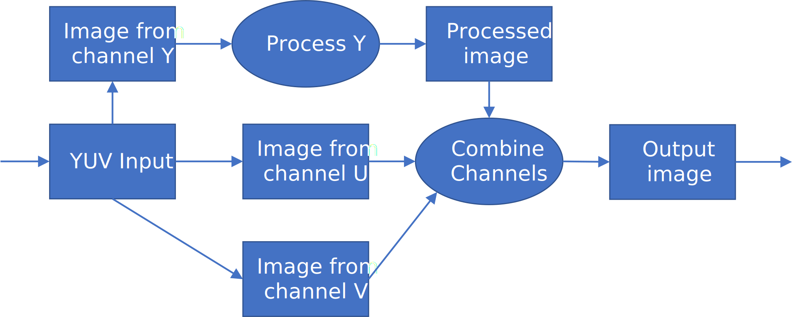
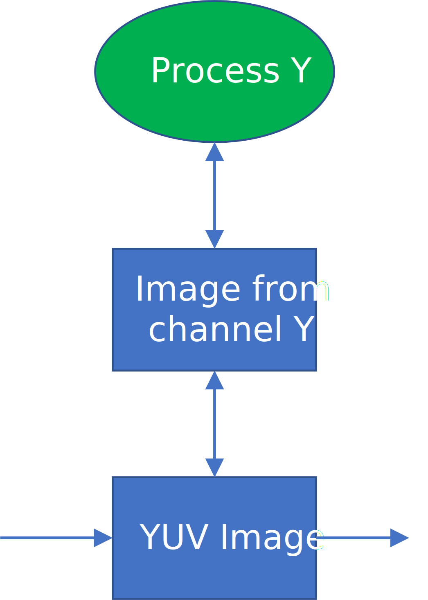
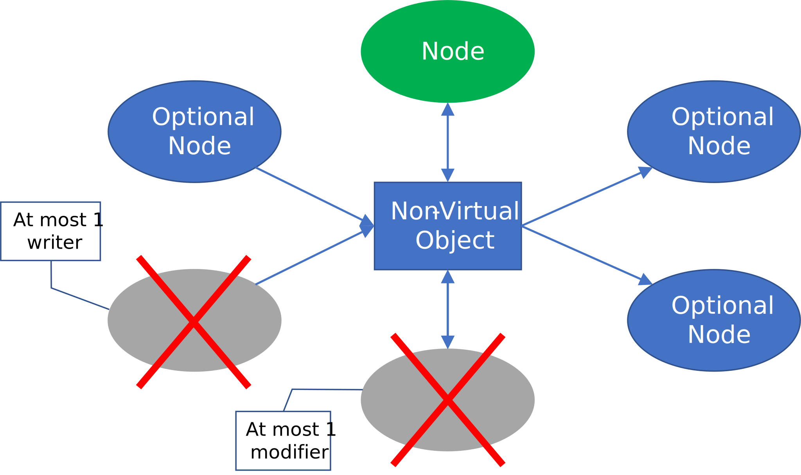
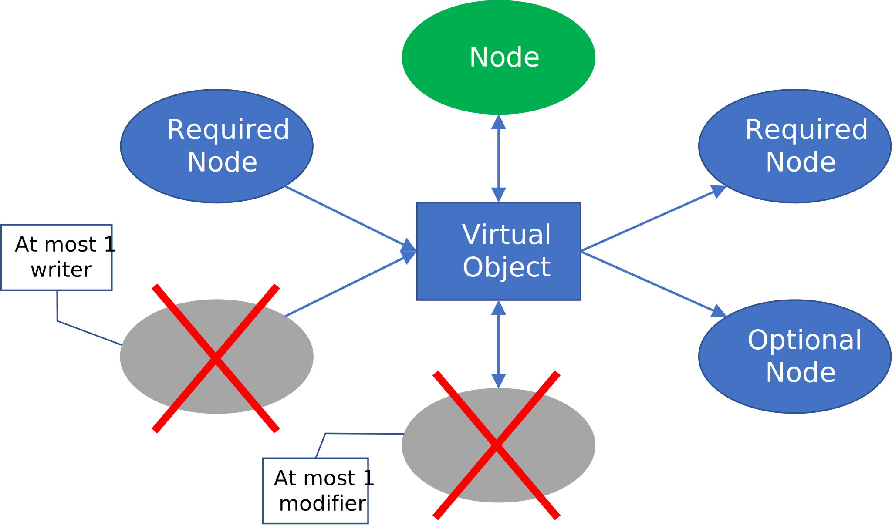
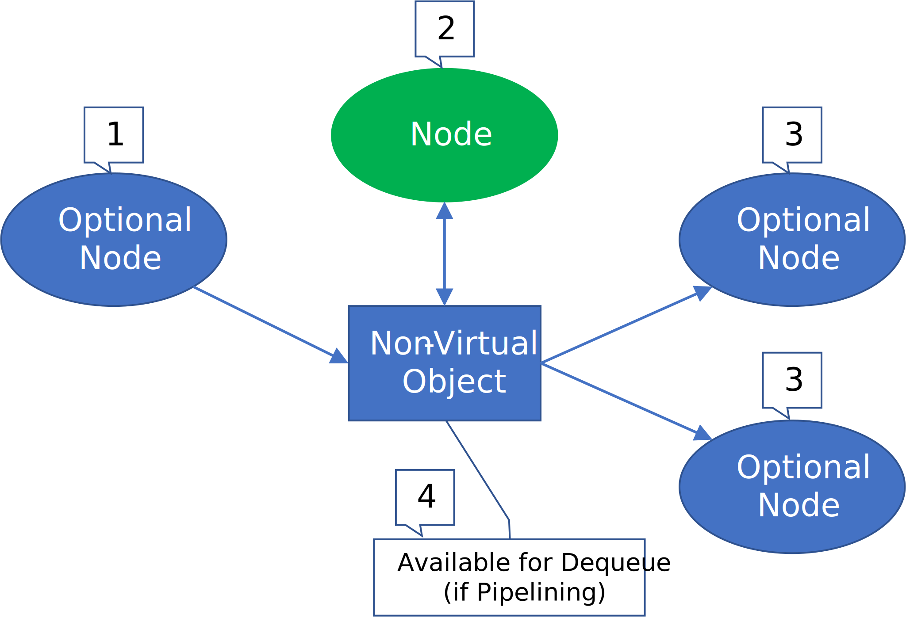
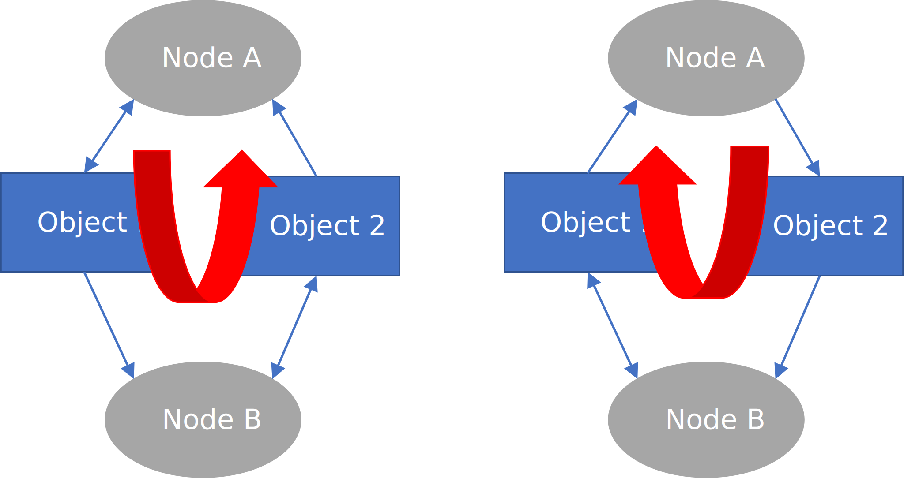

// Copyright (c) 2018 Khronos Group. This work is licensed under a
// Creative Commons Attribution 4.0 International License; see
// http://creativecommons.org/licenses/by/4.0/

= The OpenVX^(TM)^ Bidirectional parameters Extension
:regtitle: pass:q,r[^®^]
The Khronos{regtitle} OpenVX Working Group; Contributor: Steve Ramm
:title-logo-image: images/Khronos_RGB.svg
:data-uri:
:icons: font
:toc2:
:toclevels: 3
:max-width: 100
:numbered:
:imagewidth: 800
:fullimagewidth: width="800"
:halfimagewidth: width="400"
:source-highlighter: coderay
// Various special / math symbols. This is easier to edit with than Unicode.
include::config/attribs.txt[]

// Paths to code examples and headers
:examples: examples
:headers: examples

image::images/OpenVX_RGB.svg[align="center",{halfimagewidth}]
include::copyright-spec.txt[]

<<<<

// Table of contents is inserted here
toc::[]

:leveloffset: 1
= Extension to support bidirectional parameters in OpenVX V1.3.1


[[sec_purpose]]
== Purpose

Bidirectional parameters were originally specified in OpenVX but then were removed due to difficulties and lack of clarity in specifying the scheduling of nodes. This extension is against OpenVX V1.3.1 and seeks to add them back, with a revision of the rules concerning their use, and of the graph formalism.

In this document requirements are marked thus: `[REQ-BPnn]`, where "nn" indicates numbering

An optional addition to the extension is the inclusion of the Accumulate kernels that were specified as per OpenVX V1.1.

Conformance with this extension can then be at two levels:

1. Basic. Bidirectional parameters are correctly supported for user nodes.

2. Full. The accumulate kernels and corresponding APIs (vxAccumulateImageNode, vxAccumulateSquareImageNodeX and vxAccumulateWeightedImageNodeX) are also supported.
Note that immediate node APIs (vxuAccumulateImage etc.) are not required to be supported.

[[sec_usecases]]
== Example Use Case

Problem: Modify the Y channel of a YUV image.

=== Without bidirectional parameters
A method would be with a 2 nodes in a graph as follows:

 * Separate the image into Y, U, V components using vxCreateImageFromChannel
 * Process the Y channel creating a new image
 * Combine the 3 images back into a new YUV image (vxChannelCombineNode)
 * The output is a new image requiring a new data buffer, with an extra read and write per pixel on all planes.



This would require:

 * 2 reads and 2 writes per pixel on the Y plane
 * 1 read and 1 write per pixel on both U and V planes
 * One extra Y buffer and one extra YUV buffer

=== With bidirectional parameters
 * Only one node in a graph would be required, operating on a single image created using vxCreateImageFromChannel
 * The bidirectional parameter allows the data to be modified in-place
 * The output occupies the same data buffer, only one read and one write of each pixel in one plane is required
 * Saves one read and one write of each pixel on 3 planes!



[[sec_acknowledge]]
== Acknowledgements

This specification would not be possible without the contributions from this
partial list of the following individuals from the Khronos Working Group and
the companies that they represented at the time:

  * Simon Barfield - ETAS (Robert Bosch GmbH)
  * Raphael Cano - Robert Bosch GmbH
  * Radhakrishna Giduthuri - Intel
  * Andrew Graves - ETAS (Robert Bosch GmbH)
  * Viktor Gyenes - AI Motive
  * Kiriti Nagesh Gowda - AMD
  * Stephen Ramm - ETAS (Robert Bosch GmbH)
  * Jesse Villarreal - TI

[[page_requirements_requirements]]
= Requirements


== Enumeration type documentation for Parameter object

`[*REQ-BP01*]`[[REQ-BP01]]

The enumeration vx_direction_e is extended to (once again) include VX_BIDIRECTIONAL, for example:

```c
enum vx_direction_e {
    VX_INPUT = VX_ENUM_BASE(VX_ID_KHRONOS, VX_ENUM_DIRECTION) + 0x0,
    VX_OUTPUT = VX_ENUM_BASE(VX_ID_KHRONOS, VX_ENUM_DIRECTION) + 0x1,
    VX_BIDIRECTIONAL = VX_ENUM_BASE(VX_ID_KHRONOS, VX_ENUM_DIRECTION) + 0x2,
};
```
== Graph Formalism

Regarding bidirectional parameters, a new rule of "at most one writer, at most one modifier" is necessary to derive sensible graph execution ordering. This is not stated here as a separate requirement, but gives rise to requirements stated later.

Please refer to the later sections for more information, and some illustrations.

If it is required in a graph that two nodes modify an object, then a "copy" node can be used to separate those nodes. By using virtual objects the implementation is allowed to optimize by removing the "copy" node, which is serving purely to establish the order of execution of the modifying nodes.

This example serves to illustrate the reasoning for the execution order requirements given later; The modifying node must be executed before the reading node (in this case a "copy" node) or the trick would not work. Execution order is writing first (once only), then modifying (once only), reading last.

== User kernels

`[*REQ-BP02*]`[[REQ-BP02]]

c.f. `[REQ-1892]` of OpenVX V1.3.1 The third parameter (direction) to the API vxAddParameterToKernel(kernel, index, direction, data_type, state) can be in general VX_BIDIRECTIONAL, VX_INPUT, or VX_OUTPUT.

== Connection of objects to parameters

* `[*REQ-BP03*]`[[REQ-BP03]] A non-virtual object may be attached to at most one output parameter, at most one bidirectional parameter, and any number of input parameters. 



* `[*REQ-BP04*]`[[REQ-BP04]] A virtual object may be attached to at most one bidirectional parameter of a node in a graph only if it is also attached to an output parameter of a second node and to an input parameter of a third. It may also be connected to any number of other input parameters.
  Reasoning:
  ** As it is a virtual object, it needs to be initialised by a graph node as the data is not accessible outside the graph, therefore is needs to be connected to an output
  ** As it is a virtual object, the (modified) data is not accessible outside the graph, so to be of any use it must be connected to the input of a graph node.



* `[*REQ-BP05*]`[[REQ-BP05]] An object, virtual or non-virtual, may not be connected to both a bidirectional parameter of a node and another parameter (of any type) of the same node, otherwise there would be a single-node cycle.

* `[*REQ-BP06*]`[[REQ-BP06]] A read-only object such as a uniform image may not be connected to a bidirectional parameter.

== Order of execution of nodes involving bidirectional parameters

* `[*REQ-BP07*]`[[REQ-BP07]] If an object is connected to the output parameter of node N1 and a bidirectional parameter of node N2, then N2 cannot execute until N1 has completed execution.
* `[*REQ-BP08*]`[[REQ-BP08]] If an object is connected to the bidirectional parameter of node N2 and an input parameter of node N3, then N3 cannot execute until N2 has completed execution.

The order of execution of nodes to which an object is attached is then:

* the node (if any) to which it is attached as an output
* the node (if any) to  which it is attached as a bidirectional
* any nodes to which it is attached as an input



== Cyclic connection of bidirectional parameters

`[*REQ-BP09*]`[[REQ-BP09]] When parsing the graph to detect cycles, bidirectional parameters are considered both as inputs and as outputs.

Certain combinations of connections are then not allowed, for example:

* If object 1 is connected as bidirectional to node A and input to node B, and object 2 is connected as bidirectional to node B and input to node A, there is a cycle.
* If object 1 is connected as an input to node A, as bidirectional to node B, and the output of node A is connected as another input to node B, then there is a cycle.



== Delays

There are no extra restrictions on the use of delays with objects connected as bidirectional parameters.

== Graph parameters

`[*REQ-BP10*]`[[REQ-BP10]] A bidirectional parameter may be added as a graph parameter. In this case the _effective_ direction of the parameter depends upon the graph configuration and rules determining the execution order of the nodes:

* The edge is connected between an output parameter of one node "A", a bidirectional parameter of another node "B", and any number of inputs. In this case the graph parameter is effectively an output, becoming "written" after node "B" has executed. This is the case whether the graph parameter was created as attached to node "A" or to node "B". If this is confusing, please use a Copy node for clarity, and understand the order of execution of the nodes.
* The edge is not connected to any output parameter, but to one bidirectional parameter of node "B" and any number of inputs to other nodes. In this case the graph parameter is truly bidirectional, being at first an input to the node "B", and becoming "written" after node "B" has executed.

image::images/graph-parameters.svg[align="center"]

== Pipelining

`[*REQ-BP11*]`[[REQ-BP11]] A bidirectional parameter, whether effectively an output or truly bidirectional (see above), will not become ready for dequeueing until all the nodes to which it is connected have executed.

== Replicated Nodes

`[*REQ-BP12*]`[[REQ-BP12]] c.f `[REQ-0697]` of OpenVX V1.3.1:
Describing parameter three of vxReplicateNode() an array of vx_bool with a value of vx_true_e for the parameters that should be iterated over (should be a reference to a vx_pyramid or a vx_object_array), vx_false_e for the parameters that should be the same across replicated nodes and for optional parameters that are not used. Should be vx_true_e for all output **_and bidirectional_** parameters.

= Optional standard nodes

Optionally, the accumulate APIs, similar to those that are defined in the OpenVX V1.1 specification may be implemented.

The specifications are similar to the V1.1 specifications, with the following important modifications:

* A virtual object may be connected as any of the parameters to the kernels
* The type of the "shift" parameter of the new vxAccumulateSquareImageNodeX function is vx_uint32, whereas in vxAccumulateSquareImageNode it is a scalar containing a vx_uint32.
* The type of the "alpha" parameter of new vxAccumulateWeightedImageNodeX function is vx_float32, where as in vxAccumulateWeightedImageNode it is a scalar containing a vx_float.

The last two points address tha anomaly that in V1.1 the parameters are given as type vx_scalar, implying that the values may change during graph execution (for example the scalar could be output from a user node), but the implication of the descriptive text is that they are fixed at graph verification time (and this is how the sample implementation also works), since limits are given for the scalar values and no guidance is given for how to proceed if at run time the values are not within those limits. (Note that once verified, a graph can be guaranteed to proceed).

== Accumulate Image Node

Accumulates an input image into output image. Accumulation is computed by:

`[*REQ-BP13*]`[[REQ-BP13]]
```
accum(x,y) = accum(x,y) + input(x,y)
```
`[*REQ-BP14*]`[[REQ-BP14]]
The overflow policy used is VX_CONVERT_POLICY_SATURATE.

`[*REQ-BP15*]`[[REQ-BP15]] API:
```
vx_node VX_API_CALL vxAccumulateImageNode (vx_graph graph, vx_image input, vx_image accum);
```
=== Parameters

[options="header"]
|====
| Direction | Name | Description
| in | graph | `[*REQ-BP16*]`[[REQ-BP16]] The valid reference to a graph. 
| in | input | `[*REQ-BP17*]`[[REQ-BP17]] The input image in format VX_DF_IMAGE_U8. 
| in,out | accum | `[*REQ-BP18*]`[[REQ-BP18]] The accumulation image in format VX_DF_IMAGE_S16. 
|====

=== Returns

[options="header"]
|====
| Type | Description | Errors 
| vx_node | A node reference. | `[*REQ-BP19*]`[[REQ-BP19]] Any possible errors preventing a successful creation can be checked using vxGetStatus()
|====

== Accumulate Square Image Node

Accumulates a squared value from an input image to an output image. Accumulate squares is computed by:

`[*REQ-BP20*]`[[REQ-BP20]]
```
accum(x,y) = saturateint16( (uint16)accum(x,y) + (( (uint16)( input(x,y) * input(x,y) )) >> shift ))
```
Where 0 < = shift < =15

`[*REQ-BP21*]`[[REQ-BP21]] The overflow policy used is VX_CONVERT_POLICY_SATURATE.

`[*REQ-BP22*]`[[REQ-BP22]] API:
```
vx_node VX_API_CALL vxAccumulateSquareImageNodeX (vx_graph graph, vx_image input, vx_uint32 shift, vx_image accum);
```
=== Parameters

[options="header"]
|====
| Direction | Name | Description
| in | graph | `[*REQ-BP23*]`[[REQ-BP23]] The valid reference to a graph. 
| in | shift | `[*REQ-BP24*]`[[REQ-BP24]] The value must be in the range 0 to 15 inclusive. 
| in | input |  `[*REQ-BP25*]`[[REQ-BP25]] The input image in format VX_DF_IMAGE_U8. 
| in,out | accum | `[*REQ-BP26*]`[[REQ-BP26]] The accumulation image in format VX_DF_IMAGE_S16. 
|====

=== Returns

[options="header"]
|====
| Type | Description | Errors 
| vx_node | A node reference. | `[*REQ-BP27*]`[[REQ-BP27]] Any possible errors preventing a successful creation can be checked using vxGetStatus()
|====

== Accumulate Weighted Image Node

Accumulates a weighted value from an input image to an output image. Weighted accumulation is computed by:

`[*REQ-BP28*]`[[REQ-BP28]]
```
accum(x,y) = (1 - a) * accum(x,y) + a * input(x,y)
```
Where 0 < = a < = 1

Conceptually, the rounding for this is defined as:

`[*REQ-BP29*]`[[REQ-BP29]] 
```
output(x,y) = uint8( (1 - a) * float32(int32(output(x,y))) + a * float32(int32(input(x,y))) )
```

`[*REQ-BP30*]`[[REQ-BP30]] API:
```
vx_node VX_API_CALL vxAccumulateWeightedImageNodeX (vx_graph graph, vx_image input, vx_float32 alpha, vx_image accum);
```

=== Parameters

[options="header"]
|====
| Direction | Name | Description
| in | graph |`[*REQ-BP31*]`[[REQ-BP31]] The valid reference to a graph. 
| in | input | `[*REQ-BP32*]`[[REQ-BP32]] The input image in format VX_DF_IMAGE_U8. 
| in | alpha | `[*REQ-BP33*]`[[REQ-BP33]] The value must be in the range 0.1 to 1.0 inclusive 
| in,out | accum | `[*REQ-BP34*]`[[REQ-BP34]] The accumulation image in format VX_DF_IMAGE_U8.
|====

=== Returns

[options="header"]
|====
| Type | Description | Errors 
| vx_node | A node reference. | `[*REQ-BP35*]`[[REQ-BP35]] Any possible errors preventing a successful creation can be checked using vxGetStatus() 
|====

