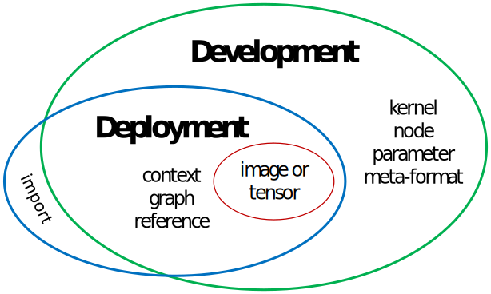

// Copyright (c) 2016-2018 Khronos Group. This work is licensed under a
// Creative Commons Attribution 4.0 International License; see
// http://creativecommons.org/licenses/by/4.0/

= The OpenVX^(TM)^ Feature Set Definitions
:regtitle: pass:q,r[^®^]
Editor: Frank Brill, Radhakrishna Giduthuri; The Khronos{regtitle} OpenVX Working Group
:title-logo-image: images/Khronos_RGB.svg
:data-uri:
:icons: font
:toc2:
:toclevels: 4
:max-width: 100
:numbered:
:imagewidth: 800
:fullimagewidth: width="800"
:halfimagewidth: width="400"
:source-highlighter: coderay
// Various special / math symbols. This is easier to edit with than Unicode.
include::config/attribs.txt[]

include::copyright-spec.txt[]

<<<

Contributors::
 - Viktor Gyenes, AIMotive
 - Christian Colliander, Axis Communications AB
 - Frank Brill, Cadence Design Systems
 - Radhakrishna Giduthuri, Intel
 - Jesse Villarreal, Texas Instruments

[[sec_overview]]
== Overview

Now that the OpenVX API has grown to an extensive set of functions, there is interest in
creating implementations that target a particular set of features rather than covering the
entire OpenVX API.  In order to offer this option while still managing the API to prevent
excessive fragmentation regarding which implementations offer which features, this section of
the specification defines a collection of "`feature sets`" that form coherent and useful subsets
of the OpenVX API.  Implementors have the option to test for conformance to only one or a few
feature sets rather than the entire API.  Implementations that choose this option must clearly
identify which feature sets they support in their documentation.

Some of the feature sets described below are identified as _conformance_ feature sets, meaning that
implementing such a set of features and passing the conformance tests for those features is
sufficient to claim adoption of the OpenVX specification.  An implementation must pass the
conformance tests for at least one conformance feature set.  Other feature sets described below are
optional, organizational, or informational.

_Optional_ feature sets have conformance tests that can be optionally enabled to test that this
group of functions is correctly implemented.  In order to claim that an implemention supports an
optional feature set, the conformance tests for this optional feature set must be enabled and
passed.  This must be done _in addition to_ testing for one or more conformance feature sets;
implementing an optional feature set without also implementing a conformance feature set is not
sufficient to claim adoption of OpenVX.

Some feature sets are _organizational_ or _informational_.  Organizational feature sets are used to
group convenient functions that can be easily referenced by a name for inclusion in other feature
sets.  An example of an organizational feature set is the "base" feature set described below, which
is a collection of basic framework functions that can included in other feature sets.  Informational
features sets are groups of features that the OpenVX group identifies as being a useful subset of
the OpenVX specification that can be used in a particular situation.  An example of an informational
feature set is the "deployment" feature set described below, which can be useful in embedded or
safety-critical environments.  Implementation of organizational and/or informational feature sets
_only_ is *not* sufficient to claim adoption of OpenVX.

This document defines *three* Conformance Feature Set options:

. Vision (OpenVX 1.1-equivalent vision functions)
. Neural Network (OpenVX 1.2-equivalent neural-network functions, plus the Neural Network extension and the tensor object)
. NNEF (kernel import plus the tensor object)

*Two* Optional Feature Sets are defined:

. U1 (binary image support)
. Enhanced Vision (vision functions introduced in OpenVX 1.2)

*One* Organizational Feature Set is defined:

* Base Feature Set (basic graph infrastructure)

*One* Informational Feature Set is defined:

* Deployment Feature Set (for Safety Critical usage)

Details of these feature sets are described below.  These feature sets below are based on OpenVX 1.1
or higher, and reference some APIs and symbols that may be found in that API, at
https://www.khronos.org/registry/OpenVX/specs/1.1/html/index.html.  They also incorporate material
in the OpenVX 1.1.1 Export and Import extension at
https://www.khronos.org/registry/OpenVX/extensions/vx_khr_ix/1.1.1/vx_khr_export_and_import_1_1_1.html,
and the neural network extension at
https://www.khronos.org/registry/OpenVX/extensions/vx_khr_nn/1.2.1/vx_khr_nn_1_2_1.html.
We will start with the Base Feature Set, upon which most of the others are built.

[[sec_base]]
== The Base Feature Set

[[sec_base_purpose]]
=== Purpose

[[base, Base Feature Set]] The purpose is to define a minimal subset of OpenVX features that enable
the construction and execution of OpenVX graphs, but it does not contain any specific
vision-processing operations.  Other feature sets build on this basic framework to add sufficient
functionality to enable useful applications.  The Base Feature Set is _not_ a conformance feature
set, and is defined for convenience of organization and explanation in this document.

The Base Feature Set requires support for the foundational `vx_context`, `vx_reference`, `vx_graph`,
`vx_kernel` and `vx_node` objects.  The `vx_parameter` and `vx_meta_format` objects provide the
necessary functions to query parameters of the imported kernels, so they are also required.

The name of this feature set is *vx_khr_base*.

=== Requirements

The Base Feature Set includes the following framework objects in their entirety, including all
functions, macros, typedefs, and enumerations described in their respective sections in the main
OpenVX specification:

[options="header"]
|====
4+| Basic framework objects
| `vx_reference`
| `vx_context`
| `vx_graph`
| `vx_kernel`
| `vx_node`
| `vx_parameter`
| `vx_meta_format`
|
|====

The Base Feature Set also requires support for User Kernels as decribed in the main OpenVX
specification in its entirety, including all functions, macros, typedefs, and enumerations
described in the User Kernel section of the main specification.

[[sec_vision]]
== The Vision Conformance Feature Set

[[sec_vision_purpose]]
=== Purpose

To provide a basic set of vision processing functions.  This set of functions is roughly equivalent
to the set of functions available in version 1.1 of the OpenVX specification.  In addition to the
framework objects included in the Base Feature Set, the Vision Conformance Feature Set includes a
set of data objects that the Vision functions operate upon and produce.

=== Requirements

The Vision Conformance Feature Set includes all the functions and objects in the Base Feature Set,
plus the following data objects and vision functions.

==== Data Object Requirements

The Vision Conformance Feature Set includes the following data objects in their entirety, including
all functions, macros, typedefs, and enumerations described in their respective sections in the main
OpenVX specification:

[options="header"]
|====
4+| Vision Conformance required data objects
| `vx_array`
| `vx_convolution`
| `vx_delay`
| `vx_distribution`
| `vx_image`
| `vx_lut`
| `vx_matrix`
| `vx_pyramid`
| `vx_remap`
| `vx_scalar`
| `vx_threshold`
| `vx_object_array`
|====

==== Vision Function Requirements

Support for the Vision functions from the main OpenVX specification listed below is required in their entirety
_except_ for U1, i.e., binary, image support. Support for binary images is optional, and is described
in the Optional Binary Image Feature Set specification.

[options="header"]
|====
3+| Vision Conformance required functions
| AbsDiff | Add | And
| Box3x3 | CannyEdgeDetector | ChannelCombine
| ChannelExtract | ColorConvert | ConvertDepth
| Convolve | Dilate3x3 | EqualizeHist
| Erode3x3 | FastCorners | Gaussian3x3
| GaussianPyramid | HarrisCorners | HalfScaleGaussian
| Histogram | IntegralImage | LaplacianPyramid
| LaplacianReconstruct | Magnitude | MeanStdDev
| Median3x3 | MinMaxLoc | Multiply
| NonLinearFilter | Not | OpticalFlowPyrLK
| Or | Phase | Remap
| ScaleImage | Sobel3x3 | Subtract
| TableLookup | Threshold | WarpAffine
| WarpPerspective | Xor | WeightedAverage
|====

[[sec_nn]]
== The Neural-Network Conformance Feature Set

[[sec_nn_purpose]]
=== Purpose

To provide a basic set of neural-network functions.  This conformance feature set is roughly
equivalent to the OpenVX neural network extension specification, plus the portions of the main
specification needed to support these neural-network functions.

=== Requirements

The Neural Network Conformance Feature Set includes all the functions and objects in the Base
feature set, plus the following data objects and neural-network functions.

==== Data Object Requirements

The Neural Network Conformance Feature Set includes the following data objects in their entirety,
including all functions, macros, typedefs, and enumerations described in their respective sections
in the main OpenVX specification:

[options="header"]
|====
| Neural Network Conformance required data objects
| `vx_tensor`
|====

==== Neural Network Function Requirements

Support for the Neural Network functions from the OpenVX neural-network extension specification in
their entirety is required, as well as all of the data types included in that specification.  This
amounts to the entire extension specification.  Note that the functions described above for the
Vision Conformance Feature Set are *not* required, only the Base plus the neural-network functions
and the tensor data object.  The neural-network functions are listed here for convenience:

[options="header"]
|====
3+| Neural Network Conformance required functions
| vxActivationLayer | vxConvolutionLayer | vxDeconvolutionLayer
| vxFullyConnectedLayer | vxLocalResponseNormalizationLayer | vxPoolingLayer
| vxROIPoolingLayer | vxSoftmaxLayer |
|====

[[sec_nnef]]
== The NNEF Import Conformance Feature Set

[[sec_nnef_purpose]]
=== Purpose

Provide a minimum set of functions to import and execute neural networks described in the NNEF
standard format.  Applications using this feature set will use the `vxImportKernelFromURL` function
to import an NNEF file at the location of the URL to create an OpenVX kernel representing the neural
network.  This kernel can subsequently be used to create a node in an OpenVX graph, which can be
executed using the normal OpenVX functions from the Base Feature Set. The inputs and
outputs of the neural network node will be `vx_tensor` objects.

This feature set is dependent on the Base feature set and the tensor data object, which must also be
supported in order to support this feature set.

The name of this feature set is *vx_khr_nnef_import*.

=== Requirements

The NNEF Import Conformance Feature Set includes all the functions and objects in the Base feature
set, support of the Kernel import extension *vx_khr_import_kernel*, which contains the
`vxImportKernelFromURL` function, plus the following data objects and vision functions.

==== Data Object Requirements

The Neural Network Conformance Feature Set includes the following data objects in their entirety,
including all functions, macros, typedefs, and enumerations described in their respective sections
in the main OpenVX specification:

[options="header"]
|====
| Neural Network Conformance required data objects
| `vx_tensor`
|====

==== Required NNEF Operations

The NNEF format supports many operations commonly used in neural network applications.  For the
purposes of this image processing feature set, a subset of the NNEF operators that _must_ be
supported by the importer is defined below.  Additional NNEF operators _may_ be supported by the
importer, but the conformance tests for this feature set will only include the operations below.

Since this profile focuses on _image processing_, tensors with 4 dimensions and related operations
must be supported. The first dimension will be referred to as _batch_ dimension, the second as
_channel_ dimension and the last two as _spatial_ dimensions.

The operations and restrictions below were collected to cover the following networks:

* AlexNet-v2 (no local response normalization, no grouped convolution)
* VGG-16, VGG-19
* Inception-v1, v2, v3, v4
* ResNet-v1, v2
* MobileNet v1, v2

Furthermore, recurrent cells such as LSTMs and GRUs were also taken into account.

At least the following operations and parameterizations must be supported. Compound operations that
can be decomposed using the below operations are not listed separately.

[cols="1v,2v,1d"]
|====
|Operation |Parameters |Notes

|`external`
`variable`
`constant`
|rank of `shape` is 4
|No actual calculations involved, only introduce source tensors

|`conv`
`deconv`
|rank of `input` and `filter` is 4
spatial extents of `filter` are up to 7
spatial extents of `stride` are up to 4
spatial extents of `padding` are less than that of `filter`
batch and channel extents of `padding` are 0
value of `border` equals `'constant'`
all extents of `dilation` are 1
`groups` equals 1 or 0 (depth-wise)
|

|`max_pool`
`avg_pool`
|rank of `input` is 4
maximal spatial extents of `size` are up to 3
maximal spatial extents of `stride` are up to 2
batch and channel extents of `stride` are 1
spatial extents of `padding` are less than that of `filter`
batch and channel extents of `padding` are 0
value of `border` equals `'constant'`
all extents of `dilation` are 1
`groups` equals 1 or 0 (depth-wise)
|

|`max_reduce`
`mean_reduce`
|rank of `input` is 4
`axes` equals `[2,3]` (spatial dimensions)
|

|`relu`
`sigmoid`
`tanh`
|rank of `x` is 2 or 4
|Only required to support after `conv`, `deconv`, `concat` and `add` operations

|`add`
`mul`
|rank of `x` and `y` is 2 or 4
|

|`concat`
`split`
|rank of input is 4
`axis` equals 1 (channel dimension)
|

|`squeeze`
|rank of input is 4
`axes` equals `[2,3]` (spatial dimensions)
|

|`softmax`
`argmax_reduce`
|rank of `input` is 2 or 4
`axes` equals `[1]` (channel dimension)
|Only after `conv`, `deconv`, `concat` and `add` operations, only as a sink operation (output is not processed further)

|`reshape`
|rank of `input` is 4
`shape` equals `[0,-1]` (merge channel and spatial dimensions)
|

|`linear`
|rank of `input` and `filter` is 2
|

|`multilinear_upsample`
|rank of `input` is 4
`factor` equals `[2,2]`
`method` equals `'symmetric'` or `'asymmetric'`
`border` equals `'constant'`
|Can be expressed via depth-wise deconvolution with constant weights as shown in the NNEF specification

|====

[[sec_nnef_user_defined]]
=== User-defined, or _custom_ NNEF operators

In the case where the imported neural network model defines a custom operation, namely an operation
with known interfaces but unknown functionality, the implementation of such a custom operation must
be provided as an OpenVX user kernel. This user kernel must be registered in the OpenVX context
prior to the calling the `vxImportKernelFromURL` function.  The registered user kernel must be
consistent with the custom kernel declared in the NNEF model in term of:

* Kernel name
* Number of inputs and outputs
* Type of input and outputs (element type, dimensions for multidimensional objects)

The OpenVX implementation is responsible for detecting potential inconsistencies at
`vxImportKernelFromURL` call time and/or at the time the imported kernel is instantiated as a node in
an OpenVX graph.  When importing from NNEF, the following correspondence is defined between the NNEF
custom operation and the OpenVX user kernel that implements it:

* OpenVX kernel name:  custom.nnef.<NNEF name>
* Parameters ordering :
** input first : in the NNEF order
** then outputs : in the NNEF order
* Kernel parameters
** Primitive types
*** NNEF integer : vx_scalar of type VX_TYPE_INT32
*** NNEF scalar : vx_scalar of type VX_TYPE_FLOAT32
*** NNEF logical : : vx_scalar of type VX_TYPE_BOOL
*** NNEF string : not required to be supported
** Compound type
*** NNEF array: vx_array of the corresponding element type
** Multi-dimentional types
*** NNEF tensor: vx_tensor

[[sec_binary]]
== The Optional Binary Image Feature Set

[[sec_binary_purpose]]
=== Purpose

To enable highly-efficient and compact manipulation of binary, i.e., U1, format images.

=== Requirements

This feature set is dependent on the Vision Conformance Feature Set defined above, so an
implementation must pass all the conformance tests for that feature set.  In addition, the
implementor may optionally enable the U1 conformance tests.  If the implementation passes _all_ the
U1 conformance tests (as well as those for vision conformance) then the implementor can claim
support for this binary image feature set.

The functions that are tested for U1 support by the U1 conformance tests are identified in "Inputs"
and "Outputs" tables in the main OpenVX specification.  Functions that require U1 support are
indicated in the "U1" columns of these tables.

[[sec_enhanced_vision]]
== The Optional Enhanced Vision Feature Set

[[sec_enhanced_vision_purpose]]
=== Purpose

To provide an enhanced set of vision processing functions.  This set of functions is roughly
equivalent to the set of functions introduced in version 1.2 and later of the OpenVX specification.

=== Requirements

This feature set is dependent on the Vision Conformance Feature Set defined above, so an
implementation must pass all the conformance tests for that feature set.  In addition, the
implementor may optionally enable the enhanced vision conformance tests.  If the implementation
passes _all_ the enhanced vision conformance tests (as well as those for regular vision conformance)
then the implementor can claim support for this enhanced vision feature set.

==== Data Object Requirements

Since this feature set is dependent on the Vision Conformance Feature Set, all the data object from
that feature set must be supported.  In addition, the Enhanced Vision Feature Set includes the
following data objects in their entirety, including all functions, macros, typedefs, and
enumerations described in their respective sections in the main OpenVX specification:

[options="header"]
|====
| Neural Network Conformance required data objects
| `vx_tensor`
|====

==== Enhanced Vision Function Requirements

[options="header"]
|====
3+| Enhanced Vision Conformance required functions
| BilateralFilter | Copy | HOGCells
| HOGFeatures | HoughLinesP | LBP
| MatchTemplate | Max | Min
| NonMaxSuppression | TensorAdd | TensorConvertDepth
| TensorMatrixMultiply | TensorMultiply | TensorSubtract
| TensorTableLookup | TensorTranspose | ScalarOperation
| Select | |
|====

== Safety-Critical Deployment Feature Set

=== Purpose

The safety-critical environment (for example ISO26262) requires an implementation to satisfy
rigorous demands for deployment. For development, an implementation must satisfy the lesser demands
of a software tool used to create such a deployment.  This section defines a _deployment_ feature
set, which is generally a subset of the entire OpenVX specification.  In this context, the entire
set of OpenVX features can be referred to as the _development_ feature set that is run in a
development environment with a full set of debug tools, as opposed to the _deployment_ feature set
that runs on an embedded target device with limited resources.  A developer may use the full set of
features to create and export a graph, and then for deployment this graph is imported by a program
that only uses features in the Deployment Feature Set.

The safety-critical environment requires that graphs must execute in a deterministic,
reproducible way. It is up to the implementation to guarantee this behavior in some way.
The implementation-dependent behaviors must be defined and documented by the implementation.

[[sub_sc_features]]
=== Requirements

The Deployment Feature Set requires only a subset of features
described in the “Basic Features” and “Administrative Features”
sections of the specification, as well as the *vx_khr_ix* extension.

A Venn diagram of the relationship between the feature sets is shown below.  Details are provided in
the following sections.

.OpenVX Safety-Critical Feature Set Organization

The following table lists the required deployment features.
Since the Deployment Feature Set does not support graphs to be
constructed, none of the `vxXXXNode()` functions in the "Vision Functions"
section of the specifications are listed in this table.

[options="header"]
|====
|API Group | API Function | Is deployment feature?
| CONTEXT          | `vxCreateContext` | Yes
|                  | `vxReleaseContext` | Yes
|                  | `vxGetContext` | Yes
|                  | `vxQueryContext` | Yes
|                  | `vxSetContextAttribute` | Yes
|                  | `vxHint` | Yes
|                  | `vxDirective` | Yes
|                  | `vxGetStatus` | Yes
|                  | `vxRegisterUserStruct` |
|                  | `vxAllocateUserKernelId` |
|                  | `vxAllocateUserKernelLibraryId` |
| IMAGE            | `vxCreateImage` | Yes
|                  | `vxCreateImageFromROI` | Yes
|                  | `vxCreateUniformImage` | Yes
|                  | `vxCreateVirtualImage` |
|                  | `vxCreateImageFromHandle` | Yes
|                  | `vxSwapImageHandle` | Yes
|                  | `vxQueryImage` | Yes
|                  | `vxSetImageAttribute` | Yes
|                  | `vxSetImagePixelValues` | Yes
|                  | `vxReleaseImage` | Yes
|                  | `vxFormatImagePatchAddress1d` | Yes
|                  | `vxFormatImagePatchAddress2d` | Yes
|                  | `vxGetValidRegionImage` | Yes
|                  | `vxCopyImagePatch` | Yes
|                  | `vxMapImagePatch` | Yes
|                  | `vxUnmapImagePatch` | Yes
|                  | `vxCreateImageFromChannel` | Yes
|                  | `vxSetImageValidRectangle` | Yes
| KERNEL           | `vxRegisterKernelLibrary` |
|                  | `vxLoadKernels` |
|                  | `vxUnloadKernels` |
|                  | `vxGetKernelByName` |
|                  | `vxGetKernelByEnum` |
|                  | `vxQueryKernel` |
|                  | `vxReleaseKernel` |
|                  | `vxAddUserKernel` |
|                  | `vxFinalizeKernel` |
|                  | `vxAddParameterToKernel` |
|                  | `vxRemoveKernel` |
|                  | `vxSetKernelAttribute` |
|                  | `vxGetKernelParameterByIndex` |
| GRAPH            | `vxCreateGraph` |
|                  | `vxReleaseGraph` | Yes
|                  | `vxVerifyGraph` |
|                  | `vxProcessGraph` | Yes
|                  | `vxScheduleGraph` | Yes
|                  | `vxWaitGraph` | Yes
|                  | `vxQueryGraph` | Yes. Exclude attributes `VX_GRAPH_NUMNODES` and `VX_GRAPH_PERFORMANCE`.
|                  | `vxSetGraphAttribute` |
|                  | `vxAddParameterToGraph` |
|                  | `vxSetGraphParameterByIndex` | Yes
|                  | `vxGetGraphParameterByIndex` |
|                  | `vxIsGraphVerified` |
| NODE             | `vxCreateGenericNode` |
|                  | `vxQueryNode` |
|                  | `vxSetNodeAttribute` |
|                  | `vxReleaseNode` |
|                  | `vxRemoveNode` |
|                  | `vxAssignNodeCallback` |
|                  | `vxRetrieveNodeCallback` |
|                  | `vxSetNodeTarget` |
|                  | `vxReplicateNode` |
| PARAMETER        | `vxGetParameterByIndex` |
|                  | `vxReleaseParameter` |
|                  | `vxSetParameterByIndex` |
|                  | `vxSetParameterByReference` |
|                  | `vxQueryParameter` |
| SCALAR           | `vxCreateScalar` | Yes
|                  | `vxCreateScalarWithSize` | Yes
|                  | `vxCreateVirtualScalar` |
|                  | `vxReleaseScalar` | Yes
|                  | `vxQueryScalar` | Yes
|                  | `vxCopyScalar` | Yes
|                  | `vxCopyScalarWithSize` | Yes
| REFERENCE        | `vxQueryReference` | Yes
|                  | `vxReleaseReference` | Yes
|                  | `vxRetainReference` | Yes
|                  | `vxSetReferenceName` | Yes
| DELAY            | `vxQueryDelay` | Yes
|                  | `vxReleaseDelay` | Yes
|                  | `vxCreateDelay` | Yes
|                  | `vxGetReferenceFromDelay` | Yes
|                  | `vxAgeDelay` |
|                  | `vxRegisterAutoAging` |
| LOGGING          | `vxAddLogEntry` |
|                  | `vxRegisterLogCallback` |
| LUT              | `vxCreateLUT` | Yes
|                  | `vxCreateVirtualLUT` |
|                  | `vxReleaseLUT` | Yes
|                  | `vxQueryLUT` | Yes
|                  | `vxCopyLUT` | Yes
|                  | `vxMapLUT` | Yes
|                  | `vxUnmapLUT` | Yes
| DISTRIBUTION     | `vxCreateDistribution` | Yes
|                  | `vxCreateVirtualDistribution` |
|                  | `vxReleaseDistribution` | Yes
|                  | `vxQueryDistribution` | Yes
|                  | `vxCopyDistribution` | Yes
|                  | `vxMapDistribution` | Yes
|                  | `vxUnmapDistribution` | Yes
| THRESHOLD        | `vxCreateThresholdForImage` | Yes
|                  | `vxCreateVirtualThresholdForImage` |
|                  | `vxCopyThresholdValue` | Yes
|                  | `vxCopyThresholdRange` | Yes
|                  | `vxCopyThresholdOutput` | Yes
|                  | `vxReleaseThreshold` | Yes
|                  | `vxSetThresholdAttribute` | Yes
|                  | `vxQueryThreshold` | Yes
| MATRIX           | `vxCreateMatrix` | Yes
|                  | `vxCreateVirtualMatrix` |
|                  | `vxReleaseMatrix` | Yes
|                  | `vxQueryMatrix` | Yes
|                  | `vxCopyMatrix` | Yes
|                  | `vxCreateMatrixFromPattern` | Yes
|                  | `vxCreateMatrixFromPatternAndOrigin` | Yes
| CONVOLUTION      | `vxCreateConvolution` | Yes
|                  | `vxCreateVirtualConvolution` |
|                  | `vxReleaseConvolution` | Yes
|                  | `vxQueryConvolution` | Yes
|                  | `vxSetConvolutionAttribute` | Yes
|                  | `vxCopyConvolutionCoefficients` | Yes
| PYRAMID          | `vxCreatePyramid` | Yes
|                  | `vxCreateVirtualPyramid` |
|                  | `vxReleasePyramid` | Yes
|                  | `vxQueryPyramid` | Yes
|                  | `vxGetPyramidLevel` | Yes
| REMAP            | `vxCreateRemap` | Yes
|                  | `vxCreateVirtualRemap` |
|                  | `vxReleaseRemap` | Yes
|                  | `vxMapRemapPatch` | Yes
|                  | `vxUnmapRemapPatch` | Yes
|                  | `vxCopyRemapPatch` | Yes
|                  | `vxQueryRemap` | Yes
| ARRAY            | `vxCreateArray` | Yes
|                  | `vxCreateVirtualArray` | Yes
|                  | `vxReleaseArray` | Yes
|                  | `vxQueryArray` | Yes
|                  | `vxAddArrayItems` | Yes
|                  | `vxTruncateArray` | Yes
|                  | `vxCopyArrayRange` | Yes
|                  | `vxMapArrayRange` | Yes
|                  | `vxUnmapArrayRange` | Yes
| OBJECT ARRAY     | `vxCreateObjectArray` | Yes
|                  | `vxCreateVirtualObjectArray` |
|                  | `vxGetObjectArrayItem` | Yes
|                  | `vxReleaseObjectArray` | Yes
|                  | `vxQueryObjectArray` | Yes
| META FORMAT      | `vxSetMetaFormatAttribute` |
|                  | `vxSetMetaFormatFromReference` |
| TENSOR           | `vxCreateTensor` | Yes
|                  | `vxCreateImageObjectArrayFromTensor` | Yes
|                  | `vxCreateTensorFromView` | Yes
|                  | `vxCreateVirtualTensor` |
|                  | `vxCreateTensorFromHandle` | Yes
|                  | `vxSwapTensorHandle` | Yes
|                  | `vxCopyTensorPatch` | Yes
|                  | `vxMapTensorPatch` | Yes
|                  | `vxUnmapTensorPatch` | Yes
|                  | `vxQueryTensor` | Yes
|                  | `vxReleaseTensor` | Yes
| IMPORT           | `vxImportObjectsFromMemory` | Yes
|                  | `vxReleaseImport` | Yes
|                  | `vxGetImportReferenceByName` | Yes
|====

=== Safety-critical Coding Guidelines

Some safety-critical environments may enforce software development guidelines (for example MISRA C:2012)
to facilitate code quality, safety, security, portability and reliability. In order to meet such guidelines,
developers may modify OpenVX standard header files without deviating from the OpenVX specification.

Refer to https://www.khronos.org/registry/OpenVX for the OpenVX standard header packages.
