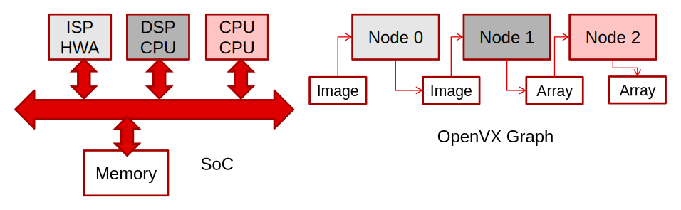
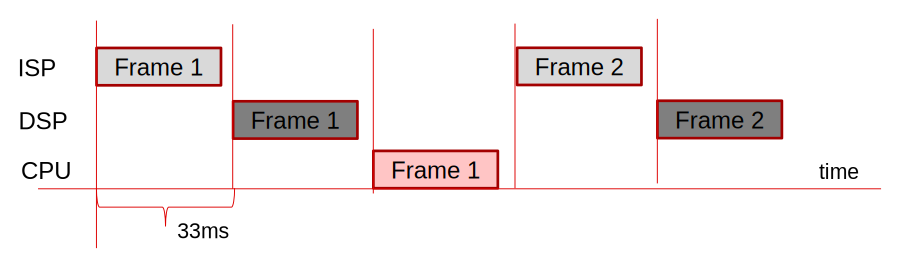
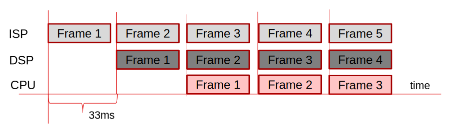
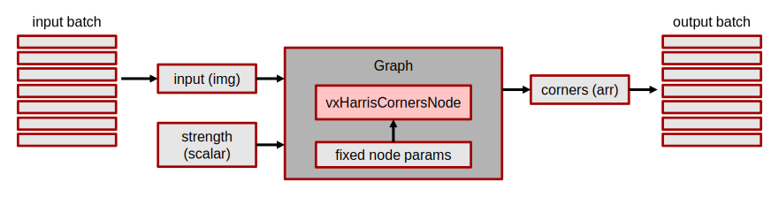
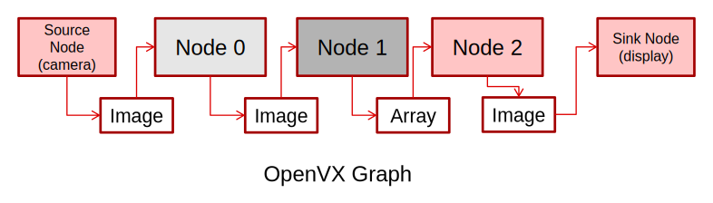
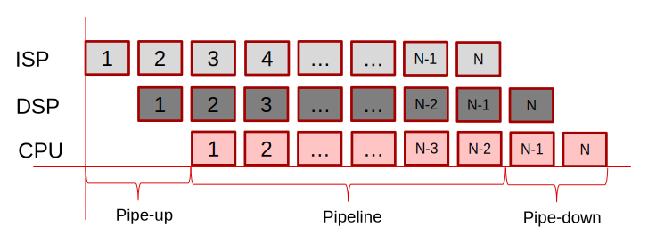

// Copyright (c) 2017-2019 Khronos Group. This work is licensed under a
// Creative Commons Attribution 4.0 International License; see
// http://creativecommons.org/licenses/by/4.0/

= The OpenVX^(TM)^ Graph Pipelining, Streaming, and Batch Processing Extension
:regtitle: pass:q,r[^®^]
The Khronos{regtitle} OpenVX Working Group; Editors: Kedar Chitnis, Jesse Villareal, Radhakrishna Giduthuri, and Frank Brill
:title-logo-image: images/Khronos_RGB.svg
:data-uri:
:icons: font
:toc2:
:toclevels: 3
:max-width: 100
:numbered:
:imagewidth: 800
:fullimagewidth: width="800"
:halfimagewidth: width="400"
:source-highlighter: coderay
// Various special / math symbols. This is easier to edit with than Unicode.
include::config/attribs.txt[]

// Paths to code examples and headers
:examples: examples
:headers: examples

image::images/OpenVX_RGB.svg[align="center",{halfimagewidth}]
include::copyright-spec.txt[]

<<<<

// Table of contents is inserted here
toc::[]

:leveloffset: 1

= Introduction

[[sec_purpose]]
== Purpose

Enable multiple initiations of a given graph with different inputs and
outputs. Additionally, this extension provides a mechanism for the
application to execute a graph such that the application does not need to be
involved with data reconfiguration and starting processing of the graph for
each set of input/output data.

[[sec_acknowledge]]
== Acknowledgements

This specification would not be possible without the contributions from this
partial list of the following individuals from the Khronos Working Group and
the companies that they represented at the time:

  * Kedar Chitnis - Texas Instruments, Inc.
  * Jesse Villarreal - Texas Instruments, Inc.
  * Radhakrishna Giduthuri - Intel
  * Tomer Schwartz - Intel
  * Frank Brill - Cadence Design Systems
  * Thierry Lepley - Cadence Design Systems

[[sec_background]]
== Background and Terminology

This section introduces the concepts of graph pipelining, streaming and
batch processing before getting into the details of how OpenVX is extended
to support these features.

[[sec_pipelining]]
=== Graph Pipelining

In order to demonstrate what is meant by pipelined execution, please refer
to the following example system which executes the simple graph in a
distributed manner:

.Example SoC and Distributed Graph

In this example, there are three compute units: an Image Signal Processor
(ISP) HWA, a Digital Signal Processor (DSP), and a CPU. The example graph
likewise, has three nodes: generically labelled Node 0, Node 1, and Node 2.
There could be more or less nodes than compute units, but here, the number
of nodes happens to be equal to the number of compute units. In this graph,
Node 0 is executed on the ISP, Node 1 is executed on the DSP, and Node 2 is
executed on the CPU. Without pipelining enabled, the execution timeline of
this graph is shown below:

.Non-pipelined Execution

Assuming each node takes 33ms to execute, then the full graph takes 99ms to
execute. Without this extension, OpenVX requires that a second frame can not
start graph execution on this same graph until the first graph execution is
completed. This means that the maximum throughput of this example will be
one frame completing every 99ms. However, in this example, you can see that
each compute unit is only utilized no more than one-third of the time.
Furthermore, if the camera input produced a frame every 33ms, then every two
out of three frames would need to be "`dropped`" by the system since this
OpenVX graph implementation can not keep up with the input frame rate of the
camera.

Pipelining the graph exection will both increase the hardware utilization, and
increase the throughput of the OpenVX implementation.  These effects can be
seen in the timeline of a pipelined execution of the graph below:

[[fig-pipelined-exec]]
.Frame-Level Pipelined Execution

Here, the latency of the graph is still 99ms, but the throughput has been
increased to one frame completing every 33ms, allowing the graph to run
in real-time with the camera frame-rate.

Now, in this simple example, a lot of assumptions were made in order to
illustrate the concept. We assumed that each node took the same amount of
time, so pipelining looked like we went from 33% core utilization to 100%
core utilization. In practice, this ideal is almost never true. Processing
times will vary across both kernels and cores. So although pipelining may
bring about increased utilization and throughput, the actual frame rate will
be determined by the execution time of the pipeline stage with the longest
execution time.

In order to enable pipelining, the implementation must provide a way for the
application to update the input and output data for future executions of the
graph while previously scheduled graphs are still in the executing state.
Likewise, the implementation must allow scheduling and starting of graph
executions while previously scheduled graphs are still in the executing
state. The <<sec_design_pipelining>> section introduces new APIs and gives
code examples for how this extension enables this basic pipelining support.
The <<sec_design_event>> section extends the controllability and timing of
WHEN to exchange frames and schedule new frames using events.

[[sec_batch_processing]]
=== Graph Batch Processing

Batch processing refers to the ability to execute a graph on a group or
batch of input and output references. Here the user provides a list of input
and output references and a single graph schedule call processes the data
without further intervention of the user application. When a batch of input
and output references is provided to the implementation, it allows the
implementation to potentially parallelize the execution of the graphs on
each input/output reference such that overall higher throughput and
performance is achieved as compared to sequentially executing the graph for
each input/output reference.

.Graph Batch Processing

The <<sec_design_pipelining>> section introduces new APIs and gives code
examples for how this extension enables batch processing support.

[[sec_streaming]]
=== Graph Streaming

Graph streaming refers to the ability of the OpenVX implementation to
automatically handle graph input and output updates and
re-schedule each frame without intervention from the application.
The concept of graph streaming is orthogonal to graph pipelining.
Pipelining can be enabled or disabled on a graph which has streaming
enabled or disabled, and vice-versa.

In order to enable graph streaming, the implementation must provide a way
for the application to enter and exit this streaming mode.  Additionally,
the implementation must somehow manage the input and output swapping
with upstream and downstream components outside of the OpenVX implementation.
This can be handled with the concept of SOURCE nodes and SINK nodes.

A SOURCE node is a node which coordinates the supply of input
into the graph from upstream components (such as a camera), and the SINK
node is a node which coordinates the handoff of output from the graph
into downstream components (such as a display).

.Source/Sink Nodes added for Graph Streaming

The <<sec_design_streaming>> section introduces new APIs and gives code
examples for how this extension enables this basic streaming support.

[[page_design]]
= Design Overview

[[data_references]]
== Data reference

In this extension, the term _data reference_ is used frequently. In this
section we define this term.

Data references are OpenVX references to any of the OpenVX data types listed
below,

  - `VX_TYPE_LUT`
  - `VX_TYPE_DISTRIBUTION`
  - `VX_TYPE_PYRAMID`
  - `VX_TYPE_THRESHOLD`
  - `VX_TYPE_MATRIX`
  - `VX_TYPE_CONVOLUTION`
  - `VX_TYPE_SCALAR`
  - `VX_TYPE_ARRAY`
  - `VX_TYPE_IMAGE`
  - `VX_TYPE_REMAP`
  - `VX_TYPE_OBJECT_ARRAY`
  - `VX_TYPE_TENSOR` (OpenVX 1.2 and above)

The APIs which operate on data references take as input a `vx_reference`
type. An application can pass any of the above defined data type references
to such an API.

[[sec_design_pipelining]]
== Pipelining and Batch Processing

Pipelining and Batch Processing APIs allow an application to construct a
graph which can be executed in a pipelined fashion (see <<sec_pipelining>>),
or batch processing fashion (see <<sec_batch_processing>>).

[[sec_design_queue]]
=== Graph Parameter Queues

The concept of OpenVX "`Graph Parameters`" is defined in the main OpenVX
spec as a means to expose external ports of a graph. Graph parameters enable
the abstraction of the remaining graph ports which are not connected as
graph parameters. Since graph pipelining and batching is concerned primarily
with controlling the flow of data to and from the graph, OpenVX graph
parameters provide a useful construct for enabling pipelining and batching.

This extension introduces the concept of _graph parameter queueing_ to
enable assigning multiple data objects to a graph parameter (either at once,
or spaced in time) without needing to wait for the previous graph
completion(s). At runtime, the application can utilize the
`<<vxGraphParameterEnqueueReadyRef>>` function to enqueue a number of data
references into a graph parameter to be used by the graph. Likewise, the
application can use the `<<vxGraphParameterDequeueDoneRef>>` function to
dequeue a number of data references from a graph parameter after the graph
is done using them (thus, making them available for the application). The
`<<vxGraphParameterCheckDoneRef>>` function is a non-blocking call that can
be used to determine if there are references available for dequeuing, and if
so, how many.

In order for the implementation to know which graph parameters it needs to
support queuing on, the application should configure this by calling
`<<vxSetGraphScheduleConfig>>` before calling `vxVerifyGraph` or
`vxScheduleGraph`.

[[sec_graph_schedule_config]]
=== Graph Schedule Configuration

The graph schedule configuration function (`<<vxSetGraphScheduleConfig>>`)
allows users to enable enqueuing of multiple input and output references to
a graph parameter. It also allows users to control how the graph gets
scheduled based on the references enqueued by the user.

The _graph_schedule_mode_ parameter defines two modes of graph scheduling:

  . `<<VX_GRAPH_SCHEDULE_MODE_QUEUE_MANUAL,VX_GRAPH_SCHEDULE_MODE_QUEUE_MANUAL>>`
  ** Here the application enqueues the references to be processed at a graph
     parameter
  ** Later when application calls `vxScheduleGraph`, all the previously
     enqueued references get processed.
  ** Enqueuing multiple references and calling a single
     `vxScheduleGraph` allows implementation flexibility to optimize the
     execution of the multiple graph executions based on the number of the
     enqueued references.
  . `<<VX_GRAPH_SCHEDULE_MODE_QUEUE_AUTO,VX_GRAPH_SCHEDULE_MODE_QUEUE_AUTO>>`
  ** Here also, the user enqueues the references that they want to process
     at a graph parameter
  ** However here user does not explicitly call `vxScheduleGraph`
  ** `vxVerifyGraph` _must_ be called in this mode (since
     `vxScheduleGraph` is not called).
  ** The implementation automatically triggers graph execution when it has
     enough enqueued references to start a graph execution
  ** Enqueuing multiple references without calling `vxScheduleGraph`
     allows the implementation to start a graph execution as soon as minimal
     input or output references are available.

In both of these modes, `vxProcessGraph` is not allowed. The next two
sections show how the graph schedule configuration, along with reference
enqueue and dequeue is used to realize the graph pipelining and batch
processing use-cases.

[[sec_queue]]
=== Example Graph pipelining application

Graph pipelining allow users to schedule a graph multiple times, without
having to wait for a graph execution to complete. Each such execution of the
graph operates on different input or output references.

In a typical pipeline execution model, there is a pipe-up phase where new
inputs are enqueued and graph is scheduled multiple times until the pipeline
is full. Once the pipeline is full, then outputs begin to be filled as often
as inputs are enqueued (as shown in <<fig-pipelined-exec>>).

.3 Phases of pipeline: pipe-up, pipeline, and pipe-down

In order for the graph to be executed in a pipelined fashion, the steps
outlined below need to be followed by an application:

  . Create a graph and add nodes to the graph as usual.
  . For data references which need to be enqueued and dequeued by the
    application, add them as graph parameters.
  . Call `<<vxSetGraphScheduleConfig>>` with the parameters as follows:
  ** Set scheduling mode
     (`<<VX_GRAPH_SCHEDULE_MODE_QUEUE_MANUAL,VX_GRAPH_SCHEDULE_MODE_QUEUE_MANUAL>>`
     or
     `<<VX_GRAPH_SCHEDULE_MODE_QUEUE_AUTO,VX_GRAPH_SCHEDULE_MODE_QUEUE_AUTO>>`).
  ** List the graph parameters on which enqueue / dequeue operations are
     required.
  ** For these parameters specify the list of references that could be
     enqueued later.
  . All other data references created in, and associated with, the graph are
    made specific to the graph. A data reference can be made specific to a
    graph by either creating it as virtual or by exporting and re-importing
    the graph using the import/export extension.
  . Delays in the graph, if any, MUST be set to auto-age using
    `vxRegisterAutoAging`.
  . Verify the graph using `vxVerifyGraph`.
  . Now data reference enqueue / dequeue can be done on associated graph
    parameters using `<<vxGraphParameterEnqueueReadyRef>>` and
    `<<vxGraphParameterDequeueDoneRef>>`.
  . Graph execution on enqueued parameters depends on the scheduling mode
    chosen:
  ** `<<VX_GRAPH_SCHEDULE_MODE_QUEUE_MANUAL,VX_GRAPH_SCHEDULE_MODE_QUEUE_MANUAL>>`:
     User manually schedules the graph on the full set of all enqueued
     parameters by calling `vxScheduleGraph`. This gives more control to
     the application to limit when the graph execution on enqueued
     parameters can begin.
  ** `<<VX_GRAPH_SCHEDULE_MODE_QUEUE_AUTO,VX_GRAPH_SCHEDULE_MODE_QUEUE_AUTO>>`:
     Implementation automatically schedules graph as long as enough data is
     enqueued to it. This gives more control to the implementation to decide
     when the graph execution on enqueued parameters can begin.
  . `<<vxGraphParameterCheckDoneRef>>` can be used to determine when to
    dequeue graph parameters for completed graph executions.
  . In order to gracefully end graph pipelining, the application should
    cease enqueing graph parameters, and call `vxWaitGraph` to wait for
    the in-flight graph executions to complete. When the call returns, call
    `<<vxGraphParameterDequeueDoneRef>>` on all the graph parameters to
    return control of the buffers to the application.

The following code offers an example of the process outlined above, using
`<<VX_GRAPH_SCHEDULE_MODE_QUEUE_AUTO,VX_GRAPH_SCHEDULE_MODE_QUEUE_AUTO>>`
scheduling mode.

[source,c,indent=0]
----
include::{examples}/vx_khr_pipelining_sample.c[tag=graph_pipeline]
----

[[sec_batch_processing_app]]
=== Example Batch processing application

In order for the graph to be executed in batch processing mode, the steps
outlined below need to be followed by an application:

  . Create a graph and add nodes to the graph as usual.
  . For data references which need to be "`batched`" by the application, add
    them as graph parameters.
  . Call `<<vxSetGraphScheduleConfig>>` with the parameters as follows:
  ** Set scheduling mode
     (`<<VX_GRAPH_SCHEDULE_MODE_QUEUE_MANUAL,VX_GRAPH_SCHEDULE_MODE_QUEUE_MANUAL>>`
     or
     `<<VX_GRAPH_SCHEDULE_MODE_QUEUE_AUTO,VX_GRAPH_SCHEDULE_MODE_QUEUE_AUTO>>`).
  ** List the graph parameters which will be batch processed.
  ** For these parameters specify the list of references that could be
     enqueued later for batch processing.
  . All other data references created in, and associated with the graph are
    made specific to the graph. A data reference can be made specific to a
    graph by either creating it as virtual or by exporting and re-importing
    the graph using the import/export extension.
  . Delays in the graph, if any, MUST be set to auto-age using
    `vxRegisterAutoAging`.
  . Verify the graph using `vxVerifyGraph`.
  . To execute the graph:
  ** Enqueue the data references which need to be processed in a batch using
     `<<vxGraphParameterEnqueueReadyRef>>`.
  ** If scheduling mode was set to
     `<<VX_GRAPH_SCHEDULE_MODE_QUEUE_MANUAL,VX_GRAPH_SCHEDULE_MODE_QUEUE_MANUAL>>`,
     use `vxScheduleGraph` to trigger the batch processing.
  ** Use `vxWaitGraph` to wait for the batch processing to complete.
  ** Dequeue the processed data references using
     `<<vxGraphParameterDequeueDoneRef>>`.

The following code offers an example of the process outlined above using
`<<VX_GRAPH_SCHEDULE_MODE_QUEUE_MANUAL,VX_GRAPH_SCHEDULE_MODE_QUEUE_MANUAL>>`
scheduling mode.

[source,c,indent=0]
----
include::{examples}/vx_khr_pipelining_sample.c[tag=graph_batch_processing]
----

[[sec_design_streaming]]
== Streaming

OpenVX APIs allow a user to construct a graph with source nodes and sink
nodes. A source node is a node which internally sources and outputs data to
one or more data references.  A camera capture node is an example of a
source node. A sink node is a node which takes one or more
data references as input but has no output data references. A display
node is an example of a sink node.  For such a graph, graph
execution can be started in streaming mode, wherein, user intervention is
not needed to re-schedule the graph each time.

[[sec_sourcesink]]
=== Source/sink user nodes

Source/sink user nodes are implemented using the existing user kernel OpenVX
API.

The following is an example of streaming user source node where the
data references are coming from a vendor specific capture device component:

[source,c,indent=0]
----
include::{examples}/vx_khr_streaming_sample.c[tag=streaming_source_node]
----

Likewise, the following is an example of streaming user sink node where the
data references are going to a vendor specific display device component:

[source,c,indent=0]
----
include::{examples}/vx_khr_streaming_sample.c[tag=streaming_sink_node]
----

In both these examples, the user node "`swaps`" the reference provided by the
implementation with another "`compatible`" reference. This allows user nodes
to implement zero-copy capture and display functions.

[[sec_source_pipeup]]
=== Kernel Pipeup

In the previous section, the source and sink nodes were responsible for creating
"`compatible`" references for "`swapping`" to implement zero-copy functions.
In this section, we introduce an alternative method wherein the framework
creates the required reference copies, and passes them to the user nodes.

This can be done with the addition of the following new attributes:

  * `<<VX_KERNEL_PIPEUP_OUTPUT_DEPTH,VX_KERNEL_PIPEUP_OUTPUT_DEPTH>>`, `<<VX_KERNEL_PIPEUP_INPUT_DEPTH,VX_KERNEL_PIPEUP_INPUT_DEPTH>>`: These attributes
    may be set when registering the kernel (between the call to vxAddUserKernel and vxFinalizeKernel) using the vxSetKernelAttribute function.  It is used to
    notify the framework what the pipeup depth is for this kernel.  `<<VX_KERNEL_PIPEUP_OUTPUT_DEPTH,VX_KERNEL_PIPEUP_OUTPUT_DEPTH>>` is used for source
    nodes and `<<VX_KERNEL_PIPEUP_INPUT_DEPTH,VX_KERNEL_PIPEUP_INPUT_DEPTH>>` is used for sink nodes.
  * `<<VX_NODE_STATE, VX_NODE_STATE>>`: This attribute may be queried by the execution function of the kernel to determine
    which state the node is in.  The options are: `<<VX_NODE_STATE_STEADY,VX_NODE_STATE_STEADY>>` and `<<VX_NODE_STATE_PIPEUP,VX_NODE_STATE_PIPEUP>>`.
    If the `<<VX_KERNEL_PIPEUP_OUTPUT_DEPTH,VX_KERNEL_PIPEUP_OUTPUT_DEPTH>>` or `<<VX_KERNEL_PIPEUP_INPUT_DEPTH,VX_KERNEL_PIPEUP_INPUT_DEPTH>>`
    attribute has been set to a value greater than 1, then node state
    will start in the `<<VX_NODE_STATE_PIPEUP,VX_NODE_STATE_PIPEUP>>` state the first time the graph is executed after vxVerifyGraph is called.
    ** In the case of `<<VX_KERNEL_PIPEUP_OUTPUT_DEPTH,VX_KERNEL_PIPEUP_OUTPUT_DEPTH>>` (source nodes):
    *** `<<VX_NODE_STATE_PIPEUP,VX_NODE_STATE_PIPEUP>>` : In this state, the during the first execution of the graph, the framework calls the
       execution callback of the node associated with this kernel
       (pipeup_depth - 1) times before it 'expects' a valid output and calls nodes dependent on the output.
       During this state, the framework provides the same set of input parameters for each call, but provides
       different set of output parameters for each call.
    *** `<<VX_NODE_STATE_STEADY,VX_NODE_STATE_STEADY>>` : After the kernel has been called (pipeup_depth - 1) times, it transitions to
       `<<VX_NODE_STATE_STEADY,VX_NODE_STATE_STEADY>>` state.  Kernels which don't set the `<<VX_KERNEL_PIPEUP_OUTPUT_DEPTH,VX_KERNEL_PIPEUP_OUTPUT_DEPTH>>` attribute, or set it
       to 1, will start in this state. During this state, output parameters returned from the execution callback will be passed to dependent nodes.  If the
       kernel had primed its output buffers using the `<<VX_KERNEL_PIPEUP_OUTPUT_DEPTH,VX_KERNEL_PIPEUP_OUTPUT_DEPTH>>` attribute, the kernel may return
       a set of output parameters that was given during a previous execution of the callback instead of the ones given
       during the current execution.
    ** In the case of `<<VX_KERNEL_PIPEUP_INPUT_DEPTH,VX_KERNEL_PIPEUP_INPUT_DEPTH>>` (sink nodes):
    *** `<<VX_NODE_STATE_PIPEUP,VX_NODE_STATE_PIPEUP>>` : In this state, the framework executes the graph
       (pipeup_depth - 1) times before it 'expects' any consumed inputs from this node to be returned to the framework.
    *** `<<VX_NODE_STATE_STEADY,VX_NODE_STATE_STEADY>>` : After the graph has been called (pipeup_depth - 1) times, it transitions to
       `<<VX_NODE_STATE_STEADY,VX_NODE_STATE_STEADY>>` state.  Kernels which don't set the `<<VX_KERNEL_PIPEUP_INPUT_DEPTH,VX_KERNEL_PIPEUP_INPUT_DEPTH>>` attribute, or set it
       to 1, will start in this state. During this state, input parameters returned from the execution callback will be recycled and filled by upstream nodes.  If the
       kernel had retained its input buffers using the `<<VX_KERNEL_PIPEUP_INPUT_DEPTH,VX_KERNEL_PIPEUP_INPUT_DEPTH>>` attribute, the kernel may return
       a set of input parameters that was given during a previous execution of the callback instead of the ones given
       during the current execution.

The following is an example of a streaming user source node which uses these attributes:

[source,c,indent=0]
----
include::{examples}/vx_khr_streaming_sample.c[tag=streaming_source_pipeup_node]
----

Likewise, the following is an example of streaming user sink node which uses these attributes:

[source,c,indent=0]
----
include::{examples}/vx_khr_streaming_sample.c[tag=streaming_sink_pipeup_node]
----

[[sec_triggering]]
=== Graph streaming application

To execute a graph in streaming mode, the following steps need to followed
by an application:

  * Create a graph with source and sink nodes.
  * All data references created in and associated with the graph are made
    specific to the graph. A data reference can be made specific to a graph
    by either creating it as virtual or by exporting and re-importing the
    graph using the import/export extension.
  * Enable the streaming mode of graph execution using
    `<<vxEnableGraphStreaming>>`, optionally setting the trigger node. This
    must be called prior to verifying the graph.
  * Verify the graph using `vxVerifyGraph`
  * Start the streaming mode of graph execution using
    `<<vxStartGraphStreaming>>`
  * Now the graph gets re-scheduled continuously until the user application
    calls vxStopGraphStreaming.
  ** The implementation automatically decides the re-schedule trigger
     condition.
  * A user application may need to stop streaming from external control, or
    internal feedback.
  ** External control can be the end user changing modes or states, which
     prompts the application to call vxStopGraphStreaming.
  ** Internal feedback can be due to end of stream or an error condition
     detected within its node execution.
  *** In the case of an error condition detected, the user node should
      return an appropriate error status. When any error status is detected
      by the framework, the framework should trigger the VX_EVENT_NODE_ERROR
      event to signal that the node execution has experienced an error.
      The application can choose to monitor such an event and take appropriate
      action, which may include stopping the continuous graph execution by
      calling vxStopGraphStreaming.
  * In all cases, the continuous mode of graph execution is stopped at an
    implementation-defined logical boundary (e.g. after all previous graph
    executions have completed).

The following example code demonstrates how one can use these APIs in an
application,

[source,c,indent=0]
----
include::{examples}/vx_khr_streaming_sample.c[tag=streaming_application]
----

[[sec_design_event]]
== Event handling

Event handling APIs allow users to register conditions on a graph, based on
which events are generated by the implementation. User applications can then
wait for events and take appropriate action based on the received event.
User-specified events can also be generated by the application so that all
events can be handled at a centralized location. This simplifies the
application state machine, and in the case of graph pipelining, it allows
optimized scheduling of the graph.

[[sec_limitations]]
=== Motivation for event handling

  . Pipelining without events would need blocking calls on the data
    producers, consumers, and the graph itself. If there were multiple
    graphs or multiple data producers/consumers pipelined at different
    rates, one can see how the application logic can easily get complicated.
  . Applications need a mechanism to allow input references to be dequeued
    before the full graph execution is completed. This allows
    implementations to have larger pipeline depths but at the same time have
    fewer queued references at a graph parameter.

[[sec_using_event_handling]]
=== Event handling application

Event handling APIs allow user the flexibility to do early dequeue of input
references, and late enqueue of output references. It enables applications
to effectively block at a single centralized location for both
implementation-generated events as well as user-generated events. Event
handling allows the graph to produce events which can then be used by the
application. For example, if the thread had an event handler that is used to
manage multiple graphs, consumers, and producers, then the events produced
by the implementation could feed into this manager. Likewise, early dequeue
of input can be achieved, if the event handler could use the graph parameter
consumed events to trigger calls to `<<vxGraphParameterEnqueueReadyRef>>`,
`<<vxGraphParameterDequeueDoneRef>>`.

The following code offers an example of the event handling.

[source,c,indent=0]
----
include::{examples}/vx_khr_pipelining_sample.c[tag=graph_events]
----

[[module_documentation]]
= Module Documentation

[[group_pipelining]]
== Pipelining and Batch Processing

// tag::group_pipelining:summary[]
*Data Structures*

  * `<<vx_graph_parameter_queue_params_t>>`

//@ *Macros*
//@
//@   * `<<VX_LIBRARY_KHR_PIPELINING_EXTENSION,VX_LIBRARY_KHR_PIPELINING_EXTENSION>>`

*Enumerations*

  * `<<vx_graph_schedule_mode_enum_e>>`
  * `<<vx_graph_schedule_mode_type_e>>`
  * `<<vx_graph_attribute_pipelining_e>>`

*Functions*

  * `<<vxSetGraphScheduleConfig>>`
  * `<<vxGraphParameterEnqueueReadyRef>>`
  * `<<vxGraphParameterDequeueDoneRef>>`
  * `<<vxGraphParameterCheckDoneRef>>`

// end::group_pipelining:summary[]

// @brief
This section lists the APIs required for graph pipelining and batch
processing.

// tag::group_pipelining:details[]
=== Data Structures

// tag::refpage:vx_graph_parameter_queue_params_t[]
// [desc='',type='structs']
==== vx_graph_parameter_queue_params_t

// Brief text:
Queueing parameters for a specific graph parameter.

include::api/structs/vx_graph_parameter_queue_params_t.txt[]

// Detailed text:
  * _graph_parameter_index_ -   Index of graph parameter to which these properties apply
  * _refs_list_size_ -   Number of elements in array _refs_list_
  * _refs_list_ -   Array of references that could be enqueued at a later point of time at this graph parameter

See `<<vxSetGraphScheduleConfig>>` for additional details.

// end::refpage:vx_graph_parameter_queue_params_t[]

//@ === Macros
//@
//@ // tag::refpage:VX_LIBRARY_KHR_PIPELINING_EXTENSION[]
//@ // [desc='',type='defines']
//@ ==== VX_LIBRARY_KHR_PIPELINING_EXTENSION
//@
//@ // Brief text:
//@ The Pipelining, Streaming and Batch Processing Extension Library Set.
//@
//@ include::api/defines/VX_LIBRARY_KHR_PIPELINING_EXTENSION.txt[]
//@
//@ // end::refpage:VX_LIBRARY_KHR_PIPELINING_EXTENSION[]

=== Enumerations

// tag::refpage:vx_graph_schedule_mode_enum_e[]
// [desc='',type='enums']
==== vx_graph_schedule_mode_enum_e

// Brief text:
Extra enums.

include::api/enums/vx_graph_schedule_mode_enum_e.txt[]

*Enumerator*

  * [[VX_ENUM_GRAPH_SCHEDULE_MODE_TYPE]]
    `VX_ENUM_GRAPH_SCHEDULE_MODE_TYPE` - Graph schedule mode type
    enumeration.
// end::refpage:vx_graph_schedule_mode_enum_e[]

// tag::refpage:vx_graph_schedule_mode_type_e[]
// [desc='',type='enums']
==== vx_graph_schedule_mode_type_e

// Brief text:
Type of graph scheduling mode.

include::api/enums/vx_graph_schedule_mode_type_e.txt[]

// Detailed text:
See `<<vxSetGraphScheduleConfig>>` and `<<vxGraphParameterEnqueueReadyRef>>`
for details about each mode.

*Enumerator*

  * [[VX_GRAPH_SCHEDULE_MODE_NORMAL]]
    `VX_GRAPH_SCHEDULE_MODE_NORMAL` - Schedule graph in non-queueing mode.
  * [[VX_GRAPH_SCHEDULE_MODE_QUEUE_AUTO]]
    `VX_GRAPH_SCHEDULE_MODE_QUEUE_AUTO` - Schedule graph in queueing mode with
    auto scheduling.
  * [[VX_GRAPH_SCHEDULE_MODE_QUEUE_MANUAL]]
    `VX_GRAPH_SCHEDULE_MODE_QUEUE_MANUAL` - Schedule graph in queueing mode
    with manual scheduling.

// end::refpage:vx_graph_schedule_mode_type_e[]

// tag::refpage:vx_graph_attribute_pipelining_e[]
// [desc='',type='enums']
==== vx_graph_attribute_pipelining_e

// Brief text:
The graph attributes added by this extension.

include::api/enums/vx_graph_attribute_pipelining_e.txt[]

*Enumerator*

  * [[VX_GRAPH_SCHEDULE_MODE]]
    `VX_GRAPH_SCHEDULE_MODE` - Returns the schedule mode of a graph.
    Read-only. Use a `vx_enum` parameter. See
    `<<vx_graph_schedule_mode_type_e>>` enum.
// end::refpage:vx_graph_attribute_pipelining_e[]

=== Functions

// tag::refpage:vxSetGraphScheduleConfig[]
// [desc='',type='protos']
==== vxSetGraphScheduleConfig

// Brief text:
Sets the graph scheduler config.

include::api/protos/vxSetGraphScheduleConfig.txt[]

// Detailed text:
This API is used to set the graph scheduler config to allow user to schedule
multiple instances of a graph for execution.

For legacy applications that don't need graph pipelining or batch
processing, this API need not be used.

Using this API, the application specifies the graph schedule mode, as well
as queueing parameters for all graph parameters that need to allow
enqueueing of references. A single monolithic API is provided instead of
discrete APIs, since this allows the implementation to get all information
related to scheduling in one shot and then optimize the subsequent graph
scheduling based on this information. *This API MUST be called before graph
verify*, since in this case it allows implementations the opportunity to
optimize resources based on information provided by the application.

_graph_schedule_mode_ selects how input and output references are provided
to a graph and how the next graph schedule is triggered by an
implementation.

Below scheduling modes are supported:

When graph schedule mode is `<<VX_GRAPH_SCHEDULE_MODE_QUEUE_AUTO,VX_GRAPH_SCHEDULE_MODE_QUEUE_AUTO>>`:

  * Application needs to explicitly call `vxVerifyGraph` before enqueing
    data references
  * Application should not call `vxScheduleGraph` or `vxProcessGraph`
  * When enough references are enqueued at various graph parameters, the
    implementation could trigger the next graph schedule.
  * Here, not all graph parameters need to have enqueued references for a
    graph schedule to begin. An implementation is expected to execute the
    graph as much as possible until an enqueued reference is not available at
    which time it will stall the graph until the reference becomes
    available. This allows application to schedule a graph even when all
    parameters references are not yet available, i.e do a "`late`" enqueue.
    However, exact behaviour is implementation specific.

When graph schedule mode is `<<VX_GRAPH_SCHEDULE_MODE_QUEUE_MANUAL,VX_GRAPH_SCHEDULE_MODE_QUEUE_MANUAL>>`:

  * Application needs to explicitly call `vxScheduleGraph`
  * Application should not call `vxProcessGraph`
  * References for all graph parameters of the graph needs to enqueued
    before `vxScheduleGraph` is called on the graph else an error is returned
    by `vxScheduleGraph`
  * Application can enqueue multiple references at the same graph parameter.
    When `vxScheduleGraph` is called, all enqueued references get processed in
    a "`batch`".
  * User can use `vxWaitGraph` to wait for the previous `vxScheduleGraph` to
    complete.

When graph schedule mode is `<<VX_GRAPH_SCHEDULE_MODE_NORMAL,VX_GRAPH_SCHEDULE_MODE_NORMAL>>`:

  * _graph_parameters_list_size_ MUST be 0 and
  * _graph_parameters_queue_params_list_ MUST be NULL
  * This mode is equivalent to non-queueing scheduling mode as defined by
    OpenVX v1.2 and earlier.

By default all graphs are in `VX_GRAPH_SCHEDULE_MODE_NORMAL` mode until this
API is called.

_graph_parameters_queue_params_list_ allows to specify below information:

  * For the graph parameter index that is specified, it enables queueing
    mode of operation
  * Further it allows the application to specify the list of references that
    it could later enqueue at this graph parameter.

For graph parameters listed in _graph_parameters_queue_params_list_,
application MUST use `<<vxGraphParameterEnqueueReadyRef>>` to set references
at the graph parameter. Using other data access API's on these parameters or
corresponding data objects will return an error. For graph parameters not
listed in _graph_parameters_queue_params_list_ application MUST use the
`vxSetGraphParameterByIndex` to set the reference at the graph parameter.
Using other data access API's on these parameters or corresponding data
objects will return an error.

This API also allows application to provide a list of references which could
be later enqueued at the graph parameter. This allows implementation to do
meta-data checking up front rather than during each reference enqueue.

When this API is called before `vxVerifyGraph`, the _refs_list_ field can be
NULL, if the reference handles are not available yet at the application.
However _refs_list_size_ MUST always be specified by the application.
Application can call `<<vxSetGraphScheduleConfig>>` again after verify graph
with all parameters remaining the same except with _refs_list_ field
providing the list of references that can be enqueued at the graph
parameter.

*Parameters*

  * `[in]` _graph_ - Graph reference
  * `[in]` _graph_schedule_mode_ - Graph schedule mode. See
    `<<vx_graph_schedule_mode_type_e>>`
  * `[in]` _graph_parameters_list_size_ - Number of elements in
    _graph_parameters_queue_params_list_
  * `[in]` _graph_parameters_queue_params_list_ - Array containing queuing
    properties at graph parameters that need to support queueing.

*Returns:* A `vx_status_e` enumeration.

*Return Values*

  * `VX_SUCCESS` - No errors.
  * `VX_ERROR_INVALID_REFERENCE` - _graph_ is not a valid reference
  * `VX_ERROR_INVALID_PARAMETERS` - Invalid graph parameter queueing
    parameters
  * `VX_FAILURE` - Any other failure.
// end::refpage:vxSetGraphScheduleConfig[]

// tag::refpage:vxGraphParameterEnqueueReadyRef[]
// [desc='',type='protos']
==== vxGraphParameterEnqueueReadyRef

// Brief text:
Enqueues new references into a graph parameter for processing.

include::api/protos/vxGraphParameterEnqueueReadyRef.txt[]

// Detailed text:
This new reference will take effect on the next graph schedule.

In case of a graph parameter which is input to a graph, this function
provides a data reference with new input data to the graph. In case of a
graph parameter which is not input to a graph, this function provides a
"`empty`" reference into which a graph execution can write new data into.

This function essentially transfers ownership of the reference from the
application to the graph.

User MUST use `<<vxGraphParameterDequeueDoneRef>>` to get back the processed
or consumed references.

The references that are enqueued MUST be the references listed during
`<<vxSetGraphScheduleConfig>>`. If a reference outside this list is provided
then behaviour is undefined.

*Parameters*

  * `[in]` _graph_ - Graph reference
  * `[in]` _graph_parameter_index_ - Graph parameter index
  * `[in]` _refs_ - The array of references to enqueue into the graph parameter
  * `[in]` _num_refs_ - Number of references to enqueue

*Returns:* A `vx_status_e` enumeration.

*Return Values*

  * `VX_SUCCESS` - No errors.
  * `VX_ERROR_INVALID_REFERENCE` - _graph_ is not a valid reference OR
    reference is not a valid reference
  * `VX_ERROR_INVALID_PARAMETERS` - _graph_parameter_index_ is NOT a
    valid graph parameter index
  * `VX_FAILURE` - Reference could not be enqueued.
// end::refpage:vxGraphParameterEnqueueReadyRef[]

// tag::refpage:vxGraphParameterDequeueDoneRef[]
// [desc='',type='protos']
==== vxGraphParameterDequeueDoneRef

// Brief text:
Dequeues "`consumed`" references from a graph parameter.

include::api/protos/vxGraphParameterDequeueDoneRef.txt[]

// Detailed text:
This function dequeues references from a graph parameter of a graph. The
reference that is dequeued is a reference that had been previously enqueued
into a graph, and after subsequent graph execution is considered as
processed or consumed by the graph. This function essentially transfers
ownership of the reference from the graph to the application.

*IMPORTANT* : This API will block until at least one reference is dequeued.

In case of a graph parameter which is input to a graph, this function
provides a "`consumed`" buffer to the application so that new input data can
filled and later enqueued to the graph. In case of a graph parameter which
is not input to a graph, this function provides a reference filled with new
data based on graph execution. User can then use this newly generated data
with their application. Typically when this new data is consumed by the
application the "`empty`" reference is again enqueued to the graph.

This API returns an array of references up to a maximum of _max_refs_.
Application MUST ensure the array pointer (_refs_) passed as input can hold
_max_refs_. _num_refs_ is actual number of references returned and will be
less than or equal to _max_refs_.

*Parameters*

  * `[in]` _graph_ - Graph reference
  * `[in]` _graph_parameter_index_ - Graph parameter index
  * `[in]` _refs_ - Pointer to an array of max elements _max_refs_
  * `[out]` _refs_ - Dequeued references filled in the array
  * `[in]` _max_refs_ - Max number of references to dequeue
  * `[out]` _num_refs_ - Actual number of references dequeued.

*Returns:* A `vx_status_e` enumeration.

*Return Values*

  * `VX_SUCCESS` - No errors.
  * `VX_ERROR_INVALID_REFERENCE` - _graph_ is not a valid reference
  * `VX_ERROR_INVALID_PARAMETERS` - _graph_parameter_index_ is NOT a
    valid graph parameter index
  * `VX_FAILURE` - Reference could not be dequeued.
// end::refpage:vxGraphParameterDequeueDoneRef[]

// tag::refpage:vxGraphParameterCheckDoneRef[]
// [desc='',type='protos']
==== vxGraphParameterCheckDoneRef

// Brief text:
Checks and returns the number of references that are ready for dequeue.

include::api/protos/vxGraphParameterCheckDoneRef.txt[]

// Detailed text:
This function checks the number of references that can be dequeued and
returns the value to the application.

See also `<<vxGraphParameterDequeueDoneRef>>`.

*Parameters*

  * `[in]` _graph_ - Graph reference
  * `[in]` _graph_parameter_index_ - Graph parameter index
  * `[out]` _num_refs_ - Number of references that can be dequeued using

*Returns:* A `vx_status_e` enumeration.

*Return Values*

  * `VX_SUCCESS` - No errors.
  * `VX_ERROR_INVALID_REFERENCE` - _graph_ is not a valid reference
  * `VX_ERROR_INVALID_PARAMETERS` - _graph_parameter_index_ is NOT a valid
    graph parameter index
  * `VX_FAILURE` - Any other failure.
// end::refpage:vxGraphParameterCheckDoneRef[]

// end::group_pipelining:details[]

[[group_streaming]]
== Streaming

// tag::group_streaming:summary[]
*Enumerations*

  * `<<vx_node_state_enum_e>>`
  * `<<vx_node_state_e>>`
  * `<<vx_node_attribute_streaming_e>>`
  * `<<vx_kernel_attribute_streaming_e>>`

*Functions*

  * `<<vxEnableGraphStreaming>>`
  * `<<vxStartGraphStreaming>>`
  * `<<vxStopGraphStreaming>>`

// end::group_streaming:summary[]

// @brief
This section lists the APIs required for graph streaming.

=== Enumerations

// tag::refpage:vx_node_state_enum_e[]
// [desc='',type='enums']
==== vx_node_state_enum_e

// Brief text:
Extra enums.

include::api/enums/vx_node_state_enum_e.txt[]

*Enumerator*

  * [[VX_ENUM_NODE_STATE_TYPE]]
    `VX_ENUM_NODE_STATE_TYPE` - Node state type enumeration.
// end::refpage:vx_node_state_enum_e[]

// tag::refpage:vx_node_state_e[]
// [desc='',type='enums']
==== vx_node_state_e

// Brief text:
Node state

include::api/enums/vx_node_state_e.txt[]

// Detailed text:

*Enumerator*

  * [[VX_NODE_STATE_STEADY]]
    `VX_NODE_STATE_STEADY` - Node is in steady state (output expected for each invocation).
  * [[VX_NODE_STATE_PIPEUP]]
    `VX_NODE_STATE_PIPEUP` - Node is in pipeup state (output not expected for each invocation).

// end::refpage:vx_node_state_e[]

// tag::refpage:vx_node_attribute_streaming_e[]
// [desc='',type='enums']
==== vx_node_attribute_streaming_e

// Brief text:
The node attributes added by this extension.

include::api/enums/vx_node_attribute_streaming_e.txt[]

*Enumerator*

  * [[VX_NODE_STATE]]
    `VX_NODE_STATE` - Queries the state of the node.
    Read-only. Use a `vx_enum` parameter. See
    `<<vx_node_state_e>>` enum.

// end::refpage:vx_node_attribute_streaming_e[]

// tag::refpage:vx_kernel_attribute_streaming_e[]
// [desc='',type='enums']
==== vx_kernel_attribute_streaming_e

// Brief text:
The kernel attributes added by this extension.

include::api/enums/vx_kernel_attribute_streaming_e.txt[]

*Enumerator*

  * [[VX_KERNEL_PIPEUP_OUTPUT_DEPTH]]
    `VX_KERNEL_PIPEUP_OUTPUT_DEPTH` - The pipeup depth required by the kernel.
     This is called by kernels that need to be primed with multiple output buffers before it can
     begin to return them.  A typical use case for this is a source node which needs to provide and
     retain multiple empty buffers to a camera driver to fill.  The first time the graph is executed
     after vxVerifyGraph is called, the framework calls the node associated with this kernel
     (pipeup_output_depth - 1) times before 'expecting' a valid output and calling downstream nodes.
     During this PIPEUP state, the framework provides the same set of input parameters for each
     call, but provides different set of output parameters for each call.  During the STEADY state,
     the kernel may return a different set of output parameters than was given during the execution callback.
     Read-write. Can be written only before user-kernel finalization.
     Use a `vx_uint32` parameter.

[NOTE]
.Note
====
If not set, it will default to 1.
====
[NOTE]
.Note
====
Setting a value less than 1 shall return VX_ERROR_INVALID_PARAMETERS
====

  * [[VX_KERNEL_PIPEUP_INPUT_DEPTH]]
    `VX_KERNEL_PIPEUP_INPUT_DEPTH` - The pipeup depth required by the kernel.
     This is called by kernels that need to retain one or more input buffers before it can
     begin to return them.  A typical use case for this is a sink node which needs to provide and
     retain one ore more filled buffers to a display driver to display.  The first (pipeup_input_depth - 1)
     times the graph is executed after vxVerifyGraph is called, the framework calls the node associated with this kernel
     without 'expecting' an input to have been consumed and returned by the node.
     During this PIPEUP state, the framework does not reuse any of the input bufers it had given to this node.
     During the STEADY state, the kernel may return a different set of input parameters than was given during
     the execution callback.
     Read-write. Can be written only before user-kernel finalization.
     Use a `vx_uint32` parameter.

[NOTE]
.Note
====
If not set, it will default to 1.
====
[NOTE]
.Note
====
Setting a value less than 1 shall return VX_ERROR_INVALID_PARAMETERS
====

// end::refpage:vx_kernel_attribute_streaming_e[]

// tag::group_streaming:details[]
=== Functions

// tag::refpage:vxEnableGraphStreaming[]
// [desc='',type='protos']
==== vxEnableGraphStreaming

// Brief text:
Enable streaming mode of graph execution.

include::api/protos/vxEnableGraphStreaming.txt[]

// Detailed text:
This API enables streaming mode of graph execution on the given graph. This
function must be called before vxVerifyGraph.  The trigger_node parameter
indicates which node should be used as the trigger node in the case that the
graph is pipelined by the implementation.  A trigger node is defined as the
node whose completion causes a new execution of the graph to be triggered. If
the graph is not pipelined by the implementation, then the trigger_node
parameter is ignored and the graph will be re-triggered upon each graph
completion. The trigger_node parameter is optional, so if it is set to NULL,
then the trigger node is implementation dependent.

*Parameters*

  * `[in]` _graph_ - Reference to the graph to start streaming mode of
    execution.
  * `[in][optional]` _trigger_node_ - Reference to the node to be used as trigger
    node of the graph.

*Returns:* A `vx_status_e` enumeration.

*Return Values*

  * `VX_SUCCESS` - No errors; any other value indicates failure.
  * `VX_ERROR_INVALID_REFERENCE` - _graph_ is not a valid `vx_graph`
    reference
// end::refpage:vxEnableGraphStreaming[]

// tag::refpage:vxStartGraphStreaming[]
// [desc='',type='protos']
==== vxStartGraphStreaming

// Brief text:
Start streaming mode of graph execution.

include::api/protos/vxStartGraphStreaming.txt[]

// Detailed text:
In streaming mode of graph execution, once an application starts graph
execution further intervention of the application is not needed to
re-schedule a graph; i.e. a graph re-schedules itself and executes
continuously until streaming mode of execution is stopped.

When this API is called, the framework schedules the graph via
`vxScheduleGraph` and returns. This graph gets re-scheduled continuously
until `<<vxStopGraphStreaming>>` is called by the user or any of the graph
nodes return error during execution.

The graph MUST be verified via `vxVerifyGraph` before calling this API. Also
user application MUST ensure no previous executions of the graph are
scheduled before calling this API.

After streaming mode of a graph has been started, a `vxScheduleGraph` should
_*not* be_ used on that graph by an application.

`vxWaitGraph` can be used as before to wait for all pending graph executions
to complete.

*Parameters*

  * `[in]` _graph_ - Reference to the graph to start streaming mode of
    execution.

*Returns:* A `vx_status_e` enumeration.

*Return Values*

  * `VX_SUCCESS` - No errors; any other value indicates failure.
  * `VX_ERROR_INVALID_REFERENCE` - _graph_ is not a valid `vx_graph`
    reference.
// end::refpage:vxStartGraphStreaming[]

// tag::refpage:vxStopGraphStreaming[]
// [desc='',type='protos']
==== vxStopGraphStreaming

// Brief text:
Stop streaming mode of graph execution.

include::api/protos/vxStopGraphStreaming.txt[]

// Detailed text:
This function blocks until graph execution is gracefully stopped at a
logical boundary, for example, when all internally scheduled graph
executions are completed.

*Parameters*

  * `[in]` _graph_ - Reference to the graph to stop streaming mode of execution.

*Returns:* A `vx_status_e` enumeration.

*Return Values*

  * `VX_SUCCESS` - No errors; any other value indicates failure.
  * `VX_FAILURE` - Graph is not started in streaming execution mode.
  * `VX_ERROR_INVALID_REFERENCE` - graph is not a valid reference.
// end::refpage:vxStopGraphStreaming[]

// end::group_streaming:details[]

[[group_event]]
== Event Handling

// tag::group_event:summary[]
*Data Structures*

  * `<<vx_event_graph_parameter_consumed>>`
  * `<<vx_event_graph_completed>>`
  * `<<vx_event_node_completed>>`
  * `<<vx_event_node_error>>`
  * `<<vx_event_user_event>>`
  * `<<vx_event_t>>`
  * `<<vx_event_info_t>>`

*Enumerations*

  * `<<vx_event_enum_e>>`
  * `<<vx_event_type_e>>`

*Functions*

  * `<<vxDisableEvents>>`
  * `<<vxEnableEvents>>`
  * `<<vxRegisterEvent>>`
  * `<<vxSendUserEvent>>`
  * `<<vxWaitEvent>>`

// end::group_event:summary[]

// @brief
This section lists the APIs required for event driven graph execution

// tag::group_event:details[]
=== Data Structures

// tag::refpage:vx_event_graph_parameter_consumed[]
// [desc='',type='structs']
[[_vx_event_graph_parameter_consumed]]
==== vx_event_graph_parameter_consumed

// Brief text:
Parameter structure returned with event of type
`<<VX_EVENT_GRAPH_PARAMETER_CONSUMED,VX_EVENT_GRAPH_PARAMETER_CONSUMED>>`.

include::api/structs/vx_event_graph_parameter_consumed.txt[]

// Detailed text:
  * _graph_ -   graph which generated this event
  * _graph_parameter_index_ -   graph parameter index which generated this event

// end::refpage:vx_event_graph_parameter_consumed[]

// tag::refpage:vx_event_graph_completed[]
// [desc='',type='structs']
[[_vx_event_graph_completed]]
==== vx_event_graph_completed

// Brief text:
Parameter structure returned with event of type
`<<VX_EVENT_GRAPH_COMPLETED,VX_EVENT_GRAPH_COMPLETED>>`.

include::api/structs/vx_event_graph_completed.txt[]

// Detailed text:
  * _graph_ -   graph which generated this event

// end::refpage:vx_event_graph_completed[]

// tag::refpage:vx_event_node_completed[]
// [desc='',type='structs']
[[_vx_event_node_completed]]
==== vx_event_node_completed

// Brief text:
Parameter structure returned with event of type
`<<VX_EVENT_NODE_COMPLETED,VX_EVENT_NODE_COMPLETED>>`.

include::api/structs/vx_event_node_completed.txt[]

// Detailed text:
  * _graph_ -   graph which generated this event
  * _node_ -   node which generated this event

// end::refpage:vx_event_node_completed[]

// tag::refpage:vx_event_node_error[]
// [desc='',type='structs']
[[_vx_event_node_error]]
==== vx_event_node_error

// Brief text:
Parameter structure returned with event of type
`<<VX_EVENT_NODE_ERROR,VX_EVENT_NODE_ERROR>>`.

include::api/structs/vx_event_node_error.txt[]

// Detailed text:
  * _graph_ -   graph which generated this event
  * _node_ -   node which generated this event
  * _status_ -   status of failed node

// end::refpage:vx_event_node_error[]

// tag::refpage:vx_event_user_event[]
// [desc='',type='structs']
[[_vx_event_user_event]]
==== vx_event_user_event

// Brief text:
Parameter structure returned with event of type
`<<VX_EVENT_USER_EVENT,VX_EVENT_USER_EVENT>>`.

include::api/structs/vx_event_user_event.txt[]

// Detailed text:
  * _user_event_parameter_ -   User defined parameter value. This is used to pass additional user defined parameters with a user event.

// end::refpage:vx_event_user_event[]

// tag::refpage:vx_event_info_t[]
// [desc='',type='structs']
[[_vx_event_info_t]]
==== vx_event_info_t

// Brief text:
Parameter structure associated with an event. Depends on type of the event.

include::api/structs/vx_event_info_t.txt[]

// Detailed text:
  * _graph_parameter_consumed_ - event information for type `<<VX_EVENT_GRAPH_PARAMETER_CONSUMED,VX_EVENT_GRAPH_PARAMETER_CONSUMED>>`
  * _graph_completed_ - event information for type `<<VX_EVENT_GRAPH_COMPLETED,VX_EVENT_GRAPH_COMPLETED>>`
  * _node_completed_ - event information for type `<<VX_EVENT_NODE_COMPLETED,VX_EVENT_NODE_COMPLETED>>`
  * _node_error_ - event information for type `<<VX_EVENT_NODE_ERROR,VX_EVENT_NODE_ERROR>>`
  * _user_event_ - event information for type `<<VX_EVENT_USER,VX_EVENT_USER>>`

// end::refpage:vx_event_info_t[]

// tag::refpage:vx_event_t[]
// [desc='',type='structs']
==== vx_event_t

// Brief text:
Data structure which holds event information.

include::api/structs/vx_event_t.txt[]

// Detailed text:
  * _type_ -   see event type `<<vx_event_type_e>>`
  * _timestamp_ -  time at which this event was generated, in units of nano-secs
  * _app_value_ -  value given to event by application during event registration (`<<vxRegisterEvent>>`) or
                   `<<vxSendUserEvent>>` in the case of user events.
  * _event_info_ -  parameter structure associated with an event. Depends on _type_ of the event

// end::refpage:vx_event_t[]

=== Enumerations

// tag::refpage:vx_event_enum_e[]
// [desc='',type='enums']
==== vx_event_enum_e

// Brief text:
Extra enums.

include::api/enums/vx_event_enum_e.txt[]

*Enumerator*

  * [[VX_ENUM_EVENT_TYPE]] `VX_ENUM_EVENT_TYPE` - Event
    Type enumeration.
// end::refpage:vx_event_enum_e[]

// tag::refpage:vx_event_type_e[]
// [desc='',type='enums']
==== vx_event_type_e

// Brief text:
Type of event that can be generated during system execution.

include::api/enums/vx_event_type_e.txt[]

*Enumerator*

  * [[VX_EVENT_GRAPH_PARAMETER_CONSUMED]]
    `VX_EVENT_GRAPH_PARAMETER_CONSUMED` - Graph parameter consumed event.
+
--
// Detailed text
This event is generated when a data reference at a graph parameter is
consumed during a graph execution. It is used to indicate that a given data
reference is no longer used by the graph and can be dequeued and accessed by
the application.

[NOTE]
.Note
====
Graph execution could still be "`in progress`" for rest of the graph that
does not use this data reference.
====
--
  * [[VX_EVENT_GRAPH_COMPLETED]]
    `VX_EVENT_GRAPH_COMPLETED` - Graph completion event.
+
--
// Detailed text
This event is generated every time a graph execution completes. Graph
completion event is generated for both successful execution of a graph or
abandoned execution of a graph.
--
  * [[VX_EVENT_NODE_COMPLETED]]
    `VX_EVENT_NODE_COMPLETED` - Node completion event.
+
--
// Detailed text
This event is generated every time a node within a graph completes execution.
--
  * [[VX_EVENT_NODE_ERROR]]
    `VX_EVENT_NODE_ERROR` - Node error event.
+
--
// Detailed text
This event is generated every time a node within a graph returns a run-time error.
--
  * [[VX_EVENT_USER]] `VX_EVENT_USER` - User defined event.
+
--
// Detailed text
This event is generated by user application outside of OpenVX framework
using the `<<vxSendUserEvent>>` API. User events allow application to have
single centralized "`wait-for`" loop to handle both framework generated events
as well as user generated events.

[NOTE]
.Note
====
Since the application initiates user events and not the framework, the application
does *NOT* register user events using `<<vxRegisterEvent>>`.
====
--
// end::refpage:vx_event_type_e[]

=== Functions

// tag::refpage:vxWaitEvent[]
// [desc='',type='protos']
==== vxWaitEvent

// Brief text:
Wait for a single event.

include::api/protos/vxWaitEvent.txt[]

// Detailed text:
After `<<vxDisableEvents>>` is called, if `<<vxWaitEvent>>(.., ..,
vx_false_e)` is called, `<<vxWaitEvent>>` will remain blocked until events
are re-enabled using `<<vxEnableEvents>>` and a new event is received.

If `vxReleaseContext` is called while an application is blocked on
`<<vxWaitEvent>>`, the behavior is not defined by OpenVX.

If `<<vxWaitEvent>>` is called simultaneously from multiple thread/task
contexts then its behaviour is not defined by OpenVX.

*Parameters*

  * `[in]` _context_ - OpenVX context
  * `[out]` _event_ - Data structure which holds information about a received
    event
  * `[in]` _do_not_block_ - When value is `vx_true_e` API does not block and
    only checks for the condition

*Returns:* A `vx_status_e` enumeration.

*Return Values*

  * `VX_SUCCESS` - Event received and event information available in
    _event_
  * `VX_FAILURE` - No event is received
// end::refpage:vxWaitEvent[]

// tag::refpage:vxEnableEvents[]
// [desc='',type='protos']
==== vxEnableEvents

// Brief text:
Enable event generation.

include::api/protos/vxEnableEvents.txt[]

// Detailed text:
Depending on the implementation, events may be either enabled or disabled
by default.

*Parameters*

  * `[in]` _context_ - OpenVX context

*Returns:* A `vx_status_e` enumeration.

*Return Values*

  * `VX_SUCCESS` - No errors; any other value indicates failure.
// end::refpage:vxEnableEvents[]

// tag::refpage:vxDisableEvents[]
// [desc='',type='protos']
==== vxDisableEvents

// Brief text:
Disable event generation.

include::api/protos/vxDisableEvents.txt[]

// Detailed text:
When events are disabled, any event generated before this API is called will
still be returned via `<<vxWaitEvent>>` API. However no additional events
would be returned via `<<vxWaitEvent>>` API until events are enabled again.

*Parameters*

  * `[in]` _context_ - OpenVX context

*Returns:* A `vx_status_e` enumeration.

*Return Values*

  * `VX_SUCCESS` - No errors; any other value indicates failure.
// end::refpage:vxDisableEvents[]

// tag::refpage:vxSendUserEvent[]
// [desc='',type='protos']
==== vxSendUserEvent

// Brief text:
Generate user defined event.

include::api/protos/vxSendUserEvent.txt[]

// Detailed text:
*Parameters*

  * `[in]` _context_ - OpenVX context
  * `[in]` _app_value_ - User defined value. NOT used by implementation.
    Returned to user as part of `<<vx_event_t>>.app_value` field.
  * `[in]` _parameter_ - User defined event parameter. NOT used
    by implementation. Returned to user as part
    `<<vx_event_t>>.event_info.user_event.user_event_parameter` field

*Returns:* A `vx_status_e` enumeration.

*Return Values*

  * `VX_SUCCESS` - No errors; any other value indicates failure.
// end::refpage:vxSendUserEvent[]

// tag::refpage:vxRegisterEvent[]
// [desc='',type='protos']
==== vxRegisterEvent

// Brief text:
Register an event to be generated.

include::api/protos/vxRegisterEvent.txt[]

// Detailed text:
Generation of event may need additional resources and overheads for an
implementation. Hence events should be registered for references only when
really required by an application.

This API can be called on graph, node, or graph parameter. This API MUST be
called before doing `vxVerifyGraph` for that graph.

*Parameters*

  * `[in]` _ref_ - Reference which will generate the event
  * `[in]` _type_ - Type or condition on which the event is generated
  * `[in]` _param_ - Specifies the graph parameter index when _type_ is
    `<<VX_EVENT_GRAPH_PARAMETER_CONSUMED,VX_EVENT_GRAPH_PARAMETER_CONSUMED>>`
  * `[in]` _app_value_ - Application-specified value that will be returned
    to user as part of `<<vx_event_t>>.app_value` field. NOT used by implementation.

*Returns:* A `vx_status_e` enumeration.

*Return Values*

  * `VX_SUCCESS` - No errors; any other value indicates failure.
  * `VX_ERROR_INVALID_REFERENCE` - _ref_ is not a valid `vx_reference`
    reference.
  * `VX_ERROR_NOT_SUPPORTED` - _type_ is not valid for the provided
    reference.
// end::refpage:vxRegisterEvent[]

// end::group_event:details[]

= Conformance

For the purposes of claiming conformance for features introduced in this
extension, Khronos has split the conformance tests into two parts. This
way, an implementation may choose to claim conformance to one part, or cover
the entire extension by passing the conformance test for both parts.  This section
identifies these two conformance profiles:

== Pipelining, Batch Processing, Event Handling

By enabling the *OPENVX_USE_PIPELINING* compile option in the conformance
tests, the implementation will be tested on all APIs mentioned in both sections
<<group_pipelining>> and <<group_event>>.

== Streaming

By enabling the *OPENVX_USE_STREAMING* compile option in the conformance
tests, the implementation will be tested on all APIs mentioned in section
<<group_streaming>>.
