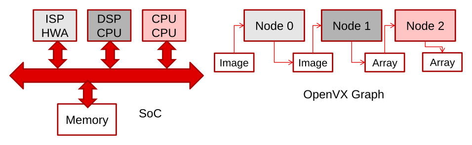
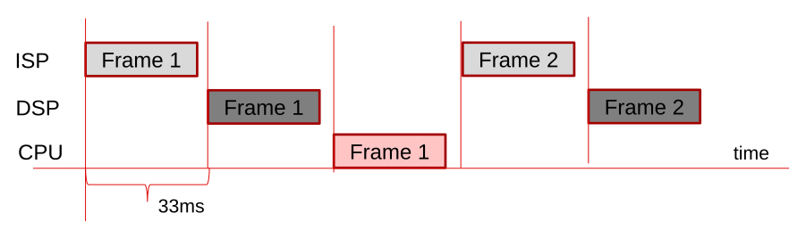
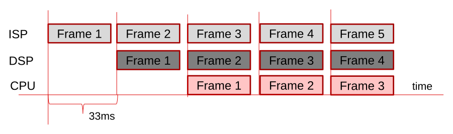
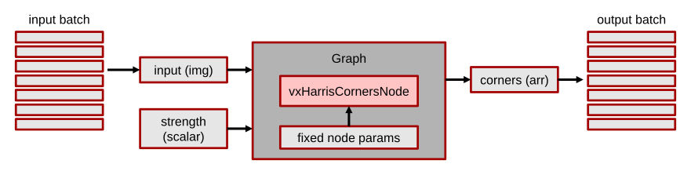
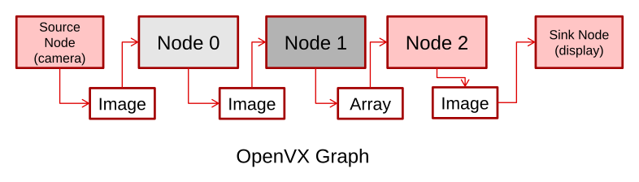
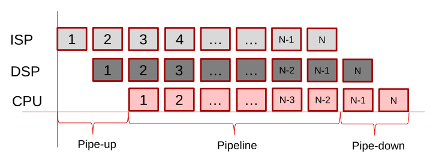

// Copyright (c) 2017-2025 Khronos Group. This work is licensed under a
// Creative Commons Attribution 4.0 International License; see
// http://creativecommons.org/licenses/by/4.0/

= The OpenVX^(TM)^ Graph Pipelining, Streaming, and Batch Processing Extension V2.0
:regtitle: pass:q,r[^®^]
The Khronos{regtitle} OpenVX Working Group; Editors: Kedar Chitnis, Jesse Villareal, Radhakrishna Giduthuri, and Frank Brill
:title-logo-image: images/Khronos_RGB.svg
:data-uri:
:icons: font
:toc2:
:toclevels: 3
:max-width: 100
:numbered:
:imagewidth: 800
:fullimagewidth: width="800"
:halfimagewidth: width="400"
:source-highlighter: coderay
// Various special / math symbols. This is easier to edit with than Unicode.
include::config/attribs.txt[]

// Paths to code examples and headers
:examples: examples
:headers: examples

include::copyright-spec.txt[]

<<<<

// Table of contents is inserted here
toc::[]

:leveloffset: 1

= Introduction

[[sec_purpose]]
== Purpose

Enable multiple initiations of a given graph with different inputs and
outputs. Additionally, this extension provides a mechanism for the
application to execute a graph such that the application does not need to be
involved with data reconfiguration and starting processing of the graph for
each set of input/output data. 

Version 2.0 of the pipelining extension addresses issues arising both from real customer experience
and the need to bring it up-to-date with the latest versions of the main OpenVX specification and other extensions.
The following changes are introduced:

 * Corrections to some errors in the original specification and examples
 * Various improvements to the operation of pipelining and streaming
 * Some additional functionality, especially to do with event handling
 * Documentation of functionality in the main specification that must be altered if pipelining is implemented
 * Documentation of functionality from the main specification that may be deprecated if pipelining is implemented
 * Documentation of the interactions with other extensions and the changes required for those to effectively support pipelining
 * Requirements numbering

[[sec_acknowledge]]
== Acknowledgements

This specification would not be possible without the contributions from this
partial list of the following individuals from the Khronos Working Group and
the companies that they represented at the time:

  * Kedar Chitnis - Texas Instruments, Inc.
  * Jesse Villarreal - Texas Instruments, Inc.
  * Radhakrishna Giduthuri - Intel
  * Tomer Schwartz - Intel
  * Frank Brill - Cadence Design Systems
  * Thierry Lepley - Cadence Design Systems
  * Stephen Ramm - ETAS (Bosch)
  * Raphael Cano - Bosch
  * Viktor Gyenes - aiMotive
  * Isaac Wong - Ambarella
  * Kiriti Nagesh Gowda - AMD

[[sec_background]]
== Background and Terminology

This section introduces the concepts of graph pipelining, streaming and
batch processing before getting into the details of how OpenVX is extended
to support these features.

[[sec_pipelining]]
=== Graph Pipelining

In order to demonstrate what is meant by pipelined execution, please refer
to the following example system that executes the simple graph in a
distributed manner:

.Example SoC and Distributed Graph

In this example, there are three compute units: an Image Signal Processor
(ISP) HWA, a Digital Signal Processor (DSP), and a CPU. The example graph
likewise, has three nodes: generically labelled Node 0, Node 1, and Node 2.
There could be more or less nodes than compute units, but here, the number
of nodes happens to be equal to the number of compute units. In this graph,
Node 0 is executed on the ISP, Node 1 is executed on the DSP, and Node 2 is
executed on the CPU. Without pipelining enabled, the execution timeline of
this graph is shown below:

.Non-pipelined Execution

Assuming each node takes 33ms to execute, then the full graph takes 99ms to
execute. Without this extension, OpenVX requires that a second frame can not
start graph execution on this same graph until the first graph execution is
completed. This means that the maximum throughput of this example will be
one frame completing every 99ms. However, in this example, you can see that
each compute unit is only utilized no more than one-third of the time.
Furthermore, if the camera input produced a frame every 33ms, then every two
out of three frames would need to be "`dropped`" by the system since this
OpenVX graph implementation can not keep up with the input frame rate of the
camera.

Pipelining the graph execution will both increase the hardware utilization, and
increase the throughput of the OpenVX implementation.  These effects can be
seen in the timeline of a pipelined execution of the graph below:

[[fig-pipelined-exec]]
.Frame-Level Pipelined Execution

Here, the latency of the graph is still 99ms, but the throughput has been
increased to one frame completing every 33ms, allowing the graph to run
in real-time with the camera frame-rate.

Now, in this simple example, a lot of assumptions were made in order to
illustrate the concept. We assumed that each node took the same amount of
time, so pipelining looked like we went from 33% core utilization to 100%
core utilization. In practice, this ideal is almost never true. Processing
times will vary across both kernels and cores. So although pipelining may
bring about increased utilization and throughput, the actual frame rate will
be determined by the execution time of the pipeline stage with the longest
execution time.

In order to enable pipelining, the implementation must provide a way for the
application to update the input and output data for future executions of the
graph while previously scheduled graphs are still in the executing state.
Likewise, the implementation must allow scheduling and starting of graph
executions while previously scheduled graphs are still in the executing
state. The <<sec_design_pipelining>> section introduces new APIs and gives
code examples for how this extension enables this basic pipelining support.
The <<sec_design_event>> section extends the controllability and timing of
WHEN to exchange frames and schedule new frames using events.

[[sec_batch_processing]]
=== Graph Batch Processing

Batch processing refers to the ability to execute a graph on a group or
batch of input and output references. Here the user provides a list of input
and output references and a single graph schedule call processes the data
without further intervention of the user application. When a batch of input
and output references is provided to the implementation, it allows the
implementation to potentially parallelize the execution of the graphs on
each input/output reference such that overall higher throughput and
performance is achieved as compared to sequentially executing the graph for
each input/output reference.

.Graph Batch Processing

The <<sec_design_pipelining>> section introduces new APIs and gives code
examples for how this extension enables batch processing support.

[[sec_streaming]]
=== Graph Streaming

Graph streaming refers to the ability of the OpenVX implementation to
automatically handle graph input and output updates and
re-schedule each frame without intervention from the application.
The concept of graph streaming is orthogonal to graph pipelining.
Pipelining can be enabled or disabled on a graph that has streaming
enabled or disabled, and vice-versa.

In order to enable graph streaming, the implementation must provide a way
for the application to enter and exit this streaming mode.  Additionally,
the implementation must somehow manage the input and output swapping
with upstream and downstream components outside of the OpenVX implementation.
This can be handled with the concept of SOURCE nodes and SINK nodes.

A SOURCE node is a node that coordinates the supply of input
into the graph from upstream components (such as a camera), and the SINK
node is a node that coordinates the handoff of output from the graph
into downstream components (such as a display).

.Source/Sink Nodes added for Graph Streaming

The <<sec_design_streaming>> section introduces new APIs and gives code
examples for how this extension enables this basic streaming support.

[[page_design]]
= Design Overview

[[data_references]]
== Data reference

In this extension, the term _data reference_ is used frequently. In this
section we define this term.

Data references are OpenVX references to any of the OpenVX data types listed
below,

  - `VX_TYPE_LUT`
  - `VX_TYPE_DISTRIBUTION`
  - `VX_TYPE_PYRAMID`
  - `VX_TYPE_THRESHOLD`
  - `VX_TYPE_MATRIX`
  - `VX_TYPE_CONVOLUTION`
  - `VX_TYPE_SCALAR`
  - `VX_TYPE_ARRAY`
  - `VX_TYPE_IMAGE`
  - `VX_TYPE_REMAP`
  - `VX_TYPE_OBJECT_ARRAY`
  - `VX_TYPE_TENSOR` (OpenVX 1.2 and above)
  - `VX_TYPE_USER_DATA_OBJECT`(When the User Data Object extension is supported)

The APIs that operate on data references take as input a `vx_reference`
type. An application can pass any of the above defined data type references
to such an API.

[[sec_design_pipelining]]
== Pipelining and Batch Processing

Pipelining and Batch Processing APIs allow an application to construct a
graph that can be executed in a pipelined fashion (see <<sec_pipelining>>),
or batch processing fashion (see <<sec_batch_processing>>).

[[sec_design_queue]]
=== Graph Parameter Queues

The concept of OpenVX "`Graph Parameters`" is defined in the main OpenVX
spec as a means to expose external ports of a graph. Graph parameters enable
the abstraction of the remaining graph ports that are not connected as
graph parameters. Since graph pipelining and batching is concerned primarily
with controlling the flow of data to and from the graph, OpenVX graph
parameters provide a useful construct for enabling pipelining and batching.

This extension introduces the concept of _graph parameter queueing_ to
enable assigning multiple data objects to a graph parameter (either at once,
or spaced in time) without needing to wait for the previous graph
completion(s). At runtime, the application can utilize the
`<<vxGraphParameterEnqueueReadyRef>>` function to enqueue a number of data
references into a graph parameter to be used by the graph. Likewise, the
application can use the `<<vxGraphParameterDequeueDoneRef>>` function to
dequeue a number of data references from a graph parameter after the graph
is done using them (thus, making them available for the application). The
`<<vxGraphParameterCheckDoneRef>>` function is a non-blocking call that can
be used to determine if there are references available for dequeuing, and if
so, how many.

In order for the implementation to know which graph parameters it needs to
support queuing on, the application should configure this by calling
`<<vxSetGraphScheduleConfig>>` before calling `vxVerifyGraph` or
`vxScheduleGraph`.

[[sec_graph_schedule_config]]
=== Graph Schedule Configuration

The graph schedule configuration function (`<<vxSetGraphScheduleConfig>>`)
allows users to enable enqueuing of multiple input and output references to
a graph parameter. It also allows users to control how the graph gets
scheduled based on the references enqueued by the user.

The _graph_schedule_mode_ parameter defines two modes of graph scheduling:

  . `<<VX_GRAPH_SCHEDULE_MODE_QUEUE_MANUAL,VX_GRAPH_SCHEDULE_MODE_QUEUE_MANUAL>>`
  ** Here the application enqueues the references to be processed at a graph
     parameter
  ** Later when application calls `vxScheduleGraph`, all the previously
     enqueued references get processed.
  ** Enqueuing multiple references and calling a single
     `vxScheduleGraph` allows implementation flexibility to optimize the
     execution of the multiple graph executions based on the number of the
     enqueued references.
  . `<<VX_GRAPH_SCHEDULE_MODE_QUEUE_AUTO,VX_GRAPH_SCHEDULE_MODE_QUEUE_AUTO>>`
  ** Here also, the user enqueues the references that they want to process
     at a graph parameter
  ** However here user does not explicitly call `vxScheduleGraph`
  ** `vxVerifyGraph` _must_ be called in this mode (since
     `vxScheduleGraph` is not called).
  ** The implementation automatically triggers graph execution when it has
     enough enqueued references to start a graph execution
  ** Enqueuing multiple references without calling `vxScheduleGraph`
     allows the implementation to start a graph execution as soon as minimal
     input or output references are available.

In both of these modes, `vxProcessGraph` is not allowed. The next two
sections show how the graph schedule configuration, along with reference
enqueue and dequeue is used to realize the graph pipelining and batch
processing use-cases.

[[sec_queue]]
=== Example Graph pipelining application

Graph pipelining allow users to schedule a graph multiple times, without
having to wait for a graph execution to complete. Each such execution of the
graph operates on different input or output references.

In a typical pipeline execution model, there is a pipe-up phase where new
inputs are enqueued and graph is scheduled multiple times until the pipeline
is full. Once the pipeline is full, then outputs begin to be filled as often
as inputs are enqueued (as shown in <<fig-pipelined-exec>>).

.3 Phases of pipeline: pipe-up, pipeline, and pipe-down

In order for the graph to be executed in a pipelined fashion, the steps
outlined below need to be followed by an application:

  . Create a graph and add nodes to the graph as usual.
  . For data references that need to be enqueued and dequeued by the
    application, add them as graph parameters.
  . Call `<<vxSetGraphScheduleConfig>>` with the parameters as follows:
  ** Set scheduling mode
     (`<<VX_GRAPH_SCHEDULE_MODE_QUEUE_MANUAL,VX_GRAPH_SCHEDULE_MODE_QUEUE_MANUAL>>`
     or
     `<<VX_GRAPH_SCHEDULE_MODE_QUEUE_AUTO,VX_GRAPH_SCHEDULE_MODE_QUEUE_AUTO>>`).
  ** List the graph parameters on which enqueue / dequeue operations are
     required.
  ** For these parameters specify the list of references that could be
     enqueued later.
  . All other data references created in, and associated with, the graph are
    made specific to the graph. A data reference can be made specific to a
    graph by either creating it as virtual or by exporting and re-importing
    the graph using the import/export extension.
  . Delays in the graph, if any, MUST be set to auto-age using
    `vxRegisterAutoAging`, and their use is implementation-defined.
    Note that this specification does not require that
    the implementation supports delays in pipelined graphs.
  . Verify the graph using `vxVerifyGraph`.
  . Now data reference enqueue / dequeue can be done on associated graph
    parameters using `<<vxGraphParameterEnqueueReadyRef>>` and
    `<<vxGraphParameterDequeueDoneRef>>`.
  . Graph execution on enqueued parameters depends on the scheduling mode
    chosen:
  ** `<<VX_GRAPH_SCHEDULE_MODE_QUEUE_MANUAL,VX_GRAPH_SCHEDULE_MODE_QUEUE_MANUAL>>`:
     User manually schedules the graph on the full set of all enqueued
     parameters by calling `vxScheduleGraph`. This gives more control to
     the application to limit when the graph execution on enqueued
     parameters can begin.
  ** `<<VX_GRAPH_SCHEDULE_MODE_QUEUE_AUTO,VX_GRAPH_SCHEDULE_MODE_QUEUE_AUTO>>`:
     Implementation automatically schedules graph as long as enough data is
     enqueued to it. This gives more control to the implementation to decide
     when the graph execution on enqueued parameters can begin.
  . `<<vxGraphParameterCheckDoneRef>>` can be used to determine when to
    dequeue graph parameters for completed graph executions.
  . In order to gracefully end graph pipelining, the application should
    cease enqueing graph parameters, and call `vxWaitGraph` to wait for
    the in-flight graph executions to complete. When the call returns, call
    `<<vxGraphParameterDequeueDoneRef>>` on all the graph parameters to
    return control of the buffers to the application.

The following code offers an example of the process outlined above, using
`<<VX_GRAPH_SCHEDULE_MODE_QUEUE_AUTO,VX_GRAPH_SCHEDULE_MODE_QUEUE_AUTO>>`
scheduling mode.

[source,c,indent=0]
----
include::{examples}/vx_khr_pipelining_sample.c[tag=graph_pipeline]
----

[[sec_batch_processing_app]]
=== Example Batch processing application

In order for the graph to be executed in batch processing mode, the steps
outlined below need to be followed by an application:

  . Create a graph and add nodes to the graph as usual.
  . For data references that need to be "`batched`" by the application, add
    them as graph parameters.
  . Call `<<vxSetGraphScheduleConfig>>` with the parameters as follows:
  ** Set scheduling mode
     (`<<VX_GRAPH_SCHEDULE_MODE_QUEUE_MANUAL,VX_GRAPH_SCHEDULE_MODE_QUEUE_MANUAL>>`
     or
     `<<VX_GRAPH_SCHEDULE_MODE_QUEUE_AUTO,VX_GRAPH_SCHEDULE_MODE_QUEUE_AUTO>>`).
  ** List the graph parameters that will be batch processed.
  ** For these parameters specify the list of references that could be
     enqueued later for batch processing.
  . All other data references created in, and associated with the graph are
    made specific to the graph. A data reference can be made specific to a
    graph by either creating it as virtual or by exporting and re-importing
    the graph using the import/export extension.
  . Delays in the graph, if any, MUST be set to auto-age using
    `vxRegisterAutoAging`, and their use is implementation-defined.
    Note that this specification does not require that
    the implementation supports delays in pipelined graphs.
  . Verify the graph using `vxVerifyGraph`.
  . To execute the graph:
  ** Enqueue the data references that need to be processed in a batch using
     `<<vxGraphParameterEnqueueReadyRef>>`.
  ** If scheduling mode was set to
     `<<VX_GRAPH_SCHEDULE_MODE_QUEUE_MANUAL,VX_GRAPH_SCHEDULE_MODE_QUEUE_MANUAL>>`,
     use `vxScheduleGraph` to trigger the batch processing.
  ** Use `vxWaitGraph` to wait for the batch processing to complete.
  ** Dequeue the processed data references using
     `<<vxGraphParameterDequeueDoneRef>>`.

The following code offers an example of the process outlined above using
`<<VX_GRAPH_SCHEDULE_MODE_QUEUE_MANUAL,VX_GRAPH_SCHEDULE_MODE_QUEUE_MANUAL>>`
scheduling mode.

[source,c,indent=0]
----
include::{examples}/vx_khr_pipelining_sample.c[tag=graph_batch_processing]
----

[[sec_design_streaming]]
== Streaming

OpenVX APIs allow a user to construct a graph with source nodes and sink
nodes. A source node is a node that internally sources and outputs data to
one or more data references.  A camera capture node is an example of a
source node. A sink node is a node that takes one or more
data references as input but has no output data references. A display
node is an example of a sink node.  For such a graph, graph
execution can be started in streaming mode, wherein, user intervention is
not needed to re-schedule the graph each time.

[[sec_sourcesink]]
=== Source/sink user nodes

Source/sink user nodes are implemented using the existing user kernel OpenVX
API.

The following is an example of streaming user source node where the
data references are coming from a vendor specific capture device component:

[source,c,indent=0]
----
include::{examples}/vx_khr_streaming_sample.c[tag=streaming_source_node]
----

Likewise, the following is an example of streaming user sink node where the
data references are going to a vendor specific display device component:

[source,c,indent=0]
----
include::{examples}/vx_khr_streaming_sample.c[tag=streaming_sink_node]
----

In both these examples, the user node "`swaps`" the reference provided by the
implementation with another "`compatible`" reference. This allows user nodes
to implement zero-copy capture and display functions.

[[sec_source_pipeup]]
=== Kernel Pipeup

In the previous section, the source and sink nodes were responsible for creating
"`compatible`" references for "`swapping`" to implement zero-copy functions.
In this section, we introduce an alternative method wherein the framework
creates the required reference copies, and passes them to the user nodes.

This can be done with the addition of the following new attributes:

  * `<<VX_KERNEL_PIPEUP_OUTPUT_DEPTH,VX_KERNEL_PIPEUP_OUTPUT_DEPTH>>`, `<<VX_KERNEL_PIPEUP_INPUT_DEPTH,VX_KERNEL_PIPEUP_INPUT_DEPTH>>`: These attributes
    may be set when registering the kernel (between the call to vxAddUserKernel and vxFinalizeKernel) using the vxSetKernelAttribute function.  It is used to
    notify the framework what the pipeup depth is for this kernel.  `<<VX_KERNEL_PIPEUP_OUTPUT_DEPTH,VX_KERNEL_PIPEUP_OUTPUT_DEPTH>>` is used for source
    nodes and `<<VX_KERNEL_PIPEUP_INPUT_DEPTH,VX_KERNEL_PIPEUP_INPUT_DEPTH>>` is used for sink nodes.
  * `<<VX_NODE_STATE, VX_NODE_STATE>>`: This attribute may be queried by the execution function of the kernel to determine
    which state the node is in.  The options are: `<<VX_NODE_STATE_STEADY,VX_NODE_STATE_STEADY>>` and `<<VX_NODE_STATE_PIPEUP,VX_NODE_STATE_PIPEUP>>`.
    If the `<<VX_KERNEL_PIPEUP_OUTPUT_DEPTH,VX_KERNEL_PIPEUP_OUTPUT_DEPTH>>` or `<<VX_KERNEL_PIPEUP_INPUT_DEPTH,VX_KERNEL_PIPEUP_INPUT_DEPTH>>`
    attribute has been set to a value greater than 1, then node state
    will start in the `<<VX_NODE_STATE_PIPEUP,VX_NODE_STATE_PIPEUP>>` state the first time the graph is executed after vxVerifyGraph is called.
    ** In the case of `<<VX_KERNEL_PIPEUP_OUTPUT_DEPTH,VX_KERNEL_PIPEUP_OUTPUT_DEPTH>>` (source nodes):
    *** `<<VX_NODE_STATE_PIPEUP,VX_NODE_STATE_PIPEUP>>` : In this state, the during the first execution of the graph, the framework calls the
       execution callback of the node associated with this kernel
       (pipeup_depth - 1) times before it 'expects' a valid output and calls nodes dependent on the output.
       During this state, the framework provides the same set of input parameters for each call, but provides
       different set of output parameters for each call.
    *** `<<VX_NODE_STATE_STEADY,VX_NODE_STATE_STEADY>>` : After the kernel has been called (pipeup_depth - 1) times, it transitions to
       `<<VX_NODE_STATE_STEADY,VX_NODE_STATE_STEADY>>` state.  Kernels that don't set the `<<VX_KERNEL_PIPEUP_OUTPUT_DEPTH,VX_KERNEL_PIPEUP_OUTPUT_DEPTH>>` attribute, or set it
       to 1, will start in this state. During this state, output parameters returned from the execution callback will be passed to dependent nodes.  If the
       kernel had primed its output buffers using the `<<VX_KERNEL_PIPEUP_OUTPUT_DEPTH,VX_KERNEL_PIPEUP_OUTPUT_DEPTH>>` attribute, the kernel may return
       a set of output parameters that was given during a previous execution of the callback instead of the ones given
       during the current execution.
    ** In the case of `<<VX_KERNEL_PIPEUP_INPUT_DEPTH,VX_KERNEL_PIPEUP_INPUT_DEPTH>>` (sink nodes):
    *** `<<VX_NODE_STATE_PIPEUP,VX_NODE_STATE_PIPEUP>>` : In this state, the framework executes the graph
       (pipeup_depth - 1) times before it 'expects' any consumed inputs from this node to be returned to the framework.
    *** `<<VX_NODE_STATE_STEADY,VX_NODE_STATE_STEADY>>` : After the graph has been called (pipeup_depth - 1) times, it transitions to
       `<<VX_NODE_STATE_STEADY,VX_NODE_STATE_STEADY>>` state.  Kernels that don't set the `<<VX_KERNEL_PIPEUP_INPUT_DEPTH,VX_KERNEL_PIPEUP_INPUT_DEPTH>>` attribute, or set it
       to 1, will start in this state. During this state, input parameters returned from the execution callback will be recycled and filled by upstream nodes.  If the
       kernel had retained its input buffers using the `<<VX_KERNEL_PIPEUP_INPUT_DEPTH,VX_KERNEL_PIPEUP_INPUT_DEPTH>>` attribute, the kernel may return
       a set of input parameters that was given during a previous execution of the callback instead of the ones given
       during the current execution.

The following is an example of a streaming user source node that uses these attributes:

[source,c,indent=0]
----
include::{examples}/vx_khr_streaming_sample.c[tag=streaming_source_pipeup_node]
----

Likewise, the following is an example of streaming user sink node that uses these attributes:

[source,c,indent=0]
----
include::{examples}/vx_khr_streaming_sample.c[tag=streaming_sink_pipeup_node]
----

[[sec_triggering]]
=== Graph streaming application

To execute a graph in streaming mode, the following steps need to followed
by an application:

  * Create a graph with source and sink nodes.
  * All data references created in and associated with the graph are made
    specific to the graph. A data reference can be made specific to a graph
    by either creating it as virtual or by exporting and re-importing the
    graph using the import/export extension.
  * Enable the streaming mode of graph execution using
    `<<vxEnableGraphStreaming>>`, optionally setting the trigger node. This
    must be called prior to verifying the graph.
  * Verify the graph using `vxVerifyGraph`
  * Start the streaming mode of graph execution using
    `<<vxStartGraphStreaming>>`
  * Now the graph gets re-scheduled continuously until the user application
    calls vxStopGraphStreaming.
  ** The implementation automatically decides the re-schedule trigger
     condition.
  * A user application may need to stop streaming from external control, or
    internal feedback.
  ** External control can be the end user changing modes or states, which
     prompts the application to call vxStopGraphStreaming.
  ** Internal feedback can be due to end of stream or an error condition
     detected within its node execution.
  *** In the case of an error condition detected, the user node should
      return an appropriate error status. When any error status is detected
      by the framework, the framework should trigger the VX_EVENT_NODE_ERROR
      event to signal that the node execution has experienced an error.
      The application can choose to monitor such an event and take appropriate
      action, which may include stopping the continuous graph execution by
      calling vxStopGraphStreaming.
  * In all cases, the continuous mode of graph execution is stopped at an
    implementation-defined logical boundary (e.g. after all previous graph
    executions have completed).

The following example code demonstrates how one can use these APIs in an
application,

[source,c,indent=0]
----
include::{examples}/vx_khr_streaming_sample.c[tag=streaming_application]
----

[[sec_design_event]]
== Event handling

Event handling APIs allow users to register conditions on a graph, based on
which events are generated by the implementation. User applications can then
wait for events and take appropriate action based on the received event.
User-specified events can also be generated by the application so that all
events can be handled at a centralized location. This simplifies the
application state machine, and in the case of graph pipelining, it allows
optimized scheduling of the graph.

[[sec_limitations]]
=== Motivation for event handling

  . Pipelining without events would need blocking calls on the data
    producers, consumers, and the graph itself. If there were multiple
    graphs or multiple data producers/consumers pipelined at different
    rates, one can see how the application logic can easily get complicated.
  . Applications need a mechanism to allow input references to be dequeued
    before the full graph execution is completed. This allows
    implementations to have larger pipeline depths but at the same time have
    fewer queued references at a graph parameter.

[[sec_using_event_handling]]
=== Event handling application

Event handling APIs allow user the flexibility to do early dequeue of input
references, and late enqueue of output references. It enables applications
to effectively block at a single centralized location for both
implementation-generated events as well as user-generated events. Event
handling allows the graph to produce events that can then be used by the
application. For example, if the thread had an event handler that is used to
manage multiple graphs, consumers, and producers, then the events produced
by the implementation could feed into this manager. Likewise, early dequeue
of input can be achieved, if the event handler could use the graph parameter
consumed events to trigger calls to `<<vxGraphParameterEnqueueReadyRef>>`,
`<<vxGraphParameterDequeueDoneRef>>`.

The following code offers an example of the event handling.

[source,c,indent=0]
----
include::{examples}/vx_khr_pipelining_sample.c[tag=graph_events]
----

=== Graph Events

==== Purpose

In cases where there are several graph parameters in a pipelined graph, to increase efficiency it is desirable to wait for any graph parameter available and process it immediately. 

There are two other methods available for doing this: 

1. Wait for an event and process it. Because this is for any event, it includes user events, graph parameter events, etc. on all graphs. Therefore it is necessary to create a broker process to dispatch tasks for event processing, and this architecture may not always be suitable and could require an additional signalling mechanism.
2. Poll for each parameter in turn; this is not efficient as it either burns cpu time, or if a sleep mechanism is used, results in a lack of responsivity.

Graph events are intended to improve efficiency when handling pipelined graphs with multiple parameters.

[[sec_usecases]]
==== Use cases

*Waiting for an event on an individual graph queue*

This addition to the event mechanism in the pipelining extension defines new APIs allowing the `<<VX_EVENT_GRAPH_PARAMETER_CONSUMED,VX_EVENT_GRAPH_PARAMETER_CONSUMED>>` event to be registered and sent per graph so that an application may wait for an event on an individual graph queue; there will be no conflict then between different threads performing calls to `<<vxWaitGraphEvent>>` with different graph targets. 

*Combination of event and graph event mechanisms*

Different graph parameter events (i.e. specifying different graphs and/or parameter indices) may be registered with the context,  providing two different queuing points, and it is still possible to wait for individual graph parameters using `<<vxGraphParameterDequeueDoneRef>>`.

*Termination of graph executions*

To handle the case where a thread is waiting to handle a graph parameter event but a graph has had a finite number of executions there is also a need to inject another event into the queue to release the waiting process. This can be achieved using a user event sent to the queue, _c.f._ `<<vxSendUserGraphEvent>>`.

[[page_requirements_requirements]]

[[module_documentation]]
= Module Documentation

[[group_pipelining]]
== Pipelining and Batch Processing

// tag::group_pipelining:summary[]
*Data Structures*

  * `<<vx_graph_parameter_queue_params_t>>`
  * `<<vx_graph_parameter_config_t>>`

//@ *Macros*
//@
//@   * `<<VX_LIBRARY_KHR_PIPELINING_EXTENSION,VX_LIBRARY_KHR_PIPELINING_EXTENSION>>`

*Enumerations*

  * `<<vx_graph_schedule_mode_enum_e>>`
  * `<<vx_graph_schedule_mode_type_e>>`
  * `<<vx_graph_attribute_pipelining_e>>`
  * `<<vx_reference_attribute_pipelining_e>>`

*Functions*

  * `<<vxSetGraphScheduleConfig>>`
  * `<<vxGraphParameterEnqueueReadyRef>>`
  * `<<vxGraphParameterDequeueDoneRef>>`
  * `<<vxGraphParameterCheckDoneRef>>`
  * `<<vxGetGraphParameterConfig>>`
  * `<<vxGetGraphParameterRefsList>>`
  * `<<vxAddReferencesToGraphParameterList>>`

// end::group_pipelining:summary[]

// @brief
This section lists the APIs required for graph pipelining and batch
processing.

// tag::group_pipelining:details[]
=== Data Structures

// tag::refpage:vx_graph_parameter_queue_params_t[]
// [desc='',type='structs']
==== vx_graph_parameter_queue_params_t

// Brief text:
Specify references that may be queued for a specific graph parameter.
 `[*REQ-PI001*]`[[REQ-PI001]]
include::api/structs/vx_graph_parameter_queue_params_t.txt[]

// Detailed text:
  * _graph_parameter_index_ -   Index of graph parameter to which these properties apply `[*REQ-PI002*]`[[REQ-PI002]]
  * _refs_list_size_ -   Number of elements in array _refs_list_ `[*REQ-PI003*]`[[REQ-PI003]]
  * _refs_list_ -   Array of references that could be enqueued at a later point of time at this graph parameter `[*REQ-PI004*]`[[REQ-PI004]]

See `<<vxSetGraphScheduleConfig>>` for additional details.

// end::refpage:vx_graph_parameter_queue_params_t[]

// tag::refpage:vx_graph_parameter_config_t[]
// [desc='',type='structs']
==== vx_graph_parameter_config_t

// Brief text:
This structure is use to return details about the number of references allowed for each graph parameter, and the direction, type and state of that parameter.
 `[*REQ-PI005*]`[[REQ-PI005]]
include::api/structs/vx_graph_parameter_config_t.txt[]

// Detailed text:
  * _index_ -   Index of graph parameter, starting at 0 `[*REQ-PI006*]`[[REQ-PI006]]
  * _type_ -    A type enumerator such as VX_TYPE_IMAGE `[*REQ-PI007*]`[[REQ-PI007]]
  * _direction_ - VX_INPUT, VX_OUTPUT or VX_BIDIRECTIONAL `[*REQ-PI008*]`[[REQ-PI008]]
  * _state_ -   VX_PARAMETER_STATE_REQUIRED or VX_PARAMETER_STATE_OPTIONAL `[*REQ-PI009*]`[[REQ-PI009]]
  * _refs_list_size_ -   The number of different references that may be assigned to this parameter `[*REQ-PI010*]`[[REQ-PI010]]

See `<<vxGetGraphParameterConfig>>` for additional details.

// end::refpage:vx_graph_parameter_config_t[]

//@ === Macros
//@
//@ // tag::refpage:VX_LIBRARY_KHR_PIPELINING_EXTENSION[]
//@ // [desc='',type='defines']
//@ ==== VX_LIBRARY_KHR_PIPELINING_EXTENSION
//@
//@ // Brief text:
//@ The Pipelining, Streaming and Batch Processing Extension Library Set.
//@
//@ include::api/defines/VX_LIBRARY_KHR_PIPELINING_EXTENSION.txt[]
//@
//@ // end::refpage:VX_LIBRARY_KHR_PIPELINING_EXTENSION[]

=== Enumerations

// tag::refpage:vx_graph_schedule_mode_enum_e[]
// [desc='',type='enums']
==== vx_graph_schedule_mode_enum_e

// Brief text:
Extra enums.
 `[*REQ-PI011*]`[[REQ-PI011]]
include::api/enums/vx_graph_schedule_mode_enum_e.txt[]

*Enumerator*

  * [[VX_ENUM_GRAPH_SCHEDULE_MODE_TYPE]]
    `VX_ENUM_GRAPH_SCHEDULE_MODE_TYPE` - Graph schedule mode type
    enumeration. 
// end::refpage:vx_graph_schedule_mode_enum_e[]

// tag::refpage:vx_graph_schedule_mode_type_e[]
// [desc='',type='enums']
==== vx_graph_schedule_mode_type_e

// Brief text:
Type of graph scheduling mode.
 `[*REQ-PI012*]`[[REQ-PI012]]
include::api/enums/vx_graph_schedule_mode_type_e.txt[]

// Detailed text:
See `<<vxSetGraphScheduleConfig>>` and `<<vxGraphParameterEnqueueReadyRef>>`
for details about each mode.

*Enumerator*

  * [[VX_GRAPH_SCHEDULE_MODE_NORMAL]]
    `<<VX_GRAPH_SCHEDULE_MODE_NORMAL>>` - Schedule graph in non-queueing mode. `[*REQ-PI013*]`[[REQ-PI013]]
  * [[VX_GRAPH_SCHEDULE_MODE_QUEUE_AUTO]]
    `<<VX_GRAPH_SCHEDULE_MODE_QUEUE_AUTO>>` - Schedule graph in queueing mode with
    auto scheduling. `[*REQ-PI014*]`[[REQ-PI014]]
  * [[VX_GRAPH_SCHEDULE_MODE_QUEUE_MANUAL]]
    `<<VX_GRAPH_SCHEDULE_MODE_QUEUE_MANUAL>>` - Schedule graph in queueing mode
    with manual scheduling. `[*REQ-PI015*]`[[REQ-PI015]]

// end::refpage:vx_graph_schedule_mode_type_e[]

// tag::refpage:vx_graph_attribute_pipelining_e[]
// [desc='',type='enums']
==== vx_graph_attribute_pipelining_e

// Brief text:
The graph attributes added by this extension.

include::api/enums/vx_graph_attribute_pipelining_e.txt[]

*Enumerator*

  * [[VX_GRAPH_SCHEDULE_MODE]]
    `<<VX_GRAPH_SCHEDULE_MODE>>` - Returns the schedule mode of a graph. `[*REQ-PI016*]`[[REQ-PI016]]
    Read-only. Use a `vx_enum` parameter. See
    `<<vx_graph_schedule_mode_type_e>>` enum.
  * [[VX_GRAPH_TIMEOUT]]
   `<<VX_GRAPH_TIMEOUT>>` - Sets or returns the timeout value, in milliseconds, for the functions `vxWaitGraph`, `vxProcessGraph`, `vxGraphParameterDequeueDoneRef` and `vxStopGraphStreaming`. Read-write. Use a `vx_uint32` parameter, or the implementation-defined `<<VX_TIMEOUT_WAIT_FOREVER>>`. The implementation shall initially set this attribute to `<<VX_TIMEOUT_WAIT_FOREVER>>`. `[*REQ-PI017*]`[[REQ-PI017]]

[NOTE]
.Note
====
Setting the timeout attribute `<<VX_GRAPH_TIMEOUT>>` does not set any limit upon the duration of graph execution, it merely prevents the above-mentioned functions from delaying more than the time given. There are no other requirements upon what the framework should do; it is up to the application to recognise the timeout and take appropriate action.
====
  * [[VX_GRAPH_EVENT_TIMEOUT]]
   `<<VX_GRAPH_EVENT_TIMEOUT>>` - Sets or returns the timeout value, in milliseconds, for the function: `vxWaitGraphEvent`. Read-write. Use a `vx_uint32` parameter, or the implementation-defined `<<VX_TIMEOUT_WAIT_FOREVER>>`. The implementation shall initially set this attribute to `<<VX_TIMEOUT_WAIT_FOREVER>>`. `[*REQ-PI143*]`[[REQ-PI143]]

[NOTE]
.Note
====
Setting the timeout attribute `<<VX_GRAPH_EVENT_TIMEOUT>>` does not set any limit upon the duration of graph execution, it merely prevents the above-mentioned function from delaying more than the time given. There are no other requirements upon what the framework should do; it is up to the application to recognise the timeout and take appropriate action.
====
  * [[VX_GRAPH_PIPELINE_DEPTH]]
   `<<VX_GRAPH_PIPELINE_DEPTH>>` - Set or return the graph pipeline depth; the depth used in the graph is known after graph verification. Read-write. Us a `vx_uint32` parameter. `[*REQ-PI018*]`[[REQ-PI018]]

[NOTE]
.Note
====
`[*REQ-PI019*]`[[REQ-PI019]]
The framework will calculate the maximum depth of pipeline that is sensible for any given graph. It would be useful for the user to be able to obtain this data in a programmatic way and modify execution accordingly, for example to know that result dequeuing is possible after queuing a certain number of inputs. An additional attribute allows this data to be obtained from a verified graph.

The attribute is made read-write, so that an application may modify pipeline behaviour. Example use cases are to save memory by restricting pipeline depth, or to effectively turn off pipelining by setting the depth to 1 for debugging purposes.

`[*REQ-PI020*]`[[REQ-PI020]]
 If the attribute is set to a non-zero value before graph verification, the application-supplied value will be used, otherwise the value will be calculated by the framework.

If the attribute is set after graph verification, the results are not specified.
====

// end::refpage:vx_graph_attribute_pipelining_e[]

// tag::refpage:vx_reference_attribute_pipelining_e[]
// [desc='',type='enums']
==== vx_reference_attribute_pipelining_e

// Brief text:
The reference attributes added by this extension.

include::api/enums/vx_reference_attribute_pipelining_e.txt[]

*Enumerator*

  * [[VX_REFERENCE_ENQUEUE_COUNT]]
   `VX_REFERENCE_ENQUEUE_COUNT` - Query the number of times this reference has been enqueued; read-only, use a vx_uint32 parameter. `[*REQ-PI021*]`[[REQ-PI021]]

[NOTE]
.Note
====
This attribute is provided so that an application may better manage its use of references; the specification does not require that an implementation prevents an application from queueing references on both inputs of one graph and an output of another although this may lead to unexpected results.
====

// end::refpage:vx_reference_attribute_pipelining_e[]
=== Functions

// tag::refpage:vxSetGraphScheduleConfig[]
// [desc='',type='protos']
==== vxSetGraphScheduleConfig

// Brief text:
Sets the graph scheduler config.
 `[*REQ-PI022*]`[[REQ-PI022]]
include::api/protos/vxSetGraphScheduleConfig.txt[]

// Detailed text:
This API is used to set the graph scheduler config to allow user to schedule
multiple instances of a graph for execution.

For legacy applications that don't need graph pipelining or batch
processing, this API need not be used.

Using this API, the application specifies the graph schedule mode, as well
as queueing parameters for all graph parameters that need to allow
enqueueing of references. A single monolithic API is provided instead of
discrete APIs, since this allows the implementation to get all information
related to scheduling in one shot and then optimize the subsequent graph
scheduling based on this information. *This API MUST be called before `vxVerifyGraph`*, since in this case it allows implementations the opportunity to
optimize resources based on information provided by the application.

_graph_schedule_mode_ selects how input and output references are provided
to a graph and how the next graph schedule is triggered by an
implementation.

The following scheduling modes are supported:

When graph schedule mode is `<<VX_GRAPH_SCHEDULE_MODE_QUEUE_AUTO,VX_GRAPH_SCHEDULE_MODE_QUEUE_AUTO>>`:

`[*REQ-PI023*]`[[REQ-PI023]]

  * Application needs to explicitly call `vxVerifyGraph` before enqueuing
    data references
  * Application should not call `vxScheduleGraph` or `vxProcessGraph`
  * When enough references are enqueued at various graph parameters, the
    implementation could trigger the next graph schedule.
  * Here, not all graph parameters need to have enqueued references for a
    graph schedule to begin. An implementation is expected to execute the
    graph as much as possible until an enqueued reference is not available at
    which time it will stall the graph until the reference becomes
    available. This allows application to schedule a graph even when all
    parameters references are not yet available, i.e do a "`late`" enqueue.
    However, exact behaviour is implementation specific.

When graph schedule mode is `<<VX_GRAPH_SCHEDULE_MODE_QUEUE_MANUAL,VX_GRAPH_SCHEDULE_MODE_QUEUE_MANUAL>>`:

`[*REQ-PI024*]`[[REQ-PI024]]

  * Application needs to explicitly call `vxScheduleGraph`
  * Application should not call `vxProcessGraph`
  * References for all graph parameters of the graph needs to enqueued
    before `vxScheduleGraph` is called on the graph else an error is returned
    by `vxScheduleGraph`
  * Application can enqueue multiple references at the same graph parameter.
    When `vxScheduleGraph` is called, all enqueued references get processed in
    a "`batch`".
  * User can use `vxWaitGraph` to wait for the previous `vxScheduleGraph` to
    complete.

When graph schedule mode is `<<VX_GRAPH_SCHEDULE_MODE_NORMAL,VX_GRAPH_SCHEDULE_MODE_NORMAL>>`:

`[*REQ-PI025*]`[[REQ-PI025]]

  * _graph_parameters_list_size_ MUST be 0 and
  * _graph_parameters_queue_params_list_ MUST be NULL
  * This mode is equivalent to non-queueing scheduling mode as defined by
    OpenVX v1.2 and earlier.

`[*REQ-PI026*]`[[REQ-PI026]]
By default all graphs are in `<<VX_GRAPH_SCHEDULE_MODE_NORMAL>>` mode until this
API is called.

_graph_parameters_queue_params_list_ allows the following information to be supplied:

  * For the graph parameter index that is specified, it enables the queueing
    mode of operation
  * It allows the application to specify the list of references that
    it could later enqueue at this graph parameter, so that they be checked for validity prior to graph execution.

`[*REQ-PI027*]`[[REQ-PI027]]
For graph parameters listed in _graph_parameters_queue_params_list_,
application MUST use `<<vxGraphParameterEnqueueReadyRef>>` to set references
at the graph parameter. Using other data access APIs on these parameters or
corresponding data objects will return an error. For graph parameters not
listed in _graph_parameters_queue_params_list_ application MUST use the
`<<vxSetGraphParameterByIndex>>` to set the reference at the graph parameter.
Using other data access APIs on these parameters or corresponding data
objects will return an error.

`[*REQ-PI028*]`[[REQ-PI028]]
This API also allows application to provide a list of references that could
be later enqueued at the graph parameter. This allows implementation to do
meta-data checking up front rather than during each reference enqueue.

`[*REQ-PI029*]`[[REQ-PI029]]
The function `<<vxSetGraphScheduleConfig>>` should be called only before calling `vxVerifyGraph`, and the _refs_list_ field should not be null. The implementation shall check for this.

`[*REQ-PI030*]`[[REQ-PI030]]
The schedule configuration must include *all graph parameters* even if the intention is not to queue some of them. This results in altered functionality for `<<vxSetGraphParameterByIndex>>` (see below).

`[*REQ-PI031*]`[[REQ-PI031]]
If any graph parameters had been added already when `<<vxSetGraphScheduleConfig>>` is called, they are removed and replaced with the new list.

`[*REQ-PI032*]`[[REQ-PI032]]
Additionally, this function is responsible for adding parameters to the graph, identifying them using the first reference in the list of references supplied for each graph parameter. The following rules apply to the list of references given:

1. The first reference given in the list must be attached to at least one node parameter in the graph `[*REQ-PI033*]`[[REQ-PI033]]
2. A reference may not appear as the first reference in more than one list `[*REQ-PI034*]`[[REQ-PI034]]
3. The first reference in a list may not be NULL `[*REQ-PI035*]`[[REQ-PI035]]
4. If a NULL reference is otherwise specified in the list, the results are implementation-dependent

`[*REQ-PI036*]`[[REQ-PI036]]
References in the list should be checked for compatibility so that the graphs are guaranteed to run (for example, all references may need to have the same metadata). Note that implementations may allow references of different types if connected nodes (and nodes subsequently connected to those nodes) allow a generic `VX_TYPE_REFERENCE` as the type.

`[*REQ-PI037*]`[[REQ-PI037]]
Where `VX_BIDIRECTIONAL` parameters are used, the direction of the graph parameter may not be the same as the direction of the parameter given on the last node to write data, due to the rules for execution precedence.

`[*REQ-PI038*]`[[REQ-PI038]]
The rules for direction reported in data obtained by  `<<vxGetGraphParameterConfig>>` may differ and are given according to the connections of the reference in the following table:

[.options="header"]
|====
| Reference connection | Direction of the graph parameter
| `VX_INPUT` only |  `VX_INPUT`
| `VX_OUTPUT` only | `VX_OUTPUT`
| `VX_OUTPUT` & `VX_INPUT`(s) | `VX_OUTPUT`
| `VX_BIDIRECTIONAL` only | `VX_BIDIRECTIONAL`
| `VX_BIDIRECTIONAL` & `VX_INPUT`(s) |  `VX_BIDIRECTIONAL`
| `VX_BIDIRECTIONAL` & `VX_OUTPUT` |  `VX_OUTPUT`
| `VX_BIDIRECTIONAL`, `VX_OUTPUT` & `VX_INPUT`(s) | `VX_OUTPUT`
|====

[NOTE]
.Note
====
`[*REQ-PI039*]`[[REQ-PI039]]
A reference will not become ready for dequeuing until all nodes to which it is attached have executed, hence a `VX_OUTPUT` graph parameter will become available _after_ the execution of any node to which it is connected as a `VX_BIDIRECTIONAL` or `VX_INPUT` parameter.
====

`[*REQ-PI040*]`[[REQ-PI040]]
The graph_parameter_index given in the array of structures must be unique and must be less than the number of graph parameters required.

[NOTE]
.Note
====
When creating a graph for re-use via export and import, the developer should consider whether or not any application of the graph would require the same data at two or more of its separate inputs, and if so, enable this by listing the same reference as a possibility for connection to the different parameters (remembering that it may only be first on the list for one of the parameters.)
====

[NOTE]
.Note
====
It is recommended to set a descriptive name for the reference used as the first in the list for each graph parameter; this may then be later queried and would be especially useful for exported graphs.
====

*Parameters*

  * `[in]` _graph_ - Graph reference `[*REQ-PI041*]`[[REQ-PI041]]
  * `[in]` _graph_schedule_mode_ - Graph schedule mode. See
    `<<vx_graph_schedule_mode_type_e>>` `[*REQ-PI042*]`[[REQ-PI042]]
  * `[in]` _graph_parameters_list_size_ - Number of elements in
    _graph_parameters_queue_params_list_ `[*REQ-PI043*]`[[REQ-PI043]]
  * `[in]` _graph_parameters_queue_params_list_ - Array containing queuing
    properties at graph parameters that need to support queueing. `[*REQ-PI044*]`[[REQ-PI044]]

*Returns:* A `vx_status_e` enumeration.

*Return Values*

  * `VX_SUCCESS` - No errors. `[*REQ-PI045*]`[[REQ-PI045]]
  * `VX_ERROR_INVALID_REFERENCE` - _graph_ is not a valid reference `[*REQ-PI046*]`[[REQ-PI046]]
  * `VX_ERROR_INVALID_PARAMETERS` - Invalid graph parameter queueing
    parameters `[*REQ-PI047*]`[[REQ-PI047]]
  * `VX_FAILURE` - Any other failure.
// end::refpage:vxSetGraphScheduleConfig[]

// tag::refpage:vxGetGraphParameterConfig[]
// [desc='',type='protos']
==== vxGetGraphParameterConfig

// Brief text:
Returns the graph parameter configuration.
 `[*REQ-PI048*]`[[REQ-PI048]]
include::api/protos/vxGetGraphParameterConfig.txt[]

// Detailed text:
This API is provided to give information in a more convenient way than is possible by obtaining parameter objects from a graph and querying them.

*Parameters*

  * `[in]` _graph_ - the graph to query `[*REQ-PI049*]`[[REQ-PI049]]
  * `[in]` _num_params_ -  the number of graph parameters in the graph, returned by querying the graph for the attribute  VX_GRAPH_NUMPARAMETERS. If the value is incorrect, the function will return VX_ERROR_INVALID_PARAMETERS. `[*REQ-PI050*]`[[REQ-PI050]]
  * `[out]` _parameter_config_ -  an array with the correct number of entries to store the returned data for all the parameters. `[*REQ-PI051*]`[[REQ-PI051]]

The function is intended to return data after a graph has been verified; if the function is called before a graph is verified, the results are not defined.

*Returns:* A `vx_status_e` enumeration.

*Return Values*

 * `VX_SUCCESS` - No errors. `[*REQ-PI052*]`[[REQ-PI052]]
 * `VX_ERROR_INVALID_GRAPH` The graph was invalid or not verified `[*REQ-PI053*]`[[REQ-PI053]]
 * `VX_ERROR_INVALID_PARAMETERS` The number of parameters is incorrect, or a NULL pointer was passed for _parameter_config_. `[*REQ-PI054*]`[[REQ-PI054]]

[NOTE]
.Notes
====
The type of each parameter returned in the configuration structure is in general defined by the type of the references in the reference list. Any circumstances in which the type is reported as `VX_TYPE_REFERENCE` are implementation-defined.

More information about the parameter type, _i.e._, attributes defining dimensions, formats _etc._, may be obtained by querying attributes of a reference from the list of allowed references returned by a call to `<<vxGetGraphParameterRefsList>>` (see below).

The direction of each graph parameter is dependent upon graph topology as defined in the description of `<<vxSetGraphScheduleConfig>>`.

Any circumstances in which the graph parameter state is not reported as `VX_PARAMETER_STATE_REQUIRED` are implementation-defined.

`[*REQ-PI055*]`[[REQ-PI055]] The number of references reported for each graph parameter will be the number of references originally supplied in the call to `<<vxSetGraphScheduleConfig>>` _plus_ any references that have been added by calls to `<<vxAddReferencesToGraphParameterList>>`. 

Application developers should be aware that data races may occur in multi-threaded applications where one thread calls `<<vxAddReferencesToGraphParameterList>>` and another thread calls `<<vxGetGraphParameterConfig>>`.

====
// end::refpage:vxGetGraphParameterConfig[]

// tag::refpage:vxGetGraphParameterRefsList[]
// [desc='',type='protos']
==== vxGetGraphParameterRefsList

// Brief text:
Returns the list of references allowed for queueing on a particular graph parameter.
 `[*REQ-PI056*]`[[REQ-PI056]]
include::api/protos/vxGetGraphParameterRefsList.txt[]

// Detailed text:

*Parameters*

 * `[in]` _graph_ - the verified  graph to query `[*REQ-PI057*]`[[REQ-PI057]]
 * `[in]` _param_ - is the index of the graph parameter, which must be less than the number of parameters in the graph, returned by querying the graph for the attribute VX_GRAPH_NUMPARAMETERS. If the value is incorrect, the function will return VX_ERROR_INVALID_PARAMETERS. `[*REQ-PI058*]`[[REQ-PI058]]
 * `[in]` _ref_list_size_ - must be valid, equal to the number returned by `<<vxGetGraphParameterConfig>>` for the parameter in question. `[*REQ-PI059*]`[[REQ-PI059]]
 * `[out]` _refs_list_ - must be an array of `ref_list_size` references to accept the data returned. `[*REQ-PI060*]`[[REQ-PI060]]

The function is intended to return data after a graph has been verified; if the function is called before a graph is verified, the results are not defined.

`[*REQ-PI061*]`[[REQ-PI061]]
 The order of the references is the order given originally in the call to `<<vxSetGraphScheduleConfig>>` and any subsequent calls to `<<vxAddReferencesToGraphParameterList>>`. If in the meantime the graph has been exported and imported, the references given will be those either created by the framework or supplied by the application in place of the originals. If the references were not explicitly exported (and so not explicitly imported), then this function is required to obtain them.

*Returns:* A `vx_status_e` enumeration.

*Return Values*

 * `VX_SUCCESS` - No errors. `[*REQ-PI062*]`[[REQ-PI062]]
 * `VX_ERROR_INVALID_GRAPH` The graph was invalid or not verified `[*REQ-PI063*]`[[REQ-PI063]]
 * `VX_ERROR_INVALID_PARAMETERS` The graph parameter index is out of range, the size of the list is incorrect, or a NULL pointer was passed for _refs_list_. `[*REQ-PI064*]`[[REQ-PI064]]

[NOTE]
.Notes
====
References obtained in this way must be released when they are no longer required.

Application developers using multi-threading may encounter data races if `<<vxAddReferencesToGraphParameterList>>` is called on a different thread.
====
// end::refpage:vxGetGraphParameterRefsList[]

// tag::refpage:vxAddReferencesToGraphParameterList[]
// [desc='',type='protos']
==== vxAddReferencesToGraphParameterList

// Brief text:
Allows more references to be added to the list of references that may be queued on a graph parameter.
 `[*REQ-PI065*]`[[REQ-PI065]]
include::api/protos/vxAddReferencesToGraphParameterList.txt[]

// Detailed text:
This functionality allows more references to be added to those already defined by the call to `<<vxSetGraphScheduleConfig>>`.  `[*REQ-PI066*]`[[REQ-PI066]] The function may only be called after graph verification. References in the list should be checked for compatibility so that the graphs are guaranteed to run.

*Parameters*

 * `[in]` graph - the graph whose parameter reference list is to be extended `[*REQ-PI067*]`[[REQ-PI067]]
 * `[in]` graph_parameter_index - index of the affected graph parameter. Must be less than the number of parameters in this graph. `[*REQ-PI068*]`[[REQ-PI068]]
 * `[in]` number_to_add - the number of new references to be added. Must be greater than zero. `[*REQ-PI069*]`[[REQ-PI069]]
 * `[in]` new_references - array holding the new references, must be same length as "number_to_add". There may be an implementation-dependent limit on the total number of references per graph parameter. `[*REQ-PI070*]`[[REQ-PI070]]

*Returns:* A `vx_status_e` enumeration.

*Return Values*

 * `VX_SUCCESS` - No errors. `[*REQ-PI071*]`[[REQ-PI071]]
 * `VX_ERROR_INVALID_GRAPH` The graph was invalid or not verified `[*REQ-PI072*]`[[REQ-PI072]]
 * `VX_ERROR_INVALID_SCOPE` One of the references is owned by another graph or context `[*REQ-PI073*]`[[REQ-PI073]]
 * `VX_ERROR_INVALID_REFERENCE` One of the references is not valid `[*REQ-PI074*]`[[REQ-PI074]]
 * `VX_ERROR_INVALID_TYPE` A reference does not have the same type or other metadata as expected for this parameter `[*REQ-PI075*]`[[REQ-PI075]]
 * `VX_ERROR_INVALID_FORMAT` A reference format does not match those expected for this parameter `[*REQ-PI076*]`[[REQ-PI076]]
 * `VX_ERROR_INVALID_DIMENSION` A reference dimension does not match that expected for this parameter `[*REQ-PI077*]`[[REQ-PI077]]
 * `VX_ERROR_INVALID_PARAMETERS` The graph parameter index is out of range or the size of the list is zero. `[*REQ-PI078*]`[[REQ-PI078]]
 * `VX_ERROR_NO_RESOURCES` The operation could not be completed because of a resource limit, for example a limit on the total number of references per graph parameter or per graph.

// end::refpage:vxAddReferencesToGraphParameterList[]

// tag::refpage:vxGraphParameterEnqueueReadyRef[]
// [desc='',type='protos']
==== vxGraphParameterEnqueueReadyRef

// Brief text:
Enqueues new references into a graph parameter for processing.
`[*REQ-PI079*]`[[REQ-PI079]]
include::api/protos/vxGraphParameterEnqueueReadyRef.txt[]

// Detailed text:
`[*REQ-PI080*]`[[REQ-PI080]]
 This new reference will take effect on the next graph schedule.

`[*REQ-PI081*]`[[REQ-PI081]]
In case of a graph parameter that is input to a graph, this function
provides a data reference with new input data to the graph. In case of a
graph parameter that is not input to a graph, this function provides a
"`empty`" reference into which a graph execution can write new data into.

This function essentially transfers ownership of the reference from the application to the graph, subject to how it is used. A reference may be enqueued on either and only:

* ONE OUTPUT parameter, or 
* ONE BIDIRECTIONAL parameter, or
* ONE OR MORE INPUT parameters.

Consequently, the application must ensure that no access to a reference is made whilst it is queued on a graph parameter except to enqueue it to an additional input parameter; extra precautions may have to be taken if more than one thread is involved. The new attribute `<<VX_REFERENCE_ENQUEUE_COUNT>>` may assist with this. For example, the application should not attempt to use it as an argument to any immediate mode (vxu), mapping, copying or attribute setting function when this attribute has a non-zero value.

User MUST use `<<vxGraphParameterDequeueDoneRef>>` to get back the processed or consumed references.

The references that are enqueued MUST be the references listed by calling
`<<vxSetGraphScheduleConfig>>` before graph verification or subsequently added by using
 `<<vxAddReferencesToGraphParameterList>>`. If a reference outside this list is provided
then behaviour is undefined.

*Parameters*

  * `[in]` _graph_ - Graph reference `[*REQ-PI082*]`[[REQ-PI082]]
  * `[in]` _graph_parameter_index_ - Graph parameter index `[*REQ-PI083*]`[[REQ-PI083]]
  * `[in]` _refs_ - The array of references to enqueue into the graph parameter `[*REQ-PI084*]`[[REQ-PI084]]
  * `[in]` _num_refs_ - Number of references to enqueue `[*REQ-PI085*]`[[REQ-PI085]]

*Returns:* A `vx_status_e` enumeration.

*Return Values*

  * `VX_SUCCESS` - No errors. `[*REQ-PI086*]`[[REQ-PI086]]
  * `VX_ERROR_INVALID_REFERENCE` - _graph_ is not a valid reference OR
    reference is not a valid reference `[*REQ-PI087*]`[[REQ-PI087]]
  * `VX_ERROR_INVALID_PARAMETERS` - _graph_parameter_index_ is NOT a
    valid graph parameter index `[*REQ-PI088*]`[[REQ-PI088]]
  * `VX_FAILURE` - Reference could not be enqueued.
// end::refpage:vxGraphParameterEnqueueReadyRef[]

// tag::refpage:vxGraphParameterDequeueDoneRef[]
// [desc='',type='protos']
==== vxGraphParameterDequeueDoneRef

// Brief text:
Dequeues "`consumed`" references from a graph parameter.
`[*REQ-PI089*]`[[REQ-PI089]]
include::api/protos/vxGraphParameterDequeueDoneRef.txt[]

// Detailed text:
`[*REQ-PI090*]`[[REQ-PI090]]
This function dequeues references from a graph parameter of a graph. The
reference that is dequeued is a reference that had been previously enqueued
into a graph, and after subsequent graph execution is considered as
processed or consumed by the graph. This function essentially transfers
ownership of the reference from the graph to the application.

*IMPORTANT* :  `[*REQ-PI091*]`[[REQ-PI091]] This API will block until at least one reference is dequeued
or it returns a `<<VX_ERROR_TIMEOUT>>`.

In case of a graph parameter that is input to a graph, this function
provides a "`consumed`" buffer to the application so that new input data can
filled and later enqueued to the graph. In case of a graph parameter that
is not input to a graph, this function provides a reference filled with new
data based on graph execution. User can then use this newly generated data
with their application. Typically when this new data is consumed by the
application the "`empty`" reference is again enqueued to the graph.

`[*REQ-PI092*]`[[REQ-PI092]] This API returns an array of references up to a maximum of _max_refs_.
Application MUST ensure the array pointer (_refs_) passed as input can hold
_max_refs_. _num_refs_ is actual number of references returned and will be
less than or equal to _max_refs_.

*Parameters*

  * `[in]` _graph_ - Graph reference `[*REQ-PI093*]`[[REQ-PI093]]
  * `[in]` _graph_parameter_index_ - Graph parameter index `[*REQ-PI094*]`[[REQ-PI094]]
  * `[in]` _refs_ - Pointer to an array of max elements _max_refs_ `[*REQ-PI095*]`[[REQ-PI095]]
  * `[out]` _refs_ - Dequeued references filled in the array `[*REQ-PI096*]`[[REQ-PI096]]
  * `[in]` _max_refs_ - Max number of references to dequeue `[*REQ-PI097*]`[[REQ-PI097]]
  * `[out]` _num_refs_ - Actual number of references dequeued. `[*REQ-PI098*]`[[REQ-PI098]]

*Returns:* A `vx_status_e` enumeration.

*Return Values*

  * `VX_SUCCESS` - No errors. `[*REQ-PI099*]`[[REQ-PI099]]
  * `VX_ERROR_INVALID_REFERENCE` - _graph_ is not a valid reference `[*REQ-PI100*]`[[REQ-PI100]]
  * `VX_ERROR_INVALID_PARAMETERS` - _graph_parameter_index_ is NOT a
    valid graph parameter index `[*REQ-PI101*]`[[REQ-PI101]]
  * `VX_FAILURE` - Reference could not be dequeued.
  * `<<VX_ERROR_TIMEOUT>>` - The attribute `<<VX_GRAPH_TIMEOUT>>` was not set to `<<VX_TIMEOUT_WAIT_FOREVER>>` and the function call has not returned after `<<VX_GRAPH_TIMEOUT>>`
  milliseconds. `[*REQ-PI238*]`[[REQ-PI238]]

  
// end::refpage:vxGraphParameterDequeueDoneRef[]

// tag::refpage:vxGraphParameterCheckDoneRef[]
// [desc='',type='protos']
==== vxGraphParameterCheckDoneRef

// Brief text:
Checks and returns the number of references that are ready for dequeue.
 `[*REQ-PI102*]`[[REQ-PI102]]
include::api/protos/vxGraphParameterCheckDoneRef.txt[]

// Detailed text:
`[*REQ-PI103*]`[[REQ-PI103]]This function checks the number of references that can be dequeued and
returns the value to the application.

See also `<<vxGraphParameterDequeueDoneRef>>`.

*Parameters*

  * `[in]` _graph_ - Graph reference `[*REQ-PI104*]`[[REQ-PI104]]
  * `[in]` _graph_parameter_index_ - Graph parameter index `[*REQ-PI105*]`[[REQ-PI105]]
  * `[out]` _num_refs_ - Number of references that can be dequeued using `<<vxGraphParameterDequeueDoneRef>>` `[*REQ-PI106*]`[[REQ-PI106]]

*Returns:* A `vx_status_e` enumeration.

*Return Values*

  * `VX_SUCCESS` - No errors. `[*REQ-PI107*]`[[REQ-PI107]]
  * `VX_ERROR_INVALID_REFERENCE` - _graph_ is not a valid reference `[*REQ-PI108*]`[[REQ-PI108]]
  * `VX_ERROR_INVALID_PARAMETERS` - _graph_parameter_index_ is NOT a valid
    graph parameter index `[*REQ-PI109*]`[[REQ-PI109]]
  * `VX_FAILURE` - Any other failure.
// end::refpage:vxGraphParameterCheckDoneRef[]

// end::group_pipelining:details[]

[[group_streaming]]
== Streaming

// tag::group_streaming:summary[]
*Enumerations*

  * `<<vx_node_state_enum_e>>`
  * `<<vx_node_state_e>>`
  * `<<vx_node_attribute_streaming_e>>`
  * `<<vx_kernel_attribute_streaming_e>>`

*Functions*

  * `<<vxEnableGraphStreaming>>`
  * `<<vxStartGraphStreaming>>`
  * `<<vxStopGraphStreaming>>`

// end::group_streaming:summary[]

// @brief
This section lists the APIs required for graph streaming.

=== Enumerations

// tag::refpage:vx_node_state_enum_e[]
// [desc='',type='enums']
==== vx_node_state_enum_e

// Brief text:
Extra enums.

include::api/enums/vx_node_state_enum_e.txt[]

*Enumerator*

  * [[VX_ENUM_NODE_STATE_TYPE]]
    `<<VX_ENUM_NODE_STATE_TYPE>>` - Node state type enumeration. `[*REQ-ST001*]`[[REQ-ST001]]
// end::refpage:vx_node_state_enum_e[]

// tag::refpage:vx_node_state_e[]
// [desc='',type='enums']
==== vx_node_state_e

// Brief text:
Node state
 `[*REQ-ST002*]`[[REQ-ST002]]
include::api/enums/vx_node_state_e.txt[]

// Detailed text:

*Enumerator*

  * [[VX_NODE_STATE_STEADY]]
    `<<VX_NODE_STATE_STEADY>>` - Node is in steady state (output expected for each invocation). `[*REQ-ST003*]`[[REQ-ST003]]
  * [[VX_NODE_STATE_PIPEUP]]
    `<<VX_NODE_STATE_PIPEUP>>` - Node is in pipeup state (output not expected for each invocation). `[*REQ-ST004*]`[[REQ-ST004]]

// end::refpage:vx_node_state_e[]

// tag::refpage:vx_node_attribute_streaming_e[]
// [desc='',type='enums']
==== vx_node_attribute_streaming_e

// Brief text:
The node attributes added by this extension.

include::api/enums/vx_node_attribute_streaming_e.txt[]

*Enumerator*

  * [[VX_NODE_STATE]]
    `<<VX_NODE_STATE>>` - Queries the state of the node.
    Read-only. Use a `vx_enum` parameter. See
    `<<vx_node_state_e>>` enum. `[*REQ-ST005*]`[[REQ-ST005]]

// end::refpage:vx_node_attribute_streaming_e[]

// tag::refpage:vx_kernel_attribute_streaming_e[]
// [desc='',type='enums']
==== vx_kernel_attribute_streaming_e

// Brief text:
The kernel attributes added by this extension.

include::api/enums/vx_kernel_attribute_streaming_e.txt[]

*Enumerator*

  * [[VX_KERNEL_PIPEUP_OUTPUT_DEPTH]]
    `<<VX_KERNEL_PIPEUP_OUTPUT_DEPTH>>` - The pipeup depth required by the kernel. `[*REQ-ST006*]`[[REQ-ST006]]
     This is called by kernels that need to be primed with multiple output buffers before it can
     begin to return them.  A typical use case for this is a source node that needs to provide and
     retain multiple empty buffers to a camera driver to fill.  `[*REQ-ST007*]`[[REQ-ST007]] The first time the graph is executed
     after vxVerifyGraph is called, the framework calls the node associated with this kernel
     (pipeup_output_depth - 1) times before 'expecting' a valid output and calling downstream nodes.
     During this PIPEUP state, the framework provides the same set of input parameters for each
     call, but provides different set of output parameters for each call.  `[*REQ-ST008*]`[[REQ-ST008]] During the STEADY state,
     the kernel may return a different set of output parameters than was given during the execution callback.
     Read-write. Can be written only before user-kernel finalization.
     Use a `vx_uint32` parameter.

[NOTE]
.Note
====
`[*REQ-ST009*]`[[REQ-ST009]] If not set, it will default to 1.
====
[NOTE]
.Note
====
`[*REQ-ST010*]`[[REQ-ST010]] Setting a value less than 1 shall return VX_ERROR_INVALID_PARAMETERS
====

  * [[VX_KERNEL_PIPEUP_INPUT_DEPTH]]
    `<<VX_KERNEL_PIPEUP_INPUT_DEPTH>>` - The pipeup depth required by the kernel. `[*REQ-ST011*]`[[REQ-ST011]]
     This is called by kernels that need to retain one or more input buffers before it can
     begin to return them.  A typical use case for this is a sink node that needs to provide and
     retain one ore more filled buffers to a display driver to display.  `[*REQ-ST012*]`[[REQ-ST012]] The first (pipeup_input_depth - 1)
     times the graph is executed after vxVerifyGraph is called, the framework calls the node associated with this kernel
     without 'expecting' an input to have been consumed and returned by the node.
     During this PIPEUP state, the framework does not reuse any of the input buffers it had given to this node.
      `[*REQ-ST013*]`[[REQ-ST013]] During the STEADY state, the kernel may return a different set of input parameters than was given during
     the execution callback.
     Read-write. Can be written only before user-kernel finalization.
     Use a `vx_uint32` parameter.

[NOTE]
.Note
====
`[*REQ-ST014*]`[[REQ-ST014]] If not set, it will default to 1.
====
[NOTE]
.Note
====
`[*REQ-ST015*]`[[REQ-ST015]] Setting a value less than 1 shall return VX_ERROR_INVALID_PARAMETERS
====

// end::refpage:vx_kernel_attribute_streaming_e[]

// tag::group_streaming:details[]
=== Functions

// tag::refpage:vxEnableGraphStreaming[]
// [desc='',type='protos']
==== vxEnableGraphStreaming

// Brief text:
Enable streaming mode of graph execution.
 `[*REQ-ST016*]`[[REQ-ST016]]
include::api/protos/vxEnableGraphStreaming.txt[]

// Detailed text:
This API enables streaming mode of graph execution on the given graph. This
function must be called before vxVerifyGraph.  `[*REQ-ST017*]`[[REQ-ST017]] The trigger_node parameter
indicates which node should be used as the trigger node in the case that the
graph is pipelined by the implementation.  A trigger node is defined as the
node whose completion causes a new execution of the graph to be triggered.  `[*REQ-ST018*]`[[REQ-ST018]] If
the graph is not pipelined by the implementation, then the trigger_node
parameter is ignored and the graph will be re-triggered upon each graph
completion. The trigger_node parameter is optional, so if it is set to NULL,
then the trigger node is implementation dependent.

*Parameters*

  * `[in]` _graph_ - Reference to the graph to start streaming mode of
    execution. `[*REQ-ST019*]`[[REQ-ST019]]
  * `[in][optional]` _trigger_node_ - Reference to the node to be used as trigger
    node of the graph. `[*REQ-ST020*]`[[REQ-ST020]]

*Returns:* A `vx_status_e` enumeration.

*Return Values*

  * `VX_SUCCESS` - No errors; any other value indicates failure. `[*REQ-ST021*]`[[REQ-ST021]]
  * `VX_ERROR_INVALID_REFERENCE` - _graph_ is not a valid `vx_graph`
    reference `[*REQ-ST022*]`[[REQ-ST022]]
// end::refpage:vxEnableGraphStreaming[]

// tag::refpage:vxStartGraphStreaming[]
// [desc='',type='protos']
==== vxStartGraphStreaming

// Brief text:
Start streaming mode of graph execution.
 `[*REQ-ST023*]`[[REQ-ST023]]
include::api/protos/vxStartGraphStreaming.txt[]

// Detailed text:
In streaming mode of graph execution, once an application starts graph
execution further intervention of the application is not needed to
re-schedule a graph; i.e. a graph re-schedules itself and executes
continuously until streaming mode of execution is stopped.

`[*REQ-ST024*]`[[REQ-ST024]] When this API is called, the framework schedules the graph via
`vxScheduleGraph` and returns.

`[*REQ-ST025*]`[[REQ-ST025]] This graph gets re-scheduled continuously
until `<<vxStopGraphStreaming>>` is called by the user or any of the graph
nodes return error during execution.

`[*REQ-ST026*]`[[REQ-ST026]] The graph MUST be verified via `vxVerifyGraph` before calling this API. Also
user application MUST ensure no previous executions of the graph are
scheduled before calling this API.

After streaming mode of a graph has been started, a `vxScheduleGraph` should
_*not* be_ used on that graph by an application.

`vxWaitGraph` can be used as before to wait for all pending graph executions
to complete.

*Parameters*

  * `[in]` _graph_ - Reference to the graph to start streaming mode of
    execution. `[*REQ-ST027*]`[[REQ-ST027]]

*Returns:* A `vx_status_e` enumeration.

*Return Values*

  * `VX_SUCCESS` - No errors; any other value indicates failure. `[*REQ-ST028*]`[[REQ-ST028]]
  * `VX_ERROR_INVALID_REFERENCE` - _graph_ is not a valid `vx_graph`
    reference. `[*REQ-ST029*]`[[REQ-ST029]]

// end::refpage:vxStartGraphStreaming[]

// tag::refpage:vxStopGraphStreaming[]
// [desc='',type='protos']
==== vxStopGraphStreaming

// Brief text:
Stop streaming mode of graph execution.
 `[*REQ-ST030*]`[[REQ-ST030]]
include::api/protos/vxStopGraphStreaming.txt[]

// Detailed text:
`[*REQ-ST031*]`[[REQ-ST031]] This function blocks until graph execution is gracefully stopped at a
logical boundary, for example, when all internally scheduled graph
executions are completed.

*Parameters*

  * `[in]` _graph_ - Reference to the graph to stop streaming mode of execution. `[*REQ-ST032*]`[[REQ-ST032]]

*Returns:* A `vx_status_e` enumeration.

*Return Values*

  * `VX_SUCCESS` - No errors; any other value indicates failure. `[*REQ-ST033*]`[[REQ-ST033]]
  * `VX_FAILURE` - Graph is not started in streaming execution mode. `[*REQ-ST034*]`[[REQ-ST034]]
  * `VX_ERROR_INVALID_REFERENCE` - graph is not a valid reference. `[*REQ-ST035*]`[[REQ-ST035]]
  * `<<VX_ERROR_TIMEOUT>>` - The attribute `<<VX_GRAPH_TIMEOUT>>` was not set to `<<VX_TIMEOUT_WAIT_FOREVER>>` and the function call has not returned after `<<VX_GRAPH_TIMEOUT>>`
  milliseconds. `[*REQ-ST36*]`[[REQ-ST36]]
// end::refpage:vxStopGraphStreaming[]

// end::group_streaming:details[]

[[group_event]]
== Event Handling

// tag::group_event:summary[]
*Data Structures*

  * `<<vx_event_graph_parameter_consumed>>`
  * `<<vx_event_graph_completed>>`
  * `<<vx_event_node_completed>>`
  * `<<vx_event_node_error>>`
  * `<<vx_event_user_event>>`
  * `<<vx_event_t>>`
  * `<<vx_event_info_t>>`

*Enumerations*

  * `<<vx_event_enum_e>>`
  * `<<vx_event_type_e>>`
  * `<<vx_context_attribute_event_e>>`

*Functions*

  * `<<vxDisableEvents>>`
  * `<<vxEnableEvents>>`
  * `<<vxRegisterEvent>>`
  * `<<vxSendUserEvent>>`
  * `<<vxWaitEvent>>`
  * `<<vxDisableGraphEvents>>`
  * `<<vxEnableGraphEvents>>`
  * `<<vxRegisterGraphEvent>>`
  * `<<vxSendUserGraphEvent>>`
  * `<<vxWaitGraphEvent>>`

// end::group_event:summary[]

// @brief
This section lists the APIs required for event driven graph execution

// tag::group_event:details[]
=== Data Structures

// tag::refpage:vx_event_graph_parameter_consumed[]
// [desc='',type='structs']
[[_vx_event_graph_parameter_consumed]]
==== vx_event_graph_parameter_consumed

// Brief text:
Parameter structure returned with event of type
`<<VX_EVENT_GRAPH_PARAMETER_CONSUMED,VX_EVENT_GRAPH_PARAMETER_CONSUMED>>`.

`[*REQ-PI110*]`[[REQ-PI110]]
include::api/structs/vx_event_graph_parameter_consumed.txt[]

// Detailed text:
  * _graph_ -   graph that generated this event `[*REQ-PI111*]`[[REQ-PI111]]
  * _graph_parameter_index_ -   graph parameter index that generated this event `[*REQ-PI112*]`[[REQ-PI112]]

// end::refpage:vx_event_graph_parameter_consumed[]

// tag::refpage:vx_event_graph_completed[]
// [desc='',type='structs']
[[_vx_event_graph_completed]]
==== vx_event_graph_completed

// Brief text:
Parameter structure returned with event of type
`<<VX_EVENT_GRAPH_COMPLETED,VX_EVENT_GRAPH_COMPLETED>>`.
 `[*REQ-PI113*]`[[REQ-PI113]]
include::api/structs/vx_event_graph_completed.txt[]

// Detailed text:
  * _graph_ -   graph that generated this event `[*REQ-PI114*]`[[REQ-PI114]]

// end::refpage:vx_event_graph_completed[]

// tag::refpage:vx_event_node_completed[]
// [desc='',type='structs']
[[_vx_event_node_completed]]
==== vx_event_node_completed

// Brief text:
Parameter structure returned with event of type
`<<VX_EVENT_NODE_COMPLETED,VX_EVENT_NODE_COMPLETED>>`.
 `[*REQ-PI115*]`[[REQ-PI115]]
include::api/structs/vx_event_node_completed.txt[]

// Detailed text:
  * _graph_ -   graph that generated this event `[*REQ-PI116*]`[[REQ-PI116]]
  * _node_ -   node that generated this event `[*REQ-PI117*]`[[REQ-PI117]]

// end::refpage:vx_event_node_completed[]

// tag::refpage:vx_event_node_error[]
// [desc='',type='structs']
[[_vx_event_node_error]]
==== vx_event_node_error

// Brief text:
Parameter structure returned with event of type
`<<VX_EVENT_NODE_ERROR,VX_EVENT_NODE_ERROR>>`.
 `[*REQ-PI118*]`[[REQ-PI118]]
include::api/structs/vx_event_node_error.txt[]

// Detailed text:
  * _graph_ -   graph that generated this event `[*REQ-PI119*]`[[REQ-PI119]]
  * _node_ -   node that generated this event `[*REQ-PI120*]`[[REQ-PI120]]
  * _status_ -   status of failed node `[*REQ-PI121*]`[[REQ-PI121]]

// end::refpage:vx_event_node_error[]

// tag::refpage:vx_event_user_event[]
// [desc='',type='structs']
[[_vx_event_user_event]]
==== vx_event_user_event

// Brief text:
Parameter structure returned with event of type
`<<VX_EVENT_USER_EVENT,VX_EVENT_USER_EVENT>>`.
 `[*REQ-PI122*]`[[REQ-PI122]]
include::api/structs/vx_event_user_event.txt[]

// Detailed text:
  * _user_event_parameter_ -   User defined parameter value. This is used to pass additional user defined parameters with a user event. `[*REQ-PI123*]`[[REQ-PI123]]

// end::refpage:vx_event_user_event[]

// tag::refpage:vx_event_info_t[]
// [desc='',type='structs']
[[_vx_event_info_t]]
==== vx_event_info_t

// Brief text:
Parameter structure associated with an event. Depends on type of the event.
 `[*REQ-PI124*]`[[REQ-PI124]]
include::api/structs/vx_event_info_t.txt[]

// Detailed text:
  * _graph_parameter_consumed_ - event information for type `<<VX_EVENT_GRAPH_PARAMETER_CONSUMED,VX_EVENT_GRAPH_PARAMETER_CONSUMED>>` `[*REQ-PI125*]`[[REQ-PI125]]
  * _graph_completed_ - event information for type `<<VX_EVENT_GRAPH_COMPLETED,VX_EVENT_GRAPH_COMPLETED>>` `[*REQ-PI126*]`[[REQ-PI126]]
  * _node_completed_ - event information for type `<<VX_EVENT_NODE_COMPLETED,VX_EVENT_NODE_COMPLETED>>` `[*REQ-PI127*]`[[REQ-PI127]]
  * _node_error_ - event information for type `<<VX_EVENT_NODE_ERROR,VX_EVENT_NODE_ERROR>>` `[*REQ-PI128*]`[[REQ-PI128]]
  * _user_event_ - event information for type `<<VX_EVENT_USER,VX_EVENT_USER>>` `[*REQ-PI129*]`[[REQ-PI129]]

// end::refpage:vx_event_info_t[]

// tag::refpage:vx_event_t[]
// [desc='',type='structs']
==== vx_event_t

// Brief text:
Data structure that holds event information.
 `[*REQ-PI130*]`[[REQ-PI130]]
include::api/structs/vx_event_t.txt[]

// Detailed text:
  * _type_ -   see event type `<<vx_event_type_e>>` `[*REQ-PI131*]`[[REQ-PI131]]
  * _timestamp_ -  time at which this event was generated, in units of nano-secs `[*REQ-PI132*]`[[REQ-PI132]]
  * _app_value_ -  value given to event by application during event registration (`<<vxRegisterEvent>>`) or
                   `<<vxSendUserEvent>>` in the case of user events. `[*REQ-PI133*]`[[REQ-PI133]]
  * _event_info_ -  parameter structure associated with an event. Depends on _type_ of the event `[*REQ-PI134*]`[[REQ-PI134]]

// end::refpage:vx_event_t[]

=== Enumerations
// tag::refpage:vx_context_attribute_event_e[]
// [desc='',type='enums']
==== vx_context_attribute_event_e

// Brief text:
The context attributes added by this extension.

include::api/enums/vx_context_attribute_event_e.txt[]

*Enumerator*

  * [[VX_CONTEXT_EVENT_TIMEOUT]]
   `<<VX_CONTEXT_EVENT_TIMEOUT>>` -  `[*REQ-PI135*]`[[REQ-PI135]] Sets or returns the timeout value, in milliseconds, for the function: `<<vxWaitEvent>>`. Read-write. Use a `vx_uint32` parameter, or the implementation-defined `<<VX_TIMEOUT_WAIT_FOREVER>>`.  `[*REQ-PI136*]`[[REQ-PI136]] The implementation shall initially set this attribute to `<<VX_TIMEOUT_WAIT_FOREVER>>`.

[NOTE]
.Note
====
Setting timeout attributes does not in any way change the occurrence of events, it merely prevents the above-mentioned functions from delaying more than the time given. There are no other requirements upon what the framework should do; it is up to the application to recognise the timeout and take appropriate action.
====

// end::refpage:vx_context_attribute_event_e[]

// tag::refpage:vx_event_enum_e[]
// [desc='',type='enums']
==== vx_event_enum_e

// Brief text:
Extra enums.

include::api/enums/vx_event_enum_e.txt[]

*Enumerator*

  * [[VX_ENUM_EVENT_TYPE]]
   `<<VX_ENUM_EVENT_TYPE>>` - Event
    Type enumeration. `[*REQ-PI137*]`[[REQ-PI137]]
// end::refpage:vx_event_enum_e[]

// tag::refpage:vx_event_type_e[]
// [desc='',type='enums']
==== vx_event_type_e

// Brief text:
Type of event that can be generated during system execution.

include::api/enums/vx_event_type_e.txt[]

*Enumerator*

  * [[VX_EVENT_GRAPH_PARAMETER_CONSUMED]]
    `<<VX_EVENT_GRAPH_PARAMETER_CONSUMED>>` - Graph parameter consumed event. `[*REQ-PI138*]`[[REQ-PI138]]
+
--
// Detailed text
This event is generated when a data reference at a graph parameter is
consumed during a graph execution. It is used to indicate that a given data
reference is no longer used by the graph and can be dequeued and accessed by
the application.

[NOTE]
.Note
====
Graph execution could still be "`in progress`" for rest of the graph that
does not use this data reference.
====
--
  * [[VX_EVENT_GRAPH_COMPLETED]]
    `<<VX_EVENT_GRAPH_COMPLETED>>` - Graph completion event. `[*REQ-PI139*]`[[REQ-PI139]]
+
--
// Detailed text
This event is generated every time a graph execution completes. Graph
completion event is generated for both successful execution of a graph or
abandoned execution of a graph.
--
  * [[VX_EVENT_NODE_COMPLETED]]
    `<<VX_EVENT_NODE_COMPLETED>>` - Node completion event. `[*REQ-PI140*]`[[REQ-PI140]]
+
--
// Detailed text
This event is generated every time a node within a graph completes execution.
--
  * [[VX_EVENT_NODE_ERROR]]
    `<<VX_EVENT_NODE_ERROR>>` - Node error event. `[*REQ-PI141*]`[[REQ-PI141]]
+
--
// Detailed text
This event is generated every time a node within a graph returns a run-time error.
--
  * [[VX_EVENT_USER]]
   `<<VX_EVENT_USER>>` - User defined event. `[*REQ-PI142*]`[[REQ-PI142]]
+
--
// Detailed text
This event is generated by user application outside of OpenVX framework
using the `<<vxSendUserEvent>>` API. User events allow application to have
single centralized "`wait-for`" loop to handle both framework generated events
as well as user generated events.

[NOTE]
.Note
====
Since the application initiates user events and not the framework, the application
does *NOT* register user events using `<<vxRegisterEvent>>` or `<<vxRegisterGraphEvent>>`.
====
--
// end::refpage:vx_event_type_e[]

=== Functions

// tag::refpage:vxWaitEvent[]
// [desc='',type='protos']
==== vxWaitEvent

// Brief text:
Wait for a single event.
 `[*REQ-PI144*]`[[REQ-PI144]]
include::api/protos/vxWaitEvent.txt[]

// Detailed text:
`[*REQ-PI145*]`[[REQ-PI145]] After `<<vxDisableEvents>>` is called, if `<<vxWaitEvent>>(.., ..,
vx_false_e)` is called, `<<vxWaitEvent>>` will remain blocked until events
are re-enabled using `<<vxEnableEvents>>` and a new event is received.

If `vxReleaseContext` is called while an application is blocked on
`<<vxWaitEvent>>`, the behavior is not defined by OpenVX.

If `<<vxWaitEvent>>` is called simultaneously from multiple thread/task
contexts then its behaviour is not defined by OpenVX.

*Parameters*

  * `[in]` _context_ - OpenVX context `[*REQ-PI146*]`[[REQ-PI146]]
  * `[out]` _event_ - Data structure that holds information about a received
    event `[*REQ-PI147*]`[[REQ-PI147]]
  * `[in]` _do_not_block_ - When value is `vx_true_e` API does not block and
    only checks for the condition `[*REQ-PI148*]`[[REQ-PI148]]

*Returns:* A `vx_status_e` enumeration.

*Return Values*

  * `VX_SUCCESS` - Event received and event information available in
    _event_ `[*REQ-PI149*]`[[REQ-PI149]]
  * `VX_FAILURE` - No event is received
  * `<<VX_ERROR_TIMEOUT>>` - The attribute `<<VX_CONTEXT_EVENT_TIMEOUT>>` was not set to `<<VX_TIMEOUT_WAIT_FOREVER>>` and the function call has not returned after `<<VX_CONTEXT_EVENT_TIMEOUT>>`
  milliseconds. No event is received. `[*REQ-PI150*]`[[REQ-PI150]]
// end::refpage:vxWaitEvent[]

// tag::refpage:vxEnableEvents[]
// [desc='',type='protos']
==== vxEnableEvents

// Brief text:
Enable event generation.
 `[*REQ-PI151*]`[[REQ-PI151]]
include::api/protos/vxEnableEvents.txt[]

// Detailed text:
Depending on the implementation, events may be either enabled or disabled
by default.

*Parameters*

  * `[in]` _context_ - OpenVX context `[*REQ-PI152*]`[[REQ-PI152]]

*Returns:* A `vx_status_e` enumeration.

*Return Values*

  * `VX_SUCCESS` - No errors; any other value indicates failure. `[*REQ-PI153*]`[[REQ-PI153]]
// end::refpage:vxEnableEvents[]

// tag::refpage:vxDisableEvents[]
// [desc='',type='protos']
==== vxDisableEvents

// Brief text:
Disable event generation.
 `[*REQ-PI154*]`[[REQ-PI154]]
include::api/protos/vxDisableEvents.txt[]

// Detailed text:
`[*REQ-PI155*]`[[REQ-PI155]] When events are disabled, any event generated before this API is called will
still be returned via `<<vxWaitEvent>>` API. However no additional events
would be returned via `<<vxWaitEvent>>` API until events are enabled again.

*Parameters*

  * `[in]` _context_ - OpenVX context `[*REQ-PI156*]`[[REQ-PI156]]

*Returns:* A `vx_status_e` enumeration.

*Return Values*

  * `VX_SUCCESS` - No errors; any other value indicates failure. `[*REQ-PI157*]`[[REQ-PI157]]
// end::refpage:vxDisableEvents[]

// tag::refpage:vxSendUserEvent[]
// [desc='',type='protos']
==== vxSendUserEvent

// Brief text:
Generate user defined event.
 `[*REQ-PI158*]`[[REQ-PI158]]
include::api/protos/vxSendUserEvent.txt[]

// Detailed text:
*Parameters*

  * `[in]` _context_ - OpenVX context `[*REQ-PI159*]`[[REQ-PI159]]
  * `[in]` _app_value_ - User defined value. NOT used by implementation.
    Returned to user as part of `<<vx_event_t>>.app_value` field. `[*REQ-PI160*]`[[REQ-PI160]]
  * `[in]` _parameter_ - User defined event parameter. NOT used
    by implementation. Returned to user as part
    `<<vx_event_t>>.event_info.user_event.user_event_parameter` field `[*REQ-PI161*]`[[REQ-PI161]]

*Returns:* A `vx_status_e` enumeration.

*Return Values*

  * `VX_SUCCESS` - No errors; any other value indicates failure. `[*REQ-PI162*]`[[REQ-PI162]]
// end::refpage:vxSendUserEvent[]

// tag::refpage:vxRegisterEvent[]
// [desc='',type='protos']
==== vxRegisterEvent

// Brief text:
Register an event to be generated.
 `[*REQ-PI163*]`[[REQ-PI163]]
include::api/protos/vxRegisterEvent.txt[]

// Detailed text:
Generation of event may need additional resources and overheads for an
implementation. Hence events should be registered for references only when
really required by an application.

`[*REQ-PI164*]`[[REQ-PI164]] This API can be called on graph, node, or graph parameter. This API MUST be
called before calling `vxVerifyGraph` for that graph.

*Parameters*

  * `[in]` _ref_ - Reference that will generate the event `[*REQ-PI165*]`[[REQ-PI165]]
  * `[in]` _type_ - Type or condition on which the event is generated `[*REQ-PI166*]`[[REQ-PI166]]
  * `[in]` _param_ - Specifies the graph parameter index when _type_ is
    `<<VX_EVENT_GRAPH_PARAMETER_CONSUMED,VX_EVENT_GRAPH_PARAMETER_CONSUMED>>` `[*REQ-PI167*]`[[REQ-PI167]]
  * `[in]` _app_value_ - Application-specified value that will be returned
    to user as part of `<<vx_event_t>>.app_value` field. NOT used by implementation. `[*REQ-PI168*]`[[REQ-PI168]]

*Returns:* A `vx_status_e` enumeration.

*Return Values*

  * `VX_SUCCESS` - No errors; any other value indicates failure. `[*REQ-PI169*]`[[REQ-PI169]]
  * `VX_ERROR_INVALID_REFERENCE` - _ref_ is not a valid `vx_reference`
    reference. `[*REQ-PI170*]`[[REQ-PI170]]
  * `VX_ERROR_NOT_SUPPORTED` - _type_ is not valid for the provided
    reference. `[*REQ-PI171*]`[[REQ-PI171]]
// end::refpage:vxRegisterEvent[]

// tag::refpage:vxWaitGraphEvent[]
// [desc='',type='protos']
==== vxWaitGraphEvent

// Brief text:
Waits for an event queued for a specific graph.
 `[*REQ-PI172*]`[[REQ-PI172]]
include::api/protos/vxWaitGraphEvent.txt[]

// Detailed text:

*Parameters*

  * `[in]` _graph_ - The graph from which events are expected `[*REQ-PI173*]`[[REQ-PI173]]
  * `[out]` _event_ - Pointer to a data structure that will hold information about the received
    event `[*REQ-PI174*]`[[REQ-PI174]]
  * `[in]` _do_not_block_ - When value is `vx_true_e` API does not block and
    only checks for the condition `[*REQ-PI175*]`[[REQ-PI175]]

*Returns:* A `vx_status_e` enumeration.

*Return Values*

  * `VX_SUCCESS` - Event received and event information available in
    _event_ `[*REQ-PI176*]`[[REQ-PI176]]
  * `VX_FAILURE` - No event is received
  * `<<VX_ERROR_TIMEOUT>>` - The attribute `<<VX_GRAPH_EVENT_TIMEOUT>>` was not set to `<<VX_TIMEOUT_WAIT_FOREVER>>` and the function call has not returned after `<<VX_GRAPH_EVENT_TIMEOUT>>`
    milliseconds. No event is received. `[*REQ-PI177*]`[[REQ-PI177]]
  * `VX_ERROR_INVALID_REFERENCE` - _graph_ was not a valid graph reference or _event_ was NULL `[*REQ-PI178*]`[[REQ-PI178]]

After `<<vxDisableGraphEvents>>` is called, if _vxWaitGraphEvent(.., .., vx_false_e)_ is called, _vxWaitGraphEvent_ shall remain blocked until events are re-enabled using `<<vxEnableGraphEvents>>` and a new event is received.

[NOTE]
====
.Notes
If `vxReleaseContext` or `vxReleaseGraph(&graph)` is called while an application is blocked on _vxWaitGraphEvent(Graph,...)_, the behaviour is not defined.

If _vxWaitGraphEvent(Graph,...)_ is called simultaneously from different threads with the same first parameter, then the behaviour is not defined.

====

// end::refpage:vxWaitGraphEvent[]

// tag::refpage:vxEnableGraphEvents[]
// [desc='',type='protos']
==== vxEnableGraphEvents

// Brief text:
Enable event generation for a specific graph.
 `[*REQ-PI179*]`[[REQ-PI179]]
include::api/protos/vxEnableGraphEvents.txt[]

// Detailed text:

`[*REQ-PI180*]`[[REQ-PI180]] Graph events should be disabled by default.

*Parameters*

  * `[in]` _graph_ - The graph for which events are to be enabled. `[*REQ-PI181*]`[[REQ-PI181]]

*Returns:* A `vx_status_e` enumeration.

*Return Values*

  * `VX_SUCCESS` - No errors; any other value indicates failure. `[*REQ-PI182*]`[[REQ-PI182]]
  * `VX_ERROR_INVALID_REFERENCE` - _graph_ was not a valid graph reference `[*REQ-PI183*]`[[REQ-PI183]]
  
[NOTE]
====
.Notes

*  `[*REQ-PI184*]`[[REQ-PI184]] If _vxEnableGraphEvents_ is called for a graph when events have already been enabled for that graph, it shall return VX_SUCCESS.
*  `[*REQ-PI185*]`[[REQ-PI185]] _vxEnableEvents_ and _vxEnableGraphEvents_ work independently of each other, so events may be enabled for a graph without being enabled for the context.
====
// end::refpage:vxEnableGraphEvents[]

// tag::refpage:vxDisableGraphEvents[]
// [desc='',type='protos']
==== vxDisableGraphEvents

// Brief text:
Disable event generation for a specific graph; they are disabled by default.
 `[*REQ-PI186*]`[[REQ-PI186]]
include::api/protos/vxDisableGraphEvents.txt[]

// Detailed text:
`[*REQ-PI187*]`[[REQ-PI187]] When graph events are disabled, any graph event generated before this API is called will
still be returned via `<<vxWaitGraphEvent>>` API. However no additional events
would be returned via `<<vxWaitGraphEvent>>` API until events are enabled again for this graph.

*Parameters*

  * `[in]` _graph_ - the graph for which events are to be disabled `[*REQ-PI188*]`[[REQ-PI188]]

*Returns:* A `vx_status_e` enumeration.

*Return Values*
  
* VX_SUCCESS - events are disabled for this graph `[*REQ-PI189*]`[[REQ-PI189]]
* VX_ERROR_INVALID_REFERENCE - *graph* was not a valid graph reference `[*REQ-PI190*]`[[REQ-PI190]]

[NOTE]
====
.Notes
*  `[*REQ-PI191*]`[[REQ-PI191]]If _vxDisableGraphEvents_ is called for a graph when events have already been disabled for that graph, it shall return `VX_SUCCESS`.
*  `[*REQ-PI192*]`[[REQ-PI192]] Context and graph events are independent, so _vxDisableEvents_ and has no effect upon graph events and _vxDisableGraphEvents_ has no effect upon events except those defined for the graph given.
====

// end::refpage:vxDisableGraphEvents[]

// tag::refpage:vxSendUserGraphEvent[]
// [desc='',type='protos']
==== vxSendUserGraphEvent

// Brief text:
Sends a user event to a graph event queue. This is an asynchronous operation.

`[*REQ-PI193*]`[[REQ-PI193]]
include::api/protos/vxSendUserGraphEvent.txt[]

// Detailed text:
*Parameters*

* [in] _graph_ - The graph whose queue will be used `[*REQ-PI194*]`[[REQ-PI194]]
* [in] _app_value_ - Application-specified value that will be returned to user as part of vx_event_t.app_value field. Stored by the implementation but not used for any other purpose. `[*REQ-PI195*]`[[REQ-PI195]]
* [in] _parameter_ - Application defined event parameter that will be returned to the user as part of vx_event_t.event_info.user_event.user_event_parameter field  `[*REQ-PI196*]`[[REQ-PI196]]

*Returns:* A `vx_status_e` enumeration.

*Return Values*

* `VX_SUCCESS` - The user event was successfully created and queued `[*REQ-PI197*]`[[REQ-PI197]]
* `VX_ERROR_INVALID_REFERENCE` - _graph_ was not a valid vx_graph reference `[*REQ-PI198*]`[[REQ-PI198]]
* `VX_FAILURE`- The operation was not successful for another reason (this may occur if there is nothing emptying the queue) `[*REQ-PI199*]`[[REQ-PI199]]

[NOTE]
====
.Note
Since the application initiates user events and not the framework, the application does NOT register user events using vxRegisterGraphEvent.
====

// end::refpage:vxSendUserGraphEvent[]

// tag::refpage:vxRegisterGraphEvent[]
// [desc='',type='protos']
==== vxRegisterGraphEvent

// Brief text:
Registers an event for a specific graph. If a vx_node is passed as the first parameter, the event shall be registered for the graph to which the node belongs.
 `[*REQ-PI200*]`[[REQ-PI200]]
include::api/protos/vxRegisterGraphEvent.txt[]

// Detailed text:
Generation of event may need additional resources and overheads for an
implementation. Hence events should be registered for references only when
really required by an application.

`[*REQ-PI201*]`[[REQ-PI201]] This API can be called on graph, node, or graph parameter. This API MUST be
called before doing `vxVerifyGraph` for that graph.

*Parameters*

* [in] _graph_or_node_ - The reference that will generate the event (limited to vx_node or vx_graph) `[*REQ-PI202*]`[[REQ-PI202]]
* [in] _type_ - only `<<VX_EVENT_GRAPH_PARAMETER_CONSUMED>>` and `<<VX_EVENT_GRAPH_COMPLETED>>` are supported if _graph_or_node_ is a vx_graph, and `<<VX_EVENT_NODE_COMPLETED>>` or `<<VX_EVENT_NODE_ERROR>>` if _graph_or_node_ is a vx_node `[*REQ-PI203*]`[[REQ-PI203]]
* [in] _param_ - Specifies the graph parameter index when _type_ is `<<VX_EVENT_GRAPH_PARAMETER_CONSUMED>>` `[*REQ-PI204*]`[[REQ-PI204]]
* [in] _app_value_ - Application-specified value that will be returned to user as part of _vx_event_t.app_value_ field. Stored by the implementation but not used for any other purpose. `[*REQ-PI205*]`[[REQ-PI205]]

*Returns:* A `vx_status_e` enumeration.

*Return Values*

* `VX_SUCCESS` - this event has been registered `[*REQ-PI206*]`[[REQ-PI206]]
* `VX_ERROR_NOT_SUPPORTED` - _type_ is not equal to `<<VX_EVENT_GRAPH_PARAMETER_CONSUMED>>`, `<<VX_EVENT_GRAPH_COMPLETED>>`, `<<VX_EVENT_NODE_COMPLETED>>` or `<<VX_EVENT_NODE_ERROR>>` or the graph is already verified. `[*REQ-PI207*]`[[REQ-PI207]]
* `VX_ERROR_INVALID_PARAMETERS` - _param_ is out of range `[*REQ-PI208*]`[[REQ-PI208]]
* `VX_ERROR_INVALID_REFERENCE` - _graph_or_node_ is not a valid graph or node reference `[*REQ-PI209*]`[[REQ-PI209]]

`[*REQ-PI210*]`[[REQ-PI210]] `<<vxRegisterGraphEvent>>` must be called before _vxVerifyGraph_; if `<<vxRegisterGraphEvent>>` is called on a verified graph, it shall return `VX_ERROR_NOT_SUPPORTED` and the event shall not be registered.

`[*REQ-PI211*]`[[REQ-PI211]] If `<<vxRegisterGraphEvent>>` is called with a value in _param_ that is equal to or greater than the number of parameters currently registered for the graph, the function shall return `VX_ERROR_INVALID_PARAMETERS` and the event shall not be registered.

`[*REQ-PI212*]`[[REQ-PI212]] When `<<vxRegisterGraphEvent>>` or `<<vxRegisterEvent>>` is called with a value in _param_ identifying a graph parameter event that has already been registered for this graph or for the context then the stored _app_value_ shall be updated and the function shall return `VX_SUCCESS`.

`[*REQ-PI213*]`[[REQ-PI213]] When `<<vxRegisterGraphEvent>>` is called with a value in _graph_or_node_ that is a `vx_graph` and value in _type_ not equal to `<<VX_EVENT_GRAPH_PARAMETER_CONSUMED>>` or `<<VX_EVENT_GRAPH_COMPLETED>>`, or a value in _graph_or_node_ that is a vx_node and the value in _type_ is not equal to `<<VX_EVENT_NODE_COMPLETED>>` or `<<VX_EVENT_NODE_ERROR>>` then the function shall return `VX_ERROR_NOT_SUPPORTED`.

[NOTE]
====
.Notes

* The graph parameter event may be registered for the context as well as for the graph, however, care must be taken here as the parameter can only be dequeued in one place.

* Only one _app_value_ is registered per event. This means that registering the event more than once either in the context or the graph shall over-write any previous value.

* Events should be registered after all graph parameters have been added and before the graph is verified.
====
// end::refpage:vxRegisterGraphEvent[]

// end::group_event:details[]

= Functionality changes to the main specification if pipelining extension is supported
== Additional or altered functionality

=== Timeout of blocking functions and new error code `<<VX_ERROR_TIMEOUT>>`

`[*REQ-PI214*]`[[REQ-PI214]]
`vxWaitGraph` will return with an error status of [[VX_ERROR_TIMEOUT]]
 `<<VX_ERROR_TIMEOUT>>` if the <<VX_GRAPH_TIMEOUT>>` attribute is not set to `<<VX_TIMEOUT_WAIT_FOREVER>>`, and the function call has not returned after `<<VX_GRAPH_TIMEOUT>>` milliseconds.
 There will be no effect upon graph execution and a subsequent call to `vxWaitGraph` or a test of the graph's status may be used to determine if the graph has subsequently finished execution.

`[*REQ-PI239*]`[[REQ-PI239]]
`vxProcessGraph` will return with an error status of `<<VX_ERROR_TIMEOUT>>`
 `<<VX_ERROR_TIMEOUT>>` if the `<<VX_GRAPH_TIMEOUT>>` attribute is not set to `<<VX_TIMEOUT_WAIT_FOREVER>>`, and the function call has not returned after `<<VX_GRAPH_TIMEOUT>>` milliseconds.
 There will be no effect upon graph execution and a subsequent call to `vxWaitGraph` or a test of the graph's status may be used to determine if the graph has subsequently finished execution.

The following table lists the attribute used to configure the timeout value for the associated blocking functions in OpenVX.  When these attributes are not set to `<<VX_TIMEOUT_WAIT_FOREVER>>`,
a `<<VX_ERROR_TIMEOUT>>` will be returned if the function has not returned after the associated attribute-specified number of milliseconds has elapsed from the time it was called.

[frame=ends]
|===
|Blocking Functions |Timeout Attribute

|`vxWaitGraph`
|`<<VX_GRAPH_TIMEOUT>>`

|`vxProcessGraph`
|`<<VX_GRAPH_TIMEOUT>>`

|`<<vxGraphParameterDequeueDoneRef>>`
|`<<VX_GRAPH_TIMEOUT>>`

|`<<vxStopGraphStreaming>>`
|`<<VX_GRAPH_TIMEOUT>>`

|`<<vxWaitEvent>>`
|`<<VX_CONTEXT_EVENT_TIMEOUT>>`

|`<<vxWaitGraphEvent>>`
|`<<VX_GRAPH_EVENT_TIMEOUT>>`
|===

=== Implementation-defined constant `<<VX_TIMEOUT_WAIT_FOREVER>>`

`[*REQ-PI215*]`[[REQ-PI215]]
The implementation shall define a constant [[VX_TIMEOUT_WAIT_FOREVER]]
 `<<VX_TIMEOUT_WAIT_FOREVER>>` that may be used as the value for the attributes `<<VX_GRAPH_EVENT_TIMEOUT>>`, `<<VX_CONTEXT_EVENT_TIMEOUT>>`, and `<<VX_GRAPH_TIMEOUT>>` to indicate that there will be no limit on the length of time that may be taken for the blocking functions `vxWaitGraph`, `vxProcessGraph`, `<<vxGraphParameterDequeueDoneRef>>`, `<<vxStopGraphStreaming>>`, `<<vxWaitEvent>>`, and `<<vxWaitGraphEvent>>`.

`[*REQ-PI216*]`[[REQ-PI216]]
The value of the constant must fit in 32 bits and must be documented; a suitable value could be (vx_uint32)0xFFFFFFFFU but the specification does not require this.

// tag::refpage:vx_kernel_parameter_config_t[]
// [desc='',type='structs']

=== New structure `<<vx_kernel_parameter_config_t>>`

// Brief text:
This data structure is used to return information about kernel parameters via the `<<vxGetKernelParameterConfig>>` API.
 `[*REQ-PI217*]`[[REQ-PI217]]
include::api/structs/vx_kernel_parameter_config_t.txt[]

// Detailed text:
  * _index_ - index of the parameter, starting at zero `[*REQ-PI218*]`[[REQ-PI218]]
  * _type_ -  an object type, such as `VX_TYPE_IMAGE` `[*REQ-PI219*]`[[REQ-PI219]]
  * _direction_ -  `VX_INPUT`, `VX_OUTPUT` or `VX_BIDIRECTIONAL` `[*REQ-PI220*]`[[REQ-PI220]]
  * _state_ -  `VX_PARAMETER_STATE_REQUIRED` or `VX_PARAMETER_STATE_OPTIONAL` `[*REQ-PI221*]`[[REQ-PI221]]
  * _meta_ -  More information about the parameter, if not NULL, this will need releasing `[*REQ-PI222*]`[[REQ-PI222]]

// end::refpage:vx_kernel_parameter_config_t[]

// tag::refpage:vxGetKernelParameterConfig[]
// [desc='',type='protos']

=== New function `<<vxGetKernelParameterConfig>>`

// Brief text:
Returns the kernel parameter configuration.
 `[*REQ-PI223*]`[[REQ-PI223]]
include::api/protos/vxGetKernelParameterConfig.txt[]

// Detailed text:
This API is provided to give information in a more convenient way than is possible by obtaining parameter objects from a kernel and querying them.

*Parameters*

  * `[in]` _kernel_ - the kernel to query `[*REQ-PI224*]`[[REQ-PI224]]
  * `[in]` _num_params_ -  the number of parameters required by the kernel, as returned by querying the kernel for the attribute  VX_KERNEL_PARAMETERS. If the value is incorrect, the function will return VX_ERROR_INVALID_PARAMETERS. `[*REQ-PI225*]`[[REQ-PI225]]
  * `[out]` _parameter_config_ -  an array with the correct number of entries to store the returned data for all the parameters. `[*REQ-PI226*]`[[REQ-PI226]]

The function is intended to return data after a kernel has been finalised; if the function is called before a kernel is finalised, the results are not defined.

*Returns:* A `vx_status_e` enumeration.

*Return Values*

 * `VX_SUCCESS` - No errors. `[*REQ-PI227*]`[[REQ-PI227]]
 * `VX_ERROR_INVALID_REFERENCE` The kernel was invalid or not finalised `[*REQ-PI228*]`[[REQ-PI228]]
 * `VX_ERROR_INVALID_PARAMETERS` The number of parameters is incorrect, or a NULL pointer was passed for _parameter_config_. `[*REQ-PI229*]`[[REQ-PI229]]

The meta format object (member _meta_ of `<<vx_kernel_parameter_config_t>>`) may be returned so that graphs may be created using appropriate objects for imported kernels. If a meta format object is returned (i.e., _meta_ is not NULL), it must be released using `vxReleaseReference(vxCastRefFromMetaFormatP(&meta))`, as there is no specific `vxReleaseMetaFormat()` function.

An implementation is not required to return a meta format object for all or indeed any of the kernel parameters but if it does so it could allow an application to create graphs that can use different imported kernels in a dynamic fashion. When querying the meta format object the application should only query those attributes appropriate for the object type; _c.f._, `vxQueryMetaFormatAttribute()`, and The Kernel Import Extension to OpenVX 1.3.

An application should check for non-null meta format objects and release them even if it does not support dynamic graph creation.

// end::refpage:vxGetKernelParameterConfig[]

== Use of `vxSetGraphParameterByIndex`

`[*REQ-PI230*]`[[REQ-PI230]] For legacy graphs (`<<vxSetGraphScheduleConfig>>`  not used), there is no change in functionality.

`[*REQ-PI231*]`[[REQ-PI231]] Where `<<vxSetGraphScheduleConfig>>` is used, but graph mode is set to `VX_GRAPH_SCHEDULE_MODE_NORMAL`, the function may be used as an alternative to enqueueing and dequeueing references.

`[*REQ-PI232*]`[[REQ-PI232]] For pipelined or batch-processed graphs, i.e., `<<VX_GRAPH_SCHEDULE_MODE_QUEUE_AUTO>>` or `<<VX_GRAPH_SCHEDULE_MODE_QUEUE_MANUAL>>`, the function must not be used.

The intention is that eventually `vxSetGraphParameterByIndex` may be deprecated.

== Deprecation of functionality

=== Deprecation of `vxAddParameterToGraph`
`[*REQ-PI233*]`[[REQ-PI233]]
This API is deprecated in favour of `<<vxSetGraphScheduleConfig>>` and a new function `<<vxAddReferencesToGraphParameterList>>`. If it is used, it will behave as before, but any graph parameter assignments will be scrapped if `<<vxSetGraphScheduleConfig>>` is subsequently called.

=== Deprecation of `vxGetGraphParameterByIndex`
`[*REQ-PI234*]`[[REQ-PI234]]
The parameter object returned by `vxGetGraphParameterByIndex` is insufficiently specified. The assumption has been that it is the same object as originally set using `vxAddParameterToGraph`, an API that we would like to deprecate. However, the utility of returning a parameter object in this way is also questionable, and we would like to deprecate the function in favour of a more useful interface to obtain more thorough information about all the graph parameters, i.e., `<<vxGetGraphParameterConfig>>`.

== Deprecation of the parameter object
`[*REQ-PI235*]`[[REQ-PI235]]
The `vx_parameter` object may be deprecated if the the above changes are made. The following APIs and definitions may be removed if backwards-compatibility is not required:

[.options="header"]
|====
| API or definition | Former use case | Replaced by
| vxGetKernelParameterByIndex | enumerating kernel parameters to query attributes | vxGetKernelParameterConfig
| vxQueryParameter | discovering kernel or graph parameter properties | vxGetKernelParameterConfig and vxGetGraphParameterConfig
| vxGetParameterByIndex | retrieving a node parameter in order to call vxAddParameterToGraph | no use case
| vxAddParameterToGraph | Adding parameters to a graph | vxSetGraphScheduleConfig
| vxGetGraphParameterByIndex | enumerating graph parameters to query attributes | vxGetGraphParameterConfig
| vxSetParameterByReference | no use case | no use case
| vxReleaseParameter | releasing parameter objects | no use case
| VX_TYPE_PARAMETER | type of vx_parameter | no use case
| VX_PARAMETER_INDEX | vxQueryAttribute | vxGetKernelParameterConfig and vxGetGraphParameterConfig
| VX_PARAMETER_DIRECTION | vxQueryAttribute | vxGetKernelParameterConfig and vxGetGraphParameterConfig
| VX_PARAMETER_TYPE | vxQueryAttribute | vxGetKernelParameterConfig and vxGetGraphParameterConfig
| VX_PARAMETER_STATE | vxQueryAttribute | vxGetKernelParameterConfig and vxGetGraphParameterConfig
| VX_PARAMETER_REF | vxQueryAttribute | vxGetGraphParameterConfig
| VX_PARAMETER_META_FORMAT | vxQueryAttribute | vxGetKernelParameterConfig and vxGetGraphParameterConfig
| vx_parameter | parameter object | deprecated
|====

= Interaction with other extensions

The extensions discussed here are not pre-requisites to the use of this extension, but they may be affected by it and implementers should consider these cross-cutting requirements.

The following table summarises the different extensions and whether requirements were found.

[.options="header"]
|====
| Extension | Scope of requirements
| vx_khr_arbitrary_supplementary_data | No requirements
| vx_khr_bidirectional_parameters | Reciprocal requirements
| vx_khr_buffer_aliasing | Requirements on pipelining
| vx_khr class | No requirements
| vx_khr_export_and_import | Requirements on export and import
| vx_khr_feature_sets | Requirements on feature sets
| vx_khr_icd | No requirements
| vx_khr_import_kernel | No requirements
| vx_khr_nn | No requirements
| vx_khr_opencl_interop | No requirements
| vx_khr_raw_image | No requirements
| vx_khr_safe_casts | No requirements
| vx_khr_s16 | No requirements
| vx_khr_sub_image_arrays | No requirements
| vx_khr_swap_move | No requirements
| vx_khr_tensor_from_image | No requirements
| vx_khr_tiling | No requirements
| vx_khr_user_data_object | No requirements
| vx_khr_xml_ug | Requirements
|====

== Bidirectional parameters extension

`[*REQ-PI236*]`[[REQ-PI236]]
The rules for deciding the direction of graph parameters and additional rule for determining the availability of parameters for dequeuing are taken from the Bidirectional parameters extension. If that extension is not implemented, then the `VX_BIDIRECTIONAL` value will not be available but the other rules stand.

== The Buffer Aliasing Extension

`[*REQ-PI237*]`[[REQ-PI237]]
If the buffer aliasing function is supported, and a kernel has given the hint that it supports in-place processing, and the framework is able to support an aliased buffer on a leaf node, the the direction of a graph parameter assigned to such an aliased reference will be given as `VX_BIDIRECTIONAL` when reported by the new function `<<vxGetGraphParameterConfig>>`.

== Export and import extension

A graph must export all the references listed as possible references to enqueue at a graph parameter, even if they are not explicitly specified in the export list. If they are explicitly specified, then upon import they will be either created by the framework or replaced with application created objects, as specified by the _uses_ list, i.e. either `VX_IX_USE_APPLICATION_CREATE`, `VX_IX_USE_EXPORT_VALUES` or `VX_IX_USE_NO_EXPORT_VALUES`.

If they are not specified in the export list, then they will in any case be exported by the framework as `VX_IX_USE_EXPORT_VALUES` or `VX_IX_USE_NO_EXPORT_VALUES` according to whether they are input, or output or bidirectional parameters. After import, the full list of the references for all the parameters of a graph may be obtained using a call to `<<vxGetGraphParameterRefsList>>`.

In order to reduce the size of the list of references for explicit export, it is recommended to use the new interface (`<<vxGetGraphParameterConfig>>` and `<<vxGetGraphParameterRefsList>>`), especially for output graph parameters.

== The feature sets description

The feature sets document should be revised to include pipelining, batching and streaming. In particular the safety-critical feature set should specify which functionalities are allowed in the deployment feature set and which are restricted to the development set. The following is a list of those APIs that should be restricted to the the development set:

* `<<vxSetGraphScheduleConfig>>`
* `<<vxEnableGraphStreaming>>`
* `<<vxRegisterEvent>>`
* `<<vxRegisterGraphEvent>>`

All other APIs and definitions should be added to a 'pipelining feature set' that should be included as part of the safety critical feature set; the functions deprecated in this document should also be removed from the safety critical feature set. The reasoning that the safety critical feature set should always include pipelining is that the functionality for enqueuing and dequeuing parameters, along with the type checking of all graph parameters and the extra guards against data access introduced in these changes, presents an API more suitable for safety-critical operation.

== The XML extension user guide

A revision of the XML extension user guide and schema is required for it to support pipelining.

= Conformance

For the purposes of claiming conformance for features introduced in this
extension, Khronos has split the conformance tests into two parts. This
way, an implementation may choose to claim conformance to one part, or cover
the entire extension by passing the conformance test for both parts.  This section
identifies these two conformance profiles:

== Pipelining, Batch Processing, Event Handling

By enabling the *OPENVX_USE_PIPELINING* compile option in the conformance
tests, the implementation will be tested on all APIs mentioned in both sections
<<group_pipelining>> and <<group_event>>.

== Streaming

By enabling the *OPENVX_USE_STREAMING* compile option in the conformance
tests, the implementation will be tested on all APIs mentioned in section
<<group_streaming>>.

= Summary of changes from version 1.1.1 of the extension
 
== Requirements numbering

Requirements numbering was not present in the previous version of the extension; this has been added. 
Two different tags are used, to separate requirements for the pipelining and event handling mechanisms (REQ-PI) from those for streaming (REQ-ST).

== Interaction with other extensions

A new section has been added to document interactions with other extensions.

== Altered functionality and corrections.

=== Timeout of functions

The following functions may now return with an error status of `<<VX_ERROR_TIMEOUT>>`:

* `vxWaitGraph`
* `vxProcessGraph`
* `<<vxGraphParameterDequeueDoneRef>>`
* `<<vxStopGraphStreaming>>`
* `<<vxWaitEvent>>`
* `<<vxWaitGraphEvent>>`

=== Deprecation of `vxAddParameterToGraph`, `vxGetGraphParameterByIndex` and `vx_parameter`

The use of these API is discouraged; new functionality has been added to take the place of the `vx_parameter` object.

=== Setting the graph schedule configuration

The function `<<vxSetGraphScheduleConfig>>` may now be called only before verification, and the _refs_list_ field may not be null. The descriptive text has changed and several new requirements created. New references may be added after verification using a new API `<<vxAddReferencesToGraphParameterList>>`.

The direction of graph parameters has been clarified, and the way in which parameters are added to a graph has been changed.

=== Graph streaming example

The example kernel given for graph streaming was incorrect; the kernel signature lacked const on the parameters. Kernels may not replace the references in their parameters - the implementation may have made use of this const-ness!

=== Ownership of objects

With respect to `<<vxGraphParameterEnqueueReadyRef>>`, ownership of objects has been clarified.

=== Correction of inconsistencies and errors

Several other inconsistencies and errors in the original specification were identified and corrected.

=== vxSetGraphParameterByIndex

The use of this API is now discouraged.

== New functionality

=== Graph events

Concept of graph events is introduced

=== Retrieving graph and kernel parameter information

Two new structures and two new functions are added to make getting information about kernel and graph parameters easier. With these additions the vx_parameter object is no longer required, and the Kernel Import Extension remains fully supported.

=== New attributes

* New reference attribute `<<VX_REFERENCE_ENQUEUE_COUNT>>`
* New graph attributes `<<VX_GRAPH_TIMEOUT>>`, `<<VX_GRAPH_EVENT_TIMEOUT>>`, and `<<VX_GRAPH_PIPELINE_DEPTH>>`
* New context attribute `<<VX_CONTEXT_EVENT_TIMEOUT>>`

=== New constant `<<VX_TIMEOUT_WAIT_FOREVER>>`

=== New structures

* `<<vx_graph_parameter_config_t>>`
* `<<vx_kernel_parameter_config_t>>`

== New functions

 * `<<vxGetGraphParameterConfig>>`
 * `<<vxGetGraphParameterRefsList>>`
 * `<<vxAddReferencesToGraphParameterList>>`
 * `<<vxGetKernelParameterConfig>>`
 * `<<vxRegisterGraphEvent>>`
 * `<<vxWaitGraphEvent>>`
 * `<<vxEnableGraphEvents>>`
 * `<<vxDisableGraphEvents>>`
 * `<<vxSendUserGraphEvent>>`
//[*CNT-PI239*]
//[*CNT-ST36*]
