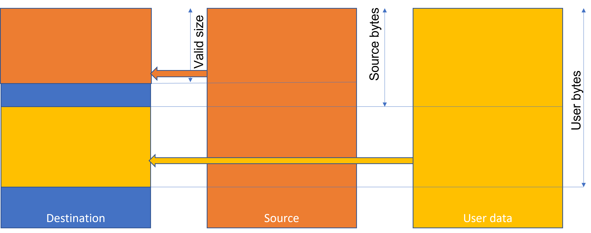
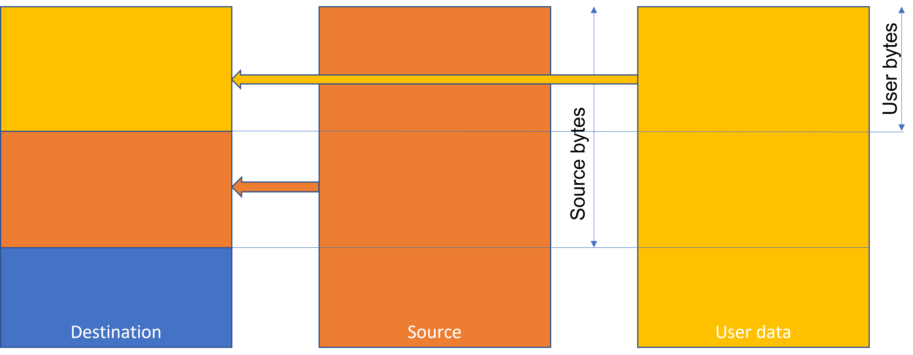

// Copyright (c) 2023-2024 Khronos Group. This work is licensed under a
// Creative Commons Attribution 4.0 International License; see
// http://creativecommons.org/licenses/by/4.0/

= The OpenVX^(TM)^ Supplementary data Extension
:regtitle: pass:q,r[^®^]
The Khronos{regtitle} OpenVX Working Group; Contributors: Raphael Cano, Steve Ramm
:title-logo-image: images/Khronos_RGB.svg
:data-uri:
:icons: font
:toc2:
:toclevels: 3
:max-width: 100
:numbered:
:imagewidth: 800
:fullimagewidth: width="800"
:halfimagewidth: width="400"
:source-highlighter: coderay
// Various special / math symbols. This is easier to edit with than Unicode.
include::config/attribs.txt[]

// Paths to code examples and headers
:examples: examples
:headers: examples

image::images/OpenVX_RGB.svg[align="center",{halfimagewidth}]
include::copyright-spec.txt[]

<<<<
    
// Table of contents is inserted here
toc::[]

:leveloffset: 1
[[sec_purpose]]
= Purpose of the extension

Often it is useful to have additional "supplementary data" associated with some of the standard types, rather than passing this data as separate additional parameters to a kernel. For example, it may be useful to add data to output images to record conditions encountered during processing, or to propagate errors without interrupting the graph execution. Another advantage is that the supplementary data is synchronized with the data you received. This kind of mechanism can be very helpful if you want to track some important information (exposure time, gain, frame counter or any other useful meta information) across the different nodes and/or at the edges of your graph. 

In principle there is no restriction on the type of the supplementary data that a user may wish to associate with a reference, although it is expected that it will be a vx_user_data_object, and this extension specifies that vx_user_data_object be supported. Kernels should not assume that there is supplementary data associated with parameters, so that the same kernel may be used to process plain parameters or those with supplementary data attached.

[NOTE]
.Note
====
A pre-requisite for this extension is The OpenVX™ User Data Object Extension.
====

[[sec_acknowledge]]
= Acknowledgements

This specification would not be possible without the contributions from this
partial list of the following individuals from the Khronos Working Group and
the companies that they represented at the time:

  * Simon Barfield - ETAS (Robert Bosch GmbH)
  * Raphael Cano - Robert Bosch GmbH
  * Radhakrishna Giduthuri - Intel
  * Andrew Graves - ETAS (Robert Bosch GmbH)
  * Viktor Gyenes - AI Motive
  * Kiriti Nagesh Gowda - AMD
  * Stephen Ramm - ETAS (Robert Bosch GmbH)
  * Jesse Villarreal - TI

[[sec_design_overview]]
= Design Overview

The application programmer can create a custom data type using *vxCreateUserDataObject*, and then associate an object of this type with a specific data object using `<<vxSet,vxSetSupplementaryUserDataObject>>`, as shown in the following code snippet:
```c
typedef struct _user_data
{
    vx_uint32 numbers[4];
} user_data_t;
user_data_t user_data = {0};
vx_context context = vxCreateContext();

/* Create an exemplar full of zeroes to use as a template for supplementary data */
vx_user_data_object exemplar = vxCreateUserDataObject(context, "user_data_t", sizeof(user_data_t), &user_data);

/* Create an image and then create supplementary data for this image using the exemplar as a template */
vx_image image = vxCreateImage(context, 100, 100, VX_DF_IMAGE_U8);
vx_status status = vxSetSupplementaryUserDataObject((vx_reference)image, exemplar);

/* The exemplar is not needed by the application any more */
vxReleaseUserDataObject(&exemplar);
```

When the supplementary data is created in this way, not only the object properties but also its data are copied from the second parameter.

After the supplementary data has been created, all subsequent calls of `<<vxSet,vxSetSupplementaryUserDataObject>>` with the same object as the first parameter will result in just the data being copied from the second parameter, providing that its type name and size matches exactly to the existing supplementary data:

```c
/* We have another user data object of the same type, with some other data in it.
 We can use this other object to set the supplementary data of the image */
user_data_t other_user_data = {.numbers = {1, 2, 3, 4}};
vx_user_data_object another = vxCreateUserDataObject(context, "user_data_t", sizeof(user_data_t), &other_user_data);

/* Set the supplementary data in the image from this object. Because the object is exactly the same type, the data will be copied */
status = vxSetSupplementaryUserDataObject((vx_reference)image, another);

```

Accessing the supplementary data of an object is done with the function `<<vxGet,vxGetSupplementaryUserDataObject>>`, which returns a *vx_user_data_object*. You must specify either the exact type (as a string) or a NULL to return whatever is available. Always check the status returned since an error object will be returned either if there is no supplementary data attached, or if the type does not match the type you expect. You can use this object directly to set the supplementary data of another.

```c
/* Access the supplementary data of the image. We expect a data type of "user_data_t" */
vx_user_data_object supplement = vxGetSupplementaryUserDataObject((vx_reference)image, "user_data_t", &status);
if (VX_SUCCESS == status)
{
  /* Map or copy the data in supplement.. here we use it to set the supplementary data of an output image:*/
  status = vxSetSupplementaryUserDataObject(output_image, supplement);
}
else
{
  /* no data of the requested type */
}
/* Access the supplementary data of another image. We can accept different data types */
vx_user_data_object suppl_2 = vxGetSupplementaryUserDataObject((vx_reference)another_image, NULL, &status);
if (VX_SUCCESS == status)
{
  /* Query the object to find out its data type, so we know how to process it... */
  vx_char name[VX_MAX_REFERENCE_NAME];
  status = vxQueryUserDataObject(suppl_2, VX_USER_DATA_OBJECT_NAME, &name, sizeof(name));
  /* According to the name returned, now process the data...*/
}
else
{
  /* no data returned */
}
```

When using `<<vxSet,vxSetSupplementaryUserDataObject>>` to copy data from one object to another, there is very often the need to immediately extend the data in the destination object, which of course requires the supplementary data object to be mapped again. Since mapping operations may be expensive, we provide `<<vxExtend,vxExtendSupplementaryUserDataObject>>` to combine both operations, eliminating user code and also one of the hidden mapping operations. For example, calling vxSetSupplementaryUserDataObject will map and unmap both source and destination, and vxCopyUserDataObject will also map and unmap the user data object, but vxExtendSupplementaryUserDataObject will achieve both copies with one less map/unmap operation, and two fewer API calls. An additional benefit is there there is one less object to release. The following code shows how three functions calls are replaced with this one function call, using as an example a user_data_object with an array in it:

```c
/* This code may be replaced... */
struct { int a, b, c} my_user_data[4];
vx_size source_bytes = 2 * sizeof(my_user_data[0]); /* number of bytes in user_data to skip */
/* The supplementary data has been created with vxCreateUserDataObject(context, "my_user_data_t", sizeof(my_user_data), &my_user_data) */
vx_user_data_object supp = vxGetSupplementaryUserDataObject(input, "my_user_data_t");
vx_status status = vxSetSupplementaryUserDataObject(output, supp); /* copy it all across, actually we only wanted source_bytes */
vx_user_data_object supp_output = vxGetSupplementaryUserDataObject(output, "my_user_data_t");
/* Now add the fresh data */
vxCopyUserDataObject(supp_output, size, sizeof(my_user_data) - source_bytes, &my_user_data + 2, VX_WRITE_ONLY, VX_MEMORY_TYPE_HOST);

/* ... with this code: */
struct { int a, b, c} my_user_data[4];
vx_size source_bytes = 2 * sizeof(my_user_data[0]); /* number of bytes in user_data to skip */
vx_user_data_object supp = vxGetSupplementaryUserDataObject(input, "my_user_data_t");
vx_status status = vxExtendSupplementaryUserDataObject(output, supp, &my_user_data, source_bytes, sizeof(my_user_data));

/* You could optimise stack usage if there was no reason to have the entire my_user_data array: */
struct {int a, b, c} just_one_entry;
vx_user_data_object supp = vxGetSupplementaryUserDataObject(input, "my_user_data_t");
/* Fill the first two entries from the input, and the third from a local copy */
vx_status status = vxExtendSupplementaryUserDataObject(output, supp, &just_one_entry - 2, 2 * sizeof(just_one_entry), 3 * sizeof(just_one_entry));
```

== Child objects
[[child_object]]
By *Child Objects* we mean images and tensors created as a view of other images or tensors, using one of the following functions:

[options="header"]
|====
| Function | Type of parent | Type of child | Documentation of function 
| vxCreateImageFromROI | vx_image | vx_image | OpenVX 1.3.1
| vxCreateImageFromChannel | vx_image | vx_image | OpenVX 1.3.1
| [[ArrayFromTensor]]vxCreateImageObjectArrayFromTensor | vx_tensor | vx_image | OpenVX 1.3.1
| vxCreateTensorFromView | vx_tensor | vx_tensor | OpenVX 1.3.1
| vxCreateObjectArrayFromROI | vx_image | vx_image | [[sub_image]]vx_khr_sub_image_arrays
| vxCreateObjectArrayFromChannel | vx_image | vx_image | vx_khr_sub_image_arrays
| vxCreateTensorFromROI | vx_tensor | vx_image | vx_khr_tensor_from_image
| vxCreateTensorFromChannel | vx_tensor | vx_image | vx_khr_tensor_from_image
| vxCreateTensorObjectArrayFromROI | vx_tensor | vx_image | [[tensor_from_image]]vx_khr_tensor_from_image
| vxCreateTensorObjectArrayFromChannel | vx_tensor | vx_image | vx_khr_tensor_from_image
| vxCreateTensorObjectArrayFromView | vx_tensor | vx_tensor | vx_khr_tensor_from_image 
|====

Child objects may be used as any sort of parameter to kernels, subject to the rules laid out in section 2.8.6 of the OpenVX Specification V1.3.1. For example, it may be useful to use different non-overlapping ROIs of a single parent image as outputs to different kernels. In the case where a child object is used solely as input to a kernel, it makes sense that it does not have its own supplementary data, but uses that of the parent. However, in the cases where it is an output object, then there could be an issue with overwriting the parent's supplementary data. For this reason, we have a special action for child objects; when retrieving supplementary data, the data from the parent will be used in the case where no supplementary data has been specifically set on the child data object (_c.f.,_ <<inherit,inheritance>>). For output child objects, however, the programmer can specifically give them their own supplementary data.

It is then up to the programmer to collate information from different child objects and the parent object, where child objects have been modified, but in the more usual situation where child objects are used solely as input to kernels, there is no extra work to do and the number of supplementary data objects is minimised.

[NOTE]
.Object Arrays
====
An object array (the container) may also have supplementary data, distinct from the data of the elements of the array. Object arrays themselves can never be <<child_object,child objects>>, since currently there is no way to create a child object array. However, the elements of an object array may be children of elements of another object array, created using `<<ArrayFromTensor,vxCreateImageObjectArrayFromTensor>>` or using functions from the extensions _<<sub_image,vx_khr_sub_image_arrays>>_ or _<<from_image,vx_khr_tensor_from_image>>_. See also <<exemplars,objects created from exemplars>>.
====

= Functions
[[vxSet]]
== vxSetSupplementaryUserDataObject

See also `<<vxExtend, vxExtendSupplementaryUserDataObject>>`, which is a generalisation of this function.

`[*REQ-SD01*]`[[REQ-SD01]]
Create or set supplementary user data object for a destination reference using another object as the source.

Function signature:
```C

vx_status vxSetSupplementaryUserDataObject(vx_reference destination, const vx_user_data_object source);

```
=== Parameters

* [in] *destination* -The reference for which supplementary data is to be set.
* [in] *source* -     The source of the supplementary data.


==== Source and destination must be valid references

`[*REQ-SD02*]`[[REQ-SD02]]
If *destination* is not a valid *vx_reference*, or *source* is not a valid *vx_user_data_object*, the function shall fail and return the status code *VX_ERROR_INVALID_REFERENCE*.

==== Creation and updating of supplementary data

`[*REQ-SD03*]`[[REQ-SD03]]
If there is no supplementary data associated with the *destination* object and the object is currently connected to a verified graph, or listed as a possible connection to a verified graph (via `vxSetGraphScheduleConfig` or other method), the function shall fail and return the status *VX_FAILURE*.

`[*REQ-SD04*]`[[REQ-SD04]]
If no supplementary data is associated with the *destination* object, and the *destination* object is not associated with any verified graph, then a new supplementary data object shall be created using the *source* as an exemplar, and its data shall be initialised from the *source* object.

`[*REQ-SD05*]`[[REQ-SD05]]
If a supplementary data object already exists in the *destination*, and both the typename and size agree with that of the *source*, then data shall be copied from *source* to the destination supplementary data object.

`[*REQ-SD06*]`[[REQ-SD06]]
The number of bytes copied is given by the value of the attribute *VX_USER_DATA_OBJECT_VALID_SIZE* of the source object, and the corresponding attribute of the destination supplementary data shall be set to this value.

`[*REQ-SD07*]`[[REQ-SD07]]
If either the typename or size of *source* and the supplementary data of *destination* differ, then the function shall fail and return the status *VX_ERROR_INVALID_TYPE*.

==== Objects for which supplementary data may be defined
`[*REQ-SD08*]`[[REQ-SD08]]
The following values shall be supported for *destination*:

* VX_TYPE_USER_DATA_OBJECT
* VX_TYPE_LUT
* VX_TYPE_DISTRIBUTION
* VX_TYPE_PYRAMID
* VX_TYPE_THRESHOLD
* VX_TYPE_MATRIX
* VX_TYPE_CONVOLUTION
* VX_TYPE_SCALAR
* VX_TYPE_ARRAY
* VX_TYPE_IMAGE
* VX_TYPE_REMAP
* VX_TYPE_OBJECT_ARRAY
* VX_TYPE_TENSOR

If an unsupported type is passed for *destination*, the function shall fail and return the status value *VX_ERROR_NOT_SUPPORTED*.

==== Supplementary data cannot have supplementary data
`[*REQ-SD09*]`[[REQ-SD09]]
If the second parameter *source* itself has a supplementary data object associated, then the function shall fail and return the status code *VX_ERROR_NOT_SUPPORTED*. [This rule is to ensure that recursion is avoided.]

`[*REQ-SD10*]`[[REQ-SD10]]
If the first parameter *destination* itself is the supplementary data of another object (_i.e.,_ returned from the function `<<vxGet,vxGetSupplementaryUserDataObject>>`) then the function shall fail and return the status code *VX_ERROR_NOT_SUPPORTED*. [This rule is to ensure that recursion is avoided.]

==== Virtual objects
`[*REQ-SD11*]`[[REQ-SD11]]
The data and supplementary data of virtual objects is inaccessible except inside a kernel process function or validator. If `<<vxSet,vxSetSupplementaryUserDataObject>>` is called with either of the parameters (*destination* or *source*) inaccessible (_i.e.,_ virtual and outside a kernel or validator function) then the function shall fail and return the status code *VX_ERROR_OPTIMIZED_AWAY*.

[NOTE]
.Kernel outputs
====
If supplementary data is to be propagated to outputs, then `<<vxSet,vxSetSupplementaryUserDataObject>>` should be called in at least the validator and possibly also in the kernel.

If the data is to be modified by the kernel, then it would be usual to set it initially in the validator and then use `<<vxExtend,vxExtendSupplementaryUserDataObject>>` in the kernel.

If simple propagation is required, then for static data call the get and set functions in the validator, and if either input or output is a graph parameter, call them in the kernel also.
====

=== Returns

`[*REQ-SD12*]`[[REQ-SD12]] The function returns a *vx_status* code.

Possible return values may include:
|====
| *VX_SUCCESS*                 | The supplementary data of *destination* is successfully initialised
| *VX_ERROR_INVALID_REFERENCE* | The *source* or *destination* reference is not valid
| *VX_ERROR_INVALID_TYPE*      | The *source* data type does not match the type of the supplementary data of the *destination*
| *VX_ERROR_NOT_SUPPORTED*     | The parameter combination is not supported
| *VX_ERROR_OPTIMIZED_AWAY*    | A parameter is inaccessible
| *VX_FAILURE*                 | The *destination* object has no supplementary data and creation is not allowed here
| *VX_ERROR_NO_MEMORY*         | Memory for the supplementary data cannot be allocated
| *VX_ERROR_NO_RESOURCES*      | Some other resource is exhausted
|====

[[vxGet]]
== vxGetSupplementaryUserDataObject

`[*REQ-SD13*]`[[REQ-SD13]]
Return the supplementary data object of type *VX_TYPE_USER_DATA_OBJECT* associated with the given reference *ref*, if it exists.

Function signature:
```C

vx_user_data_object vxGetSupplementaryUserDataObject(vx_reference ref, const vx_char * type_name, vx_status * status);

```

=== Parameters

* [in]  *ref* -       The reference to be queried, this may be of any reference type.
* [in]  *type_name* - Pointer to the expected type name of the supplementary data
* [out] *status* -    Pointer to status code indicating whether the function was successful or not, or NULL

==== Matching the type

`[*REQ-SD14*]`[[REQ-SD14]]
The parameter *type_name* is provided for matching of the expected data type. If it is NULL then any type name will be accepted, otherwise *type_name* will be compared with the type name of any supplementary data attached to *ref*. If there is supplementary data and the type names match, the supplementary data reference shall be returned and *status* will be set to *VX_SUCCESS*, otherwise an error object will be returned and *status* shall be set to *VX_ERROR_INVALID_TYPE* or *VX_FAILURE* if *status* is not NULL. See also <<inherit,the paragraph on inheritance>> for situations where supplementary data may be returned even if none has been specifically set for that object.

==== Termination of type name
`[*REQ-SD15*]`[[REQ-SD15]]
*type_name* must be terminated by a NUL.
The maximum number of characters supported in *type_name* is given by *VX_MAX_REFERENCE_NAME* (*c.f.* The OpenVX™ User Data Object Extension). If this count is reached without encountering a NUL in *type_name*, the function shall fail and return an error object and set *status* accordingly (if not NULL) even if the first *VX_MAX_REFERENCE_NAME* characters match.

[[inherit]]
==== Inheritance

`[*REQ-SD16*]`[[REQ-SD16]]
If *ref* is a <<child_object,child object>> without its own supplementary data, for example an image created using *vxCreateImageFromROI* or a tensor created using *vxCreateTensorFromChannel*, and the parent or any ancestor of the child does have supplementary data, and the function is not being called from with a kernel processing function where *ref* is an output or bidirectional parameter, and the types match as described above, then the function shall return a <<read_only,read-only>> vx_user_data_object that references the same data as the ancestor's supplementary data, so that any changes in that are immediately reflected in the data of this inherited object, and set *status* to *VX_SUCCESS* if *status* is not NULL.

[NOTE]
.Note
====
If the supplementary data of a child object is returned outside a kernel processing function, then this most likely will be a different reference than that obtained from the parent, even though the same data is referenced. Within a kernel function however, the read-only attribute of the object is enforced in the same way as the supplementary data for other input parameters and the reference of the parent may be returned without having to create a new object.
====

[[input_params]]
==== Kernel Input Parameters

`[*REQ-SD17*]`[[REQ-SD17]]
If the function is called from within a kernel processing function and *ref* is passed as an input parameter to the kernel function, the the reference retrieved for the supplementary data shall be a <<read_only,read-only>> vx_user_data_object for the duration of the kernel processing function.

==== Virtual Objects

`[*REQ-SD18*]`[[REQ-SD18]]
The supplementary data of virtual objects is inaccessible except inside a kernel processing, initializer, deinitializer or validator function. If `<<vxGet,vxGetSupplementaryUserDataObject>>` is called with *ref* inaccessible (_i.e.,_ virtual and outside a kernel function) then the function shall fail and return an error object, setting *status* accordingly if *status* is not NULL.

[NOTE]
.Memory allocation
====
The user should be aware that when a supplementary data object is added to a reference, there will be dynamic allocation of data. For this reason it is not allowed for objects after a graph has been verified, and  therefore `<<vxSet,vxSetSupplementaryUserDataObject>>` must be called in the validator to initialise virtual objects.
====

=== Returns

`[*REQ-SD19*]`[[REQ-SD19]]
A reference to the supplementary object associated with *ref* shall be returned as the function result and a status code shall be set in *status* if *status* is not NULL; any possible errors preventing a successful retrieval may be checked in *status* or by calling `vxGetStatus` on the returned reference. Such errors may arise if no supplementary data object is associated with *ref*, the  *type_name* does not match, or the reference is virtual and the access is outside a kernel. Return codes include:

|====
|*VX_ERROR_INVALID_TYPE*      | Indicates that the supplied type parameter(s) do not match or *type_name* was too long.
|*VX_ERROR_INVALID_REFERENCE* | Indicates that the reference provided is not valid
|*VX_ERROR_OPTIMIZED_AWAY*    | Indicates that the reference provided has been optimized out of existence or is inaccessible
|*VX_FAILURE*                 | Indicates that there is no supplementary data available
|*VX_SUCCESS*                 | Reference is valid
|====

==== Reference counting

`[*REQ-SD20*]`[[REQ-SD20]]
A call to *vxReleaseReference* or *vxReleaseUserDataObject* is necessary to release the Object for each call to this function that returns a valid object reference.

[NOTE]
.Note
====
The supplementary data is an object in its own right; it will be destroyed when its reference count reaches zero just like any other. The object to which it is attached holds one reference count.
====

[[vxExtend]]
== vxExtendSupplementaryUserDataObject

`[*REQ-SD21*]`[[REQ-SD21]]
Create or set supplementary user data object for a destination reference using another object as the source, possibly extending it with data from a local buffer.

The reason for including this function is to minimise the number of separate buffer map operations required when copying and extending supplementary data.

_c.f.,_ `<<vxSet,vxSetSupplementaryUserDataObject>>`.

Function signature:
```C

vx_status vxExtendSupplementaryUserDataObject(vx_reference destination, const vx_user_data_object source, const void * user_data, vx_uint32 source_bytes, vx_uint32 user_bytes);

```
=== Parameters

* [in] *destination*  - The reference for which supplementary data is to be set.
* [in] *source*       - The source of the supplementary data, or NULL
* [in] *user_data*    - Buffer containing data to extend what is in *source*
* [in] *source_bytes* - Number of bytes to copy from *source*
* [in] *user_bytes*   - Number of bytes to copy from *user_data*


==== Destination must be a valid reference

`[*REQ-SD22*]`[[REQ-SD22]]
If *destination* is not a valid *vx_reference* the function shall fail and return *VX_ERROR_INVALID_REFERENCE*.

==== Destination may not be supplementary data of another object

`[*REQ-SD23*]`[[REQ-SD23]]
If *destination* is the supplementary data of another object, then the function shall fail and return *VX_ERROR_NOT_SUPPORTED*.

==== Source may not have supplementary data

`[*REQ-SD24*]`[[REQ-SD24]]
If *source* is not NULL and it has supplementary data itself, the function shall fail and return *VX_ERROR_NOT_SUPPORTED*.

==== Virtual objects

`[*REQ-SD25*]`[[REQ-SD25]]
The data and supplementary data of virtual objects is inaccessible except inside a kernel process function or validator. If `<<vxExtend,vxExtendSupplementaryUserDataObject>>` is called with *destination* or, if non-NULL, *source* inaccessible (_i.e.,_ virtual and outside a kernel or validator function) then the function shall fail and return the status code *VX_ERROR_OPTIMIZED_AWAY*.

==== Source and user_data must not both be NULL

`[*REQ-SD26*]`[[REQ-SD26]]
If both *source* and *user_data* are NULL the function shall return VX_ERROR_INVALID_PARAMETERS.

==== Creation of supplementary data

`[*REQ-SD27*]`[[REQ-SD27]]
If there is no supplementary data associated with the *destination* object and the object is currently connected to a verified graph, or listed as a possible connection to a verified graph (via vxSetGraphScheduleConfig), the function shall fail and return the status *VX_FAILURE*.

`[*REQ-SD28*]`[[REQ-SD28]]
If no supplementary data is associated with the *destination* object, and the *destination* object is not associated with any verified graph, then a new supplementary data object shall be created using the *source* as an exemplar. In this case, if *source* is NULL the function shall fail and return *VX_ERROR_INVALID_REFERENCE*.

==== Number of bytes requested must not exceed the memory size of the destination supplementary data

`[*REQ-SD29*]`[[REQ-SD29]]
If *source_bytes* or *num_bytes* is greater than the value returned by querying the attribute *VX_USER_DATA_OBJECT_SIZE* of the *destination* supplementary data the function shall fail and return *VX_ERROR_INVALID_VALUE*.

==== Updating of supplementary data

`[*REQ-SD30*]`[[REQ-SD30]]
If *source* is not NULL and either the typename or size (found by querying the *VX_USER_DATA_OBJECT_NAME* and *VX_USER_DATA_OBJECT_SIZE* attributes) of *source* and the supplementary data of *destination* differ, then the function shall fail and return the status *VX_ERROR_INVALID_TYPE*.

`[*REQ-SD31*]`[[REQ-SD31]]
Otherwise if *source_bytes* is less than or equal to *user_bytes*, then *user_bytes* is treated as the maximum number of bytes to copy. In this case data shall be copied as follows:

If *source* is not NULL then the minimum of *source_bytes* and valid size (the value returned by querying the *VX_USER_DATA_OBJECT_VALID_SIZE* attribute of *source*) bytes of data shall be copied from *source* to the *destination* supplementary data object, if *source* is null, that data shall be skipped. If *user_data* is not NULL,  *user_bytes* - *source_bytes* shall be copied from *user_data* + *source_bytes* to the corresponding position in the destination supplementary object. After the operation, the *VX_USER_DATA_OBJECT_VALID_SIZE* attribute of the destination supplementary data object shall be set to the larger of *user_bytes* and its current value.



`[*REQ-SD32*]`[[REQ-SD32]]
In the case where *source_bytes* is greater than *user_bytes*, *source_bytes* is the total number of bytes to copy, and data shall be copied thus:

If *user_data* is not NULL then *user_bytes* bytes of data shall be copied from *user_data* to the *destination* supplementary data object; if *user_data* is null, that data shall be skipped. If *source* is not NULL, *source_bytes* - *user_bytes* shall be copied from *source* + *user_bytes* to the corresponding position in the destination supplementary object. After the operation, the VX_USER_DATA_OBJECT_VALID_SIZE attribute of the destination supplementary data object shall be set to the larger of *source_bytes* and its current value. Note that in this case the *VX_USER_DATA_OBJECT_VALID_SIZE* attribute of the source object is ignored.


In summary, the actions taken with the different situations are given in the following table:

[options="header"]
|====
| condition | source reference | user data pointer | action 
| user_bytes >= source_bytes | non-null | non-null | Copy up to source_bytes, constrained by valid size, from source followed by (user_bytes - source_bytes) from (user_data + source_bytes)
| user_bytes >= source_bytes | non-null | NULL | Copy up to source_bytes, constrained by valid size, from source
| user_bytes >= source_bytes | NULL | non-null | Copy (user_bytes - source_bytes) from (user_data + source_bytes) into (destination + source_bytes)
| source_bytes > user_bytes | non-null | non-null | Copy user_bytes from user_data followed by (source_bytes - user_bytes) from (source + user_bytes)
| source_bytes > user_bytes | non-null | NULL  |Copy (source_bytes - user_bytes) from (source + user_bytes) into (destination + user_bytes)
| source_bytes > user_bytes | NULL | non-null | Copy user_bytes from user_data
|====

==== Objects for which supplementary data may be defined
`[*REQ-SD33*]`[[REQ-SD33]]
The following values shall be supported for *destination*:

* VX_TYPE_USER_DATA_OBJECT
* VX_TYPE_LUT
* VX_TYPE_DISTRIBUTION
* VX_TYPE_PYRAMID
* VX_TYPE_THRESHOLD
* VX_TYPE_MATRIX
* VX_TYPE_CONVOLUTION
* VX_TYPE_SCALAR
* VX_TYPE_ARRAY
* VX_TYPE_IMAGE
* VX_TYPE_REMAP
* VX_TYPE_OBJECT_ARRAY
* VX_TYPE_TENSOR

If an unsupported type is passed for *destination*, the function shall fail and return the status value *VX_ERROR_NOT_SUPPORTED*.

=== Returns

`[*REQ-SD34*]`[[REQ-SD34]] The function returns a *vx_status* code.

Possible return values may include:
|====
| *VX_SUCCESS*                 | The supplementary data of *destination* is successfully initialised
| *VX_ERROR_INVALID_REFERENCE* | The *source* or *destination* reference is not valid
| *VX_ERROR_INVALID_TYPE*      | The *source* data type does not match the type of the supplementary data of the *destination*
| *VX_ERROR_INVALID_VALUE*     | The value of *num_bytes* is greater than the value of the *VX_USER_DATA_OBJECT_SIZE* attribute
| *VX_ERROR_NOT_SUPPORTED*     | The parameter combination is not supported
| *VX_ERROR_OPTIMIZED_AWAY*    | A parameter is inaccessible
| *VX_FAILURE*                 | The *destination* object has no supplementary data and creation is not allowed here
| *VX_ERROR_NO_MEMORY*         | Memory for the supplementary data cannot be allocated
| *VX_ERROR_NO_RESOURCES*      | Some other resource is exhausted
|====

= Select, Copy, Swap and Move

`[*REQ-SD35*]`[[REQ-SD35]]
The standard kernels Select, Copy, Swap and Move, and the equivalent *vxuCopy* and *vxuSwap* functions shall also Copy (for both Select and Copy), Swap and Move the supplementary data if it exists on both parameters, on the condition that the supplementary data type names and sizes of both parameters match exactly.
If no supplementary data is copied for whatever reason this shall not result in an error in the operation of either the kernel functions or the immediate mode functions.

The rules for child objects as outlined above apply to the Copy kernel and *vxuCopy* function in the same way as for user kernels, thus an image copied from a child image that has not specifically had its own supplementary data set shall have the supplementary data of the parent copied into it.

For swap and move, however, none of the parameters are input parameters and child images will not inherit writeable supplementary data.

= Objects created from exemplars, objects created automatically
[[exemplars]]
`[*REQ-SD36*]`[[REQ-SD36]]
When objects are created from exemplars (for example elements of object arrays and delays), any supplementary data in the exemplars shall be cloned into the newly created objects. For example, if an object array of images is created from an exemplar with supplementary data with a type name of "user_data_one_t" then all the images in the object array shall be given supplementary data of this type, and the supplementary data shall be initialised from the supplementary data of the exemplar.

Sometimes objects may be created automatically by the framework, for example if pipelining or batch processing is used, where node and edge objects may be duplicated to allow concurrent processing. In such cases the edge objects shall be created with supplementary data cloned from the originals. In other words the framework must provide objects with supplementary data as expected by the kernels.

= Read-only objects
[[read_only]]
`[*REQ-SD37*]`[[REQ-SD37]]
Under some circumstances supplementary data shall be read-only and attempts to write to it shall fail (_c.f._ <<input_params,input parameters>> and <<inherit,inherited data>>). The following table summarises the functions that shall return the status *VX_ERROR_NOT_SUPPORTED* if used on read-only data:

[options="header"]
|====
| Function | Condition
| *vxSetUserDataObjectAttribute* | Any
| *vxCopyUserDataObject* | usage is not *VX_READ_ONLY*
| *vxMapUserDataObject* | usage is not *VX_READ_ONLY*
|====
