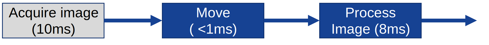

// Copyright (c) 2018 Khronos Group. This work is licensed under a
// Creative Commons Attribution 4.0 International License; see
// http://creativecommons.org/licenses/by/4.0/

= The OpenVX^(TM)^ Swap and Move kernel Extension
:regtitle: pass:q,r[^®^]
The Khronos{regtitle} OpenVX Working Group; Contributor: Steve Ramm
:title-logo-image: images/Khronos_RGB.svg
:data-uri:
:icons: font
:toc2:
:toclevels: 3
:max-width: 100
:numbered:
:imagewidth: 800
:fullimagewidth: width="800"
:halfimagewidth: width="400"
:source-highlighter: coderay
// Various special / math symbols. This is easier to edit with than Unicode.
include::config/attribs.txt[]

// Paths to code examples and headers
:examples: examples
:headers: examples

image::images/OpenVX_RGB.svg[align="center",{halfimagewidth}]
include::copyright-spec.txt[]

<<<<

// Table of contents is inserted here
toc::[]

:leveloffset: 1
= OpenVX 1.3.1: SWAP and MOVE: New kernels with bidirectional parameters
[[sec_purpose]]
== Purpose

Bidirectional parameters are re-introduced to OpenVX with the bidirectional parameters extension.
This extension introduces two new generic kernels that require specific support in the framework and introduce significant graph functionality by exploiting the properties of bidirectional parameters.

=== The SWAP kernel.

The SWAP kernel has two bidirectional parameters, 'first' and 'second', and it is used to swap the data contents of two references. The references must be of the same type, and attributes must match sufficiently that after swapping their data consistency of meaning in the data is preserved. For the purposes of graph traversal during verification, 'first' may be regarded as an input in that if 'second' is a virtual object, undefined metadata in 'second' may be propagated from 'first'.

Because both parameters are bidirectional, nodes with a SWAP kernel must obey the rules for execution order determined by both of the parameter connections, for example if one of the objects connected is virtual, it must be also connected to another node as an output.

=== The MOVE kernel.

The MOVE kernel has one bidirectional parameter, and one output parameter. It performs essentially the same operation as the SWAP kernel, but because one parameter is an output, the graph connections allowed and the sequence of execution of nodes is different to the SWAP kernel.
After execution of the MOVE kernel, the data pointed to by the reference connected to the bidirectional parameter is not defined.

[[sec_usecases]]
== Example Use Cases

* Move data from an image into an element of a delay or object array
* Swap data buffers of two references (useful when feeding data from one graph to another)
* A move node (expected to execute very quickly) can be used as the head node in a pipelined graph so that an object may be dequeued very soon after enqueueing, freeing it up for new data acquisition


Image repetition time < 11ms; without the move node it would be 18ms; the frame is ready earlier without increasing the pipeline depth.


[[sec_acknowledge]]
== Acknowledgements

This specification would not be possible without the contributions from this
partial list of the following individuals from the Khronos Working Group and
the companies that they represented at the time:

  * Simon Barfield - ETAS (Robert Bosch GmbH)
  * Raphael Cano - Robert Bosch GmbH
  * Radhakrishna Giduthuri - Intel
  * Andrew Graves - ETAS (Robert Bosch GmbH)
  * Viktor Gyenes - AI Motive
  * Kiriti Nagesh Gowda - AMD
  * Stephen Ramm - ETAS (Robert Bosch GmbH)
  * Jesse Villarreal - TI

[[page_requirements_requirements]]
= Requirements


== Enumeration constants

`[*REQ-SWP01*]`[[REQ-SWP01]]

The following enumeration constants are defined:

```c
enum vx_kernel_e {

    /*! \brief The data object swap kernel. (If implemented)
    * \see group_vision_function_swap
    */
    VX_KERNEL_SWAP = VX_KERNEL_BASE(VX_ID_KHRONOS, VX_LIBRARY_KHR_BASE) + 0x41,

    /*! \brief The data object move kernel. (If implemented)
    * \see group_vision_function_move
    */
    VX_KERNEL_MOVE = VX_KERNEL_BASE(VX_ID_KHRONOS, VX_LIBRARY_KHR_BASE) + 0x42,

};

```

== Function definitions

=== vxSwapNode - insert a SWAP node

`[*REQ-SWP02*]`[[REQ-SWP02]]
Insert a SWAP kernel into a graph.

```c
vx_node vxSwapNode(vx_graph graph, vx_reference first, vx_reference second);
```

==== Parameters

* [in] _graph_ - The reference to the graph
* [in, out] _first_  - Reference to the first bidirectional parameter
* [in, out] _second_ - Reference to the second bidirectional parameter

==== Return value

*  vx_node - A node reference. Any possible errors preventing a successful creation can be checked using vxGetStatus()

==== Requirements during verification and execution of the graph

`[*REQ-SWP03*]`[[REQ-SWP03]]

During graph verification, the _first_ parameter will be treated as containing the metadata to propagate in the case that _second_ is a virtual data object.

`[*REQ-SWP04*]`[[REQ-SWP04]]

Both parameters must be of the same type and have the same metadata, or the graph will fail to verify.

`[*REQ-SWP05*]`[[REQ-SWP05]]

After execution of the kernel, the _first_ reference will contain data previously held in _second_, and vice-versa.

=== vxMoveNode - insert a MOVE node

`[*REQ-SWP06*]`[[REQ-SWP06]]
Insert a MOVE kernel into a graph.

```c
vx_node vxMoveNode(vx_graph graph, vx_reference first, vx_reference second);
```

==== Parameters

* [in] _graph_ - The reference to the graph
* [in, out] _first_  - Reference to the first bidirectional parameter
* [out] _second_ - Reference to the  output parameter

==== Return value

*  vx_node - A node reference. Any possible errors preventing a successful creation can be checked using vxGetStatus()


==== Requirements during verification and execution of the graph

`[*REQ-SWP07*]`[[REQ-SWP07]]

During graph verification, the _first_ parameter will be treated as containing the metadata to propagate in the case that _second_ is a virtual data object.

`[*REQ-SWP08*]`[[REQ-SWP08]]

Both parameters must be of the same type and have the same metadata, or the graph will fail to verify.

`[*REQ-SWP09*]`[[REQ-SWP09]]

After execution of the kernel, the _second_ reference will contain data previously held in _first_, and the data held in the _first_ reference is not defined.

`[*REQ-SWP10*]`[[REQ-SWP10]]

If a MOVE node has its bidirectional parameter attached to the input of another node, the graph will fail to verify; the rule that virtual bidirectional parameters must be attached to at least one input does not apply to the MOVE node.

=== Immediate mode SWAP and MOVE

`[*REQ-SWP11*]`[[REQ-SWP11]]

The functions vxuSwap and vxuMove are similar in signature.

```c
vx_status vxuSwap(vx_context context, vx_reference first, vx_reference second);
vx_status vxuMove(vx_context context, vx_reference first, vx_reference second);
```

`[*REQ-SWP12*]`[[REQ-SWP12]]

Both parameters must be valid references of the same type and have the same metadata, or the function will return an error code.

`[*REQ-SWP13*]`[[REQ-SWP13]]

After execution of the vxuSwap function, the _first_ reference will contain data previously held in _second_, and vice-versa.

`[*REQ-SWP14*]`[[REQ-SWP14]]

After execution of the vxuMove function, the _second_ reference will contain data previously held in _first_, and the data held in _first_ is not defined.

=== Additional requirements and restrictions

Note that from definitions elsewhere in the OpenVX specification, using the kernel VX_KERNEL_COPY may affect not only the destination object but other related objects in the following ways:

* If the destination object has any sub-objects (for example images created from ROI or channel, tensors created from view, etc..) then these objects will be affected as expected by the specification of the corresponding creation function (vxCreateImageFromROI etc...).
* If the destination object is a sub-object of another parent object (for example images created from ROI or channel, tensors created from view, etc..), then the parent object will be affected as expected by the specification of the corresponding creation function (vxCreateImageFromROI etc...).

There are related effects and restrictions for using the kernels VX_KERNEL_SWAP and VX_KERNEL_MOVE, as follows:

`[*REQ-SWP15*]`[[REQ-SWP15]]

For the SWAP and MOVE kernels, neither parameter may be a image or tensor created as a region of interest or channel of another image or tensor. For example if image1 is created using vxCreateImageFromChannel, then it may not be SWAPped with any other object, nor MOVEd to or from any other object. (Similar restrictions are implicit in the specification of vxSwapImageHandle and vxSwapTensorHandle)

`[*REQ-SWP16*]`[[REQ-SWP16]]

For the SWAP and MOVE kernels, if either parameter has any sub-objects (for example images created from ROI or channel, tensors created from view, etc..) then these objects will be affected as expected by the specification of the corresponding creation function (vxCreateImageFromROI etc...).

`[*REQ-SWP17*]`[[REQ-SWP17]]

If a reference _Ref1_ is taken from a container object (object array or pyramid) and the container is swapped or moved with another, then the data pointed to by _Ref1_ will be changed to the data of the new container. This implies that each member of the container is swapped or moved, rather than the references stored in the containers being swapped or moved.

`[*REQ-SWP18*]`[[REQ-SWP18]]

If images or tensors match in attributes but differ in allocated memory size, then they can still be swapped, unless they have sub-objects (created from channel, ROI, or view), in which case the operation need not be supported.

=== Performance note

For the SWAP and MOVE kernels, we do not demand that both parameters must have been created using the same memory type. In some implementations this may result in inefficient code for swapping, and users should check with their implementation to determine if there will be a performance penalty when swapping certain objects. Unlike for the APIs vxSwapImageHandles and vxSwapTensorHandle, we do not demand that in the case of images and tensors that they have been created using vxCreateImageFromHandle or vxCreateTensorFromHandle. Implementers should consider how to make images and tensors truly swappable whether they have been created "from handle" or not.

==== Usage

Users should avoid using MOVE or COPY where objects are in different memory areas (implementation-dependent).
