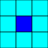
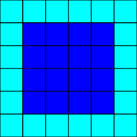
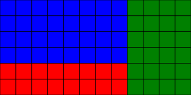
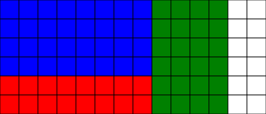
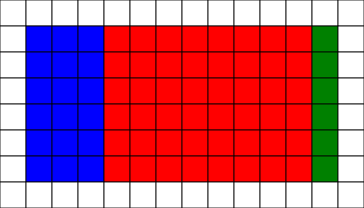
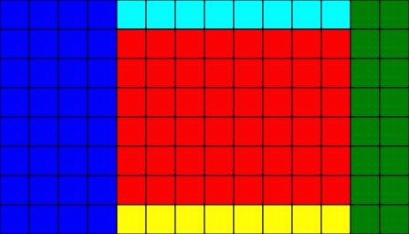

// Copyright (c) 2018 Khronos Group. This work is licensed under a
// Creative Commons Attribution 4.0 International License; see
// http://creativecommons.org/licenses/by/4.0/

= The OpenVX^(TM)^ User Kernel Tiling Extension
:regtitle: pass:q,r[^®^]
The Khronos{regtitle} OpenVX Working Group; Editors: Shorin Kyo, Thierry Lepley, Erik Rainey, Frank Brill, Andrew Garrard, Radhakrishna Giduthuri
:title-logo-image: images/Khronos_RGB.svg
:data-uri:
:icons: font
:toc2:
:toclevels: 3
:max-width: 100
:numbered:
:imagewidth: 800
:fullimagewidth: width="800"
:halfimagewidth: width="400"
:source-highlighter: coderay
// Various special / math symbols. This is easier to edit with than Unicode.
include::config/attribs.txt[]

// Paths to code examples and headers
:examples: examples
:headers: examples

image::images/OpenVX_RGB.svg[align="center",{halfimagewidth}]
include::copyright-spec.txt[]

Contributors::

 * Erik Rainey, Amazon
 * Frank Brill, Cadence
 * Thierry Lepley, Cadence
 * Shorin Kyo, Huawei
 * Andrew Garrard, Samsung

<<<<

// Table of contents is inserted here
toc::[]

:leveloffset: 1

= User Kernel Tiling

The User Kernel Tiling facility enables optimizations of the user nodes
(e.g. locality of execution or parallelism) when performing computation on
the image data.
Modern processors have a diverse memory hierarchy that varies from
relatively small but fast and expensive memory to relatively large but slow
and inexpensive memory.
Image data is typically too large to fit into the fast but small memory.
The ability to break the image data into smaller-sized rectangular units
allows for optimized computation on these smaller units with fast memory
access or parallel execution of a user node on multiple image ``tiles''
simultaneously.
The OpenVX Graph Manager possesses the knowledge about the memory hierarchy
of the target and is hence in a position to break the image data into
smaller units for memory optimization.
Knowledge of the memory access pattern of an algorithm is key for the graph
manager to enable optimizations.

As with conventional User Kernels, Tiling User Kernels will typically be
loaded and executed on HLOS/CPU-compatible targets, not on remote processors
or other accelerators --- the intent of this extension is to allow efficient
scheduling and memory transfer between accelerators and user functions, not
to provide code to run on an accelerator, since this capability is
necessarily vendor-specific.
This specification does not mandate what constitutes compatible platforms.

[[sec_purpose]]
== Purpose

The purpose of having User Kernel Tiling Functions is to:

  * Provide a mechanism for user-kernel programmers to communicate enough
    information about their computation to enable OpenVX implementations to
    perform some optimizations that take advantage of locality in the
    user-node computation, and enable parallelism of execution across local
    data sets.
  * Define a portable method to enable tiling on compatible platforms.
  * Define a simple way to enable users to write image processing functions.

[[sec_basic_design]]
== Basic Design

The user kernel tiling facility is largely composed of two components:

  * User Node informs Graph Manager -- The author of the tilable user
    kernel informs the graph manager about the data requirements of the
    algorithm implemented by the kernel.
    This is primarily done by setting attributes on the kernel (for all
    nodes of this type), or on the node (for that particular node).
    This is usually done at kernel definition time (for kernel attributes)
    or at node creation time (for node attributes).
    Only single-plane images are supported as input or output arguments to
    tiled user nodes in this version of the specification.
  * Graph Manager informs User Node -- The graph manager informs the user
    kernel code about the rectangular sub-image, or "`tile`", on which the
    user kernel code will run.
    This is primarily done via macros that the user kernel code can call to
    get this information at run time for a particular invocation of the user
    code.
    In this version of the tiling extension, the user functions are expected
    to generate the same output pixels in each output image, and to rely on
    the corresponding pixels of the input image, potentially with the
    addition of some nearby "`neighborhood`" pixels, to perform this
    calculation.
    The effect of a tiling user kernel that writes to its input images is
    implementation-defined.

[[sec_two_functions]]
== Two Kernel Functions

The creator of the tiled user kernel must provide a kernel function to
perform the actual computation.
Optionally, the kernel creator may provide a second function with different
edge-condition checks.

  * One of the functions is referred to as the "`flexible`" function, and it
    may be called with irregular tile sizes and near the edge of the tile's
    parent image, so it must fully check all edge conditions to handle such
    issues.
  * The second function is referred to as the "`fast`" function, and it will
    only be called with tile sizes and pixel alignments that are multiples
    of the user-specified "`tile block size`", and will not be called in a
    location that would cause references to the neighborhood region to fall
    outside the image.

If the kernel creator only provides the fast function, some of the output
image (near the edges) will not be computed if the fast function cannot be
safely called at the edge of these images.
If the kernel creator only provides the flexible function, it will be called
at all appropriate locations of the image, including near the edges.
The OpenVX implementation should still attempt to call the flexible function
with regular tile sizes and alignments where possible.
If both functions are provided, the fast function should be used as much as
possible given its restrictions, and the flexible function will be called
elsewhere.

[[sec_glossary]]
== Glossary

Terms and Definitions of the Extension:

Tile ::
    The rectangle of destination pixels to be computed by the user function,
    whose size is less than or equal to the rectangle of the entire image.
    This value is determined by the OpenVX runtime.
    Every tile that is provided to the user node will be fully contained
    within the image, and no pixel of the image will be included in more
    than one tile.
    The user cannot rely on the order or concurrency of tile processing.
Output tile block ::
    The output tile block size imposes a coordinate grid over the image that
    is aligned with the top-left corner of the output image.
    The fast function will always be called on a tile that is aligned to
    this grid, and the dimensions of this tile are integer multiples of the
    tile block size.
    That is, the fast function is invoked on a tile consisting of a whole
    number of tile blocks.
    There are no restrictions on the size and alignment of a tile given to
    the flexible function.
    It is expected that the tile block size be small - potentially a single
    pixel - in order to maximize opportunities to use a "`fast`" function.
    The tile size should generally be much larger, and chosen by the graph
    manager in an implementation-specific way to make good use of cache
    sizes and memory transfer and to limit function call overhead, while
    still offering the potential for reduced memory footprint and parallel
    execution.
Input tile block ::
    The input tile block defines the dimension of a tile block in the input
    image corresponding to an output tile block.
    In OpenVX 1.0, this value is unconditionally regarded to be same as the
    output tile block size.
Fast function ::
    A function provided by the user which will be invoked only with tiles
    whose coordinates are aligned to, and whose dimensions are integer
    multiples of, the tile block size, and which will never attempt to
    access pixels that lie beyond the bounds of the input images (due to
    neighborhood).
    The expectation is that the user may be able to provide a more efficient
    implementation if the function is known to be invoked on
    coordinate-aligned data.
    For this reason, the implementation may be expected to invoke the fast
    function preferentially over the flexible function.
    If only the fast function is provided and the flexible function is not,
    the regions of the image which do not meet the requirements of running
    the fast function will not be processed.
    Note that coordinate alignment does not imply memory alignment, which is
    determined in part by image stride and is implementation-defined, though
    many implementations will define a relationship between coordinate and
    memory alignment.
    There is no guarantee of evaluation order of the functions, and on some
    implementations multiple invocations may occur concurrently.
    The fast function is a function pointer of type
    `<<vx_tiling_kernel_f>>`.
Flexible function ::
    A function provided by the user which can be used to process tiles that
    are not constrained by tile block size, and - with
    `<<VX_BORDER_MODE_SELF,VX_BORDER_MODE_SELF>>` - which may rely on a neighborhood that
    corresponds to pixels beyond the bounds of the input images.
    The user function should be capable of running at arbitrary coordinate
    alignment.
    If only the flexible function is provided, this will be invoked on
    tile-block aligned tiles as well as unaligned tiles.
    The user can expect aligned regions to be invoked preferentially even
    when only a flexible function is provided.
    At least one of the fast and flexible functions must be provided.
    The flexible function is a function pointer of type
    `<<vx_tiling_kernel_f>>`.
Input neighborhood ::
    The additional pixels surrounding the tile in the input images that are
    required in order to compute the output tile.
    The top, bottom, left and right values correspond to the offset of the
    edges of the neighborhood defined relative to the tile being processed.
    For example, a Sobel kernel requiring 3 by 3 pixels centered on the
    output would have an input neighborhood of (-1,1,-1,1).
    Functions which operate on only a single pixel have an input
    neighborhood of (0,0,0,0).
Output neighborhood ::
    The additional (previously computed) pixels surrounding the tile in the
    output image needed to compute the output tile.
    In OpenVX 1.0, this value is unconditionally regarded as zero in all
    four directions (top, bottom, left, right).
Border mode ::
    Defines the behavior of the OpenVX runtime against the determination of
    tiles near the image edge for non-zero neighborhood sizes.
    If the border mode is ``VX_BORDER_MODE_SELF``, the flexible function
    will be invoked on tiles near the image border that would require
    neighborhood access beyond the image bounds, and this function is
    responsible for accessing any pixels whose coordinates are invalid.
    If the border mode is ``VX_BORDER_MODE_UNDEFINED``, the graph manager
    will ensure that the user functions are not invoked on coordinates that,
    because of neighborhood, require access outside the image area.
Tile memory ::
    A facility for per-tile memory allocation.
    The amount allocated will be the amount requested via the
    `<<VX_KERNEL_ATTRIBUTE_TILE_MEMORY_SIZE,VX_KERNEL_ATTRIBUTE_TILE_MEMORY_SIZE>>` attribute (which may be zero)
    multiplied by the number of tile blocks in the tile being processed, and
    the allocation will be passed to the user-provided functions through the
    `tile_memory` parameter.
    The size allocated for that function invocation is provided via the
    `tile_memory_size` parameter.
    The valid lifetime of the given pointer is per invocation of the user
    function that processes a tile.
    This allocation is provided _per tile_ --- and therefore two parallel
    invocations of the user tiling functions will receive different
    allocations.
    This is distinct from the per-node memory managed via the
    `<<VX_KERNEL_ATTRIBUTE_LOCAL_DATA_SIZE,VX_KERNEL_ATTRIBUTE_LOCAL_DATA_SIZE>>` and
    `<<VX_KERNEL_ATTRIBUTE_LOCAL_DATA_PTR,VX_KERNEL_ATTRIBUTE_LOCAL_DATA_PTR>>` kernel attributes.

[[sec_summary]]
== Summary of user function calls

The following tables describe the circumstances under which each user
function will be invoked, categorized by the border mode settings of the
node.

[[sec_by_functions]]
=== User function invocation according to which functions are defined

[options="header"]
|====
| Functions provided | VX_BORDER_MODE_UNDEFINED | VX_BORDER_MODE_SELF
| If only the FAST function is defined...
    | The Fast function is invoked on the largest aligned image subset that
      avoids out-of-bounds accesses. Other pixels are not processed.
        | Prohibited (graph validation fails).
| If only the FLEXIBLE function is defined...
    | The flexible function is invoked on the largest image subset that
      ensures neighborhood accesses are within bounds, irrespective of
      alignment. Other pixels are not processed.
        | The flexible function is invoked for all pixels in the output
          image irrespective of alignment, including pixels that correspond
          to neighborhood accesses beyond the image bounds.
| If both the FAST and FLEXIBLE functions are defined...
    | The fast function is invoked on the largest aligned image subset that
      avoids out-of-bounds neighborhood accesses. The flexible function is
      invoked for the remaining pixels that do not require out-of-bounds
      accesses.
        | The fast function is invoked on the largest aligned image subset
          that avoids out-of-bounds neighborhood accesses. The flexible
          function is invoked on remaining pixels.
|====

Note that a missing flexible function when using `VX_BORDER_MODE_SELF` is
treated as an error even if the fast function might never be expected to be
called (for example, if the image size is divisible by the tile block size
and the neighborhood is 0).

[[sec_by_pixels]]
=== User function invocation according to which pixels are being processed

[options="header"]
|====
| Pixels to process | VX_BORDER_MODE_UNDEFINED | VX_BORDER_MODE_SELF
| Pixels that require access beyond the image bounds (due to neighborhood)
    | Not processed by any function
        | Processed by the flexible function, which must be provided
| Pixels that require access only within the image, but in an unaligned tile
    | Processed by the flexible function (if provided) and not processed
      otherwise
        | Processed by the flexible function, which must be provided
| Pixels within an aligned tile that do not access beyond the image bounds
    | Processed by the fast function if provided, otherwise by the flexible
      function
        | Processed by the fast function if provided, otherwise by the
          flexible function
|====

<<<
[[sec_add_kernel]]
== Adding a Tiling Kernel Function

[source,c,indent=0]
----
include::{examples}/vx_tiling_ext.c[tag=publish_function]
----

[[sec_example_kernel]]
== Example Kernels

Users can add simple filter-style kernels similar to this example of a
Gaussian Blur.

[source,c,indent=0]
----
include::{examples}/vx_tiling_gaussian.c[tag=gaussian_tiling_function]
----

Note that this function has a non-zero neighborhood, and performs no special
checking for running at the image borders.
Therefore it must be used as a "`fast`" function and, unless a corresponding
"`flexible`" function is provided, must be used with
VX_BORDER_MODE_UNDEFINED.

Users can also add more complex addressing functionality in order to
optimize their code in this example which uses two inputs:

[source,c,indent=0]
----
include::{examples}/vx_tiling_add.c[tag=add_tiling_function]
----

With a tile block width and height of one, combined with the zero
neighborhood, this function can be used as a "`flexible`" function.
With a larger tile block size, this is a "`fast`" function.

For better performance, the user might split this into two functions.
Firstly, a "`fast`" function:

[source,c,indent=0]
----
include::{examples}/vx_tiling_add.c[tag=add_fast_tiling_function]
----

This fast function has a fixed 16 by 16 tile block size, the loops of which
the compiler may be able to unroll or otherwise optimize --- the pixel
access macro is designed to give the compiler the best chance of doing this.
Less portable code may be able to rely on byte alignment and fast memory
accesses, and perform SIMD operations in the fast function to maximize the
host CPU performance.

In addition to performance optimization, many algorithms have tile block
size requirements due to spatial effects on pixels.
For example, ordered dithering, UV upsampling and debayering all require
pixels to be processed differently according to location within a repeating
block.

This would be complemented by a corresponding "`flexible`" function:

[source,c,indent=0]
----
include::{examples}/vx_tiling_add.c[tag=add_flexible_tiling_function]
----

This function ignores the tile block and processes the tile given to it one
pixel at a time.
It is expected that the flexible function should be called for much less of
the image than the fast function, so this overhead should be considered
acceptable.
This applies whether the flexible function is invoked because of tile
alignment or in order to support out-of-bounds accesses, and users writing
portable OpenVX code should be able to devote effort to the fast function.
However, it is legal for an implementation with minimal tiling support to
process an entire image in a single, possibly unaligned, tile for
portability reasons.

ifdef::OVX_TILING_LANGUAGE[]
Users can also write a version which is wrapped in a non-binary-portable
macro syntax for optimizations on platforms which can support different
optimization strategies.

[source,c,indent=0]
----
include::{examples}/vx_tiling_box.c[tag=box_tiling_function]
----

endif::OVX_TILING_LANGUAGE[]

[[sec_diagrams]]
== Example diagrams

[[sec_noneighbors]]
=== A trivial kernel

The simplest user functions (that depend on any inputs at all) will read
only the pixel in the input image(s) that correspond(s) to the pixel in the
output image(s).
Such a function requires a neighborhood size of 0 in each direction.
If only a single image is processed at a time, the tile block size should be
set to 1 by 1.
Here we show the tile block --- and therefore minimum tile size --- in blue
(trivially).

[[sec_neighbors]]
=== A user function with a neighborhood

A more complex user function may require source pixels surrounding the
coordinate of the output pixel in order to work.
For example, a Sobel filter requires the a three by three block centered on
the current pixel.
Here we show the neighborhood in cyan around the single pixel to be
processed, in blue --- each square represents one pixel.
This neighborhood would be specified as "`-1,1,-1,1`".

[[sec_fast_neighbors]]
=== A faster function with a neighborhood

The user may choose to optimize the same function by making it work on
blocks of 4 by 4 pixels, rather than one pixel at a time.
In this case, the tile block should be set to 4 by 4.
Depending on the implementation, the neighborhood may be unmodified.
If a fast function is defined that uses this 4 by 4 tile block, the user
should still offer a flexible function that can process tiles that are not
aligned to this 4 by 4 grid, since otherwise some portions of the image area
may be left unprocessed.
Here we show the 4 by 4 tile block with a single pixel neighborhood,
specified in the same way as before.

Tiles processed using the "`fast`" function will be aligned to a 4x4 grid,
and some multiple of this tile block size; the fast function will be able to
access valid pixels from the neighborhood area (which will surround the
complete tile by a single pixel).

[[sec_tile_vs_tileblock]]
=== Tiles and tile blocks

Consider a simple function that has no neighborhood - let us say a function
which posterizes the image by replicating the top four bits of an 8-bit
input into the lower four bits:

[source,c]
--------------------------------------
out(x,y) = (in(x,y) & 0xF0) | (in(x,y) >> 4)
--------------------------------------

If the implementation guarantees 32-bit alignment for the start of each row
--- _not_ something guaranteed by OpenVX, but likely common --- then the
user could write a "`fast`" function which processes four pixels at once,
using a 32-bit integer.
This function would then have a 4 by 1 "`tile block`".

In processing a 12 by 6 image using this function, the graph manager might
choose to break the image into three rectangular "`tiles`".
An example in shown in different colors below.
The fast function can be called for each of these tiles.
It is up to a graph manager to decide different arrangements, and to decide
the order in which the fast function would be invoked for these tiles ---
including whether the tiles are evaluated in parallel --- but the tile block
size guarantees that the tiles will be multiples of 4 by 1 pixels.

Next, consider what happens if the image is 14 by 6 pixels:

In this case, the 2-by-6 strip at the right edge of the image cannot be
processed by tile-block-aligned tiles, and therefore the fast function
cannot process these pixels.
If the user has provided a "`flexible`" function, that function will be used
to process these pixels (still provided with rectangular tiles of data).

[[sec_border_example]]
=== Example of borders

We might imagine a function that is similar to the above, but which requires
access to all the source pixels surrounding the coordinate of the
destination pixel in order to operate.
While it may process a single pixel, the user may choose to perform a
similar optimization to that discussed in the previous section, resulting in
a 4-by-1 tile block with a one-pixel border neighborhood around it.

With the user node's border mode set to `VX_BORDER_MODE_UNDEFINED`, the
graph manager might choose to break the same 14 by 8 image into the
following tiles for the user functions to process:

In this case, the white pixels at the image edge are not processed at all.
The red tile is aligned to tile blocks, and can be processed with a fast
function, if one is provided (otherwise the flexible function is used).
The blue and green tiles do not start on (blue tile) or end on (green tile)
a 4 by 1 tile block grid, so these pixels must be processed by the flexible
function.
If no flexible function is provided, these pixels will not be processed.

With the user node's border mode set to `VX_BORDER_MODE_SELF`, the graph
manager might choose to break the same 14 by 8 image into the following
tiles for the user functions to process:

With `VX_BORDER_MODE_SELF`, the flexible function _must_ be provided.
In this example, only the red tile can be processed by the fast function (if
provided), since only this tile is aligned to a tile block boundary and has
no requirements on pixels beyond the image borders.
The blue, cyan and yellow regions are aligned to the tile block boundary,
but must be processed by the flexible function because the neighborhood of
these pixels extends beyond the image boundary.
The green tile is additionally not aligned to the tile block size.

[[sec_tiling_coding_guidelines]]
== Informative Coding Guidelines

Tiled user kernel functions should be coded in a very specific manner to
maintain the requirement of _data independence_ in that all blocks should be
computed in a _functionally-independent_ manner.
This allows the implementation greater flexibility in optimization choices.
These informal requirements include:

  * Avoid using global shared memory.
  * Avoid using blocking access protected mechanisms (semaphores, etc).
  * Avoid using dynamic memory allocation functions at runtime.
  * Avoid calling other functions internally in the tile function.
  * Do try to write the your loops in an efficient manner for your compiler
    environment.

[[module_documentation]]
= Module Documentation

// @@@ TBD @@@

[[group_tiling]]
== Extension: User Tiling API

// @brief
The Khronos Extension for User Tiling Functions.

// tag::group_tiling:summary[]
*Data Structures*

  * `<<vx_image_description_t>>`
  * `<<vx_neighborhood_size_t>>`
  * `<<vx_tile_block_size_t>>`
  * `<<vx_tile_t>>`

*Macros*

  * `<<VX_MAX_TILING_PLANES,VX_MAX_TILING_PLANES>>`
  * `<<vxImageHeight>>`
  * `<<vxImageOffset>>`
  * `<<vxImagePixel>>`
  * `<<vxImageWidth>>`
  * `<<vxNeighborhoodBottom>>`
  * `<<vxNeighborhoodLeft>>`
  * `<<vxNeighborhoodRight>>`
  * `<<vxNeighborhoodTop>>`
  * `<<vxTileBlockHeight>>`
  * `<<vxTileBlockWidth>>`
  * `<<vxTileHeight>>`
  * `<<vxTileWidth>>`
  * `<<vxTileX>>`
  * `<<vxTileY>>`

*Typedefs*

  * `<<vx_tiling_kernel_f>>`

*Enumerations*

  * `<<vx_border_tiling_e>>`
  * `<<vx_kernel_attribute_tiling_e>>`
  * `<<vx_node_attribute_tiling_e>>`

*Functions*

  * `<<vxAddTilingKernel>>`

// end::group_tiling:summary[]

// tag::group_tiling:details[]
=== Data Structures

// tag::refpage:vx_image_description_t[]
// [desc='',type='structs']
==== vx_image_description_t

// Brief text:
A structure which describes the tile's parent image.

include::api/structs/vx_image_description_t.txt[]

// end::refpage:vx_image_description_t[]

// tag::refpage:vx_neighborhood_size_t[]
// [desc='',type='structs']
==== vx_neighborhood_size_t

// Brief text:
The User Tiling Function Neighborhood declaration.

include::api/structs/vx_neighborhood_size_t.txt[]

// Detailed text:
The author of a User Tiling Kernel will use this structure to define the
neighborhood surrounding the tile block.
// end::refpage:vx_neighborhood_size_t[]

// tag::refpage:vx_tile_block_size_t[]
// [desc='',type='structs']
==== vx_tile_block_size_t

// Brief text:
The User Tiling Function tile block size declaration.

include::api/structs/vx_tile_block_size_t.txt[]

// Detailed text:
The author of a User Tiling Kernel will use this structure to define the
dimensionality of the tile block.
// end::refpage:vx_tile_block_size_t[]

// tag::refpage:vx_tile_t[]
// [desc='',type='structs']
==== vx_tile_t

// Brief text:
The tile structure declaration.

include::api/structs/vx_tile_t.txt[]

===== Data Fields
[cols=".^2,.^8"]
|====
|addr|The array of addressing structure to describe each plane.
|base|The array of pointers to the tile’s image plane.
|image|The description and attributes of the image
|neighborhood|The neighborhood definition.
|tile_block|The output block size structure
|tile_x|The top left X pixel index within the width dimension of the image.
|tile_y|The top left Y pixel index within the height dimension of the image.
|====

// end::refpage:vx_tile_t[]

=== Macros

// tag::refpage:VX_MAX_TILING_PLANES[]
// [desc='',type='defines']
==== VX_MAX_TILING_PLANES

// Brief text:
The maximum number of planes in a tiled image.

include::api/defines/VX_MAX_TILING_PLANES.txt[]

// end::refpage:VX_MAX_TILING_PLANES[]

// tag::refpage:vxImageHeight[]
// [desc='',type='defines']
==== vxImageHeight

// Brief text:
The full height of the tile's parent image in pixels.

include::api/defines/vxImageHeight.txt[]

// Detailed text:
*Parameters*

  * `[in]` _ptile_ - The pointer to the `<<vx_tile_t>>` structure.
// end::refpage:vxImageHeight[]

// tag::refpage:vxImageOffset[]
// [desc='',type='defines']
==== vxImageOffset

// Brief text:
Computes the offset within an image.

include::api/defines/vxImageOffset.txt[]

// Detailed text:
*Parameters*

  * `[in]` _ptile_ - The pointer to the `<<vx_tile_t>>` structure.
  * `[in]` _i_ - The plane index.
  * `[in]` _x_ - The Width Coordinates.
  * `[in]` _y_ - The Height Coordinates.
  * `[in]` _ox_ - The X offset.
  * `[in]` _oy_ - The Y offset.
// end::refpage:vxImageOffset[]

// tag::refpage:vxImagePixel[]
// [desc='',type='defines']
==== vxImagePixel

// Brief text:
Accesses an image pixel as a type-cast indexed pointer dereference.

include::api/defines/vxImagePixel.txt[]

// Detailed text:
*Parameters*

  * `[in]` _type_ - The type of the image pixel.
    Example values are `vx_uint8`, `vx_uint16`, `vx_uint32`, etc.
  * `[in]` _ptile_ - The pointer to the `<<vx_tile_t>>` structure.
  * `[in]` _i_ - The plane index.
  * `[in]` _x_ - The Center Pixel in Width Coordinates.
  * `[in]` _y_ - The Center Pixel in Height Coordinates.
  * `[in]` _ox_ - The X offset.
  * `[in]` _oy_ - The Y offset.
// end::refpage:vxImagePixel[]

// tag::refpage:vxImageWidth[]
// [desc='',type='defines']
==== vxImageWidth

// Brief text:
The full width of the tile's parent image in pixels.

include::api/defines/vxImageWidth.txt[]

// Detailed text:
*Parameters*

  * `[in]` _ptile_ - The pointer to the `<<vx_tile_t>>` structure.
// end::refpage:vxImageWidth[]

// tag::refpage:vxNeighborhoodBottom[]
// [desc='',type='defines']
==== vxNeighborhoodBottom

// Brief text:
The simple wrapper to access each image's neighborhood +Y value.

include::api/defines/vxNeighborhoodBottom.txt[]

// Detailed text:
*Parameters*

  * `[in]` _ptile_ - The pointer to the `<<vx_tile_t>>` structure.
// end::refpage:vxNeighborhoodBottom[]

// tag::refpage:vxNeighborhoodLeft[]
// [desc='',type='defines']
==== vxNeighborhoodLeft

// Brief text:
The simple wrapper to access each image's neighborhood -X value.

include::api/defines/vxNeighborhoodLeft.txt[]

// Detailed text:
*Parameters*

  * `[in]` _ptile_ - The pointer to the `<<vx_tile_t>>` structure.
// end::refpage:vxNeighborhoodLeft[]

// tag::refpage:vxNeighborhoodRight[]
// [desc='',type='defines']
==== vxNeighborhoodRight

// Brief text:
The simple wrapper to access each image's neighborhood +X value.

include::api/defines/vxNeighborhoodRight.txt[]

// Detailed text:
*Parameters*

  * `[in]` _ptile_ - The pointer to the `<<vx_tile_t>>` structure.
// end::refpage:vxNeighborhoodRight[]

// tag::refpage:vxNeighborhoodTop[]
// [desc='',type='defines']
==== vxNeighborhoodTop

// Brief text:
The simple wrapper to access each image's neighborhood -Y value.

include::api/defines/vxNeighborhoodTop.txt[]

// Detailed text:
*Parameters*

  * `[in]` _ptile_ - The pointer to the `<<vx_tile_t>>` structure.
// end::refpage:vxNeighborhoodTop[]

// tag::refpage:vxTileBlockHeight[]
// [desc='',type='defines']
==== vxTileBlockHeight

// Brief text:
The tile block height.

include::api/defines/vxTileBlockHeight.txt[]

// Detailed text:
*Parameters*

  * `[in]` _ptile_ - The pointer to the `<<vx_tile_t>>` structure.
// end::refpage:vxTileBlockHeight[]

// tag::refpage:vxTileBlockWidth[]
// [desc='',type='defines']
==== vxTileBlockWidth

// Brief text:
The tile block width.

include::api/defines/vxTileBlockWidth.txt[]

// Detailed text:
*Parameters*

  * `[in]` _ptile_ - The pointer to the `<<vx_tile_t>>` structure.
// end::refpage:vxTileBlockWidth[]

// tag::refpage:vxTileHeight[]
// [desc='',type='defines']
==== vxTileHeight

// Brief text:
The height of the tile in pixels.

include::api/defines/vxTileHeight.txt[]

// Detailed text:
*Parameters*

  * `[in]` _ptile_ - The pointer to the `<<vx_tile_t>>` structure.
  * `[in]` _index_ - The plane index.
// end::refpage:vxTileHeight[]

// tag::refpage:vxTileWidth[]
// [desc='',type='defines']
==== vxTileWidth

// Brief text:
The width of the tile in pixels.

include::api/defines/vxTileWidth.txt[]

// Detailed text:
*Parameters*

  * `[in]` _ptile_ - The pointer to the `<<vx_tile_t>>` structure.
  * `[in]` _index_ - The plane index.
// end::refpage:vxTileWidth[]

// tag::refpage:vxTileX[]
// [desc='',type='defines']
==== vxTileX

// Brief text:
The offset between the left edge of the image and the left edge of the tile,
in pixels.

include::api/defines/vxTileX.txt[]

// Detailed text:
*Parameters*

  * `[in]` _ptile_ - The pointer to the `<<vx_tile_t>>` structure.
// end::refpage:vxTileX[]

// tag::refpage:vxTileY[]
// [desc='',type='defines']
==== vxTileY

// Brief text:
The offset between the top edge of the image and the top edge of the tile,
in pixels.

include::api/defines/vxTileY.txt[]

// Detailed text:
*Parameters*

  * `[in]` _ptile_ - The pointer to the `<<vx_tile_t>>` structure.
// end::refpage:vxTileY[]

=== Typedefs

// tag::refpage:vx_tiling_kernel_f[]
// [desc='',type='basetypes']
==== vx_tiling_kernel_f

// Brief text:
Tiling Kernel function typedef for User Tiling Kernels.

include::api/basetypes/vx_tiling_kernel_f.txt[]

// Detailed text:
[NOTE]
.Note
====
Tiles may come in any dimension and are not guaranteed to be delivered in
any particular order.
====

*Parameters*

  * `[in]` _parameters_ - The array abstract pointers to parameters.
  * `[in]` _tile_memory_ - The local tile memory pointer if requested,
    otherwise NULL.
  * `[in]` _tile_memory_size_ - The size of the local tile memory, if not
    requested, 0.
// end::refpage:vx_tiling_kernel_f[]

=== Enumerations

// tag::refpage:vx_border_tiling_e[]
// [desc='',type='enums']
==== vx_border_tiling_e

// Brief text:
The tiling border mode extensions.

include::api/enums/vx_border_tiling_e.txt[]

*Enumerator*

  * [[VX_BORDER_MODE_SELF]] `VX_BORDER_MODE_SELF` - This value indicates
    that the author of the tiling kernel wrote code to handle border
    conditions into the kernel itself.
    If this mode is set, it can not be overriden by a call to the
    vxSetNodeAttribute with VX_NODE_BORDER.
// end::refpage:vx_border_tiling_e[]

// tag::refpage:vx_kernel_attribute_tiling_e[]
// [desc='',type='enums']
==== vx_kernel_attribute_tiling_e

// Brief text:
The User Kernel Tiling Attributes.

include::api/enums/vx_kernel_attribute_tiling_e.txt[]

*Enumerator*

  * [[VX_KERNEL_INPUT_NEIGHBORHOOD]] `VX_KERNEL_INPUT_NEIGHBORHOOD` - This
    allows a tiling mode kernel to set its input neighborhood.
  * [[VX_KERNEL_OUTPUT_TILE_BLOCK_SIZE]] `VX_KERNEL_OUTPUT_TILE_BLOCK_SIZE`
    - This allows a tiling mode kernel to set its output tile block size.
  * [[VX_KERNEL_BORDER]] `VX_KERNEL_BORDER` - This allows the author to set
    the border mode on the tiling kernel.
  * [[VX_KERNEL_TILE_MEMORY_SIZE]] `VX_KERNEL_TILE_MEMORY_SIZE` - This
    determines the per tile memory allocation.
// end::refpage:vx_kernel_attribute_tiling_e[]

// tag::refpage:vx_node_attribute_tiling_e[]
// [desc='',type='enums']
==== vx_node_attribute_tiling_e

// Brief text:
The User Node Tiling Attributes.

include::api/enums/vx_node_attribute_tiling_e.txt[]

// Detailed text:
[NOTE]
.Note
====
These are largely unusable by the tiling function, as it doesn't give you
the node reference!
====

*Enumerator*

  * [[VX_NODE_INPUT_NEIGHBORHOOD]] `VX_NODE_INPUT_NEIGHBORHOOD` - This
    allows a tiling mode node to get its input neighborhood.
  * [[VX_NODE_OUTPUT_TILE_BLOCK_SIZE]] `VX_NODE_OUTPUT_TILE_BLOCK_SIZE` -
    This allows a tiling mode node to get its output tile block size.
  * [[VX_NODE_TILE_MEMORY_SIZE]] `VX_NODE_TILE_MEMORY_SIZE` - This is the
    size of the tile local memory area.
// end::refpage:vx_node_attribute_tiling_e[]

=== Functions

// tag::refpage:vxAddTilingKernel[]
// [desc='',type='protos']
==== vxAddTilingKernel

// Brief text:
Allows a user to add a tile-able kernel to the OpenVX system.

include::api/protos/vxAddTilingKernel.txt[]

// Detailed text:
*Parameters*

  * `[in]` _context_ - The handle to the implementation context.
  * `[in]` _name_ - The string to be used to match the kernel.
  * `[in]` _enumeration_ - The enumerated value of the kernel to be used by
    clients.
  * `[in]` _flexible_func_ptr_ - The process-local flexible function pointer
    to be invoked.
  * `[in]` _fast_func_ptr_ - The process-local fast function pointer to be
    invoked.
  * `[in]` _num_params_ - The number of parameters for this kernel.
  * `[in]` _input_ - The pointer to a function which will validate the input
    parameters to this kernel.
  * `[in]` _output_ - The pointer to a function which will validate the output
    parameters to this kernel.

[NOTE]
.Note
====
Tiling Kernels do not have access to any of the normal node attributes
listed in vx_node_attribute_e.
====

*Postcondition:* Call `vxAddParameterToKernel` for as many parameters as the
function has, then call `vxFinalizeKernel`.

*Return Values*

  * 0 - Indicates that an error occurred when adding the kernel.
    Note that the fast or flexible formula, but not both, can be NULL.
// end::refpage:vxAddTilingKernel[]

// end::group_tiling:details[]
